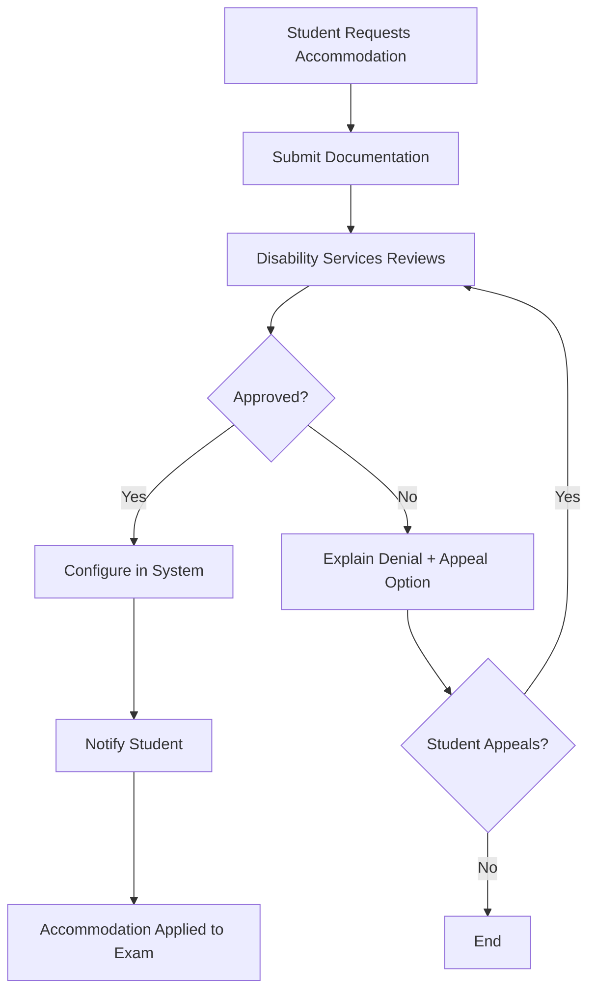

# Accessibility Documentation

## Overview

CertificationExam is committed to providing an accessible examination and certification experience for all students, regardless of disabilities or access needs. The system complies with **WCAG 2.1 Level AA** standards and provides comprehensive accommodations to ensure fair and equitable assessment.

### Accessibility Principles
- **Perceivable**: Information must be presentable to users in ways they can perceive
- **Operable**: Interface components must be operable by all users
- **Understandable**: Information and operation must be understandable
- **Robust**: Content must be robust enough to work with current and future assistive technologies

---

## WCAG 2.1 AA Compliance

### 1. Perceivable

#### Text Alternatives (1.1)
- **Alt text for images**: All exam images have descriptive alt text
- **Captions for videos**: All video content includes captions
- **Audio descriptions**: Complex visuals have audio descriptions
- **Math equations**: Accessible via MathJax/MathML

```html
<!-- Example: Accessible image in exam question -->

```

#### Time-Based Media (1.2)
- **Captions**: All pre-recorded and live audio/video has captions
- **Audio descriptions**: Provided for all video content
- **Sign language**: Available for critical content (on request)

#### Adaptable Content (1.3)
- **Semantic HTML**: Proper heading hierarchy (H1, H2, H3)
- **Programmatic structure**: Tables use `<thead>`, `<tbody>`, `<th scope>`
- **Meaningful sequence**: Content order makes sense when linearized
- **Sensory characteristics**: Instructions don't rely solely on shape, color, or location

```html
<!-- Example: Properly structured table -->
<table>
    <caption>Exam Results Breakdown</caption>
    <thead>
        <tr>
            <th scope="col">Section</th>
            <th scope="col">Score</th>
            <th scope="col">Weight</th>
        </tr>
    </thead>
    <tbody>
        <tr>
            <th scope="row">Multiple Choice</th>
            <td>85%</td>
            <td>40%</td>
        </tr>
    </tbody>
</table>
```

#### Distinguishable (1.4)
- **Color contrast**: 4.5:1 minimum for text, 3:1 for large text
- **Color independence**: Information not conveyed by color alone
- **Text resizing**: Text can be resized to 200% without loss of functionality
- **Images of text**: Avoided except for logos
- **Reflow**: Content reflows at 320px width without horizontal scrolling

**Color Contrast Examples**:
```css
/* WCAG AA Compliant Colors */
.text-normal {
    color: #1F2937;  /* Dark gray */
    background: #FFFFFF;  /* White */
    /* Contrast ratio: 16.1:1 ✅ */
}

.text-large {
    color: #4B5563;  /* Medium gray */
    background: #FFFFFF;
    /* Contrast ratio: 9.7:1 ✅ */
}

.button-primary {
    color: #FFFFFF;
    background: #2563EB;  /* Blue */
    /* Contrast ratio: 7.5:1 ✅ */
}
```

---

### 2. Operable

#### Keyboard Accessible (2.1)
- **All functionality via keyboard**: No mouse-only interactions
- **No keyboard traps**: Users can navigate away from all components
- **Keyboard shortcuts**: Documented and customizable
- **Focus indicators**: Clear visual focus indicators (2px outline)

**Keyboard Navigation**:
```
Tab          - Next focusable element
Shift+Tab    - Previous focusable element
Enter/Space  - Activate button/link
Arrow keys   - Navigate within component (e.g., radio buttons)
Esc          - Close dialog/modal
Home/End     - First/last element in list
```

#### Enough Time (2.2)
- **Adjustable time limits**: Students can extend time before expiration
- **Pause, stop, hide**: Auto-updating content can be paused
- **No time limit on reading**: Questions don't auto-advance
- **Re-authentication**: Session timeout with warning (5 min before expiration)

**Time Extension Example**:
```yaml
time_limits:
  default_exam_duration: 120  # minutes
  
  accommodations:
    time_and_half: 180  # 1.5x time
    double_time: 240    # 2x time
    unlimited: null     # No time limit
  
  warnings:
    - at_minutes_remaining: 10
      message: "10 minutes remaining. You may request additional time."
      show_extension_button: true
    - at_minutes_remaining: 5
      message: "5 minutes remaining."
    - at_minutes_remaining: 1
      message: "1 minute remaining."
```

#### Seizures and Physical Reactions (2.3)
- **No flashing content**: Nothing flashes more than 3 times per second
- **Animation control**: Users can disable animations

```css
/* Respect user's motion preferences */
@media (prefers-reduced-motion: reduce) {
    * {
        animation-duration: 0.01ms !important;
        animation-iteration-count: 1 !important;
        transition-duration: 0.01ms !important;
    }
}
```

#### Navigable (2.4)
- **Skip links**: "Skip to main content" link at top
- **Page titles**: Descriptive, unique page titles
- **Focus order**: Logical tab order
- **Link purpose**: Link text describes destination
- **Multiple ways**: Multiple ways to find pages (menu, search, sitemap)
- **Headings and labels**: Descriptive headings and labels
- **Focus visible**: Keyboard focus is visible (no outline: none)

```html
<!-- Skip link -->
<a href="#main-content" class="skip-link">
    Skip to main content
</a>

<!-- Descriptive page title -->
<title>Exam: NLP Transformers - Question 5 of 20 - CertificationExam</title>
```

#### Input Modalities (2.5)
- **Pointer gestures**: All multi-point or path-based gestures have single-pointer alternative
- **Pointer cancellation**: Can cancel accidental clicks
- **Label in name**: Visual label matches accessible name
- **Motion actuation**: No motion-based actions (e.g., shake to undo)

---

### 3. Understandable

#### Readable (3.1)
- **Language of page**: HTML lang attribute set
- **Language of parts**: Foreign language passages marked
- **Readability**: Text at appropriate reading level (Flesch-Kincaid)

```html
<html lang="en">
    <p>The exam covers <span lang="fr">raison d'être</span> of transformers.</p>
</html>
```

#### Predictable (3.2)
- **On focus**: Focus doesn't trigger unexpected changes
- **On input**: Changing settings doesn't automatically submit
- **Consistent navigation**: Navigation in same location across pages
- **Consistent identification**: Icons/buttons have consistent meaning

#### Input Assistance (3.3)
- **Error identification**: Errors clearly identified and described
- **Labels and instructions**: Form fields have labels
- **Error suggestions**: Suggestions provided for correcting errors
- **Error prevention**: Confirmations for important actions

```html
<!-- Accessible form field -->
<label for="student-id">
    Student ID <span class="required" aria-label="required">*</span>
</label>
<input 
    id="student-id" 
    type="text" 
    required 
    aria-required="true"
    aria-describedby="student-id-help"
    aria-invalid="false"
/>
<span id="student-id-help" class="help-text">
    Enter your 8-digit student ID
</span>

<!-- Error state -->
<input 
    id="student-id" 
    type="text" 
    required 
    aria-required="true"
    aria-describedby="student-id-error"
    aria-invalid="true"
    class="error"
/>
<span id="student-id-error" class="error-message" role="alert">
    Student ID must be 8 digits. You entered 7 digits.
</span>
```

---

### 4. Robust

#### Compatible (4.1)
- **Valid HTML**: No parsing errors
- **Name, Role, Value**: All UI components have accessible names and roles
- **Status messages**: Important messages announced to screen readers

**ARIA Landmarks**:
```html
<header role="banner">
    <nav role="navigation" aria-label="Main navigation">
        <!-- Navigation -->
    </nav>
</header>

<main role="main" id="main-content">
    <article role="article">
        <!-- Exam content -->
    </article>
</main>

<aside role="complementary" aria-label="Exam timer">
    <!-- Timer and controls -->
</aside>

<footer role="contentinfo">
    <!-- Footer -->
</footer>
```

**Live Regions**:
```html
<!-- Announce time warnings -->
<div role="status" aria-live="polite" aria-atomic="true">
    <p>5 minutes remaining in exam</p>
</div>

<!-- Announce errors -->
<div role="alert" aria-live="assertive">
    <p>Answer required before proceeding</p>
</div>
```

---

## Accommodations

### Time Accommodations

#### Extended Time
```yaml
extended_time:
  time_and_half:
    multiplier: 1.5
    description: "50% additional time"
    typical_for:
      - "ADHD"
      - "Learning disabilities"
      - "Processing disorders"
  
  double_time:
    multiplier: 2.0
    description: "100% additional time"
    typical_for:
      - "Severe learning disabilities"
      - "Physical disabilities affecting typing speed"
  
  custom_time:
    multiplier: custom  # Set by administrator
    description: "Custom time extension"
```

**Implementation**:
```python
def calculate_exam_duration(
    base_duration: int,
    accommodation: str
) -> int:
    """Calculate exam duration with accommodations"""
    
    multipliers = {
        'time_and_half': 1.5,
        'double_time': 2.0,
        'triple_time': 3.0,
        'unlimited': float('inf'),
    }
    
    multiplier = multipliers.get(accommodation, 1.0)
    
    if multiplier == float('inf'):
        return None  # No time limit
    
    return int(base_duration * multiplier)
```

#### Breaks
```yaml
breaks:
  scheduled_breaks:
    enabled: true
    frequency: 60  # minutes between breaks
    duration: 10   # minutes per break
    pause_timer: true
  
  student_initiated_breaks:
    enabled: true
    max_breaks: 3
    max_total_break_time: 30  # minutes
    pause_timer: true
    
  medical_breaks:
    enabled: true
    unlimited: true
    pause_timer: true
```

---

### Sensory Accommodations

#### Vision Accommodations

**Screen Reader Support**:
- **NVDA** (Windows)
- **JAWS** (Windows)
- **VoiceOver** (macOS, iOS)
- **TalkBack** (Android)

**Tested with**:
```yaml
screen_readers:
  - name: "NVDA"
    version: "2023.1+"
    platform: "Windows"
  - name: "JAWS"
    version: "2023+"
    platform: "Windows"
  - name: "VoiceOver"
    version: "macOS 12+"
    platform: "macOS"
```

**Large Text Mode**:
```css
/* User can increase text size */
.large-text-mode {
    font-size: 1.5rem;  /* 150% of base */
    line-height: 1.6;
}

.extra-large-text-mode {
    font-size: 2rem;  /* 200% of base */
    line-height: 1.8;
}
```

**High Contrast Mode**:
```css
/* High contrast color scheme */
@media (prefers-contrast: high) {
    :root {
        --bg-color: #000000;
        --text-color: #FFFFFF;
        --link-color: #FFFF00;
        --border-color: #FFFFFF;
    }
}

/* User-selectable high contrast themes */
.theme-high-contrast-dark {
    background: #000000;
    color: #FFFFFF;
}

.theme-high-contrast-light {
    background: #FFFFFF;
    color: #000000;
}

.theme-high-contrast-yellow {
    background: #000000;
    color: #FFFF00;
}
```

**Color Blindness Modes**:
```yaml
color_blind_modes:
  protanopia:  # Red-blind
    enabled: true
    palette: "blue-yellow"
  
  deuteranopia:  # Green-blind
    enabled: true
    palette: "blue-orange"
  
  tritanopia:  # Blue-blind
    enabled: true
    palette: "red-green"
```

**Magnification**:
- Browser zoom up to 400%
- Screen magnifier compatible (ZoomText, Magnifier)

#### Hearing Accommodations

**Captions**:
- All video content has closed captions
- Real-time captions for live proctoring (if applicable)

**Visual Alerts**:
- Flash screen border for audio alerts
- Icon indicators for notifications

```javascript
// Example: Visual alert for audio notification
function showVisualAlert(message) {
    // Flash border
    document.body.classList.add('alert-flash');
    setTimeout(() => {
        document.body.classList.remove('alert-flash');
    }, 1000);
    
    // Show notification banner
    const banner = document.createElement('div');
    banner.className = 'alert-banner';
    banner.textContent = message;
    banner.setAttribute('role', 'alert');
    document.body.appendChild(banner);
}
```

```css
.alert-flash {
    animation: borderFlash 1s ease-in-out;
}

@keyframes borderFlash {
    0%, 100% { border: 5px solid transparent; }
    50% { border: 5px solid #EF4444; }
}
```

#### Motor/Physical Accommodations

**Voice Input**:
- Speech-to-text for essay answers
- Voice commands for navigation

```yaml
voice_input:
  enabled: true
  
  commands:
    - "Next question"
    - "Previous question"
    - "Submit answer"
    - "Pause exam"
    - "Read question aloud"
  
  dictation:
    enabled: true
    languages: ["en-US", "es-ES", "fr-FR"]
    auto_punctuation: true
```

**Single-Switch Access**:
- Support for single-switch scanning
- Switch-accessible interface

**Alternative Input Devices**:
- Head pointer
- Eye tracking
- Joystick
- Sip-and-puff

**Reduced Motor Demands**:
- Larger click targets (minimum 44×44 pixels)
- Drag-and-drop alternatives (click to select)

```css
/* Large, easy-to-click buttons */
.button {
    min-width: 44px;
    min-height: 44px;
    padding: 12px 24px;
    font-size: 1rem;
}

/* Extra spacing between interactive elements */
.button + .button {
    margin-left: 16px;
}
```

---

### Cognitive Accommodations

#### Reduced Distraction Interface
```yaml
distraction_reduced:
  enabled: true
  
  features:
    - hide_timer: true  # Hide countdown timer (but still enforce limit)
    - hide_score: true  # Hide running score
    - one_question_per_page: true
    - minimal_ui: true  # Remove unnecessary UI elements
    - plain_background: true  # Solid color, no patterns
    - large_fonts: true
```

**Visual Example**:
```
Standard Interface:
┌─────────────────────────────────────────────┐
│ [Logo] CertificationExam    [Timer: 45:23] │
│ [Progress: 5/20] [Score: 85%]              │
├─────────────────────────────────────────────┤
│ Question 5 of 20                            │
│ [Question text...]                          │
│ [ ] Option A                                │
│ [ ] Option B                                │
│ [Prev] [Next] [Flag] [Calculator] [Help]   │
└─────────────────────────────────────────────┘

Distraction-Reduced:
┌─────────────────────────────────────────────┐
│                                             │
│ Question 5                                  │
│                                             │
│ [Question text...]                          │
│                                             │
│ ( ) Option A                                │
│ ( ) Option B                                │
│                                             │
│         [Previous]  [Next]                  │
│                                             │
└─────────────────────────────────────────────┘
```

#### Text-to-Speech
```yaml
text_to_speech:
  enabled: true
  
  features:
    - read_questions: true
    - read_answers: true
    - read_feedback: true
    - reading_speed: adjustable  # 0.5x - 2x
    - voice: selectable  # Male/Female, different accents
    - highlight_as_reading: true
  
  controls:
    - play_pause
    - skip_forward
    - skip_backward
    - speed_control
```

**Implementation**:
```javascript
// Web Speech API
function readAloud(text) {
    const utterance = new SpeechSynthesisUtterance(text);
    
    // Settings
    utterance.rate = 1.0;  // Speech rate (0.1 - 10)
    utterance.pitch = 1.0;  // Pitch (0 - 2)
    utterance.volume = 1.0;  // Volume (0 - 1)
    utterance.voice = selectedVoice;  // User-selected voice
    
    // Highlight text as it's read
    utterance.onboundary = (event) => {
        highlightWord(event.charIndex);
    };
    
    speechSynthesis.speak(utterance);
}
```

#### Reading Assistance
- **Dyslexia-friendly font**: OpenDyslexic (optional)
- **Line spacing**: Increased line height (1.5 - 2.0)
- **Paragraph spacing**: Extra space between paragraphs
- **Reading ruler**: Highlight current line

```css
/* Dyslexia-friendly mode */
.dyslexia-friendly {
    font-family: 'OpenDyslexic', sans-serif;
    font-size: 1.2rem;
    line-height: 2.0;
    letter-spacing: 0.05em;
    word-spacing: 0.3em;
}

/* Reading ruler */
.reading-ruler {
    position: fixed;
    width: 100%;
    height: 2.5em;
    background: rgba(255, 255, 0, 0.3);
    pointer-events: none;
    z-index: 1000;
}
```

---

### Proctoring Accommodations

#### Relaxed Proctoring for Disabilities

```yaml
proctoring_accommodations:
  vision_impairments:
    - relaxed_gaze_tracking: true
    - screen_reader_allowed: true
    - extended_time_for_room_scan: true
  
  hearing_impairments:
    - audio_monitoring_disabled: true
    - visual_alerts_only: true
  
  motor_impairments:
    - alternative_id_verification: true  # Voice verification instead of showing ID
    - relaxed_face_position: true  # Don't flag if face not centered
    - assistive_device_visible: true  # Allow head pointers, etc. in frame
  
  cognitive:
    - reduced_monitoring_frequency: true
    - gentle_warnings_only: true  # No stern warnings that may cause anxiety
  
  anxiety_disorders:
    - human_proctor_option: true  # Live human instead of AI (less intimidating)
    - private_testing_room: true  # At testing center, not home
```

**Alternative Identity Verification**:
```yaml
id_verification_alternatives:
  standard:
    - face_match: true
    - id_document: true
    - liveness_check: true
  
  vision_impaired:
    - voice_verification: true  # Voice biometrics
    - id_document_with_assistance: true  # Proctor helps position ID
    - family_member_attestation: true  # Verified family member confirms identity
  
  severe_disability:
    - in_person_testing_center: true
    - trusted_proctor: true  # Disability services proctor
```

---

## Alternative Testing Formats

### 1. Oral Exams
```yaml
oral_exam:
  enabled: true
  
  format:
    - video_call: true  # Via Zoom/Teams
    - live_proctor: true
    - recorded: true  # For grading/review
  
  question_delivery:
    - proctor_reads_questions: true
    - student_sees_questions: optional
  
  answer_format:
    - spoken_responses: true
    - demonstrated_knowledge: true
  
  grading:
    - rubric_based: true
    - recorded_for_review: true
```

### 2. Take-Home Exams
```yaml
take_home_exam:
  enabled: true
  
  format:
    - longer_window: true  # 24-72 hours
    - open_book: true
    - no_proctoring: true
  
  submission:
    - written_report: true
    - project_files: true
    - presentation_video: true
```

### 3. Portfolio-Based Assessment
```yaml
portfolio_assessment:
  enabled: true
  
  components:
    - projects_completed: 3+
    - reflective_essays: true
    - skill_demonstrations: true
  
  timeline:
    - throughout_course: true
    - no_single_high_stakes_exam: true
```

---

## Accessibility Testing

### Automated Testing Tools
```yaml
automated_testing:
  tools:
    - axe-core  # Accessibility testing engine
    - Pa11y  # Automated accessibility testing
    - WAVE  # Web accessibility evaluation tool
    - Lighthouse  # Chrome DevTools
  
  frequency: "every_commit"  # CI/CD integration
```

**Example Test**:
```javascript
// Automated accessibility test
const { test, expect } = require('@playwright/test');
const { injectAxe, checkA11y } = require('axe-playwright');

test('Exam page is accessible', async ({ page }) => {
    await page.goto('https://certificationexam.dev/exam/123');
    await injectAxe(page);
    
    // Check entire page
    await checkA11y(page, null, {
        detailedReport: true,
        detailedReportOptions: { html: true }
    });
});
```

### Manual Testing
```yaml
manual_testing:
  screen_readers:
    - NVDA: monthly
    - JAWS: monthly
    - VoiceOver: monthly
  
  keyboard_only: every_release
  
  assistive_technologies:
    - voice_input: quarterly
    - screen_magnification: quarterly
    - switch_access: semi_annually
  
  user_testing:
    - students_with_disabilities: annually
    - accessibility_experts: semi_annually
```

---

## Accommodation Request Process

### Student Requests Accommodation



**Required Documentation**:
```yaml
accommodation_request:
  required_documents:
    - medical_diagnosis: true  # From licensed professional
    - impact_statement: true  # How disability affects exam-taking
    - recommended_accommodations: true
  
  review_timeline:
    - initial_review: 5_business_days
    - appeal_review: 3_business_days
  
  retroactive: false  # Must request before exam registration
```

---

## Compliance & Standards

### Legal Compliance
- **ADA** (Americans with Disabilities Act)
- **Section 508** (Rehabilitation Act)
- **AODA** (Accessibility for Ontarians with Disabilities Act) - Canada
- **EAA** (European Accessibility Act) - EU

### Technical Standards
- **WCAG 2.1 Level AA**
- **ARIA 1.2** (Accessible Rich Internet Applications)
- **Section 508 Standards**

### Certifications
- Annual WCAG 2.1 AA audit by third-party accessibility consultant
- Section 508 VPAT (Voluntary Product Accessibility Template)

---

## Conclusion

CertificationExam provides comprehensive accessibility features:
- ✅ **WCAG 2.1 AA Compliant**: Meets international accessibility standards
- ✅ **Comprehensive Accommodations**: Time, sensory, motor, cognitive
- ✅ **Alternative Formats**: Oral exams, take-home, portfolio
- ✅ **Assistive Technology**: Screen readers, voice input, magnification
- ✅ **Flexible Proctoring**: Accommodations for disabilities
- ✅ **Legal Compliance**: ADA, Section 508, AODA, EAA

This ensures fair, equitable assessment for all students, regardless of disability or access needs.
