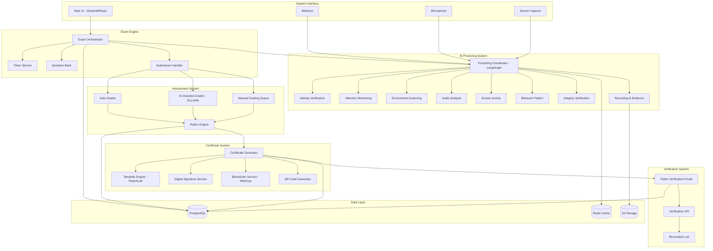
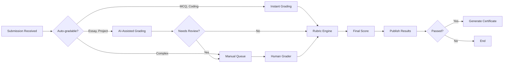
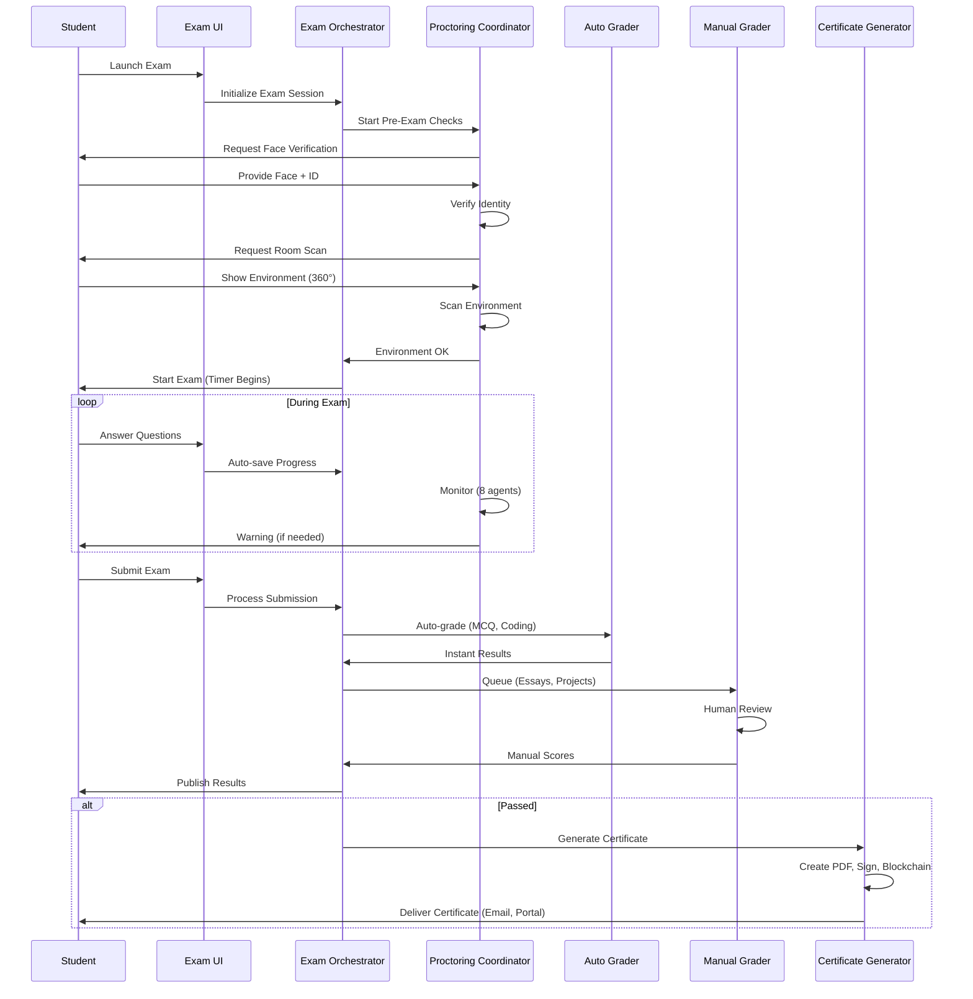
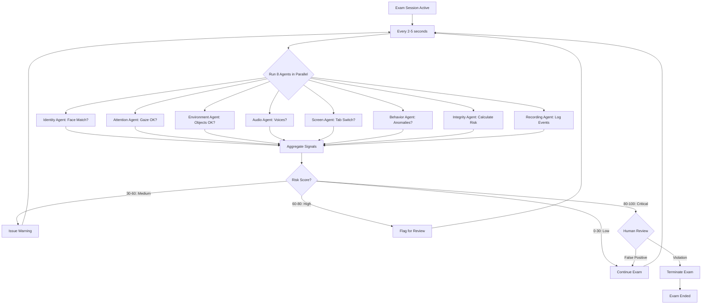
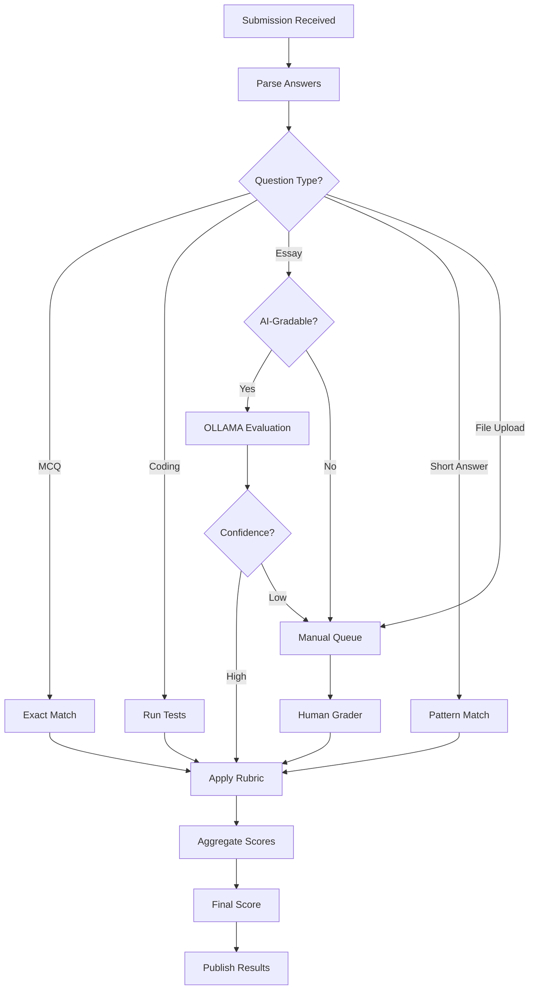

# CertificationExam System Architecture

## System Overview

### Purpose
CertificationExam is an intelligent, fair, and secure remote examination system that combines AI-powered proctoring, flexible rubric-based grading, and blockchain-verified digital certificates to enable trusted remote assessment and credentialing.

### Goals
- **Academic Integrity**: Ensure fair exams through multi-agent AI proctoring while respecting student privacy
- **Flexible Assessment**: Support diverse question types with automated, semi-automated, and manual grading
- **Professional Credentialing**: Issue verifiable, blockchain-backed certificates recognized by employers
- **Accessibility First**: WCAG 2.1 AA compliance with comprehensive accommodations
- **Privacy & Ethics**: Minimal data collection, transparent monitoring, human oversight for critical decisions
- **Seamless Integration**: Work cohesively with CoursesGTM, CoursePlayerApp, and external platforms

### Ethical Considerations
**Privacy First**:
- Face embeddings only (no raw images stored after verification)
- Time-limited recordings (auto-delete after 90 days)
- Encryption at rest and in transit
- Explicit student consent for monitoring

**Fairness & Bias Mitigation**:
- Regular audits for discriminatory patterns in AI proctoring
- Comprehensive accommodations for disabilities
- Human review required for critical violations
- Explainable AI (students can see why they were flagged)

**Proportionality**:
- Monitoring intensity matches exam stakes
- Low-stakes exams: minimal proctoring
- High-stakes exams: comprehensive monitoring with human oversight

---

## High-Level Architecture

### System Components Overview



---

## Component Breakdown

### 1. Exam Engine

**Purpose**: Orchestrate exam delivery, timing, and submission

**Components**:
- **Exam Orchestrator**: Main controller coordinating all exam activities
  - Launch pre-exam checks (identity, environment)
  - Start/stop timer
  - Handle student navigation (previous/next question)
  - Trigger auto-save every 30 seconds
  - Process submission

- **Timer Service**: Manage time limits and warnings
  - Track total exam time
  - Per-question time limits (optional)
  - Grace period after expiration (e.g., 2 minutes)
  - Warnings at 10 min, 5 min, 1 min remaining
  - Auto-submit on hard deadline

- **Question Bank**: Store and retrieve questions
  - CRUD operations for questions
  - Question randomization (different order per student)
  - Question pools (random selection)
  - Question versioning
  - Media support (images, audio, video)

- **Submission Handler**: Process exam submissions
  - Validate answers
  - Timestamp submission
  - Route to appropriate grading pipeline
  - Generate submission receipt

**Technology Stack**:
- Python 3.10+ (FastAPI backend)
- PostgreSQL (persistent storage)
- Redis (session state, real-time data)

---

### 2. AI Proctoring System

**Purpose**: Monitor exam sessions for academic integrity violations

**Architecture**: 8 specialist agents coordinated by LangGraph

**Proctoring Coordinator (LangGraph)**:
- Orchestrates all 8 agents running in parallel
- Aggregates signals every 2-5 seconds
- Maintains shared state (student attention, risk score, incidents)
- Makes decisions (continue, warn, flag, terminate)
- Implements human-in-the-loop for critical violations

**State Management**:
```python
ProctoringState = {
    "session_id": str,
    "student_id": str,
    "exam_id": str,
    "start_time": datetime,
    "current_risk_score": float,  # 0-100
    "incidents": List[Incident],
    "warnings_issued": int,
    "face_verified": bool,
    "environment_verified": bool,
    "attention_level": str,  # "focused", "distracted", "absent"
    "agent_signals": Dict[str, AgentSignal],
}
```

**8 Specialist Agents**: See [PROCTORING_AGENTS.md](./PROCTORING_AGENTS.md) for detailed specifications.

**Technology Stack**:
- LangGraph (agent orchestration)
- MediaPipe, OpenCV (computer vision)
- face_recognition, DeepFace (face verification)
- Whisper, pyannote.audio (audio analysis)
- YOLO (object detection)
- scikit-learn (anomaly detection)
- Redis (real-time state)

---

### 3. Assessment System

**Purpose**: Grade exams using auto-grading, AI-assisted grading, and manual review

**Grading Pipeline**:



**Auto Grader**:
- **MCQ**: Exact match against answer key
- **Coding**: Run unit tests, check output, performance analysis
- **Fill-in-blank**: Exact or fuzzy match
- **Short answer**: Pattern matching, keyword detection

**AI-Assisted Grader (OLLAMA)**:
- Essay evaluation against rubric criteria
- Suggests scores with explanations
- Plagiarism detection
- Human grader reviews and approves/adjusts

**Manual Grading Queue**:
- Projects, complex essays, subjective assessments
- Blind grading option (hide student identity)
- Multiple graders for high-stakes exams
- Grader calibration system

**Rubric Engine**:
- Parse YAML rubric definitions
- Calculate weighted scores
- Aggregate across multiple criteria
- Generate detailed feedback

**Technology Stack**:
- OLLAMA (AI grading)
- pytest, unittest (code execution sandboxes)
- pylint, flake8 (code quality)
- PostgreSQL (grading data)

---

### 4. Certificate Generator

**Purpose**: Create professional, verifiable digital certificates

**Components**:

**Template Engine**:
- Parse JSON template definitions
- Render certificates as PDFs (ReportLab)
- Support custom fonts, images, backgrounds
- Dynamic field substitution

**Digital Signature Service**:
- RSA-2048 or Ed25519 cryptographic signing
- Sign certificate hash
- Embed signature in PDF metadata
- Visual signature placement
- Multi-signer support (instructor, dean, CEO)

**QR Code Generator**:
- Generate QR with verification URL
- Embed certificate ID + checksum
- Configurable size and error correction

**Blockchain Service** (optional):
- Store certificate hash on Ethereum/Polygon
- Smart contract integration
- Return transaction hash
- Optional NFT minting

**Delivery**:
- Email with PDF attachment (SendGrid/SES)
- Student dashboard download
- LinkedIn integration
- Digital wallet (Apple/Google)

**Technology Stack**:
- ReportLab, Pillow (PDF/image generation)
- cryptography (digital signatures)
- qrcode (QR generation)
- Web3.py (blockchain)
- AWS S3/Cloudflare R2 (storage)

---

### 5. Verification Portal

**Purpose**: Public verification of certificate authenticity

**Features**:
- **Web Portal**: `https://gai-observe.online/verify`
  - Certificate ID lookup
  - QR code scan (camera or upload)
  - PDF upload (extract ID from metadata)

- **Verification API**: REST API for employers
  - API key authentication
  - Rate limiting (100 requests/hour)
  - Audit logging

- **Revocation System**:
  - Revoke certificates (academic dishonesty)
  - Public revocation list
  - Verification checks revocation status

**Technology Stack**:
- FastAPI (web portal and API)
- PostgreSQL (certificate registry)
- Redis (rate limiting, caching)

---

## Technology Stack Summary

### Backend
- **Python 3.10+**: Primary language
- **FastAPI**: Web framework
- **LangGraph**: Agent orchestration
- **OLLAMA**: AI grading

### Computer Vision & Audio
- **MediaPipe**: Face mesh, pose estimation
- **OpenCV**: Video processing
- **face_recognition**: Face verification
- **DeepFace**: Liveness detection
- **YOLO**: Object detection
- **Whisper**: Audio transcription
- **pyannote.audio**: Speaker diarization

### Document Generation
- **ReportLab**: PDF generation
- **Pillow**: Image processing
- **qrcode**: QR code generation

### Blockchain
- **Web3.py**: Ethereum/Polygon integration
- **ethers.js**: Frontend blockchain interaction

### Data Storage
- **PostgreSQL**: Primary database
  - Exam definitions
  - Student submissions
  - Grades
  - Certificates
- **Redis**: Real-time state
  - Proctoring state
  - Session data
  - Rate limiting
- **AWS S3 / Cloudflare R2**: Object storage
  - Proctoring recordings
  - Certificate PDFs
  - Media files

### Frontend
- **Streamlit**: Rapid prototyping UI
- **React**: Production UI (optional)
- **TailwindCSS**: Styling

### DevOps
- **Docker**: Containerization
- **Kubernetes**: Orchestration (for scale)
- **GitHub Actions**: CI/CD

---

## Data Flow Diagrams

### Student Exam Journey



### Proctoring Workflow



### Grading Workflow



---

## Privacy & Ethics

### FERPA Compliance
- **Educational Records**: Exam submissions are educational records
- **Access Control**: Only authorized staff can access grades
- **Student Rights**: Students can view/export their data
- **Consent**: Students consent to proctoring before exam

### GDPR Considerations
- **Lawful Basis**: Contract (exam requirement) and consent (proctoring)
- **Data Minimization**: Collect only necessary data
- **Right to Erasure**: Delete data on request (after retention period)
- **Data Portability**: Export student data in standard format
- **Breach Notification**: Notify within 72 hours

### Data Retention Policies
- **Exam Submissions**: 3 years (academic record)
- **Proctoring Recordings**: 90 days (or until academic integrity case resolved)
- **Grades**: Permanent (transcript record)
- **Certificates**: Permanent (verification)
- **Audit Logs**: 1 year (compliance)

### Student Privacy Protections
- **Face Embeddings Only**: No raw face images stored after verification
- **Encrypted Storage**: AES-256 at rest, TLS 1.3 in transit
- **Access Logging**: All data access logged
- **No Permanent Surveillance**: Recordings deleted after retention period
- **Transparency**: Students know what's monitored and why

### Bias Mitigation in AI Proctoring
- **Diverse Training Data**: Face recognition trained on diverse datasets
- **Regular Audits**: Monthly bias testing (false positive rates by demographics)
- **Human Oversight**: Critical decisions require human review
- **Explainability**: Students can see why they were flagged
- **Appeals Process**: Students can appeal integrity violations
- **Accommodations**: Relaxed rules for disabilities

---

## Scalability & Performance

### System Capacity
- **Concurrent Exams**: 100+ simultaneous exam sessions
- **Students per Exam**: Up to 1,000 students per exam instance
- **Proctoring Latency**: < 5 seconds (signal to decision)
- **Grading Throughput**: 
  - MCQ: Instant (< 1 second)
  - Coding: < 30 seconds
  - Essays: 2-5 minutes (AI-assisted)
  - Manual: Dependent on grader availability

### Infrastructure
- **Load Balancing**: Distribute across multiple servers
- **Horizontal Scaling**: Add more workers for proctoring/grading
- **CDN**: Serve static assets (exam media) from CDN
- **Database Optimization**: Indexing, query optimization, read replicas
- **Caching**: Redis for frequently accessed data

### Monitoring & Alerting
- **Application Monitoring**: Prometheus, Grafana
- **Error Tracking**: Sentry
- **Performance Monitoring**: New Relic, DataDog
- **Uptime Monitoring**: PingDom, StatusCake
- **Alerts**: PagerDuty for critical issues

---

## Security Considerations

### Authentication & Authorization
- **Student Authentication**: OAuth 2.0, SSO integration
- **Role-Based Access Control (RBAC)**:
  - Student: Take exams, view own results
  - Grader: Access grading queue
  - Instructor: Create exams, view results
  - Admin: Full access

### Data Encryption
- **At Rest**: AES-256 (database, file storage)
- **In Transit**: TLS 1.3 (all network communication)
- **Key Management**: AWS KMS, Azure Key Vault

### Exam Security
- **Question Bank Protection**: Encrypted, access-logged
- **Answer Key Protection**: Encrypted, grader-only access
- **Session Tokens**: Short-lived, cryptographically secure
- **Browser Lockdown**: Optional (disable DevTools, right-click)

### Certificate Security
- **Digital Signatures**: RSA-2048 or Ed25519
- **Blockchain Immutability**: Certificate hashes on-chain
- **Revocation**: Public revocation list

---

## Future Enhancements

### Phase 2 Features
- **Adaptive Exams**: Questions adjust based on student performance
- **Live Proctoring**: Human proctors via video call (high-stakes exams)
- **Peer Review**: Students review each other's work
- **Exam Analytics**: Detailed analytics for instructors (question difficulty, discrimination index)
- **Mobile App**: Take exams on mobile devices

### Phase 3 Features
- **VR Exams**: Immersive exam environments (Meta Quest, Vision Pro)
- **Biometric Authentication**: Fingerprint, iris scan
- **Advanced AI Grading**: GPT-4/Claude for complex essays
- **Global Exam Centers**: Partner with physical test centers

---

## Conclusion

CertificationExam provides a comprehensive solution for remote examination and credentialing:
- ✅ **Secure**: AI proctoring + human oversight
- ✅ **Fair**: Bias mitigation + accommodations
- ✅ **Flexible**: Multiple question types + grading methods
- ✅ **Verifiable**: Blockchain-backed certificates
- ✅ **Compliant**: FERPA, GDPR, WCAG 2.1 AA
- ✅ **Integrated**: Works with CoursesGTM, CoursePlayerApp

This architecture enables trusted remote assessment at scale while respecting student privacy and maintaining academic integrity.
