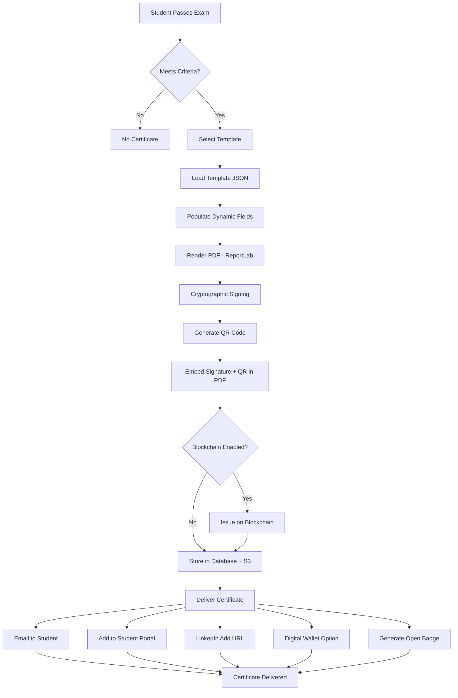

# Certificate Generation System Documentation

## Overview

The Certificate Generation System creates professional, verifiable digital certificates for students who successfully complete exams. Certificates feature customizable templates, cryptographic digital signatures, QR code verification, optional blockchain integration, and support for industry standards like Open Badges.

### Key Features
- **Template Designer**: Visual drag-drop editor for custom certificate layouts
- **Digital Signatures**: RSA-2048/Ed25519 cryptographic signing
- **QR Code Verification**: Instant verification via smartphone
- **Blockchain Integration**: Immutable proof on Ethereum/Polygon (optional)
- **Multi-Format Delivery**: PDF, digital wallet, LinkedIn, Open Badges
- **Multi-Signer Support**: Multiple authorized signatories
- **Brand Customization**: Logos, fonts, colors, backgrounds

---

## Certificate Template Designer

### Visual Template Editor

**Features**:
- Drag-and-drop interface for positioning elements
- Real-time preview
- Grid snapping for precise alignment
- Undo/redo support
- Template versioning
- Import/export templates

**Customizable Elements**:

#### 1. **Layout & Page Setup**
```yaml
template:
  id: "modern_professional_v1"
  name: "Modern Professional Certificate"
  page_size: "letter"  # letter, a4, legal, custom
  orientation: "landscape"  # landscape, portrait
  dimensions:
    width: 11  # inches (if custom)
    height: 8.5
  margins:
    top: 0.5
    bottom: 0.5
    left: 0.5
    right: 0.5
  dpi: 300  # for high-quality printing
```

#### 2. **Background**
```yaml
background:
  type: "gradient"  # color, image, gradient, pattern
  
  # For solid color
  color: "#FFFFFF"
  
  # For gradient
  gradient:
    type: "linear"  # linear, radial
    angle: 45  # degrees
    colors:
      - color: "#1E3A8A"
        position: 0
      - color: "#3B82F6"
        position: 100
  
  # For image
  image:
    url: "s3://bucket/backgrounds/diploma_bg.jpg"
    opacity: 0.1
    position: "center"  # center, top, bottom, left, right
    size: "cover"  # cover, contain, stretch
  
  # For pattern
  pattern:
    type: "dots"  # dots, lines, grid, watermark
    color: "#E5E7EB"
    spacing: 20
```

#### 3. **Border**
```yaml
border:
  enabled: true
  style: "double"  # single, double, ornate, none
  width: 3  # pixels
  color: "#1F2937"
  padding: 20  # pixels from edge
  corner_radius: 10  # rounded corners
```

#### 4. **Dynamic Elements**

##### Logo
```yaml
elements:
  - type: "logo"
    id: "institution_logo"
    position:
      x: 100  # pixels from left
      y: 50   # pixels from top
    size:
      width: 150
      height: 150
    image_url: "s3://bucket/logos/university_logo.png"
    alignment: "center"
    opacity: 1.0
```

##### Text Fields
```yaml
  - type: "text"
    id: "certificate_title"
    content: "Certificate of Achievement"
    position:
      x: 550  # centered
      y: 150
    font:
      family: "Playfair Display"  # custom font upload
      size: 48
      weight: "bold"  # normal, bold, light
      style: "normal"  # normal, italic
      color: "#1F2937"
    alignment: "center"
    text_transform: "uppercase"  # uppercase, lowercase, capitalize, none
```

##### Dynamic Data Fields
```yaml
  - type: "dynamic_text"
    id: "student_name"
    field: "student.full_name"  # Variable from data
    position:
      x: 550
      y: 300
    font:
      family: "Great Vibes"  # Script font for elegance
      size: 56
      color: "#1F2937"
    alignment: "center"
    prefix: ""  # Optional prefix
    suffix: ""  # Optional suffix
    
  - type: "dynamic_text"
    id: "course_title"
    field: "course.title"
    position:
      x: 550
      y: 380
    font:
      family: "Lato"
      size: 24
      color: "#4B5563"
    alignment: "center"
    
  - type: "dynamic_text"
    id: "completion_date"
    field: "completion.date"
    position:
      x: 550
      y: 450
    font:
      family: "Lato"
      size: 18
      color: "#6B7280"
    alignment: "center"
    format: "MMMM DD, YYYY"  # Date formatting
    
  - type: "dynamic_text"
    id: "grade"
    field: "exam.grade"
    position:
      x: 550
      y: 500
    font:
      family: "Lato"
      size: 20
      weight: "bold"
      color: "#059669"
    alignment: "center"
    prefix: "Grade: "
    
  - type: "dynamic_text"
    id: "certificate_id"
    field: "certificate.id"
    position:
      x: 100
      y: 650
    font:
      family: "Courier New"
      size: 10
      color: "#9CA3AF"
    alignment: "left"
```

##### Signature Fields
```yaml
  - type: "signature"
    id: "instructor_signature"
    signer_role: "instructor"
    position:
      x: 300
      y: 550
    size:
      width: 200
      height: 60
    image_url: "s3://bucket/signatures/instructor_sig.png"
    
  - type: "text"
    id: "instructor_name"
    content: "Dr. Jane Smith"
    field: "signers.instructor.name"
    position:
      x: 400
      y: 620
    font:
      family: "Lato"
      size: 14
      color: "#1F2937"
    alignment: "center"
    
  - type: "text"
    id: "instructor_title"
    content: "Course Instructor"
    position:
      x: 400
      y: 640
    font:
      family: "Lato"
      size: 10
      color: "#6B7280"
    alignment: "center"
    
  # Multiple signers
  - type: "signature"
    id: "dean_signature"
    signer_role: "dean"
    position:
      x: 700
      y: 550
    # ... similar structure
```

##### QR Code
```yaml
  - type: "qr_code"
    id: "verification_qr"
    position:
      x: 950
      y: 600
    size:
      width: 100
      height: 100
    data: "https://gai-observe.online/verify/{certificate.id}"
    error_correction: "M"  # L, M, Q, H
    border: 2  # modules
    
  - type: "text"
    id: "qr_label"
    content: "Scan to Verify"
    position:
      x: 1000
      y: 710
    font:
      family: "Lato"
      size: 8
      color: "#6B7280"
    alignment: "center"
```

##### Decorative Elements
```yaml
  - type: "image"
    id: "decorative_seal"
    position:
      x: 50
      y: 550
    size:
      width: 120
      height: 120
    image_url: "s3://bucket/seals/gold_seal.png"
    opacity: 0.9
    
  - type: "line"
    id: "divider_line"
    start:
      x: 200
      y: 350
    end:
      x: 900
      y: 350
    width: 2
    color: "#D1D5DB"
    style: "solid"  # solid, dashed, dotted
```

---

## Template JSON Schema (Complete Example)

```json
{
  "template_id": "modern_professional_v1",
  "name": "Modern Professional Certificate",
  "version": "1.0.0",
  "created_by": "admin",
  "created_at": "2026-01-10T00:00:00Z",
  
  "page": {
    "size": "letter",
    "orientation": "landscape",
    "dimensions": {
      "width": 11,
      "height": 8.5,
      "unit": "inches"
    },
    "dpi": 300,
    "margins": {
      "top": 0.5,
      "bottom": 0.5,
      "left": 0.5,
      "right": 0.5
    }
  },
  
  "background": {
    "type": "gradient",
    "gradient": {
      "type": "linear",
      "angle": 45,
      "colors": [
        {"color": "#F9FAFB", "position": 0},
        {"color": "#FFFFFF", "position": 100}
      ]
    }
  },
  
  "border": {
    "enabled": true,
    "style": "double",
    "width": 3,
    "color": "#1F2937",
    "padding": 20,
    "corner_radius": 0
  },
  
  "elements": [
    {
      "type": "logo",
      "id": "institution_logo",
      "position": {"x": 475, "y": 40},
      "size": {"width": 150, "height": 150},
      "image_url": "{{organization.logo_url}}",
      "alignment": "center"
    },
    {
      "type": "text",
      "id": "cert_title",
      "content": "Certificate of Completion",
      "position": {"x": 550, "y": 200},
      "font": {
        "family": "Playfair Display",
        "size": 48,
        "weight": "bold",
        "color": "#1F2937"
      },
      "alignment": "center",
      "text_transform": "uppercase"
    },
    {
      "type": "dynamic_text",
      "id": "student_name",
      "field": "student.full_name",
      "position": {"x": 550, "y": 300},
      "font": {
        "family": "Great Vibes",
        "size": 56,
        "color": "#1F2937"
      },
      "alignment": "center"
    },
    {
      "type": "text",
      "id": "completion_text",
      "content": "has successfully completed",
      "position": {"x": 550, "y": 360},
      "font": {
        "family": "Lato",
        "size": 18,
        "color": "#6B7280"
      },
      "alignment": "center"
    },
    {
      "type": "dynamic_text",
      "id": "course_title",
      "field": "course.title",
      "position": {"x": 550, "y": 400},
      "font": {
        "family": "Lato",
        "size": 28,
        "weight": "bold",
        "color": "#1F2937"
      },
      "alignment": "center"
    },
    {
      "type": "dynamic_text",
      "id": "date_grade",
      "field": "completion.date_and_grade",
      "position": {"x": 550, "y": 450},
      "font": {
        "family": "Lato",
        "size": 16,
        "color": "#6B7280"
      },
      "alignment": "center",
      "template": "on {date} with a grade of {grade}"
    },
    {
      "type": "signature",
      "id": "instructor_sig",
      "signer_role": "instructor",
      "position": {"x": 250, "y": 520},
      "size": {"width": 200, "height": 60}
    },
    {
      "type": "signature",
      "id": "dean_sig",
      "signer_role": "dean",
      "position": {"x": 650, "y": 520},
      "size": {"width": 200, "height": 60}
    },
    {
      "type": "qr_code",
      "id": "verification_qr",
      "position": {"x": 950, "y": 580},
      "size": {"width": 100, "height": 100},
      "data": "https://gai-observe.online/verify/{{certificate.id}}",
      "error_correction": "M"
    },
    {
      "type": "dynamic_text",
      "id": "cert_id",
      "field": "certificate.id",
      "position": {"x": 100, "y": 660},
      "font": {
        "family": "Courier New",
        "size": 10,
        "color": "#9CA3AF"
      },
      "alignment": "left",
      "prefix": "Certificate ID: "
    }
  ]
}
```

---

## Digital Signature System

### Cryptographic Signing

**Key Generation**:
```python
from cryptography.hazmat.primitives.asymmetric import rsa, ed25519
from cryptography.hazmat.primitives import serialization, hashes
from cryptography.hazmat.primitives.asymmetric import padding

# Option 1: RSA-2048 (widely supported)
def generate_rsa_keypair():
    private_key = rsa.generate_private_key(
        public_exponent=65537,
        key_size=2048,
    )
    public_key = private_key.public_key()
    return private_key, public_key

# Option 2: Ed25519 (modern, faster, smaller)
def generate_ed25519_keypair():
    private_key = ed25519.Ed25519PrivateKey.generate()
    public_key = private_key.public_key()
    return private_key, public_key
```

**Certificate Signing Process**:
```python
import hashlib
import json

def sign_certificate(certificate_data: dict, private_key) -> str:
    """
    Sign certificate with private key
    
    Returns: Base64-encoded signature
    """
    # 1. Create canonical representation
    canonical = json.dumps(certificate_data, sort_keys=True)
    
    # 2. Hash the data
    cert_hash = hashlib.sha256(canonical.encode()).digest()
    
    # 3. Sign the hash
    signature = private_key.sign(
        cert_hash,
        padding.PSS(
            mgf=padding.MGF1(hashes.SHA256()),
            salt_length=padding.PSS.MAX_LENGTH
        ),
        hashes.SHA256()
    )
    
    # 4. Base64 encode
    import base64
    return base64.b64encode(signature).decode()

def verify_certificate(certificate_data: dict, signature: str, public_key) -> bool:
    """Verify certificate signature"""
    import base64
    
    # Decode signature
    signature_bytes = base64.b64decode(signature)
    
    # Hash certificate data
    canonical = json.dumps(certificate_data, sort_keys=True)
    cert_hash = hashlib.sha256(canonical.encode()).digest()
    
    # Verify signature
    try:
        public_key.verify(
            signature_bytes,
            cert_hash,
            padding.PSS(
                mgf=padding.MGF1(hashes.SHA256()),
                salt_length=padding.PSS.MAX_LENGTH
            ),
            hashes.SHA256()
        )
        return True
    except:
        return False
```

**Embedding Signature in PDF**:
```python
from reportlab.pdfgen import canvas
from PyPDF2 import PdfReader, PdfWriter

def embed_signature_in_pdf(pdf_path: str, signature: str, cert_data: dict):
    """Embed cryptographic signature in PDF metadata"""
    
    reader = PdfReader(pdf_path)
    writer = PdfWriter()
    
    # Copy all pages
    for page in reader.pages:
        writer.add_page(page)
    
    # Add metadata
    writer.add_metadata({
        '/CertificateID': cert_data['certificate_id'],
        '/CryptoSignature': signature,
        '/SignedBy': cert_data['signed_by'],
        '/SignedAt': cert_data['signed_at'],
        '/HashAlgorithm': 'SHA256',
        '/SignatureAlgorithm': 'RSA-2048-PSS',
    })
    
    # Write to file
    with open(pdf_path, 'wb') as f:
        writer.write(f)
```

### Visual Signatures

**Signature Image Upload**:
```yaml
signers:
  - id: "instructor_001"
    name: "Dr. Jane Smith"
    title: "Course Instructor"
    role: "instructor"
    signature_image: "s3://bucket/signatures/jane_smith.png"
    public_key: "-----BEGIN PUBLIC KEY-----\n..."
    
  - id: "dean_001"
    name: "Prof. John Doe"
    title: "Dean of Engineering"
    role: "dean"
    signature_image: "s3://bucket/signatures/john_doe.png"
    public_key: "-----BEGIN PUBLIC KEY-----\n..."
```

**Multi-Signer Support**:
```python
def multi_sign_certificate(cert_data: dict, signers: List[dict]) -> dict:
    """Multiple signers sign the same certificate"""
    
    signatures = {}
    for signer in signers:
        # Load signer's private key
        private_key = load_private_key(signer['key_id'])
        
        # Sign certificate
        signature = sign_certificate(cert_data, private_key)
        
        signatures[signer['role']] = {
            'signer_id': signer['id'],
            'name': signer['name'],
            'title': signer['title'],
            'signature': signature,
            'signed_at': datetime.utcnow().isoformat(),
        }
    
    cert_data['signatures'] = signatures
    return cert_data
```

### Key Management

**Secure Storage**:
```yaml
key_storage:
  provider: "aws_kms"  # or "azure_key_vault", "hashicorp_vault"
  
  aws_kms:
    region: "us-east-1"
    key_id: "arn:aws:kms:us-east-1:123456789012:key/12345678-1234-1234-1234-123456789012"
    encryption: "AES_256"
  
  rotation:
    enabled: true
    frequency: "yearly"
    grace_period_days: 90  # Old keys valid for 90 days after rotation
  
  access_control:
    roles:
      - "certificate_generator_service"
      - "verification_service"
    audit_logging: true
```

**Key Rotation**:
```python
def rotate_signing_key():
    """
    Generate new signing key and transition gracefully
    
    Process:
    1. Generate new keypair
    2. Store in KMS with version tag
    3. Update active_key_id
    4. Keep old key for verification (90 days)
    5. After 90 days, revoke old key
    """
    # Generate new key
    new_private_key, new_public_key = generate_rsa_keypair()
    
    # Store in KMS
    key_id = kms_client.create_key(
        KeyUsage='SIGN_VERIFY',
        KeySpec='RSA_2048',
    )
    
    # Update config
    config['active_signing_key'] = key_id
    config['previous_keys'].append({
        'key_id': old_key_id,
        'valid_until': datetime.now() + timedelta(days=90),
    })
    
    # Audit log
    log_key_rotation(old_key_id, key_id)
```

---

## QR Code Verification

### QR Code Generation

```python
import qrcode

def generate_qr_code(certificate_id: str, checksum: str) -> bytes:
    """
    Generate QR code with verification URL
    
    Args:
        certificate_id: Unique certificate identifier
        checksum: Cryptographic checksum for integrity
    
    Returns:
        PNG image bytes
    """
    # Construct verification URL
    url = f"https://gai-observe.online/verify/{certificate_id}?c={checksum}"
    
    # Create QR code
    qr = qrcode.QRCode(
        version=None,  # Auto-size
        error_correction=qrcode.constants.ERROR_CORRECT_M,
        box_size=10,
        border=4,
    )
    qr.add_data(url)
    qr.make(fit=True)
    
    # Generate image
    img = qr.make_image(fill_color="black", back_color="white")
    
    # Convert to bytes
    from io import BytesIO
    buffer = BytesIO()
    img.save(buffer, format='PNG')
    return buffer.getvalue()
```

### Checksum Calculation

```python
def calculate_certificate_checksum(cert_data: dict) -> str:
    """Calculate SHA256 checksum of certificate data"""
    import hashlib
    import json
    
    canonical = json.dumps(cert_data, sort_keys=True)
    checksum = hashlib.sha256(canonical.encode()).hexdigest()
    return checksum[:16]  # First 16 chars for brevity
```

---

## Blockchain Integration

### Smart Contract (Solidity)

```solidity
// SPDX-License-Identifier: MIT
pragma solidity ^0.8.0;

contract CertificateRegistry {
    struct Certificate {
        string certificateId;
        bytes32 certificateHash;
        address issuer;
        uint256 issuedAt;
        bool revoked;
    }
    
    mapping(string => Certificate) public certificates;
    mapping(address => bool) public authorizedIssuers;
    
    event CertificateIssued(
        string indexed certificateId,
        bytes32 certificateHash,
        address issuer,
        uint256 timestamp
    );
    
    event CertificateRevoked(
        string indexed certificateId,
        uint256 timestamp
    );
    
    modifier onlyAuthorized() {
        require(authorizedIssuers[msg.sender], "Not authorized");
        _;
    }
    
    constructor() {
        authorizedIssuers[msg.sender] = true;
    }
    
    function issueCertificate(
        string memory _certificateId,
        bytes32 _certificateHash
    ) public onlyAuthorized {
        require(
            certificates[_certificateId].issuedAt == 0,
            "Certificate already exists"
        );
        
        certificates[_certificateId] = Certificate({
            certificateId: _certificateId,
            certificateHash: _certificateHash,
            issuer: msg.sender,
            issuedAt: block.timestamp,
            revoked: false
        });
        
        emit CertificateIssued(
            _certificateId,
            _certificateHash,
            msg.sender,
            block.timestamp
        );
    }
    
    function verifyCertificate(
        string memory _certificateId,
        bytes32 _certificateHash
    ) public view returns (bool) {
        Certificate memory cert = certificates[_certificateId];
        
        return cert.issuedAt > 0 &&
               cert.certificateHash == _certificateHash &&
               !cert.revoked;
    }
    
    function revokeCertificate(string memory _certificateId) 
        public 
        onlyAuthorized 
    {
        require(
            certificates[_certificateId].issuedAt > 0,
            "Certificate does not exist"
        );
        
        certificates[_certificateId].revoked = true;
        
        emit CertificateRevoked(_certificateId, block.timestamp);
    }
}
```

### Python Integration (Web3.py)

```python
from web3 import Web3
import json

class BlockchainCertificateService:
    def __init__(self, provider_url: str, contract_address: str):
        self.w3 = Web3(Web3.HTTPProvider(provider_url))
        self.contract = self.w3.eth.contract(
            address=contract_address,
            abi=self.load_contract_abi()
        )
    
    def issue_certificate_on_chain(
        self,
        certificate_id: str,
        certificate_hash: str,
        private_key: str
    ) -> str:
        """
        Issue certificate on blockchain
        
        Returns: Transaction hash
        """
        # Convert hash to bytes32
        hash_bytes = self.w3.keccak(text=certificate_hash)
        
        # Build transaction
        account = self.w3.eth.account.from_key(private_key)
        
        txn = self.contract.functions.issueCertificate(
            certificate_id,
            hash_bytes
        ).build_transaction({
            'from': account.address,
            'nonce': self.w3.eth.get_transaction_count(account.address),
            'gas': 200000,
            'gasPrice': self.w3.eth.gas_price,
        })
        
        # Sign transaction
        signed_txn = self.w3.eth.account.sign_transaction(
            txn,
            private_key=private_key
        )
        
        # Send transaction
        tx_hash = self.w3.eth.send_raw_transaction(
            signed_txn.rawTransaction
        )
        
        # Wait for confirmation
        receipt = self.w3.eth.wait_for_transaction_receipt(tx_hash)
        
        return tx_hash.hex()
    
    def verify_certificate_on_chain(
        self,
        certificate_id: str,
        certificate_hash: str
    ) -> bool:
        """Verify certificate exists on blockchain"""
        hash_bytes = self.w3.keccak(text=certificate_hash)
        
        return self.contract.functions.verifyCertificate(
            certificate_id,
            hash_bytes
        ).call()
```

### Gas Optimization (Layer 2)

```yaml
blockchain:
  network: "polygon"  # Polygon (Matic) for lower gas fees
  
  # Alternative: Use rollups for even lower costs
  # network: "optimism"  # or "arbitrum"
  
  contract_address: "0x1234567890123456789012345678901234567890"
  
  gas_settings:
    max_gas_price: 100  # gwei
    priority_fee: 2  # gwei
  
  batch_issuance:
    enabled: true
    batch_size: 50  # Issue 50 certificates in one transaction
    frequency: "hourly"
```

---

## Certificate Delivery

### Email Delivery

```python
import sendgrid
from sendgrid.helpers.mail import Mail, Attachment, FileContent, FileName

def send_certificate_email(
    student_email: str,
    student_name: str,
    certificate_pdf: bytes,
    certificate_id: str
):
    """Send certificate via email"""
    
    message = Mail(
        from_email='certificates@gai-observe.online',
        to_emails=student_email,
        subject=f'Your Certificate of Completion - {certificate_id}',
        html_content=f"""
        <html>
        <body>
            <h2>Congratulations, {student_name}!</h2>
            <p>You have successfully completed the course and earned your certificate.</p>
            <p>Your certificate is attached to this email.</p>
            <p>You can also:</p>
            <ul>
                <li>Download from your student portal</li>
                <li>Verify at: https://gai-observe.online/verify/{certificate_id}</li>
                <li>Add to LinkedIn (instructions below)</li>
            </ul>
            <p>Best regards,<br>GAI-Observe Academy</p>
        </body>
        </html>
        """
    )
    
    # Attach PDF
    attachment = Attachment(
        FileContent(base64.b64encode(certificate_pdf).decode()),
        FileName(f'certificate_{certificate_id}.pdf'),
        FileType('application/pdf'),
        Disposition('attachment')
    )
    message.attachment = attachment
    
    # Send
    sg = sendgrid.SendGridAPIClient(api_key=os.environ['SENDGRID_API_KEY'])
    response = sg.send(message)
    
    return response.status_code == 202
```

### LinkedIn Integration

```python
def generate_linkedin_add_url(certificate_data: dict) -> str:
    """
    Generate LinkedIn 'Add to Profile' URL
    
    LinkedIn Certification format:
    https://www.linkedin.com/profile/add?startTask=CERTIFICATION_NAME
    """
    import urllib.parse
    
    params = {
        'startTask': 'CERTIFICATION_NAME',
        'name': certificate_data['course_title'],
        'organizationId': '12345678',  # LinkedIn org ID
        'issueYear': certificate_data['issue_date'].year,
        'issueMonth': certificate_data['issue_date'].month,
        'certUrl': f"https://gai-observe.online/verify/{certificate_data['certificate_id']}",
        'certId': certificate_data['certificate_id'],
    }
    
    return f"https://www.linkedin.com/profile/add?{urllib.parse.urlencode(params)}"
```

### Digital Wallet (Apple Wallet / Google Pay)

```python
# Apple Wallet (Passkit)
def create_apple_wallet_pass(certificate_data: dict) -> bytes:
    """Create .pkpass file for Apple Wallet"""
    from passkit import Pass
    
    pass_data = Pass(
        passTypeIdentifier='pass.online.gai-observe.certificate',
        organizationName='GAI-Observe Academy',
        teamIdentifier='TEAM123',
        serialNumber=certificate_data['certificate_id'],
        description=f"Certificate: {certificate_data['course_title']}",
    )
    
    # Add fields
    pass_data.addPrimaryField(
        key='student_name',
        label='Student',
        value=certificate_data['student_name']
    )
    
    pass_data.addSecondaryField(
        key='course',
        label='Course',
        value=certificate_data['course_title']
    )
    
    pass_data.addAuxiliaryField(
        key='date',
        label='Completed',
        value=certificate_data['completion_date']
    )
    
    pass_data.addBackField(
        key='cert_id',
        label='Certificate ID',
        value=certificate_data['certificate_id']
    )
    
    # Add barcode (QR code)
    pass_data.addBarcode(
        message=f"https://gai-observe.online/verify/{certificate_data['certificate_id']}",
        format='PKBarcodeFormatQR',
        altText=certificate_data['certificate_id']
    )
    
    return pass_data.create()
```

---

## Open Badges Standard

### Badge Class Definition

```json
{
  "@context": "https://w3id.org/openbadges/v2",
  "type": "BadgeClass",
  "id": "https://gai-observe.online/badges/nlp-transformers-llms",
  "name": "NLP, Transformers & LLMs Certification",
  "description": "Demonstrates mastery of Natural Language Processing, Transformer architectures, and Large Language Models",
  "image": "https://gai-observe.online/badges/images/nlp-badge.png",
  "criteria": {
    "type": "Criteria",
    "narrative": "Complete all course modules, score 80%+ on final exam, and complete capstone project"
  },
  "issuer": {
    "type": "Profile",
    "id": "https://gai-observe.online/organization",
    "name": "GAI-Observe Academy",
    "url": "https://gai-observe.online",
    "email": "badges@gai-observe.online"
  },
  "alignment": [
    {
      "type": "Alignment",
      "targetName": "Artificial Intelligence",
      "targetUrl": "https://www.skillsengine.com/skills/artificial-intelligence"
    }
  ],
  "tags": ["NLP", "Transformers", "LLMs", "AI", "Machine Learning"]
}
```

### Assertion (Individual Badge)

```json
{
  "@context": "https://w3id.org/openbadges/v2",
  "type": "Assertion",
  "id": "https://gai-observe.online/assertions/CERT-2026-NLP-12345",
  "badge": "https://gai-observe.online/badges/nlp-transformers-llms",
  "recipient": {
    "type": "email",
    "hashed": true,
    "salt": "random-salt-123",
    "identity": "sha256$hash-of-student-email"
  },
  "issuedOn": "2026-01-15T00:00:00Z",
  "verification": {
    "type": "hosted",
    "verificationUrl": "https://gai-observe.online/verify/CERT-2026-NLP-12345"
  },
  "evidence": [
    {
      "type": "Evidence",
      "name": "Final Exam Results",
      "description": "Scored 95% on comprehensive final exam",
      "narrative": "Demonstrated exceptional understanding of transformer architectures and LLM fine-tuning"
    }
  ]
}
```

---

## Certificate Generation Workflow



---

## Template Examples

See:
- [Classic Certificate Template](../../CertificationExam/templates/certificates/classic_certificate.json)
- [Modern Certificate Template](../../CertificationExam/templates/certificates/modern_certificate.json)
- [Badge Template](../../CertificationExam/templates/certificates/badge_template.json)

---

## Conclusion

The Certificate Generation System provides:
- ✅ **Professional Design**: Customizable templates for brand consistency
- ✅ **Security**: Cryptographic signatures + blockchain immutability
- ✅ **Verifiability**: QR codes + public verification portal
- ✅ **Interoperability**: Open Badges standard compliance
- ✅ **Convenience**: Multiple delivery formats (email, portal, LinkedIn, wallet)

This system ensures certificates are professional, verifiable, and valuable to students and employers.
