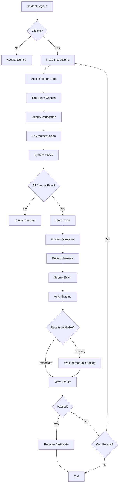

# Exam Management Documentation

## Overview

The Exam Management system provides comprehensive tools for creating, configuring, scheduling, and administering exams. It includes a visual exam builder, question bank management, flexible configuration options, and scheduling capabilities.

### Key Features
- **Drag-Drop Exam Builder**: Visual interface for creating exams
- **Question Bank**: Reusable question library with versioning
- **Flexible Configuration**: Timing, access control, proctoring, grading settings
- **Multiple Scheduling Options**: Fixed schedule, open door, by appointment
- **Question Randomization**: Different question order/pool per student
- **Preview & Testing**: Test exams before publishing
- **Analytics**: Exam performance analytics

---

## Exam Builder

### Visual Exam Builder Interface

**Workflow**:
1. Create new exam or duplicate existing
2. Add/remove questions (drag-drop from question bank)
3. Configure question settings (points, time limit, randomization)
4. Set exam-level settings (duration, access, proctoring)
5. Preview exam (student view)
6. Publish exam

### Exam Builder UI

```
┌────────────────────────────────────────────────────────────┐
│  📝 Exam Builder: NLP Final Exam                          │
├────────────────────────────────────────────────────────────┤
│  [General] [Questions] [Settings] [Preview] [Publish]     │
├──────────────────┬─────────────────────────────────────────┤
│  Question Bank   │  Exam Questions (0/20)                  │
│                  │                                          │
│  🔍 Search...    │  Drop questions here                    │
│                  │                                          │
│  📁 My Questions │  OR                                      │
│  ├─ MCQ (45)     │                                          │
│  ├─ Coding (12)  │  [+ Add New Question]                   │
│  ├─ Essay (8)    │  [+ Add from Bank]                      │
│  └─ Projects (3) │  [+ Add Random from Pool]               │
│                  │                                          │
│  📁 Shared       │                                          │
│  └─ NLP Dept     │                                          │
│                  │                                          │
│  [+ New Question]│                                          │
└──────────────────┴─────────────────────────────────────────┘
```

---

## Question Bank

### Question Structure

```yaml
question:
  id: "q_nlp_transformers_01"
  title: "Transformer Attention Mechanism"
  type: "mcq"  # mcq, coding, essay, short_answer, file_upload, fill_blank
  
  # Content
  prompt: |
    What is the primary advantage of the self-attention mechanism in 
    Transformer models compared to RNNs?
  
  media:
    - type: "image"
      url: "s3://bucket/questions/transformer_diagram.png"
      alt: "Diagram of Transformer architecture"
    - type: "code"
      language: "python"
      content: |
        # Example code snippet
        attention = softmax(Q @ K.T / sqrt(d_k)) @ V
  
  # For MCQ
  options:
    - id: "a"
      text: "Faster training on sequential data"
      correct: false
    - id: "b"
      text: "Parallelizable computation across sequence positions"
      correct: true
    - id: "c"
      text: "Lower memory requirements"
      correct: false
    - id: "d"
      text: "Better performance on short sequences"
      correct: false
  
  # Grading
  points: 2
  rubric_id: "mcq_basic"
  
  # Settings
  time_limit: null  # No time limit for this question
  randomize_options: true
  
  # Metadata
  difficulty: "medium"
  learning_objectives:
    - "Understand transformer architecture"
    - "Compare transformers to RNNs"
  tags: ["transformers", "attention", "nlp"]
  
  # Version control
  version: "1.2"
  created_by: "prof_smith"
  created_at: "2026-01-01T00:00:00Z"
  last_modified: "2026-01-10T00:00:00Z"
  status: "published"  # draft, review, published, archived
```

### Question Types

#### 1. Multiple Choice (MCQ)

```yaml
question:
  type: "mcq"
  
  options:
    - id: "a"
      text: "Option A"
      correct: true
    - id: "b"
      text: "Option B"
      correct: false
  
  settings:
    single_answer: true  # or false for multi-select
    randomize_options: true
    show_answer_after_submit: false
```

#### 2. Coding Challenge

```yaml
question:
  type: "coding"
  
  prompt: "Implement a function to calculate Fibonacci numbers"
  
  starter_code: |
    def fibonacci(n):
        # Your code here
        pass
  
  test_cases:
    - input: 5
      expected_output: 5
    - input: 10
      expected_output: 55
  
  rubric_id: "coding_challenge_rubric"
  
  settings:
    language: "python"
    allowed_imports: ["math"]
    forbidden_imports: ["os", "sys"]
    time_limit: 30  # seconds
    memory_limit: 512  # MB
```

#### 3. Essay

```yaml
question:
  type: "essay"
  
  prompt: |
    Discuss the ethical implications of large language models.
    Your essay should be 500-750 words.
  
  rubric_id: "essay_rubric_analytical"
  
  settings:
    min_words: 500
    max_words: 750
    time_limit: 1800  # 30 minutes
    enable_word_counter: true
    plagiarism_check: true
```

#### 4. Short Answer

```yaml
question:
  type: "short_answer"
  
  prompt: "What does 'BERT' stand for?"
  
  expected_answers:
    - "Bidirectional Encoder Representations from Transformers"
    - "BERT = Bidirectional Encoder Representations from Transformers"
  
  grading:
    method: "pattern_matching"
    fuzzy_match: true
    threshold: 0.85
```

#### 5. File Upload

```yaml
question:
  type: "file_upload"
  
  prompt: |
    Upload your completed machine learning project as a ZIP file.
    Include all code, data, and a README.
  
  settings:
    accepted_formats: [".zip", ".tar.gz"]
    max_file_size: 100  # MB
    required_files:
      - "README.md"
      - "src/*.py"
      - "data/*.csv"
  
  rubric_id: "project_rubric_ml"
```

#### 6. Fill in the Blank

```yaml
question:
  type: "fill_blank"
  
  prompt: "The ____ layer in a neural network applies non-linear transformations."
  
  expected_answers: ["activation"]
  
  grading:
    case_sensitive: false
    fuzzy_match: true
```

---

## Exam Configuration

### General Settings

```yaml
exam:
  id: "exam_nlp_final_2026"
  title: "NLP, Transformers & LLMs - Final Exam"
  description: "Comprehensive final exam covering all course topics"
  course_id: "nlp_transformers_llms"
  
  # Metadata
  created_by: "prof_smith"
  created_at: "2026-01-01T00:00:00Z"
  version: "1.0"
  status: "published"  # draft, published, archived
  
  # Instructions
  instructions: |
    This exam consists of 20 questions across multiple formats.
    You have 2 hours to complete the exam.
    Ensure your webcam and microphone are enabled for proctoring.
    
    Good luck!
  
  # Questions
  questions:
    - question_id: "q_nlp_transformers_01"
      order: 1
      points: 2
    - question_id: "q_coding_tokenizer"
      order: 2
      points: 10
    # ... more questions
  
  total_points: 100
```

### Timing Configuration

```yaml
timing:
  # Total exam duration
  duration: 120  # minutes
  
  # Per-question time limits (optional)
  per_question_time_limits:
    enabled: false
    defaults:
      mcq: 3  # minutes
      coding: 15
      essay: 30
  
  # Grace period after time expires
  grace_period: 2  # minutes (submit-only mode)
  
  # Warnings
  warnings:
    - at_minutes_remaining: 30
      message: "30 minutes remaining"
      type: "info"
    - at_minutes_remaining: 10
      message: "10 minutes remaining"
      type: "warning"
    - at_minutes_remaining: 5
      message: "5 minutes remaining. Please review your answers."
      type: "warning"
    - at_minutes_remaining: 1
      message: "1 minute remaining!"
      type: "alert"
  
  # Auto-submit
  auto_submit_on_timeout: true
  show_timer: true
  allow_timer_hide: true  # Student can hide timer (reduce anxiety)
```

### Access Control

```yaml
access_control:
  # Who can take this exam?
  eligibility:
    - enrolled_in_course: "nlp_transformers_llms"
    - completed_modules: ["module_1", "module_2", "module_3"]
    - minimum_tier: "intermediate"  # Integration with CoursesGTM
    - manual_approval: false
  
  # Exam availability window
  availability:
    start: "2026-01-15T09:00:00Z"
    end: "2026-01-22T23:59:59Z"
  
  # Attempt limits
  attempts:
    max_attempts: 1  # or 2, 3, unlimited
    retry_delay: null  # Time between attempts (e.g., 24 hours)
    keep_best_score: true  # Or average, latest
  
  # Password protection (optional)
  password_protected: false
  password: null
  
  # IP restrictions (optional)
  ip_whitelist: []  # Empty = no restriction
  
  # Prerequisites
  prerequisites:
    - exam_id: "exam_nlp_midterm"
      min_score: 70
```

### Proctoring Settings

```yaml
proctoring:
  enabled: true
  
  # Strictness level
  strictness: "standard"  # relaxed, standard, strict
  
  # Pre-exam checks
  pre_exam:
    identity_verification: true
    environment_scan: true
    system_check: true  # Browser, camera, mic
    human_approval_required: true  # Human reviews environment scan
  
  # During exam
  monitoring:
    face_detection: true
    gaze_tracking: true
    environment_monitoring: true
    audio_monitoring: true
    screen_activity: true
    behavior_analysis: true
  
  # Recording
  recording:
    webcam: true
    screen: false  # Optional
    audio: "incident_only"  # always, incident_only, never
  
  # Actions
  auto_terminate_on_critical: false  # Require human review
  
  # Accommodations
  accommodations_override:
    vision_impaired: "relaxed_gaze_tracking"
    hearing_impaired: "no_audio_monitoring"
```

### Grading Settings

```yaml
grading:
  # Auto-publishing
  auto_publish_results: false  # Publish immediately or wait for manual review
  
  # Feedback
  show_correct_answers: false  # After submission
  show_rubric: true
  show_score_breakdown: true  # Per question
  
  # Review
  allow_answer_review: true  # Student can review answers during exam
  allow_question_flag: true  # Flag for later review
  
  # Manual grading
  manual_grading_required_for:
    - "essay"
    - "file_upload"
  
  # Grading workflow
  grading_workflow:
    - auto_grade_mcq: "immediate"
    - auto_grade_coding: "immediate"
    - ai_assist_essay: "after_submission"
    - manual_review_essays: "within_48_hours"
  
  # Passing criteria
  passing_score: 70  # percentage
  certificate_on_pass: true
```

### Question Randomization

```yaml
randomization:
  # Question order
  randomize_question_order: true
  same_order_for_student: true  # Each student gets different order, but consistent across attempts
  
  # Question pools
  question_pools:
    - pool_id: "mcq_pool_transformers"
      questions: ["q1", "q2", "q3", "q4", "q5"]
      select_count: 3  # Select 3 random questions from pool
      points_per_question: 2
    
    - pool_id: "essay_pool_ethics"
      questions: ["essay1", "essay2", "essay3"]
      select_count: 1
      points_per_question: 20
  
  # Option randomization (for MCQ)
  randomize_mcq_options: true
```

---

## Exam Scheduling

### Scheduling Options

#### 1. Fixed Schedule
Everyone takes exam at the same time

```yaml
schedule:
  type: "fixed"
  
  start_time: "2026-01-15T14:00:00Z"
  
  # Late start window
  late_start_allowed: true
  late_start_window: 15  # minutes (can start up to 15 min late)
  
  # Late finish
  late_finish_penalty: 5  # points per 10 minutes late (or null for no penalty)
```

#### 2. Open Door
Take anytime within a window

```yaml
schedule:
  type: "open_door"
  
  window:
    start: "2026-01-15T00:00:00Z"
    end: "2026-01-22T23:59:59Z"
  
  # Once started, must complete within duration
  continuous_session: true
  
  # Or allow pause/resume
  allow_pause: false
  max_pause_duration: 30  # minutes total
```

#### 3. By Appointment
Student schedules specific time slot

```yaml
schedule:
  type: "appointment"
  
  # Available time slots
  slots:
    - day: "2026-01-15"
      times: ["09:00", "11:00", "14:00", "16:00"]
      capacity: 10  # students per slot
    - day: "2026-01-16"
      times: ["09:00", "11:00", "14:00", "16:00"]
      capacity: 10
  
  # Booking
  booking_opens: "2026-01-08T00:00:00Z"
  booking_closes: "2026-01-14T23:59:59Z"
  allow_reschedule: true
  reschedule_deadline: "24_hours_before"
```

---

## Exam Preview & Testing

### Preview Mode

**Features**:
- View exam as student would see it
- Test question randomization
- Test timer functionality
- Test proctoring integration
- No answers recorded

```python
# Enable preview mode
exam_instance = ExamInstance(
    exam_id="exam_nlp_final_2026",
    student_id="preview_user",
    mode="preview"
)
```

### Test Exam

**Features**:
- Take full exam in test mode
- Record answers for calibration
- Test all integrations (proctoring, grading)
- Results not counted

```yaml
test_exam:
  enabled: true
  
  test_users:
    - user_id: "test_student_1"
    - user_id: "teaching_assistant_1"
  
  test_window:
    start: "2026-01-10T00:00:00Z"
    end: "2026-01-14T23:59:59Z"
```

---

## Exam Analytics

### Exam-Level Analytics

```yaml
analytics:
  exam_stats:
    total_attempts: 156
    completed: 150
    in_progress: 4
    not_started: 2
    
    scores:
      mean: 78.5
      median: 82
      std_dev: 12.3
      min: 45
      max: 98
      
    pass_rate: 0.85  # 85%
    
    time_stats:
      mean_duration: 98  # minutes
      median_duration: 102
      fastest: 65
      slowest: 120
```

### Question-Level Analytics

```yaml
question_analytics:
  - question_id: "q_nlp_transformers_01"
    
    attempts: 150
    correct: 120
    
    difficulty:
      p_value: 0.80  # Proportion correct (80% = easy)
      discrimination_index: 0.45  # How well it separates high/low performers
      
    time_stats:
      mean_time: 2.5  # minutes
      median_time: 2.0
      
    option_distribution:  # For MCQ
      a: 10  # 10 students selected A
      b: 120  # 120 selected B (correct)
      c: 15
      d: 5
    
    common_mistakes:
      - selected_option: "a"
        frequency: 10
        likely_misconception: "Confused with RNN advantage"
```

### Proctoring Analytics

```yaml
proctoring_analytics:
  total_sessions: 150
  
  incidents:
    total: 45
    by_type:
      face_absent: 12
      multiple_faces: 3
      phone_detected: 5
      tab_switching: 20
      suspicious_behavior: 5
  
  violations:
    warnings_issued: 30
    flagged_for_review: 10
    terminated: 2
  
  false_positives: 3  # After human review
```

---

## Exam Administration

### Admin Dashboard

```
┌────────────────────────────────────────────────────────────┐
│  Exam: NLP Final Exam                    [Edit] [Archive]  │
├────────────────────────────────────────────────────────────┤
│  Status: Published                                          │
│  Window: Jan 15 - Jan 22, 2026                             │
│                                                             │
│  📊 Progress                                                │
│  ████████████████░░░░ 156/200 registered (78%)             │
│  ████████████████░░░░ 150/156 completed (96%)              │
│                                                             │
│  📈 Statistics                                              │
│  Mean Score: 78.5%    Pass Rate: 85%                       │
│                                                             │
│  [View Detailed Analytics] [Download Results]              │
├────────────────────────────────────────────────────────────┤
│  🚨 Active Sessions (4)                                     │
│  • Student A - 45 min elapsed - No incidents               │
│  • Student B - 78 min elapsed - 1 warning (face absent)    │
│  • Student C - 12 min elapsed - No incidents               │
│  • Student D - 90 min elapsed - FLAGGED (review required)  │
│                                                             │
│  [Monitor Live]                                            │
├────────────────────────────────────────────────────────────┤
│  ⏳ Pending Grading (12)                                    │
│  • Essays: 8                                               │
│  • Projects: 4                                             │
│                                                             │
│  [Open Grading Queue]                                      │
└────────────────────────────────────────────────────────────┘
```

### Instructor Actions

```yaml
instructor_actions:
  pre_exam:
    - edit_exam
    - preview_exam
    - test_exam
    - publish_exam
    - send_reminder_emails
  
  during_exam:
    - monitor_active_sessions
    - review_proctoring_incidents
    - grant_time_extensions
    - handle_technical_issues
  
  post_exam:
    - view_analytics
    - grade_manually
    - review_flagged_submissions
    - publish_results
    - send_results_emails
```

### Student Experience



---

## Integration with Question Bank

### Import Questions

```yaml
import:
  # From CSV
  from_csv:
    file: "questions.csv"
    mapping:
      title: "column_a"
      prompt: "column_b"
      correct_answer: "column_c"
  
  # From JSON
  from_json:
    file: "questions.json"
    schema: "standard_v1"
  
  # From other systems
  from_moodle_xml: true
  from_blackboard: true
  from_canvas: true
```

### Export Questions

```yaml
export:
  formats:
    - json
    - csv
    - qti  # IMS QTI (Question & Test Interoperability)
    - moodle_xml
  
  include:
    - questions
    - rubrics
    - media_files
```

---

## Best Practices

### Creating Effective Exams

1. **Align with Learning Objectives**: Each question maps to specific learning objective
2. **Mix Question Types**: Combine MCQ, coding, essays for comprehensive assessment
3. **Appropriate Difficulty**: Mix easy (20%), medium (60%), hard (20%)
4. **Clear Instructions**: Unambiguous wording
5. **Realistic Time**: Test yourself before setting duration
6. **Pilot Test**: Have TAs take test exam

### Question Writing Tips

1. **MCQ**:
   - All options plausible
   - Avoid "all of the above", "none of the above"
   - Distractors based on common misconceptions

2. **Coding**:
   - Provide starter code
   - Test edge cases
   - Clear problem statement

3. **Essays**:
   - Specific prompt
   - Clear rubric
   - Suggested structure

### Security

1. **Question Bank Security**:
   - Encrypt question bank
   - Access logging
   - Version control

2. **Prevent Cheating**:
   - Question randomization
   - Question pools
   - Time limits
   - Proctoring

3. **Academic Integrity**:
   - Honor code acknowledgment
   - Clear policies
   - Consistent enforcement

---

## Conclusion

The Exam Management system provides:
- ✅ **Flexible Creation**: Visual builder + question bank
- ✅ **Comprehensive Configuration**: Timing, access, proctoring, grading
- ✅ **Multiple Scheduling**: Fixed, open door, appointment
- ✅ **Randomization**: Questions and options
- ✅ **Analytics**: Detailed performance insights
- ✅ **Integration**: Question import/export, LMS compatibility

This enables instructors to create fair, secure, and effective assessments that accurately measure student learning.
