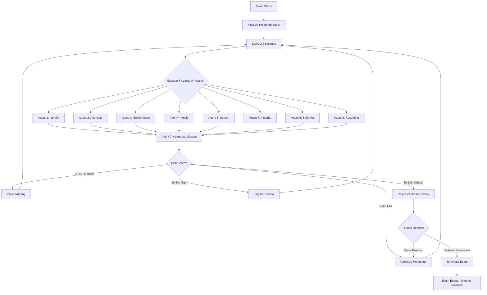
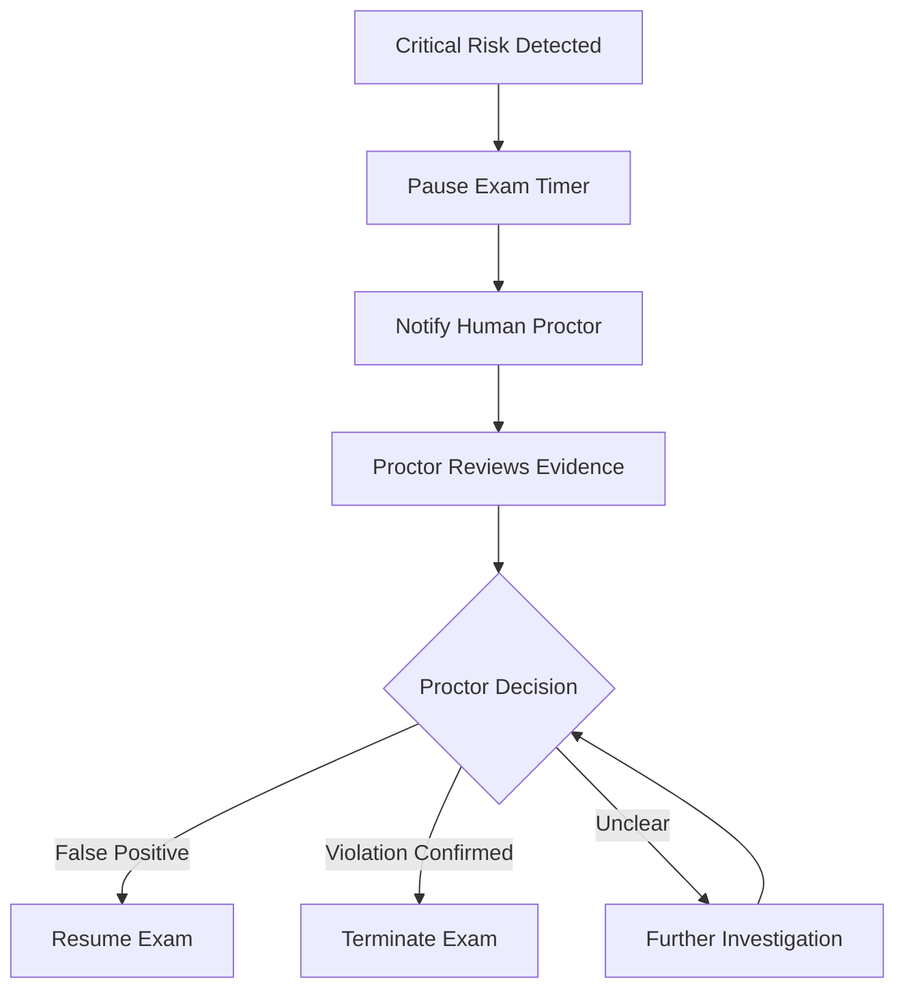

# AI Proctoring Agent Specifications

## Overview

The CertificationExam proctoring system employs **8 specialist invigilator agents** that work in parallel to monitor exam sessions for academic integrity violations. These agents are orchestrated using **LangGraph** to provide comprehensive, fair, and privacy-respecting proctoring.

### Design Principles
- **Privacy-First**: Minimal data collection, short retention, no permanent surveillance
- **Human-in-the-Loop**: AI flags, humans decide critical violations
- **Transparency**: Students know what's being monitored
- **Bias Mitigation**: Regular audits, diverse training data, appeals process
- **Proportionality**: Monitoring intensity matches exam stakes

---

## Orchestration Architecture

### LangGraph Coordinator

The **Proctoring Coordinator** orchestrates all 8 agents using LangGraph state machine:

```python
from langgraph.graph import StateGraph, END

class ProctoringState(TypedDict):
    session_id: str
    student_id: str
    exam_id: str
    start_time: datetime
    current_risk_score: float  # 0-100
    incidents: List[Incident]
    warnings_issued: int
    face_verified: bool
    environment_verified: bool
    attention_level: str  # "focused", "distracted", "absent"
    agent_signals: Dict[str, AgentSignal]
    recording_active: bool
    human_review_requested: bool

class AgentSignal(TypedDict):
    agent_name: str
    timestamp: datetime
    risk_level: str  # "none", "low", "medium", "high", "critical"
    risk_score: float  # 0-100
    details: Dict[str, Any]
    confidence: float  # 0-1
```

### Execution Flow



---

## Agent 1: Identity Verification Agent

### Purpose
Continuous identity authentication throughout the exam session

### Capabilities

#### 1. Face Verification
- **Pre-Exam**: Match live face against registered student photo
- **During Exam**: Periodic re-verification (every 5-10 minutes)
- **Face Detection**: Ensure face is visible and recognizable
- **Face Matching**: Compare face embeddings (similarity threshold: 0.85)

#### 2. ID Document Verification
- **Document Types**: Passport, driver's license, student ID
- **OCR Extraction**: Extract name, photo, ID number
- **Anti-Fraud**: Detect photocopies, screen captures
- **Validation**: Cross-check extracted data with student record

#### 3. Liveness Detection
- **Blink Detection**: Ensure student blinks naturally
- **Head Movement**: Request head turn (left/right)
- **Challenge-Response**: Random prompts (smile, nod, etc.)
- **Anti-Spoofing**: Detect photos, videos, masks, deepfakes

#### 4. Continuous Re-Authentication
- **Periodic Checks**: Verify face every 5-10 minutes
- **Event-Triggered**: Re-verify after face absence
- **Seamless**: No exam interruption (background verification)

### Technologies
- **face_recognition**: Face detection and embedding generation
- **DeepFace**: Multi-backend face recognition (VGG-Face, Facenet, ArcFace)
- **OpenCV**: Video capture, image processing
- **dlib**: Face landmark detection
- **pytesseract**: OCR for ID documents

### Privacy Measures
- **Face Embeddings Only**: 128-dimensional vector, not reversible to image
- **No Raw Storage**: Live face images not stored after verification
- **Encrypted Embeddings**: Face vectors encrypted at rest
- **Time-Limited**: Embeddings deleted after exam retention period (90 days)

### Configuration
```yaml
identity_verification:
  enabled: true
  
  face_verification:
    similarity_threshold: 0.85  # 0-1 (higher = stricter)
    re_verification_interval: 600  # seconds (10 minutes)
    max_verification_failures: 3
  
  liveness_detection:
    enabled: true
    methods: ["blink", "head_movement", "challenge_response"]
    challenge_interval: 1800  # 30 minutes
  
  id_document:
    required: true  # high-stakes exams
    accepted_types: ["passport", "drivers_license", "student_id"]
```

### False Positive Handling
- **Lighting Variation**: Adjust for poor lighting (histogram equalization)
- **Facial Hair Changes**: Relaxed threshold for minor appearance changes
- **Multi-Factor**: Require 2+ failed verifications before flagging
- **Human Review**: All identity failures reviewed by human

### Risk Scoring
- Face not detected: **80 (critical)**
- Face match score < 0.7: **70 (high)**
- Face match score 0.7-0.85: **40 (medium)**
- Liveness check failed: **90 (critical)**
- ID document mismatch: **100 (critical - terminate)**

---

## Agent 2: Attention Monitoring Agent

### Purpose
Track student focus and attention to detect distraction or help from others

### Capabilities

#### 1. Gaze Tracking
- **Eye Direction**: Estimate gaze vector (where student is looking)
- **Screen Focus**: Detect if looking at screen vs. off-screen
- **Reading Patterns**: Analyze eye movement (reading vs. wandering)

#### 2. Face Presence Detection
- **Face Visible**: Is face in frame?
- **Face Occluded**: Is face partially hidden (hand, object)?
- **Face Count**: Multiple faces detected?

#### 3. Head Pose Estimation
- **Pitch**: Head tilt up/down
- **Yaw**: Head turn left/right
- **Roll**: Head tilt sideways
- **Threshold**: > 30° from center considered "looking away"

#### 4. Distraction Detection
- **Prolonged Looking Away**: > 10 seconds → warning
- **Excessive Looking Away**: > 30 seconds → incident
- **Pattern Analysis**: Repeated glances at same off-screen location

### Technologies
- **MediaPipe Face Mesh**: 468 facial landmarks, high precision
- **dlib**: Head pose estimation (Euler angles)
- **OpenCV**: Video processing
- **Eye Aspect Ratio (EAR)**: Blink detection, drowsiness

### Thresholds (Configurable)
```yaml
attention_monitoring:
  enabled: true
  
  gaze_tracking:
    enabled: true
    off_screen_warning_threshold: 10  # seconds
    off_screen_incident_threshold: 30  # seconds
  
  head_pose:
    max_yaw_degrees: 30  # left/right
    max_pitch_degrees: 25  # up/down
    max_roll_degrees: 20  # tilt
  
  face_presence:
    required: true
    absence_warning_threshold: 5  # seconds
    absence_incident_threshold: 15  # seconds
  
  distraction_pattern:
    repeated_glance_threshold: 5  # glances in 60 seconds
    suspicious_direction: "down_right"  # common phone location
```

### Accommodations
- **Relaxed Mode** (vision impairments): Wider thresholds
- **Reading Mode**: Allow down-gaze for reading comprehension passages
- **Note-Taking**: Allow brief down-glances if note-taking permitted

### Risk Scoring
- Face absent 5-15 seconds: **30 (medium)**
- Face absent > 15 seconds: **60 (high)**
- Looking away 10-30 seconds: **40 (medium)**
- Looking away > 30 seconds: **70 (high)**
- Multiple faces detected: **90 (critical)**
- Repeated glances to same off-screen area: **50 (medium)**

---

## Agent 3: Environment Scanning Agent

### Purpose
Ensure exam environment integrity (no unauthorized materials or people)

### Capabilities

#### 1. Pre-Exam Room Scan
- **360° Scan**: Student rotates camera to show entire room
- **Wall Check**: Verify no notes/posters visible
- **Desk Surface**: Check for unauthorized materials
- **Lighting**: Ensure adequate lighting for monitoring

#### 2. Person Counting
- **Face Detection**: Count number of faces
- **Body Detection**: Detect full/partial bodies
- **Movement**: Detect people entering/leaving frame

#### 3. Object Detection
- **Prohibited Items**:
  - Mobile phones
  - Tablets
  - Books, notes, papers
  - Additional monitors
  - Smartwatches
- **Allowed Items** (configurable):
  - Calculator (if permitted)
  - Scratch paper (if permitted)
  - Water bottle

#### 4. Lighting Adequacy Check
- **Brightness**: Histogram analysis
- **Shadows**: Detect heavy shadows obscuring face
- **Backlighting**: Warn if backlit (window behind student)

#### 5. Periodic Environment Checks
- **During Exam**: Re-scan every 15-30 minutes
- **Random Checks**: Unexpected scans to deter cheating
- **Object Tracking**: Ensure prohibited items don't appear

### Technologies
- **YOLO (You Only Look Once)**: Real-time object detection
- **MediaPipe Objectron**: 3D object detection
- **OpenCV**: Image analysis, histogram
- **TensorFlow Object Detection API**: Custom object detection model

### Configuration
```yaml
environment_scanning:
  enabled: true
  
  pre_exam_scan:
    required: true
    minimum_rotation_degrees: 270  # 3/4 rotation
    human_review_required: true  # Human approves environment
  
  periodic_scans:
    enabled: true
    interval: 1800  # 30 minutes
    random_interval: [900, 2700]  # 15-45 minutes
  
  prohibited_objects:
    - "cell_phone"
    - "tablet"
    - "book"
    - "notes"
    - "monitor"
    - "smartwatch"
  
  allowed_objects:
    - "calculator"  # if exam allows
    - "scratch_paper"
    - "water_bottle"
  
  person_detection:
    max_persons: 1
    tolerance: 2  # number of violations before incident
```

### False Positive Handling
- **Posters/Art**: Distinguish from notes (OCR, text density)
- **Reflections**: Ignore mirror reflections
- **Family Members Passing**: Brief presence tolerated (< 5 seconds)
- **Object Similarity**: Phone charger vs. phone (shape analysis)

### Risk Scoring
- Phone detected: **100 (critical - terminate)**
- Book/notes detected: **90 (critical)**
- Additional person detected: **80 (high)**
- Tablet/monitor detected: **85 (high)**
- Smartwatch detected: **60 (medium)**
- Poor lighting: **20 (low - warning only)**

---

## Agent 4: Audio Analysis Agent

### Purpose
Monitor audio for suspicious conversations, external help, or environmental anomalies

### Capabilities

#### 1. Voice Activity Detection (VAD)
- **Speaking Detected**: Is student or someone else speaking?
- **Duration**: Length of speech segments
- **Frequency**: How often speech occurs

#### 2. Speaker Counting
- **Voice Profiles**: Distinguish multiple speakers
- **Speaker Diarization**: Who spoke when?
- **Gender Detection**: Male vs. female voices

#### 3. Keyword Detection
- **Suspicious Phrases**:
  - "What's the answer to..."
  - "Can you help me with..."
  - "Number 5 is..."
  - Common cheating-related keywords
- **Language Detection**: Multi-language support

#### 4. Ambient Noise Analysis
- **Unusual Sounds**:
  - Typing (external keyboard - suspicious if exam is not coding)
  - Phone ringing/notifications
  - Video/audio playback (tutorials)
- **Background Analysis**: Distinguish normal (TV, music) from suspicious

### Technologies
- **Whisper (OpenAI)**: Speech-to-text transcription
- **pyannote.audio**: Speaker diarization, voice activity detection
- **librosa**: Audio feature extraction
- **webrtcvad**: Real-time voice activity detection
- **SpeechBrain**: Speaker recognition

### Privacy Measures
- **Real-Time Processing**: Audio analyzed live, not stored by default
- **Incident Recording Only**: Audio saved only if incident flagged
- **Transcription Privacy**: Transcripts encrypted, auto-deleted after 90 days
- **Consent Required**: Student explicitly consents to audio monitoring

### Configuration
```yaml
audio_analysis:
  enabled: true
  
  voice_activity:
    threshold_db: -30  # dB threshold for voice detection
    min_duration: 2  # seconds (ignore brief utterances)
  
  speaker_counting:
    enabled: true
    max_speakers: 1
    confidence_threshold: 0.8
  
  keyword_detection:
    enabled: true
    keywords:
      - "answer"
      - "help"
      - "number"
      - "question"
      # ... more suspicious phrases
    language: "en"  # or multi-language
  
  ambient_noise:
    detect_typing: true
    detect_phone: true
    detect_playback: true
  
  recording:
    on_incident_only: true
    retention_days: 90
```

### Accommodations
- **Speech-to-Text**: Allow students using assistive tech (not flagged)
- **Read-Aloud**: Text-to-speech for accessibility (student's own voice ignored)
- **Background Noise**: Higher tolerance for students in shared living spaces

### Risk Scoring
- Multiple speakers detected: **80 (high)**
- Suspicious keywords detected: **60 (medium)**
- External typing sounds: **50 (medium)**
- Phone ringing: **40 (medium)**
- Continuous speaking (external help): **90 (critical)**

---

## Agent 5: Screen Activity Agent

### Purpose
Monitor on-screen behavior to detect tab switching, copy-paste, unauthorized applications

### Capabilities

#### 1. Tab Switching Detection
- **Browser Events**: Detect `visibilitychange` events
- **Frequency**: Count tab switches
- **Duration**: Time spent outside exam tab
- **Destination**: Attempt to identify other tabs (limited by browser security)

#### 2. Window Switching Detection
- **Focus Loss**: Detect when exam window loses focus
- **Alt+Tab**: Detect window switching keypresses
- **Application Switching**: Detect switch to other apps (desktop app only)

#### 3. Copy-Paste Events
- **Copy (Ctrl+C)**: Detect copy from exam questions
- **Paste (Ctrl+V)**: Detect paste into answer fields (suspicious)
- **Context**: Paste from where? (clipboard analysis)

#### 4. Screenshot Attempts
- **PrtScn Key**: Detect screenshot keypresses
- **Snipping Tool**: Detect launch of screenshot utilities (desktop)
- **Browser Extensions**: Block screenshot extensions

#### 5. Browser Lockdown Mode (Optional)
- **Fullscreen Enforcement**: Force fullscreen mode
- **Right-Click Disabled**: Prevent "Inspect Element"
- **DevTools Blocked**: Detect/prevent DevTools
- **Console Access**: Block console commands

### Technologies
- **Browser APIs**: 
  - `document.addEventListener('visibilitychange')`
  - `window.addEventListener('blur')`
  - `navigator.clipboard`
  - `screen.orientation`
- **JavaScript Event Listeners**: Keyboard, mouse events
- **Electron** (desktop app): More control over OS-level events
- **Browser Extension**: Additional monitoring capabilities

### Configuration
```yaml
screen_activity:
  enabled: true
  
  tab_switching:
    detection: "strict"  # "relaxed", "standard", "strict"
    warning_threshold: 3  # switches before warning
    incident_threshold: 5  # switches before incident
    allowed_duration_outside: 10  # seconds
  
  copy_paste:
    detect_copy: true
    detect_paste: true
    allow_paste_within_exam: true  # paste between questions
  
  screenshot:
    block_attempts: true
    detect_only: false  # or just detect without blocking
  
  lockdown_mode:
    enabled: false  # optional, for high-stakes exams
    fullscreen_required: true
    disable_right_click: true
    disable_devtools: true
```

### Limitations
- **Browser Sandbox**: Limited OS-level access (web app)
- **User Evasion**: Savvy users can bypass some protections
- **Accessibility**: Lockdown mode may interfere with screen readers

### Risk Scoring
- Tab switch 1-3 times: **20 (low)**
- Tab switch 3-5 times: **40 (medium)**
- Tab switch > 5 times: **70 (high)**
- Copy-paste from external source: **60 (medium)**
- Screenshot attempt: **50 (medium)**
- DevTools opened: **80 (high)**
- Prolonged time outside exam (> 60s): **90 (critical)**

---

## Agent 6: Behavior Pattern Agent

### Purpose
Detect anomalous behavior patterns using machine learning and statistical analysis

### Capabilities

#### 1. Typing Pattern Analysis
- **Typing Speed**: Words per minute (WPM)
- **Rhythm**: Keystroke dynamics (timing between keys)
- **Anomaly Detection**: Sudden change in typing pattern (someone else typing?)
- **Baseline**: Compare to student's normal typing (from practice exams)

#### 2. Mouse Movement Tracking
- **Movement Patterns**: Smooth vs. erratic
- **Click Patterns**: Frequency, locations
- **Hover Time**: Time hovering over options (MCQ)
- **Anomaly**: Unusual patterns (e.g., perfectly straight lines = bot?)

#### 3. Answer Timing Analysis
- **Time per Question**: How long to answer each?
- **Suspiciously Fast**: Correct answers too quickly (answer key?)
- **Suspiciously Slow**: Excessive time (looking up answers?)
- **Pattern**: Burst of fast answers after slow period (got help?)

#### 4. Question Navigation Pattern
- **Linear vs. Jumping**: Do they jump to specific questions?
- **Revisit Pattern**: Which questions revisited?
- **Order**: Out-of-order answering (coordinating with someone?)

#### 5. Known Cheating Behaviors
- **Answer Changing**: Multiple answer changes (receiving answers?)
- **Identical Answers**: Same answers as another student (real-time collusion)
- **Time Correlation**: Answering at same time as another student

### Technologies
- **scikit-learn**: 
  - Isolation Forest (anomaly detection)
  - One-Class SVM
  - Local Outlier Factor (LOF)
- **Statistical Analysis**: 
  - Z-score
  - Standard deviation
  - Confidence intervals
- **Time Series Analysis**: Detect temporal patterns

### Baseline Building
```python
# Build student baseline from practice exams, quizzes
baseline_profile = {
    "avg_typing_speed_wpm": 60,
    "avg_time_per_mcq": 45,  # seconds
    "avg_mouse_velocity": 300,  # pixels/second
    "keystroke_dynamics": {...},
    "navigation_pattern": "linear",
}

# During exam, compare to baseline
deviation_score = calculate_deviation(current_behavior, baseline_profile)
```

### Configuration
```yaml
behavior_pattern:
  enabled: true
  
  typing_analysis:
    enabled: true
    baseline_required: true
    deviation_threshold: 2.5  # standard deviations
  
  mouse_tracking:
    enabled: true
    sample_rate: 100  # ms
    anomaly_threshold: 0.7  # isolation forest score
  
  answer_timing:
    enabled: true
    min_time_per_question: 5  # seconds (too fast = suspicious)
    max_time_per_question: 600  # 10 minutes (too slow = looking up)
  
  collusion_detection:
    enabled: true
    compare_with_concurrent_students: true
    similarity_threshold: 0.9  # for identical answers
```

### False Positive Handling
- **Baseline Variance**: Allow for day-to-day variation
- **Question Difficulty**: Easier questions answered faster (expected)
- **Learning Effect**: Student may improve speed during exam
- **Multiple Baselines**: Use median of multiple practice sessions

### Risk Scoring
- Typing pattern deviation > 3σ: **60 (medium)**
- Suspiciously fast correct answers: **70 (high)**
- Answer pattern matches another student: **90 (critical)**
- Robotic mouse movement: **50 (medium)**
- Burst of correct answers after slow period: **65 (medium)**

---

## Agent 7: Integrity Verification Agent

### Purpose
Aggregate signals from all agents, calculate overall risk, filter false positives

### Capabilities

#### 1. Signal Aggregation
- Collect signals from Agents 1-6 and 8
- Weight signals by reliability and severity
- Cross-validate signals (e.g., face absent + audio of other voice = high risk)

#### 2. Risk Scoring Algorithm
```python
def calculate_risk_score(agent_signals: Dict[str, AgentSignal]) -> float:
    """
    Calculate overall risk score (0-100)
    
    Weights:
    - Identity issues: 30%
    - Attention issues: 15%
    - Environment issues: 25%
    - Audio issues: 15%
    - Screen issues: 10%
    - Behavior issues: 5%
    """
    weights = {
        "identity": 0.30,
        "attention": 0.15,
        "environment": 0.25,
        "audio": 0.15,
        "screen": 0.10,
        "behavior": 0.05,
    }
    
    weighted_score = sum(
        agent_signals[agent].risk_score * weights[agent]
        for agent in weights
    )
    
    # Apply cross-validation boost
    if cross_validation_triggered(agent_signals):
        weighted_score *= 1.2  # 20% boost for correlated signals
    
    return min(weighted_score, 100)  # cap at 100
```

#### 3. Cross-Validation
- **Correlated Signals**: Multiple agents flag same time period
  - Face absent + audio of other voice = likely someone else taking exam
  - Tab switch + behavior anomaly = likely looking up answers
- **Contradictory Signals**: Filter false positives
  - Face absent but audio silent = likely bathroom break (not cheating)

#### 4. Violation Classification
- **Low Risk (0-30)**: Continue monitoring
- **Medium Risk (30-60)**: Issue warning, increase monitoring frequency
- **High Risk (60-80)**: Flag for post-exam review
- **Critical Risk (80-100)**: Request human review, possibly terminate

#### 5. False Positive Filtering
- **Confidence Weighting**: Low-confidence signals weighted less
- **Temporal Clustering**: Isolated signals less concerning than sustained patterns
- **Context Awareness**: Some behaviors explainable (e.g., looking down to read passage)

### Technologies
- **Rule Engine**: Python decision logic
- **Statistical Methods**: Bayesian inference, confidence intervals
- **LangGraph**: State machine for decision flow

### Configuration
```yaml
integrity_verification:
  enabled: true
  
  risk_thresholds:
    low: 30
    medium: 60
    high: 80
    critical: 100
  
  actions:
    low_risk: "continue"
    medium_risk: "warn_student"
    high_risk: "flag_for_review"
    critical_risk: "request_human_review"
  
  cross_validation:
    enabled: true
    boost_factor: 1.2
  
  false_positive_filter:
    confidence_threshold: 0.6  # ignore signals < 60% confidence
    temporal_window: 30  # seconds (cluster signals)
```

### Human Review Process


### Risk Scoring Output
```json
{
  "overall_risk_score": 75,
  "risk_level": "high",
  "contributing_factors": [
    {
      "agent": "environment",
      "issue": "phone_detected",
      "score": 100,
      "timestamp": "2026-01-12T10:23:45Z"
    },
    {
      "agent": "audio",
      "issue": "multiple_speakers",
      "score": 80,
      "timestamp": "2026-01-12T10:24:12Z"
    }
  ],
  "cross_validation": {
    "triggered": true,
    "reason": "phone_detected + multiple_speakers within 30s"
  },
  "recommended_action": "flag_for_review",
  "confidence": 0.92
}
```

---

## Agent 8: Recording & Evidence Agent

### Purpose
Record session for review, package evidence for academic integrity cases

### Capabilities

#### 1. Webcam Recording
- **Continuous**: Record entire exam session
- **Timestamped**: Sync with exam timeline
- **Quality**: 720p minimum, 30 fps
- **Compression**: H.264 codec for efficiency

#### 2. Screen Recording (Optional)
- **Configurable**: Enable for high-stakes exams
- **Privacy**: Only exam tab recorded (not entire desktop)
- **Compression**: Efficient encoding

#### 3. Audio Recording
- **Incident-Based**: Record only when incident detected (privacy)
- **Continuous Option**: For high-stakes exams
- **Encryption**: Encrypted immediately upon capture

#### 4. Event Logging
- **All Incidents**: Log every warning, incident, risk score change
- **Timestamps**: Precise timestamps for correlation with video
- **Agent Actions**: Which agent triggered what event

#### 5. Evidence Packaging
- **Incident Report**: Compile all evidence for academic integrity review
  - Video clip of incident (30s before, 30s after)
  - Audio clip (if applicable)
  - Screenshots
  - Event log excerpt
  - Risk scores timeline
- **Secure Packaging**: Encrypted ZIP file
- **Chain of Custody**: Audit log of who accessed evidence

### Technologies
- **OpenCV**: Video capture, encoding
- **FFmpeg**: Video/audio processing
- **cryptography**: Encryption (AES-256)
- **AWS S3 / Cloudflare R2**: Secure storage
- **PostgreSQL**: Event logging

### Storage & Retention
```yaml
recording:
  enabled: true
  
  webcam:
    enabled: true
    resolution: "720p"
    fps: 30
    codec: "h264"
  
  screen:
    enabled: false  # optional for high-stakes
    capture_mode: "exam_tab_only"
  
  audio:
    mode: "incident_only"  # or "continuous"
    quality: "medium"
  
  storage:
    provider: "s3"  # or "r2", "local"
    bucket: "certificationexam-recordings"
    encryption: "aes256"
  
  retention:
    default_days: 90
    academic_integrity_case: 365  # 1 year if case opened
    auto_delete: true
  
  access_control:
    roles: ["academic_integrity_officer", "dean"]
    audit_log: true
```

### Privacy Protections
- **Minimal Recording**: Only webcam by default (not screen)
- **Incident-Based Audio**: Audio only if suspicious activity
- **Encrypted Storage**: AES-256 encryption at rest
- **Access Logging**: All access to recordings logged
- **Auto-Deletion**: Deleted after retention period
- **Student Access**: Students can request their own recordings

### Evidence Packaging Format
```
incident_report_CERT-2026-123_2026-01-12.zip (encrypted)
├── metadata.json
├── webcam_clip_10-23-45.mp4 (30s before + 30s after incident)
├── audio_clip_10-23-45.mp3 (if applicable)
├── screenshot_10-23-45.png
├── event_log_excerpt.json
├── risk_scores_timeline.csv
└── incident_summary.pdf
```

### Compliance
- **FERPA**: Educational records, access restricted
- **GDPR**: Data minimization, right to access, erasure after retention
- **State Laws**: Comply with recording consent laws (varies by state)

---

## Agent Coordination Example

### Scenario: Suspected External Help

**Timeline**:
1. **T+0:00** - Exam starts, all agents initialize
2. **T+12:30** - Agent 2 (Attention): Student looking down (phone location)
   - Risk: 20 (low)
3. **T+12:35** - Agent 4 (Audio): Whispered conversation detected
   - Risk: 50 (medium)
4. **T+12:38** - Agent 6 (Behavior): Sudden burst of correct answers
   - Risk: 60 (medium)
5. **T+12:40** - Agent 7 (Integrity): Cross-validates signals
   - Combined risk: 85 (critical)
   - Action: Request human review
6. **T+12:41** - Agent 8 (Recording): Packages evidence
   - Video clip: 12:10 - 12:50 (40 seconds)
   - Audio clip: 12:35 - 12:40
   - Event log
7. **T+12:43** - Human proctor reviews evidence
8. **T+12:45** - Proctor decision: Violation confirmed
9. **T+12:46** - Exam terminated, incident report sent to academic integrity office

---

## Testing & Validation

### Unit Testing
- Each agent tested independently with synthetic data
- Edge cases: poor lighting, multiple faces, background noise

### Integration Testing
- All agents running together
- Cross-validation logic
- Performance testing (latency, CPU/GPU usage)

### Bias Testing
- Test with diverse demographics (race, gender, age)
- Measure false positive rates by group
- Ensure no group has > 5% FPR difference

### Adversarial Testing
- Red team attempts to cheat without detection
- Identify weaknesses
- Improve detection algorithms

---

## Ethical Guidelines

### Transparency
- Students informed of all monitoring before exam
- Consent required (opt-in)
- Clear privacy policy

### Proportionality
- Monitoring intensity matches exam stakes
- Low-stakes quiz: minimal proctoring
- Final exam: comprehensive monitoring
- Certification exam: strict monitoring + blockchain

### Human Oversight
- AI flags, humans decide
- No automatic termination without human review
- Appeals process for all violations

### Fairness
- Accommodations for disabilities
- Bias mitigation
- Regular audits

---

## Performance Metrics

### Target Metrics
- **False Positive Rate**: < 5%
- **False Negative Rate**: < 2%
- **Detection Latency**: < 5 seconds (signal to alert)
- **Processing Latency**: < 100ms per frame
- **CPU Usage**: < 50% (per agent)
- **GPU Usage**: < 70% (for all agents)

### Monitoring
- Real-time dashboards (Prometheus, Grafana)
- Alert on high false positive rates
- Weekly performance reports

---

## Conclusion

The 8-agent proctoring system provides comprehensive, fair, and privacy-respecting exam monitoring:
- ✅ **Effective**: Multi-modal detection (video, audio, behavior)
- ✅ **Fair**: Bias mitigation, accommodations, human oversight
- ✅ **Privacy-Respecting**: Minimal data, short retention, encryption
- ✅ **Transparent**: Students know what's monitored
- ✅ **Scalable**: LangGraph orchestration, parallel processing

This system balances academic integrity with student rights, ensuring fair exams while respecting privacy.
