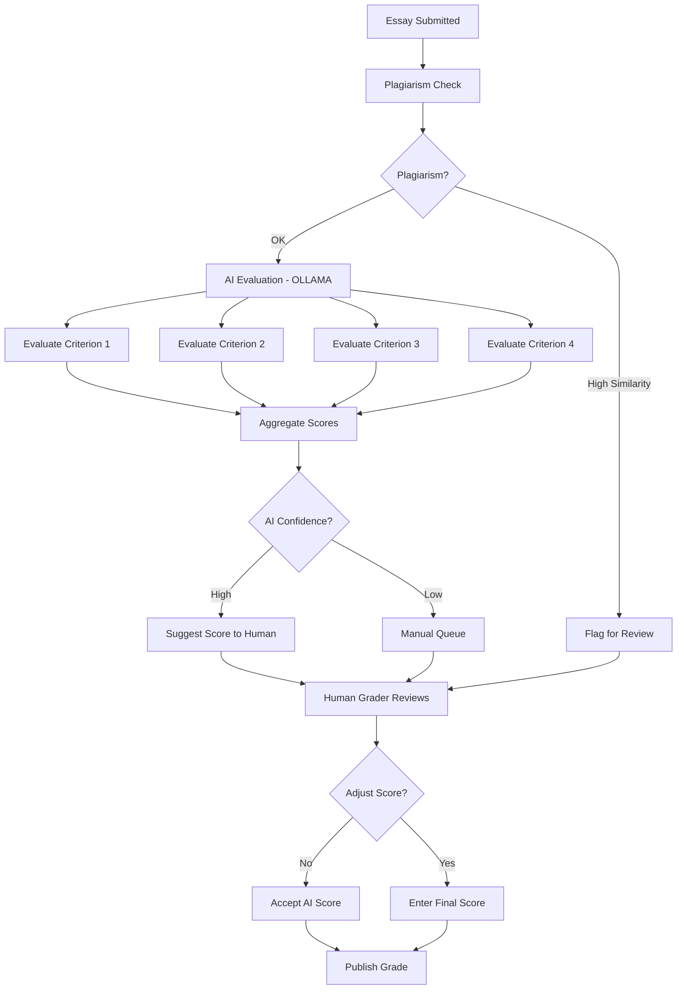
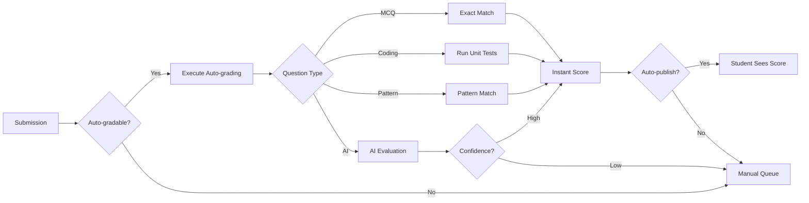
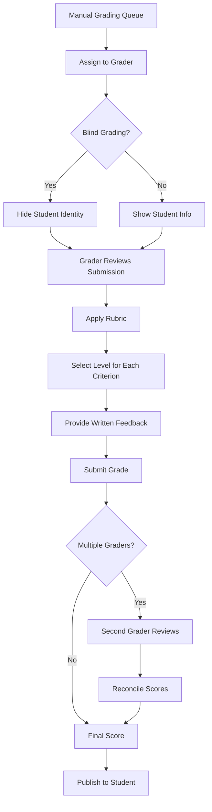
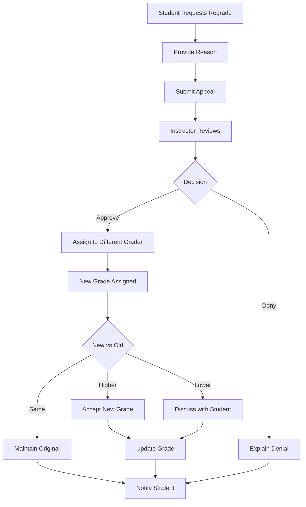

# Flexible Rubric System Documentation

## Overview

The CertificationExam rubric system provides a flexible, criterion-based assessment framework that supports multiple question types, automated grading, AI-assisted evaluation, and manual review. The system uses YAML-based rubric definitions to ensure consistent, transparent, and fair grading.

### Key Features
- **Multi-Criteria Assessment**: Define multiple grading criteria with weighted scoring
- **Level-Based Grading**: Proficiency levels (Exemplary, Proficient, Basic, Below Basic)
- **Auto-Grading Support**: Automated evaluation for MCQ, coding, pattern-matching
- **AI-Assisted Grading**: OLLAMA-powered essay evaluation
- **Manual Override**: Human graders can review and adjust scores
- **Transparent Feedback**: Detailed feedback tied to rubric criteria
- **Reusable Templates**: Question type templates for consistency

---

## Rubric Structure

### YAML Schema

```yaml
rubric:
  id: unique_rubric_id
  name: "Display Name"
  description: "What this rubric assesses"
  version: "1.0"
  total_points: 100
  
  # Grading criteria (multiple criteria per rubric)
  criteria:
    - id: criterion_1
      name: "Criterion Name"
      description: "What this criterion assesses"
      weight: 40  # Percentage of total score (sum must be 100)
      
      # Proficiency levels for this criterion
      levels:
        - score: 100  # Percentage for this level
          label: "Exemplary"
          description: "Exceeds expectations with exceptional quality"
          indicators:
            - "Demonstrates deep understanding"
            - "Provides insightful analysis"
            - "Includes relevant examples"
        
        - score: 75
          label: "Proficient"
          description: "Meets expectations with good quality"
          indicators:
            - "Demonstrates solid understanding"
            - "Provides adequate analysis"
            - "Includes some examples"
        
        - score: 50
          label: "Basic"
          description: "Partially meets expectations"
          indicators:
            - "Demonstrates partial understanding"
            - "Analysis is superficial"
            - "Examples are limited or irrelevant"
        
        - score: 25
          label: "Below Basic"
          description: "Does not meet expectations"
          indicators:
            - "Demonstrates little understanding"
            - "Analysis is missing or incorrect"
            - "No relevant examples"
        
        - score: 0
          label: "Not Attempted"
          description: "No submission or completely off-topic"
      
      # Auto-grading configuration (optional)
      auto_grading:
        enabled: true
        method: "unit_tests"  # or "static_analysis", "pattern_matching", "ai_evaluation"
        config:
          # Method-specific configuration
          test_file: "tests/test_solution.py"
          timeout: 30
          passing_score: 75
    
    - id: criterion_2
      name: "Code Quality"
      weight: 30
      # ... levels and auto_grading
    
    - id: criterion_3
      name: "Documentation"
      weight: 30
      # ... levels (no auto_grading for this one)
  
  # Grading settings
  grading:
    auto_publish: false  # Publish immediately or wait for manual review
    show_rubric_to_students: true
    allow_regrade_requests: true
    regrade_window_days: 7
    
  # Feedback settings
  feedback:
    provide_criterion_scores: true
    provide_level_descriptions: true
    provide_suggestions: true
    include_exemplar: false  # Show example of exemplary work
```

---

## Supported Question Types

### 1. Multiple Choice Questions (MCQ)

**Characteristics**:
- Single or multiple correct answers
- Auto-graded (instant feedback)
- Partial credit (for multi-select if configured)

**Rubric Example**:
```yaml
rubric:
  id: mcq_basic
  name: "MCQ Basic Grading"
  total_points: 1
  
  criteria:
    - id: correctness
      name: "Correctness"
      weight: 100
      
      levels:
        - score: 100
          label: "Correct"
          description: "Correct answer selected"
        - score: 0
          label: "Incorrect"
          description: "Incorrect answer selected"
      
      auto_grading:
        enabled: true
        method: "exact_match"
        config:
          correct_answers: ["B"]  # or multiple: ["A", "C"]
          partial_credit: false
```

**Partial Credit MCQ** (multi-select):
```yaml
auto_grading:
  enabled: true
  method: "partial_credit"
  config:
    correct_answers: ["A", "C", "D"]
    scoring:
      all_correct: 100
      per_correct_selection: 25  # 25 points per correct answer
      per_incorrect_selection: -10  # -10 for wrong selections
      minimum_score: 0
```

---

### 2. Coding Challenges

**Characteristics**:
- Unit test validation
- Code quality analysis
- Performance testing
- Auto-graded with optional manual review

**Rubric Example**:
```yaml
rubric:
  id: coding_challenge_rubric
  name: "Python Function Implementation"
  total_points: 100
  
  criteria:
    - id: correctness
      name: "Correctness"
      description: "Does the code produce correct output?"
      weight: 50
      
      levels:
        - score: 100
          label: "All Tests Pass"
          description: "Code passes all test cases"
        - score: 75
          label: "Most Tests Pass"
          description: "Code passes 75-99% of test cases"
        - score: 50
          label: "Some Tests Pass"
          description: "Code passes 50-74% of test cases"
        - score: 25
          label: "Few Tests Pass"
          description: "Code passes 25-49% of test cases"
        - score: 0
          label: "No Tests Pass"
          description: "Code fails all test cases or doesn't run"
      
      auto_grading:
        enabled: true
        method: "unit_tests"
        config:
          test_file: "tests/test_solution.py"
          timeout: 30  # seconds per test
          python_version: "3.10"
          allowed_imports: ["numpy", "pandas", "math"]
          forbidden_imports: ["os", "sys", "subprocess"]
    
    - id: code_quality
      name: "Code Quality"
      description: "Is the code well-written and maintainable?"
      weight: 30
      
      levels:
        - score: 100
          label: "Excellent"
          indicators:
            - "Follows PEP 8 style guide"
            - "No linting errors"
            - "Complexity score < 10"
        - score: 75
          label: "Good"
          indicators:
            - "Minor style issues"
            - "Few linting warnings"
            - "Complexity score 10-15"
        - score: 50
          label: "Fair"
          indicators:
            - "Multiple style issues"
            - "Several linting errors"
            - "Complexity score 15-20"
        - score: 25
          label: "Poor"
          indicators:
            - "Significant style violations"
            - "Many linting errors"
            - "Complexity score > 20"
      
      auto_grading:
        enabled: true
        method: "static_analysis"
        config:
          tools:
            - name: "flake8"
              max_errors: 5
              weight: 0.4
            - name: "pylint"
              min_score: 7.0
              weight: 0.4
            - name: "radon"  # complexity
              max_complexity: 10
              weight: 0.2
    
    - id: documentation
      name: "Documentation"
      description: "Is the code properly documented?"
      weight: 20
      
      levels:
        - score: 100
          label: "Excellent"
          indicators:
            - "Comprehensive docstrings"
            - "Type hints present"
            - "Comments for complex logic"
        - score: 75
          label: "Good"
          indicators:
            - "Basic docstrings"
            - "Some type hints"
            - "Minimal comments"
        - score: 50
          label: "Fair"
          indicators:
            - "Sparse docstrings"
            - "No type hints"
            - "No comments"
        - score: 0
          label: "Poor"
          indicators:
            - "No docstrings"
            - "No documentation"
      
      auto_grading:
        enabled: true
        method: "pattern_matching"
        config:
          patterns:
            - name: "docstring_present"
              regex: '""".*?"""'
              weight: 0.5
            - name: "type_hints"
              regex: ':\s*(int|str|float|bool|List|Dict)'
              weight: 0.3
            - name: "comments"
              regex: '#.*'
              weight: 0.2
```

**Auto-Grading Execution**:
```python
# Sandbox execution for security
import docker

def execute_code_tests(student_code: str, test_file: str, config: dict) -> dict:
    """Execute student code against unit tests in isolated container"""
    client = docker.from_env()
    
    # Create isolated container
    container = client.containers.run(
        "python:3.10-slim",
        command=f"python -m pytest {test_file}",
        volumes={
            "/tmp/student_code": {"bind": "/code", "mode": "ro"},
            "/tmp/tests": {"bind": "/tests", "mode": "ro"},
        },
        network_disabled=True,  # No internet access
        mem_limit="512m",
        cpu_quota=50000,  # 50% CPU
        detach=True,
    )
    
    # Wait for completion with timeout
    result = container.wait(timeout=config["timeout"])
    logs = container.logs().decode()
    
    # Parse pytest output
    test_results = parse_pytest_output(logs)
    
    return {
        "passed": test_results["passed"],
        "failed": test_results["failed"],
        "score": (test_results["passed"] / test_results["total"]) * 100,
        "output": logs,
    }
```

---

### 3. Essays & Long-Form Responses

**Characteristics**:
- AI-assisted grading (OLLAMA)
- Human review required
- Rubric-based evaluation
- Plagiarism detection

**Rubric Example**:
```yaml
rubric:
  id: essay_rubric_analytical
  name: "Analytical Essay Rubric"
  total_points: 100
  
  criteria:
    - id: thesis
      name: "Thesis & Argument"
      weight: 30
      
      levels:
        - score: 100
          label: "Exemplary"
          description: "Clear, insightful thesis with compelling argument"
          indicators:
            - "Thesis is specific and arguable"
            - "Argument is well-developed and logical"
            - "Demonstrates critical thinking"
        - score: 75
          label: "Proficient"
          description: "Clear thesis with solid argument"
          indicators:
            - "Thesis is clear and arguable"
            - "Argument is coherent"
            - "Shows understanding of topic"
        - score: 50
          label: "Basic"
          description: "Thesis present but argument is weak"
          indicators:
            - "Thesis is vague or too broad"
            - "Argument lacks depth"
            - "Limited critical thinking"
        - score: 25
          label: "Below Basic"
          description: "Unclear or missing thesis"
          indicators:
            - "No clear thesis"
            - "Argument is incoherent"
            - "Lacks understanding"
      
      auto_grading:
        enabled: true
        method: "ai_evaluation"
        config:
          model: "ollama:llama3"
          prompt_template: |
            Evaluate the following essay for "Thesis & Argument" based on this rubric:
            {rubric_criteria}
            
            Essay:
            {student_essay}
            
            Provide:
            1. Score (0, 25, 50, 75, or 100)
            2. Level (Below Basic, Basic, Proficient, Exemplary)
            3. Justification (2-3 sentences explaining the score)
            4. Suggestions (specific ways to improve)
          
          confidence_threshold: 0.75  # If AI confidence < 75%, send to human
    
    - id: evidence
      name: "Evidence & Support"
      weight: 30
      
      levels:
        - score: 100
          label: "Exemplary"
          description: "Excellent use of evidence from credible sources"
          indicators:
            - "Multiple relevant sources cited"
            - "Evidence is well-integrated"
            - "Sources are credible and recent"
        # ... more levels
      
      auto_grading:
        enabled: true
        method: "ai_evaluation"
        config:
          model: "ollama:llama3"
          # ... similar to above
    
    - id: organization
      name: "Organization & Structure"
      weight: 20
      
      levels:
        - score: 100
          label: "Exemplary"
          description: "Excellent organization with clear flow"
          indicators:
            - "Logical progression of ideas"
            - "Effective transitions"
            - "Strong introduction and conclusion"
        # ... more levels
      
      auto_grading:
        enabled: true
        method: "ai_evaluation"
    
    - id: mechanics
      name: "Grammar & Mechanics"
      weight: 20
      
      levels:
        - score: 100
          label: "Exemplary"
          description: "No errors in grammar, spelling, or punctuation"
        - score: 75
          label: "Proficient"
          description: "Minor errors that don't impede understanding"
        - score: 50
          label: "Basic"
          description: "Several errors that occasionally confuse meaning"
        - score: 25
          label: "Below Basic"
          description: "Frequent errors that impede understanding"
      
      auto_grading:
        enabled: true
        method: "pattern_matching"
        config:
          tools:
            - name: "language_tool"  # Grammar checker
              max_errors: 5
            - name: "spell_checker"
              max_errors: 3
  
  grading:
    auto_publish: false  # Always require human review for essays
    plagiarism_check: true
    plagiarism_threshold: 15  # % similarity threshold
```

**AI-Assisted Grading Workflow**:


---

### 4. Short Answer Questions

**Characteristics**:
- Pattern matching and keyword detection
- Fuzzy matching for typos
- Semi-automated grading (AI suggests, human approves)

**Rubric Example**:
```yaml
rubric:
  id: short_answer_rubric
  name: "Short Answer Grading"
  total_points: 10
  
  criteria:
    - id: accuracy
      name: "Accuracy"
      weight: 100
      
      levels:
        - score: 100
          label: "Correct"
          description: "Answer is accurate and complete"
        - score: 75
          label: "Mostly Correct"
          description: "Answer is mostly accurate with minor omissions"
        - score: 50
          label: "Partially Correct"
          description: "Answer has correct elements but misses key points"
        - score: 0
          label: "Incorrect"
          description: "Answer is incorrect or off-topic"
      
      auto_grading:
        enabled: true
        method: "pattern_matching"
        config:
          expected_keywords:
            required:  # Must include all
              - "photosynthesis"
              - "chlorophyll"
              - "sunlight"
            optional:  # Bonus for including
              - "glucose"
              - "carbon dioxide"
              - "oxygen"
          
          fuzzy_match:
            enabled: true
            threshold: 0.85  # 85% similarity for typos
          
          scoring:
            all_required: 100
            missing_one_required: 75
            missing_two_required: 50
            per_optional: 5  # +5 points each
```

---

### 5. File Upload (Projects)

**Characteristics**:
- Custom rubrics per project
- Manual grading (human review)
- Optional peer review
- Support for various file types (ZIP, PDF, etc.)

**Rubric Example**:
```yaml
rubric:
  id: project_rubric_ml
  name: "Machine Learning Project Rubric"
  total_points: 100
  
  criteria:
    - id: data_preprocessing
      name: "Data Preprocessing"
      weight: 20
      
      levels:
        - score: 100
          label: "Exemplary"
          indicators:
            - "Thorough exploratory data analysis"
            - "Appropriate handling of missing values"
            - "Feature engineering demonstrates creativity"
            - "Data split is correct (train/val/test)"
        # ... more levels
      
      auto_grading:
        enabled: false  # Manual review required
    
    - id: model_implementation
      name: "Model Implementation"
      weight: 30
      
      levels:
        - score: 100
          label: "Exemplary"
          indicators:
            - "Model architecture is appropriate for task"
            - "Hyperparameter tuning is systematic"
            - "Code is well-organized and documented"
        # ... more levels
      
      auto_grading:
        enabled: false
    
    - id: evaluation
      name: "Evaluation & Analysis"
      weight: 25
      
      levels:
        - score: 100
          label: "Exemplary"
          indicators:
            - "Appropriate metrics selected"
            - "Cross-validation implemented correctly"
            - "Results are analyzed and interpreted"
            - "Limitations discussed"
        # ... more levels
    
    - id: presentation
      name: "Report & Presentation"
      weight: 25
      
      levels:
        - score: 100
          label: "Exemplary"
          indicators:
            - "Report is well-structured and clear"
            - "Visualizations are effective"
            - "Conclusions are supported by results"
            - "Professional quality"
        # ... more levels
  
  grading:
    auto_publish: false
    peer_review:
      enabled: true
      reviewers_per_submission: 3
      peer_review_weight: 20  # 20% of grade from peers, 80% from instructor
      anonymize: true
```

---

### 6. Fill-in-the-Blank

**Characteristics**:
- Exact match or fuzzy match
- Auto-graded
- Support for multiple correct answers

**Rubric Example**:
```yaml
rubric:
  id: fill_blank_basic
  name: "Fill in the Blank"
  total_points: 1
  
  criteria:
    - id: correctness
      name: "Correctness"
      weight: 100
      
      levels:
        - score: 100
          label: "Correct"
        - score: 0
          label: "Incorrect"
      
      auto_grading:
        enabled: true
        method: "exact_match"
        config:
          correct_answers:
            - "mitochondria"
            - "mitochondrion"  # Singular form also accepted
          case_sensitive: false
          trim_whitespace: true
          
          # OR use fuzzy match
          fuzzy_match:
            enabled: true
            threshold: 0.90  # 90% similarity (handles typos)
```

---

## Grading Workflows

### Auto-Grading Workflow



### AI-Assisted Grading Workflow

```python
def ai_assisted_grading(essay: str, rubric: dict) -> dict:
    """Use OLLAMA to evaluate essay against rubric"""
    
    results = {}
    for criterion in rubric["criteria"]:
        # Generate evaluation prompt
        prompt = f"""
        Evaluate this essay for "{criterion['name']}".
        
        Rubric Levels:
        {format_rubric_levels(criterion['levels'])}
        
        Essay:
        {essay}
        
        Provide:
        1. Score (choose from rubric levels)
        2. Justification (2-3 sentences)
        3. Suggestions (specific improvements)
        4. Confidence (0-1, how confident are you?)
        """
        
        # Call OLLAMA
        response = ollama.generate(
            model="llama3",
            prompt=prompt,
        )
        
        # Parse response
        evaluation = parse_ai_response(response)
        
        results[criterion["id"]] = {
            "score": evaluation["score"],
            "justification": evaluation["justification"],
            "suggestions": evaluation["suggestions"],
            "confidence": evaluation["confidence"],
            "ai_generated": True,
            "requires_human_review": evaluation["confidence"] < 0.75,
        }
    
    return results
```

### Manual Grading Workflow



### Grader Calibration

**Purpose**: Ensure graders apply rubrics consistently

```yaml
calibration:
  enabled: true
  frequency: "per_exam"  # or "weekly", "monthly"
  
  process:
    1. Select calibration submissions (pre-graded by expert)
    2. Graders independently grade calibration submissions
    3. Compare grader scores to expert scores
    4. Discuss discrepancies
    5. Re-calibrate if inter-rater reliability < 0.80
  
  metrics:
    inter_rater_reliability: 0.85  # target
    acceptable_score_difference: 5  # points
```

---

## Appeals & Regrade Workflow



**Configuration**:
```yaml
appeals:
  enabled: true
  regrade_window_days: 7  # Must appeal within 7 days
  
  valid_reasons:
    - "Grading error (calculation mistake)"
    - "Rubric misapplied"
    - "Answer not fully considered"
    - "Grader bias suspected"
  
  process:
    - Student submits appeal with justification
    - Original grader reviews (or different grader if bias claimed)
    - Instructor makes final decision
    - Student notified within 3 business days
  
  limitations:
    max_appeals_per_exam: 2
    cannot_appeal_auto_graded: true  # MCQ, exact match
```

---

## Rubric Templates

### MCQ Template
See [templates/rubrics/mcq_rubric.yaml](../../CertificationExam/templates/rubrics/mcq_rubric.yaml)

### Coding Challenge Template
See [templates/rubrics/coding_rubric.yaml](../../CertificationExam/templates/rubrics/coding_rubric.yaml)

### Essay Template
See [templates/rubrics/essay_rubric.yaml](../../CertificationExam/templates/rubrics/essay_rubric.yaml)

### Project Template
See [templates/rubrics/project_rubric.yaml](../../CertificationExam/templates/rubrics/project_rubric.yaml)

---

## Integration with Exam Engine

### Question Definition with Rubric

```yaml
question:
  id: "q_essay_climate_change"
  type: "essay"
  title: "Climate Change Analysis"
  prompt: |
    Analyze the impact of climate change on coastal ecosystems.
    Your essay should be 500-750 words.
  
  rubric_id: "essay_rubric_analytical"  # Reference to rubric
  
  max_words: 750
  min_words: 500
  time_limit: 1800  # 30 minutes
  
  resources:
    - url: "https://example.com/reading1.pdf"
      title: "IPCC Report Summary"
```

### Grading API

```python
# Submit answer for grading
POST /api/exams/{exam_id}/submissions/{question_id}/grade

{
  "student_id": "student_123",
  "answer": "...",  # or file_url for uploads
  "rubric_id": "essay_rubric_analytical",
  "auto_grade": true,
  "ai_assist": true,
}

# Response
{
  "submission_id": "sub_456",
  "status": "graded" | "pending_review",
  "scores": {
    "thesis": {
      "score": 75,
      "level": "Proficient",
      "feedback": "...",
      "ai_generated": true,
      "confidence": 0.82,
    },
    "evidence": {...},
    "organization": {...},
    "mechanics": {...},
  },
  "total_score": 78,
  "requires_human_review": true,
  "estimated_review_time": "24 hours",
}
```

---

## Best Practices

### Creating Effective Rubrics

1. **Clear Criteria**: Each criterion should assess one specific aspect
2. **Distinct Levels**: Levels should be clearly differentiated
3. **Measurable Indicators**: Use concrete, observable indicators
4. **Balanced Weights**: Ensure weights reflect importance
5. **Student-Facing**: Write descriptions students can understand
6. **Validity**: Align with learning objectives
7. **Reliability**: Different graders should reach similar scores

### Auto-Grading Tips

1. **Test Thoroughly**: Validate auto-grading against manual grades
2. **Edge Cases**: Consider edge cases (empty answers, unexpected formats)
3. **Security**: Sandbox code execution to prevent malicious code
4. **Timeouts**: Set reasonable timeouts for code execution
5. **Partial Credit**: Award partial credit where appropriate
6. **Feedback**: Provide specific feedback, not just a score

### AI-Assisted Grading Tips

1. **Human Oversight**: Always have human review AI suggestions
2. **Confidence Thresholds**: Only auto-accept high-confidence evaluations
3. **Calibration**: Regularly compare AI grades to human grades
4. **Bias Testing**: Ensure AI doesn't favor certain writing styles
5. **Transparency**: Students should know when AI is used in grading

---

## Conclusion

The flexible rubric system enables:
- ✅ **Consistent Grading**: Rubrics ensure fairness across students
- ✅ **Efficient Grading**: Auto-grading and AI assistance reduce workload
- ✅ **Transparent Assessment**: Students understand expectations
- ✅ **Scalable**: Support for various question types and large classes
- ✅ **Quality Assurance**: Calibration and appeals maintain standards

This system balances automation with human judgment, ensuring both efficiency and fairness in assessment.
