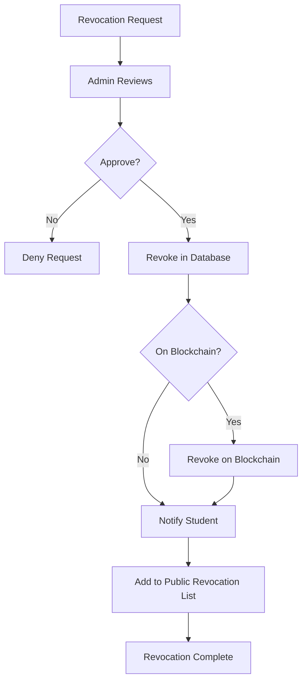

# Verification System Documentation

## Overview

The Verification System provides a public portal for employers, institutions, and individuals to verify the authenticity of certificates issued by CertificationExam. The system supports multiple verification methods, provides detailed certificate information, and maintains a public revocation list for invalidated certificates.

### Key Features
- **Public Verification Portal**: Web interface for certificate lookup
- **Multiple Verification Methods**: Certificate ID, QR code scan, PDF upload
- **Employer Verification API**: RESTful API for automated verification
- **Blockchain Verification**: Optional on-chain verification
- **Revocation System**: Manage and check certificate revocation status
- **Audit Logging**: Track all verification attempts
- **Rate Limiting**: Prevent abuse

---

## Public Verification Portal

### Web Interface

**URL**: `https://gai-observe.online/verify`

**Features**:
- Simple, clean interface
- Mobile-responsive design
- Accessibility compliant (WCAG 2.1 AA)
- Multi-language support

### Verification Methods

#### 1. Certificate ID Lookup

```
Input: CERT-2026-NLP-12345
```

**UI Flow**:
1. User enters certificate ID in text field
2. Clicks "Verify" button
3. System queries database
4. Displays verification result

**API Endpoint**:
```
GET /api/verify/{certificate_id}
```

#### 2. QR Code Scan

**Methods**:
- **Camera Scan**: Use device camera to scan QR code on certificate
- **Upload Image**: Upload photo/screenshot of QR code

**UI Flow**:
1. User clicks "Scan QR Code"
2. Browser requests camera permission
3. User points camera at certificate QR code
4. System decodes QR, extracts certificate ID
5. Automatic redirect to verification result

**Technology**:
- HTML5 `getUserMedia` API for camera access
- `jsQR` library for QR code decoding

```javascript
// QR Code Scanner
import jsQR from "jsqr";

async function scanQRCode() {
    const video = document.createElement('video');
    const stream = await navigator.mediaDevices.getUserMedia({
        video: { facingMode: 'environment' }
    });
    
    video.srcObject = stream;
    video.play();
    
    const canvas = document.createElement('canvas');
    const context = canvas.getContext('2d');
    
    function tick() {
        if (video.readyState === video.HAVE_ENOUGH_DATA) {
            canvas.width = video.videoWidth;
            canvas.height = video.videoHeight;
            context.drawImage(video, 0, 0, canvas.width, canvas.height);
            
            const imageData = context.getImageData(0, 0, canvas.width, canvas.height);
            const code = jsQR(imageData.data, imageData.width, imageData.height);
            
            if (code) {
                // Extract certificate ID from URL
                const url = new URL(code.data);
                const certId = url.pathname.split('/').pop();
                
                // Stop camera
                stream.getTracks().forEach(track => track.stop());
                
                // Verify certificate
                verifyCertificate(certId);
                return;
            }
        }
        
        requestAnimationFrame(tick);
    }
    
    tick();
}
```

#### 3. PDF Upload

**UI Flow**:
1. User uploads certificate PDF
2. System extracts certificate ID from PDF metadata
3. System extracts cryptographic signature
4. Verifies signature validity
5. Displays verification result

**Backend Processing**:
```python
from PyPDF2 import PdfReader
import base64

def extract_certificate_data_from_pdf(pdf_file) -> dict:
    """Extract certificate ID and signature from PDF metadata"""
    
    reader = PdfReader(pdf_file)
    metadata = reader.metadata
    
    return {
        'certificate_id': metadata.get('/CertificateID'),
        'signature': metadata.get('/CryptoSignature'),
        'signed_by': metadata.get('/SignedBy'),
        'signed_at': metadata.get('/SignedAt'),
        'hash_algorithm': metadata.get('/HashAlgorithm'),
        'signature_algorithm': metadata.get('/SignatureAlgorithm'),
    }

def verify_pdf_certificate(pdf_file) -> dict:
    """Verify certificate from PDF upload"""
    
    # Extract data
    cert_data = extract_certificate_data_from_pdf(pdf_file)
    
    # Look up certificate in database
    cert_record = db.query(Certificate).filter_by(
        id=cert_data['certificate_id']
    ).first()
    
    if not cert_record:
        return {'valid': False, 'reason': 'Certificate not found'}
    
    # Verify signature
    signature_valid = verify_certificate_signature(
        cert_record.data,
        cert_data['signature'],
        cert_record.public_key
    )
    
    return {
        'valid': signature_valid and not cert_record.revoked,
        'certificate': cert_record.to_dict(),
        'signature_valid': signature_valid,
        'revoked': cert_record.revoked,
    }
```

---

## Verification Response

### Success Response

```json
{
  "valid": true,
  "verified_at": "2026-01-12T10:30:00Z",
  
  "certificate": {
    "certificate_id": "CERT-2026-NLP-12345",
    "student_name": "John Doe",
    "course_title": "NLP, Transformers & LLMs",
    "course_code": "AI-501",
    "institution": "GAI-Observe Academy",
    "issue_date": "2026-01-15",
    "completion_date": "2026-01-14",
    "grade": "A",
    "score": 95,
    "credit_hours": 3,
    "credential_type": "Certificate of Completion"
  },
  
  "verification": {
    "signature_valid": true,
    "signature_algorithm": "RSA-2048-PSS",
    "signed_by": [
      {
        "name": "Dr. Jane Smith",
        "title": "Course Instructor",
        "organization": "GAI-Observe Academy"
      },
      {
        "name": "Prof. John Doe",
        "title": "Dean of Engineering",
        "organization": "GAI-Observe Academy"
      }
    ],
    "blockchain_verified": true,
    "blockchain_network": "polygon",
    "blockchain_tx": "0x1234567890abcdef1234567890abcdef1234567890abcdef1234567890abcdef",
    "blockchain_timestamp": "2026-01-15T10:00:00Z"
  },
  
  "status": {
    "revoked": false,
    "active": true,
    "expiration_date": null  // or ISO date if certificate expires
  },
  
  "issuer": {
    "organization": "GAI-Observe Academy",
    "website": "https://gai-observe.online",
    "contact_email": "verify@gai-observe.online",
    "accreditation": "Accredited by XYZ"
  }
}
```

### Invalid Certificate Response

```json
{
  "valid": false,
  "verified_at": "2026-01-12T10:30:00Z",
  "reason": "Certificate not found",
  "certificate_id": "CERT-2026-INVALID",
  
  "suggestions": [
    "Check that the certificate ID is correct",
    "Ensure the certificate was issued by GAI-Observe Academy",
    "Contact support if you believe this is an error"
  ]
}
```

### Revoked Certificate Response

```json
{
  "valid": false,
  "verified_at": "2026-01-12T10:30:00Z",
  "reason": "Certificate has been revoked",
  
  "certificate": {
    "certificate_id": "CERT-2026-NLP-12345",
    "student_name": "REDACTED",  // Privacy: hide student name for revoked certs
    "institution": "GAI-Observe Academy",
    "issue_date": "2026-01-15"
  },
  
  "revocation": {
    "revoked": true,
    "revoked_at": "2026-02-10T15:00:00Z",
    "revocation_reason": "Academic integrity violation",  // or generic "Revoked by issuer"
    "revoked_by": "Academic Integrity Office"
  }
}
```

---

## Employer Verification API

### API Overview

**Purpose**: Allow employers, HR systems, and background check services to programmatically verify certificates

**Authentication**: API key required

**Rate Limiting**: 100 requests per hour per API key

### API Endpoints

#### 1. Verify Certificate by ID

```
GET /api/v1/verify/{certificate_id}
Authorization: Bearer {api_key}
```

**Response**: Same as public verification (see above)

**Example**:
```bash
curl -X GET \
  https://gai-observe.online/api/v1/verify/CERT-2026-NLP-12345 \
  -H 'Authorization: Bearer your_api_key_here'
```

#### 2. Batch Verification

```
POST /api/v1/verify/batch
Authorization: Bearer {api_key}
Content-Type: application/json

{
  "certificate_ids": [
    "CERT-2026-NLP-12345",
    "CERT-2026-ML-67890",
    "CERT-2026-DL-11111"
  ]
}
```

**Response**:
```json
{
  "results": [
    {
      "certificate_id": "CERT-2026-NLP-12345",
      "valid": true,
      "certificate": {...}
    },
    {
      "certificate_id": "CERT-2026-ML-67890",
      "valid": true,
      "certificate": {...}
    },
    {
      "certificate_id": "CERT-2026-DL-11111",
      "valid": false,
      "reason": "Certificate not found"
    }
  ],
  "summary": {
    "total": 3,
    "valid": 2,
    "invalid": 1
  }
}
```

#### 3. Verify by Student Info (Advanced)

```
POST /api/v1/verify/by-student
Authorization: Bearer {api_key}
Content-Type: application/json

{
  "student_name": "John Doe",
  "course_title": "NLP, Transformers & LLMs",
  "completion_date_range": {
    "start": "2026-01-01",
    "end": "2026-01-31"
  }
}
```

**Response**:
```json
{
  "matches": [
    {
      "certificate_id": "CERT-2026-NLP-12345",
      "valid": true,
      "confidence": 0.95,  // Match confidence
      "certificate": {...}
    }
  ]
}
```

**Note**: This endpoint requires additional permissions due to privacy concerns.

### API Key Management

**Obtaining API Key**:
1. Employer registers at `https://gai-observe.online/api/register`
2. Provides company information, use case
3. Agrees to terms of service
4. Receives API key via email

**API Key Structure**:
```
gao_live_1234567890abcdef1234567890abcdef
  |    |              |
  |    |              +-- Random token (32 chars)
  |    +-- Environment (live, test)
  +-- Prefix (gao = GAI-Observe Academy)
```

**Rate Limiting**:
```yaml
rate_limits:
  free_tier:
    requests_per_hour: 100
    requests_per_day: 1000
  
  paid_tier:
    requests_per_hour: 1000
    requests_per_day: 10000
  
  enterprise:
    requests_per_hour: unlimited
    requests_per_day: unlimited
    dedicated_support: true
```

---

## Blockchain Verification

### On-Chain Verification

**Purpose**: Verify certificate exists on blockchain (immutable proof)

**Supported Networks**:
- Ethereum Mainnet
- Polygon (Matic)
- Optimism
- Arbitrum

### Verification Process

```python
from web3 import Web3

def verify_on_blockchain(
    certificate_id: str,
    certificate_hash: str,
    network: str = "polygon"
) -> dict:
    """Verify certificate on blockchain"""
    
    # Connect to blockchain
    w3 = Web3(Web3.HTTPProvider(NETWORK_URLS[network]))
    
    # Load contract
    contract = w3.eth.contract(
        address=CONTRACT_ADDRESSES[network],
        abi=CONTRACT_ABI
    )
    
    # Call verification function
    hash_bytes = w3.keccak(text=certificate_hash)
    is_valid = contract.functions.verifyCertificate(
        certificate_id,
        hash_bytes
    ).call()
    
    if not is_valid:
        return {
            'verified': False,
            'reason': 'Certificate not found on blockchain or hash mismatch'
        }
    
    # Get certificate details from chain
    cert_data = contract.functions.certificates(certificate_id).call()
    
    return {
        'verified': True,
        'network': network,
        'contract_address': CONTRACT_ADDRESSES[network],
        'transaction_hash': cert_data[3],  # Original issuance tx
        'issued_at': cert_data[2],  # Block timestamp
        'revoked': cert_data[4],
    }
```

### Public Blockchain Explorer Link

**Example**: 
```
https://polygonscan.com/tx/0x1234567890abcdef...
```

Users can independently verify on blockchain explorer.

---

## Revocation System

### Certificate Revocation

**Reasons for Revocation**:
- Academic integrity violation discovered
- Certificate issued in error
- Student request (e.g., name change, reissue)
- Credential no longer valid (expiration)

### Revocation Process



### Revocation API

```python
# Admin endpoint (requires admin auth)
POST /api/admin/certificates/{certificate_id}/revoke
Authorization: Bearer {admin_token}

{
  "reason": "Academic integrity violation",
  "revoked_by": "admin_user_id",
  "notify_student": true,
  "revoke_on_blockchain": true
}
```

### Public Revocation List

**Endpoint**:
```
GET /api/v1/revoked-certificates
```

**Response**:
```json
{
  "revoked_certificates": [
    {
      "certificate_id": "CERT-2026-NLP-12345",
      "revoked_at": "2026-02-10T15:00:00Z",
      "reason": "Revoked by issuer"  // Generic for privacy
    },
    ...
  ],
  "total_count": 42,
  "last_updated": "2026-02-10T15:30:00Z"
}
```

**Privacy**: Student names NOT included in public list.

---

## Audit Logging

### Purpose
Track all verification attempts for security and compliance

### Logged Data

```python
class VerificationLog(Base):
    __tablename__ = 'verification_logs'
    
    id = Column(Integer, primary_key=True)
    certificate_id = Column(String, index=True)
    verification_method = Column(String)  # 'web', 'api', 'qr_scan', 'pdf_upload'
    
    # Result
    verified = Column(Boolean)
    verification_result = Column(JSON)
    
    # Requester info
    ip_address = Column(String)
    user_agent = Column(String)
    api_key_id = Column(String, nullable=True)  # If API verification
    
    # Geolocation (optional, for analytics)
    country = Column(String, nullable=True)
    region = Column(String, nullable=True)
    
    # Timestamp
    verified_at = Column(DateTime, default=datetime.utcnow)
    
    # Privacy
    # Do NOT log requester identity (GDPR compliance)
```

### Analytics Dashboard

**Metrics**:
- Total verifications (daily, weekly, monthly)
- Verification success rate
- Top verified certificates
- Verification methods breakdown (web, API, QR, PDF)
- Geographic distribution
- API usage by customer

---

## Security Measures

### Rate Limiting

**Web Portal**:
- 10 verification per minute per IP
- 100 verifications per hour per IP

**API**:
- Per API key limits (see API Key Management)

**Implementation**:
```python
from redis import Redis
from datetime import timedelta

redis_client = Redis()

def check_rate_limit(key: str, limit: int, window: timedelta) -> bool:
    """Check if rate limit exceeded"""
    
    current = redis_client.incr(key)
    
    if current == 1:
        # First request, set expiration
        redis_client.expire(key, int(window.total_seconds()))
    
    return current <= limit

# Usage
@app.get("/api/verify/{certificate_id}")
def verify_certificate(certificate_id: str, request: Request):
    # Rate limit check
    ip = request.client.host
    rate_key = f"verify:ip:{ip}"
    
    if not check_rate_limit(rate_key, limit=10, window=timedelta(minutes=1)):
        raise HTTPException(
            status_code=429,
            detail="Rate limit exceeded. Try again later."
        )
    
    # Proceed with verification
    ...
```

### DDoS Protection

- Cloudflare/AWS WAF for DDoS protection
- CAPTCHA for suspected bot traffic
- IP blocking for malicious actors

### Data Privacy

- **No PII in Logs**: Only certificate ID, no student names
- **Anonymized Analytics**: Aggregate data only
- **GDPR Compliance**: Right to be forgotten (delete verification logs on request)

---

## User Interface Design

### Verification Page Layout

```
┌─────────────────────────────────────────────────┐
│              GAI-Observe Academy                │
│           Certificate Verification              │
├─────────────────────────────────────────────────┤
│                                                 │
│  Verify a Certificate                           │
│                                                 │
│  ┌─────────────────────────────────────┐       │
│  │ Certificate ID                      │       │
│  │ CERT-2026-NLP-12345          [Verify]│      │
│  └─────────────────────────────────────┘       │
│                                                 │
│  OR                                             │
│                                                 │
│  [📷 Scan QR Code]  [📄 Upload PDF]            │
│                                                 │
├─────────────────────────────────────────────────┤
│  Verification Result:                           │
│                                                 │
│  ✅ Valid Certificate                           │
│                                                 │
│  Student: John Doe                              │
│  Course: NLP, Transformers & LLMs               │
│  Issued: January 15, 2026                       │
│  Grade: A (95%)                                 │
│                                                 │
│  Verified via: Database + Blockchain            │
│  Blockchain TX: 0x1234...                       │
│                                                 │
│  [View Full Details]  [Download Report]         │
│                                                 │
└─────────────────────────────────────────────────┘
```

---

## Integration Examples

### HR System Integration

```javascript
// Example: Verify certificate from applicant resume
async function verifyApplicantCertificate(certificateId) {
    const response = await fetch(
        `https://gai-observe.online/api/v1/verify/${certificateId}`,
        {
            headers: {
                'Authorization': 'Bearer YOUR_API_KEY'
            }
        }
    );
    
    const result = await response.json();
    
    if (result.valid) {
        // Add to applicant profile
        await addCertificationToProfile(applicantId, {
            certification: result.certificate.course_title,
            institution: result.certificate.institution,
            date: result.certificate.completion_date,
            verified: true
        });
    }
}
```

### LinkedIn Badge Verification

```python
def verify_linkedin_certification(linkedin_cert_url: str) -> bool:
    """
    Verify certificate linked from LinkedIn profile
    
    URL format: https://gai-observe.online/verify/CERT-2026-NLP-12345
    """
    
    # Extract certificate ID from URL
    cert_id = linkedin_cert_url.split('/')[-1]
    
    # Verify
    response = requests.get(
        f'https://gai-observe.online/api/v1/verify/{cert_id}',
        headers={'Authorization': f'Bearer {API_KEY}'}
    )
    
    return response.json().get('valid', False)
```

---

## Error Handling

### Error Codes

```yaml
errors:
  CERT_NOT_FOUND:
    code: 404
    message: "Certificate not found"
    details: "The certificate ID does not exist in our system"
  
  CERT_REVOKED:
    code: 403
    message: "Certificate has been revoked"
    details: "This certificate is no longer valid"
  
  INVALID_SIGNATURE:
    code: 422
    message: "Invalid certificate signature"
    details: "The certificate signature could not be verified"
  
  RATE_LIMIT_EXCEEDED:
    code: 429
    message: "Rate limit exceeded"
    details: "Too many requests. Please try again later"
  
  INVALID_API_KEY:
    code: 401
    message: "Invalid API key"
    details: "The provided API key is not valid"
```

---

## Performance Optimization

### Caching

```python
from functools import lru_cache
from datetime import timedelta

@lru_cache(maxsize=1000)
def get_certificate_cached(certificate_id: str) -> dict:
    """Cache frequently verified certificates"""
    return db.query(Certificate).filter_by(id=certificate_id).first()

# Redis caching for API responses
def verify_certificate_with_cache(certificate_id: str) -> dict:
    # Check cache
    cache_key = f"verify:{certificate_id}"
    cached = redis_client.get(cache_key)
    
    if cached:
        return json.loads(cached)
    
    # Verify and cache
    result = verify_certificate(certificate_id)
    redis_client.setex(
        cache_key,
        timedelta(hours=24),  # Cache for 24 hours
        json.dumps(result)
    )
    
    return result
```

### Database Indexing

```sql
-- Index for fast certificate lookups
CREATE INDEX idx_certificates_id ON certificates(certificate_id);
CREATE INDEX idx_certificates_student ON certificates(student_id);
CREATE INDEX idx_certificates_course ON certificates(course_id);
CREATE INDEX idx_certificates_date ON certificates(issue_date);

-- Index for revocation checks
CREATE INDEX idx_revoked_certificates ON certificates(revoked, certificate_id);
```

---

## Conclusion

The Verification System provides:
- ✅ **Public Trust**: Anyone can verify certificate authenticity
- ✅ **Multiple Methods**: ID lookup, QR scan, PDF upload, API
- ✅ **Security**: Rate limiting, audit logging, encryption
- ✅ **Blockchain**: Optional immutable proof
- ✅ **Developer-Friendly**: REST API for integrations
- ✅ **Privacy-Compliant**: GDPR-compliant audit logging

This system ensures certificates are trusted, verifiable, and valuable in the job market.
