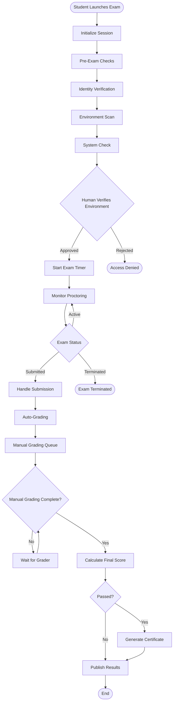
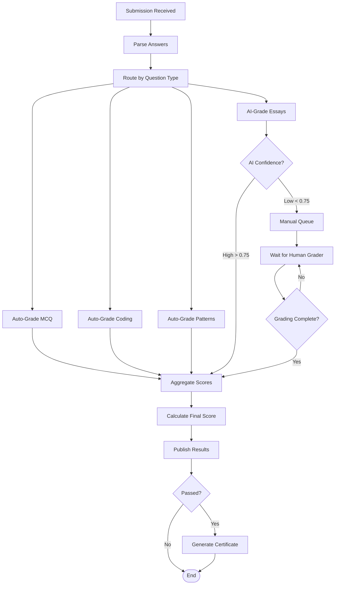

# Workflow Orchestration Documentation

## Overview

CertificationExam uses **LangGraph** to orchestrate complex multi-agent workflows for exam sessions, proctoring, and grading. This document details the state machines, agent coordination, and workflow patterns used throughout the system.

### LangGraph Benefits
- **State Management**: Centralized state across agents
- **Parallel Execution**: Run multiple agents simultaneously
- **Human-in-the-Loop**: Pause for human decisions
- **Error Handling**: Graceful recovery from failures
- **Audit Trail**: Complete workflow history

---

## Exam Session Workflow

### State Definition

```python
from typing import TypedDict, List, Dict, Optional
from datetime import datetime

class ExamSessionState(TypedDict):
    # Session metadata
    session_id: str
    student_id: str
    exam_id: str
    started_at: Optional[datetime]
    ended_at: Optional[datetime]
    
    # Progress
    current_question_index: int
    answered_questions: Dict[str, any]
    flagged_questions: List[str]
    
    # Timing
    time_remaining: int  # seconds
    time_extended: int  # seconds of extensions granted
    
    # Proctoring
    proctoring_state: Dict
    incidents: List[Dict]
    warnings_issued: int
    
    # Status
    status: str  # 'initialized', 'pre_checks', 'active', 'submitted', 'grading', 'completed'
    
    # Results
    auto_grade_results: Dict
    manual_grade_results: Dict
    final_score: Optional[float]
```

### Workflow Graph

```python
from langgraph.graph import StateGraph, END

def create_exam_session_workflow():
    """Create LangGraph workflow for exam session"""
    
    workflow = StateGraph(ExamSessionState)
    
    # Add nodes
    workflow.add_node("initialize_session", initialize_session)
    workflow.add_node("pre_exam_checks", run_pre_exam_checks)
    workflow.add_node("human_verify_environment", human_verify_environment)
    workflow.add_node("start_exam", start_exam_timer)
    workflow.add_node("monitor_proctoring", monitor_proctoring_continuous)
    workflow.add_node("handle_submission", handle_exam_submission)
    workflow.add_node("auto_grade", run_auto_grading)
    workflow.add_node("manual_grade_queue", queue_manual_grading)
    workflow.add_node("calculate_final_score", calculate_final_score)
    workflow.add_node("generate_certificate", generate_certificate_if_passed)
    workflow.add_node("publish_results", publish_results_to_student)
    
    # Add edges (workflow transitions)
    workflow.add_edge("initialize_session", "pre_exam_checks")
    workflow.add_edge("pre_exam_checks", "human_verify_environment")
    
    # Conditional: environment approved?
    workflow.add_conditional_edges(
        "human_verify_environment",
        lambda state: "approved" if state["pre_checks_passed"] else "rejected",
        {
            "approved": "start_exam",
            "rejected": END,
        }
    )
    
    workflow.add_edge("start_exam", "monitor_proctoring")
    
    # Monitor proctoring runs continuously until submission
    workflow.add_conditional_edges(
        "monitor_proctoring",
        lambda state: "submitted" if state["status"] == "submitted" else "continue",
        {
            "submitted": "handle_submission",
            "continue": "monitor_proctoring",
        }
    )
    
    workflow.add_edge("handle_submission", "auto_grade")
    workflow.add_edge("auto_grade", "manual_grade_queue")
    workflow.add_edge("manual_grade_queue", "calculate_final_score")
    workflow.add_edge("calculate_final_score", "generate_certificate")
    workflow.add_edge("generate_certificate", "publish_results")
    workflow.add_edge("publish_results", END)
    
    # Set entry point
    workflow.set_entry_point("initialize_session")
    
    return workflow.compile()
```

### Workflow Execution

```python
# Start exam session
exam_workflow = create_exam_session_workflow()

initial_state = {
    "session_id": "session_123",
    "student_id": "student_456",
    "exam_id": "exam_nlp_final",
    "current_question_index": 0,
    "answered_questions": {},
    "status": "initialized",
}

# Execute workflow
final_state = exam_workflow.invoke(initial_state)

print(f"Exam completed. Final score: {final_state['final_score']}")
```

### Workflow Diagram



---

## Proctoring Workflow

### Proctoring State

```python
class ProctoringState(TypedDict):
    session_id: str
    student_id: str
    exam_id: str
    
    # Agent signals
    identity_signal: Dict
    attention_signal: Dict
    environment_signal: Dict
    audio_signal: Dict
    screen_signal: Dict
    behavior_signal: Dict
    
    # Aggregated
    current_risk_score: float  # 0-100
    risk_level: str  # 'none', 'low', 'medium', 'high', 'critical'
    
    # Incidents
    incidents: List[Dict]
    warnings_issued: int
    
    # Recording
    recording_active: bool
    recording_segments: List[str]
    
    # Human review
    human_review_requested: bool
    human_decision: Optional[str]
```

### Proctoring Workflow Graph

```python
def create_proctoring_workflow():
    """Create continuous proctoring workflow"""
    
    workflow = StateGraph(ProctoringState)
    
    # Add agent nodes (run in parallel)
    workflow.add_node("identity_agent", run_identity_verification)
    workflow.add_node("attention_agent", run_attention_monitoring)
    workflow.add_node("environment_agent", run_environment_scanning)
    workflow.add_node("audio_agent", run_audio_analysis)
    workflow.add_node("screen_agent", run_screen_activity_monitoring)
    workflow.add_node("behavior_agent", run_behavior_pattern_analysis)
    
    # Aggregation and decision node
    workflow.add_node("integrity_agent", aggregate_signals_and_calculate_risk)
    workflow.add_node("recording_agent", manage_recording)
    
    # Human review node
    workflow.add_node("request_human_review", request_human_review)
    workflow.add_node("wait_for_human", wait_for_human_decision)
    
    # Action nodes
    workflow.add_node("issue_warning", issue_warning_to_student)
    workflow.add_node("flag_for_review", flag_session_for_review)
    workflow.add_node("terminate_exam", terminate_exam_session)
    
    # Parallel agent execution
    # All 6 monitoring agents run in parallel every cycle
    workflow.add_edge("identity_agent", "integrity_agent")
    workflow.add_edge("attention_agent", "integrity_agent")
    workflow.add_edge("environment_agent", "integrity_agent")
    workflow.add_edge("audio_agent", "integrity_agent")
    workflow.add_edge("screen_agent", "integrity_agent")
    workflow.add_edge("behavior_agent", "integrity_agent")
    
    # Recording agent runs in parallel
    workflow.add_edge("recording_agent", "integrity_agent")
    
    # Decision based on risk score
    workflow.add_conditional_edges(
        "integrity_agent",
        decide_proctoring_action,
        {
            "continue": "identity_agent",  # Loop back for next monitoring cycle
            "warn": "issue_warning",
            "flag": "flag_for_review",
            "critical": "request_human_review",
        }
    )
    
    # After warning, continue monitoring
    workflow.add_edge("issue_warning", "identity_agent")
    
    # After flagging, continue monitoring
    workflow.add_edge("flag_for_review", "identity_agent")
    
    # Human review flow
    workflow.add_edge("request_human_review", "wait_for_human")
    workflow.add_conditional_edges(
        "wait_for_human",
        lambda state: state["human_decision"],
        {
            "false_positive": "identity_agent",  # Resume monitoring
            "violation": "terminate_exam",
        }
    )
    
    workflow.add_edge("terminate_exam", END)
    
    # Set entry point (start all agents in parallel)
    workflow.set_entry_point("identity_agent")
    
    return workflow.compile()
```

### Proctoring Decision Logic

```python
def decide_proctoring_action(state: ProctoringState) -> str:
    """Decide action based on risk score"""
    
    risk_score = state['current_risk_score']
    
    if risk_score < 30:
        return "continue"  # Low risk, continue monitoring
    elif risk_score < 60:
        return "warn"  # Medium risk, issue warning
    elif risk_score < 80:
        return "flag"  # High risk, flag for review
    else:
        return "critical"  # Critical risk, request human review
```

### Proctoring Cycle

```python
# Proctoring runs continuously in background
async def run_continuous_proctoring(session_id: str):
    """Run proctoring workflow continuously"""
    
    proctoring_workflow = create_proctoring_workflow()
    
    state = {
        "session_id": session_id,
        # ... initialize state
    }
    
    while True:
        # Run one monitoring cycle (2-5 seconds)
        state = proctoring_workflow.invoke(state)
        
        # Check if exam ended or terminated
        if state.get('terminated') or session_ended(session_id):
            break
        
        # Wait before next cycle
        await asyncio.sleep(3)  # 3 second interval
    
    # Finalize proctoring
    finalize_proctoring_session(session_id, state)
```

---

## Grading Workflow

### Grading State

```python
class GradingState(TypedDict):
    submission_id: str
    student_id: str
    exam_id: str
    
    # Answers
    answers: Dict[str, any]
    
    # Question-level grades
    question_grades: Dict[str, Dict]
    
    # Auto-grading
    auto_gradable_questions: List[str]
    auto_grade_results: Dict[str, Dict]
    
    # AI-assisted grading
    ai_gradable_questions: List[str]
    ai_grade_suggestions: Dict[str, Dict]
    ai_confidence_scores: Dict[str, float]
    
    # Manual grading
    manual_grade_required: List[str]
    manual_grades: Dict[str, Dict]
    
    # Final
    total_score: Optional[float]
    grade: Optional[str]
    passed: Optional[bool]
```

### Grading Workflow Graph

```python
def create_grading_workflow():
    """Create grading workflow"""
    
    workflow = StateGraph(GradingState)
    
    # Add nodes
    workflow.add_node("parse_submission", parse_submission)
    workflow.add_node("route_questions", route_questions_by_type)
    
    # Auto-grading nodes
    workflow.add_node("auto_grade_mcq", auto_grade_mcq_questions)
    workflow.add_node("auto_grade_coding", auto_grade_coding_questions)
    workflow.add_node("auto_grade_patterns", auto_grade_pattern_matching)
    
    # AI-assisted grading
    workflow.add_node("ai_grade_essays", ai_grade_essay_questions)
    workflow.add_node("check_ai_confidence", check_ai_confidence)
    
    # Manual grading
    workflow.add_node("queue_manual_grading", queue_for_human_grader)
    workflow.add_node("wait_for_manual", wait_for_manual_grades)
    
    # Aggregation
    workflow.add_node("aggregate_scores", aggregate_question_scores)
    workflow.add_node("calculate_final", calculate_final_grade)
    
    # Edges
    workflow.add_edge("parse_submission", "route_questions")
    
    # Route to appropriate grading methods
    workflow.add_edge("route_questions", "auto_grade_mcq")
    workflow.add_edge("route_questions", "auto_grade_coding")
    workflow.add_edge("route_questions", "auto_grade_patterns")
    workflow.add_edge("route_questions", "ai_grade_essays")
    
    # Auto-grading flows directly to aggregation
    workflow.add_edge("auto_grade_mcq", "aggregate_scores")
    workflow.add_edge("auto_grade_coding", "aggregate_scores")
    workflow.add_edge("auto_grade_patterns", "aggregate_scores")
    
    # AI grading checks confidence
    workflow.add_edge("ai_grade_essays", "check_ai_confidence")
    
    # High confidence AI grades accepted, low confidence sent to manual
    workflow.add_conditional_edges(
        "check_ai_confidence",
        lambda state: "high" if all_high_confidence(state) else "low",
        {
            "high": "aggregate_scores",
            "low": "queue_manual_grading",
        }
    )
    
    # Manual grading
    workflow.add_edge("queue_manual_grading", "wait_for_manual")
    workflow.add_edge("wait_for_manual", "aggregate_scores")
    
    # Final score calculation
    workflow.add_edge("aggregate_scores", "calculate_final")
    workflow.add_edge("calculate_final", END)
    
    workflow.set_entry_point("parse_submission")
    
    return workflow.compile()
```

### Grading Workflow Diagram



---

## Certificate Generation Workflow

### Certificate State

```python
class CertificateState(TypedDict):
    certificate_id: str
    student_id: str
    exam_id: str
    course_id: str
    
    # Student data
    student_name: str
    student_email: str
    
    # Exam results
    score: float
    grade: str
    completion_date: datetime
    
    # Certificate generation
    template_id: str
    certificate_data: Dict
    pdf_generated: bool
    pdf_url: Optional[str]
    
    # Signing
    signatures: List[Dict]
    all_signed: bool
    
    # Blockchain
    blockchain_enabled: bool
    blockchain_tx_hash: Optional[str]
    
    # Delivery
    delivered: bool
    delivery_methods: List[str]
```

### Certificate Workflow

```python
def create_certificate_workflow():
    """Create certificate generation workflow"""
    
    workflow = StateGraph(CertificateState)
    
    workflow.add_node("load_template", load_certificate_template)
    workflow.add_node("populate_data", populate_certificate_data)
    workflow.add_node("generate_pdf", generate_certificate_pdf)
    workflow.add_node("sign_certificate", cryptographic_signing)
    workflow.add_node("generate_qr", generate_qr_code)
    workflow.add_node("embed_signature", embed_signature_in_pdf)
    workflow.add_node("blockchain_issue", issue_on_blockchain)
    workflow.add_node("store_certificate", store_in_database_and_s3)
    workflow.add_node("deliver_email", send_certificate_via_email)
    workflow.add_node("add_to_portal", add_to_student_portal)
    workflow.add_node("create_badge", create_open_badge)
    
    workflow.add_edge("load_template", "populate_data")
    workflow.add_edge("populate_data", "generate_pdf")
    workflow.add_edge("generate_pdf", "sign_certificate")
    workflow.add_edge("sign_certificate", "generate_qr")
    workflow.add_edge("generate_qr", "embed_signature")
    
    # Conditional: blockchain enabled?
    workflow.add_conditional_edges(
        "embed_signature",
        lambda state: "yes" if state["blockchain_enabled"] else "no",
        {
            "yes": "blockchain_issue",
            "no": "store_certificate",
        }
    )
    
    workflow.add_edge("blockchain_issue", "store_certificate")
    
    # Parallel delivery
    workflow.add_edge("store_certificate", "deliver_email")
    workflow.add_edge("store_certificate", "add_to_portal")
    workflow.add_edge("store_certificate", "create_badge")
    
    workflow.add_edge("deliver_email", END)
    workflow.add_edge("add_to_portal", END)
    workflow.add_edge("create_badge", END)
    
    workflow.set_entry_point("load_template")
    
    return workflow.compile()
```

---

## Human-in-the-Loop Patterns

### Pattern 1: Approval Gate

```python
# Wait for human approval before proceeding
workflow.add_node("human_approval", wait_for_human_approval)

workflow.add_conditional_edges(
    "human_approval",
    lambda state: state["approved"],
    {
        True: "continue_workflow",
        False: "reject_workflow",
    }
)
```

### Pattern 2: Human Override

```python
# AI makes decision, human can override
def ai_decision_with_human_override(state):
    # AI makes initial decision
    ai_decision = ai_model.predict(state)
    
    # If high confidence, proceed
    if ai_decision['confidence'] > 0.9:
        return ai_decision['action']
    
    # If low confidence, request human input
    state['human_input_requested'] = True
    human_decision = wait_for_human_input(state)
    
    return human_decision['action']
```

### Pattern 3: Human Review Queue

```python
# Items requiring human review queued
workflow.add_node("queue_for_review", add_to_review_queue)

# Separate process: human reviews items from queue
def process_review_queue():
    while True:
        item = get_next_from_queue()
        
        # Human reviews
        decision = human_reviewer.review(item)
        
        # Update workflow state
        update_workflow_state(item.workflow_id, decision)
```

---

## Error Handling & Recovery

### Retry Logic

```python
from tenacity import retry, stop_after_attempt, wait_exponential

@retry(
    stop=stop_after_attempt(3),
    wait=wait_exponential(multiplier=1, min=4, max=10)
)
def unreliable_api_call():
    """Retry on failure with exponential backoff"""
    response = external_api.call()
    return response
```

### Graceful Degradation

```python
def ai_grading_with_fallback(essay: str, rubric: dict):
    """Try AI grading, fall back to manual if fails"""
    
    try:
        # Attempt AI grading
        ai_result = ollama.grade_essay(essay, rubric)
        
        if ai_result['confidence'] > 0.75:
            return ai_result
        else:
            # Low confidence, send to manual
            return queue_for_manual_grading(essay, rubric)
    
    except Exception as e:
        # AI grading failed, fall back to manual
        log_error(f"AI grading failed: {e}")
        return queue_for_manual_grading(essay, rubric)
```

### Workflow Checkpoints

```python
# Save workflow state at checkpoints for recovery
def checkpoint_workflow(state: Dict):
    """Save workflow state to database"""
    db.save_workflow_checkpoint(
        workflow_id=state['workflow_id'],
        checkpoint_name=state['current_node'],
        state_data=state,
        timestamp=datetime.utcnow()
    )

def resume_from_checkpoint(workflow_id: str):
    """Resume workflow from last checkpoint"""
    checkpoint = db.get_latest_checkpoint(workflow_id)
    
    # Resume from saved state
    workflow = get_workflow(checkpoint.workflow_type)
    return workflow.invoke(
        checkpoint.state_data,
        starting_node=checkpoint.checkpoint_name
    )
```

---

## Monitoring & Observability

### Workflow Metrics

```python
# Track workflow execution metrics
from prometheus_client import Counter, Histogram

workflow_executions = Counter(
    'workflow_executions_total',
    'Total workflow executions',
    ['workflow_type', 'status']
)

workflow_duration = Histogram(
    'workflow_duration_seconds',
    'Workflow execution duration',
    ['workflow_type']
)

# Instrument workflow
@workflow_duration.labels(workflow_type='exam_session').time()
def execute_exam_workflow(state):
    try:
        result = exam_workflow.invoke(state)
        workflow_executions.labels(
            workflow_type='exam_session',
            status='success'
        ).inc()
        return result
    except Exception as e:
        workflow_executions.labels(
            workflow_type='exam_session',
            status='error'
        ).inc()
        raise
```

### Workflow Logging

```python
import logging

logger = logging.getLogger('workflows')

def log_workflow_transition(state, from_node, to_node):
    """Log workflow transitions for debugging"""
    logger.info(
        f"Workflow transition",
        extra={
            'workflow_id': state['session_id'],
            'workflow_type': 'exam_session',
            'from_node': from_node,
            'to_node': to_node,
            'state': state,
        }
    )
```

---

## Conclusion

LangGraph orchestration in CertificationExam provides:
- ✅ **Complex Workflows**: Multi-step exam, proctoring, grading flows
- ✅ **Parallel Execution**: Multiple agents running simultaneously
- ✅ **Human-in-the-Loop**: Seamless human intervention when needed
- ✅ **Error Recovery**: Retry logic, graceful degradation, checkpoints
- ✅ **Observability**: Metrics, logging, audit trails
- ✅ **Flexibility**: Easy to modify and extend workflows

This enables reliable, scalable, and maintainable automation of complex assessment processes.
