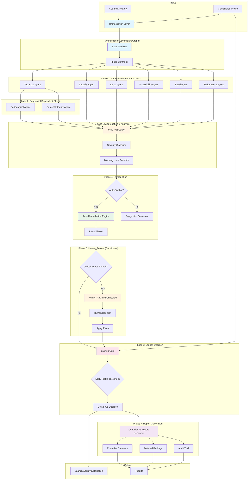
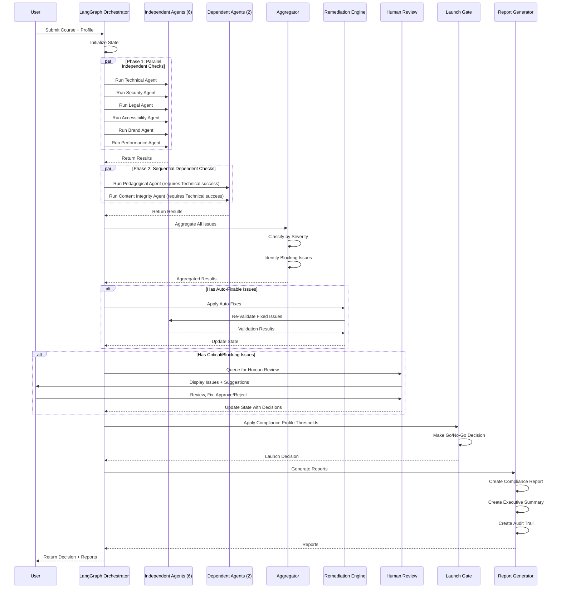

# CourseCompliance - System Architecture

## System Overview

**CourseCompliance** is an orchestrated multi-expert agent system that validates courses against comprehensive standards for technical correctness, pedagogical quality, legal compliance, accessibility, security, brand consistency, content integrity, and performance before launch.

### Purpose
- Act as the final quality assurance gatekeeper before course launch
- Ensure courses meet organizational standards across 8 critical dimensions
- Provide automated remediation where possible
- Enable human-in-the-loop review for complex issues
- Generate comprehensive compliance reports and audit trails

### Goals
- **Quality Assurance**: Ensure every course meets minimum quality standards
- **Risk Mitigation**: Identify legal, security, and accessibility issues before publication
- **Consistency**: Enforce brand and pedagogical standards across all courses
- **Efficiency**: Automate validation and remediation to reduce manual review time
- **Transparency**: Provide clear audit trails and compliance reports

### Place in Course Production Pipeline

CourseCompliance completes the 5-module course production ecosystem:

```
CourseTransformer → CourseCompliance → CoursesGTM → CoursePlayerApp + SimulationPlayer
   (Create/Modernize)    (Validate)      (Package)        (Deliver to Learners)
```

**Workflow Integration**:
1. **CourseTransformer** creates or modernizes course content
2. **CourseCompliance** validates the course against all standards (← THIS MODULE)
3. **CoursesGTM** packages validated courses for distribution
4. **CoursePlayerApp** + **SimulationPlayer** deliver courses to learners

---

## High-Level Architecture



---

## Component Breakdown

### 1. Expert Agents (8 Types)

Each expert agent is a specialized validator with specific domain knowledge:

#### 1.1 Technical Compliance Agent
- **Purpose**: Validate technical correctness and functionality
- **Key Checks**: Code execution, link validity, file integrity, dependencies, notebook validation, Docker builds
- **Tools**: nbconvert, subprocess, requests, Docker SDK
- **Dependencies**: None (runs independently)

#### 1.2 Pedagogical Quality Agent
- **Purpose**: Ensure educational effectiveness and learning design quality
- **Key Checks**: Learning objectives, scaffolding, assessments, engagement, prerequisites, completion time
- **Tools**: LLM (OLLAMA) for content analysis
- **Dependencies**: Requires Technical Agent success (needs working code)

#### 1.3 Legal Compliance Agent
- **Purpose**: Ensure legal compliance for licensing, attribution, privacy
- **Key Checks**: License compatibility, attribution, copyright, privacy (GDPR/CCPA), terms validation
- **Tools**: License compatibility database, copyright detection APIs
- **Dependencies**: None (runs independently)

#### 1.4 Accessibility Agent
- **Purpose**: Ensure WCAG 2.1 AA compliance for inclusive learning
- **Key Checks**: WCAG validation, alt text, captions, color contrast, readability, keyboard navigation, screen readers
- **Tools**: axe-core, readability-score, color-contrast-checker
- **Dependencies**: None (runs independently)

#### 1.5 Security Agent
- **Purpose**: Detect security vulnerabilities and sensitive data exposure
- **Key Checks**: Credentials, secrets, code vulnerabilities, injection attacks, dependency security, PII
- **Tools**: Bandit, Safety, regex patterns, truffleHog
- **Dependencies**: None (runs independently)

#### 1.6 Brand Consistency Agent
- **Purpose**: Ensure brand guidelines and style consistency
- **Key Checks**: Style guide, terminology, tone, visual identity, formatting
- **Tools**: LLM (OLLAMA) for tone analysis
- **Dependencies**: None (runs independently)

#### 1.7 Content Integrity Agent
- **Purpose**: Validate factual accuracy and content quality
- **Key Checks**: Fact checking, accuracy, references, consistency, plagiarism
- **Tools**: RAG system with authoritative sources, LLM (OLLAMA)
- **Dependencies**: Requires Technical Agent success (needs validated content)

#### 1.8 Performance Agent
- **Purpose**: Ensure optimal performance and user experience
- **Key Checks**: Load times, file sizes, video quality, image optimization, bundle size
- **Tools**: Lighthouse, image size analyzers, ffprobe
- **Dependencies**: None (runs independently)

### 2. Orchestration Layer (LangGraph)

The orchestration layer coordinates agent execution using LangGraph's state machine:

#### 2.1 State Management
- **State Schema**: Typed dictionary containing course path, compliance profile, agent results, aggregated issues, remediation status, decisions, reports
- **State Persistence**: Serializable for pause/resume capability
- **State Updates**: Immutable updates via LangGraph reducers

#### 2.2 Phase Controller
- **Phase 1**: Parallel execution of independent agents (Technical, Security, Legal, Accessibility, Brand, Performance)
- **Phase 2**: Sequential execution of dependent agents (Pedagogical, Content Integrity)
- **Phase 3**: Aggregation and classification
- **Phase 4**: Automated remediation
- **Phase 5**: Conditional human review
- **Phase 6**: Launch gate decision
- **Phase 7**: Report generation

#### 2.3 Conditional Routing
- **Post-Aggregation**: Route to auto-remediation, human review, or launch decision based on issue types
- **Post-Remediation**: Route to human review if issues remain, otherwise to launch decision
- **Post-Human-Review**: Always route to launch decision

#### 2.4 Error Handling
- **Agent Failures**: Logged and reported, retry up to 3 times
- **Graceful Degradation**: Continue with warnings if non-critical agents fail
- **Timeout Handling**: Configurable timeouts per agent, fallback to manual review if exceeded

### 3. Remediation Engine

#### 3.1 Auto-Fix Capabilities
- Missing alt text → Generate with AI
- Inconsistent formatting → Apply prettier/black
- Outdated package versions → Update requirements.txt
- Missing file extensions → Add correct extensions
- Simple code style violations → Apply linters

#### 3.2 Suggestion Generator
- For non-auto-fixable issues, generate specific remediation suggestions
- Include code examples, links to documentation
- Prioritize by impact (critical issues first)

#### 3.3 Re-Validation
- After applying fixes, re-run relevant compliance checks
- Verify fixes didn't introduce new issues
- Update issue status (fixed/still broken)

### 4. Launch Gate

#### 4.1 Decision Logic
```python
def launch_decision(state: ComplianceState) -> bool:
    profile = get_profile(state.compliance_profile)
    
    # Check critical issues
    if len(state.critical_issues) > profile.critical_issues_max:
        return False
    
    # Check blocking issues
    if any(issue.blocking for issue in state.all_issues):
        return False
    
    # Check category-specific thresholds
    if not check_thresholds(state, profile):
        return False
    
    # Human sign-off required?
    if profile.require_sign_off and not state.human_approved:
        return False
    
    return True
```

#### 4.2 Compliance Profiles
- **Strict**: 0 critical issues, human sign-off required
- **Standard**: <3 critical issues, auto-approve if thresholds met
- **Relaxed**: <10 critical issues, auto-approve with warnings

### 5. Reporting System

#### 5.1 Report Types
1. **Compliance Report**: Comprehensive HTML + PDF with all findings
2. **Executive Summary**: 1-page Markdown + PDF with key metrics
3. **Detailed Findings**: HTML with collapsible sections, file-by-file breakdown
4. **Audit Log**: JSON + CSV chronological event log
5. **Trend Report**: Dashboard with historical compliance scores

#### 5.2 Report Generator
- Templates for each report type
- Data aggregation from state
- Export to multiple formats (HTML, PDF, Markdown, JSON, CSV)

### 6. Human Review Dashboard

Streamlit-based UI for issue triage and approval:

#### 6.1 Key Views
- **Compliance Overview**: Summary metrics, progress indicators
- **Issue Browser**: Filterable, sortable table of all issues
- **Issue Detail**: Full description, code snippets, remediation suggestions
- **Remediation Workspace**: Side-by-side editor for applying fixes
- **Approval Workflow**: Sign-off checklist, launch decision buttons
- **Audit Trail Viewer**: Chronological log with export capability
- **Trends & Analytics**: Historical compliance data, course comparisons

#### 6.2 Interaction Features
- Real-time updates via WebSocket
- Keyboard shortcuts for efficiency
- Bulk operations
- Contextual help

---

## Technology Stack

### Core Technologies
- **Python 3.10+**: Primary implementation language
- **LangGraph**: Workflow orchestration and state management
- **OLLAMA**: AI-powered checks (fact-checking, tone analysis, content validation)
- **Streamlit**: Human review dashboard UI

### External Tools & Libraries
- **Accessibility**: axe-core, readability-score, color-contrast-checker
- **Security**: Bandit (code security), Safety (dependency vulnerabilities), truffleHog (secret detection)
- **Performance**: Lighthouse, ffprobe (video analysis), image size analyzers
- **Code Execution**: nbconvert (Jupyter notebooks), subprocess
- **Parsing**: BeautifulSoup (HTML), PyYAML (standards files)
- **HTTP**: requests (link validation, API calls)
- **Containerization**: Docker SDK (build testing)

### Data Storage
- **Standards**: YAML files (version-controlled, human-editable)
- **State**: JSON serialization for pause/resume
- **Reports**: HTML, PDF, Markdown, JSON, CSV formats
- **Audit Logs**: Structured JSON with CSV export

---

## Data Flow



---

## Compliance Profiles

### Profile Comparison

| Threshold | Strict (Enterprise) | Standard (Default) | Relaxed (MVP/Beta) |
|-----------|---------------------|--------------------|--------------------|
| **Critical Issues Max** | 0 | 3 (with justification) | 10 |
| **Warning Issues Max** | 5 | 15 | Unlimited |
| **Code Pass Rate** | 100% | 95% | 80% |
| **Link Validity** | 100% | 90% | 70% |
| **WCAG Compliance** | 100% (2.1 AA) | 85% | Basic (alt text, captions) |
| **Security Critical Max** | 0 | 0 | 0 (credentials only) |
| **Auto-Approve** | No (human sign-off) | Yes (if thresholds met) | Yes (with warnings) |
| **Audit Trail** | Full | Standard | Minimal |

### Profile Configuration Example
```yaml
profile: standard
thresholds:
  critical_issues_max: 3
  warning_issues_max: 15
  code_pass_rate_min: 0.95
  link_validity_min: 0.90
  wcag_compliance_min: 0.85
  security_critical_max: 0
auto_approve: true
require_sign_off: false
audit_level: standard
```

---

## Scalability

### Parallel Execution
- **Independent Agents**: Run in parallel using ThreadPoolExecutor
- **Course Modules**: Multiple modules can be checked in parallel (separate workflows)
- **Resource Management**: Configurable worker pool size, memory limits

### Caching
- **Standards Cache**: Load YAML standards once, reuse across checks
- **Tool Results Cache**: Cache external tool results (e.g., Lighthouse scores) for unchanged files
- **State Snapshots**: Periodic state snapshots for recovery

### Incremental Checks
- **Changed Files Only**: Re-run checks only for modified files
- **Category Re-Run**: Re-run only failed categories after fixes
- **Differential Analysis**: Compare against previous compliance run

### Performance Optimization
- **Lazy Loading**: Load agents only when needed
- **Early Termination**: Stop on critical blocking issues (optional)
- **Batch Processing**: Process multiple files in single agent invocation where possible

---

## Security & Privacy

### Secure Handling
- **Credentials**: Never log or report actual credential values (redact in reports)
- **PII**: Detect and redact PII in reports
- **Audit Logs**: Secure storage with access controls
- **State Persistence**: Encrypt serialized state if contains sensitive data

### Access Control
- **Dashboard Authentication**: Role-based access (reviewer, approver, admin)
- **Report Access**: Different reports for different roles (executive summary for stakeholders)
- **Audit Trail**: Immutable log, read-only access

---

## Augmented Human Philosophy

CourseCompliance embodies the "AI assists, humans decide" principle:

### AI Responsibilities
- **Detection**: Identify issues comprehensively across all categories
- **Analysis**: Classify severity, identify patterns
- **Suggestion**: Generate remediation suggestions
- **Automation**: Apply safe, deterministic fixes

### Human Responsibilities
- **Judgment**: Final decisions on ambiguous issues
- **Risk Acceptance**: Accept risks with justification
- **Creativity**: Craft better solutions than AI suggestions
- **Approval**: Final sign-off on launch decision

### Handoff Points
1. **Critical Issues**: AI flags, human reviews
2. **Ambiguous Cases**: AI provides options, human chooses
3. **Risk Tradeoffs**: AI quantifies, human decides
4. **Final Approval**: AI recommends, human approves

---

## Future Enhancements

### Phase 2 Features
- **Learning from Fixes**: Train models on human fixes to improve auto-remediation
- **Predictive Quality**: Predict compliance score before full check
- **Continuous Monitoring**: Monitor deployed courses for regression
- **Integration Testing**: Test course in actual player environment

### Advanced Capabilities
- **Cross-Course Analysis**: Compare against similar courses, detect outliers
- **Trend Prediction**: Predict common issues based on historical data
- **Smart Prioritization**: ML-based prioritization of issues to fix
- **Automated Regression Testing**: Re-run compliance on course updates

---

## Conclusion

CourseCompliance provides a comprehensive, scalable, and intelligent quality assurance system that ensures every course meets high standards before launch. By combining specialized expert agents, intelligent orchestration, automated remediation, and human oversight, it delivers both efficiency and quality in the course production pipeline.
