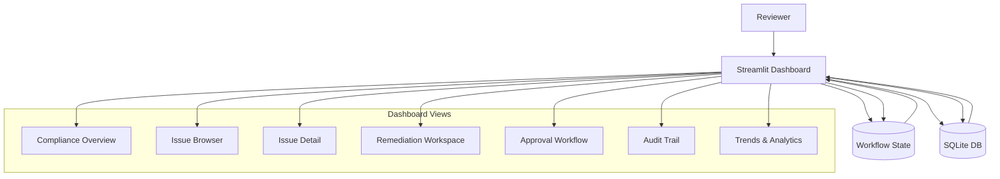

# CourseCompliance - Human Review Dashboard

## Overview

The Human Review Dashboard is a Streamlit-based UI that enables reviewers to triage issues, make decisions, apply fixes, and approve/reject course launches. It serves as the human-in-the-loop component of the compliance workflow.

**Technology**: Streamlit (Python web framework for data apps)

**Key Features**:
- Real-time status updates during compliance checks
- Filterable, sortable issue browser
- Side-by-side remediation workspace
- Approval workflow with e-signature
- Audit trail viewer
- Trends and analytics

---

## Architecture



---

## Pages and Views

### 1. Compliance Overview Dashboard

**Purpose**: High-level status and progress tracking

**Layout**:
```
┌─────────────────────────────────────────────────────────────┐
│  CourseCompliance                        [Profile: Standard] │
├─────────────────────────────────────────────────────────────┤
│  Course: Advanced Machine Learning                          │
│  Version: 2.1.0                                              │
│  Author: Jane Smith                                          │
│  Status: 🟡 Under Review                                    │
├─────────────────────────────────────────────────────────────┤
│  ┌──────────────┐ ┌──────────────┐ ┌──────────────┐        │
│  │   Critical   │ │   Warnings   │ │     Info     │        │
│  │      5       │ │      12      │ │      23      │        │
│  │   🔴 High    │ │  🟡 Medium   │ │  🔵 Low      │        │
│  └──────────────┘ └──────────────┘ └──────────────┘        │
├─────────────────────────────────────────────────────────────┤
│  Agent Progress:                                             │
│  ✅ Technical (95% pass)         ✅ Security (0 critical)   │
│  ✅ Legal (2 warnings)           ✅ Accessibility (88%)     │
│  🟡 Pedagogical (reviewing...)   ✅ Brand (consistent)      │
│  ✅ Content (96% accurate)       ✅ Performance (2.1s load) │
├─────────────────────────────────────────────────────────────┤
│  Timeline:                                                   │
│  Started:    Jan 12, 2026 10:30 AM                          │
│  Completed:  Jan 12, 2026 10:52 AM (22 min)                 │
│  Next:       Human Review Required                          │
├─────────────────────────────────────────────────────────────┤
│  Launch Decision Readiness:                                  │
│  ████████░░ 80% Ready                                        │
│  Remaining: 5 critical issues to resolve                    │
├─────────────────────────────────────────────────────────────┤
│  Quick Actions:                                              │
│  [View All Issues] [Auto-Fix Available] [Approve Launch]    │
└─────────────────────────────────────────────────────────────┘
```

**Components**:

```python
import streamlit as st

def render_overview(state: ComplianceState):
    """Render compliance overview page"""
    
    # Header
    col1, col2 = st.columns([3, 1])
    with col1:
        st.title("CourseCompliance")
    with col2:
        st.metric("Profile", state.compliance_profile.upper())
    
    # Course metadata
    st.subheader(f"📚 {state.course_metadata['name']}")
    st.caption(f"Version {state.course_metadata['version']} | Author: {state.course_metadata['author']}")
    
    # Overall status
    status = get_overall_status(state)
    status_icon = {"passed": "✅", "failed": "❌", "under_review": "🟡"}[status]
    st.info(f"{status_icon} Status: {status.replace('_', ' ').title()}")
    
    # Issue counts
    col1, col2, col3 = st.columns(3)
    with col1:
        st.metric(
            "Critical Issues",
            len(state.critical_issues),
            delta=-len(state.auto_fixed_issues) if state.auto_fixed_issues else None,
            delta_color="inverse"
        )
    with col2:
        st.metric("Warnings", len(state.warning_issues))
    with col3:
        st.metric("Info", len(state.info_issues))
    
    # Agent progress
    st.subheader("Agent Progress")
    render_agent_progress(state)
    
    # Timeline
    st.subheader("Timeline")
    render_timeline(state)
    
    # Readiness indicator
    st.subheader("Launch Readiness")
    readiness = calculate_readiness(state)
    st.progress(readiness)
    st.caption(f"{readiness*100:.0f}% Ready | {get_blocking_reason(state)}")
    
    # Quick actions
    st.subheader("Quick Actions")
    col1, col2, col3 = st.columns(3)
    with col1:
        if st.button("📋 View All Issues"):
            st.session_state.page = "issue_browser"
            st.rerun()
    with col2:
        auto_fixable_count = len(state.auto_fixable_issues)
        if auto_fixable_count > 0:
            if st.button(f"🔧 Auto-Fix ({auto_fixable_count})"):
                run_auto_remediation(state)
                st.rerun()
    with col3:
        if can_approve(state):
            if st.button("✅ Approve Launch"):
                st.session_state.page = "approval"
                st.rerun()
```

---

### 2. Issue Browser

**Purpose**: Filterable, sortable table of all issues

**Layout**:
```
┌─────────────────────────────────────────────────────────────┐
│  Issues (40)                                     [Export ▼] │
├─────────────────────────────────────────────────────────────┤
│  Filters:                                                    │
│  Severity: [Critical][Warning][Info]                        │
│  Category: [All ▼]  Status: [All ▼]  Auto-Fix: [All ▼]     │
│  Search: [_________________________________] 🔍              │
├─────────────────────────────────────────────────────────────┤
│  Bulk Actions: [✓ Select All]  [Accept Risk][Defer][Fix]   │
├─────────────────────────────────────────────────────────────┤
│  ┌──┬────────┬──────────────┬─────────────┬────────┬──────┐│
│  │☐│Severity│ Title        │ File        │Category│Action││
│  ├──┼────────┼──────────────┼─────────────┼────────┼──────┤│
│  │☐│🔴 Crit │Missing alt...│lesson_1.html│Access. │[Fix] ││
│  │☐│🔴 Crit │Code fails... │notebook.ipynb│Technical[View]││
│  │☐│🟡 Warn │Broken link...│index.md     │Technical[Fix] ││
│  │☐│🟡 Warn │Poor contrast │styles.css   │Access. │[Fix] ││
│  │☐│🔵 Info │Reading level │lesson_2.md  │Access. │[View]││
│  └──┴────────┴──────────────┴─────────────┴────────┴──────┘│
│  Page 1 of 4                               [< 1 2 3 4 >]    │
└─────────────────────────────────────────────────────────────┘
```

**Implementation**:

```python
def render_issue_browser(state: ComplianceState):
    """Render issue browser page"""
    
    st.title("📋 Issue Browser")
    
    # Export button
    if st.button("📥 Export Issues"):
        export_issues_csv(state.all_issues)
    
    # Filters
    st.subheader("Filters")
    col1, col2, col3, col4 = st.columns(4)
    
    with col1:
        severity_filter = st.multiselect(
            "Severity",
            ["critical", "warning", "info"],
            default=["critical", "warning"]
        )
    
    with col2:
        category_filter = st.selectbox(
            "Category",
            ["all", "technical", "pedagogical", "legal", "accessibility", 
             "security", "brand", "content_integrity", "performance"]
        )
    
    with col3:
        status_filter = st.selectbox(
            "Status",
            ["all", "open", "fixed", "accepted_risk", "deferred"]
        )
    
    with col4:
        auto_fix_filter = st.selectbox(
            "Auto-Fixable",
            ["all", "yes", "no"]
        )
    
    # Search
    search_query = st.text_input("🔍 Search", placeholder="Search issues...")
    
    # Apply filters
    filtered_issues = filter_issues(
        state.all_issues,
        severity=severity_filter,
        category=category_filter,
        status=status_filter,
        auto_fixable=auto_fix_filter,
        search=search_query
    )
    
    st.caption(f"Showing {len(filtered_issues)} of {len(state.all_issues)} issues")
    
    # Bulk actions
    if st.checkbox("Select All"):
        selected_issues = filtered_issues
    else:
        selected_issues = []
    
    col1, col2, col3 = st.columns(3)
    with col1:
        if st.button("✅ Accept Risk (Selected)"):
            accept_risk_bulk(selected_issues)
            st.rerun()
    with col2:
        if st.button("⏭️ Defer (Selected)"):
            defer_bulk(selected_issues)
            st.rerun()
    with col3:
        if st.button("🔧 Fix (Selected)"):
            fix_bulk(selected_issues)
            st.rerun()
    
    # Issues table
    render_issues_table(filtered_issues)
    
    # Pagination
    render_pagination(len(filtered_issues), page_size=20)


def render_issues_table(issues: List[Dict]):
    """Render issues as interactive table"""
    
    for issue in issues:
        with st.expander(
            f"{severity_icon(issue['severity'])} {issue['title']} - {issue['file']}"
        ):
            col1, col2 = st.columns([3, 1])
            
            with col1:
                st.write(f"**Description:** {issue['description']}")
                st.write(f"**Category:** {issue['category']} / {issue['subcategory']}")
                st.write(f"**File:** {issue['file']} (Line {issue.get('line', 'N/A')})")
                
                if issue.get('code_snippet'):
                    st.code(issue['code_snippet'], language='python')
                
                st.write(f"**Suggestion:** {issue['remediation_suggestion']}")
                
                if issue.get('reference'):
                    st.markdown(f"[📖 Reference]({issue['reference']})")
            
            with col2:
                st.write("**Actions:**")
                
                if issue.get('auto_fixable'):
                    if st.button("🔧 Auto-Fix", key=f"fix_{issue['id']}"):
                        auto_fix_issue(issue)
                        st.success("Fix applied!")
                        st.rerun()
                
                if st.button("👁️ View Details", key=f"view_{issue['id']}"):
                    st.session_state.selected_issue = issue['id']
                    st.session_state.page = "issue_detail"
                    st.rerun()
                
                if st.button("✅ Accept Risk", key=f"accept_{issue['id']}"):
                    st.session_state.selected_issue = issue['id']
                    st.session_state.action = "accept_risk"
                    st.rerun()


def severity_icon(severity: str) -> str:
    """Get icon for severity level"""
    return {
        "critical": "🔴",
        "warning": "🟡",
        "info": "🔵"
    }.get(severity, "⚪")
```

---

### 3. Issue Detail View

**Purpose**: Full details for a single issue with actions

**Layout**:
```
┌─────────────────────────────────────────────────────────────┐
│  ← Back to Issues                                            │
├─────────────────────────────────────────────────────────────┤
│  🔴 CRITICAL - Missing Alt Text                             │
├─────────────────────────────────────────────────────────────┤
│  Issue ID: A11Y-ALT-001                                      │
│  Category: Accessibility / Alt Text                          │
│  File: lessons/lesson_01/index.html (Line 67)               │
│  Severity: Critical | Blocking: Yes | Auto-Fixable: Yes     │
├─────────────────────────────────────────────────────────────┤
│  Description:                                                │
│  Image element missing alt attribute, violates WCAG 2.1 AA  │
│  Success Criterion 1.1.1 (Non-text Content).                │
├─────────────────────────────────────────────────────────────┤
│  Code Context:                                               │
│  65: <div class="diagram">                                   │
│  66:   <h3>Network Architecture</h3>                         │
│  67:     ← ISSUE HERE         │
│  68: </div>                                                  │
├─────────────────────────────────────────────────────────────┤
│  Remediation Suggestion:                                     │
│  Add descriptive alt attribute to img tag describing the    │
│  content and purpose of the image.                           │
│                                                              │
│  Suggested Fix:                                              │
│                                                     │
├─────────────────────────────────────────────────────────────┤
│  Reference: https://www.w3.org/WAI/tutorials/images/        │
├─────────────────────────────────────────────────────────────┤
│  Related Issues (2):                                         │
│  • A11Y-ALT-002 - Missing alt in lesson_02/index.html       │
│  • A11Y-ALT-003 - Missing alt in lesson_03/index.html       │
├─────────────────────────────────────────────────────────────┤
│  Actions:                                                    │
│  [🔧 Auto-Fix] [✏️ Manual Fix] [✅ Accept Risk] [⏭️ Defer]   │
└─────────────────────────────────────────────────────────────┘
```

**Implementation**:

```python
def render_issue_detail(state: ComplianceState, issue_id: str):
    """Render detailed view of single issue"""
    
    issue = get_issue_by_id(state, issue_id)
    
    # Back button
    if st.button("← Back to Issues"):
        st.session_state.page = "issue_browser"
        st.rerun()
    
    # Title
    severity_icon = {"critical": "🔴", "warning": "🟡", "info": "🔵"}[issue['severity']]
    st.title(f"{severity_icon} {issue['severity'].upper()} - {issue['title']}")
    
    # Metadata
    st.write(f"**Issue ID:** {issue['id']}")
    st.write(f"**Category:** {issue['category']} / {issue['subcategory']}")
    st.write(f"**File:** {issue['file']} (Line {issue.get('line', 'N/A')})")
    
    col1, col2, col3 = st.columns(3)
    with col1:
        st.metric("Severity", issue['severity'])
    with col2:
        st.metric("Blocking", "Yes" if issue['blocking'] else "No")
    with col3:
        st.metric("Auto-Fixable", "Yes" if issue['auto_fixable'] else "No")
    
    # Description
    st.subheader("Description")
    st.write(issue['description'])
    
    # Code context
    if issue.get('code_snippet'):
        st.subheader("Code Context")
        st.code(issue['code_snippet'], language=detect_language(issue['file']))
    
    # Remediation suggestion
    st.subheader("Remediation Suggestion")
    st.write(issue['remediation_suggestion'])
    
    if issue.get('reference'):
        st.markdown(f"📖 [Reference Documentation]({issue['reference']})")
    
    # Related issues
    related = get_related_issues(state, issue)
    if related:
        st.subheader("Related Issues")
        for rel in related:
            st.write(f"• {rel['id']} - {rel['title']}")
    
    # Actions
    st.subheader("Actions")
    col1, col2, col3, col4 = st.columns(4)
    
    with col1:
        if issue['auto_fixable']:
            if st.button("🔧 Auto-Fix"):
                auto_fix_issue(issue)
                st.success("Fix applied successfully!")
                st.rerun()
    
    with col2:
        if st.button("✏️ Manual Fix"):
            st.session_state.selected_issue = issue_id
            st.session_state.page = "remediation_workspace"
            st.rerun()
    
    with col3:
        if st.button("✅ Accept Risk"):
            show_accept_risk_form(issue)
    
    with col4:
        if st.button("⏭️ Defer"):
            defer_issue(issue)
            st.info("Issue deferred to next release")
            st.rerun()


def show_accept_risk_form(issue: Dict):
    """Show form to accept risk with justification"""
    
    with st.form("accept_risk_form"):
        st.warning("Accepting risk for a critical/blocking issue")
        
        justification = st.text_area(
            "Justification (required)",
            placeholder="Explain why this risk is acceptable..."
        )
        
        approver = st.text_input("Approver Name")
        
        submitted = st.form_submit_button("Confirm Accept Risk")
        
        if submitted:
            if not justification:
                st.error("Justification is required")
            else:
                accept_risk(issue, justification, approver)
                st.success("Risk accepted and logged")
                st.rerun()
```

---

### 4. Remediation Workspace

**Purpose**: Side-by-side editor for manual fixes

**Layout**:
```
┌─────────────────────────────────────────────────────────────┐
│  Remediation Workspace - A11Y-ALT-001                        │
├──────────────────────────┬──────────────────────────────────┤
│  Current Content         │  Suggested Fix                   │
├──────────────────────────┼──────────────────────────────────┤
│  65: <div class="diagram">65: <div class="diagram">         │
│  66:   <h3>Network...</h3>66:   <h3>Network...</h3>         │
│  67:       │         network.png"             │
│                          │         alt="Neural network      │
│                          │         diagram">                │
│  68: </div>              │68: </div>                        │
│                          │                                  │
│  [📝 Edit Original]      │  [✓ Apply Suggested Fix]         │
├──────────────────────────┴──────────────────────────────────┤
│  Custom Fix:                                                 │
│  ┌───────────────────────────────────────────────────────┐  │
│  │                               │  │
│  └───────────────────────────────────────────────────────┘  │
│                                                              │
│  [🔍 Preview] [💾 Save & Re-Validate]                       │
└─────────────────────────────────────────────────────────────┘
```

**Implementation**:

```python
def render_remediation_workspace(state: ComplianceState, issue_id: str):
    """Render side-by-side remediation workspace"""
    
    issue = get_issue_by_id(state, issue_id)
    file_path = Path(state.course_path) / issue['file']
    
    st.title(f"Remediation Workspace - {issue['id']}")
    st.caption(f"{issue['title']}")
    
    # Load file content
    content = file_path.read_text()
    lines = content.split('\n')
    
    # Get context around issue line
    line_num = issue.get('line', 1)
    context_start = max(0, line_num - 5)
    context_end = min(len(lines), line_num + 5)
    context_lines = lines[context_start:context_end]
    
    # Side-by-side view
    col1, col2 = st.columns(2)
    
    with col1:
        st.subheader("Current Content")
        current = '\n'.join(context_lines)
        st.code(current, language=detect_language(issue['file']))
        
        if st.button("📝 Edit Original File"):
            st.session_state.edit_mode = True
    
    with col2:
        st.subheader("Suggested Fix")
        suggested = apply_suggestion_to_context(context_lines, issue)
        st.code(suggested, language=detect_language(issue['file']))
        
        if st.button("✓ Apply Suggested Fix"):
            apply_fix_to_file(file_path, issue, suggested)
            st.success("Fix applied!")
            re_validate_issue(state, issue)
            st.rerun()
    
    # Custom fix editor
    st.subheader("Custom Fix")
    st.caption("Edit the fix manually if the suggestion isn't quite right")
    
    custom_fix = st.text_area(
        "Custom Fix",
        value=suggested,
        height=200,
        key="custom_fix"
    )
    
    col1, col2 = st.columns(2)
    with col1:
        if st.button("🔍 Preview Changes"):
            show_diff(current, custom_fix)
    
    with col2:
        if st.button("💾 Save & Re-Validate"):
            apply_custom_fix(file_path, issue, custom_fix)
            st.success("Custom fix applied!")
            re_validate_issue(state, issue)
            st.rerun()


def show_diff(original: str, modified: str):
    """Show diff between original and modified"""
    import difflib
    
    diff = difflib.unified_diff(
        original.split('\n'),
        modified.split('\n'),
        lineterm=''
    )
    
    diff_text = '\n'.join(diff)
    st.code(diff_text, language='diff')
```

---

### 5. Approval Workflow

**Purpose**: Final sign-off and launch decision

**Layout**:
```
┌─────────────────────────────────────────────────────────────┐
│  Launch Approval Workflow                                    │
├─────────────────────────────────────────────────────────────┤
│  Course: Advanced Machine Learning v2.1.0                    │
│  Profile: Standard                                           │
│  Reviewer: Jane Smith                                        │
│  Date: Jan 12, 2026                                          │
├─────────────────────────────────────────────────────────────┤
│  Compliance Summary:                                         │
│  ✅ Technical: 95% pass rate (threshold: 95%)               │
│  ✅ Security: 0 critical issues                             │
│  ✅ Accessibility: 88% WCAG (threshold: 85%)                │
│  ✅ Legal: All licenses compatible                          │
│  ⚠️  Pedagogical: 2 warnings (acceptable)                   │
│  ✅ Performance: 2.1s load time (threshold: 3s)             │
├─────────────────────────────────────────────────────────────┤
│  Outstanding Issues:                                         │
│  ☐ 2 Critical issues - Accepted with justification          │
│  ☐ 12 Warnings - Reviewed and acceptable                    │
│  ☐ All auto-fixes applied and validated                     │
├─────────────────────────────────────────────────────────────┤
│  Risk Acceptances (2):                                       │
│  • A11Y-CAP-003: Video caption quality (Auto-generated)     │
│    Justification: Will be professionally captioned post-launch│
│  • LEGAL-ATTR-005: Missing attribution for diagram          │
│    Justification: Original author granted verbal permission │
├─────────────────────────────────────────────────────────────┤
│  Approver Checklist:                                         │
│  ☑ I have reviewed all critical issues                      │
│  ☑ All risk acceptances are justified                       │
│  ☑ Course meets compliance profile thresholds               │
│  ☑ I approve this course for launch                         │
├─────────────────────────────────────────────────────────────┤
│  E-Signature:                                                │
│  Name: [Jane Smith                    ]                      │
│  Role: [Compliance Officer            ]                      │
│  Date: Jan 12, 2026 11:15 AM                                 │
├─────────────────────────────────────────────────────────────┤
│  Launch Decision:                                            │
│  [✅ Approve Launch] [⏸️ Hold for Fixes] [❌ Reject]         │
└─────────────────────────────────────────────────────────────┘
```

**Implementation**:

```python
def render_approval_workflow(state: ComplianceState):
    """Render approval workflow page"""
    
    st.title("🎯 Launch Approval Workflow")
    
    # Course info
    st.subheader("Course Information")
    col1, col2 = st.columns(2)
    with col1:
        st.write(f"**Course:** {state.course_metadata['name']} v{state.course_metadata['version']}")
        st.write(f"**Author:** {state.course_metadata['author']}")
    with col2:
        st.write(f"**Profile:** {state.compliance_profile}")
        st.write(f"**Reviewer:** {st.session_state.user_name}")
    
    # Compliance summary
    st.subheader("Compliance Summary")
    render_compliance_summary(state)
    
    # Outstanding issues
    st.subheader("Outstanding Issues")
    render_outstanding_issues(state)
    
    # Risk acceptances
    if state.human_decisions:
        st.subheader("Risk Acceptances")
        for decision in state.human_decisions:
            if decision['action'] == 'accept_risk':
                st.write(f"• **{decision['issue_id']}**: {decision['issue_title']}")
                st.caption(f"  Justification: {decision['justification']}")
    
    # Approver checklist
    st.subheader("Approver Checklist")
    
    check1 = st.checkbox("I have reviewed all critical issues")
    check2 = st.checkbox("All risk acceptances are justified")
    check3 = st.checkbox("Course meets compliance profile thresholds")
    check4 = st.checkbox("I approve this course for launch")
    
    all_checked = check1 and check2 and check3 and check4
    
    # E-signature
    st.subheader("E-Signature")
    col1, col2 = st.columns(2)
    with col1:
        approver_name = st.text_input("Name", value=st.session_state.user_name)
    with col2:
        approver_role = st.text_input("Role", value=st.session_state.user_role)
    
    st.caption(f"Date: {datetime.now().strftime('%b %d, %Y %I:%M %p')}")
    
    # Launch decision
    st.subheader("Launch Decision")
    col1, col2, col3 = st.columns(3)
    
    with col1:
        if st.button("✅ Approve Launch", disabled=not all_checked):
            approve_launch(state, approver_name, approver_role)
            st.success("🎉 Course approved for launch!")
            st.balloons()
    
    with col2:
        if st.button("⏸️ Hold for Fixes"):
            reason = st.text_area("Reason for hold")
            if reason:
                hold_launch(state, reason, approver_name)
                st.warning("Course held for fixes")
    
    with col3:
        if st.button("❌ Reject"):
            reason = st.text_area("Reason for rejection")
            if reason:
                reject_launch(state, reason, approver_name)
                st.error("Course rejected")


def approve_launch(state: ComplianceState, approver: str, role: str):
    """Approve course for launch"""
    
    state.launch_approved = True
    state.human_approved = True
    state.launch_decision_reason = f"Approved by {approver} ({role})"
    
    # Log to audit trail
    audit_entry = {
        "timestamp": datetime.now(),
        "event": "launch_approved",
        "approver": approver,
        "role": role
    }
    state.audit_log.append(audit_entry)
    
    # Generate compliance certificate
    generate_compliance_certificate(state, approver, role)
    
    # Save state
    save_state(state)
```

---

### 6. Audit Trail Viewer

**Purpose**: Chronological log with export

**Layout**:
```
┌─────────────────────────────────────────────────────────────┐
│  Audit Trail                                   [Export CSV]  │
├─────────────────────────────────────────────────────────────┤
│  Filter: [All Events ▼]  [Last 24h ▼]                       │
├─────────────────────────────────────────────────────────────┤
│  Jan 12 10:30:15 - Workflow Started                          │
│    User: system                                              │
│    Profile: standard                                         │
│                                                              │
│  Jan 12 10:32:47 - Agent Completed: Technical                │
│    Status: pass                                              │
│    Issues: 3 warnings                                        │
│                                                              │
│  Jan 12 10:35:12 - Auto-Remediation Applied                  │
│    Issue: A11Y-ALT-001                                       │
│    Action: Generated alt text                                │
│    Success: true                                             │
│                                                              │
│  Jan 12 10:45:00 - Human Review Started                      │
│    Reviewer: Jane Smith                                      │
│                                                              │
│  Jan 12 10:50:23 - Risk Accepted                             │
│    Issue: A11Y-CAP-003                                       │
│    Approver: Jane Smith                                      │
│    Justification: Professional captions post-launch          │
│                                                              │
│  Jan 12 11:15:00 - Launch Approved                           │
│    Approver: Jane Smith (Compliance Officer)                 │
│                                                              │
│  [Load More]                                                 │
└─────────────────────────────────────────────────────────────┘
```

**Implementation**:

```python
def render_audit_trail(state: ComplianceState):
    """Render audit trail viewer"""
    
    st.title("📜 Audit Trail")
    
    # Export button
    if st.button("📥 Export to CSV"):
        export_audit_trail_csv(state.audit_log)
    
    # Filters
    col1, col2 = st.columns(2)
    with col1:
        event_filter = st.selectbox(
            "Event Type",
            ["all", "agent_completed", "auto_fix", "human_decision", "launch_decision"]
        )
    with col2:
        time_filter = st.selectbox(
            "Time Range",
            ["all", "last_24h", "last_week", "last_month"]
        )
    
    # Apply filters
    filtered_log = filter_audit_log(state.audit_log, event_filter, time_filter)
    
    # Display log entries
    for entry in filtered_log:
        render_audit_entry(entry)


def render_audit_entry(entry: Dict):
    """Render single audit log entry"""
    
    timestamp = entry['timestamp'].strftime("%b %d %H:%M:%S")
    event = entry['event'].replace('_', ' ').title()
    
    with st.expander(f"{timestamp} - {event}"):
        for key, value in entry.items():
            if key not in ['timestamp', 'event']:
                st.write(f"**{key.title()}:** {value}")
```

---

### 7. Trends & Analytics

**Purpose**: Historical data and insights

```python
def render_trends_analytics(historical_data: List[ComplianceState]):
    """Render trends and analytics page"""
    
    st.title("📊 Trends & Analytics")
    
    # Compliance score over time
    st.subheader("Compliance Score Trend")
    chart_data = prepare_compliance_trend_data(historical_data)
    st.line_chart(chart_data)
    
    # Most common issues
    st.subheader("Most Common Issues")
    common_issues = get_most_common_issues(historical_data)
    st.bar_chart(common_issues)
    
    # Average remediation time
    st.subheader("Average Remediation Time")
    avg_time = calculate_avg_remediation_time(historical_data)
    st.metric("Average Time to Fix", f"{avg_time:.1f} minutes")
    
    # Course comparison
    st.subheader("Course Comparison")
    comparison = compare_course_to_average(historical_data)
    render_comparison_table(comparison)
```

---

## Keyboard Shortcuts

```python
# Keyboard shortcuts configuration
SHORTCUTS = {
    'j': 'Next issue',
    'k': 'Previous issue',
    'e': 'Edit/Fix current issue',
    'a': 'Accept risk',
    'd': 'Defer issue',
    'f': 'Apply auto-fix',
    '/': 'Focus search',
    'Escape': 'Clear selection'
}

def register_keyboard_shortcuts():
    """Register keyboard shortcuts for navigation"""
    
    st.markdown("""
    <script>
    document.addEventListener('keydown', function(e) {
        // J - Next issue
        if (e.key === 'j') {
            // Navigate to next issue
        }
        // K - Previous issue
        if (e.key === 'k') {
            // Navigate to previous issue
        }
        // ... more shortcuts
    });
    </script>
    """, unsafe_allow_html=True)
```

---

## Real-Time Updates

```python
def enable_realtime_updates():
    """Enable WebSocket for real-time status updates"""
    
    # Poll for state changes every 2 seconds during compliance checks
    if st.session_state.get('checking_in_progress'):
        placeholder = st.empty()
        
        while not is_check_complete():
            time.sleep(2)
            current_state = load_state()
            
            with placeholder.container():
                st.write(f"Progress: {current_state.current_phase}")
                render_progress_bar(current_state)
            
        st.rerun()  # Reload page when complete
```

---

## Conclusion

The Human Review Dashboard provides:

1. **Comprehensive Overview**: Quick status assessment
2. **Efficient Triage**: Filter, sort, search issues
3. **Guided Remediation**: Suggestions and side-by-side editing
4. **Structured Approval**: Checklist-based sign-off
5. **Full Transparency**: Complete audit trail
6. **Data-Driven Insights**: Trends and analytics

This Streamlit-based UI embodies the "AI assists, humans decide" philosophy by presenting AI-generated insights and suggestions while giving humans full control over final decisions.
