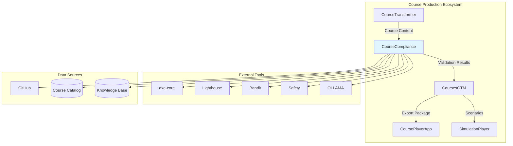

# CourseCompliance - Integration Specification

## Overview

CourseCompliance integrates with multiple systems in the course production ecosystem and external tools to provide comprehensive validation. This document specifies all integration points, data flows, and API contracts.

---

## Integration Architecture



---

## 1. Integration with CourseTransformer

### Purpose
Run compliance checks after transformation completes, feed issues back for regeneration.

### Data Flow

**CourseTransformer → CourseCompliance**:
```python
# After CourseTransformer completes
{
    "course_path": "/path/to/transformed/course",
    "transformation_id": "uuid",
    "source_type": "regeneration" | "modernization" | "creation",
    "metadata": {
        "course_name": str,
        "version": str,
        "author": str
    }
}
```

**CourseCompliance → CourseTransformer**:
```python
# Compliance results
{
    "compliance_id": "uuid",
    "launch_approved": bool,
    "issues": [
        {
            "id": str,
            "category": str,
            "severity": str,
            "description": str,
            "file": str,
            "line": int,
            "suggestion": str
        }
    ],
    "metrics": {
        "code_pass_rate": float,
        "wcag_compliance": float,
        "fact_accuracy": float
    }
}
```

### Integration Points

#### 1.1 Post-Transformation Hook

```python
# In CourseTransformer
def transform_course(course_path: str, config: Dict) -> Dict:
    """Transform course and run compliance"""
    
    # Run transformation
    result = run_transformation(course_path, config)
    
    # Automatically trigger compliance check
    if config.get("auto_compliance", True):
        from coursecompliance import run_compliance_check
        
        compliance_result = run_compliance_check(
            course_path=result["output_path"],
            compliance_profile=config.get("compliance_profile", "standard")
        )
        
        result["compliance"] = compliance_result
    
    return result
```

#### 1.2 Iterative Improvement Loop

```python
def iterative_improvement(course_path: str, max_iterations: int = 3):
    """Iteratively improve course based on compliance feedback"""
    
    for iteration in range(max_iterations):
        # Run compliance check
        compliance = run_compliance_check(course_path, "standard")
        
        if compliance["launch_approved"]:
            break
        
        # Feed issues back to regeneration agent
        critical_issues = [i for i in compliance["issues"] if i["severity"] == "critical"]
        
        if critical_issues:
            # Use CourseTransformer to fix issues
            fix_result = fix_issues_with_transformer(course_path, critical_issues)
    
    return compliance
```

### Shared State

Both systems use a shared state store for coordination:

```yaml
# shared_state.yaml
transformation_id: "uuid"
compliance_id: "uuid"
status: "transforming" | "validating" | "fixing" | "approved" | "rejected"
current_iteration: 1
max_iterations: 3
```

---

## 2. Integration with CoursesGTM

### Purpose
Validate exported curriculum JSON, check tier assignments, verify pricing alignment.

### Data Flow

**CourseCompliance → CoursesGTM**:
```python
# Compliance certificate
{
    "course_id": str,
    "compliance_status": "approved" | "rejected",
    "profile": str,
    "timestamp": datetime,
    "approver": str,
    "metrics": {
        "overall_score": float,  # 0-100
        "quality_tier": "premium" | "standard" | "basic"
    },
    "issues": {
        "critical": int,
        "warnings": int
    }
}
```

**CoursesGTM → CourseCompliance**:
```python
# Curriculum for validation
{
    "curriculum_json": {...},  # Full curriculum JSON
    "tier_assignment": str,
    "pricing": float,
    "target_audience": str
}
```

### Integration Points

#### 2.1 Pre-Export Validation

```python
# In CoursesGTM
def export_curriculum(course_path: str) -> Dict:
    """Export curriculum with compliance validation"""
    
    # Check if course is compliant
    from coursecompliance import check_compliance_status
    
    status = check_compliance_status(course_path)
    
    if not status["approved"]:
        raise ValueError(f"Course not compliant: {status['reason']}")
    
    # Proceed with export
    curriculum = generate_curriculum_json(course_path)
    return curriculum
```

#### 2.2 Tier Validation

```python
def validate_tier_assignment(course_path: str, assigned_tier: str) -> bool:
    """Validate tier matches course quality"""
    
    compliance = get_compliance_metrics(course_path)
    
    tier_requirements = {
        "premium": {"overall_score": 95, "wcag_compliance": 1.0},
        "standard": {"overall_score": 85, "wcag_compliance": 0.85},
        "basic": {"overall_score": 70, "wcag_compliance": 0.5}
    }
    
    requirements = tier_requirements[assigned_tier]
    
    return (
        compliance["overall_score"] >= requirements["overall_score"] and
        compliance["wcag_compliance"] >= requirements["wcag_compliance"]
    )
```

#### 2.3 Schema Validation

```python
def validate_curriculum_schema(curriculum_json: Dict) -> List[str]:
    """Validate exported curriculum matches schema"""
    
    from coursecompliance.validators import CurriculumSchemaValidator
    
    validator = CurriculumSchemaValidator()
    errors = validator.validate(curriculum_json)
    
    return errors
```

---

## 3. Integration with CoursePlayerApp

### Purpose
Validate app compatibility, check feature accessibility, test UI rendering.

### Integration Points

#### 3.1 Feature Compatibility Check

```python
def check_player_compatibility(course_path: str) -> Dict:
    """Check if course is compatible with CoursePlayerApp"""
    
    issues = []
    
    # Check feature usage
    features_used = extract_features_used(course_path)
    supported_features = get_player_supported_features()
    
    for feature in features_used:
        if feature not in supported_features:
            issues.append({
                "type": "unsupported_feature",
                "feature": feature,
                "suggestion": f"Replace {feature} with {get_alternative(feature)}"
            })
    
    # Check media formats
    media_files = find_media_files(course_path)
    for media in media_files:
        if not is_supported_format(media, supported_formats=["mp4", "webm"]):
            issues.append({
                "type": "unsupported_format",
                "file": media,
                "suggestion": "Convert to mp4 or webm"
            })
    
    return {"compatible": len(issues) == 0, "issues": issues}
```

#### 3.2 UI Rendering Test

```python
def test_ui_rendering(course_path: str) -> Dict:
    """Test course rendering in CoursePlayerApp"""
    
    from playwright.sync_api import sync_playwright
    
    with sync_playwright() as p:
        browser = p.chromium.launch()
        page = browser.new_page()
        
        # Load course in player
        page.goto(f"http://localhost:3000/course/{course_id}")
        
        # Check for rendering errors
        errors = page.evaluate("() => window.errors || []")
        
        # Check if all content loads
        lessons = page.query_selector_all(".lesson")
        
        browser.close()
        
        return {
            "rendered": len(errors) == 0,
            "lessons_loaded": len(lessons),
            "errors": errors
        }
```

---

## 4. Integration with SimulationPlayer

### Purpose
Validate scenario YAML files, check simulation achievability, verify agent guidance.

### Integration Points

#### 4.1 Scenario YAML Validation

```python
def validate_simulation_scenarios(course_path: str) -> List[Dict]:
    """Validate simulation scenario files"""
    
    scenarios = find_yaml_files(course_path, pattern="**/scenarios/*.yaml")
    issues = []
    
    for scenario_file in scenarios:
        scenario = yaml.safe_load(scenario_file.read_text())
        
        # Validate schema
        schema_errors = validate_scenario_schema(scenario)
        issues.extend(schema_errors)
        
        # Check step achievability
        for step in scenario.get("steps", []):
            if not is_step_achievable(step):
                issues.append({
                    "file": scenario_file,
                    "step": step["id"],
                    "issue": "Step may not be achievable",
                    "reason": check_step_feasibility(step)
                })
    
    return issues
```

#### 4.2 Agent Guidance Validation

```python
def validate_agent_guidance(scenario: Dict) -> List[str]:
    """Validate AI agent guidance in scenario"""
    
    issues = []
    
    for step in scenario.get("steps", []):
        guidance = step.get("agent_guidance", {})
        
        # Check if guidance is clear
        if not guidance.get("hint"):
            issues.append(f"Step {step['id']}: Missing hint")
        
        # Check if solution is provided
        if not guidance.get("solution"):
            issues.append(f"Step {step['id']}: Missing solution")
        
        # Validate guidance quality with LLM
        quality_score = check_guidance_quality(guidance)
        if quality_score < 0.7:
            issues.append(f"Step {step['id']}: Low quality guidance (score: {quality_score})")
    
    return issues
```

---

## 5. External Tool Integrations

### 5.1 axe-core (Accessibility Testing)

**Integration Method**: JavaScript API via Selenium/Playwright

```python
from selenium import webdriver
from axe_selenium_python import Axe

def run_axe_accessibility_check(html_file: str) -> Dict:
    """Run axe-core accessibility checks"""
    
    driver = webdriver.Chrome()
    driver.get(f"file://{html_file}")
    
    axe = Axe(driver)
    axe.inject()
    results = axe.run()
    
    driver.quit()
    
    # Convert to standard issue format
    issues = []
    for violation in results["violations"]:
        for node in violation["nodes"]:
            issues.append({
                "id": f"A11Y-{violation['id'].upper()}",
                "severity": map_axe_severity(violation["impact"]),
                "category": "accessibility",
                "subcategory": "wcag",
                "title": violation["help"],
                "description": violation["description"],
                "file": html_file,
                "wcag_rule": violation["id"],
                "reference": violation["helpUrl"]
            })
    
    return {"issues": issues, "summary": results}


def map_axe_severity(impact: str) -> str:
    """Map axe impact to our severity levels"""
    mapping = {
        "critical": "critical",
        "serious": "critical",
        "moderate": "warning",
        "minor": "info"
    }
    return mapping.get(impact, "warning")
```

### 5.2 Lighthouse (Performance Auditing)

**Integration Method**: CLI via subprocess

```python
import subprocess
import json

def run_lighthouse_audit(html_file: str) -> Dict:
    """Run Lighthouse performance audit"""
    
    result = subprocess.run(
        [
            "lighthouse",
            f"file://{html_file}",
            "--output=json",
            "--quiet",
            "--chrome-flags='--headless'"
        ],
        capture_output=True,
        text=True
    )
    
    if result.returncode != 0:
        raise Exception(f"Lighthouse failed: {result.stderr}")
    
    report = json.loads(result.stdout)
    
    # Extract key metrics
    return {
        "performance_score": report["categories"]["performance"]["score"] * 100,
        "accessibility_score": report["categories"]["accessibility"]["score"] * 100,
        "best_practices_score": report["categories"]["best-practices"]["score"] * 100,
        "seo_score": report["categories"]["seo"]["score"] * 100,
        "metrics": {
            "first_contentful_paint": report["audits"]["first-contentful-paint"]["numericValue"],
            "speed_index": report["audits"]["speed-index"]["numericValue"],
            "time_to_interactive": report["audits"]["interactive"]["numericValue"],
            "total_blocking_time": report["audits"]["total-blocking-time"]["numericValue"]
        },
        "opportunities": extract_opportunities(report)
    }
```

### 5.3 Bandit (Python Security)

**Integration Method**: Python API

```python
from bandit.core import manager as bandit_manager
from bandit.core import config as bandit_config

def run_bandit_security_scan(python_files: List[str]) -> Dict:
    """Run Bandit security scan on Python files"""
    
    # Configure Bandit
    b_conf = bandit_config.BanditConfig()
    b_mgr = bandit_manager.BanditManager(b_conf, "file")
    
    # Discover and run
    b_mgr.discover_files(python_files)
    b_mgr.run_tests()
    
    # Get results
    results = b_mgr.get_issue_list()
    
    # Convert to standard format
    issues = []
    for issue in results:
        issues.append({
            "id": f"SEC-{issue.test_id}",
            "severity": map_bandit_severity(issue.severity),
            "category": "security",
            "subcategory": "vulnerabilities",
            "title": issue.test,
            "description": issue.text,
            "file": issue.fname,
            "line": issue.lineno,
            "code_snippet": issue.get_code(),
            "cwe": issue.cwe,
            "reference": f"https://bandit.readthedocs.io/en/latest/plugins/{issue.test_id}.html"
        })
    
    return {"issues": issues, "summary": b_mgr.get_results()}
```

### 5.4 Safety (Dependency Vulnerabilities)

**Integration Method**: CLI via subprocess

```python
def run_safety_check(requirements_file: str) -> Dict:
    """Check for vulnerable dependencies"""
    
    result = subprocess.run(
        ["safety", "check", "-r", requirements_file, "--json"],
        capture_output=True,
        text=True
    )
    
    if result.stdout:
        vulnerabilities = json.loads(result.stdout)
    else:
        vulnerabilities = []
    
    issues = []
    for vuln in vulnerabilities:
        issues.append({
            "id": f"SEC-DEP-{vuln['id']}",
            "severity": "critical" if vuln.get("severity") == "high" else "warning",
            "category": "security",
            "subcategory": "dependency_security",
            "title": f"Vulnerable dependency: {vuln['package']}",
            "description": vuln["advisory"],
            "file": requirements_file,
            "cve": vuln.get("cve"),
            "affected_versions": vuln["affected_versions"],
            "fixed_version": vuln.get("fixed_in"),
            "reference": vuln.get("more_info_url")
        })
    
    return {"issues": issues, "vulnerable_packages": len(vulnerabilities)}
```

### 5.5 OLLAMA (AI-Powered Analysis)

**Integration Method**: HTTP API

```python
import requests

class OllamaClient:
    """Client for OLLAMA AI models"""
    
    def __init__(self, base_url: str = "http://localhost:11434"):
        self.base_url = base_url
    
    def analyze_text(self, text: str, task: str) -> str:
        """Use OLLAMA for text analysis tasks"""
        
        prompts = {
            "fact_check": "Verify the factual accuracy of the following technical content:\n\n{text}\n\nIdentify any factual errors or outdated information.",
            "tone_analysis": "Analyze the tone of the following educational content:\n\n{text}\n\nIs it appropriate, encouraging, and professional?",
            "objective_quality": "Evaluate the quality of these learning objectives:\n\n{text}\n\nAre they specific, measurable, and use action verbs?"
        }
        
        prompt = prompts[task].format(text=text)
        
        response = requests.post(
            f"{self.base_url}/api/generate",
            json={
                "model": "llama2",
                "prompt": prompt,
                "stream": False
            }
        )
        
        return response.json()["response"]
    
    def describe_image(self, image_path: str) -> str:
        """Generate alt text for image"""
        
        with open(image_path, "rb") as f:
            image_data = base64.b64encode(f.read()).decode()
        
        response = requests.post(
            f"{self.base_url}/api/generate",
            json={
                "model": "llava",  # Vision model
                "prompt": "Describe this image in detail for accessibility (alt text):",
                "images": [image_data],
                "stream": False
            }
        )
        
        return response.json()["response"]
```

---

## 6. GitHub Integration

### Purpose
Access course repository, file history, pull requests

```python
from github import Github

class GitHubIntegration:
    """Integration with GitHub API"""
    
    def __init__(self, token: str):
        self.gh = Github(token)
    
    def get_changed_files(self, repo_name: str, pr_number: int) -> List[str]:
        """Get files changed in a PR"""
        
        repo = self.gh.get_repo(repo_name)
        pr = repo.get_pull(pr_number)
        
        files = [f.filename for f in pr.get_files()]
        return files
    
    def post_compliance_comment(self, repo_name: str, pr_number: int, result: Dict):
        """Post compliance results as PR comment"""
        
        repo = self.gh.get_repo(repo_name)
        pr = repo.get_pull(pr_number)
        
        comment = format_compliance_comment(result)
        pr.create_issue_comment(comment)
```

---

## 7. Database Integration

### Course Catalog Database

```python
import sqlite3

class CourseCatalogDB:
    """Integration with course catalog database"""
    
    def __init__(self, db_path: str):
        self.conn = sqlite3.connect(db_path)
    
    def check_prerequisite_exists(self, course_id: str) -> bool:
        """Check if prerequisite course exists"""
        
        cursor = self.conn.cursor()
        cursor.execute("SELECT id FROM courses WHERE id = ?", (course_id,))
        return cursor.fetchone() is not None
    
    def get_course_metadata(self, course_id: str) -> Dict:
        """Get course metadata from catalog"""
        
        cursor = self.conn.cursor()
        cursor.execute("""
            SELECT name, version, author, status, tier
            FROM courses
            WHERE id = ?
        """, (course_id,))
        
        row = cursor.fetchone()
        if row:
            return {
                "name": row[0],
                "version": row[1],
                "author": row[2],
                "status": row[3],
                "tier": row[4]
            }
        return None
    
    def save_compliance_result(self, course_id: str, result: Dict):
        """Save compliance result to database"""
        
        cursor = self.conn.cursor()
        cursor.execute("""
            INSERT INTO compliance_results (course_id, timestamp, approved, profile, metrics)
            VALUES (?, ?, ?, ?, ?)
        """, (
            course_id,
            datetime.now(),
            result["launch_approved"],
            result["compliance_profile"],
            json.dumps(result["metrics"])
        ))
        self.conn.commit()
```

---

## 8. Knowledge Base Integration

### RAG System for Fact-Checking

```python
from langchain.vectorstores import Chroma
from langchain.embeddings import OllamaEmbeddings

class KnowledgeBase:
    """Integration with knowledge base for fact-checking"""
    
    def __init__(self, kb_path: str):
        self.embeddings = OllamaEmbeddings(model="llama2")
        self.vectorstore = Chroma(
            persist_directory=kb_path,
            embedding_function=self.embeddings
        )
    
    def verify_fact(self, claim: str) -> Dict:
        """Verify factual claim against knowledge base"""
        
        # Search for relevant documents
        docs = self.vectorstore.similarity_search(claim, k=3)
        
        # Use LLM to compare claim with sources
        prompt = f"""
        Claim: {claim}
        
        Sources:
        {'\n\n'.join([doc.page_content for doc in docs])}
        
        Is the claim accurate according to these sources? Yes/No and explain.
        """
        
        verification = ollama_client.analyze_text(prompt, "fact_check")
        
        return {
            "claim": claim,
            "accurate": "yes" in verification.lower(),
            "explanation": verification,
            "sources": [doc.metadata for doc in docs]
        }
```

---

## Integration Testing

### End-to-End Integration Tests

```python
def test_full_pipeline_integration():
    """Test complete pipeline from transformation to launch"""
    
    # 1. CourseTransformer creates course
    course_path = transform_course("source_content/", "standard")
    
    # 2. CourseCompliance validates
    compliance = run_compliance_check(course_path, "standard")
    assert compliance["launch_approved"]
    
    # 3. CoursesGTM exports
    curriculum = export_curriculum(course_path)
    assert validate_curriculum_schema(curriculum) == []
    
    # 4. CoursePlayerApp can render
    rendering = test_ui_rendering(course_path)
    assert rendering["rendered"]
    
    # 5. SimulationPlayer scenarios valid
    scenarios = validate_simulation_scenarios(course_path)
    assert len(scenarios) == 0
```

---

## Conclusion

CourseCompliance integrates seamlessly with:

1. **Course Production Ecosystem**: Automated workflows with other modules
2. **External Tools**: Leverages best-in-class validation tools
3. **Data Sources**: Accesses required data for comprehensive validation
4. **APIs**: Well-defined contracts for all integrations

These integrations enable comprehensive, automated course validation while maintaining flexibility and extensibility.
