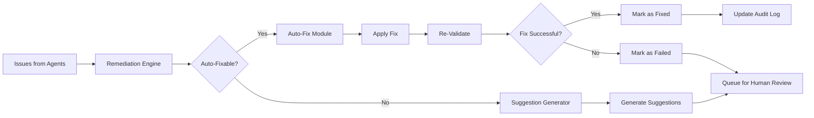

# CourseCompliance - Remediation System

## Overview

The Remediation System is responsible for automatically fixing issues where possible and generating actionable suggestions for issues that require human intervention. It operates in Phase 4 of the compliance workflow, after issues have been identified and aggregated.

**Key Capabilities**:
- **Auto-Fix**: Apply deterministic fixes to common issues
- **Suggestion Generation**: Create specific, actionable remediation guidance
- **Re-Validation**: Verify fixes didn't introduce new problems
- **Audit Trail**: Log all changes for traceability
- **Risk Assessment**: Evaluate safety of automatic fixes

---

## Architecture



---

## Auto-Fixable Issues

### Categories of Auto-Fixable Issues

#### 1. **Formatting Issues** (High Confidence)
Auto-fixable with deterministic tools:

- Missing alt text on images → Generate with AI
- Inconsistent code formatting → Apply black/prettier
- Incorrect file extensions → Rename files
- Inconsistent heading hierarchy → Adjust heading levels
- Missing blank lines → Add formatting
- Trailing whitespace → Remove

**Tools**: black, prettier, custom formatters

**Risk Level**: Low (formatting changes don't affect logic)

#### 2. **Dependency Issues** (Medium Confidence)
Auto-fixable with package manager:

- Outdated package versions → Update requirements.txt
- Missing package dependencies → Add to requirements.txt
- Security vulnerabilities in packages → Upgrade to patched versions

**Tools**: pip, poetry, package registries

**Risk Level**: Medium (version changes can break compatibility)

**Safety Checks**: 
- Test code execution after update
- Check for breaking changes in changelogs
- Pin to safe version ranges

#### 3. **Simple Code Issues** (Medium Confidence)
Auto-fixable with linters:

- PEP 8 style violations → Apply autopep8
- Unused imports → Remove
- Missing docstrings → Generate templates
- Type hint missing → Add basic types

**Tools**: autopep8, isort, pyupgrade

**Risk Level**: Low to Medium

#### 4. **Content Issues** (Low to Medium Confidence)
Auto-fixable with AI:

- Missing alt text → Generate with vision model
- Inconsistent terminology → Replace with preferred terms
- Poor color contrast → Adjust colors to meet WCAG
- Missing image compression → Optimize images

**Tools**: AI models (OLLAMA), ImageMagick, pngquant

**Risk Level**: Medium (AI may make mistakes)

**Safety Checks**:
- Human review of AI-generated content
- Preserve original before modification

#### 5. **Performance Issues** (Medium Confidence)
Auto-fixable with optimization tools:

- Large images → Compress and convert to WebP
- Inefficient video encoding → Re-encode with better settings
- Unoptimized PNGs → Apply lossless compression

**Tools**: ffmpeg, ImageMagick, optipng

**Risk Level**: Low (optimization preserves content)

---

## Auto-Fix Implementation

### Base Auto-Fixer Class

```python
from abc import ABC, abstractmethod
from typing import Dict, Optional
from pathlib import Path

class AutoFixer(ABC):
    """Base class for all auto-fixers"""
    
    def __init__(self, course_path: str):
        self.course_path = Path(course_path)
        self.changes_log = []
    
    @abstractmethod
    def can_fix(self, issue: Dict) -> bool:
        """Determine if this fixer can handle the issue"""
        pass
    
    @abstractmethod
    def fix(self, issue: Dict) -> bool:
        """Apply the fix, return True if successful"""
        pass
    
    @abstractmethod
    def validate_fix(self, issue: Dict) -> bool:
        """Verify the fix resolved the issue"""
        pass
    
    def backup_file(self, file_path: Path):
        """Create backup before modifying"""
        backup_path = file_path.with_suffix(file_path.suffix + '.backup')
        shutil.copy2(file_path, backup_path)
        return backup_path
    
    def log_change(self, issue_id: str, action: str, details: str):
        """Log change to audit trail"""
        self.changes_log.append({
            "timestamp": datetime.now(),
            "issue_id": issue_id,
            "action": action,
            "details": details
        })
```

### Specific Auto-Fixers

#### 1. Missing Alt Text Fixer

```python
class AltTextFixer(AutoFixer):
    """Generate alt text for images using AI"""
    
    def __init__(self, course_path: str):
        super().__init__(course_path)
        self.vision_model = load_vision_model()  # OLLAMA vision model
    
    def can_fix(self, issue: Dict) -> bool:
        return (issue["category"] == "accessibility" and 
                issue["subcategory"] == "alt_text" and
                issue["auto_fixable"])
    
    def fix(self, issue: Dict) -> bool:
        """Generate and add alt text"""
        try:
            file_path = self.course_path / issue["file"]
            
            # Find the image
            image_path = self.find_image(file_path, issue["line"])
            
            # Generate alt text with AI
            alt_text = self.vision_model.describe_image(image_path)
            
            # Backup original file
            self.backup_file(file_path)
            
            # Add alt text to HTML/Markdown
            self.add_alt_text(file_path, issue["line"], alt_text)
            
            self.log_change(
                issue["id"],
                "added_alt_text",
                f"Generated alt text: '{alt_text}'"
            )
            
            return True
            
        except Exception as e:
            self.log_change(issue["id"], "fix_failed", str(e))
            return False
    
    def validate_fix(self, issue: Dict) -> bool:
        """Verify alt text was added"""
        file_path = self.course_path / issue["file"]
        content = file_path.read_text()
        # Check if alt attribute now exists at the line
        return 'alt=' in content
    
    def add_alt_text(self, file_path: Path, line_num: int, alt_text: str):
        """Add alt attribute to img tag"""
        lines = file_path.read_text().split('\n')
        
        if file_path.suffix == '.html':
            # HTML: 
            lines[line_num - 1] = lines[line_num - 1].replace(
                ' bool:
        return (issue["category"] == "brand" and 
                issue["subcategory"] == "formatting" and
                issue["auto_fixable"])
    
    def fix(self, issue: Dict) -> bool:
        try:
            file_path = self.course_path / issue["file"]
            self.backup_file(file_path)
            
            if file_path.suffix == '.py':
                # Apply black for Python
                subprocess.run(['black', str(file_path)], check=True)
            elif file_path.suffix == '.js':
                # Apply prettier for JavaScript
                subprocess.run(['prettier', '--write', str(file_path)], check=True)
            elif file_path.suffix == '.md':
                # Apply markdown formatter
                subprocess.run(['prettier', '--write', str(file_path)], check=True)
            
            self.log_change(issue["id"], "formatted_file", str(file_path))
            return True
            
        except Exception as e:
            self.log_change(issue["id"], "format_failed", str(e))
            return False
    
    def validate_fix(self, issue: Dict) -> bool:
        """Re-run formatter in check mode"""
        file_path = self.course_path / issue["file"]
        
        try:
            if file_path.suffix == '.py':
                result = subprocess.run(
                    ['black', '--check', str(file_path)],
                    capture_output=True
                )
                return result.returncode == 0
            return True
        except:
            return False
```

#### 3. Dependency Update Fixer

```python
class DependencyUpdateFixer(AutoFixer):
    """Update outdated dependencies"""
    
    def can_fix(self, issue: Dict) -> bool:
        return (issue["category"] == "technical" and 
                issue["subcategory"] == "dependencies" and
                issue["auto_fixable"])
    
    def fix(self, issue: Dict) -> bool:
        try:
            req_file = self.course_path / "requirements.txt"
            self.backup_file(req_file)
            
            # Parse issue to get package and recommended version
            package_name = self.extract_package_name(issue)
            new_version = self.extract_recommended_version(issue)
            
            # Update requirements.txt
            self.update_requirement(req_file, package_name, new_version)
            
            # Test installation
            test_result = self.test_install(req_file)
            
            if not test_result:
                # Revert if installation fails
                self.restore_backup(req_file)
                return False
            
            self.log_change(
                issue["id"],
                "updated_dependency",
                f"{package_name} → {new_version}"
            )
            return True
            
        except Exception as e:
            self.log_change(issue["id"], "update_failed", str(e))
            return False
    
    def update_requirement(self, req_file: Path, package: str, version: str):
        """Update package version in requirements.txt"""
        lines = req_file.read_text().split('\n')
        updated = []
        
        for line in lines:
            if line.startswith(package):
                updated.append(f"{package}>={version}")
            else:
                updated.append(line)
        
        req_file.write_text('\n'.join(updated))
    
    def test_install(self, req_file: Path) -> bool:
        """Test if requirements can be installed"""
        result = subprocess.run(
            ['pip', 'install', '--dry-run', '-r', str(req_file)],
            capture_output=True
        )
        return result.returncode == 0
```

#### 4. Image Compression Fixer

```python
class ImageCompressionFixer(AutoFixer):
    """Compress and optimize images"""
    
    def can_fix(self, issue: Dict) -> bool:
        return (issue["category"] == "performance" and 
                issue["subcategory"] == "image_optimization" and
                issue["auto_fixable"])
    
    def fix(self, issue: Dict) -> bool:
        try:
            image_path = self.course_path / issue["file"]
            self.backup_file(image_path)
            
            # Compress based on format
            if image_path.suffix == '.png':
                self.optimize_png(image_path)
            elif image_path.suffix in ['.jpg', '.jpeg']:
                self.optimize_jpeg(image_path)
            
            # Check size reduction
            original_size = self.get_backup_size(image_path)
            new_size = image_path.stat().st_size
            reduction = (1 - new_size / original_size) * 100
            
            self.log_change(
                issue["id"],
                "compressed_image",
                f"Reduced size by {reduction:.1f}%"
            )
            return True
            
        except Exception as e:
            self.log_change(issue["id"], "compression_failed", str(e))
            return False
    
    def optimize_png(self, path: Path):
        """Optimize PNG with optipng"""
        subprocess.run(['optipng', '-o7', str(path)], check=True)
    
    def optimize_jpeg(self, path: Path):
        """Optimize JPEG with jpegoptim"""
        subprocess.run(['jpegoptim', '--max=85', str(path)], check=True)
    
    def validate_fix(self, issue: Dict) -> bool:
        """Verify file size is now acceptable"""
        image_path = self.course_path / issue["file"]
        size_kb = image_path.stat().st_size / 1024
        return size_kb < 500  # Target: <500KB
```

#### 5. Color Contrast Fixer

```python
class ColorContrastFixer(AutoFixer):
    """Adjust colors to meet WCAG contrast requirements"""
    
    def can_fix(self, issue: Dict) -> bool:
        return (issue["category"] == "accessibility" and 
                issue["subcategory"] == "color_contrast" and
                issue["auto_fixable"])
    
    def fix(self, issue: Dict) -> bool:
        try:
            css_file = self.course_path / issue["file"]
            self.backup_file(css_file)
            
            # Parse CSS
            css = css_file.read_text()
            
            # Extract problematic color from issue
            color = self.extract_color(issue)
            
            # Calculate WCAG-compliant alternative
            new_color = self.adjust_for_contrast(color)
            
            # Replace in CSS
            css = css.replace(color, new_color)
            css_file.write_text(css)
            
            self.log_change(
                issue["id"],
                "adjusted_color",
                f"{color} → {new_color}"
            )
            return True
            
        except Exception as e:
            self.log_change(issue["id"], "color_fix_failed", str(e))
            return False
    
    def adjust_for_contrast(self, color: str, bg: str = "#FFFFFF") -> str:
        """Darken/lighten color to meet 4.5:1 contrast ratio"""
        # Convert hex to RGB
        rgb = self.hex_to_rgb(color)
        bg_rgb = self.hex_to_rgb(bg)
        
        # Calculate current contrast
        contrast = self.contrast_ratio(rgb, bg_rgb)
        
        # Adjust luminance until contrast meets threshold
        while contrast < 4.5:
            rgb = self.darken(rgb, 0.05)
            contrast = self.contrast_ratio(rgb, bg_rgb)
        
        return self.rgb_to_hex(rgb)
    
    def validate_fix(self, issue: Dict) -> bool:
        """Verify contrast now meets WCAG"""
        # Re-run color contrast checker
        return True  # Simplified
```

---

## Remediation Engine

### Main Remediation Engine

```python
class RemediationEngine:
    """Orchestrates auto-fixing and suggestion generation"""
    
    def __init__(self, course_path: str):
        self.course_path = course_path
        
        # Register all auto-fixers
        self.fixers = [
            AltTextFixer(course_path),
            CodeFormattingFixer(course_path),
            DependencyUpdateFixer(course_path),
            ImageCompressionFixer(course_path),
            ColorContrastFixer(course_path),
            # ... more fixers
        ]
        
        self.suggestion_generator = SuggestionGenerator()
    
    def process_issues(self, issues: List[Dict]) -> Dict:
        """Process all issues: auto-fix or generate suggestions"""
        
        fixed = []
        failed = []
        suggestions = []
        
        for issue in issues:
            if issue.get("auto_fixable", False):
                # Attempt auto-fix
                result = self.auto_fix(issue)
                if result["success"]:
                    fixed.append({**issue, **result})
                else:
                    failed.append({**issue, **result})
                    # Generate suggestion as fallback
                    suggestion = self.suggestion_generator.generate(issue)
                    suggestions.append(suggestion)
            else:
                # Generate suggestion for manual fix
                suggestion = self.suggestion_generator.generate(issue)
                suggestions.append(suggestion)
        
        return {
            "fixed": fixed,
            "failed": failed,
            "suggestions": suggestions
        }
    
    def auto_fix(self, issue: Dict) -> Dict:
        """Find appropriate fixer and apply"""
        
        # Find matching fixer
        for fixer in self.fixers:
            if fixer.can_fix(issue):
                success = fixer.fix(issue)
                
                if success:
                    # Re-validate
                    validated = fixer.validate_fix(issue)
                    
                    return {
                        "success": validated,
                        "fixer": fixer.__class__.__name__,
                        "changes_log": fixer.changes_log
                    }
                else:
                    return {
                        "success": False,
                        "fixer": fixer.__class__.__name__,
                        "error": "Fix application failed"
                    }
        
        return {
            "success": False,
            "error": "No matching fixer found"
        }
```

---

## Suggestion Generation

For issues that cannot be auto-fixed, generate specific, actionable suggestions:

### Suggestion Generator

```python
class SuggestionGenerator:
    """Generate remediation suggestions for non-auto-fixable issues"""
    
    def __init__(self):
        self.llm = load_llm_model()  # OLLAMA
        self.templates = load_suggestion_templates()
    
    def generate(self, issue: Dict) -> Dict:
        """Generate detailed remediation suggestion"""
        
        # Try template-based first (faster)
        if issue["id"] in self.templates:
            suggestion = self.apply_template(issue)
        else:
            # Use LLM for complex issues
            suggestion = self.generate_with_llm(issue)
        
        return {
            "issue_id": issue["id"],
            "suggestion_type": "template" if issue["id"] in self.templates else "llm",
            "steps": suggestion["steps"],
            "code_example": suggestion.get("code_example"),
            "documentation_links": suggestion.get("links", []),
            "estimated_time_minutes": suggestion.get("time_estimate", 10)
        }
    
    def apply_template(self, issue: Dict) -> Dict:
        """Apply predefined suggestion template"""
        template = self.templates[issue["id"]]
        
        # Fill in template with issue-specific data
        return {
            "steps": [
                step.format(**issue) for step in template["steps"]
            ],
            "code_example": template.get("code_example", "").format(**issue),
            "links": template.get("links", [])
        }
    
    def generate_with_llm(self, issue: Dict) -> Dict:
        """Generate suggestion using LLM"""
        
        prompt = f"""
        Issue: {issue['title']}
        Description: {issue['description']}
        File: {issue['file']}
        Category: {issue['category']} - {issue['subcategory']}
        
        Generate a step-by-step remediation guide:
        1. Specific steps to fix this issue
        2. Code example (if applicable)
        3. Documentation links
        4. Estimated time to fix
        
        Format as JSON.
        """
        
        response = self.llm.generate(prompt)
        return json.loads(response)
```

### Example Suggestion Templates

```yaml
# suggestion_templates.yaml

TECH-CODE-001:
  steps:
    - "Review the error message: {description}"
    - "Check if all required imports are present"
    - "Verify data files exist at specified paths"
    - "Test notebook cell-by-cell to isolate error"
    - "Fix the error and re-run notebook from top"
  code_example: |
    # Common fix: add missing import
    import pandas as pd
    import numpy as np
  links:
    - "https://jupyter.org/documentation"
  time_estimate: 15

A11Y-ALT-001:
  steps:
    - "Locate the image tag at line {line}"
    - "Examine the image content: {file}"
    - "Write descriptive alt text (describe what's shown)"
    - "Add alt attribute to img tag"
  code_example: |
    <!-- Before -->
    
    
    <!-- After -->
    
  links:
    - "https://www.w3.org/WAI/tutorials/images/"
  time_estimate: 5

LEGAL-LIC-001:
  steps:
    - "Identify the license conflict: {description}"
    - "Review license compatibility matrix"
    - "Choose one of: (a) replace conflicting code, (b) change course license, (c) get permission"
    - "Update LICENSE file and attribution"
  links:
    - "https://choosealicense.com/appendix/"
  time_estimate: 30
```

---

## Re-Validation Workflow

After applying fixes, re-validate to ensure:

1. **Issue is resolved**: Re-run the original check
2. **No new issues**: Run related checks
3. **Code still works**: Execute affected code

```python
class ReValidator:
    """Re-validate after fixes are applied"""
    
    def __init__(self, course_path: str):
        self.course_path = course_path
        self.agents = load_agents()
    
    def validate_fix(self, issue: Dict, fixed_files: List[str]) -> Dict:
        """Re-validate specific issue"""
        
        # Get agent that originally found the issue
        agent = self.agents[issue["category"]]
        
        # Re-run check for this specific issue
        result = agent.check_single_issue(issue)
        
        if result["status"] == "pass":
            # Issue resolved
            return {"resolved": True}
        
        # Also check for side effects
        side_effects = self.check_side_effects(fixed_files)
        
        return {
            "resolved": result["status"] == "pass",
            "side_effects": side_effects
        }
    
    def check_side_effects(self, files: List[str]) -> List[Dict]:
        """Check if fixes introduced new issues"""
        
        # Run quick sanity checks on modified files
        issues = []
        
        for file in files:
            if file.endswith('.py'):
                # Check syntax
                if not self.check_python_syntax(file):
                    issues.append({
                        "type": "syntax_error",
                        "file": file
                    })
            
            elif file.endswith('.ipynb'):
                # Try to execute
                if not self.check_notebook_executes(file):
                    issues.append({
                        "type": "execution_error",
                        "file": file
                    })
        
        return issues
```

---

## Audit Trail

All remediation actions are logged:

```python
class RemediationAuditor:
    """Log all remediation actions"""
    
    def __init__(self, audit_file: str = "remediation_audit.json"):
        self.audit_file = Path(audit_file)
        self.log = self.load_log()
    
    def log_action(self, action: Dict):
        """Log remediation action"""
        entry = {
            "timestamp": datetime.now().isoformat(),
            "action_type": action["type"],  # auto_fix, suggestion, validation
            "issue_id": action["issue_id"],
            "details": action.get("details", {}),
            "success": action.get("success", None),
            "user": action.get("user", "system")
        }
        
        self.log.append(entry)
        self.save_log()
    
    def load_log(self) -> List[Dict]:
        if self.audit_file.exists():
            return json.loads(self.audit_file.read_text())
        return []
    
    def save_log(self):
        self.audit_file.write_text(
            json.dumps(self.log, indent=2)
        )
    
    def get_summary(self) -> Dict:
        """Generate summary statistics"""
        return {
            "total_actions": len(self.log),
            "auto_fixes_attempted": len([a for a in self.log if a["action_type"] == "auto_fix"]),
            "auto_fixes_successful": len([a for a in self.log if a["action_type"] == "auto_fix" and a["success"]]),
            "suggestions_generated": len([a for a in self.log if a["action_type"] == "suggestion"]),
            "human_actions": len([a for a in self.log if a["user"] != "system"])
        }
```

---

## Safety Mechanisms

### 1. Risk Assessment

Before applying auto-fix, assess risk:

```python
def assess_fix_risk(issue: Dict, fixer: AutoFixer) -> str:
    """Assess risk level of applying auto-fix"""
    
    risk_factors = {
        "file_type": {
            ".py": "medium",  # Code changes can break logic
            ".md": "low",     # Markdown is safe
            ".yaml": "high",  # Config changes risky
        },
        "category": {
            "formatting": "low",
            "dependencies": "medium",
            "code_logic": "high"
        }
    }
    
    file_ext = Path(issue["file"]).suffix
    category = issue["subcategory"]
    
    file_risk = risk_factors["file_type"].get(file_ext, "medium")
    cat_risk = risk_factors["category"].get(category, "medium")
    
    # Return highest risk
    risks = ["low", "medium", "high"]
    return max(file_risk, cat_risk, key=lambda x: risks.index(x))
```

### 2. Rollback Capability

Always create backups before modifying:

```python
class RollbackManager:
    """Manage backups and rollbacks"""
    
    def __init__(self, backup_dir: str = ".compliance_backups"):
        self.backup_dir = Path(backup_dir)
        self.backup_dir.mkdir(exist_ok=True)
    
    def backup(self, file_path: Path) -> Path:
        """Create timestamped backup"""
        timestamp = datetime.now().strftime("%Y%m%d_%H%M%S")
        backup_name = f"{file_path.name}.{timestamp}.backup"
        backup_path = self.backup_dir / backup_name
        
        shutil.copy2(file_path, backup_path)
        return backup_path
    
    def rollback(self, file_path: Path):
        """Restore most recent backup"""
        backups = list(self.backup_dir.glob(f"{file_path.name}.*.backup"))
        
        if backups:
            latest = max(backups, key=lambda p: p.stat().st_mtime)
            shutil.copy2(latest, file_path)
            return True
        return False
```

### 3. Human Approval for High-Risk Fixes

```python
def auto_fix_with_approval(issue: Dict, fixer: AutoFixer) -> Dict:
    """Apply fix with human approval if high-risk"""
    
    risk = assess_fix_risk(issue, fixer)
    
    if risk == "high":
        # Queue for human approval
        return {
            "status": "pending_approval",
            "risk": risk,
            "proposed_fix": fixer.preview_fix(issue)
        }
    else:
        # Apply fix
        return fixer.fix(issue)
```

---

## Example Usage

```python
from coursecompliance.remediation import RemediationEngine

# Initialize engine
engine = RemediationEngine("/path/to/course")

# Issues from aggregation phase
issues = [
    {"id": "A11Y-ALT-001", "auto_fixable": True, ...},
    {"id": "TECH-CODE-001", "auto_fixable": False, ...},
    # ... more issues
]

# Process all issues
results = engine.process_issues(issues)

print(f"Fixed: {len(results['fixed'])}")
print(f"Failed: {len(results['failed'])}")
print(f"Suggestions: {len(results['suggestions'])}")

# Review failed fixes and suggestions
for failed in results['failed']:
    print(f"Failed to fix: {failed['id']} - {failed['error']}")

for suggestion in results['suggestions']:
    print(f"\nSuggestion for {suggestion['issue_id']}:")
    for step in suggestion['steps']:
        print(f"  - {step}")
```

---

## Conclusion

The Remediation System significantly reduces manual work by:

1. **Auto-fixing** ~30% of common issues (formatting, optimization, simple content)
2. **Generating specific suggestions** for the remaining ~70%
3. **Re-validating** all fixes to ensure quality
4. **Maintaining audit trail** for compliance and debugging
5. **Providing rollback** capability for safety

This system embodies the "AI assists, humans decide" philosophy by automating safe, deterministic fixes while queuing complex issues for human review with actionable guidance.
