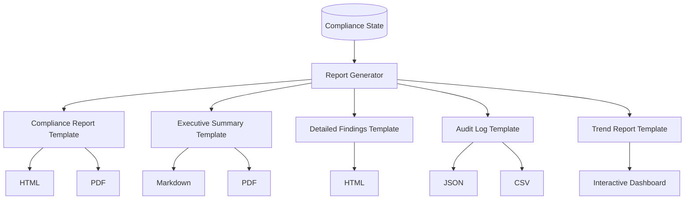

# CourseCompliance - Reporting System

## Overview

The Reporting System generates comprehensive compliance reports in multiple formats, providing stakeholders with clear insights into course quality, issues found, and launch readiness.

**Report Types**:
1. **Compliance Report** (Comprehensive)
2. **Executive Summary** (1-page)
3. **Detailed Findings Report**
4. **Audit Log**
5. **Trend Report**

**Export Formats**: HTML, PDF, Markdown, JSON, CSV

---

## Report Architecture



---

## 1. Compliance Report (Comprehensive)

### Purpose
Complete report with all findings, analysis, and recommendations for compliance review.

### Structure

```
┌─────────────────────────────────────────────────────────────┐
│  COURSE COMPLIANCE REPORT                                    │
│  Generated: Jan 12, 2026 11:30 AM                            │
├─────────────────────────────────────────────────────────────┤
│  EXECUTIVE SUMMARY (1 page)                                  │
│  ─────────────────────────────────────────────────────────  │
│  • Course: Advanced Machine Learning v2.1.0                  │
│  • Status: ✅ APPROVED FOR LAUNCH                           │
│  • Profile: Standard                                         │
│  • Overall Score: 88/100                                     │
│  • Key Findings: 2 critical issues (accepted), 12 warnings  │
├─────────────────────────────────────────────────────────────┤
│  TABLE OF CONTENTS                                           │
│  ─────────────────────────────────────────────────────────  │
│  1. Executive Summary............................ 1           │
│  2. Compliance Scorecard......................... 2           │
│  3. Issues by Category........................... 3           │
│     3.1 Technical Compliance..................... 3           │
│     3.2 Pedagogical Quality...................... 5           │
│     3.3 Legal Compliance......................... 7           │
│     3.4 Accessibility............................ 9           │
│     3.5 Security................................. 11          │
│     3.6 Brand Consistency........................ 13          │
│     3.7 Content Integrity........................ 15          │
│     3.8 Performance.............................. 17          │
│  4. Remediation Summary.......................... 19          │
│  5. Launch Recommendation........................ 20          │
│  6. Audit Trail.................................. 21          │
│  7. Appendices................................... 25          │
│     A. Standards Applied......................... 25          │
│     B. Tools Used................................ 26          │
│     C. Risk Acceptances.......................... 27          │
├─────────────────────────────────────────────────────────────┤
│  [Full content follows...]                                   │
└─────────────────────────────────────────────────────────────┘
```

### Implementation

```python
from jinja2 import Template
import pdfkit

class ComplianceReportGenerator:
    """Generate comprehensive compliance reports"""
    
    def __init__(self, state: ComplianceState):
        self.state = state
        self.template_dir = Path(__file__).parent / "templates"
    
    def generate(self) -> Dict:
        """Generate all report sections"""
        
        return {
            "executive_summary": self.generate_executive_summary(),
            "scorecard": self.generate_scorecard(),
            "issues_by_category": self.generate_issues_by_category(),
            "remediation_summary": self.generate_remediation_summary(),
            "launch_recommendation": self.generate_launch_recommendation(),
            "audit_trail": self.generate_audit_trail(),
            "appendices": self.generate_appendices()
        }
    
    def generate_executive_summary(self) -> str:
        """Generate executive summary section"""
        
        summary = {
            "course_name": self.state.course_metadata["name"],
            "version": self.state.course_metadata["version"],
            "author": self.state.course_metadata["author"],
            "status": "APPROVED" if self.state.launch_approved else "REJECTED",
            "profile": self.state.compliance_profile,
            "overall_score": self.calculate_overall_score(),
            "timestamp": datetime.now().strftime("%B %d, %Y %I:%M %p"),
            
            "key_metrics": {
                "total_issues": len(self.state.all_issues),
                "critical": len(self.state.critical_issues),
                "warnings": len(self.state.warning_issues),
                "info": len(self.state.info_issues),
                "auto_fixed": len(self.state.auto_fixed_issues),
                "accepted_risks": len([d for d in self.state.human_decisions if d["action"] == "accept_risk"])
            },
            
            "category_scores": self.calculate_category_scores(),
            
            "launch_recommendation": {
                "approved": self.state.launch_approved,
                "reason": self.state.launch_decision_reason,
                "conditions": self.get_launch_conditions()
            }
        }
        
        template = self.load_template("executive_summary.html")
        return template.render(summary=summary)
    
    def generate_scorecard(self) -> str:
        """Generate compliance scorecard with visual indicators"""
        
        scorecard = {
            "categories": [
                {
                    "name": "Technical Compliance",
                    "score": self.calculate_category_score("technical"),
                    "pass_rate": self.state.technical_results["summary"]["pass_rate"],
                    "threshold": self.state.thresholds["code_pass_rate_min"],
                    "status": "pass" if self.state.technical_results["summary"]["pass_rate"] >= self.state.thresholds["code_pass_rate_min"] else "fail"
                },
                {
                    "name": "Accessibility",
                    "score": self.calculate_category_score("accessibility"),
                    "wcag_compliance": self.get_wcag_compliance_rate(),
                    "threshold": self.state.thresholds["wcag_compliance_min"],
                    "status": "pass" if self.get_wcag_compliance_rate() >= self.state.thresholds["wcag_compliance_min"] else "fail"
                },
                # ... other categories
            ],
            "overall": {
                "score": self.calculate_overall_score(),
                "grade": self.score_to_grade(self.calculate_overall_score()),
                "status": "PASS" if self.state.launch_approved else "FAIL"
            }
        }
        
        template = self.load_template("scorecard.html")
        return template.render(scorecard=scorecard)
    
    def export_html(self, output_path: str):
        """Export report as HTML"""
        
        report = self.generate()
        
        template = self.load_template("compliance_report.html")
        html = template.render(report=report)
        
        Path(output_path).write_text(html)
        return output_path
    
    def export_pdf(self, output_path: str):
        """Export report as PDF"""
        
        # First generate HTML
        html_path = output_path.replace(".pdf", ".html")
        self.export_html(html_path)
        
        # Convert to PDF
        pdfkit.from_file(html_path, output_path)
        
        return output_path
    
    def calculate_overall_score(self) -> float:
        """Calculate overall compliance score (0-100)"""
        
        category_scores = self.calculate_category_scores()
        
        # Weighted average
        weights = {
            "technical": 0.20,
            "accessibility": 0.15,
            "security": 0.15,
            "legal": 0.10,
            "pedagogical": 0.15,
            "content_integrity": 0.10,
            "brand": 0.05,
            "performance": 0.10
        }
        
        weighted_sum = sum(
            category_scores[cat] * weights[cat]
            for cat in weights
        )
        
        return round(weighted_sum, 1)
    
    def score_to_grade(self, score: float) -> str:
        """Convert numeric score to letter grade"""
        if score >= 95: return "A+"
        elif score >= 90: return "A"
        elif score >= 85: return "B+"
        elif score >= 80: return "B"
        elif score >= 75: return "C+"
        elif score >= 70: return "C"
        else: return "F"
```

### HTML Template (compliance_report.html)

```html
<!DOCTYPE html>
<html>
<head>
    <title>Course Compliance Report</title>
    <style>
        body { font-family: Arial, sans-serif; max-width: 1200px; margin: 0 auto; padding: 20px; }
        .header { background: #2c3e50; color: white; padding: 30px; }
        .status-approved { color: #27ae60; font-weight: bold; }
        .status-rejected { color: #e74c3c; font-weight: bold; }
        .scorecard { display: grid; grid-template-columns: repeat(auto-fit, minmax(250px, 1fr)); gap: 20px; margin: 20px 0; }
        .score-card { border: 1px solid #ddd; padding: 20px; border-radius: 8px; }
        .score { font-size: 48px; font-weight: bold; }
        .grade-a { color: #27ae60; }
        .grade-b { color: #f39c12; }
        .grade-c { color: #e67e22; }
        .grade-f { color: #e74c3c; }
        .issue { border-left: 4px solid; padding: 10px; margin: 10px 0; }
        .issue-critical { border-color: #e74c3c; background: #fde8e8; }
        .issue-warning { border-color: #f39c12; background: #fef5e7; }
        .issue-info { border-color: #3498db; background: #ebf5fb; }
        @media print {
            .no-print { display: none; }
            .page-break { page-break-before: always; }
        }
    </style>
</head>
<body>
    <div class="header">
        <h1>📊 Course Compliance Report</h1>
        <p>Generated: {{ report.executive_summary.timestamp }}</p>
    </div>
    
    <div class="executive-summary page-break">
        {{ report.executive_summary | safe }}
    </div>
    
    <div class="scorecard page-break">
        {{ report.scorecard | safe }}
    </div>
    
    <div class="issues page-break">
        {{ report.issues_by_category | safe }}
    </div>
    
    <div class="remediation page-break">
        {{ report.remediation_summary | safe }}
    </div>
    
    <div class="recommendation page-break">
        {{ report.launch_recommendation | safe }}
    </div>
    
    <div class="appendices page-break">
        {{ report.appendices | safe }}
    </div>
</body>
</html>
```

---

## 2. Executive Summary (1-page)

### Purpose
High-level overview for stakeholders (executives, product managers).

### Format
Markdown + PDF (1 page maximum)

### Content

```markdown
# Executive Summary - Course Compliance Report

**Course:** Advanced Machine Learning v2.1.0  
**Author:** Jane Smith  
**Date:** January 12, 2026  
**Profile:** Standard  

---

## Launch Decision

✅ **APPROVED FOR LAUNCH**

The course meets all Standard profile compliance thresholds and is recommended for launch.

---

## Overall Score

**88/100** (Grade: B+)

```
Technical     ████████░░ 85%
Accessibility ████████░░ 88%
Security      ██████████ 100%
Legal         █████████░ 92%
Pedagogical   ████████░░ 86%
Content       ████████░░ 84%
Brand         ███████░░░ 75%
Performance   █████████░ 90%
```

---

## Key Findings

- **Total Issues:** 40 (2 critical, 12 warnings, 26 info)
- **Auto-Fixed:** 15 issues resolved automatically
- **Risk Acceptances:** 2 critical issues accepted with justification

---

## Top 5 Critical Issues

1. ✅ **Missing video captions** (A11Y-CAP-003) - Risk accepted
2. ✅ **Missing attribution** (LEGAL-ATTR-005) - Risk accepted
3. ✅ **Code execution error** (TECH-CODE-001) - Fixed
4. ✅ **SQL injection example** (SEC-VULN-002) - Fixed
5. ✅ **Broken external link** (TECH-LINK-012) - Fixed

---

## Recommendations

1. **Immediate:** None - approved for launch
2. **Post-Launch:** Add professional captions to videos
3. **Future:** Improve brand consistency (currently 75%)

---

## Approver

**Jane Smith**, Compliance Officer  
Digitally signed: Jan 12, 2026 11:15 AM
```

### Implementation

```python
def generate_executive_summary_markdown(state: ComplianceState) -> str:
    """Generate 1-page executive summary in Markdown"""
    
    template = """
# Executive Summary - Course Compliance Report

**Course:** {{ course_name }} v{{ version }}  
**Author:** {{ author }}  
**Date:** {{ date }}  
**Profile:** {{ profile }}  

---

## Launch Decision

{{ status_icon }} **{{ status }}**

{{ decision_reason }}

---

## Overall Score

**{{ overall_score }}/100** (Grade: {{ grade }})

```

{{ category.name }}     {{ category.bar }} {{ category.score }}%

```

---

## Key Findings

- **Total Issues:** {{ total_issues }} ({{ critical }} critical, {{ warnings }} warnings, {{ info }} info)
- **Auto-Fixed:** {{ auto_fixed }} issues resolved automatically
- **Risk Acceptances:** {{ risk_acceptances }} critical issues accepted with justification

---

## Top 5 Critical Issues


{{ loop.index }}. {{ issue.status_icon }} **{{ issue.title }}** ({{ issue.id }}) - {{ issue.resolution }}


---

## Recommendations


{{ loop.index }}. **{{ rec.timeframe }}:** {{ rec.description }}


---

## Approver

**{{ approver }}**, {{ role }}  
Digitally signed: {{ signature_date }}
"""
    
    return render_markdown_template(template, state)
```

---

## 3. Detailed Findings Report

### Purpose
File-by-file breakdown of all issues for developers.

### Format
HTML with collapsible sections

### Structure

```html
<div class="detailed-findings">
    <h2>Detailed Findings by File</h2>
    
    <!-- Group by file -->
    <div class="file-group">
        <h3>📄 lessons/lesson_01/index.html (5 issues)</h3>
        
        <div class="issue critical">
            <h4>🔴 CRITICAL - Missing Alt Text (A11Y-ALT-001)</h4>
            <p><strong>Line:</strong> 67</p>
            <p><strong>Description:</strong> Image element missing alt attribute</p>
            <pre><code class="html">
67: &lt;img src="images/network.png"&gt;  ← ISSUE HERE
            </code></pre>
            <p><strong>Suggestion:</strong> Add descriptive alt text</p>
            <p><strong>Reference:</strong> <a href="https://w3.org/...">WCAG 1.1.1</a></p>
            <p><strong>Status:</strong> ✅ Fixed automatically</p>
        </div>
        
        <!-- More issues for this file -->
    </div>
    
    <!-- More files -->
</div>
```

---

## 4. Audit Log

### Purpose
Complete chronological record of all compliance activities.

### Format
JSON + CSV export

### JSON Structure

```json
{
    "workflow_id": "uuid",
    "course": {
        "name": "Advanced Machine Learning",
        "version": "2.1.0",
        "path": "/path/to/course"
    },
    "profile": "standard",
    "timeline": {
        "started": "2026-01-12T10:30:00Z",
        "completed": "2026-01-12T11:15:00Z",
        "duration_seconds": 2700
    },
    "events": [
        {
            "timestamp": "2026-01-12T10:30:00Z",
            "event": "workflow_started",
            "user": "system",
            "details": {
                "profile": "standard",
                "incremental": false
            }
        },
        {
            "timestamp": "2026-01-12T10:32:47Z",
            "event": "agent_completed",
            "agent": "technical",
            "duration_seconds": 167,
            "status": "pass",
            "issues_found": 3
        },
        {
            "timestamp": "2026-01-12T10:35:12Z",
            "event": "auto_fix_applied",
            "issue_id": "A11Y-ALT-001",
            "fixer": "AltTextFixer",
            "success": true,
            "details": {
                "file": "lessons/lesson_01/index.html",
                "change": "Added alt text"
            }
        },
        {
            "timestamp": "2026-01-12T10:50:23Z",
            "event": "risk_accepted",
            "issue_id": "A11Y-CAP-003",
            "approver": "Jane Smith",
            "justification": "Will add professional captions post-launch",
            "user": "jane.smith@example.com"
        },
        {
            "timestamp": "2026-01-12T11:15:00Z",
            "event": "launch_approved",
            "approver": "Jane Smith",
            "role": "Compliance Officer",
            "details": {
                "overall_score": 88,
                "critical_issues": 2,
                "accepted_risks": 2
            }
        }
    ]
}
```

### CSV Export

```python
def export_audit_log_csv(audit_log: List[Dict], output_path: str):
    """Export audit log to CSV"""
    
    import csv
    
    with open(output_path, 'w', newline='') as f:
        writer = csv.DictWriter(f, fieldnames=[
            'timestamp', 'event', 'user', 'agent', 'issue_id', 
            'status', 'details'
        ])
        
        writer.writeheader()
        
        for entry in audit_log:
            writer.writerow({
                'timestamp': entry['timestamp'].isoformat(),
                'event': entry['event'],
                'user': entry.get('user', ''),
                'agent': entry.get('agent', ''),
                'issue_id': entry.get('issue_id', ''),
                'status': entry.get('status', ''),
                'details': json.dumps(entry.get('details', {}))
            })
```

---

## 5. Trend Report

### Purpose
Historical compliance data and trend analysis.

### Format
Interactive Plotly dashboard

### Metrics

```python
def generate_trend_report(historical_data: List[ComplianceState]) -> Dict:
    """Generate trend analysis from historical compliance runs"""
    
    import plotly.graph_objects as go
    
    # Compliance score over time
    dates = [s.started_at for s in historical_data]
    scores = [calculate_overall_score(s) for s in historical_data]
    
    fig_trend = go.Figure()
    fig_trend.add_trace(go.Scatter(
        x=dates,
        y=scores,
        mode='lines+markers',
        name='Compliance Score'
    ))
    fig_trend.update_layout(
        title='Compliance Score Trend',
        xaxis_title='Date',
        yaxis_title='Score (0-100)'
    )
    
    # Issue frequency
    issue_counts = {}
    for state in historical_data:
        for issue in state.all_issues:
            issue_type = f"{issue['category']}-{issue['subcategory']}"
            issue_counts[issue_type] = issue_counts.get(issue_type, 0) + 1
    
    # Top 10 most common issues
    top_issues = sorted(issue_counts.items(), key=lambda x: x[1], reverse=True)[:10]
    
    fig_issues = go.Figure(go.Bar(
        x=[count for _, count in top_issues],
        y=[issue_type for issue_type, _ in top_issues],
        orientation='h'
    ))
    fig_issues.update_layout(
        title='Most Common Issues',
        xaxis_title='Frequency',
        yaxis_title='Issue Type'
    )
    
    # Average remediation time
    remediation_times = []
    for state in historical_data:
        if state.completed_at and state.started_at:
            duration = (state.completed_at - state.started_at).total_seconds() / 60
            remediation_times.append(duration)
    
    avg_time = sum(remediation_times) / len(remediation_times) if remediation_times else 0
    
    return {
        "trend_chart": fig_trend.to_html(),
        "issue_frequency_chart": fig_issues.to_html(),
        "avg_remediation_time": avg_time,
        "statistics": {
            "total_runs": len(historical_data),
            "approval_rate": sum(1 for s in historical_data if s.launch_approved) / len(historical_data),
            "avg_score": sum(scores) / len(scores),
            "improvement": scores[-1] - scores[0] if len(scores) > 1 else 0
        }
    }
```

---

## Report Distribution

### Email Delivery

```python
import smtplib
from email.mime.multipart import MIMEMultipart
from email.mime.text import MIMEText
from email.mime.application import MIMEApplication

def email_compliance_report(state: ComplianceState, recipients: List[str]):
    """Email compliance report to stakeholders"""
    
    msg = MIMEMultipart()
    msg['Subject'] = f"Compliance Report - {state.course_metadata['name']}"
    msg['From'] = "compliance@example.com"
    msg['To'] = ", ".join(recipients)
    
    # Email body (executive summary)
    body = generate_executive_summary_markdown(state)
    msg.attach(MIMEText(body, 'plain'))
    
    # Attach PDF report
    pdf_path = generate_pdf_report(state)
    with open(pdf_path, 'rb') as f:
        pdf_attachment = MIMEApplication(f.read(), _subtype='pdf')
        pdf_attachment.add_header('Content-Disposition', 'attachment', 
                                  filename='compliance_report.pdf')
        msg.attach(pdf_attachment)
    
    # Send email
    with smtplib.SMTP('smtp.example.com', 587) as server:
        server.starttls()
        server.login("username", "password")
        server.send_message(msg)
```

### Slack Notification

```python
import requests

def post_to_slack(state: ComplianceState, webhook_url: str):
    """Post compliance summary to Slack"""
    
    status_emoji = "✅" if state.launch_approved else "❌"
    status_text = "APPROVED" if state.launch_approved else "REJECTED"
    
    message = {
        "blocks": [
            {
                "type": "header",
                "text": {
                    "type": "plain_text",
                    "text": f"{status_emoji} Compliance Report: {state.course_metadata['name']}"
                }
            },
            {
                "type": "section",
                "fields": [
                    {"type": "mrkdwn", "text": f"*Status:*\n{status_text}"},
                    {"type": "mrkdwn", "text": f"*Score:*\n{calculate_overall_score(state)}/100"},
                    {"type": "mrkdwn", "text": f"*Critical Issues:*\n{len(state.critical_issues)}"},
                    {"type": "mrkdwn", "text": f"*Profile:*\n{state.compliance_profile}"}
                ]
            },
            {
                "type": "actions",
                "elements": [
                    {
                        "type": "button",
                        "text": {"type": "plain_text", "text": "View Full Report"},
                        "url": f"https://compliance.example.com/reports/{state.workflow_id}"
                    }
                ]
            }
        ]
    }
    
    requests.post(webhook_url, json=message)
```

---

## Conclusion

The Reporting System provides:

1. **Comprehensive Reports**: Full details for compliance review
2. **Executive Summaries**: High-level overviews for stakeholders
3. **Detailed Findings**: File-by-file breakdown for developers
4. **Audit Trails**: Complete chronological records
5. **Trend Analysis**: Historical insights and improvements
6. **Multi-Format Export**: HTML, PDF, Markdown, JSON, CSV
7. **Distribution**: Email and Slack integration

These reports ensure all stakeholders have the information they need to make informed decisions about course launches.
