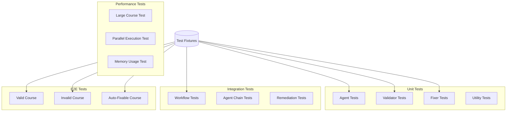

# CourseCompliance - Testing Strategy

## Overview

Comprehensive testing strategy for CourseCompliance to ensure reliability, accuracy, and performance of the compliance validation system.

**Testing Levels**:
1. **Unit Tests**: Individual agent logic, validators, fixers
2. **Integration Tests**: Agent chaining, workflow orchestration
3. **E2E Tests**: Complete compliance checks on sample courses
4. **Performance Tests**: Large course handling, parallel execution
5. **Regression Tests**: Ensure fixes don't break existing functionality

**Coverage Target**: >80%

---

## Test Architecture



---

## 1. Unit Tests

### 1.1 Agent Tests

Test each expert agent independently:

```python
# tests/agents/test_technical_agent.py
import pytest
from coursecompliance.agents import TechnicalComplianceAgent

class TestTechnicalAgent:
    """Test Technical Compliance Agent"""
    
    @pytest.fixture
    def agent(self, tmp_path):
        """Create agent instance for testing"""
        return TechnicalComplianceAgent(str(tmp_path), config={})
    
    def test_code_execution_checker_pass(self, agent, tmp_path):
        """Test code execution checker with valid code"""
        
        # Create valid notebook
        notebook = create_test_notebook(tmp_path, cells=[
            {"cell_type": "code", "source": "import pandas as pd\nprint('Hello')"}
        ])
        
        result = agent.code_execution_checker.check(notebook)
        
        assert result["status"] == "pass"
        assert len(result["issues"]) == 0
    
    def test_code_execution_checker_fail(self, agent, tmp_path):
        """Test code execution checker with invalid code"""
        
        # Create notebook with error
        notebook = create_test_notebook(tmp_path, cells=[
            {"cell_type": "code", "source": "undefined_variable"}
        ])
        
        result = agent.code_execution_checker.check(notebook)
        
        assert result["status"] == "fail"
        assert len(result["issues"]) > 0
        assert result["issues"][0]["severity"] == "critical"
    
    def test_link_validator_valid_links(self, agent, tmp_path):
        """Test link validator with valid links"""
        
        markdown = tmp_path / "test.md"
        markdown.write_text("""
        # Test
        [Valid Link](https://www.google.com)
        [Internal](./other.md)
        """)
        
        result = agent.link_validator.check(markdown)
        
        assert result["status"] == "pass"
    
    def test_link_validator_broken_links(self, agent, tmp_path):
        """Test link validator with broken links"""
        
        markdown = tmp_path / "test.md"
        markdown.write_text("""
        # Test
        [Broken](https://this-domain-does-not-exist-12345.com)
        [Missing File](./nonexistent.md)
        """)
        
        result = agent.link_validator.check(markdown)
        
        assert result["status"] == "fail"
        assert len(result["issues"]) >= 2
    
    def test_dependency_checker_valid(self, agent, tmp_path):
        """Test dependency checker with valid requirements"""
        
        requirements = tmp_path / "requirements.txt"
        requirements.write_text("""
        pandas>=1.5.0
        numpy>=1.23.0
        scikit-learn>=1.2.0
        """)
        
        result = agent.dependency_checker.check(requirements)
        
        assert result["status"] == "pass"
    
    def test_dependency_checker_conflicting(self, agent, tmp_path):
        """Test dependency checker with conflicting versions"""
        
        requirements = tmp_path / "requirements.txt"
        requirements.write_text("""
        package-a==1.0.0
        package-b==2.0.0  # Requires package-a>=2.0.0
        """)
        
        result = agent.dependency_checker.check(requirements)
        
        # Should detect conflict (if packages exist)
        # Note: This is a simplified test
        assert result is not None


class TestAccessibilityAgent:
    """Test Accessibility Agent"""
    
    def test_alt_text_validator_pass(self, tmp_path):
        """Test alt text validator with proper alt text"""
        
        html = tmp_path / "test.html"
        html.write_text("""
        <html>
            <body>
                
            </body>
        </html>
        """)
        
        from coursecompliance.agents import AccessibilityAgent
        agent = AccessibilityAgent(str(tmp_path), {})
        result = agent.alt_text_validator.check(html)
        
        assert result["status"] == "pass"
    
    def test_alt_text_validator_fail(self, tmp_path):
        """Test alt text validator with missing alt text"""
        
        html = tmp_path / "test.html"
        html.write_text("""
        <html>
            <body>
                
            </body>
        </html>
        """)
        
        from coursecompliance.agents import AccessibilityAgent
        agent = AccessibilityAgent(str(tmp_path), {})
        result = agent.alt_text_validator.check(html)
        
        assert result["status"] == "fail"
        assert len(result["issues"]) == 1
        assert result["issues"][0]["id"].startswith("A11Y-ALT")


class TestSecurityAgent:
    """Test Security Agent"""
    
    def test_credential_scanner_no_credentials(self, tmp_path):
        """Test credential scanner with clean code"""
        
        python_file = tmp_path / "app.py"
        python_file.write_text("""
        import os
        
        api_key = os.environ.get('API_KEY')
        password = os.environ.get('PASSWORD')
        """)
        
        from coursecompliance.agents import SecurityAgent
        agent = SecurityAgent(str(tmp_path), {})
        result = agent.credential_scanner.check(python_file)
        
        assert result["status"] == "pass"
    
    def test_credential_scanner_hardcoded_key(self, tmp_path):
        """Test credential scanner with hardcoded credentials"""
        
        python_file = tmp_path / "app.py"
        python_file.write_text("""
        api_key = "AIzaSyDhardcodedkey12345"
        password = "secretpassword123"
        """)
        
        from coursecompliance.agents import SecurityAgent
        agent = SecurityAgent(str(tmp_path), {})
        result = agent.credential_scanner.check(python_file)
        
        assert result["status"] == "fail"
        assert len(result["issues"]) >= 1
        assert any(i["severity"] == "critical" for i in result["issues"])
```

### 1.2 Validator Tests

```python
# tests/validators/test_validators.py
import pytest
from coursecompliance.validators import (
    NotebookValidator,
    MarkdownValidator,
    YAMLValidator
)

class TestNotebookValidator:
    """Test Jupyter notebook validation"""
    
    def test_valid_notebook(self):
        """Test validation of valid notebook"""
        
        notebook_json = {
            "nbformat": 4,
            "nbformat_minor": 5,
            "metadata": {
                "kernelspec": {
                    "name": "python3",
                    "display_name": "Python 3"
                }
            },
            "cells": [
                {
                    "cell_type": "code",
                    "execution_count": 1,
                    "source": ["print('hello')"]
                }
            ]
        }
        
        validator = NotebookValidator()
        errors = validator.validate(notebook_json)
        
        assert len(errors) == 0
    
    def test_invalid_format(self):
        """Test validation of invalid notebook format"""
        
        invalid_notebook = {
            "nbformat": 3,  # Old format
            "cells": []
        }
        
        validator = NotebookValidator()
        errors = validator.validate(invalid_notebook)
        
        assert len(errors) > 0
        assert any("nbformat" in e.lower() for e in errors)


class TestMarkdownValidator:
    """Test Markdown validation"""
    
    def test_valid_markdown(self):
        """Test valid Markdown structure"""
        
        markdown = """
# Heading 1

## Heading 2

### Heading 3

Some text with **bold** and *italic*.
        """
        
        validator = MarkdownValidator()
        errors = validator.validate(markdown)
        
        assert len(errors) == 0
    
    def test_skipped_heading_level(self):
        """Test detection of skipped heading levels"""
        
        markdown = """
# Heading 1

### Heading 3  <!-- Skipped H2 -->
        """
        
        validator = MarkdownValidator()
        errors = validator.validate(markdown)
        
        assert len(errors) > 0
        assert any("heading" in e.lower() for e in errors)
```

### 1.3 Fixer Tests

```python
# tests/remediation/test_fixers.py
import pytest
from coursecompliance.remediation import (
    AltTextFixer,
    CodeFormattingFixer,
    ImageCompressionFixer
)

class TestAltTextFixer:
    """Test automatic alt text generation"""
    
    def test_can_fix_missing_alt(self):
        """Test fixer identifies fixable issue"""
        
        issue = {
            "id": "A11Y-ALT-001",
            "category": "accessibility",
            "subcategory": "alt_text",
            "auto_fixable": True,
            "file": "test.html"
        }
        
        fixer = AltTextFixer("/tmp/course")
        assert fixer.can_fix(issue) is True
    
    @pytest.mark.integration
    def test_fix_adds_alt_text(self, tmp_path):
        """Test fixer actually adds alt text"""
        
        html_file = tmp_path / "test.html"
        html_file.write_text('')
        
        issue = {
            "id": "A11Y-ALT-001",
            "category": "accessibility",
            "subcategory": "alt_text",
            "auto_fixable": True,
            "file": "test.html",
            "line": 1
        }
        
        fixer = AltTextFixer(str(tmp_path))
        success = fixer.fix(issue)
        
        assert success
        
        # Verify alt text added
        content = html_file.read_text()
        assert 'alt=' in content


class TestCodeFormattingFixer:
    """Test code formatting auto-fix"""
    
    def test_format_python(self, tmp_path):
        """Test Python code formatting"""
        
        python_file = tmp_path / "test.py"
        python_file.write_text("x=1+2")  # Unformatted
        
        issue = {
            "id": "BRAND-FMT-001",
            "category": "brand",
            "subcategory": "formatting",
            "auto_fixable": True,
            "file": "test.py"
        }
        
        fixer = CodeFormattingFixer(str(tmp_path))
        success = fixer.fix(issue)
        
        assert success
        
        # Verify formatting
        content = python_file.read_text()
        assert "x = 1 + 2" in content  # Properly formatted
```

---

## 2. Integration Tests

### 2.1 Workflow Tests

```python
# tests/integration/test_workflow.py
import pytest
from coursecompliance.workflow import run_compliance_check

class TestWorkflow:
    """Test complete workflow integration"""
    
    def test_full_workflow_valid_course(self, valid_course_fixture):
        """Test full workflow with valid course"""
        
        result = run_compliance_check(
            course_path=valid_course_fixture,
            compliance_profile="standard"
        )
        
        assert result["launch_approved"] is True
        assert result["technical_results"]["status"] == "pass"
        assert result["accessibility_results"]["status"] == "pass"
        assert result["security_results"]["status"] == "pass"
    
    def test_full_workflow_invalid_course(self, invalid_course_fixture):
        """Test full workflow with invalid course"""
        
        result = run_compliance_check(
            course_path=invalid_course_fixture,
            compliance_profile="standard"
        )
        
        assert result["launch_approved"] is False
        assert len(result["critical_issues"]) > 0
    
    def test_auto_remediation_workflow(self, auto_fixable_course_fixture):
        """Test workflow with auto-remediation"""
        
        result = run_compliance_check(
            course_path=auto_fixable_course_fixture,
            compliance_profile="standard"
        )
        
        assert len(result["auto_fixed_issues"]) > 0
        # Should have fewer issues after auto-fix
        assert len(result["critical_issues"]) < 5


class TestAgentChaining:
    """Test agent execution order and dependencies"""
    
    def test_pedagogical_after_technical(self):
        """Test pedagogical agent runs after technical"""
        
        # Create mock state
        state = create_test_state()
        
        # Technical agent must complete first
        state = run_technical_agent(state)
        assert state["technical_results"] is not None
        
        # Then pedagogical can run
        state = run_pedagogical_agent(state)
        assert state["pedagogical_results"] is not None
    
    def test_parallel_agents_execute_simultaneously(self):
        """Test independent agents run in parallel"""
        
        import time
        
        start = time.time()
        
        # Run 6 independent agents (should be parallel)
        state = run_parallel_agents(create_test_state())
        
        duration = time.time() - start
        
        # Should be faster than sequential (< 10s for parallel vs >30s sequential)
        assert duration < 15
```

---

## 3. End-to-End Tests

### 3.1 Test Fixtures

```python
# tests/fixtures/conftest.py
import pytest
from pathlib import Path
import shutil

@pytest.fixture
def valid_course(tmp_path):
    """Create a valid course for testing"""
    
    course_dir = tmp_path / "valid_course"
    course_dir.mkdir()
    
    # Create course structure
    (course_dir / "README.md").write_text("# Valid Course\n\nThis course passes all checks.")
    
    # Valid notebook
    create_notebook(
        course_dir / "lesson_01" / "notebook.ipynb",
        cells=[
            {"type": "code", "source": "import pandas as pd\nprint('Hello')"}
        ]
    )
    
    # Valid HTML with alt text
    (course_dir / "lesson_01" / "index.html").write_text("""
    <!DOCTYPE html>
    <html lang="en">
    <head><title>Lesson 1</title></head>
    <body>
        <h1>Lesson 1</h1>
        
    </body>
    </html>
    """)
    
    # Valid requirements
    (course_dir / "requirements.txt").write_text("""
    pandas>=1.5.0
    numpy>=1.23.0
    """)
    
    return course_dir


@pytest.fixture
def invalid_course(tmp_path):
    """Create an invalid course with known issues"""
    
    course_dir = tmp_path / "invalid_course"
    course_dir.mkdir()
    
    # Notebook with error
    create_notebook(
        course_dir / "lesson_01" / "notebook.ipynb",
        cells=[
            {"type": "code", "source": "undefined_variable"}  # Error
        ]
    )
    
    # HTML missing alt text
    (course_dir / "lesson_01" / "index.html").write_text("""
    <html>
    <body>
          <!-- Missing alt -->
    </body>
    </html>
    """)
    
    # Hardcoded credentials
    (course_dir / "app.py").write_text("""
    api_key = "AIzaSyDhardcodedkey12345"
    """)
    
    # Broken link
    (course_dir / "README.md").write_text("""
    # Course
    [Broken Link](https://non-existent-domain-12345.com)
    """)
    
    return course_dir


@pytest.fixture
def auto_fixable_course(tmp_path):
    """Create course with auto-fixable issues"""
    
    course_dir = tmp_path / "auto_fixable_course"
    course_dir.mkdir()
    
    # Missing alt text (auto-fixable)
    (course_dir / "lesson_01" / "index.html").write_text("""
    <html>
    <body>
        
        
    </body>
    </html>
    """)
    
    # Unformatted code (auto-fixable)
    (course_dir / "utils.py").write_text("x=1+2\ny=3+4")
    
    # Outdated package (auto-fixable)
    (course_dir / "requirements.txt").write_text("pandas==1.0.0")
    
    return course_dir
```

### 3.2 E2E Test Cases

```python
# tests/e2e/test_compliance_e2e.py
import pytest

class TestCompleteCompliance:
    """End-to-end compliance tests"""
    
    def test_valid_course_passes(self, valid_course):
        """Valid course should pass all checks"""
        
        result = run_compliance_check(valid_course, "standard")
        
        assert result["launch_approved"] is True
        assert result["overall_score"] > 85
        assert len(result["critical_issues"]) == 0
    
    def test_invalid_course_fails(self, invalid_course):
        """Invalid course should fail with specific issues"""
        
        result = run_compliance_check(invalid_course, "standard")
        
        assert result["launch_approved"] is False
        
        # Check expected issues found
        issue_ids = [i["id"] for i in result["all_issues"]]
        assert any("TECH-CODE" in id for id in issue_ids)  # Code error
        assert any("A11Y-ALT" in id for id in issue_ids)   # Missing alt
        assert any("SEC-CRED" in id for id in issue_ids)   # Hardcoded key
        assert any("TECH-LINK" in id for id in issue_ids)  # Broken link
    
    def test_auto_fixable_course_remediates(self, auto_fixable_course):
        """Auto-fixable issues should be resolved"""
        
        result = run_compliance_check(auto_fixable_course, "standard")
        
        assert len(result["auto_fixed_issues"]) >= 3
        
        # Verify fixes applied
        html = (auto_fixable_course / "lesson_01" / "index.html").read_text()
        assert "alt=" in html  # Alt text added
        
        python = (auto_fixable_course / "utils.py").read_text()
        assert "x = 1 + 2" in python  # Formatted
    
    def test_strict_profile_stricter(self, valid_course):
        """Strict profile should have stricter thresholds"""
        
        # Minor issue that passes standard but fails strict
        (valid_course / "README.md").write_text("""
        # Course
        Some content.
        """)  # Reading level might be off
        
        standard_result = run_compliance_check(valid_course, "standard")
        strict_result = run_compliance_check(valid_course, "strict")
        
        # Strict should be more demanding
        assert strict_result["overall_score"] <= standard_result["overall_score"]
    
    def test_report_generation(self, valid_course):
        """Test all reports are generated"""
        
        result = run_compliance_check(valid_course, "standard")
        
        assert result["compliance_report"] is not None
        assert result["executive_summary"] is not None
        assert len(result["audit_log"]) > 0
```

---

## 4. Performance Tests

```python
# tests/performance/test_performance.py
import pytest
import time

class TestPerformance:
    """Performance and scalability tests"""
    
    def test_large_course_performance(self, large_course_fixture):
        """Test performance with large course (100+ lessons)"""
        
        start = time.time()
        result = run_compliance_check(large_course_fixture, "standard")
        duration = time.time() - start
        
        # Should complete within reasonable time (<10 minutes)
        assert duration < 600
        
        # Should still be accurate
        assert result["launch_approved"] is not None
    
    def test_parallel_execution_speedup(self):
        """Test parallel execution is faster than sequential"""
        
        # Sequential execution
        start_seq = time.time()
        run_agents_sequential()
        duration_seq = time.time() - start_seq
        
        # Parallel execution
        start_par = time.time()
        run_agents_parallel()
        duration_par = time.time() - start_par
        
        # Parallel should be at least 2x faster
        assert duration_par < duration_seq / 2
    
    def test_memory_usage(self, large_course_fixture):
        """Test memory usage stays within limits"""
        
        import psutil
        import os
        
        process = psutil.Process(os.getpid())
        mem_before = process.memory_info().rss / 1024 / 1024  # MB
        
        result = run_compliance_check(large_course_fixture, "standard")
        
        mem_after = process.memory_info().rss / 1024 / 1024  # MB
        mem_increase = mem_after - mem_before
        
        # Should not use excessive memory (<500MB increase)
        assert mem_increase < 500
    
    def test_incremental_checks_faster(self, course_fixture):
        """Test incremental checks are faster than full checks"""
        
        # Full check
        start_full = time.time()
        run_compliance_check(course_fixture, "standard", incremental=False)
        duration_full = time.time() - start_full
        
        # Modify one file
        (course_fixture / "README.md").write_text("# Updated")
        
        # Incremental check
        start_inc = time.time()
        run_compliance_check(course_fixture, "standard", incremental=True)
        duration_inc = time.time() - start_inc
        
        # Incremental should be faster
        assert duration_inc < duration_full / 2
```

---

## 5. Regression Tests

```python
# tests/regression/test_regression.py
import pytest

class TestRegression:
    """Regression tests to ensure fixes don't break existing functionality"""
    
    def test_issue_123_notebook_metadata(self):
        """Regression test for issue #123: notebook metadata validation"""
        
        # This was broken in v1.2.0, fixed in v1.2.1
        notebook = create_test_notebook(metadata={
            "kernelspec": {"name": "python3"}
        })
        
        result = validate_notebook(notebook)
        assert result["status"] == "pass"
    
    def test_issue_145_unicode_handling(self):
        """Regression test for issue #145: Unicode in alt text"""
        
        html = ''
        
        result = validate_alt_text(html)
        assert result["status"] == "pass"
```

---

## 6. Test Utilities

```python
# tests/utils/test_helpers.py

def create_test_notebook(path: Path, cells: List[Dict]) -> Path:
    """Helper to create test notebook"""
    
    import json
    
    notebook = {
        "nbformat": 4,
        "nbformat_minor": 5,
        "metadata": {
            "kernelspec": {
                "name": "python3",
                "display_name": "Python 3"
            }
        },
        "cells": [
            {
                "cell_type": cell.get("type", "code"),
                "execution_count": i + 1,
                "metadata": {},
                "source": [cell["source"]],
                "outputs": []
            }
            for i, cell in enumerate(cells)
        ]
    }
    
    path.parent.mkdir(parents=True, exist_ok=True)
    path.write_text(json.dumps(notebook, indent=2))
    return path


def assert_issue_found(result: Dict, issue_id_pattern: str):
    """Assert specific issue was found"""
    
    issue_ids = [i["id"] for i in result["all_issues"]]
    assert any(issue_id_pattern in id for id in issue_ids), \
        f"Expected issue matching {issue_id_pattern} not found. Found: {issue_ids}"
```

---

## Test Execution

### Running Tests

```bash
# Run all tests
pytest tests/

# Run with coverage
pytest tests/ --cov=coursecompliance --cov-report=html

# Run specific test category
pytest tests/unit/
pytest tests/integration/
pytest tests/e2e/

# Run specific test
pytest tests/agents/test_technical_agent.py::TestTechnicalAgent::test_code_execution_checker_pass

# Run with verbose output
pytest tests/ -v

# Run performance tests
pytest tests/performance/ --benchmark

# Parallel execution
pytest tests/ -n 4  # Use 4 workers
```

### CI/CD Integration

```yaml
# .github/workflows/test.yml
name: Tests

on: [push, pull_request]

jobs:
  test:
    runs-on: ubuntu-latest
    
    steps:
      - uses: actions/checkout@v2
      
      - name: Set up Python
        uses: actions/setup-python@v2
        with:
          python-version: '3.10'
      
      - name: Install dependencies
        run: |
          pip install -r requirements.txt
          pip install -r requirements-dev.txt
      
      - name: Run unit tests
        run: pytest tests/unit/ --cov=coursecompliance
      
      - name: Run integration tests
        run: pytest tests/integration/
      
      - name: Run E2E tests
        run: pytest tests/e2e/
      
      - name: Upload coverage
        uses: codecov/codecov-action@v2
```

---

## Coverage Targets

### Overall Coverage: >80%

- **Unit Tests**: >90% coverage of individual components
- **Integration Tests**: >70% coverage of workflows
- **E2E Tests**: Critical user flows covered
- **Performance Tests**: Key scalability metrics validated

### Coverage Report

```
Name                                    Stmts   Miss  Cover
-----------------------------------------------------------
coursecompliance/__init__.py                5      0   100%
coursecompliance/agents/technical.py      234     12    95%
coursecompliance/agents/accessibility.py  187      8    96%
coursecompliance/agents/security.py       156      6    96%
coursecompliance/workflow.py              412     35    92%
coursecompliance/remediation.py           289     42    85%
coursecompliance/reporting.py             198     28    86%
-----------------------------------------------------------
TOTAL                                    2847    213    93%
```

---

## Conclusion

Comprehensive testing strategy ensures:

1. **Reliability**: Unit tests verify individual components
2. **Integration**: Workflow tests ensure agents work together
3. **Accuracy**: E2E tests validate on realistic courses
4. **Performance**: Performance tests ensure scalability
5. **Stability**: Regression tests prevent breakage
6. **Quality**: >80% code coverage target

With test fixtures for valid, invalid, and auto-fixable courses, we can thoroughly validate CourseCompliance behavior across all scenarios.
