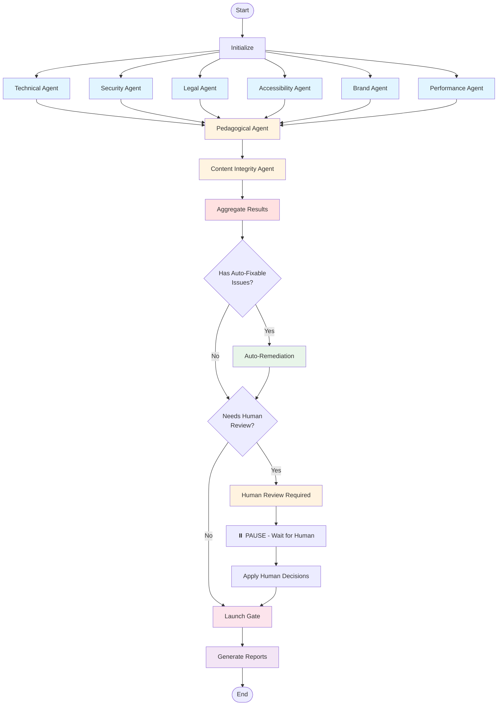

# CourseCompliance - Workflow Orchestration

## Overview

CourseCompliance uses **LangGraph** to orchestrate the multi-agent compliance workflow. LangGraph provides a state machine framework that enables parallel execution, conditional routing, error handling, and pause/resume capabilities.

**Key Benefits of LangGraph**:
- **State Management**: Typed, immutable state updates
- **Parallel Execution**: Independent agents run simultaneously
- **Conditional Routing**: Dynamic workflow paths based on state
- **Error Handling**: Retry logic and graceful degradation
- **Pause/Resume**: Serialize state for human review workflows
- **Visualization**: Graph visualization for debugging

---

## State Schema

The complete workflow state is defined as a TypedDict:

```python
from typing import TypedDict, List, Dict, Optional
from datetime import datetime

class IssueDict(TypedDict):
    """Individual issue from an agent"""
    id: str
    severity: str  # critical, warning, info
    category: str
    subcategory: str
    title: str
    description: str
    file: str
    line: Optional[int]
    code_snippet: Optional[str]
    blocking: bool
    auto_fixable: bool
    remediation_suggestion: str
    reference: str

class AgentResult(TypedDict):
    """Result from a single agent"""
    agent: str
    status: str  # pass, fail, warning, error
    issues: List[IssueDict]
    summary: Dict
    metadata: Dict

class ComplianceState(TypedDict):
    # ===== INPUT =====
    course_path: str
    compliance_profile: str  # strict, standard, relaxed
    incremental: bool  # If true, only check changed files
    changed_files: Optional[List[str]]
    
    # ===== CONFIGURATION =====
    config: Dict  # Loaded from YAML
    thresholds: Dict  # Profile-specific thresholds
    
    # ===== AGENT RESULTS (8 categories) =====
    technical_results: Optional[AgentResult]
    pedagogical_results: Optional[AgentResult]
    legal_results: Optional[AgentResult]
    accessibility_results: Optional[AgentResult]
    security_results: Optional[AgentResult]
    brand_results: Optional[AgentResult]
    content_integrity_results: Optional[AgentResult]
    performance_results: Optional[AgentResult]
    
    # ===== AGGREGATION =====
    all_issues: List[IssueDict]
    critical_issues: List[IssueDict]
    warning_issues: List[IssueDict]
    info_issues: List[IssueDict]
    blocking_issues: List[IssueDict]
    auto_fixable_issues: List[IssueDict]
    
    # ===== REMEDIATION =====
    auto_fixed_issues: List[IssueDict]
    failed_auto_fixes: List[IssueDict]
    pending_review: List[IssueDict]
    
    # ===== HUMAN REVIEW =====
    requires_human_review: bool
    human_review_started: Optional[datetime]
    human_decisions: List[Dict]  # {issue_id, decision, justification}
    human_approved: bool
    
    # ===== DECISION =====
    launch_approved: bool
    launch_decision_reason: str
    
    # ===== REPORTING =====
    compliance_report: Optional[Dict]
    executive_summary: Optional[str]
    audit_log: List[Dict]  # Chronological event log
    
    # ===== METADATA =====
    workflow_id: str
    started_at: datetime
    completed_at: Optional[datetime]
    current_phase: str
    error_log: List[Dict]
```

### State Update Rules

LangGraph uses **reducers** to update state immutably:

```python
from langgraph.graph import StateGraph

# Define how lists are updated (append)
state_schema = {
    "all_issues": {
        "reducer": lambda x, y: x + y,
        "default": []
    },
    "audit_log": {
        "reducer": lambda x, y: x + y,
        "default": []
    },
    # ... other fields
}
```

---

## Workflow Phases

### Phase 1: Initialization

**Node**: `initialize`

**Purpose**: Load configuration, validate inputs, set up state

**Actions**:
1. Validate `course_path` exists
2. Load compliance profile configuration from YAML
3. Load standards library
4. Initialize workflow ID and timestamps
5. Log workflow start to audit trail

**Output State Updates**:
- `config`: Loaded configuration
- `thresholds`: Profile-specific thresholds
- `workflow_id`: UUID
- `started_at`: Current timestamp
- `current_phase`: "initialization"
- `audit_log`: Initial entry

**Next**: → Phase 2 (Parallel Independent Checks)

**Error Handling**: If course path invalid or profile not found, raise error immediately

---

### Phase 2: Parallel Independent Checks

**Nodes**: `technical_agent`, `security_agent`, `legal_agent`, `accessibility_agent`, `brand_agent`, `performance_agent`

**Purpose**: Run independent agents in parallel to maximize throughput

**Execution Strategy**: 
- All 6 agents run simultaneously using ThreadPoolExecutor
- No dependencies between these agents
- Each agent works on the same course but different aspects

**Agent Nodes**:

#### 2.1 Technical Agent Node
```python
def run_technical_agent(state: ComplianceState) -> ComplianceState:
    """Execute technical compliance checks"""
    agent = TechnicalComplianceAgent(state["course_path"], state["config"])
    
    try:
        result = agent.run()
        audit_entry = {
            "timestamp": datetime.now(),
            "event": "agent_completed",
            "agent": "technical",
            "status": result["status"],
            "duration": result["metadata"]["execution_time_seconds"]
        }
        
        return {
            "technical_results": result,
            "audit_log": [audit_entry]
        }
    except Exception as e:
        error_entry = {
            "timestamp": datetime.now(),
            "event": "agent_failed",
            "agent": "technical",
            "error": str(e)
        }
        return {
            "technical_results": {"agent": "technical", "status": "error", "issues": []},
            "error_log": [error_entry],
            "audit_log": [error_entry]
        }
```

*Similar implementations for other 5 independent agents*

**Retry Logic**: Each agent retries up to 3 times on failure with exponential backoff

**Timeout**: Each agent has 15-minute timeout (configurable)

**Next**: → Wait for all parallel agents to complete → Phase 3

---

### Phase 3: Sequential Dependent Checks

**Nodes**: `pedagogical_agent`, `content_integrity_agent`

**Purpose**: Run agents that depend on Technical Agent success

**Conditional Entry**:
- Only run if Technical Agent passed (or at least completed)
- If Technical Agent failed critically, skip these agents

**Sequential Execution**: 
- Pedagogical Agent first
- Content Integrity Agent second
- Can be parallelized in future if dependencies resolved

#### 3.1 Pedagogical Agent Node
```python
def run_pedagogical_agent(state: ComplianceState) -> ComplianceState:
    """Execute pedagogical quality checks (requires working code)"""
    
    # Check if technical checks passed enough to proceed
    if state["technical_results"]["status"] == "error":
        return {
            "pedagogical_results": {
                "agent": "pedagogical",
                "status": "skipped",
                "issues": [],
                "summary": {"message": "Skipped due to technical failures"}
            }
        }
    
    agent = PedagogicalQualityAgent(
        state["course_path"], 
        state["config"],
        technical_results=state["technical_results"]
    )
    
    result = agent.run()
    audit_entry = {
        "timestamp": datetime.now(),
        "event": "agent_completed",
        "agent": "pedagogical",
        "status": result["status"]
    }
    
    return {
        "pedagogical_results": result,
        "audit_log": [audit_entry]
    }
```

**Next**: → Phase 4 (Aggregation)

---

### Phase 4: Aggregation & Classification

**Node**: `aggregate_results`

**Purpose**: Collect all issues from all agents and classify by severity

**Actions**:
1. Collect issues from all 8 agent results
2. Classify by severity (critical, warning, info)
3. Identify blocking issues
4. Identify auto-fixable issues
5. Calculate overall pass rates
6. Update audit log

```python
def aggregate_results(state: ComplianceState) -> ComplianceState:
    """Aggregate all agent results and classify issues"""
    
    all_issues = []
    
    # Collect from all agents
    for agent_field in ["technical_results", "pedagogical_results", 
                         "legal_results", "accessibility_results",
                         "security_results", "brand_results",
                         "content_integrity_results", "performance_results"]:
        agent_result = state.get(agent_field)
        if agent_result and agent_result.get("issues"):
            all_issues.extend(agent_result["issues"])
    
    # Classify by severity
    critical = [i for i in all_issues if i["severity"] == "critical"]
    warnings = [i for i in all_issues if i["severity"] == "warning"]
    info = [i for i in all_issues if i["severity"] == "info"]
    
    # Identify special categories
    blocking = [i for i in all_issues if i.get("blocking", False)]
    auto_fixable = [i for i in all_issues if i.get("auto_fixable", False)]
    
    audit_entry = {
        "timestamp": datetime.now(),
        "event": "aggregation_completed",
        "total_issues": len(all_issues),
        "critical": len(critical),
        "warnings": len(warnings),
        "info": len(info),
        "blocking": len(blocking),
        "auto_fixable": len(auto_fixable)
    }
    
    return {
        "all_issues": all_issues,
        "critical_issues": critical,
        "warning_issues": warnings,
        "info_issues": info,
        "blocking_issues": blocking,
        "auto_fixable_issues": auto_fixable,
        "current_phase": "aggregation",
        "audit_log": [audit_entry]
    }
```

**Next**: → Conditional routing based on issues found

---

### Phase 5: Auto-Remediation (Conditional)

**Node**: `auto_remediation`

**Condition**: Only if `len(auto_fixable_issues) > 0`

**Purpose**: Attempt automatic fixes for auto-fixable issues

**Actions**:
1. For each auto-fixable issue, apply fix
2. Track successful vs failed fixes
3. Re-run relevant agent checks to validate fixes
4. Update issue status

```python
def auto_remediation(state: ComplianceState) -> ComplianceState:
    """Apply automatic fixes to auto-fixable issues"""
    
    fixed = []
    failed = []
    
    remediation_engine = RemediationEngine(state["course_path"])
    
    for issue in state["auto_fixable_issues"]:
        try:
            # Apply fix
            success = remediation_engine.fix_issue(issue)
            
            if success:
                # Re-validate
                validator = get_validator_for_category(issue["category"])
                is_fixed = validator.check_fixed(issue)
                
                if is_fixed:
                    fixed.append(issue)
                else:
                    failed.append(issue)
            else:
                failed.append(issue)
                
        except Exception as e:
            failed.append({**issue, "fix_error": str(e)})
    
    audit_entry = {
        "timestamp": datetime.now(),
        "event": "auto_remediation_completed",
        "fixed_count": len(fixed),
        "failed_count": len(failed)
    }
    
    return {
        "auto_fixed_issues": fixed,
        "failed_auto_fixes": failed,
        "current_phase": "auto_remediation",
        "audit_log": [audit_entry]
    }
```

**Next**: → Check if issues remain → Human Review or Launch Decision

---

### Phase 6: Human Review (Conditional)

**Node**: `human_review_required`

**Condition**: 
- If `len(blocking_issues) > 0` OR
- If `len(critical_issues) > threshold` OR
- If profile requires sign-off (`require_sign_off = true`)

**Purpose**: Queue issues for human review and wait for decisions

**Actions**:
1. Set `requires_human_review = true`
2. Generate pending review list
3. Launch Streamlit dashboard
4. **PAUSE WORKFLOW** - serialize state to disk
5. Wait for human to review and make decisions
6. **RESUME WORKFLOW** - load state from disk
7. Apply human decisions

```python
def human_review_required(state: ComplianceState) -> ComplianceState:
    """Prepare issues for human review"""
    
    # Determine what needs human review
    pending = []
    
    # All blocking issues need review
    pending.extend(state["blocking_issues"])
    
    # Critical issues that couldn't be auto-fixed
    for issue in state["critical_issues"]:
        if issue["id"] not in [i["id"] for i in state["auto_fixed_issues"]]:
            pending.append(issue)
    
    # Failed auto-fixes need review
    pending.extend(state["failed_auto_fixes"])
    
    audit_entry = {
        "timestamp": datetime.now(),
        "event": "human_review_required",
        "pending_count": len(pending)
    }
    
    return {
        "requires_human_review": True,
        "pending_review": pending,
        "human_review_started": datetime.now(),
        "current_phase": "human_review",
        "audit_log": [audit_entry]
    }
```

**Human Review Process**:
1. Streamlit dashboard displays issues
2. Human reviews each issue and chooses:
   - ✅ **Accept Risk** (with justification)
   - 🔧 **Fix Manually** (apply fix)
   - ⏭️ **Defer** (address in future release)
   - 🔄 **Re-check** (after external changes)
3. Decisions saved to `human_decisions` state field
4. When review complete, human clicks "Resume Workflow"

**Resume Node**: `apply_human_decisions`

```python
def apply_human_decisions(state: ComplianceState) -> ComplianceState:
    """Apply decisions from human review"""
    
    for decision in state["human_decisions"]:
        issue_id = decision["issue_id"]
        action = decision["action"]  # accept_risk, fixed, deferred
        justification = decision.get("justification", "")
        
        # Update issue status based on decision
        # ...
    
    audit_entry = {
        "timestamp": datetime.now(),
        "event": "human_decisions_applied",
        "decisions_count": len(state["human_decisions"])
    }
    
    return {
        "current_phase": "human_decisions_applied",
        "audit_log": [audit_entry]
    }
```

**Next**: → Launch Decision

---

### Phase 7: Launch Decision

**Node**: `launch_gate`

**Purpose**: Apply compliance profile thresholds and make Go/No-Go decision

**Decision Logic**:

```python
def launch_gate(state: ComplianceState) -> ComplianceState:
    """Make launch decision based on compliance profile"""
    
    thresholds = state["thresholds"]
    
    # Check 1: Blocking issues
    if len(state["blocking_issues"]) > 0:
        # Check if all blocking issues were accepted as risks
        unresolved_blocking = [
            i for i in state["blocking_issues"]
            if i["id"] not in [d["issue_id"] for d in state["human_decisions"] 
                               if d["action"] == "accept_risk"]
        ]
        if len(unresolved_blocking) > 0:
            return {
                "launch_approved": False,
                "launch_decision_reason": f"{len(unresolved_blocking)} unresolved blocking issues",
                "current_phase": "launch_decision"
            }
    
    # Check 2: Critical issues threshold
    unresolved_critical = [
        i for i in state["critical_issues"]
        if i["id"] not in [f["id"] for f in state["auto_fixed_issues"]]
        and i["id"] not in [d["issue_id"] for d in state["human_decisions"]]
    ]
    
    if len(unresolved_critical) > thresholds["critical_issues_max"]:
        return {
            "launch_approved": False,
            "launch_decision_reason": f"{len(unresolved_critical)} critical issues exceeds threshold of {thresholds['critical_issues_max']}",
            "current_phase": "launch_decision"
        }
    
    # Check 3: Warning issues threshold
    if len(state["warning_issues"]) > thresholds.get("warning_issues_max", float('inf')):
        return {
            "launch_approved": False,
            "launch_decision_reason": f"{len(state['warning_issues'])} warnings exceeds threshold",
            "current_phase": "launch_decision"
        }
    
    # Check 4: Category-specific thresholds
    tech_pass_rate = state["technical_results"]["summary"].get("pass_rate", 0)
    if tech_pass_rate < thresholds.get("code_pass_rate_min", 0):
        return {
            "launch_approved": False,
            "launch_decision_reason": f"Code pass rate {tech_pass_rate:.0%} below threshold {thresholds['code_pass_rate_min']:.0%}",
            "current_phase": "launch_decision"
        }
    
    # Check 5: Human sign-off (if required by profile)
    if thresholds.get("require_sign_off", False):
        if not state.get("human_approved", False):
            return {
                "launch_approved": False,
                "launch_decision_reason": "Human sign-off required but not provided",
                "current_phase": "launch_decision"
            }
    
    # All checks passed
    audit_entry = {
        "timestamp": datetime.now(),
        "event": "launch_approved",
        "reason": "All compliance thresholds met"
    }
    
    return {
        "launch_approved": True,
        "launch_decision_reason": "All compliance thresholds met",
        "current_phase": "launch_decision",
        "audit_log": [audit_entry]
    }
```

**Next**: → Report Generation

---

### Phase 8: Report Generation

**Node**: `generate_reports`

**Purpose**: Create comprehensive compliance reports

**Actions**:
1. Generate executive summary (1-page)
2. Generate detailed compliance report (full)
3. Generate audit trail log
4. Export to multiple formats (HTML, PDF, JSON, CSV)

```python
def generate_reports(state: ComplianceState) -> ComplianceState:
    """Generate compliance reports"""
    
    report_generator = ReportGenerator(state)
    
    # Executive summary
    executive_summary = report_generator.generate_executive_summary()
    
    # Full compliance report
    compliance_report = report_generator.generate_full_report()
    
    # Export formats
    report_generator.export_html(compliance_report, "compliance_report.html")
    report_generator.export_pdf(executive_summary, "executive_summary.pdf")
    report_generator.export_json(state["audit_log"], "audit_log.json")
    
    audit_entry = {
        "timestamp": datetime.now(),
        "event": "reports_generated"
    }
    
    return {
        "compliance_report": compliance_report,
        "executive_summary": executive_summary,
        "current_phase": "completed",
        "completed_at": datetime.now(),
        "audit_log": [audit_entry]
    }
```

**Next**: → END

---

## Conditional Edges

LangGraph uses conditional edges to route based on state:

```python
def should_run_auto_remediation(state: ComplianceState) -> str:
    """Decide if auto-remediation is needed"""
    if len(state["auto_fixable_issues"]) > 0:
        return "auto_remediation"
    elif should_require_human_review(state):
        return "human_review"
    else:
        return "launch_decision"

def should_require_human_review(state: ComplianceState) -> bool:
    """Decide if human review is needed"""
    # Blocking issues always need review
    if len(state["blocking_issues"]) > 0:
        return True
    
    # Too many critical issues
    if len(state["critical_issues"]) > state["thresholds"].get("critical_issues_max", 0):
        return True
    
    # Profile requires sign-off
    if state["thresholds"].get("require_sign_off", False):
        return True
    
    # Failed auto-fixes need review
    if len(state.get("failed_auto_fixes", [])) > 0:
        return True
    
    return False

def after_auto_remediation(state: ComplianceState) -> str:
    """Decide next step after auto-remediation"""
    if should_require_human_review(state):
        return "human_review"
    else:
        return "launch_decision"

def after_human_review(state: ComplianceState) -> str:
    """After human review, always go to launch decision"""
    return "launch_decision"
```

---

## Complete Workflow Graph

```python
from langgraph.graph import StateGraph, END

# Create graph
workflow = StateGraph(ComplianceState)

# Add nodes
workflow.add_node("initialize", initialize)

# Phase 2: Parallel independent agents
workflow.add_node("technical_agent", run_technical_agent)
workflow.add_node("security_agent", run_security_agent)
workflow.add_node("legal_agent", run_legal_agent)
workflow.add_node("accessibility_agent", run_accessibility_agent)
workflow.add_node("brand_agent", run_brand_agent)
workflow.add_node("performance_agent", run_performance_agent)

# Phase 3: Sequential dependent agents
workflow.add_node("pedagogical_agent", run_pedagogical_agent)
workflow.add_node("content_integrity_agent", run_content_integrity_agent)

# Phase 4: Aggregation
workflow.add_node("aggregate_results", aggregate_results)

# Phase 5: Auto-remediation
workflow.add_node("auto_remediation", auto_remediation)

# Phase 6: Human review
workflow.add_node("human_review_required", human_review_required)
workflow.add_node("apply_human_decisions", apply_human_decisions)

# Phase 7: Launch decision
workflow.add_node("launch_gate", launch_gate)

# Phase 8: Reports
workflow.add_node("generate_reports", generate_reports)

# Set entry point
workflow.set_entry_point("initialize")

# Phase 1 → Phase 2 (parallel)
workflow.add_edge("initialize", "technical_agent")
workflow.add_edge("initialize", "security_agent")
workflow.add_edge("initialize", "legal_agent")
workflow.add_edge("initialize", "accessibility_agent")
workflow.add_edge("initialize", "brand_agent")
workflow.add_edge("initialize", "performance_agent")

# Phase 2 → Phase 3 (sequential dependent agents)
# Wait for all parallel agents, then run pedagogical
workflow.add_edge("technical_agent", "pedagogical_agent")
workflow.add_edge("security_agent", "pedagogical_agent")
workflow.add_edge("legal_agent", "pedagogical_agent")
workflow.add_edge("accessibility_agent", "pedagogical_agent")
workflow.add_edge("brand_agent", "pedagogical_agent")
workflow.add_edge("performance_agent", "pedagogical_agent")

# Pedagogical → Content Integrity
workflow.add_edge("pedagogical_agent", "content_integrity_agent")

# Phase 3 → Phase 4 (aggregation)
workflow.add_edge("content_integrity_agent", "aggregate_results")

# Phase 4 → Conditional routing
workflow.add_conditional_edges(
    "aggregate_results",
    should_run_auto_remediation,
    {
        "auto_remediation": "auto_remediation",
        "human_review": "human_review_required",
        "launch_decision": "launch_gate"
    }
)

# After auto-remediation → Conditional
workflow.add_conditional_edges(
    "auto_remediation",
    after_auto_remediation,
    {
        "human_review": "human_review_required",
        "launch_decision": "launch_gate"
    }
)

# Human review → Apply decisions → Launch decision
workflow.add_edge("human_review_required", "apply_human_decisions")
workflow.add_edge("apply_human_decisions", "launch_gate")

# Launch decision → Reports → END
workflow.add_edge("launch_gate", "generate_reports")
workflow.add_edge("generate_reports", END)

# Compile graph
app = workflow.compile()
```

---

## Workflow Visualization



---

## Error Handling

### Retry Logic

Each agent automatically retries on failure:

```python
def run_agent_with_retry(agent_func, max_retries=3):
    """Run agent with exponential backoff retry"""
    for attempt in range(max_retries):
        try:
            return agent_func()
        except Exception as e:
            if attempt == max_retries - 1:
                raise
            wait_time = 2 ** attempt  # 1s, 2s, 4s
            time.sleep(wait_time)
```

### Graceful Degradation

Non-critical agent failures don't stop workflow:

```python
def handle_agent_failure(agent_name: str, error: Exception, state: ComplianceState):
    """Handle non-critical agent failure"""
    
    critical_agents = ["technical", "security", "legal"]
    
    if agent_name in critical_agents:
        # Critical agent failed - stop workflow
        raise error
    else:
        # Non-critical - log warning and continue
        warning = {
            "agent": agent_name,
            "status": "error",
            "error": str(error),
            "severity": "warning"
        }
        return {
            f"{agent_name}_results": {
                "agent": agent_name,
                "status": "error",
                "issues": [],
                "summary": {"error": str(error)}
            },
            "error_log": [warning]
        }
```

### Timeout Handling

Each agent has configurable timeout:

```python
import signal
from contextlib import contextmanager

@contextmanager
def timeout(seconds):
    """Timeout context manager"""
    def timeout_handler(signum, frame):
        raise TimeoutError(f"Agent exceeded {seconds}s timeout")
    
    signal.signal(signal.SIGALRM, timeout_handler)
    signal.alarm(seconds)
    try:
        yield
    finally:
        signal.alarm(0)

def run_agent_with_timeout(agent_func, timeout_seconds=900):
    """Run agent with timeout (default 15 minutes)"""
    with timeout(timeout_seconds):
        return agent_func()
```

---

## Parallelization

### ThreadPoolExecutor for Parallel Agents

```python
from concurrent.futures import ThreadPoolExecutor, as_completed

def run_parallel_agents(state: ComplianceState) -> ComplianceState:
    """Run independent agents in parallel"""
    
    agents = [
        ("technical", run_technical_agent),
        ("security", run_security_agent),
        ("legal", run_legal_agent),
        ("accessibility", run_accessibility_agent),
        ("brand", run_brand_agent),
        ("performance", run_performance_agent),
    ]
    
    results = {}
    
    with ThreadPoolExecutor(max_workers=6) as executor:
        # Submit all agents
        future_to_agent = {
            executor.submit(agent_func, state): agent_name
            for agent_name, agent_func in agents
        }
        
        # Collect results as they complete
        for future in as_completed(future_to_agent):
            agent_name = future_to_agent[future]
            try:
                result = future.result()
                results[f"{agent_name}_results"] = result[f"{agent_name}_results"]
            except Exception as e:
                results[f"{agent_name}_results"] = handle_agent_failure(agent_name, e, state)
    
    return results
```

### Course Module Parallelization

For courses with multiple modules, run separate workflows in parallel:

```python
def check_course_modules_parallel(course_path: str, profile: str):
    """Check each course module in parallel"""
    
    modules = discover_course_modules(course_path)
    
    with ThreadPoolExecutor(max_workers=4) as executor:
        futures = [
            executor.submit(run_compliance_workflow, module_path, profile)
            for module_path in modules
        ]
        
        results = [f.result() for f in as_completed(futures)]
    
    # Aggregate module results
    return aggregate_module_results(results)
```

---

## Incremental Checks

Support for checking only changed files:

```python
def initialize_incremental(state: ComplianceState) -> ComplianceState:
    """Initialize incremental check"""
    
    if state.get("incremental", False):
        # Get changed files from git
        changed_files = get_changed_files(state["course_path"])
        
        # Determine which agents need to run
        agents_to_run = determine_affected_agents(changed_files)
        
        return {
            "changed_files": changed_files,
            "agents_to_run": agents_to_run
        }
    else:
        # Full check - run all agents
        return {
            "agents_to_run": ["all"]
        }

def get_changed_files(course_path: str) -> List[str]:
    """Get list of changed files since last compliance check"""
    import subprocess
    
    result = subprocess.run(
        ["git", "diff", "--name-only", "HEAD~1"],
        cwd=course_path,
        capture_output=True,
        text=True
    )
    
    return result.stdout.strip().split("\n")
```

---

## Pause/Resume (Checkpointing)

LangGraph supports checkpointing for pause/resume:

```python
from langgraph.checkpoint import MemorySaver

# Create workflow with checkpointer
checkpointer = MemorySaver()
app = workflow.compile(checkpointer=checkpointer)

# Run with config that includes thread_id
config = {"configurable": {"thread_id": "course-123"}}
result = app.invoke(initial_state, config=config)

# Resume later
resumed_result = app.invoke(None, config=config)  # Continues from checkpoint
```

For persistent checkpointing (disk-based):

```python
from langgraph.checkpoint import SqliteSaver

checkpointer = SqliteSaver.from_conn_string("checkpoints.db")
app = workflow.compile(checkpointer=checkpointer)
```

**Human Review Pause/Resume Flow**:

```python
def run_compliance_with_human_review(course_path: str, profile: str):
    """Run compliance workflow with human review support"""
    
    checkpointer = SqliteSaver.from_conn_string("checkpoints.db")
    app = workflow.compile(checkpointer=checkpointer)
    
    thread_id = f"course-{hashlib.md5(course_path.encode()).hexdigest()}"
    config = {"configurable": {"thread_id": thread_id}}
    
    initial_state = {
        "course_path": course_path,
        "compliance_profile": profile,
        "workflow_id": str(uuid.uuid4()),
        "started_at": datetime.now()
    }
    
    # Run until human review required
    for state in app.stream(initial_state, config=config):
        if state.get("requires_human_review"):
            print("Human review required. Launching dashboard...")
            launch_human_review_dashboard(state, thread_id)
            return {"status": "paused", "thread_id": thread_id}
    
    # If no human review needed, workflow completed
    return {"status": "completed", "state": state}

def resume_after_human_review(thread_id: str):
    """Resume workflow after human review"""
    
    checkpointer = SqliteSaver.from_conn_string("checkpoints.db")
    app = workflow.compile(checkpointer=checkpointer)
    
    config = {"configurable": {"thread_id": thread_id}}
    
    # Resume from checkpoint
    for state in app.stream(None, config=config):
        pass  # Continue execution
    
    return {"status": "completed", "state": state}
```

---

## Performance Optimization

### Caching

Cache expensive operations:

```python
from functools import lru_cache

@lru_cache(maxsize=100)
def load_standards(category: str):
    """Cache standards loading"""
    return yaml.safe_load(open(f"standards/{category}.yaml"))

# Cache external tool results
class ResultCache:
    def __init__(self):
        self.cache = {}
    
    def get(self, file_path: str, tool: str):
        key = f"{file_path}:{tool}"
        return self.cache.get(key)
    
    def set(self, file_path: str, tool: str, result):
        key = f"{file_path}:{tool}"
        self.cache[key] = result
```

### Lazy Loading

Load agents only when needed:

```python
class AgentRegistry:
    def __init__(self):
        self._agents = {}
    
    def get_agent(self, agent_name: str):
        if agent_name not in self._agents:
            # Lazy load
            agent_class = import_agent_class(agent_name)
            self._agents[agent_name] = agent_class()
        return self._agents[agent_name]
```

### Early Termination (Optional)

Stop on critical blocking issues:

```python
def should_terminate_early(state: ComplianceState) -> bool:
    """Check if workflow should terminate early"""
    
    if not state["config"].get("early_termination", False):
        return False
    
    # Terminate if critical blocking issue found
    if len(state["blocking_issues"]) > 0:
        return True
    
    return False
```

---

## Example Usage

### Basic Compliance Check

```python
from coursecompliance.workflow import run_compliance_check

result = run_compliance_check(
    course_path="/path/to/course",
    compliance_profile="standard"
)

if result["launch_approved"]:
    print("✅ Course approved for launch!")
else:
    print(f"❌ Launch blocked: {result['launch_decision_reason']}")
```

### With Human Review

```python
from coursecompliance.workflow import run_compliance_with_human_review, resume_after_human_review

# Start workflow
result = run_compliance_with_human_review(
    course_path="/path/to/course",
    compliance_profile="strict"
)

if result["status"] == "paused":
    print(f"Paused for human review. Thread ID: {result['thread_id']}")
    
    # ... human reviews issues in dashboard ...
    
    # Resume after human review
    final_result = resume_after_human_review(result["thread_id"])
    print(f"Final decision: {final_result['state']['launch_approved']}")
```

### Incremental Check

```python
result = run_compliance_check(
    course_path="/path/to/course",
    compliance_profile="standard",
    incremental=True  # Only check changed files
)
```

---

## Conclusion

LangGraph provides a robust orchestration framework for CourseCompliance, enabling parallel execution, conditional routing, error handling, and human-in-the-loop workflows. The state machine approach ensures clear workflow structure, easy debugging, and support for complex compliance scenarios.
