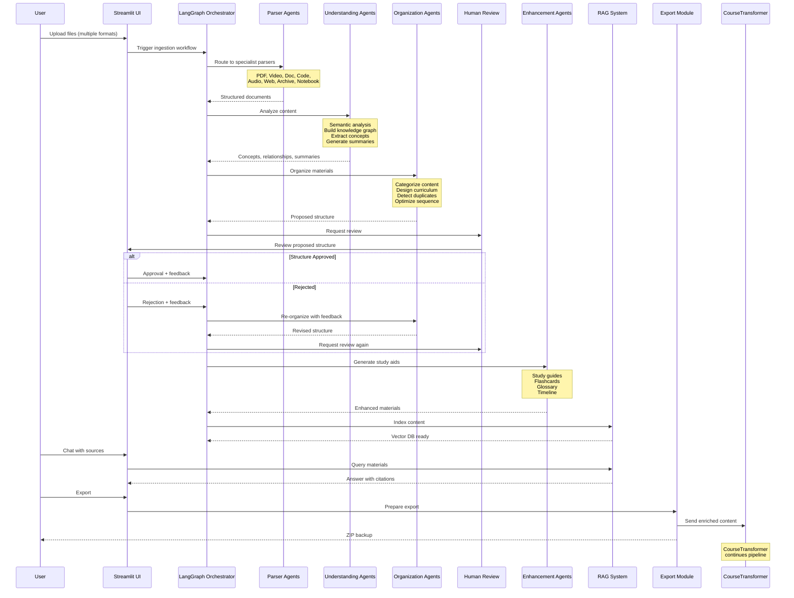

# CourseIngester - System Architecture

## System Overview

### Purpose
CourseIngester is an AI-powered, multi-format content ingestion system that serves as the intelligent "front door" to the course creation pipeline. It accepts raw educational materials in any format, deeply understands them using specialist agents, organizes them intelligently, and enriches them with NotebookLM-style study aids before exporting to CourseTransformer.

### Goals
- **Universal Intake**: Accept educational content in 20+ formats (PDF, video, code, web pages, archives, etc.)
- **Iterative Collection**: Support multiple uploads over time, continuously enriching the knowledge base
- **Deep Understanding**: Go beyond parsing to semantic analysis, concept extraction, and relationship mapping
- **Intelligent Organization**: Automatically structure materials into logical curriculum hierarchies
- **Enhanced Learning**: Generate study aids (summaries, flashcards, glossaries, timelines) to enrich content
- **Interactive Exploration**: Provide NotebookLM-style chat interface for querying materials
- **Human Guidance**: Enable human-in-loop review at critical decision points
- **Seamless Export**: Output enriched, organized content ready for CourseTransformer

### Position in Ecosystem
CourseIngester is the first stage in a comprehensive course creation and delivery pipeline:

1. **CourseIngester** (this module) - Intake, understand, organize, enrich raw materials
2. **CourseTransformer** - Modernize content, transform formats, generate interactive elements
3. **CourseCompliance** - Validate quality, ensure standards compliance
4. **CoursePlayerApp** - Deliver learning experience to students
5. **CoursesGTM** - Manage business logic and go-to-market strategy

## High-Level Architecture

```mermaid
graph TB
    subgraph "Input Layer"
        UI[Streamlit UI]
        Files[File Upload]
        URLs[URL Input]
        API[REST API]
    end
    
    subgraph "Parsing Layer - 8 Specialist Agents"
        PDF[PDF Parser]
        Video[Video Analyzer]
        Doc[Document Parser]
        Code[Code Repo Parser]
        Audio[Audio Transcriber]
        Web[Web Scraper]
        Archive[Archive Extractor]
        Notebook[Notebook Parser]
    end
    
    subgraph "Understanding Layer - 7 Analysis Agents"
        Semantic[Semantic Analyzer]
        Relationship[Relationship Mapper]
        KG[Knowledge Graph Builder]
        Summary[Summarization Agent]
        Questions[Question Generator]
        Gaps[Gap Identifier]
        Difficulty[Difficulty Assessor]
    end
    
    subgraph "Organization Layer - 4 Structuring Agents"
        Categorize[Content Categorizer]
        Curriculum[Curriculum Architect]
        Duplicates[Duplicate Detector]
        Sequence[Sequence Optimizer]
    end
    
    subgraph "Enhancement Layer - 6 Enrichment Agents"
        StudyGuide[Study Guide Gen]
        Flashcards[Flashcard Creator]
        Glossary[Glossary Generator]
        Timeline[Timeline Builder]
        Bibliography[Bibliography Org]
        Resources[Resource Suggester]
    end
    
    subgraph "RAG Knowledge Base"
        ChromaDB[(ChromaDB Vector Store)]
        Embeddings[Embedding Model]
        Search[Semantic Search]
    end
    
    subgraph "Human-in-Loop Interface"
        Review[Review Dashboard]
        Chat[Chat with Sources]
        Graph[Knowledge Graph Viewer]
        Export[Export Settings]
    end
    
    subgraph "Orchestration"
        LangGraph[LangGraph Workflow Engine]
        State[State Management]
    end
    
    subgraph "Output"
        Transformer[CourseTransformer]
        Backup[ZIP Backup]
    end
    
    UI --> LangGraph
    Files --> Archive
    URLs --> Web
    API --> LangGraph
    
    Archive --> PDF & Video & Doc & Code & Audio & Notebook
    
    PDF & Video & Doc & Code & Audio & Web & Notebook --> Semantic
    
    Semantic --> Relationship
    Relationship --> KG
    Semantic --> Summary
    Semantic --> Questions
    Semantic --> Gaps
    Semantic --> Difficulty
    
    KG --> Categorize
    Summary --> Categorize
    Difficulty --> Categorize
    
    Categorize --> Curriculum
    Categorize --> Duplicates
    KG --> Sequence
    
    Curriculum --> Review
    
    Review --> StudyGuide & Flashcards & Glossary & Timeline & Bibliography & Resources
    
    PDF & Video & Doc & Code & Audio & Web & Notebook --> Embeddings
    Embeddings --> ChromaDB
    ChromaDB --> Search
    Search --> Chat
    
    KG --> Graph
    
    StudyGuide & Flashcards & Glossary & Timeline --> Export
    Curriculum --> Export
    ChromaDB --> Export
    
    Export --> Transformer
    Export --> Backup
    
    LangGraph --> State
    State -.-> "All Agents"
```

## Data Flow Sequence



## Technology Stack

### Core Framework
- **Python 3.10+**: Primary development language
- **LangGraph**: Workflow orchestration and agent coordination
- **Streamlit**: Interactive web UI for human-in-loop operations

### Parsing & Extraction
- **PDF Processing**:
  - PyPDF2, pdfplumber: Native PDF text extraction
  - Tesseract OCR, EasyOCR: Scanned document OCR
  - pdf2image: PDF to image conversion
  - tabula-py: Table extraction
  
- **Video/Audio Processing**:
  - Whisper (OpenAI): Speech-to-text transcription
  - pyannote.audio: Speaker diarization
  - OpenCV: Video frame analysis
  - scenedetect: Scene change detection
  - pydub: Audio manipulation
  
- **Document Processing**:
  - python-docx: Word document parsing
  - python-pptx: PowerPoint parsing
  - markdown: Markdown parsing
  - pylatexenc: LaTeX parsing
  
- **Code Analysis**:
  - GitPython: Git repository interaction
  - ast (built-in): Python code analysis
  - tree-sitter: Multi-language parsing
  
- **Web Scraping**:
  - BeautifulSoup4: HTML parsing
  - newspaper3k: Article extraction
  - requests: HTTP client
  - Selenium: Dynamic content scraping
  
- **Archive Handling**:
  - zipfile, rarfile, tarfile: Archive extraction

### AI/ML Stack
- **OLLAMA**: Local LLM inference
  - llama3.2:1b - Lightweight tasks (categorization)
  - llama3.2:3b - Medium tasks (summarization, questions)
  - llama3.1:8b - Deep analysis (study guides, curriculum design)
  
- **Embeddings**:
  - sentence-transformers: Local embeddings
  - OpenAI embeddings (optional): Cloud embeddings
  
- **NLP Libraries**:
  - spaCy: Named entity recognition
  - NLTK: Text processing utilities
  - BERTopic: Topic modeling
  - gensim: Topic modeling (LDA)

### Knowledge & Storage
- **ChromaDB**: Vector database for semantic search
- **NetworkX**: Knowledge graph construction
- **PyVis**: Interactive graph visualization
- **SQLite**: Metadata and state storage

### Utilities
- **nbformat, nbconvert**: Jupyter notebook handling
- **Plotly**: Interactive visualizations
- **pandas**: Data manipulation
- **scikit-learn**: Text similarity, clustering

### External APIs (Optional)
- **YouTube API**: Related video discovery
- **arXiv API**: Academic paper discovery
- **AssemblyAI**: Cloud transcription alternative
- **Kaggle API**: Dataset discovery

## Key Design Principles

### 1. Format-Agnostic Ingestion
**Principle**: Accept any educational content format without discrimination.

**Implementation**:
- Automatic file type detection based on extension and magic bytes
- Dedicated specialist parser for each format family
- Graceful degradation when format is unrecognized (treat as binary)
- Plugin architecture allows adding new parsers easily

**Rationale**: Educators use diverse tools and formats. The system should adapt to them, not vice versa.

### 2. Iterative Upload Support
**Principle**: Allow continuous content addition over multiple sessions.

**Implementation**:
- Persistent state stored in SQLite
- Incremental knowledge graph updates
- Duplicate detection prevents redundant processing
- Delta processing (only new content analyzed)
- Upload history tracking with timestamps

**Rationale**: Course materials are often gathered piecemeal. The system should support organic content collection workflows.

### 3. Deep Understanding Before Organization
**Principle**: Comprehend content semantically before imposing structure.

**Implementation**:
- Multi-stage pipeline: Parse → Understand → Organize
- Concept extraction precedes categorization
- Relationship mapping before sequencing
- Summary generation for context
- Knowledge graph as foundation for all downstream tasks

**Rationale**: Surface-level file organization (by name, type) is inferior to semantic organization. Understanding content deeply enables intelligent structuring.

### 4. Human Guidance at Critical Decision Points
**Principle**: Automate the tedious, consult humans for judgment calls.

**Implementation**:
- Automatic parsing, analysis, and initial organization
- Human review required for curriculum structure approval
- Editable proposals (drag-drop reorganization)
- Feedback loop (rejected structures trigger re-organization)
- Non-blocking workflow (human can review asynchronously)

**Rationale**: AI excels at pattern recognition and tedious tasks. Humans excel at pedagogical judgment and domain expertise. Combine both.

### 5. Enrichment Before Export
**Principle**: Add maximum value before handing off to next pipeline stage.

**Implementation**:
- Generate comprehensive study aids
- Build queryable knowledge base
- Create multiple entry points to content (chat, graph, glossary)
- Enrich metadata with semantic tags
- Provide both raw and enhanced versions

**Rationale**: Downstream systems benefit from pre-processed, enriched content. Front-loading intelligence reduces duplication of effort.

### 6. Offline-First Operation
**Principle**: Minimize dependencies on external services.

**Implementation**:
- Local LLM inference via OLLAMA (no API keys required)
- Local embedding models (sentence-transformers)
- Local OCR (Tesseract)
- Local transcription (Whisper)
- Optional cloud services (YouTube API, arXiv) for enhancement only

**Rationale**: Privacy, cost control, and reliability. Users should not need internet or API credits for core functionality.

### 7. Transparency and Explainability
**Principle**: Make AI decisions auditable and understandable.

**Implementation**:
- Every categorization includes rationale
- Knowledge graph edges labeled with relationship types
- RAG answers cite source documents and locations
- Duplicate detection shows similarity scores
- Difficulty ratings show calculation basis

**Rationale**: Educators need to trust the system. Transparency builds trust and enables refinement.

### 8. Plugin Architecture
**Principle**: Easy extensibility for new formats and agents.

**Implementation**:
- Parser interface with standard input/output contracts
- Agent base class with lifecycle hooks
- Configuration-driven agent registration
- Hot-reloading for development

**Rationale**: Educational technology evolves. The system should grow with it.

## State Management

### Persistence
- **SQLite Database**: Stores workflow state, upload history, metadata
- **File System**: Stores parsed documents, extracted media
- **ChromaDB**: Stores vector embeddings and indexed content
- **NetworkX Graphs**: Serialized to JSON for knowledge graph persistence

### State Recovery
- Workflow can resume from interruption
- Incremental processing (skip already-processed files)
- Checkpointing at each major stage
- Rollback capability for human-rejected proposals

## Scalability Considerations

### Performance
- **Parallel Parsing**: Process multiple files simultaneously (multiprocessing)
- **Batch Embeddings**: Vectorize documents in batches for efficiency
- **Lazy Loading**: Load large documents on-demand, not all at once
- **Caching**: Cache LLM responses for repeated queries

### Resource Management
- **Memory**: Stream large files instead of loading entirely
- **GPU**: Optional GPU acceleration for Whisper, embeddings
- **Disk**: Configurable temp directory, automatic cleanup

### Limits
- **Single Upload**: 10GB max per upload session
- **Total Storage**: 100GB max for ingested content
- **Concurrent Users**: 1 (designed for single-user operation)
- **LLM Context**: 32K tokens (OLLAMA model dependent)

## Error Handling

### Graceful Degradation
- Failed parsers don't block workflow (mark as error, continue)
- OCR failures fall back to "content unavailable" placeholder
- Embedding failures isolate to specific documents
- Missing optional services (YouTube API) disable features gracefully

### Error Reporting
- Detailed error logs with stack traces
- User-friendly error messages in UI
- Parsing errors dashboard (shows failed files)
- Retry mechanism for transient failures

## Security Considerations

### Input Validation
- File type whitelisting (reject executables)
- Archive bomb detection (recursive extraction limits)
- Path traversal prevention
- File size limits

### Data Privacy
- All processing local (no data sent to cloud by default)
- Optional external API calls require explicit user consent
- Temporary files cleaned up after processing
- Export includes only user-approved content

### Dependency Security
- Regular dependency updates
- Vulnerability scanning (pip-audit)
- Sandboxed code execution for untrusted repositories
- LLM prompt injection defenses

## Future Extensions

### Planned Enhancements
- Multi-user support with workspace isolation
- Real-time collaboration on curriculum design
- Plugin marketplace for custom parsers
- Cloud deployment option (Docker, Kubernetes)
- Integration with LMS platforms (Canvas, Moodle)
- Multi-language support (internationalization)
- Mobile app for upload and review

### Research Directions
- Active learning for curriculum optimization
- Automated prerequisite inference from content
- Personalized study guide generation (based on learner profile)
- Automated quiz difficulty calibration
- Cross-course knowledge graph (connect related courses)

---

**Document Version**: 1.0  
**Last Updated**: January 2026  
**Status**: Design Specification (Not Implemented)
