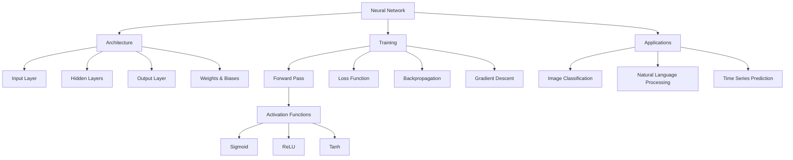
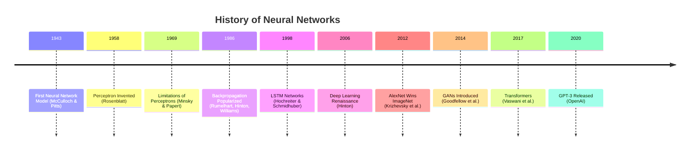

# CourseIngester - Enhancement Agents (NotebookLM Features)

## Overview

Enhancement agents enrich ingested content with study aids and learning resources inspired by NotebookLM functionality. These agents transform raw educational materials into comprehensive learning experiences with study guides, flashcards, glossaries, timelines, bibliographies, and resource recommendations.

**Design Philosophy**: Enhancement amplifies learning. By adding multiple entry points and study aids, we make content more accessible and effective for diverse learners.

---

## 1️⃣ Study Guide Generator

### Purpose
Create comprehensive study guides that distill key information, provide examples, and offer practice problems for effective learning and review.

### Capabilities

#### **Key Points Extraction**
- **Method**: Combine extractive and abstractive techniques
- **Process**:
  1. Identify important sentences using TextRank
  2. Extract key concepts (from Semantic Analysis Agent)
  3. LLM reformulation for clarity
  4. Organize hierarchically by topic
- **Output Format**:
  ```markdown
  ## Module 1: Neural Networks
  
  ### Key Points
  - **Definition**: Neural networks are computational models inspired by biological neurons
  - **Architecture**: Consists of input layer, hidden layers, and output layer
  - **Training**: Uses backpropagation algorithm to adjust weights
  - **Applications**: Image recognition, natural language processing, time series prediction
  ```

#### **Example Curation**
- **Sources**:
  - Examples from lecture materials
  - Code snippets from tutorials
  - Real-world case studies
- **Curation Criteria**:
  - Representative (illustrates key concept)
  - Diverse (different use cases)
  - Clear (well-explained, not overly complex)
- **Presentation**:
  ```markdown
  ### Examples
  
  **Example 1: Simple Neural Network**
  ```python
  import numpy as np
  
  def sigmoid(x):
      return 1 / (1 + np.exp(-x))
  
  # 2-layer neural network
  X = np.array([[0,0,1], [1,1,1], [1,0,1], [0,1,1]])
  y = np.array([[0,1,1,0]]).T
  ```
  *This example demonstrates a basic neural network with sigmoid activation.*
  ```

#### **Practice Problem Creation**
- **Problem Types**:
  - **Conceptual**: "Explain the purpose of the activation function"
  - **Computational**: "Calculate the output of this network given input [1, 0, 1]"
  - **Applied**: "Design a neural network for classifying iris flowers"
- **Difficulty Levels**: Easy, Medium, Hard
- **Solutions**: Provided separately or hidden (reveal on click)
- **Source**: Generated by Question Generation Agent

#### **Summary Compilation**
- **Hierarchical Summaries**:
  - Module summary (from Summarization Agent)
  - Topic summaries
  - Section summaries
- **Integration**: Weave summaries into cohesive narrative
- **Length**: 1-3 pages per module

#### **Concept Map Generation**
- **Purpose**: Visual representation of concept relationships
- **Tool**: Graphviz, Mermaid, or draw.io
- **Structure**: Hierarchical or network layout
- **Example**:
  ```mermaid
  graph TD
      A[Machine Learning] --> B[Supervised Learning]
      A --> C[Unsupervised Learning]
      B --> D[Regression]
      B --> E[Classification]
      D --> F[Linear Regression]
      D --> G[Polynomial Regression]
      E --> H[Logistic Regression]
      E --> I[Decision Trees]
  ```

### LLM Usage (OLLAMA)

#### **Model Selection**
- **Study Guide Generation**: llama3.1:8b (comprehensive, well-structured output)

#### **Prompt Templates**
```python
STUDY_GUIDE_PROMPT = """
You are an expert educator creating a study guide.

Module: {module_name}
Content Summary: {content_summary}
Key Concepts: {concepts}

Create a comprehensive study guide with:
1. Module Overview (2-3 paragraphs)
2. Learning Objectives (3-5 items)
3. Key Points (10-15 bullet points)
4. Important Definitions (5-10 terms)
5. Key Takeaways (3-5 items)
6. Further Reading Suggestions

Format in Markdown.
"""

CONCEPT_MAP_PROMPT = """
Create a concept map for this topic in Mermaid syntax.

Topic: {topic}
Concepts: {concept_list}
Relationships: {relationships}

Output a Mermaid graph showing hierarchical or network relationships.
Use graph TD (top-down) or graph LR (left-right) layout.
"""
```

### Outputs

**Study Guide (Markdown)**:
```markdown
# Study Guide: Neural Networks Fundamentals

## Module Overview

Neural networks are computational models inspired by the structure and function of 
biological neural networks in the brain. This module covers the foundational concepts 
of neural network architecture, training algorithms, and practical applications.

You will learn how neural networks process information through layers of interconnected 
nodes, how the backpropagation algorithm enables learning, and how to implement simple 
neural networks using Python and NumPy.

## Learning Objectives

Upon completing this module, you will be able to:
- Understand the architecture of feedforward neural networks
- Explain the role of activation functions in neural networks
- Apply the backpropagation algorithm to train a neural network
- Implement a simple neural network from scratch in Python
- Evaluate neural network performance using appropriate metrics

## Key Points

### Architecture
- **Layers**: Neural networks consist of input layer, one or more hidden layers, and output layer
- **Neurons**: Each neuron computes a weighted sum of inputs and applies an activation function
- **Weights**: Connections between neurons have associated weights that are learned during training
- **Biases**: Each neuron has a bias term that shifts the activation function

### Training
- **Forward Pass**: Input data flows through network to produce output prediction
- **Loss Function**: Measures difference between prediction and actual target
- **Backpropagation**: Computes gradients of loss with respect to weights
- **Gradient Descent**: Updates weights in direction that reduces loss
- **Learning Rate**: Controls step size during weight updates

### Activation Functions
- **Sigmoid**: Maps input to (0, 1), useful for probability outputs
- **ReLU**: Rectified Linear Unit, most common in hidden layers
- **Tanh**: Maps input to (-1, 1), centered around zero
- **Softmax**: Converts output to probability distribution for multi-class classification

## Important Definitions

**Neural Network**: A computational model consisting of interconnected processing nodes 
(neurons) organized in layers, capable of learning patterns from data.

**Backpropagation**: An algorithm for training neural networks by computing gradients 
of the loss function with respect to network weights using the chain rule.

**Activation Function**: A non-linear function applied to neuron output, enabling 
neural networks to learn complex patterns.

**Epoch**: One complete pass through the entire training dataset during training.

**Learning Rate**: Hyperparameter controlling the step size during gradient descent 
weight updates.

## Examples

### Example 1: Simple 2-Layer Network
```python
import numpy as np

# Initialize weights
W1 = np.random.randn(3, 4)  # 3 inputs, 4 hidden neurons
W2 = np.random.randn(4, 1)  # 4 hidden, 1 output

# Forward pass
X = np.array([[1, 0, 1]])  # Input
hidden = sigmoid(X @ W1)   # Hidden layer
output = sigmoid(hidden @ W2)  # Output layer
```

### Example 2: Training Loop
```python
for epoch in range(1000):
    # Forward pass
    hidden = sigmoid(X @ W1)
    output = sigmoid(hidden @ W2)
    
    # Compute loss
    loss = np.mean((output - y) ** 2)
    
    # Backward pass (backpropagation)
    d_output = 2 * (output - y) * sigmoid_derivative(output)
    d_W2 = hidden.T @ d_output
    d_hidden = d_output @ W2.T * sigmoid_derivative(hidden)
    d_W1 = X.T @ d_hidden
    
    # Update weights
    W2 -= learning_rate * d_W2
    W1 -= learning_rate * d_W1
```

## Practice Problems

### Easy
1. What is the purpose of the activation function in a neural network?
2. Define the term "epoch" in the context of neural network training.
3. What is the difference between weights and biases?

### Medium
4. Calculate the output of a neuron with inputs [0.5, 0.3, 0.8], weights [0.2, 0.5, 0.1], 
   bias 0.4, using sigmoid activation.
5. Explain why backpropagation is more efficient than computing gradients numerically.
6. Implement a sigmoid activation function and its derivative in Python.

### Hard
7. Design a neural network architecture for classifying handwritten digits (0-9). Specify 
   the number of layers, neurons per layer, and activation functions.
8. Derive the gradient of the sigmoid function using calculus.
9. Implement a complete 2-layer neural network for XOR problem from scratch.

## Key Takeaways

- Neural networks learn by adjusting weights through backpropagation and gradient descent
- Non-linear activation functions enable neural networks to model complex patterns
- Proper initialization and learning rate selection are crucial for successful training
- Neural networks can approximate any continuous function (universal approximation theorem)
- Overfitting can be addressed through regularization, dropout, and early stopping

## Further Reading

- "Neural Networks and Deep Learning" by Michael Nielsen (online book)
- "Deep Learning" by Goodfellow, Bengio, and Courville (Chapter 6)
- Original backpropagation paper: Rumelhart et al. (1986)
- Interactive neural network playground: https://playground.tensorflow.org

## Concept Map



---

*Study guide generated by CourseIngester v1.0 on 2024-01-15*
```

### Tools & Libraries
- **OLLAMA**: LLM for study guide generation
- **Mermaid**: Concept map generation
- **Graphviz**: Alternative graph visualization
- **Markdown**: Output format

### Configuration
```yaml
study_guide_generator:
  llm_model: "llama3.1:8b"
  include_examples: true
  include_practice_problems: true
  include_concept_map: true
  problems_per_difficulty: [3, 3, 3]  # Easy, Medium, Hard
  output_format: "markdown"
```

---

## 2️⃣ Flashcard Creator

### Purpose
Automatically generate flashcards for spaced repetition learning, supporting multiple question types and difficulty levels.

### Capabilities

#### **Question/Answer Pair Generation**
- **Generation Methods**:
  - **Definitional**: "Q: What is backpropagation? A: An algorithm for..."
  - **Fact-based**: "Q: Who invented neural networks? A: Warren McCulloch and Walter Pitts (1943)"
  - **Conceptual**: "Q: Why do we use non-linear activation functions? A: To enable learning of complex patterns"
- **LLM Prompt**:
  ```
  Generate 10 flashcards from this content.
  
  Content: {text}
  
  Format each as:
  Q: [question]
  A: [concise answer]
  Difficulty: [Easy/Medium/Hard]
  ```

#### **Cloze Deletion Creation**
- **Definition**: Sentence with blanks to fill in
- **Example**:
  - Original: "The sigmoid function maps any input to the range (0, 1)."
  - Cloze: "The sigmoid function maps any input to the range {{c1::(0, 1)}}."
  - Alternative: "The {{c1::sigmoid}} function maps any input to the range (0, 1)."
- **Benefits**: Tests recall in context, mirrors how information is used
- **Multiple Deletions**: Multiple blanks per card (e.g., {{c1::first}} and {{c2::second}})

#### **Difficulty Tagging**
- **Criteria**:
  - **Easy**: Basic definitions, simple facts
  - **Medium**: Conceptual understanding, relationships
  - **Hard**: Application, synthesis, edge cases
- **Auto-tagging**: Based on Bloom's taxonomy level
- **Manual Override**: User can adjust difficulty

#### **Spaced Repetition Scheduling**
- **Algorithm**: SuperMemo SM-2 or Leitner system
- **Intervals**: 
  - New card: 1 day
  - Easy: 4 days
  - Good: 1.5x previous interval
  - Hard: Reset to 1 day
- **Ease Factor**: Adjusted based on performance
- **Daily Limits**: Configurable (e.g., 20 new cards/day, 100 review cards/day)

### Output Formats

#### **Anki Format** (CSV/APKG)
```csv
Front,Back,Difficulty,Tags
"What is the primary purpose of backpropagation?","To compute gradients for weight updates during neural network training","Medium","neural-networks,training,backpropagation"
"Cloze: The {{c1::sigmoid}} function outputs values in range {{c2::(0,1)}}","","Easy","activation-functions,sigmoid"
```

#### **JSON Format**
```json
{
  "deck_name": "Neural Networks Fundamentals",
  "cards": [
    {
      "id": "card_001",
      "type": "qa",
      "front": "What is the primary purpose of backpropagation?",
      "back": "To compute gradients for weight updates during neural network training",
      "difficulty": "Medium",
      "tags": ["neural-networks", "training", "backpropagation"],
      "source": "lecture_03.pdf, page 15",
      "created": "2024-01-15"
    },
    {
      "id": "card_002",
      "type": "cloze",
      "text": "The {{c1::sigmoid}} function outputs values in range {{c2::(0,1)}}",
      "difficulty": "Easy",
      "tags": ["activation-functions", "sigmoid"]
    }
  ],
  "metadata": {
    "total_cards": 150,
    "difficulty_distribution": {"Easy": 50, "Medium": 70, "Hard": 30},
    "created_date": "2024-01-15"
  }
}
```

### LLM Usage (OLLAMA)

```python
FLASHCARD_GENERATION_PROMPT = """
Generate {num_cards} flashcards from this educational content.

Content: {text}

For each flashcard:
- Front: A clear, concise question
- Back: A complete but concise answer (1-3 sentences)
- Difficulty: Easy, Medium, or Hard

Mix of question types:
- Definitions ("What is X?")
- Facts ("Who/What/When/Where?")
- Concepts ("Why/How?")
- Applications ("How would you use X?")

Output format:
---
Q: [question]
A: [answer]
Difficulty: [Easy/Medium/Hard]
---
"""

CLOZE_GENERATION_PROMPT = """
Create cloze deletion flashcards from key sentences.

Content: {text}

For each card:
- Select an important sentence
- Replace key term(s) with {{c1::term}}
- Ensure sentence remains clear with deletion

Generate {num_cards} cloze cards.
"""
```

### Outputs

**Flashcard Deck**:
```python
{
    "deck_id": "nn_fundamentals_deck",
    "deck_name": "Neural Networks Fundamentals",
    "description": "Flashcards covering neural network architecture, training, and applications",
    "created": "2024-01-15",
    "total_cards": 150,
    
    "cards": [
        {
            "id": "card_001",
            "type": "qa",
            "front": "What is a neural network?",
            "back": "A computational model consisting of interconnected nodes (neurons) organized in layers, capable of learning patterns from data through training.",
            "difficulty": "Easy",
            "tags": ["definition", "neural-networks", "basics"],
            "source": "lecture_01.pdf, page 5",
            "bloom_level": "Remember"
        },
        {
            "id": "card_002",
            "type": "qa",
            "front": "Why do neural networks use non-linear activation functions?",
            "back": "Non-linear activation functions enable neural networks to learn and model complex, non-linear relationships in data. Without them, multiple layers would collapse to a single linear transformation.",
            "difficulty": "Medium",
            "tags": ["activation-functions", "concept"],
            "source": "lecture_02.pdf, page 12",
            "bloom_level": "Understand"
        },
        {
            "id": "card_003",
            "type": "cloze",
            "text": "During backpropagation, gradients are computed using the {{c1::chain rule}} and flow from {{c2::output to input}} layers.",
            "difficulty": "Medium",
            "tags": ["backpropagation", "training"],
            "source": "lecture_03.pdf, page 20"
        },
        {
            "id": "card_004",
            "type": "qa",
            "front": "What happens if the learning rate is too high?",
            "back": "If the learning rate is too high, the optimization can overshoot the minimum, causing divergence or oscillation instead of convergence.",
            "difficulty": "Hard",
            "tags": ["hyperparameters", "learning-rate", "troubleshooting"],
            "source": "tutorial_02.md",
            "bloom_level": "Analyze"
        }
    ],
    
    "statistics": {
        "by_difficulty": {
            "Easy": 50,
            "Medium": 70,
            "Hard": 30
        },
        "by_type": {
            "qa": 120,
            "cloze": 30
        },
        "by_bloom": {
            "Remember": 40,
            "Understand": 60,
            "Apply": 30,
            "Analyze": 20
        }
    },
    
    "spaced_repetition": {
        "algorithm": "SM-2",
        "new_cards_per_day": 20,
        "review_cards_per_day": 100,
        "initial_ease": 2.5
    },
    
    "export_formats": ["anki_apkg", "anki_csv", "json", "markdown"]
}
```

### Tools & Libraries
- **OLLAMA**: LLM for flashcard generation
- **genanki**: Generate Anki decks programmatically
- **pandas**: Organize flashcards

### Configuration
```yaml
flashcard_creator:
  llm_model: "llama3.2:3b"
  cards_per_module: 50
  difficulty_distribution: [0.35, 0.45, 0.20]  # Easy, Medium, Hard
  cloze_ratio: 0.20  # 20% cloze, 80% Q&A
  enable_spaced_repetition: true
  export_anki: true
```

---

## 3️⃣ Glossary Generator

### Purpose
Extract and define key terms to create a comprehensive, searchable glossary of technical vocabulary.

### Capabilities

#### **Technical Term Extraction**
- **Methods**:
  - **NER**: Named Entity Recognition for TECHNOLOGY, ALGORITHM entities
  - **TF-IDF**: High-scoring unique terms
  - **Capitalization**: Terms in Title Case or ALL CAPS
  - **Contextual**: Terms followed by "is defined as", "refers to"
- **Filtering**: Remove common words, keep domain-specific terms

#### **Definition Generation**
- **Sources**:
  1. **In-text**: Extract definitions from content ("X is...", "X refers to...")
  2. **LLM**: Generate definition if not found in text
  3. **Wikipedia API**: Fetch definitions for well-known terms (optional)
- **LLM Prompt**:
  ```
  Define the following technical term in 1-2 sentences.
  Context: {surrounding_text}
  Term: {term}
  
  Definition:
  ```
- **Quality**: Concise (1-3 sentences), clear, accurate

#### **Acronym Expansion**
- **Detection**: All-caps words (e.g., CNN, RNN, API, ML)
- **Expansion**:
  - From text: "Convolutional Neural Network (CNN)"
  - LLM inference: "What does CNN stand for in deep learning context?"
- **Example**: 
  - **CNN**: Convolutional Neural Network
  - **RNN**: Recurrent Neural Network
  - **API**: Application Programming Interface

#### **Cross-Referencing**
- **Related Terms**: Link similar or related glossary entries
  - Example: "Neural Network" → See also: "Deep Learning", "Backpropagation", "Activation Function"
- **Hierarchy**: Parent-child relationships
  - Example: "Machine Learning" ⊃ "Supervised Learning" ⊃ "Linear Regression"

#### **Alphabetical Formatting**
- **Organization**: A-Z sections
- **Navigation**: Jump links to each letter
- **Search**: Searchable interface (Ctrl+F or search bar)

### Outputs

**Glossary (Markdown)**:
```markdown
# Glossary: Neural Networks & Deep Learning

*Comprehensive glossary of technical terms for the Neural Networks course.*

[A](#a) | [B](#b) | [C](#c) | [D](#d) | [E](#e) | [F](#f) | ... | [Z](#z)

---

## A

**Activation Function**  
A non-linear mathematical function applied to a neuron's output, enabling neural networks to learn complex patterns. Common activation functions include sigmoid, ReLU, and tanh.  
*See also: Sigmoid, ReLU, Tanh*

**Adam Optimizer**  
An adaptive learning rate optimization algorithm that combines advantages of RMSprop and momentum. Widely used for training deep neural networks.  
*Related: Gradient Descent, Learning Rate*

**AI** (Artificial Intelligence)  
The simulation of human intelligence processes by computer systems, including learning, reasoning, and self-correction.

---

## B

**Backpropagation**  
An algorithm for training neural networks by computing gradients of the loss function with respect to network weights using the chain rule of calculus. Enables efficient training of deep networks.  
*Source: Lecture 3, page 15*  
*See also: Gradient Descent, Chain Rule*

**Batch Normalization**  
A technique to normalize inputs to each layer, reducing internal covariate shift and accelerating training.  
*Introduced by: Ioffe & Szegedy (2015)*

**Bias (Neural Networks)**  
A parameter added to the weighted sum in a neuron before applying the activation function. Allows the activation function to shift left or right.

---

## C

**Chain Rule**  
A fundamental calculus rule for computing derivatives of composite functions. Foundation of the backpropagation algorithm.

**CNN** (Convolutional Neural Network)  
A type of deep learning model designed for processing grid-like data (e.g., images). Uses convolutional layers to automatically learn spatial hierarchies of features.  
*See also: Convolution, Pooling*

**Cross-Entropy Loss**  
A loss function commonly used for classification tasks. Measures the difference between predicted probability distribution and actual distribution.

---

## D

**Deep Learning**  
A subset of machine learning using neural networks with multiple layers (deep networks) to learn hierarchical representations of data.  
*Parent concept: Machine Learning*

**Dropout**  
A regularization technique where random neurons are ignored during training to prevent overfitting.  
*Introduced by: Srivastava et al. (2014)*

---

## E

**Epoch**  
One complete pass through the entire training dataset during neural network training.

**Exploding Gradients**  
A problem during training where gradients become extremely large, causing unstable updates and divergence.  
*See also: Vanishing Gradients, Gradient Clipping*

---

## F

**Feedforward Neural Network**  
A neural network where information flows in one direction from input to output, without cycles or loops.  
*Contrast: Recurrent Neural Network*

---

## G

**Gradient Descent**  
An optimization algorithm that iteratively adjusts parameters in the direction of steepest descent of the loss function to minimize error.  
*Variants: SGD, Mini-batch Gradient Descent, Adam*

**GPU** (Graphics Processing Unit)  
A specialized processor designed for parallel computations, widely used to accelerate neural network training.

---

*[Additional entries for H through Z...]*

---

## Statistics

- **Total Terms**: 127
- **Acronyms**: 23
- **Cross-References**: 89
- **Sources**: 15 documents

---

*Glossary generated by CourseIngester v1.0 on 2024-01-15*
```

**JSON Format**:
```json
{
  "glossary_id": "nn_glossary_v1",
  "title": "Neural Networks & Deep Learning Glossary",
  "created": "2024-01-15",
  "total_terms": 127,
  
  "entries": [
    {
      "term": "Backpropagation",
      "acronym": null,
      "definition": "An algorithm for training neural networks by computing gradients of the loss function with respect to network weights using the chain rule of calculus.",
      "extended_definition": "Backpropagation enables efficient training of deep networks by propagating error signals from output to input layers, computing gradients layer by layer.",
      "sources": ["lecture_03.pdf, page 15", "tutorial_02.md"],
      "related_terms": ["Gradient Descent", "Chain Rule", "Forward Pass"],
      "category": "Training Algorithm",
      "difficulty": "Intermediate"
    },
    {
      "term": "CNN",
      "acronym": "Convolutional Neural Network",
      "definition": "A type of deep learning model designed for processing grid-like data (e.g., images) using convolutional layers.",
      "sources": ["lecture_06.pdf"],
      "related_terms": ["Deep Learning", "Convolution", "Pooling"],
      "category": "Architecture"
    }
  ],
  
  "categories": ["Architecture", "Training Algorithm", "Activation Functions", "Optimization", "Regularization"],
  
  "metadata": {
    "total_acronyms": 23,
    "total_cross_references": 89,
    "sources": 15
  }
}
```

### Tools & Libraries
- **OLLAMA**: LLM for definition generation
- **spaCy**: NER for term extraction
- **scikit-learn**: TF-IDF for term importance
- **Wikipedia API** (optional): Fetch definitions

### Configuration
```yaml
glossary_generator:
  llm_model: "llama3.2:3b"
  min_term_frequency: 3
  max_terms: 200
  generate_cross_references: true
  expand_acronyms: true
  alphabetical_organization: true
  output_formats: ["markdown", "json", "html"]
```

---

## 4️⃣ Timeline Builder

### Purpose
Create visual, interactive timelines for historical content, project milestones, or course progression.

### Capabilities

#### **Event/Date Extraction**
- **Methods**:
  - **NER**: DATE entities (spaCy, dateparser)
  - **Regex**: Date patterns (YYYY-MM-DD, MM/DD/YYYY, etc.)
  - **Contextual**: "In 1943...", "During the 1980s..."
- **Event Association**: Link dates to events/milestones
- **Example Extraction**:
  - Text: "In 1943, Warren McCulloch and Walter Pitts published the first neural network model."
  - Extracted: {date: "1943", event: "First neural network model published", people: ["Warren McCulloch", "Walter Pitts"]}

#### **Chronological Ordering**
- **Sorting**: Order events by date (earliest to latest)
- **Grouping**: Group by era, decade, or year
- **Validation**: Flag out-of-order or conflicting dates

#### **Visual Timeline Generation**
- **Tools**:
  - **Timeline.js**: JavaScript library for interactive timelines
  - **Plotly**: Python-based timeline charts
  - **Mermaid**: Simple text-based timelines
- **Features**:
  - Zoom and pan
  - Event details on click
  - Media embedding (images, videos)
  - Filtering by category

### Timeline Types

#### **Historical Timeline** (AI/ML History)
```json
{
  "timeline_title": "History of Neural Networks",
  "events": [
    {
      "year": 1943,
      "title": "First Neural Network Model",
      "description": "McCulloch and Pitts publish mathematical model of neuron",
      "people": ["Warren McCulloch", "Walter Pitts"],
      "category": "Foundation"
    },
    {
      "year": 1958,
      "title": "Perceptron Invented",
      "description": "Frank Rosenblatt develops the Perceptron algorithm",
      "category": "Algorithm"
    },
    {
      "year": 1986,
      "title": "Backpropagation Popularized",
      "description": "Rumelhart, Hinton, and Williams demonstrate backpropagation",
      "category": "Breakthrough"
    }
  ]
}
```

#### **Course Progression Timeline**
```
Week 1: Python Basics
Week 2: NumPy & Pandas
Week 3: Data Visualization
Week 4: ML Foundations
Week 5: Neural Networks
Week 6: Deep Learning
```

#### **Project Milestone Timeline**
```
2023-01-15: Project kickoff
2023-02-01: Data collection complete
2023-03-15: Model training complete
2023-04-01: Deployment
```

### Outputs

**Timeline (Timeline.js JSON)**:
```json
{
  "title": {
    "text": {
      "headline": "History of Neural Networks",
      "text": "<p>Key milestones in the development of neural networks and deep learning</p>"
    }
  },
  "events": [
    {
      "start_date": {
        "year": "1943"
      },
      "text": {
        "headline": "First Neural Network Model",
        "text": "<p>Warren McCulloch and Walter Pitts publish 'A Logical Calculus of Ideas Immanent in Nervous Activity', creating the first mathematical model of a neural network.</p>"
      },
      "group": "Foundation"
    },
    {
      "start_date": {
        "year": "1958"
      },
      "text": {
        "headline": "Perceptron Invented",
        "text": "<p>Frank Rosenblatt develops the Perceptron, the first algorithm for supervised learning of binary classifiers.</p>"
      },
      "media": {
        "url": "images/perceptron.png",
        "caption": "Diagram of Rosenblatt's Perceptron"
      },
      "group": "Algorithm"
    },
    {
      "start_date": {
        "year": "1986"
      },
      "text": {
        "headline": "Backpropagation Popularized",
        "text": "<p>Rumelhart, Hinton, and Williams publish 'Learning representations by back-propagating errors', popularizing the backpropagation algorithm.</p>"
      },
      "group": "Breakthrough"
    }
  ]
}
```

**Mermaid Timeline**:


### Tools & Libraries
- **Timeline.js**: Interactive timeline library
- **Plotly**: Python timeline charts
- **dateparser**: Parse diverse date formats
- **spaCy**: DATE entity extraction
- **Mermaid**: Simple text-based timelines

### Configuration
```yaml
timeline_builder:
  enable_for_historical_content: true
  date_extraction_method: "ner"  # or "regex"
  timeline_library: "timelinejs"  # or "plotly", "mermaid"
  group_by: "category"  # or "year", "decade"
```

---

## 5️⃣ Bibliography Organizer

### Purpose
Organize references and citations from course materials into a well-formatted, validated bibliography.

### Capabilities

#### **Citation Extraction**
- **Methods**:
  - **Regex**: Detect citation patterns (author-year, numbered)
  - **NER**: Extract author names, publication years
  - **Bibliography Section**: Parse "References", "Bibliography" sections
- **Citation Styles**: APA, MLA, Chicago, IEEE, Vancouver
- **Example**:
  - In-text: "(Goodfellow et al., 2014)"
  - Full: "Goodfellow, I., Pouget-Abadie, J., Mirza, M., Xu, B., Warde-Farley, D., Ozair, S., ... & Bengio, Y. (2014). Generative adversarial nets. In Advances in neural information processing systems (pp. 2672-2680)."

#### **Reference Organization**
- **Grouping**:
  - By type (Journal, Conference, Book, Website)
  - By author (alphabetical)
  - By year (chronological)
  - By topic
- **Sorting**: Alphabetical by first author's last name (default)

#### **Bibliography Formatting**
- **Supported Styles**:
  - **APA 7**: (Author, Year) - Common in psychology, education
  - **MLA 9**: (Author Page) - Common in humanities
  - **Chicago**: Footnote or author-date
  - **IEEE**: Numbered - Common in engineering
  - **Vancouver**: Numbered - Common in medicine
- **Tool**: Citation Style Language (CSL) processors

#### **Link Validation**
- **Check URLs**: Verify links are accessible (HTTP status 200)
- **DOI Resolution**: Verify DOI links resolve correctly
- **Broken Link Detection**: Flag 404 errors
- **Archive Links**: Suggest archive.org for broken links

### Outputs

**Bibliography (APA Style)**:
```markdown
# References

## Books

Goodfellow, I., Bengio, Y., & Courville, A. (2016). *Deep learning*. MIT Press.

Mitchell, T. M. (1997). *Machine learning*. McGraw-Hill.

## Journal Articles

Hinton, G. E., Osindero, S., & Teh, Y. W. (2006). A fast learning algorithm for deep 
belief nets. *Neural computation*, 18(7), 1527-1554. 
https://doi.org/10.1162/neco.2006.18.7.1527

LeCun, Y., Bengio, Y., & Hinton, G. (2015). Deep learning. *Nature*, 521(7553), 436-444. 
https://doi.org/10.1038/nature14539

## Conference Papers

Krizhevsky, A., Sutskever, I., & Hinton, G. E. (2012). Imagenet classification with deep 
convolutional neural networks. In *Advances in neural information processing systems* 
(pp. 1097-1105).

Vaswani, A., Shazeer, N., Parmar, N., Uszkoreit, J., Jones, L., Gomez, A. N., ... & 
Polosukhin, I. (2017). Attention is all you need. In *Advances in neural information 
processing systems* (pp. 5998-6008).

## Online Resources

TensorFlow Tutorials. (2024). *Introduction to Neural Networks*. Retrieved January 15, 
2024, from https://www.tensorflow.org/tutorials

Olah, C. (2015). *Understanding LSTM Networks*. Retrieved from 
https://colah.github.io/posts/2015-08-Understanding-LSTMs/

## Datasets

Dua, D., & Graff, C. (2019). *UCI Machine Learning Repository*. University of California, 
Irvine, School of Information and Computer Sciences. http://archive.ics.uci.edu/ml

---

*Total References: 48*  
*Last Updated: 2024-01-15*
```

**JSON Format**:
```json
{
  "bibliography_id": "nn_course_refs",
  "citation_style": "APA",
  "total_references": 48,
  
  "references": [
    {
      "id": "ref_001",
      "type": "book",
      "authors": ["Goodfellow, I.", "Bengio, Y.", "Courville, A."],
      "year": 2016,
      "title": "Deep learning",
      "publisher": "MIT Press",
      "formatted_apa": "Goodfellow, I., Bengio, Y., & Courville, A. (2016). Deep learning. MIT Press.",
      "formatted_mla": "Goodfellow, Ian, et al. Deep learning. MIT Press, 2016."
    },
    {
      "id": "ref_002",
      "type": "journal",
      "authors": ["Hinton, G.E.", "Osindero, S.", "Teh, Y.W."],
      "year": 2006,
      "title": "A fast learning algorithm for deep belief nets",
      "journal": "Neural computation",
      "volume": "18",
      "issue": "7",
      "pages": "1527-1554",
      "doi": "10.1162/neco.2006.18.7.1527",
      "url": "https://doi.org/10.1162/neco.2006.18.7.1527",
      "url_status": "valid"
    },
    {
      "id": "ref_003",
      "type": "website",
      "authors": ["Olah, C."],
      "year": 2015,
      "title": "Understanding LSTM Networks",
      "url": "https://colah.github.io/posts/2015-08-Understanding-LSTMs/",
      "url_status": "valid",
      "access_date": "2024-01-15"
    }
  ],
  
  "statistics": {
    "by_type": {
      "book": 8,
      "journal": 15,
      "conference": 12,
      "website": 10,
      "dataset": 3
    },
    "by_year": {
      "2020-2024": 15,
      "2015-2019": 18,
      "2010-2014": 10,
      "before_2010": 5
    },
    "broken_links": 2,
    "missing_dois": 5
  }
}
```

### Tools & Libraries
- **CSL (Citation Style Language)**: Format citations
- **citeproc-py**: Python CSL processor
- **requests**: Validate URLs
- **Regex**: Extract citations

### Configuration
```yaml
bibliography_organizer:
  default_style: "APA"
  validate_links: true
  organize_by: "type"  # or "author", "year"
  check_dois: true
  export_formats: ["markdown", "bibtex", "json"]
```

---

## 6️⃣ Multimedia Resource Suggester

### Purpose
Suggest related external resources (videos, datasets, articles, courses) to supplement course materials.

### Capabilities

#### **YouTube Video Finder**
- **Method**: YouTube Data API v3
- **Query Construction**: Based on key concepts
- **Filters**:
  - Duration (short: <4min, medium: 4-20min, long: >20min)
  - Upload date (recent: last year, any)
  - Relevance (sort by relevance, views, rating)
- **Metadata**: Title, channel, views, duration, thumbnail
- **Example Query**: "neural networks backpropagation tutorial"

#### **Dataset Finder**
- **Sources**:
  - **Kaggle**: Kaggle API for dataset search
  - **UCI ML Repository**: Pre-indexed datasets
  - **HuggingFace Datasets**: datasets library
  - **Google Dataset Search**: Web scraping (optional)
- **Filtering**: By domain (e.g., computer vision, NLP, tabular)
- **Metadata**: Name, description, size, format, license

#### **Article Recommender**
- **Sources**:
  - **arXiv API**: Academic papers
  - **Medium**: Blog posts via RSS/API
  - **Towards Data Science**: Medium publication
  - **Papers with Code**: Papers + code implementations
- **Relevance Matching**: Keyword/concept-based search
- **Recency**: Prioritize recent publications

#### **Related Course Finder**
- **Sources**:
  - Coursera, edX, Udacity APIs
  - GitHub (search for course repos)
  - MOOC aggregators
- **Matching**: By topic, difficulty level
- **Example**: User studying "Neural Networks" → Suggest "Deep Learning Specialization" (Coursera)

### LLM Usage (OLLAMA)

```python
RESOURCE_RECOMMENDATION_PROMPT = """
Based on this course module, suggest relevant learning resources.

Module: {module_name}
Topics: {topics}
Difficulty: {difficulty}

For each resource type, suggest 3-5 items:
1. YouTube Videos (educational, tutorial-focused)
2. Datasets (for hands-on practice)
3. Articles/Blog Posts (in-depth explanations)
4. Related Courses (for further learning)

Format:
Resource Type: [Video/Dataset/Article/Course]
Title: [name]
Description: [brief description]
Relevance: [why this is relevant]
"""
```

### Outputs

**Resource Suggestions**:
```python
{
    "module_id": "mod_3",
    "module_name": "Neural Networks Fundamentals",
    "suggestions_generated": "2024-01-15",
    
    "videos": [
        {
            "title": "But what is a neural network? | Chapter 1, Deep learning",
            "channel": "3Blue1Brown",
            "url": "https://www.youtube.com/watch?v=aircAruvnKk",
            "duration": "19:13",
            "views": "15M",
            "upload_date": "2017-10-05",
            "thumbnail": "https://i.ytimg.com/vi/aircAruvnKk/hqdefault.jpg",
            "relevance": "Excellent visual explanation of neural network fundamentals",
            "quality_score": 9.8
        },
        {
            "title": "Neural Networks Explained - Machine Learning Tutorial",
            "channel": "freeCodeCamp.org",
            "url": "https://www.youtube.com/watch?v=...",
            "duration": "45:30",
            "views": "2.5M",
            "relevance": "Comprehensive tutorial covering theory and implementation"
        }
    ],
    
    "datasets": [
        {
            "name": "MNIST Handwritten Digits",
            "source": "Kaggle",
            "url": "https://www.kaggle.com/datasets/mnist",
            "description": "Classic dataset of 70,000 handwritten digits for image classification",
            "size": "50 MB",
            "format": "CSV, Images",
            "license": "CC0: Public Domain",
            "relevance": "Perfect for practicing neural network classification",
            "difficulty": "Beginner"
        },
        {
            "name": "CIFAR-10",
            "source": "HuggingFace Datasets",
            "url": "https://huggingface.co/datasets/cifar10",
            "description": "60,000 32x32 color images in 10 classes",
            "relevance": "Standard benchmark for evaluating neural networks",
            "difficulty": "Intermediate"
        }
    ],
    
    "articles": [
        {
            "title": "A Gentle Introduction to Neural Networks",
            "source": "arXiv",
            "url": "https://arxiv.org/abs/...",
            "authors": ["Author A", "Author B"],
            "publish_date": "2023-05-10",
            "abstract": "This paper provides...",
            "relevance": "Comprehensive introduction with mathematical foundations",
            "type": "Academic Paper"
        },
        {
            "title": "Understanding Neural Networks",
            "source": "Towards Data Science",
            "url": "https://towardsdatascience.com/...",
            "author": "John Doe",
            "publish_date": "2024-01-05",
            "read_time": "12 min",
            "relevance": "Practical guide with code examples",
            "type": "Blog Post"
        }
    ],
    
    "related_courses": [
        {
            "title": "Deep Learning Specialization",
            "platform": "Coursera",
            "instructor": "Andrew Ng",
            "url": "https://www.coursera.org/specializations/deep-learning",
            "duration": "3 months",
            "difficulty": "Intermediate",
            "rating": 4.9,
            "enrollments": "500K+",
            "relevance": "Comprehensive deep learning course building on neural network fundamentals",
            "cost": "Free to audit, $49/month for certificate"
        }
    ],
    
    "metadata": {
        "total_suggestions": 18,
        "videos": 5,
        "datasets": 4,
        "articles": 5,
        "courses": 4
    }
}
```

### Tools & Libraries
- **YouTube Data API**: Video search
- **Kaggle API**: Dataset search
- **arxiv**: arXiv API client
- **requests**: HTTP client for web APIs
- **OLLAMA**: LLM for recommendation reasoning

### Configuration
```yaml
resource_suggester:
  llm_model: "llama3.2:3b"
  youtube_api_key: "${YOUTUBE_API_KEY}"
  kaggle_api_key: "${KAGGLE_API_KEY}"
  max_suggestions_per_type: 5
  enable_youtube: true
  enable_datasets: true
  enable_articles: true
  enable_courses: true
  filter_by_quality: true  # Use views, ratings for filtering
```

---

## Enhancement Workflow

### Pipeline
```
Understand → Organize → Generate Study Guides → Create Flashcards → 
Build Glossary → Create Timeline → Organize Bibliography → Suggest Resources
```

### Integration with RAG System
All enhancements are indexed in the RAG knowledge base for searchability:
- Chat can reference glossary terms
- Study guides are searchable
- Flashcards link to source materials

### State Management
```python
class EnhancementState:
    study_guides: Dict[str, StudyGuide]
    flashcard_decks: Dict[str, FlashcardDeck]
    glossary: Glossary
    timelines: List[Timeline]
    bibliography: Bibliography
    resource_suggestions: Dict[str, ResourceList]
```

---

**Document Version**: 1.0  
**Last Updated**: January 2026  
**Status**: Design Specification (Not Implemented)
