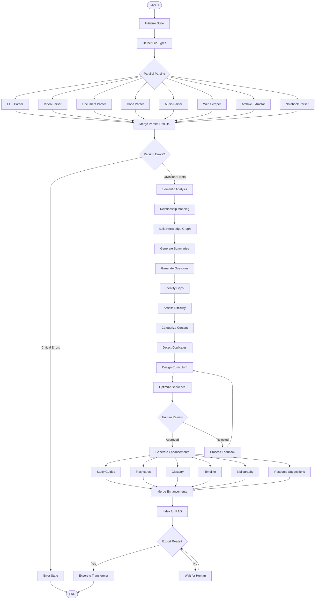

# CourseIngester - Workflow Orchestration

## Overview

CourseIngester uses **LangGraph** for workflow orchestration, managing the complex multi-agent pipeline from initial upload through final export. LangGraph provides state management, conditional routing, and error handling for the ingestion workflow.

**Design Philosophy**: Orchestration as a state machine. Each agent reads from and writes to shared state, with LangGraph managing transitions and ensuring data consistency.

---

## State Schema

### Core State Definition

```python
from typing import TypedDict, List, Dict, Optional, Literal
from datetime import datetime

class IngestionState(TypedDict):
    """Complete state for the ingestion workflow"""
    
    # ===== Input =====
    uploaded_files: List[str]  # Paths to uploaded files
    upload_timestamp: datetime
    ingestion_mode: Literal["quick", "standard", "deep"]
    user_id: str
    session_id: str
    
    # ===== Parsing =====
    parsed_documents: List[Dict]  # List of ParsedDocument objects
    parsing_errors: List[Dict]  # Files that failed to parse
    parsing_progress: float  # 0.0 to 1.0
    extracted_images: List[str]  # Paths to extracted images
    extracted_tables: List[Dict]
    extracted_code: List[Dict]
    
    # ===== Understanding =====
    extracted_concepts: List[str]  # List of concept names
    concept_details: Dict[str, Dict]  # Concept → {importance, definition, etc.}
    knowledge_graph: Dict  # NetworkX graph serialized to dict
    document_summaries: Dict[str, str]  # document_id → summary
    topics: List[Dict]  # Topic modeling results
    entities: Dict[str, List[str]]  # Entity type → list of entities
    questions: List[Dict]  # Generated questions
    gaps: Dict  # Gap analysis results
    difficulty_scores: Dict[str, float]  # document_id → difficulty score
    
    # ===== Organization =====
    categorized_content: Dict[str, List[str]]  # category → list of document_ids
    proposed_structure: Dict  # Proposed curriculum structure
    proposed_modules: List[Dict]  # List of Module objects
    proposed_tracks: List[Dict]  # List of Track objects
    learning_paths: List[Dict]  # List of LearningPath objects
    duplicates_found: List[Dict]  # Duplicate detection results
    optimized_sequence: List[str]  # Ordered list of module IDs
    
    # ===== Enhancement =====
    study_guides: Dict[str, str]  # module_id → study guide content
    flashcard_decks: Dict[str, List[Dict]]  # module_id → list of flashcards
    glossary: Dict[str, str]  # term → definition
    timelines: List[Dict]  # Generated timelines
    bibliography: Dict  # Organized bibliography
    resource_suggestions: Dict[str, List[Dict]]  # module_id → list of resources
    
    # ===== RAG =====
    vector_db_ready: bool
    total_chunks: int
    indexed_documents: List[str]  # document_ids that have been indexed
    
    # ===== Human-in-Loop =====
    human_review_required: bool
    human_approved: bool
    human_feedback: Optional[str]
    human_changes: Optional[Dict]  # Changes made by human
    review_timestamp: Optional[datetime]
    
    # ===== Export =====
    export_ready: bool
    export_path: Optional[str]
    export_format: Optional[str]
    export_timestamp: Optional[datetime]
    
    # ===== Workflow Control =====
    current_stage: Literal[
        "upload", "parsing", "understanding", "organization", 
        "human_review", "enhancement", "rag_indexing", "export", "complete"
    ]
    workflow_status: Literal["running", "paused", "error", "complete"]
    error_message: Optional[str]
    warnings: List[str]
    
    # ===== Metadata =====
    workflow_id: str
    created_at: datetime
    updated_at: datetime
    total_processing_time: float  # seconds
```

### State Update Pattern

```python
from langgraph.graph import StateGraph

def update_state(state: IngestionState, updates: Dict) -> IngestionState:
    """Update state with new values"""
    return {**state, **updates, 'updated_at': datetime.now()}

# Example usage in an agent
def parse_documents(state: IngestionState) -> IngestionState:
    """Parse uploaded documents"""
    parsed = []
    errors = []
    
    for file_path in state['uploaded_files']:
        try:
            parsed_doc = parse_file(file_path)
            parsed.append(parsed_doc)
        except Exception as e:
            errors.append({'file': file_path, 'error': str(e)})
    
    # Update state
    return update_state(state, {
        'parsed_documents': parsed,
        'parsing_errors': errors,
        'parsing_progress': 1.0,
        'current_stage': 'understanding'
    })
```

---

## Workflow Graph

### Graph Structure (Mermaid)



### LangGraph Implementation

```python
from langgraph.graph import StateGraph, END
from langgraph.checkpoint import MemorySaver

# Create graph
workflow = StateGraph(IngestionState)

# Add nodes (agents)
workflow.add_node("initialize", initialize_state)
workflow.add_node("detect_types", detect_file_types)
workflow.add_node("parse_documents", parse_documents_parallel)
workflow.add_node("semantic_analysis", semantic_analysis_agent)
workflow.add_node("build_kg", knowledge_graph_builder)
workflow.add_node("generate_summaries", summarization_agent)
workflow.add_node("categorize", content_categorizer)
workflow.add_node("design_curriculum", curriculum_architect)
workflow.add_node("human_review", wait_for_human_review)
workflow.add_node("generate_enhancements", enhancement_pipeline)
workflow.add_node("index_rag", rag_indexer)
workflow.add_node("export", export_to_transformer)

# Add edges (transitions)
workflow.add_edge("initialize", "detect_types")
workflow.add_edge("detect_types", "parse_documents")
workflow.add_edge("parse_documents", "semantic_analysis")
workflow.add_edge("semantic_analysis", "build_kg")
workflow.add_edge("build_kg", "generate_summaries")
workflow.add_edge("generate_summaries", "categorize")
workflow.add_edge("categorize", "design_curriculum")

# Conditional edge for human review
workflow.add_conditional_edges(
    "design_curriculum",
    should_continue_to_human_review,
    {
        "human_review": "human_review",
        "enhancements": "generate_enhancements"
    }
)

# Human review loop
workflow.add_conditional_edges(
    "human_review",
    check_human_approval,
    {
        "approved": "generate_enhancements",
        "rejected": "design_curriculum",
        "waiting": "human_review"
    }
)

workflow.add_edge("generate_enhancements", "index_rag")
workflow.add_edge("index_rag", "export")
workflow.add_edge("export", END)

# Set entry point
workflow.set_entry_point("initialize")

# Compile graph with checkpointing
memory = MemorySaver()
app = workflow.compile(checkpointer=memory)
```

---

## Ingestion Modes

### Mode Definitions

```python
INGESTION_MODES = {
    "quick": {
        "parse_only": True,
        "enable_ocr": False,
        "enable_transcription": False,
        "semantic_analysis": "basic",
        "build_knowledge_graph": False,
        "generate_summaries": False,
        "organize": "simple",
        "enhancements": [],
        "rag_indexing": False,
        "estimated_time": "5-10 minutes"
    },
    
    "standard": {
        "parse_only": False,
        "enable_ocr": True,
        "enable_transcription": True,
        "semantic_analysis": "full",
        "build_knowledge_graph": True,
        "generate_summaries": True,
        "organize": "smart",
        "enhancements": ["study_guides", "glossary", "flashcards"],
        "rag_indexing": True,
        "estimated_time": "20-30 minutes"
    },
    
    "deep": {
        "parse_only": False,
        "enable_ocr": True,
        "enable_transcription": True,
        "semantic_analysis": "comprehensive",
        "build_knowledge_graph": True,
        "generate_summaries": True,
        "organize": "optimal",
        "enhancements": ["study_guides", "flashcards", "glossary", 
                        "timeline", "bibliography", "resources"],
        "rag_indexing": True,
        "gap_analysis": True,
        "estimated_time": "45-60 minutes"
    }
}
```

### Mode-Specific Routing

```python
def route_by_mode(state: IngestionState) -> str:
    """Conditional routing based on ingestion mode"""
    mode_config = INGESTION_MODES[state['ingestion_mode']]
    
    if mode_config['parse_only']:
        return "export"  # Skip understanding and organization
    
    if not mode_config['build_knowledge_graph']:
        return "categorize"  # Skip KG building
    
    return "semantic_analysis"  # Full pipeline
```

---

## Parallel Processing

### Concurrent Parsing

```python
from concurrent.futures import ThreadPoolExecutor, as_completed

def parse_documents_parallel(state: IngestionState) -> IngestionState:
    """Parse multiple documents in parallel"""
    
    # Group files by type
    file_groups = group_by_type(state['uploaded_files'])
    
    parsed_documents = []
    parsing_errors = []
    
    # Parse each group in parallel
    with ThreadPoolExecutor(max_workers=8) as executor:
        futures = {}
        
        for file_type, files in file_groups.items():
            parser = get_parser_for_type(file_type)
            for file_path in files:
                future = executor.submit(parser.parse, file_path)
                futures[future] = file_path
        
        # Collect results as they complete
        for future in as_completed(futures):
            file_path = futures[future]
            try:
                parsed = future.result()
                parsed_documents.append(parsed)
            except Exception as e:
                parsing_errors.append({
                    'file': file_path,
                    'error': str(e)
                })
    
    return update_state(state, {
        'parsed_documents': parsed_documents,
        'parsing_errors': parsing_errors,
        'current_stage': 'understanding'
    })
```

### Concurrent Enhancement Generation

```python
def generate_enhancements_parallel(state: IngestionState) -> IngestionState:
    """Generate all enhancements in parallel"""
    
    mode_config = INGESTION_MODES[state['ingestion_mode']]
    enhancements = mode_config['enhancements']
    
    results = {}
    
    with ThreadPoolExecutor(max_workers=6) as executor:
        futures = {}
        
        if 'study_guides' in enhancements:
            futures['study_guides'] = executor.submit(
                generate_study_guides, state['proposed_modules']
            )
        
        if 'flashcards' in enhancements:
            futures['flashcards'] = executor.submit(
                generate_flashcards, state['parsed_documents']
            )
        
        if 'glossary' in enhancements:
            futures['glossary'] = executor.submit(
                generate_glossary, state['extracted_concepts']
            )
        
        # Collect results
        for key, future in futures.items():
            results[key] = future.result()
    
    return update_state(state, results)
```

---

## Human-in-Loop Integration

### Waiting for Human Review

```python
def wait_for_human_review(state: IngestionState) -> IngestionState:
    """Pause workflow for human review"""
    
    # Mark as requiring human review
    state = update_state(state, {
        'human_review_required': True,
        'current_stage': 'human_review',
        'workflow_status': 'paused'
    })
    
    # Send notification to user
    notify_user(state['user_id'], "Review Required", 
                "Your curriculum structure is ready for review")
    
    return state

def check_human_approval(state: IngestionState) -> str:
    """Check if human has approved or rejected"""
    
    if state['human_approved']:
        return "approved"
    elif state['human_feedback']:
        return "rejected"
    else:
        return "waiting"  # Still waiting for review
```

### Processing Human Feedback

```python
def process_human_feedback(state: IngestionState) -> IngestionState:
    """Incorporate human feedback into re-organization"""
    
    feedback = state['human_feedback']
    changes = state['human_changes']
    
    # Apply manual changes
    if changes:
        state['proposed_structure'] = apply_changes(
            state['proposed_structure'], 
            changes
        )
    
    # Re-organize based on feedback
    if feedback:
        reorganized = reorganize_with_feedback(
            state['proposed_structure'],
            feedback
        )
        state['proposed_structure'] = reorganized
    
    # Reset approval flags
    return update_state(state, {
        'human_approved': False,
        'human_feedback': None,
        'human_changes': None,
        'current_stage': 'organization'
    })
```

---

## Error Handling

### Error Recovery

```python
def handle_parsing_error(state: IngestionState) -> IngestionState:
    """Handle errors during parsing"""
    
    critical_errors = [
        err for err in state['parsing_errors']
        if err.get('critical', False)
    ]
    
    if len(critical_errors) > len(state['uploaded_files']) * 0.5:
        # More than 50% failed - critical error
        return update_state(state, {
            'workflow_status': 'error',
            'error_message': f"Failed to parse {len(critical_errors)} files",
            'current_stage': 'error'
        })
    else:
        # Continue with successfully parsed files
        return update_state(state, {
            'warnings': [f"Failed to parse {len(state['parsing_errors'])} files"],
            'current_stage': 'understanding'
        })
```

### Retry Logic

```python
from tenacity import retry, stop_after_attempt, wait_exponential

@retry(stop=stop_after_attempt(3), wait=wait_exponential(multiplier=1, min=4, max=10))
def parse_with_retry(file_path: str):
    """Parse file with automatic retry on failure"""
    return parse_file(file_path)
```

---

## Checkpointing & Resume

### Save Checkpoints

```python
# LangGraph automatically saves checkpoints with MemorySaver
# Checkpoints are saved after each node execution

# To resume from a checkpoint:
config = {"configurable": {"thread_id": state['session_id']}}

# Get current state
current_state = app.get_state(config)

# Resume workflow
for output in app.stream(None, config):
    print(output)
```

### Manual Checkpoint Save

```python
def save_checkpoint(state: IngestionState):
    """Manually save workflow state"""
    checkpoint_data = {
        'state': state,
        'timestamp': datetime.now(),
        'workflow_id': state['workflow_id']
    }
    
    with open(f"checkpoints/{state['workflow_id']}.json", 'w') as f:
        json.dump(checkpoint_data, f, default=str)

def load_checkpoint(workflow_id: str) -> IngestionState:
    """Load workflow state from checkpoint"""
    with open(f"checkpoints/{workflow_id}.json", 'r') as f:
        checkpoint_data = json.load(f)
    
    return checkpoint_data['state']
```

---

## Workflow Execution

### Running the Workflow

```python
def run_ingestion(uploaded_files: List[str], mode: str, user_id: str):
    """Execute the ingestion workflow"""
    
    # Initialize state
    initial_state = {
        'uploaded_files': uploaded_files,
        'upload_timestamp': datetime.now(),
        'ingestion_mode': mode,
        'user_id': user_id,
        'session_id': generate_session_id(),
        'workflow_id': generate_workflow_id(),
        'current_stage': 'upload',
        'workflow_status': 'running',
        'created_at': datetime.now(),
        'updated_at': datetime.now()
    }
    
    # Configure thread
    config = {"configurable": {"thread_id": initial_state['session_id']}}
    
    # Run workflow
    for output in app.stream(initial_state, config):
        # Output is emitted after each node
        print(f"Stage: {output['current_stage']}")
        
        # Update UI with progress
        update_progress_ui(output)
        
        # Check for errors
        if output['workflow_status'] == 'error':
            handle_error(output['error_message'])
            break
        
        # Check for human review required
        if output.get('human_review_required'):
            notify_human_review_needed(output)
            break
    
    return output
```

### Streaming Updates

```python
import asyncio

async def stream_ingestion(uploaded_files, mode, user_id):
    """Stream workflow updates to UI in real-time"""
    
    initial_state = create_initial_state(uploaded_files, mode, user_id)
    config = {"configurable": {"thread_id": initial_state['session_id']}}
    
    async for output in app.astream(initial_state, config):
        # Emit update to UI (e.g., via WebSocket)
        await emit_update({
            'stage': output['current_stage'],
            'progress': calculate_progress(output),
            'status': output['workflow_status']
        })
```

---

## Monitoring & Logging

### Progress Tracking

```python
def calculate_progress(state: IngestionState) -> float:
    """Calculate overall workflow progress (0.0 to 1.0)"""
    
    stage_weights = {
        'upload': 0.05,
        'parsing': 0.15,
        'understanding': 0.25,
        'organization': 0.20,
        'human_review': 0.10,
        'enhancement': 0.15,
        'rag_indexing': 0.05,
        'export': 0.05
    }
    
    stage_order = list(stage_weights.keys())
    current_stage = state['current_stage']
    
    if current_stage not in stage_order:
        return 0.0
    
    current_idx = stage_order.index(current_stage)
    completed_weight = sum(
        stage_weights[stage] 
        for stage in stage_order[:current_idx]
    )
    
    return completed_weight
```

### Logging

```python
import logging

logging.basicConfig(level=logging.INFO)
logger = logging.getLogger("CourseIngester")

def log_workflow_event(state: IngestionState, event: str):
    """Log workflow events"""
    logger.info(f"[{state['workflow_id']}] {event} at stage {state['current_stage']}")

# Usage in nodes
def semantic_analysis_agent(state: IngestionState) -> IngestionState:
    log_workflow_event(state, "Starting semantic analysis")
    
    # ... analysis logic ...
    
    log_workflow_event(state, f"Extracted {len(concepts)} concepts")
    
    return update_state(state, {'extracted_concepts': concepts})
```

---

## Configuration

### Workflow Configuration

```yaml
workflow:
  # Execution
  max_workers: 8  # For parallel processing
  timeout_seconds: 3600  # 1 hour max
  checkpoint_interval: 300  # Save checkpoint every 5 minutes
  
  # Retry
  max_retries: 3
  retry_delay: 5  # seconds
  
  # Human-in-Loop
  review_timeout: 86400  # 24 hours to review before timeout
  auto_approve: false  # Never auto-approve
  
  # Error Handling
  continue_on_error: true
  error_threshold: 0.5  # Stop if >50% of files fail
  
  # Modes
  default_mode: "standard"
  
  # Notifications
  notify_on_review: true
  notify_on_complete: true
  notify_on_error: true
```

---

**Document Version**: 1.0  
**Last Updated**: January 2026  
**Status**: Design Specification (Not Implemented)
