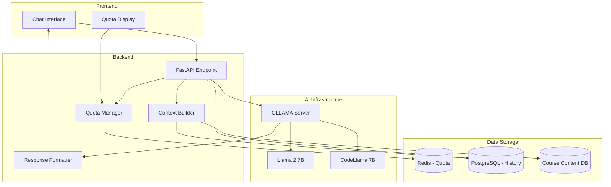

# AI Tutor System

## Overview

The AI Tutor is a context-aware, OLLAMA-powered learning assistant integrated into CoursePlayerApp. It provides personalized help to students with tier-based quota management, ensuring Basic users are encouraged to upgrade while Intermediate and Advanced users get valuable AI assistance.

---

## Architecture



---

## Tier-Based Access

### Basic Tier
- **Access**: ❌ Not available
- **Message**: "Unlock AI Tutor with Intermediate tier!"
- **UI**: Shows locked state with upgrade prompt

### Intermediate Tier
- **Access**: ✅ Available
- **Quota**: 50 questions/month
- **Model**: Llama 2 7B
- **Context Window**: 4K tokens
- **Features**:
  - Context-aware responses
  - Code assistance (explain, debug)
  - Concept clarification
  - Practice problem suggestions
  - Conversation history (per course)

### Advanced Tier
- **Access**: ✅ Unlimited
- **Quota**: Unlimited questions
- **Model**: Llama 2 7B or CodeLlama 7B (user choice)
- **Context Window**: 8K tokens
- **Features**:
  - All Intermediate features
  - Priority response generation
  - Advanced code generation
  - Project feedback
  - Personalized learning paths
  - Extended conversation history

---

## OLLAMA Configuration

### Installation

```bash
# Install OLLAMA
curl https://ollama.ai/install.sh | sh

# Pull models
ollama pull llama2:7b
ollama pull codellama:7b

# Start OLLAMA server
ollama serve
```

### Model Configuration

```yaml
# config/ollama.yaml
models:
  default:
    name: llama2:7b
    temperature: 0.7
    max_tokens: 500
    top_p: 0.9
    frequency_penalty: 0.0
    presence_penalty: 0.0
  
  code_assistant:
    name: codellama:7b
    temperature: 0.3
    max_tokens: 800
    top_p: 0.95
    frequency_penalty: 0.1
    presence_penalty: 0.1

system_prompts:
  general: |
    You are a helpful AI tutor for data science courses. 
    You provide clear, concise explanations that encourage learning.
    Never give complete solutions - guide students to discover answers.
    Reference course materials when available.
    Use examples and analogies to clarify concepts.
  
  code_assistant: |
    You are a code assistant for data science students.
    Help debug code, explain functions, and suggest improvements.
    Always explain WHY something works or doesn't work.
    Encourage best practices and clean code.
```

---

## Implementation

### Backend Service

```python
from typing import Dict, List, Optional
import httpx
from datetime import datetime
from pydantic import BaseModel

class AITutorService:
    """AI Tutor service using OLLAMA."""
    
    def __init__(
        self,
        ollama_url: str = "http://localhost:11434",
        redis_client = None,
        db_session = None
    ):
        self.ollama_url = ollama_url
        self.redis = redis_client
        self.db = db_session
        self.client = httpx.AsyncClient(timeout=60.0)
    
    async def ask_question(
        self,
        user_id: str,
        user_tier: str,
        question: str,
        course_id: str,
        lesson_id: str,
        conversation_history: Optional[List[Dict]] = None
    ) -> Dict:
        """
        Process a student question through the AI tutor.
        
        Args:
            user_id: User identifier
            user_tier: User's subscription tier
            question: Student's question
            course_id: Current course
            lesson_id: Current lesson
            conversation_history: Previous messages in conversation
            
        Returns:
            Dict with answer, citations, quota info
        """
        # Check if tier allows AI tutor
        if user_tier == "basic":
            return {
                "error": "access_denied",
                "message": "AI Tutor is available starting with Intermediate tier. Upgrade to unlock!",
                "upgrade_url": "/pricing"
            }
        
        # Check quota (for Intermediate tier)
        if user_tier == "intermediate":
            quota_available = await self._check_quota(user_id)
            if not quota_available:
                return {
                    "error": "quota_exceeded",
                    "message": "You've used all 50 questions this month. Upgrade to Advanced for unlimited questions!",
                    "quota": await self._get_quota_info(user_id),
                    "upgrade_url": "/pricing"
                }
        
        # Build context
        context = await self._build_context(
            course_id,
            lesson_id,
            conversation_history or []
        )
        
        # Select model based on question type
        model = self._select_model(question, user_tier)
        
        # Generate response
        response = await self._generate_response(
            question=question,
            context=context,
            model=model,
            user_tier=user_tier
        )
        
        # Consume quota
        if user_tier == "intermediate":
            await self._consume_quota(user_id)
        
        # Save to history
        await self._save_conversation(
            user_id,
            course_id,
            question,
            response["answer"]
        )
        
        # Track usage
        await self._track_usage(user_id, user_tier, model, question)
        
        return {
            "answer": response["answer"],
            "citations": response.get("citations", []),
            "model_used": model,
            "quota": await self._get_quota_info(user_id) if user_tier == "intermediate" else None
        }
    
    async def _check_quota(self, user_id: str) -> bool:
        """Check if user has quota remaining."""
        month_key = datetime.now().strftime("%Y-%m")
        redis_key = f"ai_quota:{user_id}:{month_key}"
        
        used = int(self.redis.get(redis_key) or 0)
        return used < 50
    
    async def _consume_quota(self, user_id: str):
        """Consume one question from quota."""
        month_key = datetime.now().strftime("%Y-%m")
        redis_key = f"ai_quota:{user_id}:{month_key}"
        
        self.redis.incr(redis_key)
        self.redis.expire(redis_key, 60 * 24 * 60 * 60)  # 60 days
    
    async def _get_quota_info(self, user_id: str) -> Dict:
        """Get quota information for user."""
        month_key = datetime.now().strftime("%Y-%m")
        redis_key = f"ai_quota:{user_id}:{month_key}"
        
        used = int(self.redis.get(redis_key) or 0)
        
        # Calculate reset date
        today = datetime.now()
        if today.month == 12:
            reset_date = datetime(today.year + 1, 1, 1)
        else:
            reset_date = datetime(today.year, today.month + 1, 1)
        
        return {
            "limit": 50,
            "used": used,
            "remaining": max(0, 50 - used),
            "reset_date": reset_date.isoformat()
        }
    
    async def _build_context(
        self,
        course_id: str,
        lesson_id: str,
        conversation_history: List[Dict]
    ) -> str:
        """Build context for AI from course content and conversation."""
        
        # Get lesson content
        lesson = self.db.query(Lesson).filter(
            Lesson.course_id == course_id,
            Lesson.id == lesson_id
        ).first()
        
        context_parts = []
        
        # Add course info
        context_parts.append(f"Course: {lesson.course.title}")
        context_parts.append(f"Lesson: {lesson.title}")
        
        # Add lesson content (summary)
        if lesson.content:
            # Truncate to first 1000 chars to save context window
            content_summary = lesson.content[:1000]
            context_parts.append(f"Lesson Content:\n{content_summary}")
        
        # Add transcript if available
        if lesson.transcript_text:
            transcript_summary = lesson.transcript_text[:500]
            context_parts.append(f"Video Transcript:\n{transcript_summary}")
        
        # Add conversation history (last 5 exchanges)
        if conversation_history:
            recent_history = conversation_history[-5:]
            history_text = "\n".join([
                f"{'Student' if msg['role'] == 'user' else 'AI'}: {msg['content']}"
                for msg in recent_history
            ])
            context_parts.append(f"Conversation History:\n{history_text}")
        
        return "\n\n".join(context_parts)
    
    def _select_model(self, question: str, user_tier: str) -> str:
        """Select appropriate model based on question type."""
        
        # Code-related keywords
        code_keywords = [
            'code', 'function', 'error', 'debug', 'syntax',
            'implement', 'write', 'script', 'program'
        ]
        
        question_lower = question.lower()
        is_code_question = any(kw in question_lower for kw in code_keywords)
        
        # Advanced tier can use CodeLlama for code questions
        if user_tier == "advanced" and is_code_question:
            return "codellama:7b"
        
        return "llama2:7b"
    
    async def _generate_response(
        self,
        question: str,
        context: str,
        model: str,
        user_tier: str
    ) -> Dict:
        """Generate AI response using OLLAMA."""
        
        # Build system prompt
        if "code" in model:
            system_prompt = """You are a code assistant for data science students.
Help debug code, explain functions, and suggest improvements.
Always explain WHY something works or doesn't work.
Encourage best practices and clean code.
Never give complete solutions - guide students to discover answers."""
        else:
            system_prompt = """You are a helpful AI tutor for data science courses.
You provide clear, concise explanations that encourage learning.
Never give complete solutions - guide students to discover answers.
Reference course materials when available.
Use examples and analogies to clarify concepts."""
        
        # Build prompt
        prompt = f"""{system_prompt}

Context:
{context}

Student Question: {question}

Provide a helpful answer that:
1. Directly addresses the question
2. References the course materials if relevant
3. Encourages the student to think critically
4. Is concise but thorough (aim for 150-300 words)

Answer:"""
        
        # Adjust max tokens based on tier
        max_tokens = 800 if user_tier == "advanced" else 500
        
        # Call OLLAMA API
        try:
            response = await self.client.post(
                f"{self.ollama_url}/api/generate",
                json={
                    "model": model,
                    "prompt": prompt,
                    "stream": False,
                    "options": {
                        "temperature": 0.3 if "code" in model else 0.7,
                        "num_predict": max_tokens,
                        "top_p": 0.9
                    }
                }
            )
            
            result = response.json()
            answer = result.get("response", "")
            
            # Extract citations (simple implementation)
            citations = self._extract_citations(context, answer)
            
            return {
                "answer": answer.strip(),
                "citations": citations
            }
            
        except Exception as e:
            logger.error(f"OLLAMA API error: {e}")
            return {
                "answer": "I'm having trouble processing your question right now. Please try again in a moment.",
                "citations": []
            }
    
    def _extract_citations(self, context: str, answer: str) -> List[str]:
        """Extract citations from context that appear in answer."""
        citations = []
        
        # Simple citation extraction - look for course/lesson mentions
        if "Course:" in context and "Course:" in answer:
            citations.append("Course materials")
        
        if "Lesson:" in context and "lesson" in answer.lower():
            citations.append("Current lesson")
        
        if "Video Transcript:" in context and ("video" in answer.lower() or "transcript" in answer.lower()):
            citations.append("Video transcript")
        
        return citations
    
    async def _save_conversation(
        self,
        user_id: str,
        course_id: str,
        question: str,
        answer: str
    ):
        """Save conversation to database."""
        
        conversation = Conversation(
            user_id=user_id,
            course_id=course_id,
            question=question,
            answer=answer,
            created_at=datetime.utcnow()
        )
        
        self.db.add(conversation)
        self.db.commit()
    
    async def _track_usage(
        self,
        user_id: str,
        user_tier: str,
        model: str,
        question: str
    ):
        """Track AI tutor usage for analytics."""
        
        usage = AITutorUsage(
            user_id=user_id,
            tier=user_tier,
            model=model,
            question_length=len(question),
            timestamp=datetime.utcnow()
        )
        
        self.db.add(usage)
        self.db.commit()
```

### API Endpoints

```python
from fastapi import APIRouter, Depends, HTTPException
from pydantic import BaseModel

router = APIRouter()

class AskQuestionRequest(BaseModel):
    question: str
    course_id: str
    lesson_id: str
    conversation_history: Optional[List[Dict]] = None

@router.post("/api/ai-tutor/ask")
async def ask_ai_tutor(
    request: AskQuestionRequest,
    current_user: User = Depends(get_current_user),
    ai_tutor: AITutorService = Depends(get_ai_tutor_service)
):
    """Ask a question to the AI tutor."""
    
    result = await ai_tutor.ask_question(
        user_id=current_user.id,
        user_tier=current_user.tier,
        question=request.question,
        course_id=request.course_id,
        lesson_id=request.lesson_id,
        conversation_history=request.conversation_history
    )
    
    if "error" in result:
        status_code = 403 if result["error"] == "access_denied" else 429
        raise HTTPException(status_code=status_code, detail=result["message"])
    
    return result

@router.get("/api/ai-tutor/quota")
async def get_quota(
    current_user: User = Depends(get_current_user),
    ai_tutor: AITutorService = Depends(get_ai_tutor_service)
):
    """Get AI tutor quota information."""
    
    if current_user.tier == "basic":
        return {
            "tier": "basic",
            "access": False,
            "message": "AI Tutor available with Intermediate tier"
        }
    
    if current_user.tier == "advanced":
        return {
            "tier": "advanced",
            "unlimited": True,
            "message": "Unlimited AI Tutor access"
        }
    
    quota_info = await ai_tutor._get_quota_info(current_user.id)
    return {
        "tier": "intermediate",
        "access": True,
        **quota_info
    }

@router.get("/api/ai-tutor/history/{course_id}")
async def get_conversation_history(
    course_id: str,
    current_user: User = Depends(get_current_user),
    limit: int = 50
):
    """Get conversation history for a course."""
    
    conversations = db.query(Conversation).filter(
        Conversation.user_id == current_user.id,
        Conversation.course_id == course_id
    ).order_by(Conversation.created_at.desc()).limit(limit).all()
    
    return {
        "course_id": course_id,
        "conversations": [
            {
                "question": conv.question,
                "answer": conv.answer,
                "timestamp": conv.created_at.isoformat()
            }
            for conv in conversations
        ]
    }
```

---

## Frontend Integration

### React Component

```tsx
import React, { useState, useEffect, useRef } from 'react';
import ReactMarkdown from 'react-markdown';
import { Prism as SyntaxHighlighter } from 'react-syntax-highlighter';

interface AITutorProps {
  userTier: 'basic' | 'intermediate' | 'advanced';
  courseId: string;
  lessonId: string;
}

interface Message {
  role: 'user' | 'assistant';
  content: string;
  timestamp: Date;
  citations?: string[];
}

const AITutor: React.FC<AITutorProps> = ({ userTier, courseId, lessonId }) => {
  const [messages, setMessages] = useState<Message[]>([]);
  const [inputText, setInputText] = useState('');
  const [isLoading, setIsLoading] = useState(false);
  const [quota, setQuota] = useState<any>(null);
  const messagesEndRef = useRef<HTMLDivElement>(null);
  
  const canUseAITutor = userTier !== 'basic';
  
  useEffect(() => {
    if (canUseAITutor) {
      fetchQuota();
      loadConversationHistory();
    }
  }, [courseId]);
  
  useEffect(() => {
    scrollToBottom();
  }, [messages]);
  
  const fetchQuota = async () => {
    const response = await fetch('/api/ai-tutor/quota', {
      headers: { 'Authorization': `Bearer ${getToken()}` }
    });
    const data = await response.json();
    setQuota(data);
  };
  
  const loadConversationHistory = async () => {
    const response = await fetch(`/api/ai-tutor/history/${courseId}`, {
      headers: { 'Authorization': `Bearer ${getToken()}` }
    });
    const data = await response.json();
    
    // Convert to Message format
    const history: Message[] = data.conversations.slice(0, 10).reverse().map((conv: any) => ([
      {
        role: 'user' as const,
        content: conv.question,
        timestamp: new Date(conv.timestamp)
      },
      {
        role: 'assistant' as const,
        content: conv.answer,
        timestamp: new Date(conv.timestamp)
      }
    ])).flat();
    
    setMessages(history);
  };
  
  const scrollToBottom = () => {
    messagesEndRef.current?.scrollIntoView({ behavior: 'smooth' });
  };
  
  const sendMessage = async () => {
    if (!inputText.trim() || !canUseAITutor || isLoading) return;
    
    // Add user message
    const userMessage: Message = {
      role: 'user',
      content: inputText,
      timestamp: new Date()
    };
    
    setMessages(prev => [...prev, userMessage]);
    setInputText('');
    setIsLoading(true);
    
    try {
      const response = await fetch('/api/ai-tutor/ask', {
        method: 'POST',
        headers: {
          'Content-Type': 'application/json',
          'Authorization': `Bearer ${getToken()}`
        },
        body: JSON.stringify({
          question: inputText,
          course_id: courseId,
          lesson_id: lessonId,
          conversation_history: messages.slice(-10)  // Last 5 exchanges
        })
      });
      
      if (!response.ok) {
        const error = await response.json();
        throw new Error(error.detail);
      }
      
      const data = await response.json();
      
      // Add assistant response
      const assistantMessage: Message = {
        role: 'assistant',
        content: data.answer,
        timestamp: new Date(),
        citations: data.citations
      };
      
      setMessages(prev => [...prev, assistantMessage]);
      
      // Update quota
      if (data.quota) {
        setQuota(data.quota);
      }
      
    } catch (error: any) {
      console.error('AI Tutor error:', error);
      alert(error.message || 'Failed to get response. Please try again.');
    } finally {
      setIsLoading(false);
    }
  };
  
  if (!canUseAITutor) {
    return (
      <div className="ai-tutor-locked">
        <div className="lock-icon">🤖</div>
        <h3>AI Tutor</h3>
        <p>Get instant answers to your questions!</p>
        <ul>
          <li>✓ Context-aware assistance</li>
          <li>✓ Code debugging help</li>
          <li>✓ Concept clarification</li>
          <li>✓ Practice problem generation</li>
        </ul>
        <p className="pricing">
          <strong>Intermediate:</strong> 50 questions/month<br />
          <strong>Advanced:</strong> Unlimited questions
        </p>
        <button className="upgrade-btn">
          Unlock AI Tutor →
        </button>
      </div>
    );
  }
  
  return (
    <div className="ai-tutor">
      <div className="ai-tutor-header">
        <h3>🤖 AI Tutor</h3>
        <div className="quota-display">
          {quota?.unlimited ? (
            <span className="unlimited">✨ Unlimited</span>
          ) : quota ? (
            <span className={quota.remaining <= 5 ? 'low-quota' : ''}>
              {quota.remaining}/{quota.limit} questions left
            </span>
          ) : null}
        </div>
      </div>
      
      <div className="messages-container">
        {messages.length === 0 && (
          <div className="welcome-message">
            <p>👋 Hi! I'm your AI tutor. Ask me anything about this lesson!</p>
            <div className="example-questions">
              <p>Try asking:</p>
              <button onClick={() => setInputText("Can you explain this concept in simpler terms?")}>
                Explain this concept
              </button>
              <button onClick={() => setInputText("Why is my code not working?")}>
                Debug my code
              </button>
              <button onClick={() => setInputText("Can you give me a practice problem?")}>
                Practice problem
              </button>
            </div>
          </div>
        )}
        
        {messages.map((message, index) => (
          <div key={index} className={`message message-${message.role}`}>
            <div className="message-avatar">
              {message.role === 'user' ? '👤' : '🤖'}
            </div>
            <div className="message-content">
              <ReactMarkdown
                components={{
                  code({ node, inline, className, children, ...props }) {
                    const match = /language-(\w+)/.exec(className || '');
                    return !inline && match ? (
                      <SyntaxHighlighter language={match[1]} PreTag="div">
                        {String(children).replace(/\n$/, '')}
                      </SyntaxHighlighter>
                    ) : (
                      <code className={className} {...props}>
                        {children}
                      </code>
                    );
                  }
                }}
              >
                {message.content}
              </ReactMarkdown>
              
              {message.citations && message.citations.length > 0 && (
                <div className="citations">
                  <small>📚 References: {message.citations.join(', ')}</small>
                </div>
              )}
              
              <div className="message-timestamp">
                {message.timestamp.toLocaleTimeString()}
              </div>
            </div>
          </div>
        ))}
        
        {isLoading && (
          <div className="message message-assistant">
            <div className="message-avatar">🤖</div>
            <div className="message-content">
              <div className="typing-indicator">
                <span></span><span></span><span></span>
              </div>
            </div>
          </div>
        )}
        
        <div ref={messagesEndRef} />
      </div>
      
      <div className="input-container">
        <input
          type="text"
          value={inputText}
          onChange={(e) => setInputText(e.target.value)}
          onKeyPress={(e) => e.key === 'Enter' && sendMessage()}
          placeholder="Ask a question..."
          disabled={isLoading || (quota && quota.remaining <= 0)}
          maxLength={500}
        />
        <button
          onClick={sendMessage}
          disabled={isLoading || !inputText.trim() || (quota && quota.remaining <= 0)}
        >
          {isLoading ? '...' : 'Send ↗'}
        </button>
      </div>
      
      {quota && quota.remaining <= 5 && quota.remaining > 0 && (
        <div className="quota-warning">
          ⚠️ Only {quota.remaining} questions remaining this month. 
          <a href="/pricing">Upgrade to Advanced</a> for unlimited access.
        </div>
      )}
      
      {quota && quota.remaining === 0 && (
        <div className="quota-exceeded">
          🚫 You've used all your questions for this month. 
          Resets on {new Date(quota.reset_date).toLocaleDateString()}.
          <a href="/pricing">Upgrade to Advanced</a> for unlimited access.
        </div>
      )}
    </div>
  );
};

export default AITutor;
```

---

## Question Types & Examples

### 1. Concept Clarification
**Student**: "What is a p-value?"
**AI Response**:
```
A p-value is a measure in statistics that helps you determine the strength of
your evidence against the null hypothesis. Think of it as a way to quantify 
how surprising your results are if the null hypothesis were true.

In simpler terms:
- A small p-value (< 0.05) suggests strong evidence against the null hypothesis
- A large p-value suggests weak evidence against the null hypothesis

For example, if you're testing whether a coin is fair, and you get 90 heads 
out of 100 flips, the p-value tells you how likely this result is if the coin 
really is fair.

📚 References: Current lesson, Statistical Inference course materials
```

### 2. Code Debugging
**Student**: "Why is this code failing? `df.groupby('category').mean()`"
**AI Response**:
```
The error likely occurs because you're trying to calculate the mean of all 
columns, including non-numeric ones. The groupby().mean() operation only 
works on numeric columns.

Here's how to fix it:

Option 1 - Select specific numeric columns:
```python
df.groupby('category')['numeric_column'].mean()
```

Option 2 - Use numeric_only parameter:
```python
df.groupby('category').mean(numeric_only=True)
```

Try one of these approaches and let me know if you still encounter issues!

📚 References: Pandas documentation, Lesson 5 materials
```

### 3. Practice Problem Generation
**Student**: "Can you give me a practice problem on decision trees?"
**AI Response**:
```
Great idea to practice! Here's a problem to work through:

Problem: Customer Churn Prediction
You have a dataset of telecom customers with these features:
- Monthly charges
- Tenure (months as customer)
- Total charges
- Contract type (month-to-month, 1-year, 2-year)
- Customer support calls

Task:
1. Build a decision tree to predict customer churn
2. What would be the likely first split in your tree? Why?
3. How would you prevent overfitting?

Think about:
- Which feature might be most predictive?
- How would contract type affect churn?
- What max_depth would you choose?

Try to solve this conceptually first, then implement it if you'd like!
```

---

## Performance Optimization

### Response Caching

```python
import hashlib
import json

async def get_cached_response(question: str, context: str) -> Optional[str]:
    """Check if similar question was asked recently."""
    
    # Create cache key from question + context hash
    cache_key = hashlib.md5(
        f"{question}:{context}".encode()
    ).hexdigest()
    
    redis_key = f"ai_response:{cache_key}"
    cached = redis.get(redis_key)
    
    if cached:
        return json.loads(cached)
    
    return None

async def cache_response(question: str, context: str, response: Dict):
    """Cache AI response for 1 hour."""
    
    cache_key = hashlib.md5(
        f"{question}:{context}".encode()
    ).hexdigest()
    
    redis_key = f"ai_response:{cache_key}"
    redis.setex(
        redis_key,
        3600,  # 1 hour TTL
        json.dumps(response)
    )
```

### Async Response Streaming

```python
from fastapi.responses import StreamingResponse

@router.post("/api/ai-tutor/ask-stream")
async def ask_ai_tutor_stream(
    request: AskQuestionRequest,
    current_user: User = Depends(get_current_user)
):
    """Stream AI response word-by-word."""
    
    async def generate():
        response = await ollama_client.post(
            f"{ollama_url}/api/generate",
            json={
                "model": "llama2:7b",
                "prompt": prompt,
                "stream": True
            }
        )
        
        async for line in response.aiter_lines():
            data = json.loads(line)
            if "response" in data:
                yield f"data: {json.dumps({'token': data['response']})}\n\n"
    
    return StreamingResponse(generate(), media_type="text/event-stream")
```

---

## Monitoring & Analytics

### Metrics to Track

```python
from prometheus_client import Counter, Histogram, Gauge

# Question volume
ai_questions_total = Counter(
    'ai_tutor_questions_total',
    'Total AI tutor questions',
    ['tier', 'model']
)

# Response latency
ai_response_latency = Histogram(
    'ai_tutor_response_latency_seconds',
    'AI tutor response latency',
    ['model']
)

# Quota usage
ai_quota_usage = Gauge(
    'ai_tutor_quota_usage_percentage',
    'AI tutor quota usage percentage',
    ['user_id']
)

# Question types (classified)
ai_question_types = Counter(
    'ai_tutor_question_types',
    'Question types asked',
    ['type']  # 'concept', 'code', 'practice', 'other'
)
```

### Analytics Dashboard Queries

```sql
-- Most common question topics
SELECT 
    LOWER(question) as question_text,
    COUNT(*) as frequency
FROM conversations
WHERE created_at >= NOW() - INTERVAL '30 days'
GROUP BY LOWER(question)
HAVING COUNT(*) > 5
ORDER BY frequency DESC
LIMIT 20;

-- Average questions per user by tier
SELECT 
    u.tier,
    AVG(question_count) as avg_questions,
    COUNT(DISTINCT u.id) as users
FROM users u
LEFT JOIN (
    SELECT user_id, COUNT(*) as question_count
    FROM conversations
    WHERE created_at >= NOW() - INTERVAL '30 days'
    GROUP BY user_id
) c ON u.id = c.user_id
GROUP BY u.tier;

-- Quota exhaustion rate
SELECT 
    COUNT(DISTINCT user_id) as total_users,
    COUNT(DISTINCT CASE WHEN questions_used >= 50 THEN user_id END) as exhausted_users,
    ROUND(100.0 * COUNT(DISTINCT CASE WHEN questions_used >= 50 THEN user_id END) / COUNT(DISTINCT user_id), 2) as exhaustion_rate
FROM (
    SELECT 
        user_id,
        COUNT(*) as questions_used
    FROM conversations
    WHERE DATE_TRUNC('month', created_at) = DATE_TRUNC('month', NOW())
    GROUP BY user_id
) subq;
```

---

## Cost Optimization

### OLLAMA Hosting Options

**Option 1: Self-Hosted (Recommended)**
- Cost: Server costs only (~$50-100/month for GPU instance)
- Pros: Full control, unlimited usage, data privacy
- Cons: Requires DevOps, GPU management

**Option 2: Cloud GPU (Vast.ai, RunPod)**
- Cost: ~$0.20-0.40/hour
- Pros: Easy scaling, no upfront hardware
- Cons: Usage-based billing

**Option 3: Hybrid (Cache + On-Demand)**
- Cache common questions
- Self-hosted for Intermediate tier
- Cloud GPU for Advanced tier spikes

### Resource Management

```python
# Connection pooling
ollama_pool = httpx.AsyncClient(
    limits=httpx.Limits(
        max_keepalive_connections=20,
        max_connections=100
    )
)

# Request queuing for rate limiting
from asyncio import Queue, Semaphore

request_queue = Queue(maxsize=100)
concurrent_requests = Semaphore(10)  # Max 10 concurrent

async def process_with_queue(request):
    await request_queue.put(request)
    async with concurrent_requests:
        return await generate_response(request)
```

---

## Conclusion

The AI Tutor system provides:

1. **Tier-Appropriate Access** - Locked for Basic, quota for Intermediate, unlimited for Advanced
2. **Context-Aware Assistance** - Knows current lesson and course
3. **Quota Management** - Enforced limits with Redis tracking
4. **Multiple Models** - Llama 2 for general, CodeLlama for code
5. **Conversation History** - Saved per course
6. **Performance Optimization** - Caching, streaming, async
7. **Analytics** - Track usage, optimize prompts

This implementation balances educational value with business goals, encouraging upgrades while providing genuine learning support.
