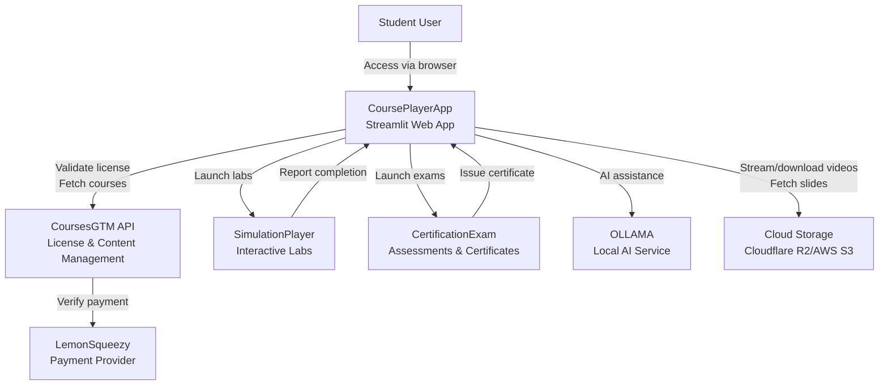
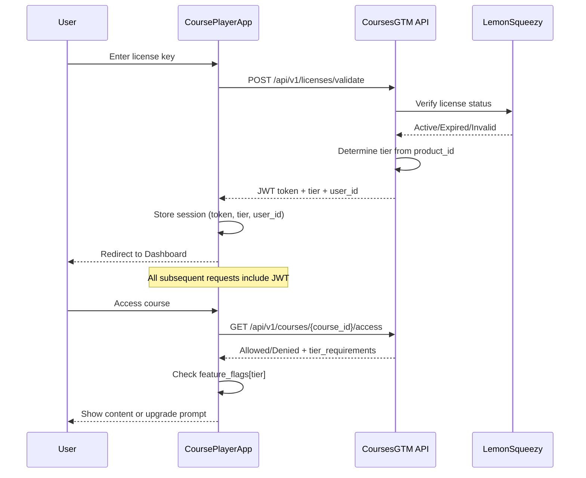
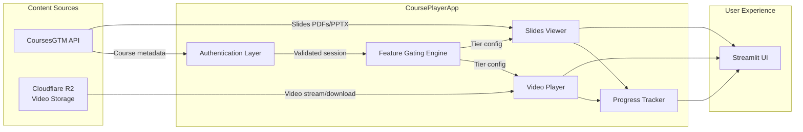
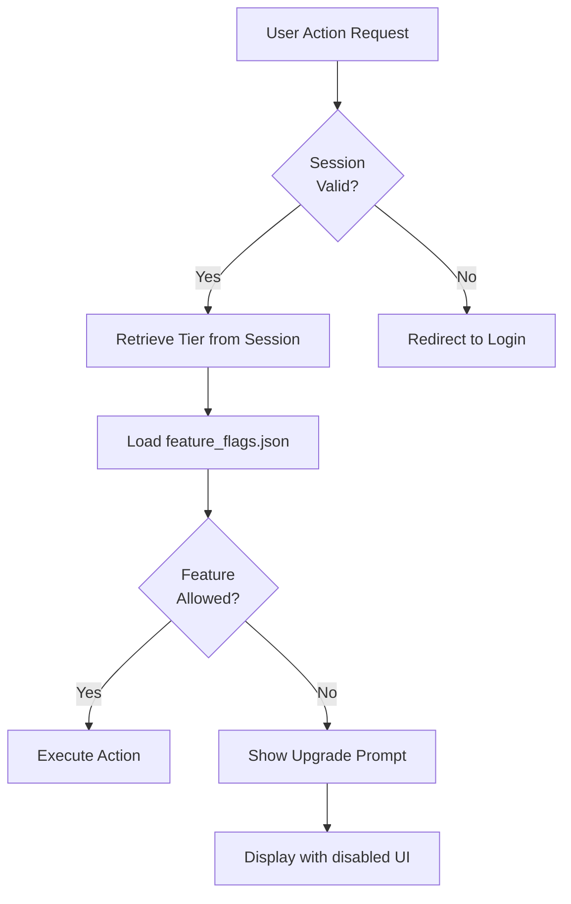
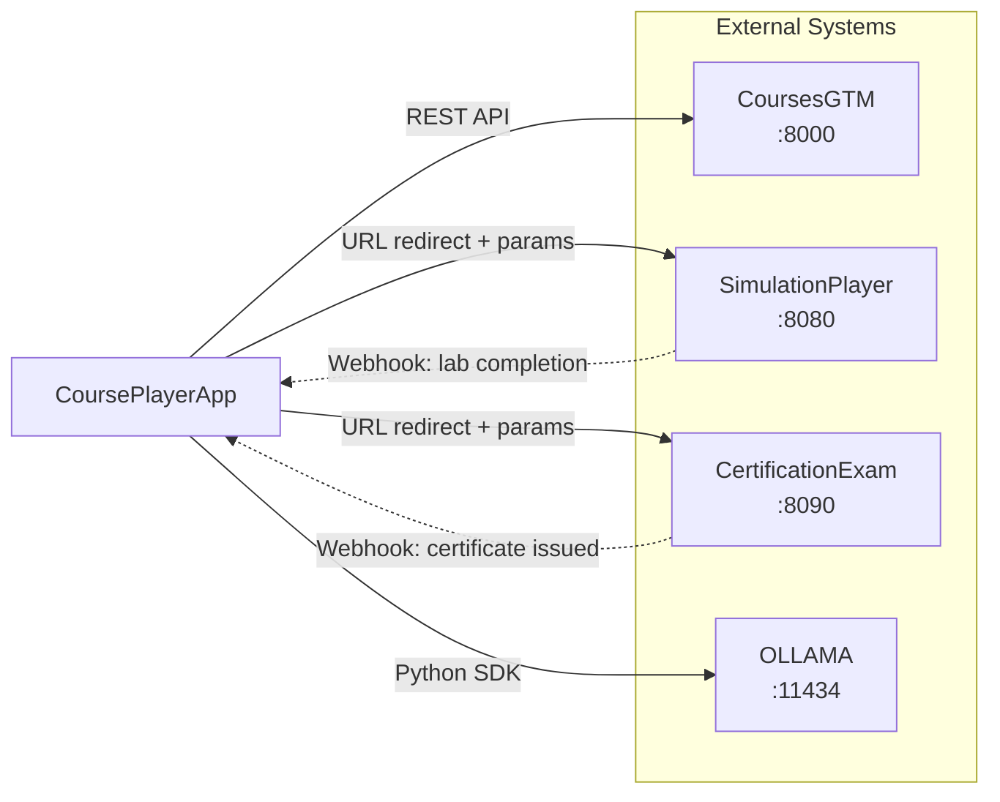
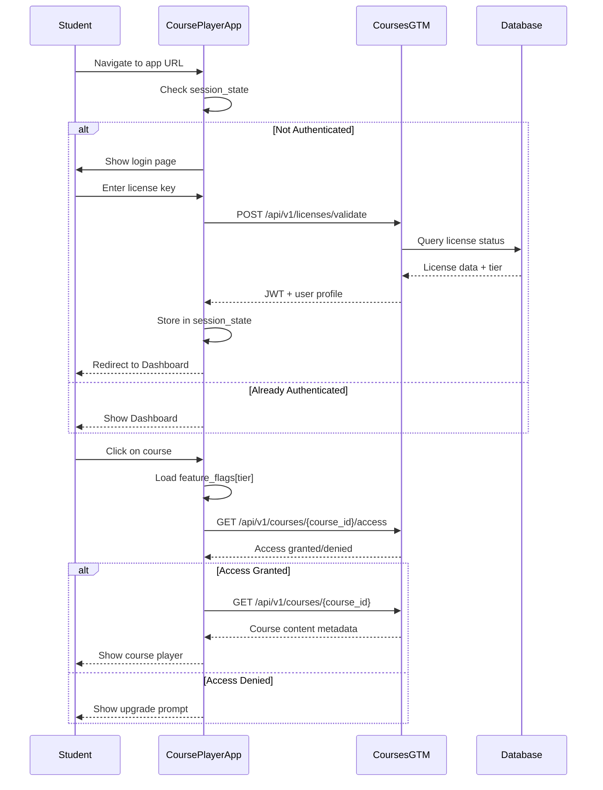
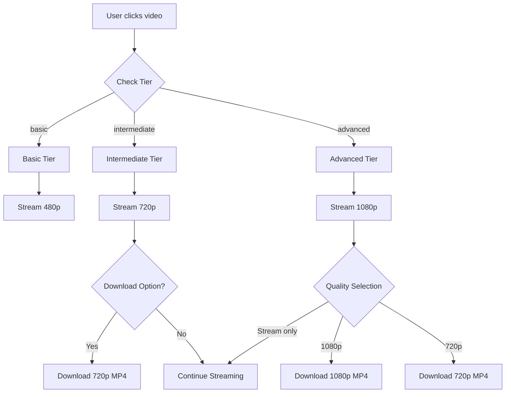
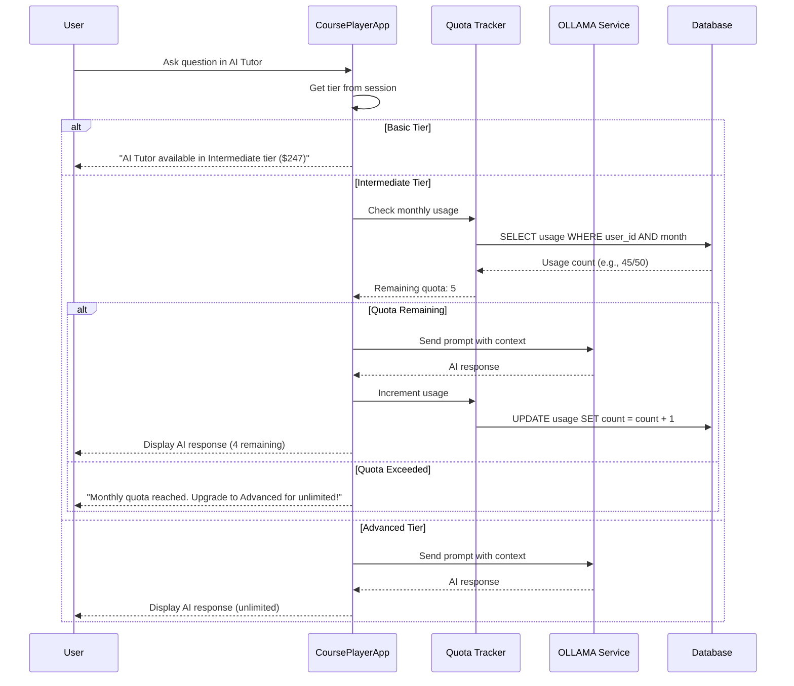
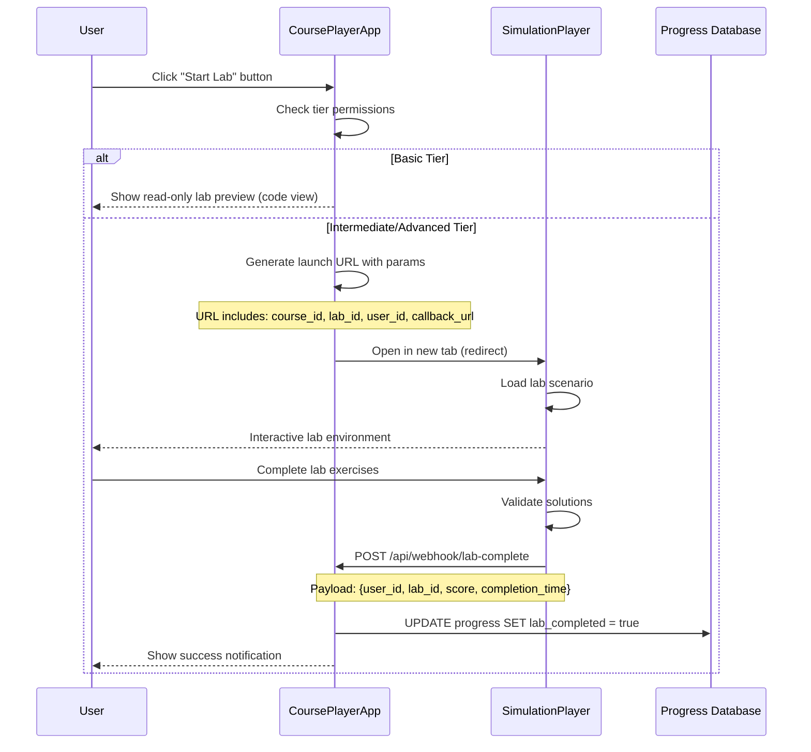

# CoursePlayerApp - System Architecture

## System Overview

### Purpose
CoursePlayerApp is a modern, adaptive learning experience platform that delivers personalized educational content based on user subscription tiers. Built with Streamlit, it provides an intuitive interface for accessing courses, watching videos, completing labs, and interacting with an AI tutor.

### User Experience Philosophy
- **Tier-Adaptive**: Content and features dynamically adjust based on user's subscription level (Basic/Intermediate/Advanced)
- **Progressive Disclosure**: Show available features prominently, preview locked features to encourage upgrades
- **Seamless Integration**: Smooth handoffs to SimulationPlayer (labs) and CertificationExam (assessments)
- **Learning-First**: Minimize friction in the learning journey, maximize engagement

---

## High-Level Architecture

### System Context Diagram



### Authentication & License Validation Flow



### Content Delivery Pipeline



### Feature Gating System



### Integration Points



---

## Component Breakdown

### 1. Authentication System
**Responsibility**: Validate license keys and manage user sessions

**Components**:
- `auth.py`: License validation logic
- `session_manager.py`: JWT token handling
- Login page: Streamlit form for license entry

**Flow**:
1. User enters license key (format: `XXXX-XXXX-XXXX-XXXX`)
2. App sends to CoursesGTM `/api/v1/licenses/validate`
3. Receives JWT with claims: `user_id`, `tier`, `email`, `expiry`
4. Stores in `st.session_state` (secure, server-side)
5. All pages check `st.session_state["authenticated"]` before rendering

**Security**:
- JWT tokens signed with HS256
- 24-hour token expiry
- No password storage (license key validated per session)

### 2. Course Navigation
**Responsibility**: Display available courses and navigate to course content

**Components**:
- `course_catalog.py`: Fetch and filter courses from CoursesGTM
- `course_card.py`: Reusable course display component
- My Courses page: Grid/list view with search and filters

**Features**:
- Filter by category (AI, Data Science, Machine Learning)
- Filter by difficulty (Beginner, Intermediate, Advanced)
- Search by title/description
- Sort by: Recently accessed, Progress, Alphabetical
- Display progress bars and tier badges

### 3. Video Player (Adaptive)
**Responsibility**: Stream or download videos based on user tier

**Components**:
- `video_player.py`: Streamlit video component wrapper
- `video_downloader.py`: Generate signed download URLs
- Quality selector (for Advanced tier)

**Tier-Based Behavior**:

| Tier | Quality | Streaming | Download | Speed Control |
|------|---------|-----------|----------|---------------|
| Basic | 480p | ✅ | ❌ | ✅ |
| Intermediate | 720p | ✅ | ✅ | ✅ |
| Advanced | 1080p | ✅ | ✅ (+ quality selection) | ✅ |

**Additional Features**:
- Resume from last position (stored in progress DB)
- Playback speed: 0.5x, 1x, 1.25x, 1.5x, 2x
- Captions/subtitles (VTT format)
- Fullscreen mode
- Picture-in-picture (browser-dependent)

### 4. Slides Viewer/Exporter
**Responsibility**: Display course slides and enable export

**Components**:
- `slides_viewer.py`: PDF viewer using `streamlit-pdf-viewer`
- `slides_exporter.py`: Generate download links for slides

**Tier-Based Behavior**:

| Tier | View Slides | Export PDF | Export PPTX |
|------|-------------|------------|-------------|
| Basic | ✅ | ❌ | ❌ |
| Intermediate | ✅ | ✅ | ❌ |
| Advanced | ✅ | ✅ | ✅ |

**Features**:
- Navigate between slides (prev/next)
- Thumbnail view
- Search within slides
- Annotations (Advanced tier only)

### 5. Lab Launcher
**Responsibility**: Integrate with SimulationPlayer for hands-on practice

**Components**:
- `lab_launcher.py`: Generate SimulationPlayer URLs with params
- Lab listing page: Show available labs with completion status

**Integration Flow**:
```python
# Example: Launch lab
def launch_lab(course_id: str, lab_id: str, user_id: str, tier: str):
    # Check tier permissions
    if tier == "basic":
        return show_lab_preview()  # Read-only view
    
    # Generate launch URL
    callback_url = f"https://courseplayerapp.com/api/lab-complete"
    launch_url = f"https://simulationplayer.com/launch?course_id={course_id}&lab_id={lab_id}&user_id={user_id}&callback={callback_url}"
    
    # Open in new tab
    st.markdown(f'<a href="{launch_url}" target="_blank">🚀 Start Lab</a>', unsafe_allow_html=True)
```

**Tier-Based Behavior**:

| Tier | Lab Access | Code Execution | Save Progress |
|------|------------|----------------|---------------|
| Basic | Read-only (view code) | ❌ | ❌ |
| Intermediate | Interactive | ✅ | ✅ |
| Advanced | Full access | ✅ | ✅ |

### 6. AI Tutor (OLLAMA-powered)
**Responsibility**: Provide context-aware learning assistance

**Components**:
- `ai_tutor.py`: OLLAMA integration with quota management
- Chat interface: Streamlit chat UI in sidebar/dedicated tab
- `quota_tracker.py`: Track monthly usage per user

**Architecture**:
```python
class AITutor:
    def __init__(self, tier: str, user_id: str, course_context: dict):
        self.tier = tier
        self.user_id = user_id
        self.context = course_context  # {course_id, module_id, topic}
        self.quota = TIER_QUOTAS[tier]
        self.usage = db.get_monthly_usage(user_id)
    
    def ask(self, question: str) -> str:
        # Check quota
        if self.tier == "basic":
            return UPGRADE_MESSAGE_INTERMEDIATE
        
        if self.tier == "intermediate" and self.usage >= self.quota:
            return QUOTA_EXCEEDED_MESSAGE
        
        # Build context-aware prompt
        prompt = self._build_prompt(question)
        
        # Call OLLAMA (llama3.1:8b model)
        response = ollama.chat(model="llama3.1:8b", messages=[
            {"role": "system", "content": TUTOR_SYSTEM_PROMPT},
            {"role": "user", "content": prompt}
        ])
        
        # Increment usage
        if self.tier == "intermediate":
            db.increment_usage(self.user_id)
        
        return response['message']['content']
```

**Quota Limits**:
- Basic: 0 questions (feature disabled)
- Intermediate: 50 questions/month (resets 1st of each month)
- Advanced: Unlimited

### 7. Progress Tracker
**Responsibility**: Track and visualize learning progress

**Components**:
- `progress_tracker.py`: Update progress metrics
- `progress_visualizer.py`: Generate Plotly charts
- My Progress page: Dashboard with stats and charts

**Tracked Metrics**:
- Video completion percentage per module
- Slides viewed (yes/no per deck)
- Labs completed (score + completion status)
- Quiz scores (score/max_score, attempts)
- Time spent per course (total minutes)
- Overall course completion (0-100%)

**Storage Schema**:
```json
{
  "user_id": "uuid-v4",
  "course_id": "ai-03-nlp-transformers",
  "overall_progress": 67,
  "time_spent_minutes": 420,
  "last_accessed": "2026-01-15T14:30:00Z",
  "modules": [
    {
      "module_id": "module-01",
      "title": "Introduction to NLP",
      "progress": 100,
      "videos": [
        {
          "video_id": "v1-intro",
          "watched": true,
          "completion_percentage": 100,
          "last_position_seconds": 0,
          "time_spent_seconds": 1200
        }
      ],
      "slides": [
        {"slide_deck_id": "s1", "viewed": true, "viewed_at": "2026-01-10T10:00:00Z"}
      ],
      "labs": [
        {"lab_id": "lab1-tokenization", "completed": true, "score": 95, "completed_at": "2026-01-12T15:00:00Z"}
      ],
      "quiz": {
        "quiz_id": "q1",
        "score": 8,
        "max_score": 10,
        "attempts": 2,
        "last_attempt": "2026-01-13T09:00:00Z"
      }
    }
  ]
}
```

**Visualizations**:
- Progress bars (per course, per module)
- Time spent line chart (daily)
- Completion heatmap (calendar view)
- Quiz performance bar chart
- Achievement badges (unlocked at milestones)

### 8. Certificate Viewer
**Responsibility**: Display earned certificates and enable sharing

**Components**:
- `certificate_viewer.py`: Fetch and display certificates
- Certificate grid: Visual gallery of earned certificates
- Share functionality: LinkedIn, Twitter, copy verification link

**Certificate Data**:
```json
{
  "certificate_id": "cert-ai-03-nlp-2026-01-15",
  "user_id": "uuid-v4",
  "course_id": "ai-03-nlp-transformers",
  "course_title": "Natural Language Processing with Transformers",
  "issue_date": "2026-01-15",
  "verification_url": "https://certifications.gai-observe.com/verify/cert-ai-03-nlp-2026-01-15",
  "blockchain_hash": "0x1a2b3c..." // Advanced tier only
}
```

**Tier-Based Features**:

| Tier | Certificate Type | Blockchain Verification | Design |
|------|------------------|-------------------------|---------|
| Basic | Standard | ❌ | Basic template |
| Intermediate | Standard | ❌ | Standard template |
| Advanced | Premium | ✅ | Premium template |

---

## Technology Stack

### Frontend
- **Streamlit 1.30+**: Web framework for Python
  - Rapid prototyping
  - Built-in components (video, file upload, charts)
  - Session state management
  - Custom components via `streamlit-component-lib`

### Backend
- **Python 3.10+**: Core language
- **Requests**: HTTP client for CoursesGTM API
- **PyJWT**: JWT token validation
- **Pandas**: Data manipulation for progress analytics
- **Plotly**: Interactive visualizations
- **OLLAMA Python SDK**: AI tutor integration

### AI/ML
- **OLLAMA**: Local LLM inference
  - Model: `llama3.1:8b` (8 billion parameters)
  - Runs on CPU or GPU
  - No external API calls (privacy-preserving)

### Storage
- **Cloudflare R2 or AWS S3**: Video and slide storage
  - HLS streaming for videos
  - Signed URLs for downloads (expiry: 1 hour)

### Database (via CoursesGTM)
- **PostgreSQL**: User data, progress, licenses
- **Redis**: Session caching, quota tracking

### Deployment
- **Docker**: Containerized deployment
- **Docker Compose**: Multi-service orchestration
- **Nginx**: Reverse proxy (SSL termination)

---

## Feature Gating Matrix

### Basic Tier ($97)
**Target Audience**: Casual learners, budget-conscious students

| Feature | Access | Notes |
|---------|--------|-------|
| Courses | 5 foundational | `ai-01`, `ai-02`, `ds-01`, `ds-02`, `ml-01` |
| Video | Stream only (480p) | No download |
| Slides | View only | No export |
| Labs | Read-only | View code, no execution |
| AI Tutor | ❌ Disabled | Upgrade prompt shown |
| Progress Tracking | Basic | Videos watched, course completion |
| Certificates | Standard | If earned |

### Intermediate Tier ($247)
**Target Audience**: Serious learners, professionals upskilling

| Feature | Access | Notes |
|---------|--------|-------|
| Courses | 8 courses | + `ai-03`, `ds-03`, `ml-02` |
| Video | Stream + download (720p) | MP4 download |
| Slides | View + export (PDF) | PDF download |
| Labs | Interactive | Full execution in SimulationPlayer |
| AI Tutor | ✅ Enabled (50 Q/month) | Quota resets monthly |
| Progress Tracking | Advanced | + time spent, quiz scores |
| Certificates | Standard | If earned |

### Advanced Tier ($497)
**Target Audience**: Power users, career-focused professionals

| Feature | Access | Notes |
|---------|--------|-------|
| Courses | All 9 courses | + `ai-04` (advanced topics) |
| Video | Stream + download (1080p) | Quality selector |
| Slides | View + export (PDF + PPTX) | Both formats |
| Labs | Full access | All simulations |
| AI Tutor | ✅ Unlimited | No quota |
| Progress Tracking | Detailed | + heatmaps, analytics |
| Certificates | Premium | Blockchain-verified |
| Support | Priority | 24-hour response SLA |

---

## Data Flow Diagrams

### Student Login → License Validation → Course Access



### Video Playback Flow (Stream vs Download)



### AI Tutor Interaction Flow



### Lab Launch Flow



---

## Security Considerations

### Authentication
- License keys are single-use tokens (validated on each session start)
- JWT tokens include `exp` claim (24-hour expiry)
- Tokens stored in `st.session_state` (server-side, not browser)
- No sensitive data in URL parameters

### Authorization
- Feature flags checked on every protected action
- Tier validation performed server-side (not just UI hiding)
- API calls to CoursesGTM include JWT in `Authorization` header

### Data Privacy
- OLLAMA runs locally (no data sent to external AI APIs)
- Video downloads use signed URLs (1-hour expiry)
- User progress encrypted at rest (in CoursesGTM database)

### Rate Limiting
- AI Tutor quota enforced at application layer
- API rate limits inherited from CoursesGTM (100 req/min per user)

---

## Scalability Considerations

### Horizontal Scaling
- Streamlit apps are stateless (session stored in database/Redis)
- Can run multiple CoursePlayerApp instances behind load balancer
- OLLAMA can be deployed as separate service (GPU instances)

### Caching Strategy
- Course metadata cached (TTL: 1 hour)
- Feature flags cached (TTL: 5 minutes)
- Video URLs pre-signed and cached (TTL: 50 minutes)

### Performance Optimization
- Lazy loading for course lists (pagination)
- Video streaming via CDN (Cloudflare R2)
- Plotly charts rendered client-side (reduce server load)

---

## Monitoring & Observability

### Metrics to Track
- User authentication success/failure rate
- Video playback errors (per quality level)
- AI Tutor response time
- Page load times
- Feature gate violations (attempted access to locked features)

### Logging
- Structured JSON logs (using Python `logging` module)
- Log levels: DEBUG, INFO, WARNING, ERROR, CRITICAL
- Log aggregation via ELK stack or similar

### Alerting
- Alert on authentication failures >10% in 5 minutes
- Alert on AI Tutor errors >5% in 10 minutes
- Alert on video playback errors >5% in 5 minutes

---

## Future Enhancements

### Phase 2 Features
- Mobile app (React Native or Flutter)
- Offline mode (download courses for offline viewing)
- Peer discussion forums
- Live cohort-based learning

### Phase 3 Features
- Gamification (points, leaderboards, badges)
- AI-generated personalized learning paths
- Integration with corporate LMS (SCORM export)
- Multi-language support (i18n)

---

## Conclusion

This architecture provides a solid foundation for CoursePlayerApp, balancing:
- **User Experience**: Smooth, adaptive interface
- **Business Model**: Clear tier differentiation to drive upgrades
- **Technical Excellence**: Modern stack, scalable design
- **Security**: License-based authentication, feature gating
- **Extensibility**: Easy to add new features and integrations

The modular design allows for incremental development and testing, with clear integration points for external systems (CoursesGTM, SimulationPlayer, CertificationExam, OLLAMA).
