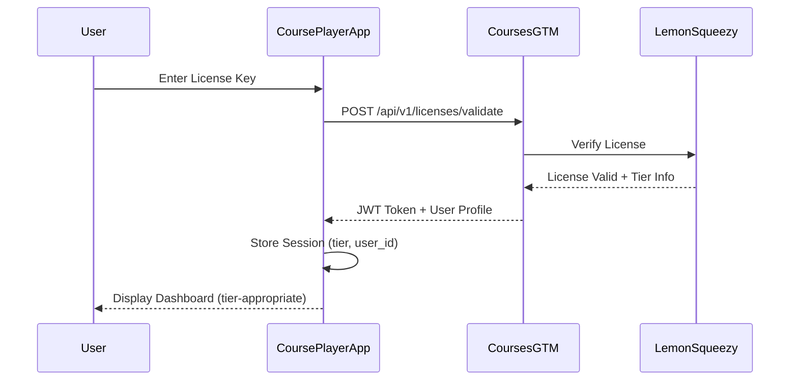
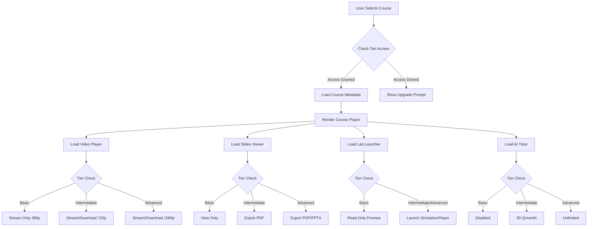
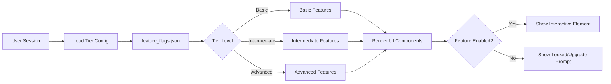
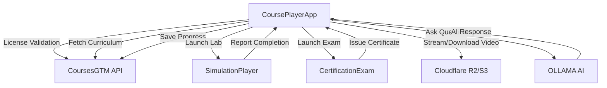
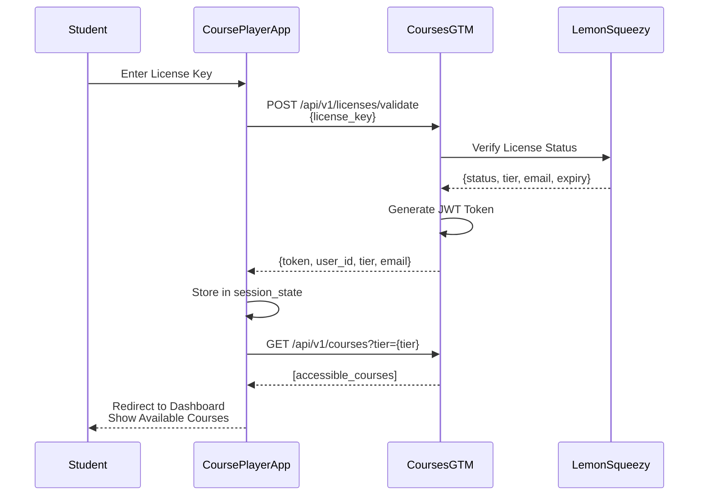
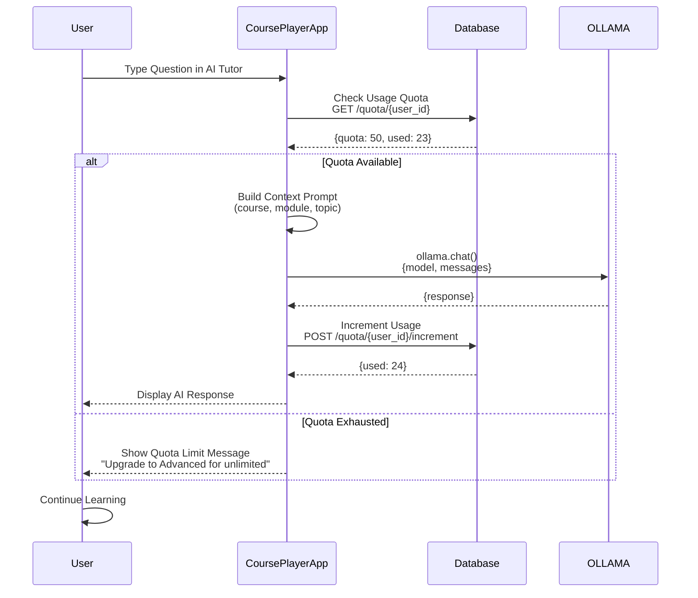
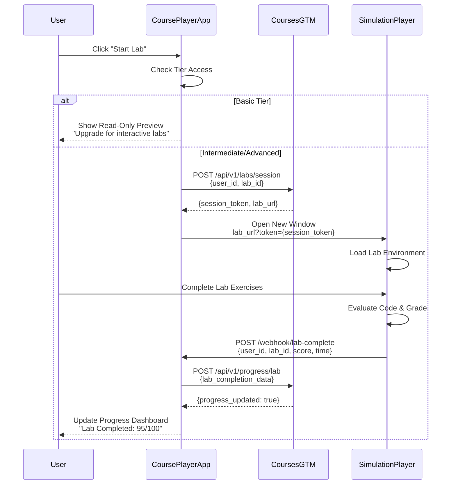

# CoursePlayerApp - System Architecture

## System Overview

**CoursePlayerApp** is a modern, feature-gated learning experience platform built with Streamlit that delivers adaptive educational content based on user subscription tiers (Basic, Intermediate, Advanced). The platform integrates seamlessly with external systems for license validation, hands-on labs, and certification management.

### Purpose
- Provide a unified learning experience for GAI-Observe Academy students
- Deliver tier-appropriate content and features based on subscription level
- Enable interactive learning through videos, slides, labs, and AI-powered assistance
- Track student progress and award certificates upon completion

### User Experience Philosophy
- **Simplicity First**: Clean, intuitive interface with minimal cognitive load
- **Adaptive Access**: Features unlock naturally as users upgrade tiers
- **Progress Transparency**: Clear visibility into learning journey and achievements
- **Accessibility**: WCAG 2.1 AA compliant for inclusive learning
- **Performance**: Fast content delivery with responsive streaming

---

## High-Level Architecture

### Authentication & License Validation Flow



### Content Delivery Pipeline



### Feature Gating System



### Integration Points



---

## Component Breakdown

### 1. Authentication System
**Purpose**: Validate user licenses and manage sessions

**Key Features**:
- License key input and validation
- JWT token generation and storage
- Session state management (tier, user_id, email)
- Automatic token refresh
- Logout functionality

**Technologies**:
- `streamlit.session_state` for session management
- `requests` for API calls to CoursesGTM
- `PyJWT` for token validation and decoding

**Data Flow**:
1. User enters license key
2. App sends validation request to CoursesGTM
3. CoursesGTM verifies with LemonSqueezy
4. JWT token returned with user profile
5. Session state populated
6. User redirected to dashboard

---

### 2. Course Navigation
**Purpose**: Browse and select courses based on tier access

**Key Features**:
- Grid/list view of available courses
- Course cards with metadata (title, description, duration, progress)
- Search and filter by category/difficulty
- Access control based on tier
- "Continue Learning" quick access

**UI Components**:
- Course grid with thumbnails
- Progress bars for enrolled courses
- Filter dropdowns (category, difficulty, status)
- Search bar
- Upgrade prompts for locked courses

**State Management**:
- Current course selection
- Filter preferences
- Last accessed course

---

### 3. Video Player (Adaptive)
**Purpose**: Stream/download videos based on tier privileges

**Key Features**:
- Multi-quality streaming (480p/720p/1080p)
- HLS adaptive bitrate streaming
- Download capability (tier-dependent)
- Playback controls (play, pause, seek, speed)
- Resume from last position
- Captions/subtitles support
- Fullscreen and picture-in-picture

**Implementation**:
- `st.video()` for video rendering
- Quality parameter based on tier
- Download button with tier check
- Progress tracking (time watched, completion %)

**Video Storage**:
- Cloudflare R2 or AWS S3
- Multiple quality levels pre-encoded
- HLS manifest files for adaptive streaming

---

### 4. Slides Viewer/Exporter
**Purpose**: Display course slides with export capabilities

**Key Features**:
- Slide navigation (prev/next, jump to slide)
- Thumbnail view
- Zoom controls
- Export to PDF (Intermediate+)
- Export to PPTX (Advanced only)
- Full-screen mode
- Print capability

**Implementation**:
- Slides stored as images (PNG/JPG) or PDF
- `st.image()` for display
- PDF generation using `reportlab` or `fpdf`
- PPTX export using `python-pptx`

**Tier Gating**:
- Basic: View only, no export
- Intermediate: Export to PDF
- Advanced: Export to PDF and PPTX

---

### 5. Lab Launcher
**Purpose**: Integrate with SimulationPlayer for hands-on coding labs

**Key Features**:
- Lab description and objectives
- Prerequisites check
- Launch button (opens SimulationPlayer)
- Completion status tracking
- Score display
- Retry capability

**Integration Flow**:
1. User clicks "Start Lab"
2. App checks tier access (Basic = read-only, others = interactive)
3. Generate lab session token
4. Open SimulationPlayer in new window with params:
   - `course_id`, `lab_id`, `user_id`, `session_token`
5. SimulationPlayer loads scenario
6. On completion, SimulationPlayer calls webhook:
   - `POST /api/webhook/lab-complete`
   - Payload: `{user_id, lab_id, score, completed_at}`
7. CoursePlayerApp updates progress

**Tier Behavior**:
- **Basic**: Read-only preview (view instructions, no execution)
- **Intermediate**: Full interactive access
- **Advanced**: Full interactive access + priority resources

---

### 6. AI Tutor (OLLAMA-powered)
**Purpose**: Provide context-aware AI assistance with quota management

**Key Features**:
- Chat interface in sidebar
- Context awareness (current course, module, topic)
- Question answering
- Concept explanations
- Hint generation (without full solutions)
- Resource suggestions
- Quota tracking and enforcement

**Implementation**:
- `ollama` Python client
- Model: `llama3.1:8b` (or configurable)
- Prompt engineering for educational context
- Database tracking for usage quotas
- Monthly quota reset

**Quota Management**:
- **Basic**: 0 questions (feature disabled)
- **Intermediate**: 50 questions/month
- **Advanced**: Unlimited (-1 = no limit)

**Prompt Template**:
```python
You are a helpful AI tutor for the course: {course_title}.
Current module: {module_name}
Current topic: {topic_name}

Student question: {question}

Provide a clear, educational answer. Guide the student toward understanding 
without giving full solutions. Use Socratic questioning when appropriate.
```

---

### 7. Progress Tracker
**Purpose**: Monitor and visualize learning progress

**Key Features**:
- Overall course completion percentage
- Module-level progress breakdown
- Video watch time tracking
- Quiz scores and attempts
- Lab completion status
- Time spent analytics
- Achievement badges
- Progress history (timeline)

**Visualizations** (using Plotly):
- Progress bars for each course
- Time spent charts (bar/line graphs)
- Completion heatmap (calendar view)
- Quiz performance trends
- Module completion funnel

**Data Structure**:
- Stored in CoursesGTM backend
- Real-time sync on activity
- Cached in session state for performance

**Tracked Events**:
- Video started/paused/completed
- Slide viewed
- Lab launched/completed
- Quiz attempted/completed
- Exam taken

---

### 8. Certificate Viewer
**Purpose**: Display and manage earned certificates

**Key Features**:
- Certificate gallery (grid view)
- Download as PDF
- Share to LinkedIn integration
- Verification link (blockchain for Advanced tier)
- Certificate details (course, date, score)
- Print capability

**Certificate Types**:
- **Basic**: Standard certificate (PDF)
- **Intermediate**: Standard certificate with design
- **Advanced**: Premium certificate with blockchain verification

**Verification Flow** (Advanced tier):
1. Certificate issued with unique ID
2. Hash stored on blockchain (Ethereum/Polygon)
3. Verification link: `verify.gai-observe.com/{cert_id}`
4. Public verification without login

---

## Technology Stack

### Frontend Framework
- **Streamlit 1.30+**: Rapid web app development
- **Streamlit-Extras**: Additional UI components
- **Streamlit-Option-Menu**: Enhanced navigation

### Backend/API
- **Python 3.10+**: Core language
- **Requests**: HTTP client for CoursesGTM API
- **PyJWT**: JWT token handling
- **FastAPI** (optional): Webhook endpoints for SimulationPlayer callbacks

### AI/ML
- **OLLAMA**: Local LLM inference
- **llama3.1:8b**: AI Tutor model (or configurable)

### Data Visualization
- **Plotly**: Interactive charts and graphs
- **Plotly Express**: Quick visualizations
- **Matplotlib** (optional): Static visualizations

### Document Processing
- **python-pptx**: PowerPoint export
- **reportlab** or **fpdf2**: PDF generation
- **Pillow**: Image processing

### Storage/API Integrations
- **boto3** (optional): AWS S3 client
- **cloudflare-r2**: Cloudflare R2 client
- **sqlite3**: Local caching (optional)

### Authentication
- **PyJWT**: Token validation
- **cryptography**: Token encryption

### Testing
- **pytest**: Unit testing framework
- **pytest-streamlit**: Streamlit app testing
- **requests-mock**: Mock API responses
- **selenium**: UI testing (optional)

### Development Tools
- **black**: Code formatting
- **flake8**: Linting
- **mypy**: Type checking

---

## Feature Gating Matrix

| Feature | Basic ($97) | Intermediate ($247) | Advanced ($497) |
|---------|------------|---------------------|-----------------|
| **Course Access** | 5 foundational courses | 8 courses (foundational + intermediate) | All 9 courses |
| **Video Quality** | 480p stream only | 720p stream + download | 1080p stream + download |
| **Slides** | View only | View + PDF export | View + PDF/PPTX export |
| **Labs** | Read-only preview | Interactive execution | Interactive + priority resources |
| **AI Tutor** | ❌ Disabled | ✅ 50 questions/month | ✅ Unlimited |
| **Progress Tracking** | Basic (completion %) | Advanced (time, scores) | Detailed analytics + heatmaps |
| **Certificates** | Standard PDF | Standard with design | Premium + blockchain verification |
| **Support** | Community forum | Email support | Priority support |

---

## Data Flow Diagrams

### Student Login → License Validation → Course Access



### Video Playback Flow (Stream vs Download)

```mermaid
flowchart TD
    A[User Clicks Video] --> B[Load Video Metadata]
    B --> C{Check Tier}
    C -->|Basic| D[video_quality = 480p]
    C -->|Intermediate| E[video_quality = 720p]
    C -->|Advanced| F[video_quality = 1080p]
    D --> G[Stream from R2/S3]
    E --> G
    F --> G
    G --> H[Render st.video]
    H --> I{User Clicks Download?}
    I -->|Yes| J{Tier has download?}
    J -->|No Basic| K[Show Upgrade Modal]
    J -->|Yes Int/Adv| L[Generate Signed URL]
    L --> M[Download Video File]
    I -->|No| N[Continue Streaming]
    N --> O[Track Watch Progress]
    O --> P[POST /api/v1/progress/video<br/>{video_id, time_watched}]
```

### AI Tutor Interaction Flow



### Lab Launch Flow



---

## Security Considerations

### Authentication & Authorization
- JWT tokens with short expiry (1 hour)
- Refresh tokens stored securely
- HTTPS-only communication
- No password storage (license-key based)

### API Security
- Rate limiting on all API endpoints
- API key rotation support
- Input validation and sanitization
- CORS configuration for trusted domains

### Data Privacy
- User data encrypted at rest
- PII minimization
- GDPR compliance (data export/deletion)
- Session timeout after inactivity

### Feature Gating Enforcement
- Server-side validation (never trust client)
- Token-based tier verification
- Audit logging for tier escalation attempts

---

## Scalability & Performance

### Caching Strategy
- Course metadata cached in session
- Video manifests cached (CDN)
- Static assets served via CDN
- Redis for session storage (production)

### Content Delivery
- Cloudflare R2 or AWS S3 with CDN
- HLS adaptive streaming
- Video thumbnail generation
- Lazy loading for images

### Database Optimization
- Indexed queries for progress tracking
- Batch updates for analytics
- Read replicas for reporting

### Monitoring
- Application performance monitoring (APM)
- Error tracking (Sentry)
- Usage analytics
- Video playback metrics

---

## Deployment Architecture

### Development
```
[Developer] --> [Local Streamlit] --> [Mock APIs]
```

### Staging
```
[Streamlit Cloud] --> [CoursesGTM Staging] --> [Test R2 Bucket]
                  --> [OLLAMA Test Instance]
```

### Production
```
[Streamlit Cloud / Docker] --> [CoursesGTM API]
                           --> [Cloudflare R2 CDN]
                           --> [OLLAMA Production]
                           --> [Analytics DB]
```

---

## Future Enhancements

### Phase 2 (Post-MVP)
- Mobile app (React Native)
- Offline mode (download courses)
- Social learning (discussion forums)
- Live coding sessions
- Gamification (leaderboards, badges)

### Phase 3
- Multi-language support (i18n)
- Custom learning paths
- Team/enterprise accounts
- White-label option
- Advanced analytics dashboard

---

## Conclusion

CoursePlayerApp provides a robust, scalable, and user-centric learning platform with sophisticated feature gating, seamless integrations, and a focus on accessibility and performance. The architecture supports current requirements while allowing for future expansion and enhancement.

