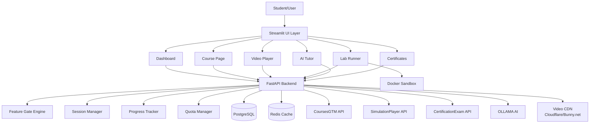
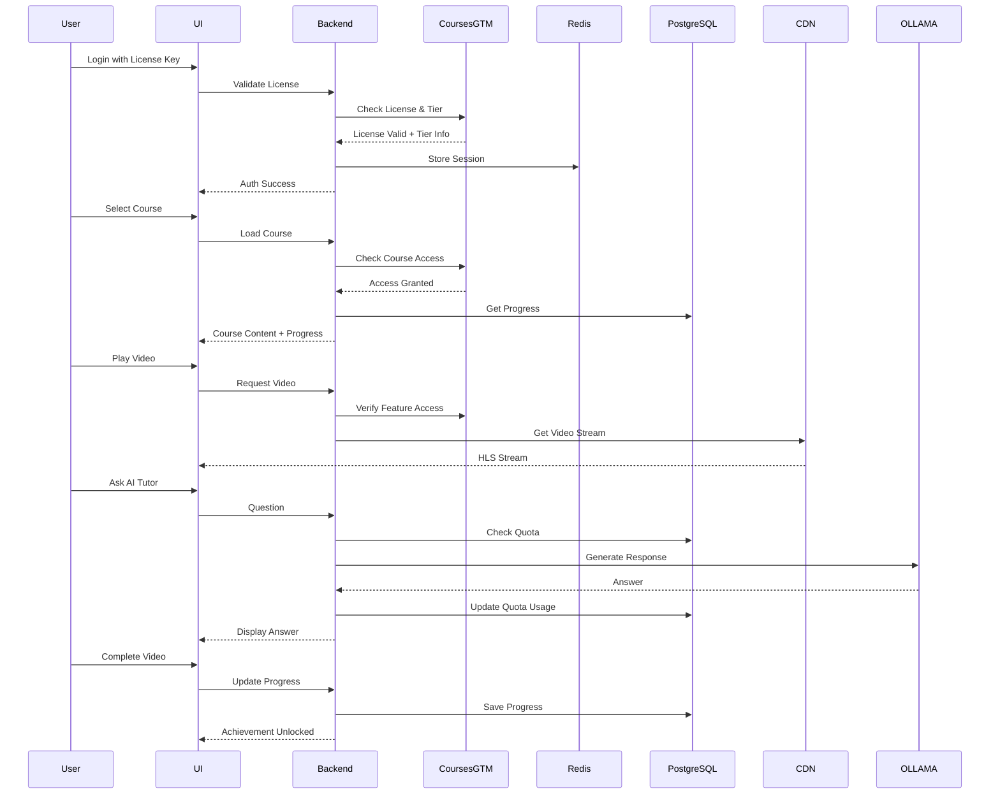
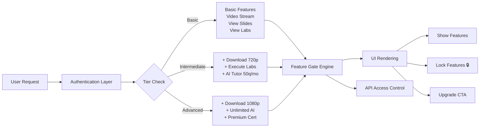
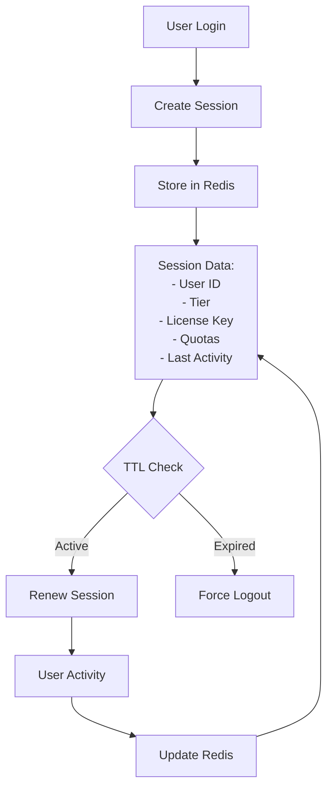
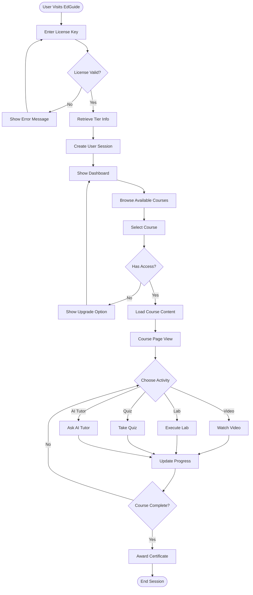
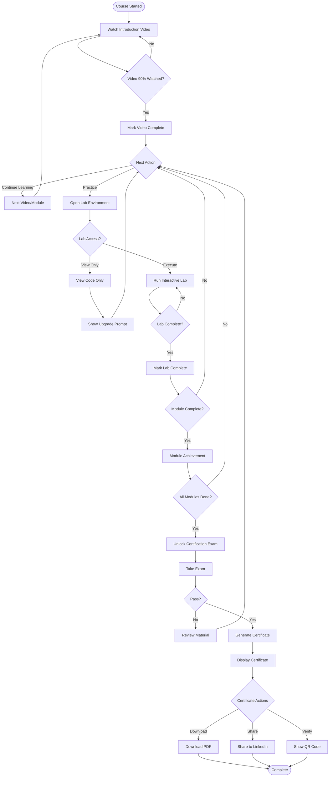

# CoursePlayerApp - System Architecture

## Platform Information
- **Platform**: EdGuide
- **Domain**: gai-observe.online
- **Tagline**: "Elite Agentic Learning Platform"

## System Overview

### Purpose
CoursePlayerApp is the primary learning experience interface for the EdGuide platform, providing students with adaptive, tier-based access to course content including videos, interactive labs, AI tutoring, and certification.

### User Journey
1. **Authentication & License Validation**: User logs in → License validated via CoursesGTM → Tier determined (Basic/Intermediate/Advanced)
2. **Course Selection**: User browses available courses → Selects course based on tier access
3. **Learning Experience**: User consumes content (videos, slides, labs) → Interacts with AI Tutor → Completes assessments
4. **Progress Tracking**: System tracks completion → Awards achievements → Updates progress dashboard
5. **Certification**: User completes course → Takes exam via CertificationExam → Receives certificate

### Integration Points
- **CoursesGTM**: License validation, tier management, feature access control
- **SimulationPlayer**: Hands-on practice environments, simulation execution
- **CertificationExam**: Final assessments, certificate generation
- **OLLAMA**: AI-powered tutoring and learning assistance

---

## High-Level Architecture

### Component Architecture



### Data Flow Architecture



### Feature Gating Architecture



### Session Management



---

## Technology Stack

### Frontend
- **Primary**: Streamlit (MVP/v1)
  - Rapid prototyping
  - Python-based UI
  - Built-in components
  - Easy integration with backend
- **Future (v2)**: React + TypeScript
  - Enhanced UX
  - Better performance
  - Mobile-responsive
  - Progressive Web App (PWA)

### Backend
- **Framework**: FastAPI
  - Async support
  - Auto-generated API docs
  - High performance
  - Python 3.9+
- **API Design**: RESTful
  - JWT authentication
  - Rate limiting
  - CORS support

### Database
- **Primary**: PostgreSQL 14+
  - User progress tracking
  - Course enrollment
  - Achievement system
  - Analytics data
- **Schema Management**: Alembic migrations

### Caching & Session
- **Redis 7+**
  - Session management
  - Feature flags cache
  - API response cache
  - Rate limiting counters
  - AI Tutor quota tracking

### Video Delivery
- **CDN**: Cloudflare Stream or Bunny.net
  - HLS streaming
  - Adaptive bitrate
  - Global CDN
  - Analytics
- **Encoding**: Multi-resolution
  - 360p (Basic, Intermediate, Advanced)
  - 720p (Intermediate, Advanced)
  - 1080p (Advanced only)
- **DRM**: Tier-based protection
  - Basic: Email watermarking
  - Intermediate: Basic DRM
  - Advanced: Full DRM + forensic watermarking

### AI & ML
- **AI Tutor**: OLLAMA (local deployment)
  - Models: llama3:70b, mistral, codellama
  - Context-aware responses
  - Code explanation
  - Concept clarification
- **Deployment**: Docker container
  - GPU support (optional)
  - Model caching
  - Load balancing

### Lab Environment
- **Container Platform**: Docker
  - One container per user session
  - Resource limits (2 CPU, 4GB RAM)
  - Ephemeral storage (10GB)
  - 2-hour timeout
- **Jupyter**: JupyterLab
  - Interactive notebooks
  - Terminal access
  - File upload/download
- **Code Editor**: Monaco Editor
  - VS Code in browser
  - Syntax highlighting
  - Auto-completion

### Infrastructure
- **Orchestration**: Docker Compose (development), Kubernetes (production)
- **Monitoring**: Prometheus + Grafana
- **Logging**: ELK Stack (Elasticsearch, Logstash, Kibana)
- **CI/CD**: GitHub Actions

---

## User Flows

### Flow 1: Login → License Validation → Course Selection → Learning



### Flow 2: Video Watching → Lab Practice → Exam Taking → Certificate Viewing



---

## Feature Gating Strategy

### Feature Access Matrix

| Feature | Basic ($97) | Intermediate ($247) | Advanced ($497) |
|---------|-------------|---------------------|-----------------|
| Video Streaming | ✅ All resolutions | ✅ All resolutions | ✅ All resolutions |
| Video Download | ❌ | ✅ Up to 720p | ✅ Up to 1080p |
| Slides View | ✅ Read-only | ✅ Read-only | ✅ Read-only |
| Slides Export | ❌ | ✅ PDF | ✅ PDF + PPTX |
| Labs View | ✅ Code view-only | ✅ View + Execute | ✅ View + Execute |
| Lab Execution | ❌ | ✅ Interactive | ✅ Interactive |
| AI Tutor | ❌ Locked | ✅ 50 q/month | ✅ Unlimited |
| Simulations | ❌ | ✅ Limited | ✅ Unlimited |
| Certificate | ✅ Standard | ✅ Professional + LinkedIn | ✅ Premium + Blockchain |
| Progress Analytics | ✅ Basic | ✅ Detailed | ✅ Advanced + Insights |
| Support | Email only | Priority email | Priority + Chat |
| Community Access | ❌ | ❌ | ✅ Discord/Slack |

### Implementation Strategy

#### 1. Backend Feature Gate Engine
```python
# core/feature_gate.py
class FeatureGate:
    FEATURE_MATRIX = {
        "video_streaming": ["basic", "intermediate", "advanced"],
        "video_download": ["intermediate", "advanced"],
        "video_download_1080p": ["advanced"],
        "slide_export_pdf": ["intermediate", "advanced"],
        "slide_export_pptx": ["advanced"],
        "lab_execution": ["intermediate", "advanced"],
        "ai_tutor": ["intermediate", "advanced"],
        "ai_tutor_unlimited": ["advanced"],
        "simulation_advanced": ["advanced"],
        "certificate_blockchain": ["advanced"],
        "community_access": ["advanced"],
    }
    
    @staticmethod
    def can_access(user_tier: str, feature: str) -> bool:
        allowed_tiers = FeatureGate.FEATURE_MATRIX.get(feature, [])
        return user_tier.lower() in allowed_tiers
    
    @staticmethod
    def get_upgrade_message(current_tier: str, feature: str) -> str:
        if current_tier == "basic":
            return "Upgrade to Intermediate to unlock this feature"
        elif current_tier == "intermediate":
            return "Upgrade to Advanced for full access"
        return ""
```

#### 2. UI Component Visibility Rules
```python
# ui/components/gated_component.py
import streamlit as st

def render_gated_feature(
    feature_name: str,
    user_tier: str,
    render_func: callable,
    locked_message: str = None
):
    """Render a feature if user has access, else show upgrade prompt"""
    if FeatureGate.can_access(user_tier, feature_name):
        render_func()
    else:
        st.warning(f"🔒 {locked_message or 'This feature is locked'}")
        upgrade_tier = "Intermediate" if user_tier == "basic" else "Advanced"
        st.button(f"⬆️ Upgrade to {upgrade_tier}", key=f"upgrade_{feature_name}")
```

#### 3. API Access Controls
```python
# main.py (FastAPI)
from fastapi import HTTPException, Depends

async def require_feature(feature: str):
    """Dependency to check feature access"""
    async def checker(user: User = Depends(get_current_user)):
        if not FeatureGate.can_access(user.tier, feature):
            raise HTTPException(
                status_code=403,
                detail=f"Your {user.tier} tier does not have access to {feature}"
            )
        return user
    return checker

@app.post("/api/ai-tutor/ask")
async def ask_ai_tutor(
    question: str,
    user: User = Depends(require_feature("ai_tutor"))
):
    # AI Tutor logic
    pass
```

---

## Security Considerations

### Authentication & Authorization
- JWT tokens with short expiration (15 min access, 7 day refresh)
- License key validation on every session start
- Tier verification on feature access
- Rate limiting per user/IP

### Video Protection
- Signed URLs with expiration
- User email watermarking (all tiers)
- DRM protection (Intermediate/Advanced)
- Forensic watermarking (Advanced)
- Download quota enforcement

### Lab Sandbox Security
- Network isolation (no external access except whitelisted)
- Resource limits (CPU, RAM, disk)
- Execution timeout (2 hours)
- No persistent state across sessions
- Sudo access restricted
- Package installation sandboxed

### Data Privacy
- GDPR compliance
- User data encryption at rest
- PII minimization
- Audit logs for data access
- Right to deletion

---

## Scalability & Performance

### Performance Targets
- Page load time: < 2 seconds
- Video start time: < 3 seconds
- API response time: < 200ms (p95)
- Lab environment spawn: < 30 seconds
- AI Tutor response: < 5 seconds

### Scalability Strategy
- Horizontal scaling of API servers
- Redis cluster for session management
- PostgreSQL read replicas
- CDN for static assets and videos
- Container orchestration for lab environments
- Load balancing for OLLAMA instances

### Caching Strategy
- Session data: Redis (15 min TTL)
- Feature flags: Redis (1 hour TTL)
- Course metadata: Redis (24 hour TTL)
- Video manifests: CDN edge cache
- API responses: Redis (5 min TTL for read operations)

---

## Monitoring & Observability

### Metrics to Track
- User engagement (session duration, videos watched, labs completed)
- Feature usage by tier
- AI Tutor quota utilization
- Video buffering ratio
- Lab environment spawn time
- API latency (p50, p95, p99)
- Error rates

### Alerting
- High API error rate (> 1%)
- Slow response times (p95 > 500ms)
- Lab environment failures
- OLLAMA service down
- Database connection issues
- Redis cache miss rate > 20%

### Logging
- User actions (video watch, lab execution, AI Tutor queries)
- Feature access denials
- License validation events
- System errors with stack traces
- Performance metrics

---

## Deployment Architecture

### Development
```yaml
services:
  - streamlit-ui (localhost:8501)
  - fastapi-backend (localhost:8000)
  - postgresql (localhost:5432)
  - redis (localhost:6379)
  - ollama (localhost:11434)
```

### Production
```yaml
infrastructure:
  cloud: AWS / GCP / Azure
  regions: Multi-region (US, EU, Asia)
  
  components:
    frontend:
      - Streamlit on ECS/Cloud Run
      - Auto-scaling (2-20 instances)
      
    backend:
      - FastAPI on ECS/Cloud Run
      - Auto-scaling (5-50 instances)
      - Load balancer (ALB/Cloud Load Balancer)
      
    database:
      - PostgreSQL (RDS/Cloud SQL)
      - Multi-AZ deployment
      - Read replicas (2+)
      
    cache:
      - Redis (ElastiCache/Cloud Memorystore)
      - Cluster mode
      - Multi-AZ replication
      
    lab-environments:
      - Kubernetes cluster
      - Node auto-scaling
      - Pod lifecycle management
      
    ai-service:
      - OLLAMA on GPU instances
      - Load balancer
      - Auto-scaling based on queue depth
      
    cdn:
      - Cloudflare Stream / Bunny.net
      - Global edge distribution
```

---

## Future Enhancements (Roadmap)

### Phase 1 (MVP) - Q1 2026
- ✅ Streamlit UI
- ✅ Basic video streaming
- ✅ Feature gating (3 tiers)
- ✅ Progress tracking
- ✅ AI Tutor (OLLAMA)

### Phase 2 - Q2 2026
- React UI migration
- Mobile apps (iOS/Android)
- Offline video download
- Advanced analytics
- Social learning features

### Phase 3 - Q3 2026
- Live coding sessions
- Peer review system
- Gamification expansion
- AR/VR lab environments
- Multi-language support

### Phase 4 - Q4 2026
- AI-powered adaptive learning paths
- Real-time collaboration
- Enterprise tier (team licenses)
- White-label platform
- API for third-party integrations

---

## Related Documentation

- [Feature Gating Specification](./FEATURE_GATING.md)
- [Video Player Specification](./VIDEO_PLAYER.md)
- [Lab Runner Specification](./LAB_RUNNER.md)
- [AI Tutor Specification](./AI_TUTOR.md)
- [Progress Tracking Specification](./PROGRESS_TRACKING.md)
- [Certificate Display Specification](./CERTIFICATE_DISPLAY.md)
- [UI/UX Design Specification](./UI_UX_DESIGN.md)
- [Integrations Specification](./INTEGRATIONS.md)
- [Accessibility Specification](./ACCESSIBILITY.md)

---

**Last Updated**: January 2026  
**Platform**: EdGuide (gai-observe.online)  
**Version**: 1.0
