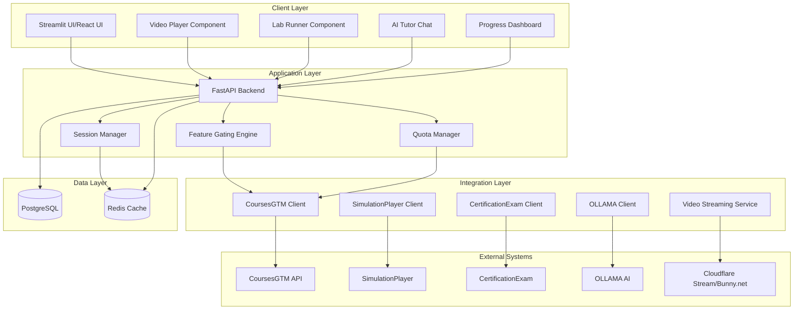
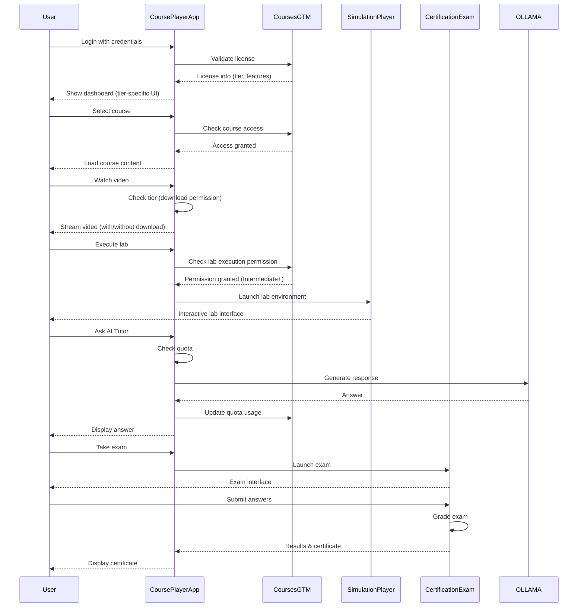
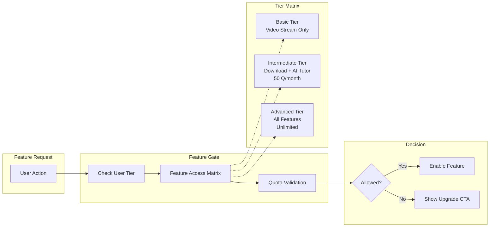
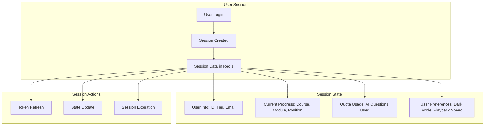
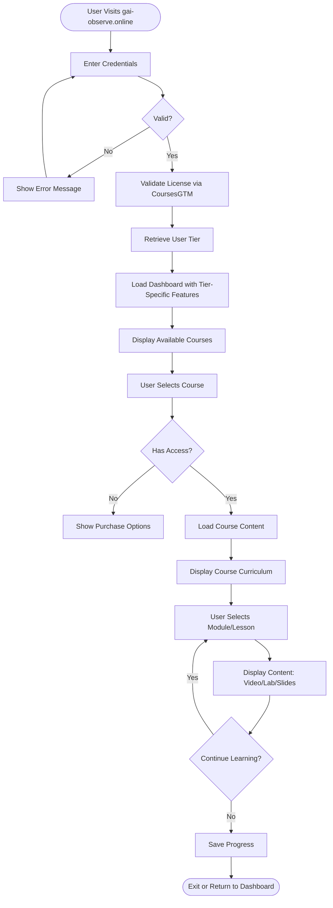
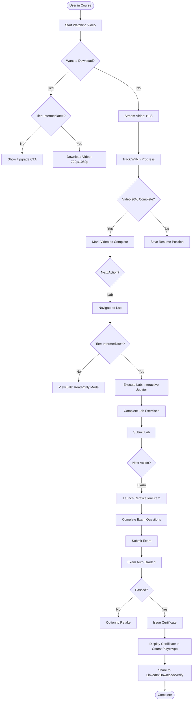

# CoursePlayerApp System Architecture

## Brand Identity
- **Platform**: EdGuide
- **Domain**: gai-observe.online
- **Tagline**: "Elite Agentic Learning Platform"

## System Overview

### Purpose
CoursePlayerApp is the primary learning experience interface for the EdGuide platform, where students interact with course content through a feature-gated, tier-based UI. It serves as the central hub for video learning, interactive labs, AI-powered tutoring, and progress tracking.

### User Journey
1. **Authentication & License Validation**: User logs in → License validated via CoursesGTM → Tier determined
2. **Course Selection**: User browses available courses → Selects course → Views curriculum
3. **Learning Experience**: User consumes content (videos, slides, labs) → Interacts with AI Tutor → Completes assessments
4. **Hands-on Practice**: User launches SimulationPlayer for interactive simulations
5. **Certification**: User takes exams via CertificationExam → Earns certificates → Views in CoursePlayerApp
6. **Progress Tracking**: System tracks all activities → Displays analytics and achievements

### Integration Points
- **CoursesGTM**: License validation, tier management, feature access control
- **SimulationPlayer**: Interactive simulation launcher and progress sync
- **CertificationExam**: Exam launcher, results retrieval, certificate management
- **OLLAMA**: Local AI tutor for context-aware Q&A and learning assistance
- **CDN (Cloudflare Stream/Bunny.net)**: Video delivery and adaptive streaming
- **External Services**: LinkedIn (certificate sharing), Blockchain (verification)

## High-Level Architecture

### Component Architecture



### Data Flow Architecture



### Feature Gating Architecture



### Session Management Architecture



## Technology Stack

### Frontend
**MVP (Phase 1)**: Streamlit
- **Rationale**: Rapid prototyping, Python-native, minimal JavaScript
- **Components**: Streamlit components for video, chat, forms
- **Limitations**: Limited customization, server-side rendering

**Production (Phase 2)**: React + TypeScript
- **Rationale**: Rich interactivity, component reusability, modern UX
- **UI Framework**: Material-UI or Tailwind CSS
- **State Management**: Redux Toolkit or Zustand
- **Build Tool**: Vite

### Backend
**Framework**: FastAPI
- **Async Support**: High-performance async request handling
- **Auto Documentation**: OpenAPI/Swagger auto-generated
- **Type Safety**: Pydantic models for validation
- **WebSocket**: Real-time features (AI chat, progress updates)

### Database
**Primary Database**: PostgreSQL
- **Purpose**: User progress, course data, analytics
- **Features**: JSONB for flexible schemas, full-text search
- **ORM**: SQLAlchemy with async support

**Cache/Session Store**: Redis
- **Purpose**: Session management, quota tracking, temporary data
- **Features**: TTL expiration, pub/sub for real-time updates
- **Use Cases**: 
  - User session tokens
  - AI Tutor quota counters
  - Video resume positions (temporary)

### Video Delivery
**CDN**: Cloudflare Stream or Bunny.net
- **Protocol**: HLS (HTTP Live Streaming)
- **Encoding**: Multi-bitrate (360p, 720p, 1080p)
- **Features**:
  - Adaptive bitrate streaming
  - DRM protection (tier-based)
  - Analytics (watch time, engagement)
  - Thumbnail generation
  - Forensic watermarking (user email overlay)

### AI Tutor
**Engine**: OLLAMA (Local Deployment)
- **Models**: 
  - Llama 3 70B (general Q&A)
  - CodeLlama (code explanations)
  - Mistral (alternative)
- **Deployment**: Self-hosted on GPU servers
- **Context Window**: 4K-8K tokens
- **Response Time**: 2-5 seconds

### Lab Environment
**Sandbox**: Docker Containers
- **Orchestration**: Kubernetes or Docker Swarm
- **Notebook**: JupyterLab
- **Code Editor**: Monaco Editor (VS Code in browser)
- **Terminal**: xterm.js (web terminal)
- **Resource Limits**: 2 CPU cores, 4GB RAM, 10GB storage per user

### DevOps
- **Containerization**: Docker
- **Orchestration**: Docker Compose (dev), Kubernetes (prod)
- **CI/CD**: GitHub Actions
- **Monitoring**: Prometheus + Grafana
- **Logging**: ELK Stack (Elasticsearch, Logstash, Kibana)

## User Flows

### Flow 1: Login → License Validation → Course Selection → Learning



### Flow 2: Video Watching → Lab Practice → Exam Taking → Certificate Viewing



## Feature Gating Strategy

### How Features are Enabled/Disabled Per Tier

**Feature Access Control Flow**:
1. User initiates action (e.g., click "Download Video")
2. UI component calls `can_access_feature(user_tier, "video_download")`
3. Feature Gate checks tier against Feature Access Matrix
4. If quota-based feature (e.g., AI Tutor), check remaining quota
5. Return `True` (enable feature) or `False` (show upgrade CTA)

**Feature Access Matrix**:
```python
FEATURE_ACCESS_MATRIX = {
    # Video Features
    "video_streaming": ["basic", "intermediate", "advanced"],
    "video_download_720p": ["intermediate", "advanced"],
    "video_download_1080p": ["advanced"],
    
    # Lab Features
    "lab_view": ["basic", "intermediate", "advanced"],
    "lab_execution": ["intermediate", "advanced"],
    
    # AI Tutor Features
    "ai_tutor_limited": ["intermediate"],  # 50 Q/month
    "ai_tutor_unlimited": ["advanced"],
    
    # Slide Features
    "slide_view": ["basic", "intermediate", "advanced"],
    "slide_export_pdf": ["intermediate", "advanced"],
    "slide_export_pptx": ["advanced"],
    
    # Simulation Features
    "simulation_basic": ["intermediate", "advanced"],
    "simulation_advanced": ["advanced"],
    
    # Certificate Features
    "certificate_standard": ["basic", "intermediate", "advanced"],
    "certificate_linkedin": ["intermediate", "advanced"],
    "certificate_blockchain": ["advanced"],
    
    # Analytics Features
    "analytics_basic": ["basic", "intermediate", "advanced"],
    "analytics_detailed": ["intermediate", "advanced"],
    "analytics_insights": ["advanced"],
    
    # Support Features
    "support_basic": ["basic", "intermediate", "advanced"],
    "support_priority": ["advanced"],
    
    # Community Features
    "community_access": ["advanced"],
}
```

### UI Component Visibility Rules

**Rule Engine**:
```python
def should_show_feature_ui(user_tier: str, feature: str) -> dict:
    """
    Determines how to render a feature in the UI.
    
    Returns:
        {
            "show": bool,  # Show the UI element
            "enabled": bool,  # Enable interaction
            "locked": bool,  # Show lock icon
            "upgrade_tier": str | None  # Which tier unlocks this
        }
    """
    has_access = can_access_feature(user_tier, feature)
    
    if has_access:
        return {
            "show": True,
            "enabled": True,
            "locked": False,
            "upgrade_tier": None
        }
    else:
        # Show locked feature with upgrade prompt
        unlock_tier = get_unlock_tier(feature)
        return {
            "show": True,
            "enabled": False,
            "locked": True,
            "upgrade_tier": unlock_tier
        }

def get_unlock_tier(feature: str) -> str:
    """Get the minimum tier that unlocks a feature."""
    for tier in ["basic", "intermediate", "advanced"]:
        if tier in FEATURE_ACCESS_MATRIX.get(feature, []):
            return tier
    return "advanced"
```

**UI Component Examples**:
```python
# Video Download Button
if should_show_feature_ui(user_tier, "video_download_720p")["enabled"]:
    st.download_button("⬇️ Download Video (720p)", data=video_data)
else:
    st.button("🔒 Download Video (720p) - Upgrade to Intermediate", disabled=True)
    st.info("💎 Upgrade to Intermediate tier to download videos")

# AI Tutor Panel
ai_tutor_access = should_show_feature_ui(user_tier, "ai_tutor_limited")
if ai_tutor_access["enabled"] or should_show_feature_ui(user_tier, "ai_tutor_unlimited")["enabled"]:
    render_ai_tutor_chat(user_tier)
else:
    st.info("🔒 AI Tutor is locked. Upgrade to Intermediate to unlock 50 questions/month")
    st.button("💎 Upgrade to Intermediate Tier", on_click=redirect_to_upgrade)
```

### API Access Controls

**FastAPI Dependency Injection**:
```python
from fastapi import Depends, HTTPException
from typing import Annotated

async def verify_feature_access(
    feature: str,
    user: User = Depends(get_current_user)
) -> User:
    """Dependency to verify user has access to a feature."""
    if not can_access_feature(user.tier, feature):
        raise HTTPException(
            status_code=403,
            detail={
                "error": "FeatureAccessDenied",
                "message": f"Your {user.tier} tier does not include access to {feature}",
                "upgrade_tier": get_unlock_tier(feature)
            }
        )
    return user

# Usage in API endpoints
@app.post("/api/video/download")
async def download_video(
    video_id: str,
    user: Annotated[User, Depends(verify_feature_access("video_download_720p"))]
):
    """Download video endpoint (Intermediate+ only)."""
    video_url = generate_download_url(video_id, user.id)
    return {"download_url": video_url}

@app.post("/api/ai-tutor/ask")
async def ask_ai_tutor(
    question: str,
    context: dict,
    user: Annotated[User, Depends(verify_feature_access("ai_tutor_limited"))]
):
    """AI Tutor Q&A endpoint with quota check."""
    # Check quota
    quota_manager = QuotaManager(user.id, user.tier)
    if not quota_manager.has_quota("ai_questions"):
        raise HTTPException(
            status_code=429,
            detail={
                "error": "QuotaExceeded",
                "message": "Monthly AI Tutor quota exceeded",
                "upgrade_message": "Upgrade to Advanced for unlimited questions"
            }
        )
    
    # Generate response
    response = await ai_tutor.ask(question, context)
    
    # Decrement quota
    quota_manager.use_quota("ai_questions", 1)
    
    return {
        "answer": response,
        "quota_remaining": quota_manager.get_remaining("ai_questions")
    }
```

## Security Considerations

### Authentication & Authorization
- **JWT Tokens**: Secure session management with expiration
- **Role-Based Access Control (RBAC)**: Tier-based permissions
- **API Rate Limiting**: Prevent abuse

### Video Protection
- **DRM**: HLS encryption for protected content
- **Forensic Watermarking**: User email embedded in video stream
- **Token-Based URLs**: Signed URLs with expiration for downloads

### Sandbox Security
- **Container Isolation**: One container per user session
- **Network Restrictions**: No outbound internet access from labs
- **Resource Limits**: CPU, memory, storage quotas enforced

### Data Privacy
- **GDPR Compliance**: User data handling, right to deletion
- **Encryption**: At rest (database) and in transit (TLS)
- **PII Protection**: Minimal collection, secure storage

## Scalability

### Horizontal Scaling
- **Application Servers**: Load-balanced FastAPI instances
- **Database**: PostgreSQL replication (master-slave)
- **Cache**: Redis cluster
- **Lab Sandboxes**: Kubernetes auto-scaling

### Performance Optimization
- **CDN**: Video delivery via global CDN
- **Caching**: Redis for frequent queries
- **Database Indexing**: Optimized queries
- **Lazy Loading**: UI components load on demand

## Monitoring & Observability

### Key Metrics
- **User Engagement**: Active users, session duration, course completion rate
- **Performance**: API response time, video buffer ratio, lab startup time
- **Business**: Tier distribution, feature usage, upgrade conversion rate
- **Infrastructure**: CPU, memory, disk usage, error rates

### Alerting
- **Critical**: System downtime, database failure, payment processing errors
- **Warning**: High error rates, slow response times, quota approaching limit
- **Info**: New user signups, course completions, certificate issuance

---

**Document Version**: 1.0  
**Last Updated**: 2026-01-14  
**Author**: EdGuide Engineering Team  
**Platform**: EdGuide (gai-observe.online)
