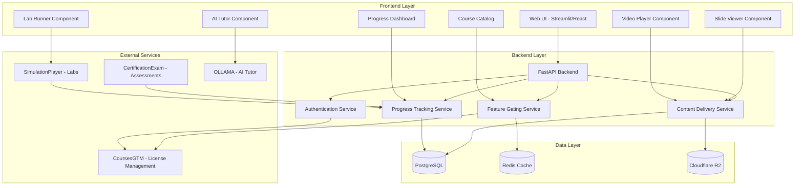
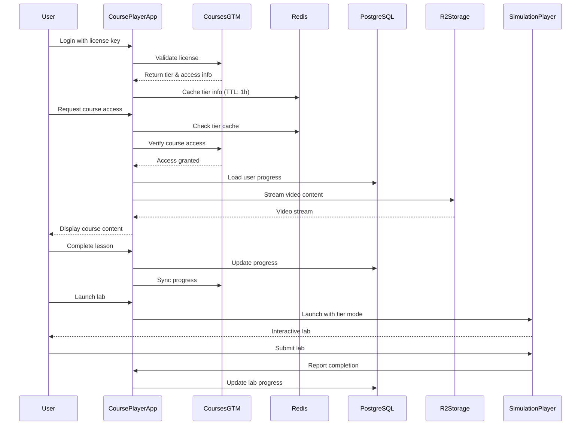
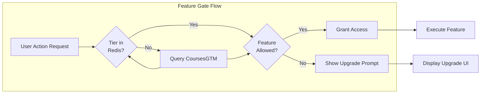
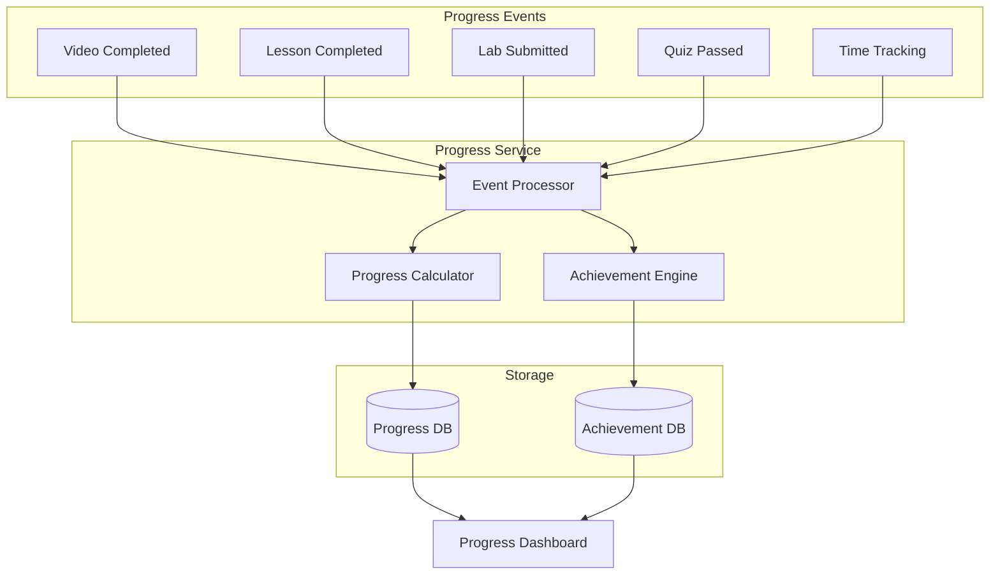
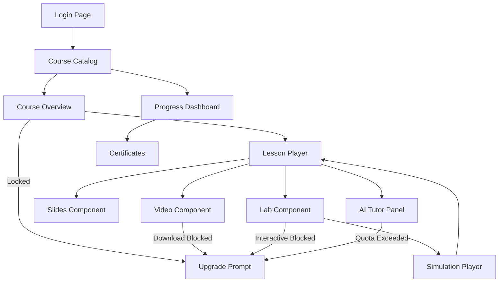
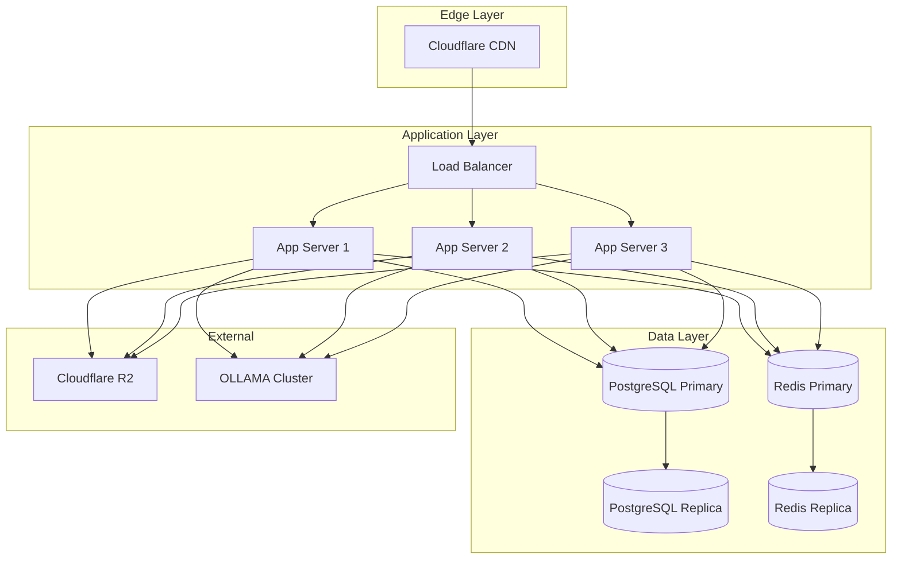

# CoursePlayerApp - System Architecture

## System Overview

### Purpose
CoursePlayerApp is a comprehensive learning experience platform designed to deliver high-quality educational content to students with tier-based access control. It serves as the primary interface for students to consume course materials, interact with AI tutors, complete hands-on labs, and track their learning progress.

### Target Users
- **Students**: Learners enrolled in data science courses across three subscription tiers (Basic, Intermediate, Advanced)
- **Instructors**: Course creators who need analytics on student engagement
- **Administrators**: Platform managers who oversee user access and system health

### Core Features
1. **Multi-Format Content Delivery**
   - High-quality video streaming with adaptive bitrate
   - Interactive slide presentations
   - Downloadable course materials (tier-gated)
   - Code examples and datasets

2. **Tier-Based Feature Gating**
   - Real-time access control based on subscription tier
   - Feature availability matrix (Basic → Intermediate → Advanced)
   - Seamless upgrade prompts

3. **Hands-On Learning**
   - Interactive Jupyter notebook labs
   - Integration with SimulationPlayer for complex scenarios
   - View-only and interactive modes based on tier

4. **AI-Powered Assistance**
   - Context-aware AI tutor using OLLAMA
   - Quota management (50/month for Intermediate, unlimited for Advanced)
   - Code assistance and concept clarification

5. **Progress Tracking & Achievements**
   - Comprehensive progress dashboard
   - Achievement system with badges
   - Learning streaks and time tracking
   - Certificate generation upon completion

6. **Accessibility & UX**
   - WCAG 2.1 AA compliant
   - Responsive design (mobile, tablet, desktop)
   - Keyboard navigation support
   - Screen reader compatibility

---

## High-Level Architecture

### Component Architecture



### Data Flow Architecture



### Feature Gating Mechanism



### Progress Tracking System



---

## Technology Stack

### Frontend
**Option 1: Streamlit (Recommended for MVP)**
- **Pros**: Rapid development, Python-native, easy deployment
- **Cons**: Less flexibility for complex UX
- **Use Case**: Quick prototype, internal tools, data science focus

**Option 2: React + TypeScript**
- **Pros**: Full control, rich ecosystem, better performance
- **Cons**: Longer development time
- **Use Case**: Production-grade platform, complex interactions

**Recommended Choice**: Start with Streamlit for MVP, migrate to React for v2.0

**Key Libraries**:
- **Video Player**: Video.js or Plyr.js (HLS/DASH support)
- **PDF Viewer**: PDF.js or react-pdf
- **Code Editor**: Monaco Editor (VS Code engine)
- **Terminal**: xterm.js
- **Charts**: Plotly or Chart.js
- **State Management**: React Context/Redux (if React)

### Backend
**Framework**: FastAPI (Python 3.11+)

**Key Features**:
- Async request handling
- Automatic OpenAPI documentation
- Type hints with Pydantic
- WebSocket support for real-time features

**Structure**:
```
backend/
├── api/
│   ├── routes/
│   │   ├── auth.py
│   │   ├── courses.py
│   │   ├── content.py
│   │   ├── progress.py
│   │   └── ai_tutor.py
│   ├── models/
│   ├── schemas/
│   └── dependencies.py
├── services/
│   ├── feature_gate.py
│   ├── progress_tracker.py
│   ├── content_delivery.py
│   └── ollama_client.py
├── integrations/
│   ├── coursesgtm_client.py
│   ├── simulation_player_client.py
│   └── r2_client.py
└── main.py
```

### Database
**PostgreSQL 15+**

**Schema Design**:
```sql
-- Users table (synced from CoursesGTM)
CREATE TABLE users (
    user_id UUID PRIMARY KEY,
    email VARCHAR(255) UNIQUE NOT NULL,
    license_key VARCHAR(100) UNIQUE,
    tier VARCHAR(20) NOT NULL,
    created_at TIMESTAMP DEFAULT NOW(),
    last_login TIMESTAMP
);

-- Course progress
CREATE TABLE course_progress (
    id SERIAL PRIMARY KEY,
    user_id UUID REFERENCES users(user_id),
    course_id VARCHAR(50) NOT NULL,
    current_lesson VARCHAR(50),
    completion_percentage DECIMAL(5,2),
    total_time_spent INTEGER DEFAULT 0,
    last_accessed TIMESTAMP,
    UNIQUE(user_id, course_id)
);

-- Lesson progress
CREATE TABLE lesson_progress (
    id SERIAL PRIMARY KEY,
    user_id UUID REFERENCES users(user_id),
    course_id VARCHAR(50) NOT NULL,
    lesson_id VARCHAR(50) NOT NULL,
    completed BOOLEAN DEFAULT FALSE,
    time_spent INTEGER DEFAULT 0,
    completed_at TIMESTAMP,
    UNIQUE(user_id, course_id, lesson_id)
);

-- Lab progress
CREATE TABLE lab_progress (
    id SERIAL PRIMARY KEY,
    user_id UUID REFERENCES users(user_id),
    course_id VARCHAR(50) NOT NULL,
    lab_id VARCHAR(50) NOT NULL,
    status VARCHAR(20) DEFAULT 'not_started',
    score DECIMAL(5,2),
    attempts INTEGER DEFAULT 0,
    completed_at TIMESTAMP,
    UNIQUE(user_id, course_id, lab_id)
);

-- Achievements
CREATE TABLE user_achievements (
    id SERIAL PRIMARY KEY,
    user_id UUID REFERENCES users(user_id),
    achievement_id VARCHAR(50) NOT NULL,
    unlocked_at TIMESTAMP DEFAULT NOW(),
    UNIQUE(user_id, achievement_id)
);

-- AI Tutor usage
CREATE TABLE ai_tutor_usage (
    id SERIAL PRIMARY KEY,
    user_id UUID REFERENCES users(user_id),
    month DATE NOT NULL,
    questions_asked INTEGER DEFAULT 0,
    quota_limit INTEGER,
    UNIQUE(user_id, month)
);

CREATE INDEX idx_course_progress_user ON course_progress(user_id);
CREATE INDEX idx_lesson_progress_user ON lesson_progress(user_id, course_id);
CREATE INDEX idx_lab_progress_user ON lab_progress(user_id, course_id);
```

### Cache Layer
**Redis 7+**

**Use Cases**:
- Session management (JWT tokens)
- Tier access cache (TTL: 1 hour)
- Course content metadata cache
- AI tutor quota tracking (real-time)
- Rate limiting

**Data Structures**:
```python
# Tier cache
tier:{user_id} -> {"tier": "advanced", "expires_at": "2024-12-31"}

# AI quota
ai_quota:{user_id}:{month} -> {"used": 45, "limit": 50}

# Session
session:{token} -> {"user_id": "...", "tier": "...", "expires": "..."}

# Rate limit
ratelimit:{user_id}:{endpoint} -> count (TTL: 60s)
```

### Storage
**Cloudflare R2 (S3-compatible)**

**Bucket Structure**:
```
courses-content/
├── videos/
│   ├── {course_id}/
│   │   ├── {lesson_id}/
│   │   │   ├── 720p.m3u8
│   │   │   ├── 1080p.m3u8
│   │   │   ├── 4k.m3u8
│   │   │   └── segments/
├── slides/
│   ├── {course_id}/
│   │   ├── {lesson_id}.pdf
│   │   └── {lesson_id}.pptx
├── materials/
│   ├── {course_id}/
│   │   ├── code_examples/
│   │   └── datasets/
└── transcripts/
    ├── {course_id}/
        └── {lesson_id}.vtt
```

**CDN**: Cloudflare CDN (automatic with R2)

### AI Service
**OLLAMA (Local LLM)**

**Model**: Llama 2 7B or CodeLlama 7B

**Configuration**:
```yaml
ollama:
  model: llama2:7b
  temperature: 0.7
  max_tokens: 500
  context_window: 4096
  system_prompt: |
    You are a helpful AI tutor for data science courses.
    Provide clear, concise explanations.
    Reference course materials when possible.
    Encourage learning without giving complete answers.
```

**Hosting**: Self-hosted on GPU instance (NVIDIA T4 or better)

### External Integrations

**CoursesGTM API**:
```
Base URL: https://api.coursesgtm.com/v1
Endpoints:
  - POST /validate-license
  - GET /user/{user_id}/tier
  - GET /courses/available?tier={tier}
  - POST /progress/update
  - POST /achievements/unlock
```

**SimulationPlayer API**:
```
Base URL: https://simulations.internal/api/v1
Endpoints:
  - POST /launch
  - POST /complete
  - GET /status/{session_id}
```

---

## UI/UX Design

### Page Layouts

#### 1. Course Catalog Page
```
┌─────────────────────────────────────────────┐
│  [Logo]  Courses  My Progress  [User Menu] │
├─────────────────────────────────────────────┤
│  Course Catalog                              │
│  ┌──────────────────────────────────────┐   │
│  │ Search: [___________] [Filter ▼]     │   │
│  └──────────────────────────────────────┘   │
│                                              │
│  ┌──────────┐ ┌──────────┐ ┌──────────┐    │
│  │ Course 1 │ │ Course 2 │ │ Course 3 │    │
│  │  [img]   │ │  [img]   │ │  🔒      │    │
│  │  Title   │ │  Title   │ │  Title   │    │
│  │  4h 30m  │ │  6h 15m  │ │  8h 00m  │    │
│  │ [Start] │ │ [Continue]│ │ [Upgrade]│    │
│  └──────────┘ └──────────┘ └──────────┘    │
└─────────────────────────────────────────────┘
```

#### 2. Course Player Page
```
┌─────────────────────────────────────────────────────────┐
│  [Logo]  ← Back to Catalog            [User Menu]      │
├──────────────┬──────────────────────────────────────────┤
│ Course       │  Video Player                            │
│ Outline      │  ┌────────────────────────────────────┐  │
│              │  │                                    │  │
│ ✓ Intro      │  │        [▶]                        │  │
│ ▶ Lesson 1   │  │                                    │  │
│   - Video    │  └────────────────────────────────────┘  │
│   - Slides   │  [⏮] [⏯] [⏭]  Speed: 1x  Quality: 1080p │
│   - Lab      │                                          │
│   Lesson 2   │  Slides                  AI Tutor        │
│   Lesson 3   │  ┌─────────────┐        ┌────────────┐  │
│              │  │ Slide 1/15  │        │ Ask me     │  │
│ 📊 Progress: │  │             │        │ anything!  │  │
│    45%       │  │   [content] │        │            │  │
│              │  │             │        │ [Q: 45/50] │  │
└──────────────┴──┴─────────────┴────────┴────────────┴──┘
```

#### 3. Progress Dashboard
```
┌─────────────────────────────────────────────┐
│  [Logo]  Courses  My Progress  [User Menu] │
├─────────────────────────────────────────────┤
│  My Learning Progress                        │
│                                              │
│  ┌─────────────────────────────────────┐    │
│  │ Overall Progress:  🔵🔵🔵⚪⚪  45%  │    │
│  │ Courses Completed: 2/5               │    │
│  │ Time Spent: 24h 30m                  │    │
│  │ Learning Streak: 🔥 7 days           │    │
│  └─────────────────────────────────────┘    │
│                                              │
│  Active Courses                              │
│  ┌────────────────────────────────────┐     │
│  │ Data Science 101      [====> ] 65% │     │
│  │ Machine Learning      [=>    ] 25% │     │
│  └────────────────────────────────────┘     │
│                                              │
│  Achievements Unlocked (8/20)                │
│  🏆 🎯 ⭐ 🚀 📚 💡 🔥 ✨                   │
└─────────────────────────────────────────────┘
```

### Navigation Flow



### Responsive Design Breakpoints

**Mobile** (< 768px):
- Single column layout
- Stacked video + slides
- Collapsible course outline
- Bottom navigation bar

**Tablet** (768px - 1024px):
- Two column layout
- Side-by-side video + slides
- Persistent sidebar (collapsible)
- Top navigation bar

**Desktop** (> 1024px):
- Three column layout (sidebar, main, assistant)
- Picture-in-picture video
- Always visible navigation
- Keyboard shortcuts enabled

### Accessibility Features (WCAG 2.1 AA)

**Visual**:
- High contrast mode toggle
- Font size controls (100% - 200%)
- Color-blind friendly color schemes
- Text alternatives for all images

**Navigation**:
- Skip to main content link
- Keyboard shortcuts (documented)
- Focus indicators (3px solid border)
- Logical tab order

**Media**:
- Closed captions for all videos
- Transcripts available for download
- Audio descriptions (for complex visuals)
- Adjustable playback speed

**Forms & Interactions**:
- Clear labels for all inputs
- Error messages with suggestions
- Confirmation for destructive actions
- Timeout warnings (with extend option)

**Testing Checklist**:
- ✅ Automated: axe DevTools, Lighthouse
- ✅ Screen reader: NVDA (Windows), VoiceOver (Mac)
- ✅ Keyboard-only navigation test
- ✅ Color contrast checker
- ✅ Responsive design test (multiple devices)

---

## Deployment Architecture

### Production Environment



### Scaling Strategy

**Horizontal Scaling**:
- Auto-scale app servers (min: 2, max: 10)
- Trigger: CPU > 70% or Request latency > 500ms
- Scale down delay: 10 minutes

**Database Scaling**:
- Primary-replica setup (1 primary, 2 replicas)
- Read queries → replicas
- Write queries → primary
- Connection pooling: PgBouncer (max 100 connections)

**Caching Strategy**:
- L1: Application-level cache (in-memory, 100MB)
- L2: Redis cache (10GB)
- L3: CDN cache (Cloudflare, unlimited)
- TTLs: User tier (1h), Course metadata (24h), Static content (7d)

**Performance Targets**:
- Page load time: < 3s (p95)
- API response time: < 200ms (p95)
- Video startup time: < 2s
- Time to interactive: < 5s

---

## Security Architecture

### Authentication & Authorization

**Authentication Flow**:
1. User enters license key
2. CoursePlayerApp validates with CoursesGTM
3. JWT token issued (expires: 24h)
4. Token stored in httpOnly cookie
5. Refresh token stored securely (expires: 30d)

**Authorization**:
- Role-based access control (RBAC)
- Feature flags checked on every API call
- Redis cache for tier info (TTL: 1h)
- Fallback to CoursesGTM if cache miss

**Security Measures**:
- HTTPS only (TLS 1.3)
- CORS configured (whitelist origins)
- Rate limiting (100 req/min per user)
- Input validation (Pydantic schemas)
- SQL injection prevention (parameterized queries)
- XSS prevention (Content Security Policy)
- CSRF protection (tokens)

### Data Privacy

**User Data**:
- Personal data encrypted at rest (AES-256)
- No third-party analytics (use Plausible/Umami)
- GDPR compliant (data export, deletion)
- Session data cleared on logout

**Content Protection**:
- Signed URLs for video access (expires: 1h)
- Watermarking on downloaded content
- DRM for Advanced tier (optional)
- Download tracking and limits

---

## Monitoring & Observability

**Metrics** (Prometheus + Grafana):
- Request rate, error rate, duration (RED method)
- Database connection pool stats
- Cache hit/miss ratio
- Video playback metrics
- AI tutor usage

**Logging** (Structured JSON):
- Application logs (INFO, WARN, ERROR)
- Access logs (user actions)
- Audit logs (tier changes, downloads)
- Error tracking (Sentry)

**Tracing** (OpenTelemetry):
- Distributed tracing across services
- Database query performance
- External API calls

**Alerts**:
- Error rate > 5% (critical)
- API latency > 1s p95 (warning)
- Database connections > 80% (warning)
- Disk usage > 85% (critical)

---

## Development Workflow

**Local Development**:
```bash
# Start all services
docker-compose up -d

# Services:
- Web UI: http://localhost:8501 (Streamlit) or :3000 (React)
- API: http://localhost:8000
- PostgreSQL: localhost:5432
- Redis: localhost:6379
- OLLAMA: localhost:11434
- Mocked CoursesGTM: localhost:8001
- Mocked SimulationPlayer: localhost:8002
```

**Testing Strategy**:
- Unit tests: pytest (>80% coverage)
- Integration tests: pytest + TestClient
- E2E tests: Playwright or Cypress
- Load tests: Locust (1000 concurrent users)

**CI/CD Pipeline**:
1. Lint (ruff, black, mypy)
2. Unit tests
3. Integration tests
4. Build Docker image
5. Push to registry
6. Deploy to staging
7. E2E tests on staging
8. Deploy to production (with approval)

---

## Future Enhancements

**Phase 2**:
- Mobile apps (React Native)
- Offline mode (PWA with service workers)
- Live classes (WebRTC integration)
- Community forums
- Peer code review

**Phase 3**:
- Advanced analytics (learning patterns)
- Personalized learning paths (ML recommendations)
- Gamification (leaderboards, competitions)
- Multi-language support
- API for third-party integrations

---

## Conclusion

CoursePlayerApp is designed as a scalable, secure, and user-friendly learning platform that delivers a premium educational experience with tier-based monetization. The architecture supports:

- **Fast performance** (< 3s page loads)
- **High availability** (99.9% uptime)
- **Secure access control** (JWT + feature gating)
- **Excellent UX** (responsive, accessible)
- **Easy integration** (modular, API-first)

This foundation enables rapid feature development while maintaining quality and reliability.
