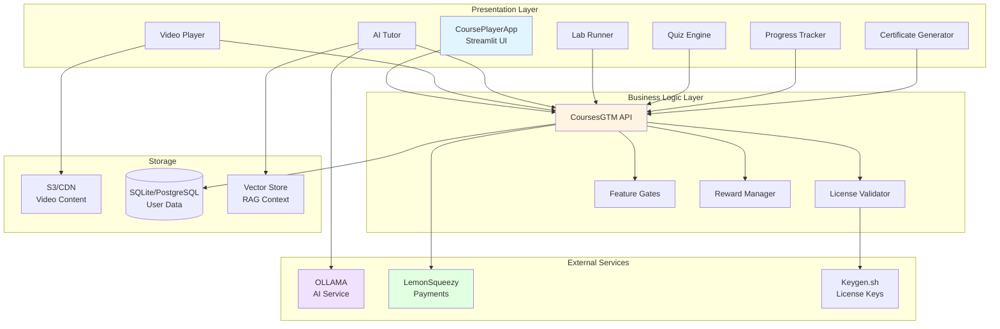
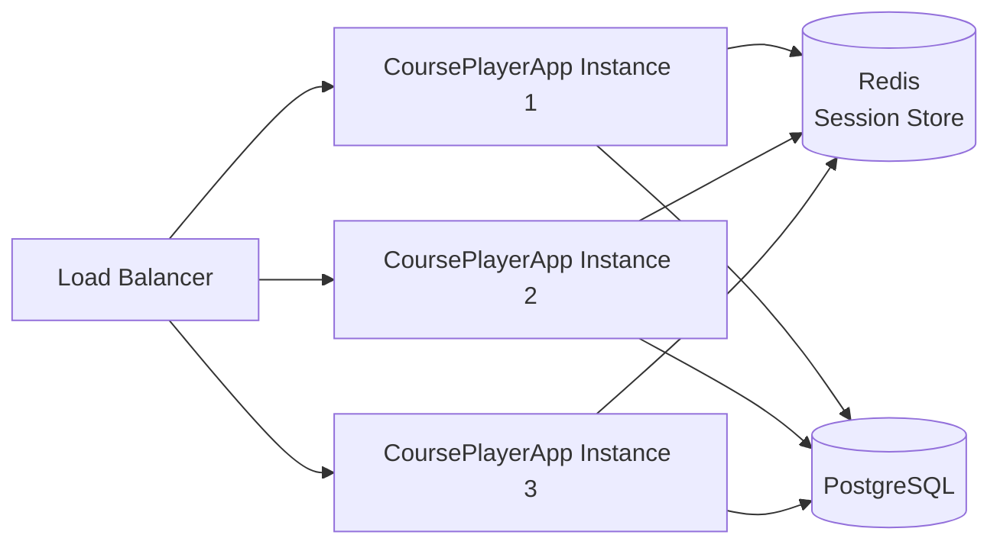

# CoursePlayerApp Architecture

## Purpose & Vision

CoursePlayerApp is a modular, license-aware learning platform designed to deliver interactive course content with features dynamically gated by license tiers. It serves as the presentation/delivery layer that works in conjunction with CoursesGTM (business logic layer) to provide a comprehensive learning experience.

### Key Objectives

- **Modularity**: Components can be developed, tested, and deployed independently
- **Reusability**: Deployable for any course product by swapping CoursesGTM configuration
- **License-Aware**: All features respect tier boundaries (Basic/Intermediate/Advanced)
- **Scalability**: Supports individual learners through enterprise deployments
- **Monetization-First**: Every feature is designed with tier-aware revenue optimization

## High-Level Architecture



## System Architecture Layers

### 1. Presentation Layer (CoursePlayerApp)

The presentation layer is built with Streamlit and provides an interactive, multi-page web interface for learners.

**Core Components:**
- **Video Player**: HLS/DASH streaming with tier-based features (download, transcripts, annotations)
- **AI Tutor**: Chat interface powered by OLLAMA with quota management
- **Lab Runner**: Interactive notebook environment (view-only to full JupyterLab)
- **Quiz Engine**: Assessment system with auto-grading and analytics
- **Progress Tracker**: Gamification with XP, streaks, and achievements
- **Certificate Generator**: Verifiable certificate creation with digital signatures
- **Dataset Explorer**: Course dataset browser and downloader
- **Code Review System**: Automated and manual project review

**Responsibilities:**
- Render UI components based on license tier
- Handle user interactions and navigation
- Display content (video, slides, labs)
- Manage local state and session
- Call CoursesGTM API for business logic
- Implement feature gating middleware

### 2. Business Logic Layer (CoursesGTM)

Handles all business rules, license validation, and feature permissions.

**Core Services:**
- License validation and tier determination
- Feature access control
- Curriculum and course structure
- Progress tracking and analytics
- Reward and achievement management
- Payment and subscription handling

**API Endpoints Used by CoursePlayerApp:**
- `GET /api/v1/license/validate` - Validate license key
- `GET /api/v1/license/features` - Get enabled features for tier
- `GET /api/v1/courses/{id}` - Get course content
- `POST /api/v1/progress/update` - Update learning progress
- `GET /api/v1/rewards/check` - Check unlocked achievements
- `POST /api/v1/ai-tutor/quota` - Check/decrement AI tutor quota

### 3. External Services

**OLLAMA (AI Service):**
- Local LLM inference for AI tutoring
- Model selection based on tier (llama3.2:3b vs llama3.1:8b)
- Streaming responses for real-time chat
- Embeddings for RAG implementation

**LemonSqueezy (Payment Provider):**
- License purchase and activation
- Subscription management
- Upgrade/downgrade handling
- Webhook notifications for payment events

**Keygen.sh (License Key Service):**
- License key generation and validation
- Offline validation support
- Key revocation and renewal
- Usage tracking

### 4. Storage Layer

**Content Storage (S3/Local):**
- Video files (HLS segments, DASH manifests)
- Slide decks (PDF, HTML)
- Lab notebooks (Jupyter .ipynb)
- Datasets (CSV, Parquet)
- Static assets

**User Data (SQLite/PostgreSQL):**
- Local progress cache (offline mode)
- User preferences and settings
- Chat history
- Submission tracking

**Vector Store (ChromaDB/Pinecone):**
- Course content embeddings for RAG
- Semantic search for AI tutor context
- Question-answer pair indexing

## Design Principles

### 1. Feature Gating via Middleware

All tier-restricted features are protected by decorators and middleware:

```python
@requires_feature('video_download')
def download_video_handler(video_id: str):
    """Only accessible to Intermediate+ tiers"""
    pass

@requires_tier('advanced')
def enable_offline_mode():
    """Only accessible to Advanced tier"""
    pass

@quota_limited('ai_tutor_quota')
def ask_ai_question(question: str):
    """Quota-limited based on tier"""
    pass
```

### 2. Component Reusability

Components are self-contained and reusable across different course products:

- **Modular Design**: Each component is independent with clear interfaces
- **Configuration-Driven**: Behavior controlled by config files
- **Product-Agnostic**: No hardcoded course-specific logic
- **API-First**: All business logic delegated to CoursesGTM

### 3. Tier-Aware UI Adaptation

UI adapts dynamically based on license tier:

- **Hidden**: Feature not visible (Basic users don't see AI Tutor)
- **Disabled**: Feature shown but disabled with upgrade prompt
- **Limited**: Feature available with restrictions (quota displays)
- **Full**: Complete access without limitations

### 4. Offline-First for Advanced Tier

Advanced tier users can download content for offline use:

- Content packaged in encrypted bundles
- License validation without internet (time-limited)
- Sync mechanism when reconnected
- Progress tracked locally and synced

### 5. Performance Optimization

**Caching Strategies:**
- Video segments cached locally (HLS)
- Course metadata cached in session state
- API responses cached with TTL
- Static assets served from CDN

**Lazy Loading:**
- Components loaded on-demand
- Video players initialized when visible
- Lab kernels started only when needed
- Large datasets loaded progressively

**Progressive Enhancement:**
- Core features work without JavaScript
- Enhanced features for modern browsers
- Graceful degradation for older browsers

## Technology Stack

### Frontend

**Streamlit 1.28+**
- Multi-page application framework
- Built-in state management
- Component library
- Session persistence
- File upload/download handling

**Custom Components:**
- Video player (HLS.js integration)
- Code editor (Monaco Editor)
- Markdown renderer with math support
- Chart visualization (Plotly)

### Backend (Optional)

**FastAPI**
- WebSocket support for real-time features
- Async API endpoints
- Background task processing
- File serving optimization

**Used For:**
- Video transcoding and streaming
- WebSocket connections for live updates
- File upload processing
- Background job queuing

### AI Services

**OLLAMA**
- Local LLM inference
- Model management
- Streaming support
- Embeddings generation

**Supported Models:**
- Basic tier: N/A (disabled)
- Intermediate: llama3.2:3b (lightweight)
- Advanced: llama3.1:8b (higher quality)

### Database

**SQLite (Local/Development)**
- Embedded database
- Zero configuration
- Offline mode support
- Good for single-user

**PostgreSQL (Production)**
- Multi-user support
- Better concurrency
- Advanced features
- Cloud-ready

### Deployment

**Docker Compose**
- Local development
- Service orchestration
- Easy setup
- Consistent environments

**Kubernetes**
- Production deployment
- Auto-scaling
- Load balancing
- High availability

## Module Structure

```
CoursePlayerApp/
├── courseplayerapp/           # Main application package
│   ├── core/                  # Core application logic
│   │   ├── app.py            # Main Streamlit entry point
│   │   ├── config.py         # Configuration management
│   │   ├── session.py        # Session state management
│   │   └── routing.py        # Page routing logic
│   │
│   ├── components/           # UI Components
│   │   ├── video/
│   │   │   ├── player.py     # Video player component
│   │   │   ├── downloader.py # Video download manager
│   │   │   └── transcript.py # Transcript viewer
│   │   │
│   │   ├── ai_tutor/
│   │   │   ├── chat_interface.py  # Chat UI
│   │   │   ├── quota_display.py   # Quota tracker
│   │   │   └── rag_engine.py      # RAG implementation
│   │   │
│   │   ├── labs/
│   │   │   ├── notebook_runner.py   # Jupyter integration
│   │   │   ├── code_executor.py     # Sandboxed execution
│   │   │   └── output_renderer.py   # Output display
│   │   │
│   │   ├── quiz/
│   │   │   ├── engine.py           # Quiz logic
│   │   │   ├── question_types.py   # Question renderers
│   │   │   └── grader.py           # Auto-grading
│   │   │
│   │   ├── progress/
│   │   │   ├── tracker.py          # Progress tracking
│   │   │   ├── gamification.py     # XP, streaks, levels
│   │   │   └── analytics.py        # Learning analytics
│   │   │
│   │   ├── certificates/
│   │   │   ├── generator.py        # PDF generation
│   │   │   ├── signature.py        # Digital signing
│   │   │   └── verification.py     # QR verification
│   │   │
│   │   ├── datasets/
│   │   │   ├── explorer.py         # Dataset browser
│   │   │   ├── viewer.py           # Data preview
│   │   │   └── downloader.py       # Download manager
│   │   │
│   │   └── code_review/
│   │       ├── submission.py       # Project submission
│   │       ├── automated_review.py # Automated checks
│   │       └── feedback.py         # Review display
│   │
│   ├── middleware/           # Feature gating and auth
│   │   ├── feature_gates.py  # Decorator implementations
│   │   ├── license_check.py  # License validation
│   │   └── quota_manager.py  # Quota enforcement
│   │
│   ├── integrations/         # External service clients
│   │   ├── coursesgtm_client.py  # CoursesGTM API
│   │   ├── ollama_client.py      # OLLAMA integration
│   │   ├── lemonsqueezy.py       # Payment webhooks
│   │   └── keygen_client.py      # License validation
│   │
│   ├── pages/                # Streamlit pages
│   │   ├── 00_🏠_Home.py
│   │   ├── 01_📚_Course_Browser.py
│   │   ├── 02_🎓_Learn.py
│   │   ├── 03_🧪_Labs.py
│   │   ├── 04_🤖_AI_Tutor.py
│   │   ├── 05_📊_Progress.py
│   │   ├── 06_🏆_Achievements.py
│   │   ├── 07_📜_Certificates.py
│   │   ├── 08_💾_Datasets.py
│   │   └── 09_⚙️_Settings.py
│   │
│   └── utils/                # Utility functions
│       ├── file_handler.py   # File operations
│       ├── cache_manager.py  # Caching utilities
│       ├── logger.py         # Logging setup
│       └── validators.py     # Input validation
│
├── config/                   # Configuration files
│   ├── feature_flags.json    # Feature tier mapping
│   ├── ui_config.json        # UI customization
│   └── integrations.json     # Service endpoints
│
├── tests/                    # Test suite
│   ├── unit/                 # Unit tests
│   ├── integration/          # Integration tests
│   └── e2e/                  # End-to-end tests
│
├── examples/                 # Example implementations
│   ├── basic_tier_demo.py
│   ├── intermediate_tier_demo.py
│   ├── advanced_tier_demo.py
│   └── integration_example.py
│
├── docker/                   # Docker configurations
│   ├── Dockerfile
│   ├── docker-compose.yml
│   └── docker-compose.prod.yml
│
├── k8s/                      # Kubernetes manifests
│   ├── deployment.yaml
│   ├── service.yaml
│   └── ingress.yaml
│
├── requirements.txt          # Python dependencies
├── setup.py                  # Package setup
└── README.md                 # Project documentation
```

## Security Model

### 1. License Validation on Startup

```python
# On app initialization
license_key = get_license_key_from_env()
validation_result = coursesgtm_client.validate_license(license_key)

if not validation_result.valid:
    st.error("Invalid license. Please contact support.")
    st.stop()

# Store tier in session
st.session_state.tier = validation_result.tier
st.session_state.features = validation_result.enabled_features
```

### 2. Feature Gate Decorators

```python
def requires_feature(feature_name: str):
    def decorator(func):
        def wrapper(*args, **kwargs):
            if feature_name not in st.session_state.features:
                st.warning(f"Upgrade to unlock {feature_name}")
                return None
            return func(*args, **kwargs)
        return wrapper
    return decorator
```

### 3. Content Encryption for Paid Tiers

- Video segments encrypted with AES-256
- Decryption keys tied to license
- Key rotation on subscription renewal
- Watermarking for piracy prevention

### 4. Secure Offline Mode

**Offline Bundle Structure:**
```
offline_package/
├── content/              # Encrypted content
├── manifest.json         # Content index
├── license.signed        # Offline license (30-day validity)
└── verification.key      # Public key for signature check
```

**Offline License Validation:**
- License signed with CoursesGTM private key
- App verifies signature with public key
- Time-limited validation (30 days)
- Grace period for connectivity issues

### 5. API Security

- HTTPS only for all API calls
- API key authentication
- Rate limiting (per license)
- Request signing for sensitive operations

## Scalability Considerations

### 1. Horizontal Scaling for Multi-User Deployments

**Architecture:**


**Key Points:**
- Stateless application instances
- Session state in Redis
- Shared PostgreSQL database
- Load balancer for distribution

### 2. CDN for Video Delivery

**Video Delivery Pipeline:**
```
Origin Server → CDN Edge Nodes → User
     ↓
  Transcoding
     ↓
  HLS/DASH Segments
```

**Benefits:**
- Reduced latency (edge caching)
- Lower origin server load
- Better global distribution
- Automatic quality adaptation

### 3. Caching Strategies

**Multi-Level Caching:**

1. **Browser Cache** (Level 1)
   - Static assets (JS, CSS, images)
   - Video segments
   - TTL: 7 days

2. **Application Cache** (Level 2)
   - Course metadata
   - User preferences
   - Feature flags
   - TTL: 5 minutes

3. **API Response Cache** (Level 3)
   - CoursesGTM responses
   - License validation results
   - TTL: 1 minute

4. **Database Query Cache** (Level 4)
   - Frequently accessed data
   - Materialized views
   - TTL: Varies

### 4. Performance Targets

| Metric | Target | Tier |
|--------|--------|------|
| Page Load Time | < 2s | All |
| Video Start Time | < 3s | All |
| AI Response Time | < 5s | Intermediate |
| AI Response Time | < 3s | Advanced |
| Lab Kernel Start | < 10s | Intermediate |
| Lab Kernel Start | < 5s | Advanced |
| API Response | < 500ms | All |
| Database Query | < 100ms | All |

### 5. Resource Optimization

**Memory Management:**
- Lazy loading of components
- Unload inactive components
- Limit concurrent video streams
- Batch API requests

**Bandwidth Optimization:**
- Adaptive bitrate streaming
- Progressive image loading
- Compression (Gzip, Brotli)
- Delta updates for content

**CPU Optimization:**
- Async processing for heavy tasks
- Worker pools for parallel execution
- Offload to backend API when needed
- Efficient algorithms for data processing

## Deployment Architecture

### Development Environment
```
Developer Machine
├── Streamlit Dev Server (localhost:8501)
├── CoursesGTM Mock API (localhost:8000)
├── OLLAMA (localhost:11434)
└── SQLite Database
```

### Production Environment
```
Kubernetes Cluster
├── Ingress (HTTPS Termination)
├── CoursePlayerApp Pods (3+ replicas)
├── CoursesGTM Service
├── OLLAMA Service (GPU nodes)
├── Redis Cluster (Session Store)
├── PostgreSQL Cluster
└── S3 / CloudFront (Content CDN)
```

## Integration Points

### CoursePlayerApp → CoursesGTM
- License validation
- Feature permission checks
- Course content retrieval
- Progress updates
- Reward notifications

### CoursePlayerApp → OLLAMA
- Model selection
- Chat completions
- Embeddings generation
- Stream handling

### CoursePlayerApp → LemonSqueezy
- Webhook handling (via CoursesGTM)
- Upgrade flow initiation
- License activation

### CoursePlayerApp → Storage
- Video streaming
- Content downloads
- User file uploads
- Asset delivery

## Monitoring and Observability

**Metrics to Track:**
- Active users by tier
- Feature usage rates
- API response times
- Error rates
- Video playback quality
- AI response times
- Conversion rates (upgrade prompts)

**Logging:**
- Structured JSON logs
- Log levels: DEBUG, INFO, WARNING, ERROR
- Correlation IDs for request tracing
- PII scrubbing

**Alerting:**
- High error rates
- Slow API responses
- License validation failures
- OLLAMA service down
- Storage quota exceeded

## Future Enhancements

1. **Mobile Apps** - Native iOS/Android applications
2. **Progressive Web App** - Install as mobile app
3. **Social Learning** - Discussion forums, peer review
4. **Live Classes** - Real-time instructor-led sessions
5. **Team Features** - Enterprise collaboration tools
6. **Advanced Analytics** - ML-powered insights
7. **Marketplace** - Third-party plugin ecosystem
8. **White-Label** - Fully customizable branding

## Conclusion

CoursePlayerApp is architected as a scalable, modular, and license-aware learning platform that prioritizes:
- **User Experience**: Smooth, responsive interface
- **Monetization**: Effective tier-based feature gating
- **Flexibility**: Reusable across course products
- **Performance**: Optimized for scale
- **Security**: Protected content and user data

The separation of presentation (CoursePlayerApp) and business logic (CoursesGTM) enables independent development, testing, and deployment while maintaining a cohesive learning experience.
