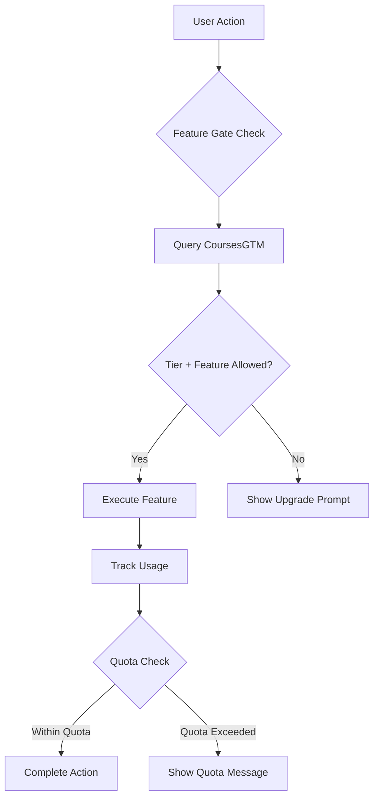
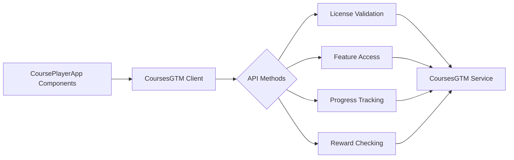
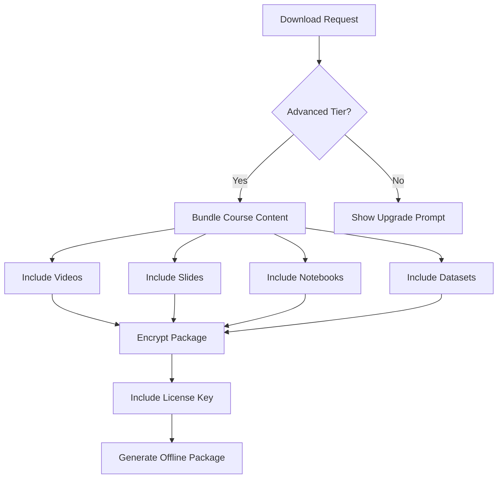
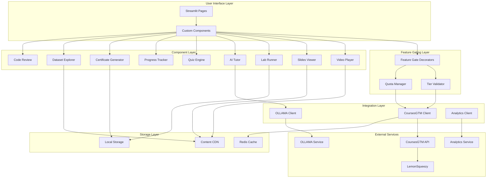
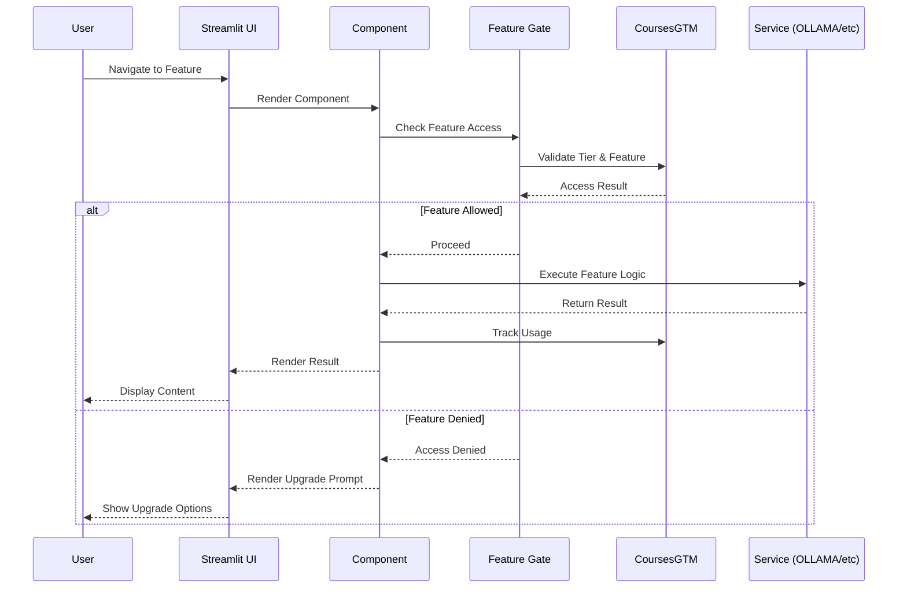
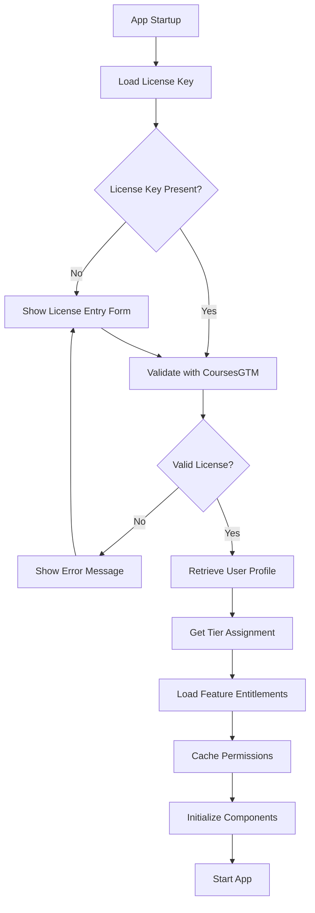
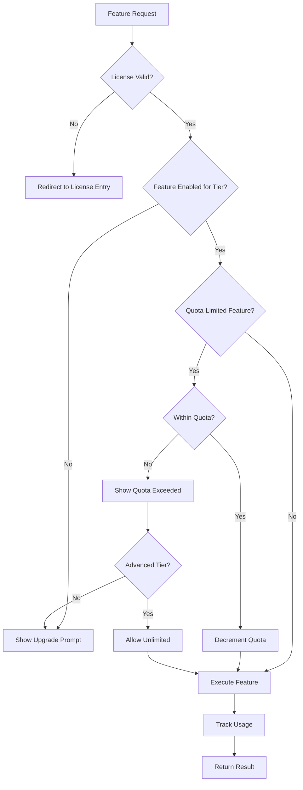

# CoursePlayerApp - Architecture Documentation

## Overview

**CoursePlayerApp** is the presentation layer for our course products, providing a modular, license-aware learning platform that delivers rich educational experiences while integrating with CoursesGTM for business logic, curriculum management, and access control.

## Module Purpose

CoursePlayerApp serves as the **presentation and user experience layer** for any course product, focusing on:

- **Content Delivery**: Video streaming, slides, interactive notebooks, datasets
- **User Interface**: Streamlit-based responsive learning interface
- **Interactive Features**: AI tutoring, quizzes, progress tracking, certificates
- **Offline Capabilities**: Advanced tier support for offline learning
- **Feature Gating**: Tier-based feature access and quota management

## Separation of Concerns

### CoursePlayerApp Responsibilities
- **UI/UX Layer**: User interface, navigation, and visual design
- **Content Rendering**: Display videos, slides, notebooks, and course materials
- **User Experience**: Interactive elements, progress tracking, achievements
- **Client-Side Logic**: Feature gate enforcement, UI state management
- **Local Services**: OLLAMA integration, JupyterLite/Lab execution
- **Offline Mode**: Content caching and offline package management (Advanced tier)

### CoursesGTM Responsibilities
- **Business Logic**: Course catalog, pricing, subscription management
- **Licensing**: License validation, tier assignment, expiration tracking
- **Access Control**: Course access permissions, feature entitlements
- **Curriculum Management**: Course structure, lesson ordering, prerequisites
- **Analytics**: User progress tracking, completion records
- **Payment Processing**: LemonSqueezy integration, purchase flows
- **Rewards System**: Unlock rewards, achievement tracking

## High-Level Architecture

### Component-Based Design

CoursePlayerApp uses a modular, component-based architecture where each component:
- Encapsulates specific functionality (video player, AI tutor, etc.)
- Integrates with the feature gating system
- Queries CoursesGTM for access permissions
- Adapts UI based on user's license tier
- Provides consistent API for rendering

### Feature Gating System

The feature gating system is the core architectural pattern that enables tier-based access:



### CoursesGTM Integration Layer

A dedicated integration layer abstracts all CoursesGTM interactions:



### Offline-First Capabilities

Advanced tier users can download offline packages:



## System Architecture Diagram



## Component Interaction Flow



## License Validation Flow



## Feature Gate Decision Tree



## Technology Stack

### Frontend
- **Primary Framework**: Streamlit 1.28+
  - Rapid prototyping and development
  - Built-in component system
  - Session state management
  - Native file upload/download
- **Optional Backend**: FastAPI (for advanced features)
  - WebSocket support for real-time updates
  - Custom API endpoints
  - Async processing

### Integration
- **CoursesGTM SDK**: Python client library
  - License validation
  - Feature access checking
  - Progress tracking
  - Reward management
- **HTTP Client**: `httpx` for async API calls
- **Caching**: Redis for session and permission caching

### AI/ML
- **OLLAMA**: Local LLM inference
  - Tier-based model selection
  - Context-aware responses
  - RAG (Retrieval Augmented Generation)
- **Embedding Models**: For semantic search in course materials
- **Text Processing**: LangChain for prompt management

### Notebooks
- **JupyterLite** (Intermediate tier)
  - Browser-based execution
  - Pyodide runtime
  - Limited library support
- **JupyterLab** (Advanced tier)
  - Full Python environment
  - GPU access (if available)
  - Custom kernels
  - Extensions support

### Certificates
- **ReportLab**: PDF generation
- **Cryptography**: Digital signatures
- **QR Code**: qrcode library for verification codes
- **Blockchain**: (Future) Ethereum/Polygon for immutable verification

### Video Streaming
- **HLS/DASH**: Adaptive bitrate streaming
- **Video.js**: Player UI
- **FFmpeg**: Video processing and transcoding

### Data Processing
- **Pandas**: Dataset manipulation
- **Polars**: High-performance data processing (Advanced tier)
- **DuckDB**: Embedded analytics database

### Development Tools
- **Poetry**: Dependency management
- **Black**: Code formatting
- **Pytest**: Testing framework
- **MyPy**: Static type checking

## Deployment Models

### Docker Compose (All Tiers)

Basic deployment using Docker Compose:

```yaml
services:
  courseplayerapp:
    image: courseplayerapp:latest
    environment:
      - TIER=${USER_TIER}
      - LICENSE_KEY=${LICENSE_KEY}
  ollama:
    image: ollama/ollama:latest
    volumes:
      - ollama_models:/root/.ollama
  redis:
    image: redis:7-alpine
```

**Use Cases**:
- Local development
- Single-user deployment
- Basic tier self-hosted instances

### Kubernetes (Advanced/Enterprise)

Production-grade deployment with Helm charts:

**Features**:
- Horizontal pod autoscaling
- Rolling updates
- Secret management via Kubernetes secrets
- Persistent volumes for content and user data
- Ingress for HTTPS termination
- Redis cluster for caching
- OLLAMA service with GPU nodes

**Use Cases**:
- Multi-user environments
- Enterprise deployments
- High-availability requirements

### Standalone Executable (Future)

Self-contained desktop application:

**Features**:
- Embedded Python runtime
- Bundled OLLAMA models
- Local SQLite database
- Auto-update mechanism
- Offline license validation

**Use Cases**:
- Individual learners
- Air-gapped environments
- Offline learning scenarios

## Security Considerations

### License Key Storage
- **Environment Variables**: Primary method for server deployments
- **Encrypted Config Files**: For desktop applications
- **Keychain Integration**: macOS/Windows credential managers
- **Never Log**: License keys must never appear in logs

### Content Encryption
- **At Rest**: Encrypt course materials with AES-256
- **In Transit**: HTTPS/TLS for all API communications
- **DRM**: Optional content protection for premium courses
- **Watermarking**: Embed user identifier in downloadable content

### Secure Notebook Execution
- **Sandboxing**: Restricted file system access
- **Resource Limits**: CPU/memory quotas per execution
- **Network Isolation**: No internet access for untrusted code
- **Input Validation**: Sanitize all user inputs
- **Code Review**: Static analysis before execution

### Rate Limiting
- **API Calls**: Prevent abuse of CoursesGTM API
- **AI Tutor**: Quota enforcement per tier
- **Download Limits**: Prevent bulk content extraction
- **Login Attempts**: Brute force protection

### Data Privacy
- **Minimal Collection**: Only essential user data
- **Anonymized Telemetry**: Opt-in analytics
- **GDPR Compliance**: Right to deletion, data export
- **Local-First**: Processing on user's device when possible

### Authentication & Authorization
- **Session Tokens**: Secure, short-lived tokens
- **JWT**: For stateless API authentication
- **Role-Based Access**: Enterprise tier multi-user support
- **2FA**: Optional two-factor authentication (Enterprise)

### Dependency Security
- **SCA Scanning**: Regular vulnerability checks
- **Dependency Pinning**: Exact version specifications
- **Security Advisories**: Automated monitoring
- **Supply Chain**: Verify package signatures

## Performance Considerations

### Caching Strategy
- **Permission Cache**: Redis with 5-minute TTL
- **Content Cache**: CDN for static assets
- **API Response Cache**: Memoization for repeated calls
- **Browser Cache**: Static resources with versioning

### Lazy Loading
- **Component Loading**: Load components on-demand
- **Content Streaming**: Progressive video/slide loading
- **Pagination**: Limit initial data fetching
- **Virtual Scrolling**: For long lists

### Optimization
- **Code Splitting**: Separate bundles per tier
- **Asset Optimization**: Minified CSS/JS, compressed images
- **Database Indexing**: Optimize frequent queries
- **Async Processing**: Background tasks for heavy operations

## Monitoring & Observability

### Metrics
- **Performance**: Page load times, API latency
- **Usage**: Feature engagement, tier distribution
- **Errors**: Exception tracking, error rates
- **Business**: Conversion rates, upgrade funnel

### Logging
- **Structured Logs**: JSON format for parsing
- **Log Levels**: Debug, Info, Warning, Error, Critical
- **Correlation IDs**: Track requests across services
- **PII Redaction**: Automatic sensitive data removal

### Alerting
- **License Expiry**: Warn users before expiration
- **Quota Warnings**: Notify when approaching limits
- **Service Health**: Alert on service degradation
- **Security Events**: Suspicious activity detection

## Scalability

### Horizontal Scaling
- **Stateless Design**: Scale app servers independently
- **Session Affinity**: Optional sticky sessions
- **Load Balancing**: Round-robin or least connections
- **Database Sharding**: For enterprise scale

### Vertical Scaling
- **Resource Allocation**: CPU/memory based on tier
- **GPU Access**: Advanced tier notebook execution
- **Cache Sizing**: Redis memory based on user count

## Future Enhancements

### Planned Features
- **Mobile Apps**: iOS/Android native applications
- **Offline Sync**: Bi-directional sync for offline packages
- **Collaborative Learning**: Group study rooms
- **Live Sessions**: Real-time instructor-led classes
- **Blockchain Certificates**: Immutable credential verification
- **AR/VR Support**: Immersive learning experiences

### Technical Debt
- **Migration to FastAPI**: For better async support
- **GraphQL API**: More efficient data fetching
- **WebAssembly**: Better browser-based computation
- **Progressive Web App**: Installable web experience

## Related Documentation

- [Component Specifications](./COMPONENTS.md)
- [Feature Gating System](./FEATURE_GATES.md)
- [Integration Guide](./INTEGRATION.md)
- [UI/UX Specifications](./UI_UX_SPEC.md)
- [Deployment Guide](./DEPLOYMENT.md)
- [Testing Strategy](./TESTING.md)
- [Module README](../../CoursePlayerApp/README.md)

## Glossary

- **Tier**: Subscription level (Basic, Intermediate, Advanced, Enterprise)
- **Feature Gate**: Access control mechanism for tier-based features
- **Quota**: Usage limit for specific features (e.g., AI Tutor questions)
- **CoursesGTM**: Go-to-Market service for business logic and licensing
- **OLLAMA**: Local large language model inference engine
- **RAG**: Retrieval Augmented Generation for context-aware AI responses
- **JupyterLite**: Browser-based Jupyter notebook environment
- **HLS/DASH**: HTTP Live Streaming / Dynamic Adaptive Streaming over HTTP
