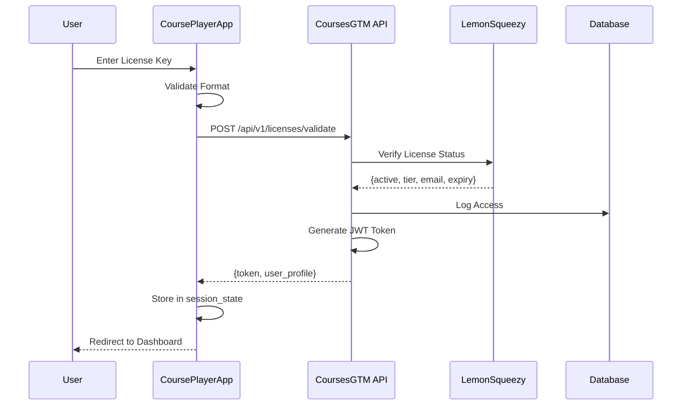

# Authentication & License Validation Specification

## Overview

CoursePlayerApp uses a **license-key based authentication system** that eliminates traditional username/password requirements. Users authenticate using license keys purchased from LemonSqueezy, which are validated through the CoursesGTM API.

---

## Authentication Flow

### High-Level Flow



---

## License Key Format

### Structure

License keys follow the LemonSqueezy format:

```
LMSQ-XXXX-XXXX-XXXX-XXXX
```

**Components**:
- Prefix: `LMSQ` (LemonSqueezy)
- 4 segments of 4 alphanumeric characters
- Separated by hyphens

**Validation Regex**:
```python
import re

LICENSE_KEY_PATTERN = r'^LMSQ-[A-Z0-9]{4}-[A-Z0-9]{4}-[A-Z0-9]{4}-[A-Z0-9]{4}$'

def is_valid_license_format(license_key: str) -> bool:
    """Validate license key format"""
    return bool(re.match(LICENSE_KEY_PATTERN, license_key.upper()))
```

---

## Authentication Implementation

### Login Page

**File**: `Home.py`

```python
import streamlit as st
import requests
from utils.validators import is_valid_license_format

st.set_page_config(
    page_title="GAI-Observe Academy - Login",
    page_icon="🎓",
    layout="centered"
)

def authenticate_user():
    """Main authentication logic"""
    
    # Check if already authenticated
    if st.session_state.get('authenticated', False):
        return True
    
    # Display login form
    render_login_form()
    
    return False


def render_login_form():
    """Render login interface"""
    
    # Center the form
    col1, col2, col3 = st.columns([1, 2, 1])
    
    with col2:
        # Logo
        st.image("assets/logo.png", width=200)
        
        # Title
        st.title("🎓 GAI-Observe Academy")
        st.markdown("**AI & Machine Learning Courses**")
        st.markdown("---")
        
        # Login section
        st.subheader("🔐 Login")
        st.write("Enter your license key to access your courses.")
        
        # License key input
        license_key = st.text_input(
            "License Key",
            type="password",
            placeholder="LMSQ-XXXX-XXXX-XXXX-XXXX",
            help="Your license key from LemonSqueezy purchase confirmation",
            key="license_input"
        )
        
        # Remember me
        remember_me = st.checkbox("Remember me on this device")
        
        # Login button
        col_btn1, col_btn2 = st.columns(2)
        
        with col_btn1:
            if st.button("🚀 Login", type="primary", use_container_width=True):
                handle_login(license_key, remember_me)
        
        with col_btn2:
            if st.button("🛒 Buy License", use_container_width=True):
                st.link_button("Visit Store", "https://gai-observe.com/store")
        
        st.markdown("---")
        
        # Help text
        with st.expander("❓ Need Help?"):
            st.write("""
            **Where do I find my license key?**
            - Check your LemonSqueezy purchase confirmation email
            - Login to your LemonSqueezy account
            
            **License not working?**
            - Ensure you copied the full key
            - Check that your subscription is active
            - Contact support: support@gai-observe.com
            """)
        
        st.caption("🔒 Secure license-based authentication • No password required")


def handle_login(license_key: str, remember_me: bool):
    """Handle login attempt"""
    
    # Validate input
    if not license_key:
        st.error("❌ Please enter your license key")
        return
    
    # Validate format
    if not is_valid_license_format(license_key):
        st.error("❌ Invalid license key format. Should be: LMSQ-XXXX-XXXX-XXXX-XXXX")
        return
    
    # Show loading state
    with st.spinner("🔄 Validating license..."):
        try:
            # Validate with CoursesGTM
            result = validate_license_with_api(license_key)
            
            if result['success']:
                # Store session data
                st.session_state['authenticated'] = True
                st.session_state['user_id'] = result['user_id']
                st.session_state['email'] = result['email']
                st.session_state['tier'] = result['tier']
                st.session_state['token'] = result['token']
                st.session_state['token_expires_at'] = result['token_expires_at']
                
                # Store in browser storage if remember_me
                if remember_me:
                    store_credentials_locally(license_key)
                
                # Success message
                st.success(f"✅ Welcome! Tier: {result['tier'].title()}")
                st.balloons()
                
                # Redirect to dashboard
                st.switch_page("pages/1_🏠_Dashboard.py")
            
            else:
                st.error("❌ Invalid license key. Please check and try again.")
        
        except Exception as e:
            st.error(f"❌ Authentication failed: {str(e)}")
            st.info("💡 Please check your internet connection and try again.")


def validate_license_with_api(license_key: str) -> dict:
    """Validate license key with CoursesGTM API"""
    
    API_URL = st.secrets.get("api_url", "https://api.coursesgtm.com")
    
    response = requests.post(
        f"{API_URL}/api/v1/licenses/validate",
        json={"license_key": license_key},
        timeout=10,
        headers={"Content-Type": "application/json"}
    )
    
    if response.status_code == 200:
        return response.json()
    elif response.status_code == 401:
        raise Exception("Invalid or expired license key")
    elif response.status_code == 429:
        raise Exception("Too many attempts. Please wait a moment and try again.")
    else:
        raise Exception(f"Server error ({response.status_code})")


def store_credentials_locally(license_key: str):
    """Store encrypted credentials in browser storage"""
    
    # Use Streamlit's browser storage (via JavaScript)
    js_code = f"""
    <script>
        localStorage.setItem('gai_license_key', '{license_key}');
    </script>
    """
    
    st.components.v1.html(js_code, height=0)


# Main execution
if __name__ == "__main__":
    if not authenticate_user():
        pass  # Show login form
```

---

## Session Management

### Session State Structure

```python
# Session state after successful login
st.session_state = {
    'authenticated': True,
    'user_id': 'user_12345',
    'email': 'student@example.com',
    'tier': 'intermediate',
    'token': 'eyJhbGciOiJIUzI1NiIsInR5cCI6IkpXVCJ9...',
    'token_expires_at': '2026-01-15T00:00:00Z',
    'login_time': '2026-01-14T08:00:00Z'
}
```

### Session Validation

**Every page should validate session**:

```python
# utils/auth.py
import streamlit as st
from datetime import datetime
import jwt

def require_auth():
    """Decorator to require authentication"""
    
    if not st.session_state.get('authenticated', False):
        st.error("🔐 Please login to access this page")
        st.switch_page("Home.py")
        st.stop()
    
    # Check token expiry
    if is_token_expired():
        st.warning("⏰ Your session has expired. Please login again.")
        logout()
        st.switch_page("Home.py")
        st.stop()


def is_token_expired() -> bool:
    """Check if JWT token is expired"""
    
    token = st.session_state.get('token')
    
    if not token:
        return True
    
    try:
        # Decode without verification to check expiry
        payload = jwt.decode(token, options={"verify_signature": False})
        exp_timestamp = payload.get('exp')
        
        if exp_timestamp:
            return datetime.now().timestamp() > exp_timestamp
        
        return False
    
    except jwt.InvalidTokenError:
        return True


def logout():
    """Clear session and logout"""
    
    # Clear all session state
    for key in list(st.session_state.keys()):
        del st.session_state[key]
    
    # Clear browser storage
    clear_browser_storage()


def clear_browser_storage():
    """Clear browser storage"""
    
    js_code = """
    <script>
        localStorage.removeItem('gai_license_key');
        sessionStorage.clear();
    </script>
    """
    
    st.components.v1.html(js_code, height=0)
```

### Adding Auth Check to Pages

```python
# pages/1_🏠_Dashboard.py
import streamlit as st
from utils.auth import require_auth

# Require authentication
require_auth()

# Page content
st.title("🏠 Dashboard")
# ...
```

---

## JWT Token Structure

### Token Payload

```json
{
  "user_id": "user_12345",
  "email": "student@example.com",
  "tier": "intermediate",
  "license_key": "LMSQ-XXXX-XXXX-XXXX-XXXX",
  "iat": 1705219200,
  "exp": 1705305600
}
```

### Token Generation (CoursesGTM Side)

```python
import jwt
from datetime import datetime, timedelta

def generate_token(user_data: dict) -> str:
    """Generate JWT token"""
    
    payload = {
        'user_id': user_data['user_id'],
        'email': user_data['email'],
        'tier': user_data['tier'],
        'license_key': user_data['license_key'],
        'iat': datetime.now(),
        'exp': datetime.now() + timedelta(hours=24)
    }
    
    token = jwt.encode(
        payload,
        SECRET_KEY,
        algorithm='HS256'
    )
    
    return token
```

### Token Validation (CoursePlayerApp Side)

```python
def validate_token(token: str) -> bool:
    """Validate JWT token"""
    
    try:
        payload = jwt.decode(
            token,
            SECRET_KEY,
            algorithms=['HS256']
        )
        return True
    except jwt.ExpiredSignatureError:
        return False
    except jwt.InvalidTokenError:
        return False
```

---

## Auto-Login (Remember Me)

### Implementation

```python
def check_auto_login():
    """Check for stored credentials and auto-login"""
    
    # Only run if not authenticated
    if st.session_state.get('authenticated'):
        return
    
    # Check browser storage
    stored_key = get_stored_license_key()
    
    if stored_key:
        try:
            result = validate_license_with_api(stored_key)
            
            if result['success']:
                # Auto-login successful
                st.session_state['authenticated'] = True
                st.session_state['user_id'] = result['user_id']
                st.session_state['email'] = result['email']
                st.session_state['tier'] = result['tier']
                st.session_state['token'] = result['token']
                
                return True
        
        except:
            # Invalid stored key - remove it
            clear_browser_storage()
    
    return False


def get_stored_license_key() -> str:
    """Retrieve stored license key from browser"""
    
    # This would use Streamlit component to read localStorage
    # Simplified version:
    return None  # Implement with JavaScript component
```

---

## Logout Functionality

### Logout Button

```python
# In sidebar or settings page
if st.sidebar.button("🚪 Logout"):
    logout()
    st.success("✅ Logged out successfully")
    st.switch_page("Home.py")
```

### Logout Function

```python
def logout():
    """Complete logout process"""
    
    # Optional: Call API to invalidate token
    try:
        invalidate_token_on_server(st.session_state.get('token'))
    except:
        pass
    
    # Clear session
    for key in list(st.session_state.keys()):
        del st.session_state[key]
    
    # Clear browser storage
    clear_browser_storage()
    
    # Redirect to login
    st.switch_page("Home.py")
```

---

## Security Considerations

### 1. Token Security

- **HTTPS Only**: Always use HTTPS in production
- **Short Expiry**: Tokens expire in 24 hours
- **Refresh Mechanism**: Implement token refresh before expiry
- **Secure Storage**: Never log tokens or store in insecure locations

### 2. License Key Protection

- **Masked Input**: Use `type="password"` for license input
- **No Client-Side Storage**: Only store encrypted/hashed version
- **Rate Limiting**: Limit login attempts to prevent brute force

### 3. Session Security

```python
def secure_session_check():
    """Additional security checks"""
    
    # Check session timeout (30 minutes inactivity)
    last_activity = st.session_state.get('last_activity')
    
    if last_activity:
        inactive_minutes = (datetime.now() - last_activity).total_seconds() / 60
        
        if inactive_minutes > 30:
            st.warning("⏰ Session timeout due to inactivity")
            logout()
            return False
    
    # Update last activity
    st.session_state['last_activity'] = datetime.now()
    
    return True
```

---

## Error Handling

### Common Error Scenarios

**1. Invalid License Key**
```python
if error_type == 'invalid_license':
    st.error("❌ Invalid license key")
    st.info("""
    Please check:
    - Copied the full key (LMSQ-XXXX-XXXX-XXXX-XXXX)
    - No extra spaces
    - Key is from LemonSqueezy purchase
    """)
```

**2. Expired License**
```python
if error_type == 'expired_license':
    st.error("❌ License has expired")
    st.info("Renew your subscription to continue learning.")
    if st.button("🔄 Renew Subscription"):
        st.link_button("Renew", "https://gai-observe.com/renew")
```

**3. Network Error**
```python
if error_type == 'network_error':
    st.error("❌ Connection error")
    st.info("Check your internet connection and try again.")
    if st.button("🔄 Retry"):
        st.rerun()
```

---

## Multi-Device Support

### Same License, Multiple Devices

```python
# License keys can be used on multiple devices
# Track active sessions in database

def check_concurrent_sessions(user_id: str) -> bool:
    """Check if too many concurrent sessions"""
    
    active_sessions = get_active_sessions(user_id)
    
    MAX_SESSIONS = 3  # Allow 3 concurrent devices
    
    if len(active_sessions) >= MAX_SESSIONS:
        st.warning(f"⚠️ You have {len(active_sessions)} active sessions")
        st.info("Maximum 3 devices allowed. Logout from another device to continue.")
        return False
    
    return True
```

---

## Testing

### Unit Tests

```python
def test_license_format_validation():
    assert is_valid_license_format("LMSQ-ABCD-1234-EFGH-5678") == True
    assert is_valid_license_format("INVALID-KEY") == False
    assert is_valid_license_format("") == False

def test_token_expiry():
    expired_token = generate_expired_token()
    assert is_token_expired(expired_token) == True
    
    valid_token = generate_valid_token()
    assert is_token_expired(valid_token) == False
```

### Integration Tests

```python
def test_login_flow():
    # Test valid login
    result = validate_license_with_api("TEST-VALID-KEY-1234-5678")
    assert result['success'] == True
    
    # Test invalid login
    with pytest.raises(Exception):
        validate_license_with_api("INVALID-KEY")
```

---

## Configuration

**`.streamlit/secrets.toml`**:

```toml
[api]
url = "https://api.coursesgtm.com"
timeout = 10

[security]
jwt_secret = "your-secret-key-here"
session_timeout_minutes = 30
max_concurrent_sessions = 3

[features]
remember_me_enabled = true
auto_refresh_token = true
```

---

## Future Enhancements

### Phase 2
- **OAuth Integration**: Support Google, GitHub login
- **Two-Factor Authentication**: Optional 2FA for security
- **Biometric Auth**: Fingerprint/Face ID on mobile
- **SSO**: Enterprise single sign-on

### Phase 3
- **Passwordless Magic Links**: Email-based login
- **Social Login**: LinkedIn, Twitter
- **Multi-Tenancy**: Organization accounts
- **Admin Dashboard**: License management interface

---

## Conclusion

The license-key based authentication system provides a simple, secure way for users to access CoursePlayerApp without managing passwords. Integration with LemonSqueezy and CoursesGTM ensures proper license validation and tier enforcement.

