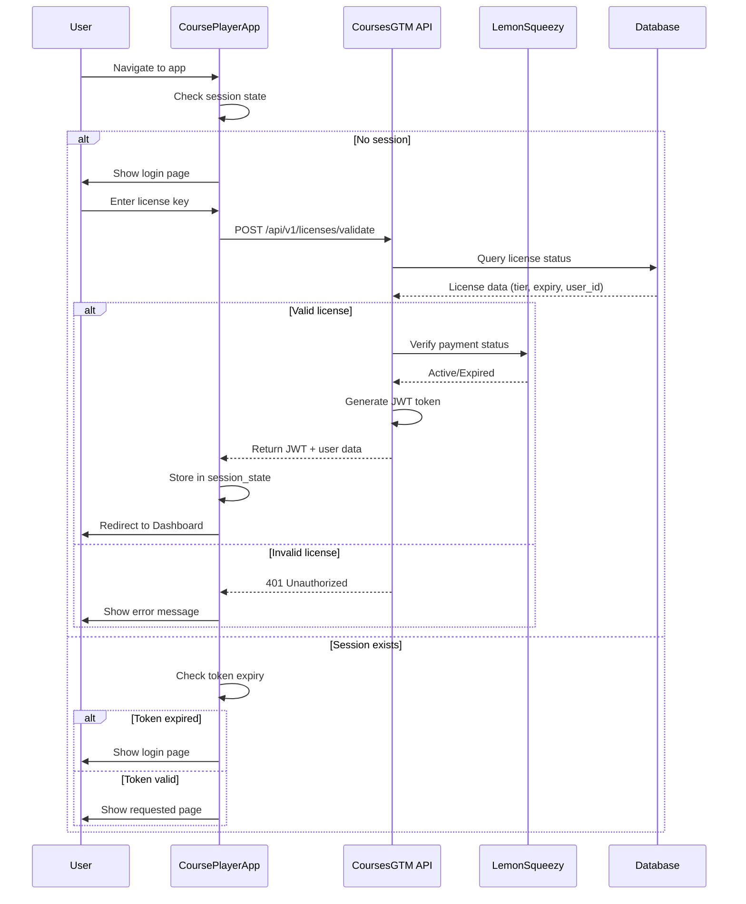

# CoursePlayerApp - Authentication & Security

## Overview

CoursePlayerApp uses a **license-based authentication** system where users authenticate with a license key (purchased from LemonSqueezy) instead of traditional username/password credentials. This document defines the authentication flow, session management, security measures, and token handling.

---

## Authentication Architecture

### Core Concept
- **No user accounts**: No username/password registration
- **License key only**: Users enter their license key to gain access
- **JWT sessions**: Secure token-based sessions with expiry
- **Tier-based access**: License determines tier (Basic/Intermediate/Advanced)
- **Validation via CoursesGTM**: Central API validates licenses and manages tiers



---

## License Key Format

### Structure
```
Format: XXXX-XXXX-XXXX-XXXX
Example: A3B7-C9D2-E4F6-G8H1
```

**Characteristics**:
- 16 characters (4 groups of 4)
- Alphanumeric (A-Z, 0-9, excluding O, I, l, 0 for clarity)
- Case-insensitive
- Hyphens for readability (optional when entering)

**Generation** (done by LemonSqueezy/CoursesGTM):
```python
import secrets
import string

def generate_license_key() -> str:
    """Generate a unique license key"""
    # Exclude confusing characters
    chars = ''.join(c for c in string.ascii_uppercase + string.digits if c not in 'OIL0')
    
    segments = []
    for _ in range(4):
        segment = ''.join(secrets.choice(chars) for _ in range(4))
        segments.append(segment)
    
    return '-'.join(segments)

# Example output: "A3B7-C9D2-E4F6-G8H1"
```

---

## Authentication Implementation

### Login Page

```python
# Home.py
import streamlit as st
import requests
from datetime import datetime, timedelta

def authenticate(license_key: str) -> bool:
    """
    Authenticate user with license key
    
    Args:
        license_key: License key entered by user
    
    Returns:
        bool: True if authentication successful, False otherwise
    """
    # Normalize license key (remove spaces, convert to uppercase)
    license_key = license_key.replace(' ', '').replace('-', '').upper()
    
    # Re-add hyphens
    formatted_key = '-'.join([license_key[i:i+4] for i in range(0, len(license_key), 4)])
    
    try:
        # Call CoursesGTM API
        response = requests.post(
            "https://api.coursesgtm.com/api/v1/licenses/validate",
            json={"license_key": formatted_key},
            timeout=10
        )
        
        if response.status_code == 200:
            data = response.json()
            
            # Store authentication data in session
            st.session_state["authenticated"] = True
            st.session_state["user_id"] = data["user_id"]
            st.session_state["email"] = data["email"]
            st.session_state["tier"] = data["tier"]
            st.session_state["token"] = data["token"]
            st.session_state["token_expires"] = data["expires_at"]
            st.session_state["license_key"] = formatted_key
            st.session_state["license_expires"] = data.get("license_expires")
            
            # Log successful login
            log_authentication_event("login_success", data["user_id"], data["tier"])
            
            return True
        
        elif response.status_code == 401:
            error_data = response.json()
            st.error(f"❌ {error_data.get('error', 'Invalid license key')}")
            
            # Log failed attempt
            log_authentication_event("login_failed", None, None, error=error_data.get('error'))
            
            return False
        
        else:
            st.error("⚠️ Server error. Please try again later.")
            return False
    
    except requests.exceptions.Timeout:
        st.error("⏱️ Request timed out. Please check your internet connection.")
        return False
    
    except requests.exceptions.RequestException as e:
        st.error(f"🌐 Network error: {str(e)}")
        return False


def log_authentication_event(event_type: str, user_id: str = None, tier: str = None, error: str = None):
    """Log authentication events for security monitoring"""
    from database import db
    
    db.execute("""
        INSERT INTO auth_events (event_type, user_id, tier, error, ip_address, user_agent, timestamp)
        VALUES (%s, %s, %s, %s, %s, %s, NOW())
    """, (event_type, user_id, tier, error, get_client_ip(), get_user_agent()))


# Login UI
st.title("🎓 GAI-Observe Academy")
st.markdown("### Welcome! Please enter your license key to continue.")

license_key = st.text_input(
    "License Key",
    type="password",
    placeholder="XXXX-XXXX-XXXX-XXXX",
    help="Enter the license key you received after purchase"
)

col1, col2, col3 = st.columns([1, 1, 2])

with col1:
    if st.button("🔐 Login", type="primary"):
        if license_key:
            with st.spinner("Validating license..."):
                if authenticate(license_key):
                    st.success("✅ Login successful!")
                    time.sleep(1)
                    st.switch_page("pages/1_🏠_Dashboard.py")
        else:
            st.warning("Please enter your license key")

with col2:
    if st.button("🔄 Reset"):
        st.rerun()

st.divider()

# Help section
with st.expander("❓ Need Help?"):
    st.markdown("""
    **Don't have a license key?**
    - [Purchase a license](https://payment.gai-observe.com)
    
    **Lost your license key?**
    - Check your purchase confirmation email
    - [Contact support](mailto:support@gai-observe.com)
    
    **License key not working?**
    - Make sure you're entering it correctly (hyphens are optional)
    - Verify your license hasn't expired
    - [Contact support](mailto:support@gai-observe.com)
    """)
```

---

## Session Management

### Session State Structure

```python
# Session state after successful authentication
{
    "authenticated": True,
    "user_id": "uuid-v4",
    "email": "student@example.com",
    "tier": "intermediate",
    "token": "eyJhbGciOiJIUzI1NiIsInR5cCI6IkpXVCJ9...",
    "token_expires": "2026-01-13T02:22:41Z",
    "license_key": "A3B7-C9D2-E4F6-G8H1",
    "license_expires": "2027-01-12"
}
```

### Session Validation Middleware

All pages should validate session before rendering:

```python
# utils/auth_middleware.py
import streamlit as st
from datetime import datetime

def require_authentication():
    """
    Middleware to enforce authentication on protected pages
    
    Usage: Place at top of every page except Home.py
    """
    if not st.session_state.get("authenticated"):
        st.warning("⚠️ Please log in to access this page")
        if st.button("Go to Login"):
            st.switch_page("Home.py")
        st.stop()
    
    # Check token expiry
    token_expires = st.session_state.get("token_expires")
    if token_expires:
        expiry_dt = datetime.fromisoformat(token_expires.replace('Z', '+00:00'))
        if datetime.now(expiry_dt.tzinfo) > expiry_dt:
            # Token expired - force re-login
            st.warning("⏱️ Your session has expired. Please log in again.")
            logout()
            if st.button("Go to Login"):
                st.switch_page("Home.py")
            st.stop()


# Usage in pages
# pages/1_🏠_Dashboard.py
from utils.auth_middleware import require_authentication

require_authentication()

# ... rest of page code
```

---

## JWT Token Details

### Token Structure

**Header**:
```json
{
  "alg": "HS256",
  "typ": "JWT"
}
```

**Payload**:
```json
{
  "user_id": "uuid-v4",
  "email": "student@example.com",
  "tier": "intermediate",
  "tier_id": 2,
  "iat": 1736647361,  // Issued at (Unix timestamp)
  "exp": 1736733761,  // Expires at (Unix timestamp, +24 hours)
  "iss": "CoursesGTM",
  "aud": "CoursePlayerApp"
}
```

**Signature**: HMAC SHA256 signed with secret key (shared between CoursesGTM and CoursePlayerApp)

### Token Validation

```python
# utils/jwt_validator.py
import jwt
from datetime import datetime

JWT_SECRET = "your-shared-secret-key"  # Must match CoursesGTM secret
JWT_ALGORITHM = "HS256"

def validate_jwt_token(token: str) -> dict:
    """
    Validate JWT token
    
    Returns:
        dict: Decoded token payload if valid
    
    Raises:
        jwt.ExpiredSignatureError: If token expired
        jwt.InvalidTokenError: If token invalid
    """
    try:
        payload = jwt.decode(
            token,
            JWT_SECRET,
            algorithms=[JWT_ALGORITHM],
            audience="CoursePlayerApp",
            issuer="CoursesGTM"
        )
        return payload
    
    except jwt.ExpiredSignatureError:
        raise Exception("Token expired")
    
    except jwt.InvalidTokenError as e:
        raise Exception(f"Invalid token: {str(e)}")


def refresh_token_if_needed(current_token: str) -> str:
    """
    Refresh token if it's expiring soon (within 1 hour)
    
    Returns:
        str: New token if refreshed, otherwise original token
    """
    try:
        payload = jwt.decode(current_token, JWT_SECRET, algorithms=[JWT_ALGORITHM], options={"verify_exp": False})
        exp = payload['exp']
        time_to_expiry = exp - datetime.now().timestamp()
        
        if time_to_expiry < 3600:  # Less than 1 hour remaining
            # Request new token from CoursesGTM
            from utils.api_client import CoursesGTMClient
            
            client = CoursesGTMClient()
            response = client.session.post(
                f"{client.base_url}/api/v1/token/refresh",
                headers={"Authorization": f"Bearer {current_token}"}
            )
            
            if response.status_code == 200:
                new_token = response.json()['token']
                st.session_state['token'] = new_token
                return new_token
        
        return current_token
    
    except Exception:
        return current_token
```

---

## Logout

### Logout Implementation

```python
# utils/auth.py
def logout():
    """Clear session state and log out user"""
    # Log logout event
    if st.session_state.get("user_id"):
        log_authentication_event("logout", st.session_state["user_id"], st.session_state.get("tier"))
    
    # Clear all session state
    for key in list(st.session_state.keys()):
        del st.session_state[key]
    
    st.success("✅ Logged out successfully")


# Settings page
if st.button("🚪 Logout"):
    logout()
    time.sleep(1)
    st.switch_page("Home.py")
```

---

## Security Measures

### 1. HTTPS Only
- All communication over TLS 1.3
- Strict Transport Security (HSTS) enabled
- Certificate pinning for production

### 2. Rate Limiting

Prevent brute-force attacks on license validation:

```python
# utils/rate_limiter.py
from collections import defaultdict
from datetime import datetime, timedelta
import streamlit as st

# In-memory rate limiter (use Redis in production)
login_attempts = defaultdict(list)

MAX_ATTEMPTS = 5
WINDOW_MINUTES = 15

def check_rate_limit(ip_address: str) -> bool:
    """
    Check if IP has exceeded login attempt limit
    
    Returns:
        bool: True if allowed, False if rate limited
    """
    now = datetime.now()
    cutoff = now - timedelta(minutes=WINDOW_MINUTES)
    
    # Remove old attempts
    login_attempts[ip_address] = [
        attempt for attempt in login_attempts[ip_address]
        if attempt > cutoff
    ]
    
    # Check limit
    if len(login_attempts[ip_address]) >= MAX_ATTEMPTS:
        return False
    
    # Record this attempt
    login_attempts[ip_address].append(now)
    return True


# Use in login function
def authenticate(license_key: str) -> bool:
    ip_address = get_client_ip()
    
    if not check_rate_limit(ip_address):
        st.error(f"⛔ Too many login attempts. Please try again in {WINDOW_MINUTES} minutes.")
        return False
    
    # ... rest of authentication logic
```

### 3. License Key Hashing

Store hashed license keys in database (not plaintext):

```python
import hashlib

def hash_license_key(license_key: str) -> str:
    """Hash license key for secure storage"""
    return hashlib.sha256(license_key.encode()).hexdigest()


# In database
CREATE TABLE licenses (
    id SERIAL PRIMARY KEY,
    license_key_hash VARCHAR(64) NOT NULL UNIQUE,
    tier VARCHAR(50),
    user_id VARCHAR(255),
    created_at TIMESTAMP DEFAULT NOW()
);
```

### 4. Session Timeout

Auto-logout after 24 hours (token expiry) or 30 minutes of inactivity:

```python
# utils/session_timeout.py
from datetime import datetime, timedelta

INACTIVITY_TIMEOUT_MINUTES = 30

def check_session_activity():
    """Check if session has been inactive too long"""
    last_activity = st.session_state.get("last_activity")
    
    if last_activity:
        last_activity_dt = datetime.fromisoformat(last_activity)
        if datetime.now() - last_activity_dt > timedelta(minutes=INACTIVITY_TIMEOUT_MINUTES):
            st.warning(f"⏱️ Session expired due to {INACTIVITY_TIMEOUT_MINUTES} minutes of inactivity")
            logout()
            st.switch_page("Home.py")
    
    # Update last activity
    st.session_state["last_activity"] = datetime.now().isoformat()


# Call on every page load
require_authentication()
check_session_activity()
```

### 5. IP Logging

Log IP addresses for security auditing:

```python
def get_client_ip() -> str:
    """Get client IP address (behind proxy)"""
    # Streamlit doesn't directly expose client IP
    # This would require custom server implementation
    return "unknown"  # Placeholder
```

### 6. Two-Factor Authentication (Optional Enhancement)

For high-value accounts (Advanced tier):

```python
# Future enhancement
def send_2fa_code(email: str):
    """Send 2FA code to user's email"""
    import random
    code = ''.join([str(random.randint(0, 9)) for _ in range(6)])
    
    # Send email with code
    send_email(
        to=email,
        subject="Your GAI-Observe Login Code",
        body=f"Your verification code is: {code}"
    )
    
    # Store code in session (temporary)
    st.session_state['2fa_code'] = code
    st.session_state['2fa_expiry'] = (datetime.now() + timedelta(minutes=5)).isoformat()
```

---

## License Expiry Handling

### Check License Expiry

```python
def check_license_expiry():
    """Check if license has expired"""
    license_expires = st.session_state.get("license_expires")
    
    if license_expires:
        expiry_dt = datetime.fromisoformat(license_expires)
        days_remaining = (expiry_dt - datetime.now()).days
        
        if days_remaining < 0:
            # License expired
            st.error("🚫 Your license has expired. Please renew to continue access.")
            st.button("Renew License", on_click=lambda: st.markdown("[Renew](https://payment.gai-observe.com/renew)"))
            logout()
            st.stop()
        
        elif days_remaining < 30:
            # Expiring soon
            st.warning(f"⚠️ Your license expires in {days_remaining} days. [Renew now](https://payment.gai-observe.com/renew)")
```

---

## Tier Verification

Verify tier on every protected action:

```python
def verify_tier_access(required_tier: str) -> bool:
    """
    Verify user's tier meets requirement
    
    Args:
        required_tier: Minimum tier required ('intermediate' or 'advanced')
    
    Returns:
        bool: True if user has sufficient tier
    """
    user_tier = st.session_state.get("tier", "basic")
    
    tier_hierarchy = {"basic": 1, "intermediate": 2, "advanced": 3}
    
    user_level = tier_hierarchy.get(user_tier, 0)
    required_level = tier_hierarchy.get(required_tier, 999)
    
    return user_level >= required_level
```

---

## Security Best Practices

### 1. Never Store Secrets in Code
Use environment variables:

```python
import os

JWT_SECRET = os.getenv("JWT_SECRET")
COURSESGTM_API_KEY = os.getenv("COURSESGTM_API_KEY")
```

### 2. Use HTTPS in Production
```python
# config.toml (Streamlit config)
[server]
enableCORS = false
enableXsrfProtection = true
```

### 3. Sanitize Inputs
```python
def sanitize_license_key(key: str) -> str:
    """Remove potentially malicious characters"""
    import re
    return re.sub(r'[^A-Z0-9-]', '', key.upper())
```

### 4. Log Security Events
```python
# Log all authentication events
def log_security_event(event_type: str, details: dict):
    """Log security-related events"""
    from database import db
    
    db.execute("""
        INSERT INTO security_logs (event_type, details, ip_address, timestamp)
        VALUES (%s, %s, %s, NOW())
    """, (event_type, json.dumps(details), get_client_ip()))
```

---

## Testing Authentication

```python
# tests/test_authentication.py
def test_valid_license():
    """Test authentication with valid license"""
    result = authenticate("A3B7-C9D2-E4F6-G8H1")
    assert result == True
    assert st.session_state['authenticated'] == True

def test_invalid_license():
    """Test authentication with invalid license"""
    result = authenticate("INVALID-KEY")
    assert result == False
    assert st.session_state.get('authenticated') != True

def test_token_expiry():
    """Test token expiry detection"""
    expired_token = generate_expired_jwt()
    st.session_state['token'] = expired_token
    
    with pytest.raises(Exception, match="Token expired"):
        validate_jwt_token(expired_token)

def test_rate_limiting():
    """Test rate limiting on login attempts"""
    ip = "192.168.1.1"
    
    for i in range(5):
        assert check_rate_limit(ip) == True
    
    # 6th attempt should be blocked
    assert check_rate_limit(ip) == False
```

---

## Conclusion

The license-based authentication system provides:
- **Simplicity**: No account creation, just enter license key
- **Security**: JWT tokens, rate limiting, session management
- **Tier enforcement**: Access control based on subscription level
- **Scalability**: Stateless authentication via JWT
- **Auditability**: Comprehensive logging of auth events

This approach aligns with the business model (pay for license, not account) while maintaining strong security.
