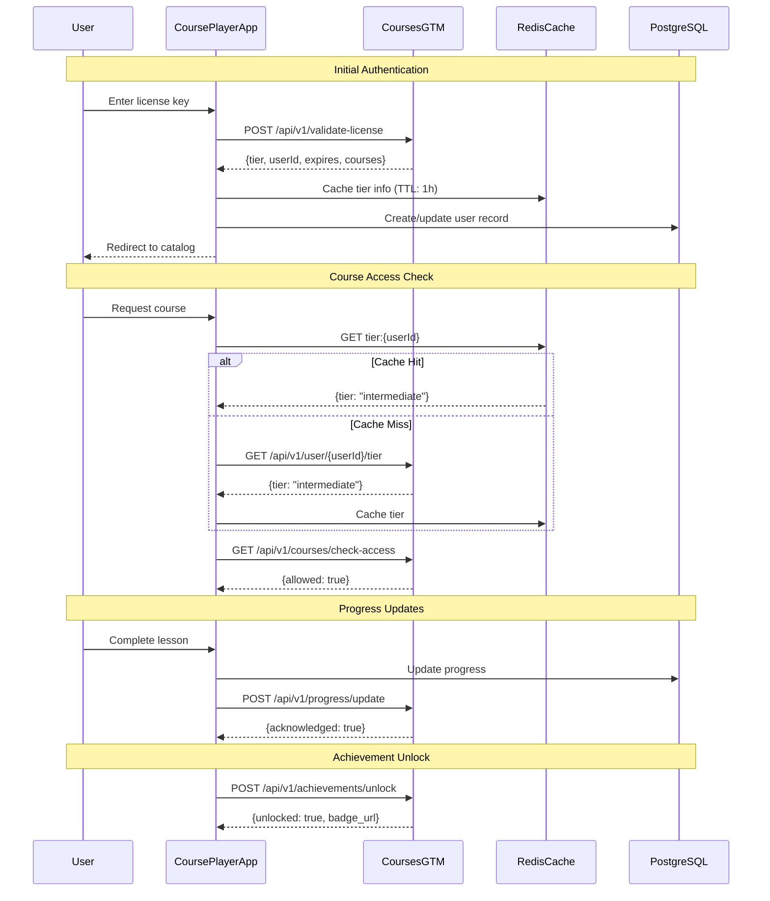

# CoursesGTM Integration

## Overview

CoursePlayerApp integrates with **CoursesGTM** (Courses Go-To-Market) for license management, tier validation, access control, and progress synchronization. This document specifies the integration architecture, API contracts, and data synchronization strategies.

---

## Integration Architecture



---

## CoursesGTM API Specification

### Base URL
```
Production:  https://api.coursesgtm.com/v1
Staging:     https://staging-api.coursesgtm.com/v1
Development: http://localhost:8001/api/v1
```

### Authentication
All API requests require authentication via Bearer token (JWT).

```http
Authorization: Bearer <access_token>
```

---

## API Endpoints

### 1. License Validation

**Endpoint**: `POST /api/v1/validate-license`

**Purpose**: Validate a license key and retrieve user tier and access information.

**Request**:
```json
{
  "license_key": "INTER-ABC123-XYZ789",
  "device_info": {
    "device_id": "unique-device-identifier",
    "platform": "web",
    "user_agent": "Mozilla/5.0..."
  }
}
```

**Response** (200 OK):
```json
{
  "valid": true,
  "user_id": "550e8400-e29b-41d4-a716-446655440000",
  "email": "user@example.com",
  "tier": "intermediate",
  "license_type": "annual",
  "issued_at": "2024-01-01T00:00:00Z",
  "expires_at": "2025-01-01T00:00:00Z",
  "courses_included": [
    "01_DataScientistToolbox",
    "02_RProgramming",
    "03_GettingData",
    "04_ExploratoryAnalysis",
    "05_ReproducibleResearch",
    "06_StatisticalInference",
    "07_RegressionModels",
    "08_PracticalMachineLearning"
  ],
  "access_token": "eyJhbGciOiJIUzI1NiIsInR5cCI6IkpXVCJ9...",
  "refresh_token": "eyJhbGciOiJIUzI1NiIsInR5cCI6IkpXVCJ9..."
}
```

**Response** (400 Bad Request):
```json
{
  "valid": false,
  "error": "invalid_license",
  "message": "License key not found or has been revoked",
  "upgrade_url": "https://courses.com/upgrade"
}
```

**Implementation**:
```python
import httpx
from typing import Dict, Optional

class CoursesGTMClient:
    def __init__(self, base_url: str, api_key: str):
        self.base_url = base_url
        self.api_key = api_key
        self.client = httpx.AsyncClient()
    
    async def validate_license(self, license_key: str, 
                               device_info: Optional[Dict] = None) -> Dict:
        """
        Validate a license key and retrieve user information.
        
        Args:
            license_key: The license key to validate
            device_info: Optional device information for tracking
            
        Returns:
            Dict containing validation result and user info
            
        Raises:
            httpx.HTTPError: If API request fails
        """
        response = await self.client.post(
            f"{self.base_url}/validate-license",
            json={
                "license_key": license_key,
                "device_info": device_info or {}
            },
            headers={"X-API-Key": self.api_key}
        )
        response.raise_for_status()
        return response.json()
```

---

### 2. Get User Tier

**Endpoint**: `GET /api/v1/user/{user_id}/tier`

**Purpose**: Retrieve current tier for a user (used for cache refresh).

**Response** (200 OK):
```json
{
  "user_id": "550e8400-e29b-41d4-a716-446655440000",
  "tier": "intermediate",
  "tier_updated_at": "2024-01-15T10:30:00Z",
  "expires_at": "2025-01-01T00:00:00Z",
  "auto_renew": true
}
```

**Implementation**:
```python
async def get_user_tier(self, user_id: str) -> Dict:
    """Get current tier for a user."""
    response = await self.client.get(
        f"{self.base_url}/user/{user_id}/tier",
        headers={"Authorization": f"Bearer {self.access_token}"}
    )
    response.raise_for_status()
    return response.json()
```

---

### 3. Get Available Courses

**Endpoint**: `GET /api/v1/courses/available?tier={tier}`

**Purpose**: Get list of courses available for a specific tier.

**Request Parameters**:
- `tier` (query): User tier (basic, intermediate, advanced)

**Response** (200 OK):
```json
{
  "tier": "intermediate",
  "courses": [
    {
      "id": "01_DataScientistToolbox",
      "title": "Data Scientist's Toolbox",
      "description": "Overview of data science tools and techniques",
      "duration_minutes": 270,
      "difficulty": "beginner",
      "required_tier": "basic",
      "thumbnail_url": "https://cdn.courses.com/thumbs/01.jpg"
    },
    {
      "id": "06_StatisticalInference",
      "title": "Statistical Inference",
      "description": "Learn about confidence intervals, hypothesis testing",
      "duration_minutes": 450,
      "difficulty": "intermediate",
      "required_tier": "intermediate",
      "thumbnail_url": "https://cdn.courses.com/thumbs/06.jpg"
    }
  ],
  "locked_courses": [
    {
      "id": "09_DevelopingDataProducts",
      "title": "Developing Data Products",
      "required_tier": "advanced",
      "upgrade_url": "https://courses.com/upgrade/advanced"
    }
  ]
}
```

**Implementation**:
```python
async def get_available_courses(self, tier: str) -> Dict:
    """Get courses available for a tier."""
    response = await self.client.get(
        f"{self.base_url}/courses/available",
        params={"tier": tier},
        headers={"Authorization": f"Bearer {self.access_token}"}
    )
    response.raise_for_status()
    return response.json()
```

---

### 4. Check Course Access

**Endpoint**: `POST /api/v1/courses/check-access`

**Purpose**: Verify if a user can access a specific course.

**Request**:
```json
{
  "user_id": "550e8400-e29b-41d4-a716-446655440000",
  "course_id": "08_PracticalMachineLearning"
}
```

**Response** (200 OK):
```json
{
  "allowed": true,
  "user_tier": "intermediate",
  "required_tier": "intermediate",
  "message": "Access granted"
}
```

**Response** (403 Forbidden):
```json
{
  "allowed": false,
  "user_tier": "basic",
  "required_tier": "intermediate",
  "message": "Upgrade to Intermediate tier to access this course",
  "upgrade_url": "https://courses.com/upgrade/intermediate"
}
```

**Implementation**:
```python
async def check_course_access(self, user_id: str, course_id: str) -> Dict:
    """Check if user can access a course."""
    response = await self.client.post(
        f"{self.base_url}/courses/check-access",
        json={"user_id": user_id, "course_id": course_id},
        headers={"Authorization": f"Bearer {self.access_token}"}
    )
    return response.json()
```

---

### 5. Update Progress

**Endpoint**: `POST /api/v1/progress/update`

**Purpose**: Sync user progress with CoursesGTM.

**Request**:
```json
{
  "user_id": "550e8400-e29b-41d4-a716-446655440000",
  "course_id": "02_RProgramming",
  "lesson_id": "005_subsetting",
  "progress_data": {
    "completed": true,
    "time_spent": 1200,
    "score": 95.5,
    "completed_at": "2024-01-20T14:30:00Z"
  }
}
```

**Response** (200 OK):
```json
{
  "acknowledged": true,
  "updated_at": "2024-01-20T14:30:05Z",
  "overall_progress": {
    "course_completion": 45.5,
    "lessons_completed": 10,
    "total_lessons": 22
  }
}
```

**Implementation**:
```python
async def update_progress(self, user_id: str, course_id: str, 
                          lesson_id: str, progress_data: Dict) -> Dict:
    """Update user progress."""
    response = await self.client.post(
        f"{self.base_url}/progress/update",
        json={
            "user_id": user_id,
            "course_id": course_id,
            "lesson_id": lesson_id,
            "progress_data": progress_data
        },
        headers={"Authorization": f"Bearer {self.access_token}"}
    )
    response.raise_for_status()
    return response.json()
```

---

### 6. Unlock Achievement

**Endpoint**: `POST /api/v1/achievements/unlock`

**Purpose**: Record achievement unlocks and retrieve badge information.

**Request**:
```json
{
  "user_id": "550e8400-e29b-41d4-a716-446655440000",
  "achievement_id": "first_course_complete",
  "metadata": {
    "course_id": "01_DataScientistToolbox",
    "completion_date": "2024-01-20T14:30:00Z"
  }
}
```

**Response** (200 OK):
```json
{
  "unlocked": true,
  "achievement": {
    "id": "first_course_complete",
    "name": "Course Completion",
    "description": "Completed your first course!",
    "icon_url": "https://cdn.courses.com/badges/first_complete.svg",
    "points": 100,
    "rarity": "common"
  },
  "unlocked_at": "2024-01-20T14:30:05Z",
  "total_achievements": 8,
  "total_points": 750
}
```

**Implementation**:
```python
async def unlock_achievement(self, user_id: str, achievement_id: str, 
                             metadata: Optional[Dict] = None) -> Dict:
    """Unlock an achievement for a user."""
    response = await self.client.post(
        f"{self.base_url}/achievements/unlock",
        json={
            "user_id": user_id,
            "achievement_id": achievement_id,
            "metadata": metadata or {}
        },
        headers={"Authorization": f"Bearer {self.access_token}"}
    )
    response.raise_for_status()
    return response.json()
```

---

### 7. Get User Achievements

**Endpoint**: `GET /api/v1/user/{user_id}/achievements`

**Purpose**: Retrieve all achievements for a user.

**Response** (200 OK):
```json
{
  "user_id": "550e8400-e29b-41d4-a716-446655440000",
  "total_achievements": 8,
  "total_points": 750,
  "achievements": [
    {
      "id": "first_lesson",
      "name": "First Steps",
      "description": "Completed your first lesson",
      "icon_url": "https://cdn.courses.com/badges/first_lesson.svg",
      "unlocked": true,
      "unlocked_at": "2024-01-10T09:00:00Z",
      "points": 50
    },
    {
      "id": "week_streak",
      "name": "Consistent Learner",
      "description": "7-day learning streak",
      "icon_url": "https://cdn.courses.com/badges/streak.svg",
      "unlocked": false,
      "progress": {
        "current": 5,
        "required": 7
      },
      "points": 200
    }
  ]
}
```

---

### 8. Request Certificate

**Endpoint**: `POST /api/v1/certificates/request`

**Purpose**: Request certificate generation after course completion.

**Request**:
```json
{
  "user_id": "550e8400-e29b-41d4-a716-446655440000",
  "course_id": "01_DataScientistToolbox",
  "certificate_type": "digital"
}
```

**Response** (200 OK):
```json
{
  "certificate_id": "cert_abc123xyz",
  "user_name": "John Doe",
  "course_title": "Data Scientist's Toolbox",
  "completion_date": "2024-01-20T14:30:00Z",
  "certificate_url": "https://certificates.courses.com/cert_abc123xyz.pdf",
  "verification_url": "https://verify.courses.com/cert_abc123xyz",
  "blockchain_verified": false,
  "issued_at": "2024-01-20T14:31:00Z"
}
```

---

## Data Synchronization Strategy

### Real-Time Sync Events

**Trigger Events**:
1. User logs in → Validate license, cache tier
2. User views course → Check access
3. Lesson completed → Update progress
4. Lab submitted → Update progress + check achievements
5. Quiz passed → Update progress + check achievements
6. Tier changed (via webhook) → Invalidate cache

### Caching Strategy

**Redis Cache Structure**:
```python
# Tier information (TTL: 1 hour)
tier:{user_id} = {
    "tier": "intermediate",
    "expires_at": "2025-01-01T00:00:00Z",
    "cached_at": "2024-01-20T14:00:00Z"
}

# Course access (TTL: 6 hours)
access:{user_id}:{course_id} = {
    "allowed": true,
    "checked_at": "2024-01-20T14:00:00Z"
}

# Available courses (TTL: 24 hours)
courses:{tier} = [
    {"id": "01_DataScientistToolbox", ...},
    {"id": "02_RProgramming", ...}
]
```

**Cache Invalidation**:
- Tier changes → Clear `tier:{user_id}`, `access:{user_id}:*`, `courses:{old_tier}`
- License expires → Clear all user caches
- Manual refresh → User can force refresh (rate-limited)

### Background Sync Jobs

**Periodic Syncs** (Celery/APScheduler):

```python
# Daily license validation (check for expiry)
@celery.task
def daily_license_check():
    """Check all active licenses for expiry."""
    users = db.query(User).filter(User.license_active == True).all()
    
    for user in users:
        try:
            result = await coursesgtm_client.get_user_tier(user.id)
            
            if result.get("expired"):
                # Notify user, disable access
                user.license_active = False
                send_renewal_reminder(user.email)
                
        except Exception as e:
            logger.error(f"License check failed for {user.id}: {e}")
    
    db.commit()

# Hourly progress sync (bulk update)
@celery.task
def sync_progress():
    """Sync pending progress updates to CoursesGTM."""
    pending = db.query(ProgressUpdate).filter(
        ProgressUpdate.synced == False
    ).limit(1000).all()
    
    for update in pending:
        try:
            await coursesgtm_client.update_progress(
                user_id=update.user_id,
                course_id=update.course_id,
                lesson_id=update.lesson_id,
                progress_data=update.data
            )
            update.synced = True
        except Exception as e:
            logger.error(f"Progress sync failed: {e}")
            update.retry_count += 1
    
    db.commit()
```

---

## Webhook Integration

CoursesGTM sends webhooks for critical events:

### Webhook Events

**1. Tier Change**:
```json
{
  "event": "tier.changed",
  "timestamp": "2024-01-20T15:00:00Z",
  "data": {
    "user_id": "550e8400-e29b-41d4-a716-446655440000",
    "old_tier": "basic",
    "new_tier": "intermediate",
    "changed_at": "2024-01-20T14:59:55Z"
  }
}
```

**2. License Expired**:
```json
{
  "event": "license.expired",
  "timestamp": "2025-01-01T00:00:00Z",
  "data": {
    "user_id": "550e8400-e29b-41d4-a716-446655440000",
    "expired_at": "2025-01-01T00:00:00Z",
    "renewal_url": "https://courses.com/renew/xyz123"
  }
}
```

**3. License Renewed**:
```json
{
  "event": "license.renewed",
  "timestamp": "2024-12-25T10:00:00Z",
  "data": {
    "user_id": "550e8400-e29b-41d4-a716-446655440000",
    "new_expires_at": "2026-01-01T00:00:00Z",
    "tier": "intermediate"
  }
}
```

### Webhook Handler

```python
from fastapi import APIRouter, Request, HTTPException
import hmac
import hashlib

router = APIRouter()

@router.post("/webhooks/coursesgtm")
async def handle_coursesgtm_webhook(request: Request):
    """Handle webhooks from CoursesGTM."""
    
    # Verify webhook signature
    signature = request.headers.get("X-GTM-Signature")
    body = await request.body()
    
    expected_sig = hmac.new(
        WEBHOOK_SECRET.encode(),
        body,
        hashlib.sha256
    ).hexdigest()
    
    if not hmac.compare_digest(signature, expected_sig):
        raise HTTPException(status_code=401, detail="Invalid signature")
    
    # Parse event
    event = await request.json()
    event_type = event.get("event")
    
    if event_type == "tier.changed":
        await handle_tier_change(event["data"])
    elif event_type == "license.expired":
        await handle_license_expiry(event["data"])
    elif event_type == "license.renewed":
        await handle_license_renewal(event["data"])
    
    return {"status": "received"}

async def handle_tier_change(data: dict):
    """Handle tier change event."""
    user_id = data["user_id"]
    new_tier = data["new_tier"]
    
    # Invalidate cache
    await redis.delete(f"tier:{user_id}")
    await redis.delete(f"access:{user_id}:*")
    
    # Update database
    user = db.query(User).filter(User.id == user_id).first()
    if user:
        user.tier = new_tier
        db.commit()
    
    # Notify user
    await send_notification(user_id, 
        f"Your tier has been upgraded to {new_tier}!")
```

---

## Error Handling

### Retry Strategy

```python
from tenacity import retry, stop_after_attempt, wait_exponential

@retry(
    stop=stop_after_attempt(3),
    wait=wait_exponential(multiplier=1, min=2, max=10)
)
async def validate_license_with_retry(license_key: str):
    """Validate license with automatic retries."""
    return await coursesgtm_client.validate_license(license_key)
```

### Fallback Strategy

```python
async def get_user_tier_with_fallback(user_id: str) -> str:
    """Get user tier with fallback to cached/DB value."""
    try:
        # Try cache first
        cached = await redis.get(f"tier:{user_id}")
        if cached:
            return cached
        
        # Try CoursesGTM API
        result = await coursesgtm_client.get_user_tier(user_id)
        tier = result["tier"]
        
        # Cache result
        await redis.setex(f"tier:{user_id}", 3600, tier)
        return tier
        
    except Exception as e:
        logger.warning(f"CoursesGTM unavailable, using DB fallback: {e}")
        
        # Fallback to database
        user = db.query(User).filter(User.id == user_id).first()
        return user.tier if user else "basic"
```

---

## Testing

### Mock CoursesGTM Server

For development and testing:

```python
from fastapi import FastAPI
from typing import Dict

app = FastAPI()

MOCK_LICENSES = {
    "BASIC-123": {
        "tier": "basic",
        "expires_at": "2025-12-31T23:59:59Z"
    },
    "INTER-456": {
        "tier": "intermediate",
        "expires_at": "2025-12-31T23:59:59Z"
    },
    "ADV-789": {
        "tier": "advanced",
        "expires_at": "2025-12-31T23:59:59Z"
    }
}

@app.post("/api/v1/validate-license")
async def mock_validate_license(request: Dict):
    license_key = request.get("license_key")
    
    if license_key in MOCK_LICENSES:
        license_data = MOCK_LICENSES[license_key]
        return {
            "valid": True,
            "user_id": f"user-{license_key}",
            "tier": license_data["tier"],
            "expires_at": license_data["expires_at"],
            "access_token": "mock-token-123"
        }
    else:
        return {
            "valid": False,
            "error": "invalid_license"
        }
```

### Integration Tests

```python
import pytest
from httpx import AsyncClient

@pytest.mark.asyncio
async def test_license_validation():
    async with AsyncClient() as client:
        response = await client.post(
            "http://localhost:8000/api/auth/validate",
            json={"license_key": "INTER-456"}
        )
        
        assert response.status_code == 200
        data = response.json()
        assert data["tier"] == "intermediate"

@pytest.mark.asyncio
async def test_tier_caching():
    # First call should hit API
    tier1 = await get_user_tier_with_fallback("user-123")
    
    # Second call should use cache
    tier2 = await get_user_tier_with_fallback("user-123")
    
    assert tier1 == tier2
    # Verify cache was used (check logs or mock call count)
```

---

## Monitoring & Analytics

### Metrics to Track

```python
from prometheus_client import Counter, Histogram

# API call metrics
gtm_api_calls = Counter(
    'coursesgtm_api_calls_total',
    'Total CoursesGTM API calls',
    ['endpoint', 'status']
)

gtm_api_latency = Histogram(
    'coursesgtm_api_latency_seconds',
    'CoursesGTM API latency',
    ['endpoint']
)

# Cache metrics
tier_cache_hits = Counter('tier_cache_hits_total', 'Tier cache hits')
tier_cache_misses = Counter('tier_cache_misses_total', 'Tier cache misses')
```

### Logging

```python
import logging

logger = logging.getLogger("coursesgtm_integration")

# Log all API calls
logger.info(
    "CoursesGTM API call",
    extra={
        "endpoint": "/validate-license",
        "user_id": user_id,
        "status": response.status_code,
        "latency_ms": latency
    }
)
```

---

## Conclusion

The CoursesGTM integration provides:

1. **Secure License Validation** - JWT-based authentication
2. **Real-Time Tier Checking** - With Redis caching for performance
3. **Automatic Progress Sync** - Background jobs + webhooks
4. **Achievement Tracking** - Gamification integration
5. **Certificate Generation** - Automated upon completion
6. **Fallback Mechanisms** - Graceful degradation if API unavailable

This integration ensures CoursePlayerApp always has accurate, up-to-date access control while maintaining excellent performance.
