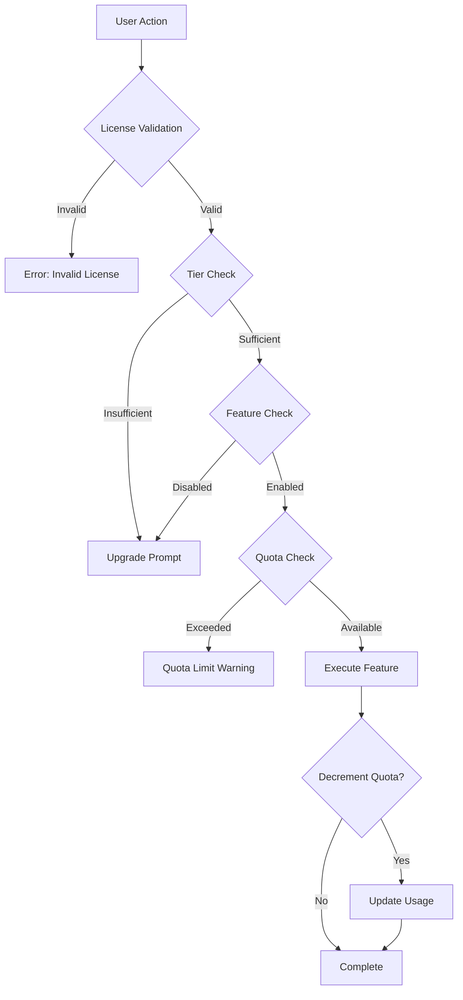

# Feature Gating System Documentation

This document explains CoursePlayerApp's feature gating system, which ensures that premium features are properly restricted based on license tier and usage quotas.

## Table of Contents

1. [Overview](#overview)
2. [Decorator-Based Gating](#decorator-based-gating)
3. [Feature Flag Configuration](#feature-flag-configuration)
4. [UI Adaptation Patterns](#ui-adaptation-patterns)
5. [Upgrade Prompts](#upgrade-prompts)
6. [Implementation Guide](#implementation-guide)
7. [Testing Gated Features](#testing-gated-features)

---

## Overview

### Purpose

Feature gating serves multiple critical functions:
- **Revenue Protection**: Prevents unauthorized access to premium features
- **Tier Differentiation**: Creates clear value propositions for each tier
- **Quota Management**: Enforces usage limits for metered features
- **Upgrade Incentives**: Encourages users to upgrade through strategic feature exposure

### Gating Mechanisms

CoursePlayerApp implements three types of feature gates:

1. **Tier Gates**: Features available only to specific tiers (e.g., AI Tutor for Intermediate+)
2. **Feature Gates**: Individual features that can be enabled/disabled (e.g., video_download)
3. **Quota Gates**: Metered features with usage limits (e.g., 50 AI questions/month)

### Architecture



---

## Decorator-Based Gating

### Core Decorators

CoursePlayerApp uses Python decorators to implement feature gates at the function level.

#### 1. `@requires_tier(tier_name)`

Restricts access to specific tier levels.

**Usage:**
```python
from courseplayerapp.middleware.feature_gates import requires_tier

@requires_tier('intermediate')
def enable_ai_tutor():
    """AI Tutor is only available for Intermediate+ tiers"""
    return AITutorInterface()

@requires_tier('advanced')
def enable_offline_mode():
    """Offline mode is exclusive to Advanced tier"""
    return OfflineContentManager()
```

**Implementation:**
```python
def requires_tier(required_tier: str):
    """
    Decorator to restrict access based on license tier.
    
    Args:
        required_tier: Minimum tier required ('basic', 'intermediate', 'advanced')
    """
    TIER_HIERARCHY = {
        'basic': 0,
        'intermediate': 1,
        'advanced': 2
    }
    
    def decorator(func):
        @functools.wraps(func)
        def wrapper(*args, **kwargs):
            current_tier = st.session_state.get('tier', 'basic')
            current_level = TIER_HIERARCHY.get(current_tier, 0)
            required_level = TIER_HIERARCHY.get(required_tier, 0)
            
            if current_level < required_level:
                # Show upgrade prompt
                st.warning(f"⬆️ This feature requires {required_tier.title()} tier or higher")
                show_upgrade_cta(required_tier)
                return None
            
            return func(*args, **kwargs)
        return wrapper
    return decorator
```

#### 2. `@requires_feature(feature_name)`

Checks if a specific feature is enabled for the user's license.

**Usage:**
```python
from courseplayerapp.middleware.feature_gates import requires_feature

@requires_feature('video_download')
def download_video(video_id: str):
    """Only available if video_download feature is enabled"""
    return VideoDownloader(video_id)

@requires_feature('certificate_generation')
def generate_certificate(course_id: str):
    """Certificate generation must be enabled"""
    return CertificateGenerator(course_id)
```

**Implementation:**
```python
def requires_feature(feature_name: str):
    """
    Decorator to check if a feature is enabled.
    
    Args:
        feature_name: Feature identifier from feature_flags.json
    """
    def decorator(func):
        @functools.wraps(func)
        def wrapper(*args, **kwargs):
            enabled_features = st.session_state.get('enabled_features', [])
            
            if feature_name not in enabled_features:
                feature_config = get_feature_config(feature_name)
                
                st.warning(f"🔒 Feature not available: {feature_config.get('description', feature_name)}")
                
                if 'upgrade_cta' in feature_config:
                    st.info(feature_config['upgrade_cta'])
                    show_upgrade_button()
                
                return None
            
            return func(*args, **kwargs)
        return wrapper
    return decorator
```

#### 3. `@quota_limited(quota_name)`

Enforces usage limits for metered features.

**Usage:**
```python
from courseplayerapp.middleware.feature_gates import quota_limited

@quota_limited('ai_tutor_quota')
def ask_ai_question(question: str):
    """Decrements AI tutor quota on each call"""
    return ai_tutor.answer(question)

@quota_limited('code_review_quota')
def submit_project_for_review(project_file):
    """Limited submissions per course"""
    return code_reviewer.submit(project_file)
```

**Implementation:**
```python
def quota_limited(quota_name: str):
    """
    Decorator to enforce quota limits.
    
    Args:
        quota_name: Quota identifier (e.g., 'ai_tutor_quota')
    """
    def decorator(func):
        @functools.wraps(func)
        def wrapper(*args, **kwargs):
            quota_info = check_quota(quota_name)
            
            if quota_info['remaining'] <= 0:
                st.error(f"❌ Quota exceeded for {quota_name}")
                st.caption(f"Resets: {quota_info['reset_date']}")
                
                # Offer upgrade if applicable
                if quota_info['upgradeable']:
                    st.info("Upgrade to Advanced for unlimited access!")
                    show_upgrade_button()
                
                return None
            
            # Execute function
            result = func(*args, **kwargs)
            
            # Decrement quota
            decrement_quota(quota_name)
            
            # Show updated quota
            remaining = quota_info['remaining'] - 1
            if remaining <= 5:  # Warning threshold
                st.warning(f"⚠️ {remaining} uses remaining")
            
            return result
        return wrapper
    return decorator
```

### Combined Decorators

Decorators can be stacked for multiple checks:

```python
@requires_tier('intermediate')
@requires_feature('ai_tutor')
@quota_limited('ai_tutor_quota')
def ask_ai_tutor_question(question: str, context: str):
    """
    Requires:
    - Intermediate tier or higher
    - AI Tutor feature enabled
    - Available quota
    """
    return ollama_client.chat(question, context)
```

---

## Feature Flag Configuration

### Configuration File Structure

**File**: `CoursePlayerApp/config/feature_flags.json`

```json
{
  "features": {
    "video_streaming": {
      "enabled_tiers": ["basic", "intermediate", "advanced"],
      "description": "Stream video lessons",
      "always_enabled": true
    },
    "video_download": {
      "enabled_tiers": ["intermediate", "advanced"],
      "description": "Download videos for offline viewing",
      "upgrade_cta": "Upgrade to Intermediate to download videos and watch offline",
      "config": {
        "max_quality_by_tier": {
          "intermediate": "720p",
          "advanced": "1080p"
        },
        "max_concurrent_downloads": {
          "intermediate": 3,
          "advanced": 10
        }
      }
    },
    "video_transcripts": {
      "enabled_tiers": ["intermediate", "advanced"],
      "description": "View video transcripts",
      "config": {
        "searchable": {
          "intermediate": false,
          "advanced": true
        }
      }
    },
    "video_annotations": {
      "enabled_tiers": ["advanced"],
      "description": "Create timestamped notes on videos",
      "upgrade_cta": "Upgrade to Advanced to annotate videos with personal notes"
    },
    "ai_tutor": {
      "enabled_tiers": ["intermediate", "advanced"],
      "description": "AI-powered tutoring assistance",
      "upgrade_cta": "Upgrade to Intermediate to get AI tutoring with 50 questions/month",
      "quota_config": {
        "quota_name": "ai_tutor_quota",
        "limits_by_tier": {
          "intermediate": {
            "questions_per_month": 50,
            "reset_period": "monthly"
          },
          "advanced": {
            "questions_per_month": "unlimited",
            "priority_queue": true
          }
        }
      },
      "config": {
        "models_by_tier": {
          "intermediate": "llama3.2:3b",
          "advanced": "llama3.1:8b"
        },
        "context_window": {
          "intermediate": 4096,
          "advanced": 8192
        }
      }
    },
    "ai_tutor_export": {
      "enabled_tiers": ["advanced"],
      "description": "Export AI tutor conversations",
      "depends_on": ["ai_tutor"]
    },
    "lab_execution": {
      "enabled_tiers": ["intermediate", "advanced"],
      "description": "Execute code in interactive notebooks",
      "upgrade_cta": "Upgrade to Intermediate to run code interactively",
      "config": {
        "execution_mode": {
          "intermediate": "jupyterlite",
          "advanced": "jupyterlab"
        },
        "resource_limits": {
          "intermediate": {
            "memory_mb": 512,
            "timeout_seconds": 60
          },
          "advanced": {
            "memory_mb": 2048,
            "timeout_seconds": 300,
            "gpu_enabled": true
          }
        }
      }
    },
    "quiz_adaptive": {
      "enabled_tiers": ["intermediate", "advanced"],
      "description": "Adaptive quiz difficulty",
      "config": {
        "difficulty_adjustment": true
      }
    },
    "progress_tracking": {
      "enabled_tiers": ["basic", "intermediate", "advanced"],
      "description": "Track course progress",
      "always_enabled": true,
      "config": {
        "gamification": {
          "basic": false,
          "intermediate": true,
          "advanced": true
        },
        "analytics": {
          "basic": "simple",
          "intermediate": "detailed",
          "advanced": "predictive"
        }
      }
    },
    "certificate_generation": {
      "enabled_tiers": ["intermediate", "advanced"],
      "description": "Generate completion certificates",
      "upgrade_cta": "Upgrade to Intermediate to earn verifiable certificates",
      "config": {
        "certificate_type": {
          "intermediate": "verifiable",
          "advanced": "professionally_signed"
        },
        "verification_method": {
          "intermediate": "qr_code",
          "advanced": "qr_code_and_digital_signature"
        }
      }
    },
    "dataset_access": {
      "enabled_tiers": ["intermediate", "advanced"],
      "description": "Access course datasets",
      "upgrade_cta": "Upgrade to Intermediate to access and download datasets",
      "config": {
        "preview_rows": {
          "intermediate": 100,
          "advanced": "unlimited"
        },
        "download_enabled": {
          "intermediate": true,
          "advanced": true
        }
      }
    },
    "code_review": {
      "enabled_tiers": ["intermediate", "advanced"],
      "description": "Submit projects for review",
      "quota_config": {
        "quota_name": "code_review_quota",
        "limits_by_tier": {
          "intermediate": {
            "submissions_per_course": 3,
            "review_type": "automated"
          },
          "advanced": {
            "submissions_per_course": 5,
            "review_type": "automated_and_manual",
            "sla_hours": 48
          }
        }
      }
    },
    "offline_mode": {
      "enabled_tiers": ["advanced"],
      "description": "Download content for offline access",
      "upgrade_cta": "Upgrade to Advanced for full offline mode",
      "config": {
        "max_offline_days": 30,
        "content_encryption": true
      }
    }
  },
  "tier_hierarchy": {
    "basic": 0,
    "intermediate": 1,
    "advanced": 2
  },
  "quota_reset_schedules": {
    "ai_tutor_quota": "monthly",
    "code_review_quota": "per_course"
  }
}
```

### Feature Configuration Fields

| Field | Type | Required | Description |
|-------|------|----------|-------------|
| `enabled_tiers` | Array | Yes | Tiers that have access to this feature |
| `description` | String | Yes | Human-readable feature description |
| `upgrade_cta` | String | No | Call-to-action message for upgrade |
| `always_enabled` | Boolean | No | If true, cannot be disabled |
| `depends_on` | Array | No | Other features this feature requires |
| `quota_config` | Object | No | Quota settings if feature is metered |
| `config` | Object | No | Tier-specific configuration |

### Loading Feature Configuration

```python
import json
from pathlib import Path

class FeatureManager:
    """Manage feature flags and permissions"""
    
    def __init__(self):
        config_path = Path(__file__).parent.parent / 'config' / 'feature_flags.json'
        with open(config_path) as f:
            self.config = json.load(f)
    
    def is_feature_enabled(self, feature_name: str, tier: str) -> bool:
        """Check if feature is enabled for tier"""
        feature = self.config['features'].get(feature_name)
        if not feature:
            return False
        
        return tier in feature.get('enabled_tiers', [])
    
    def get_enabled_features(self, tier: str) -> list:
        """Get all enabled features for a tier"""
        enabled = []
        for feature_name, feature_config in self.config['features'].items():
            if tier in feature_config.get('enabled_tiers', []):
                enabled.append(feature_name)
        return enabled
    
    def get_feature_config(self, feature_name: str, tier: str) -> dict:
        """Get tier-specific configuration for a feature"""
        feature = self.config['features'].get(feature_name, {})
        base_config = feature.get('config', {})
        
        # Extract tier-specific values
        tier_config = {}
        for key, value in base_config.items():
            if isinstance(value, dict) and tier in value:
                tier_config[key] = value[tier]
            else:
                tier_config[key] = value
        
        return tier_config
```

---

## UI Adaptation Patterns

### 1. Hidden Pattern

Feature is completely hidden from users who don't have access.

**Use Case**: Features that might confuse or frustrate users if shown but disabled.

**Example**: AI Tutor button for Basic tier users

```python
def render_navigation():
    """Render navigation menu"""
    st.sidebar.title("Navigation")
    st.sidebar.page_link("pages/00_Home.py", label="🏠 Home")
    st.sidebar.page_link("pages/01_Course_Browser.py", label="📚 Courses")
    st.sidebar.page_link("pages/02_Learn.py", label="🎓 Learn")
    st.sidebar.page_link("pages/03_Labs.py", label="🧪 Labs")
    
    # Only show AI Tutor for Intermediate+ tiers
    tier = st.session_state.get('tier', 'basic')
    if tier in ['intermediate', 'advanced']:
        st.sidebar.page_link("pages/04_AI_Tutor.py", label="🤖 AI Tutor")
    
    st.sidebar.page_link("pages/05_Progress.py", label="📊 Progress")
```

**Advantages**:
- Clean UI without cluttered disabled options
- No negative user experience from seeing locked features

**Disadvantages**:
- Users may not know feature exists
- Less upgrade conversion (users don't see what they're missing)

### 2. Disabled Pattern

Feature is visible but disabled with clear indication of why.

**Use Case**: Features you want users to be aware of to drive upgrades.

**Example**: Download button for Basic tier

```python
def render_video_controls():
    """Render video player controls"""
    col1, col2, col3 = st.columns(3)
    
    with col1:
        st.button("▶️ Play")
    
    with col2:
        tier = st.session_state.get('tier', 'basic')
        if tier in ['intermediate', 'advanced']:
            st.button("📥 Download")
        else:
            # Disabled button with tooltip
            st.button(
                "📥 Download 🔒",
                disabled=True,
                help="Upgrade to Intermediate to download videos"
            )
    
    with col3:
        st.button("⚙️ Settings")
```

**Advantages**:
- Feature discovery (users see what's available)
- Clear upgrade path
- Higher conversion rates

**Disadvantages**:
- Can clutter UI with locked features
- May frustrate users

### 3. Limited Pattern

Feature is available but with restrictions.

**Use Case**: Give users a taste of premium features while enforcing limits.

**Example**: AI Tutor with quota display

```python
def render_ai_tutor_input():
    """Render AI tutor with quota indicator"""
    tier = st.session_state.get('tier', 'basic')
    
    if tier == 'basic':
        st.info("🤖 AI Tutor is available starting with Intermediate tier")
        st.button("Upgrade to Access AI Tutor")
        return
    
    # Show quota for Intermediate
    if tier == 'intermediate':
        quota = get_ai_quota()
        remaining = quota['remaining']
        total = quota['total']
        
        st.progress(remaining / total)
        st.caption(f"Questions remaining: {remaining}/{total}")
        
        if remaining == 0:
            st.error("Monthly quota exhausted")
            st.button("Upgrade to Advanced for Unlimited Questions")
            return
    else:
        st.success("Unlimited questions ✨")
    
    # Chat interface
    question = st.text_input("Ask a question...")
    if st.button("Ask"):
        process_ai_question(question)
```

**Advantages**:
- Users experience value before committing
- Clear upgrade incentive when limit reached
- Progressive disclosure of value

**Disadvantages**:
- Requires quota tracking infrastructure
- Complexity in managing limits

### 4. Full Access Pattern

Complete feature availability with no restrictions.

**Use Case**: Features included in user's tier.

**Example**: Advanced tier AI Tutor

```python
def render_ai_tutor_advanced():
    """Full AI Tutor for Advanced tier"""
    st.title("🤖 AI Tutor - Unlimited")
    
    # No quota display, no restrictions
    render_chat_interface()
    
    # Advanced-only features
    render_export_chat_button()
    render_model_selector()  # Choose between models
```

---

## Upgrade Prompts

### Inline Upgrade CTAs

Display upgrade prompts within the feature context.

**Example**: Certificate page for Basic user

```python
def render_certificates_page():
    """Certificate page with tier-aware content"""
    st.title("📜 Certificates")
    
    tier = st.session_state.get('tier', 'basic')
    
    if tier == 'basic':
        # Show value proposition
        st.info("""
        ### Earn Verifiable Certificates
        
        Complete courses and earn professional certificates that you can:
        - Share on LinkedIn
        - Add to your resume
        - Verify online with QR codes
        
        **Available starting with Intermediate tier**
        """)
        
        # Show sample certificate
        st.image("assets/sample_certificate.png", caption="Sample Certificate")
        
        # Upgrade CTA
        col1, col2, col3 = st.columns([1, 2, 1])
        with col2:
            if st.button("🚀 Upgrade to Intermediate", use_container_width=True):
                redirect_to_upgrade_page('intermediate')
        
        return
    
    # Render actual certificates for Intermediate+
    render_earned_certificates()
```

### Feature Comparison Tooltips

Show what's included in each tier when hovering over locked features.

```python
def render_feature_with_comparison(feature_name: str):
    """Render feature button with tier comparison"""
    tier = st.session_state.get('tier', 'basic')
    feature_config = get_feature_config(feature_name)
    
    is_enabled = tier in feature_config['enabled_tiers']
    
    button_label = feature_config['description']
    if not is_enabled:
        button_label += " 🔒"
    
    # Tooltip with tier comparison
    tooltip = f"""
    {feature_config['description']}
    
    Availability:
    Basic: {'✅' if 'basic' in feature_config['enabled_tiers'] else '❌'}
    Intermediate: {'✅' if 'intermediate' in feature_config['enabled_tiers'] else '❌'}
    Advanced: {'✅' if 'advanced' in feature_config['enabled_tiers'] else '❌'}
    """
    
    st.button(
        button_label,
        disabled=not is_enabled,
        help=tooltip
    )
```

### "Try Premium" Preview Mode

Offer limited trial of premium features.

```python
def offer_ai_tutor_trial():
    """Offer 1-day AI Tutor trial to Basic users"""
    tier = st.session_state.get('tier', 'basic')
    
    if tier != 'basic':
        return
    
    trial_status = get_trial_status('ai_tutor')
    
    if trial_status['available']:
        st.info("""
        ### Try AI Tutor Free for 24 Hours!
        
        Experience unlimited AI tutoring for 1 day. No credit card required.
        """)
        
        if st.button("Start Free Trial"):
            activate_trial('ai_tutor', duration_hours=24)
            st.success("Trial activated! Enjoy unlimited AI Tutor access for 24 hours.")
            st.experimental_rerun()
    
    elif trial_status['active']:
        time_remaining = trial_status['expires_at'] - datetime.now()
        st.success(f"Trial active: {time_remaining.hours}h {time_remaining.minutes}m remaining")
    
    else:
        st.caption("Trial used. Upgrade to continue using AI Tutor.")
```

### Upgrade Page

Dedicated page showing tier comparison and upgrade options.

```python
def render_upgrade_page():
    """Comprehensive upgrade page"""
    st.title("🚀 Upgrade Your Plan")
    
    current_tier = st.session_state.get('tier', 'basic')
    
    # Tier comparison table
    col1, col2, col3 = st.columns(3)
    
    with col1:
        render_tier_card('basic', current=current_tier=='basic')
    
    with col2:
        render_tier_card('intermediate', current=current_tier=='intermediate', highlight=True)
    
    with col3:
        render_tier_card('advanced', current=current_tier=='advanced')

def render_tier_card(tier_name: str, current: bool = False, highlight: bool = False):
    """Render tier feature card"""
    tier_info = get_tier_info(tier_name)
    
    with st.container():
        if highlight:
            st.markdown("### ⭐ Most Popular")
        
        st.subheader(tier_name.title())
        st.markdown(f"**${tier_info['price']}/month**")
        
        st.markdown("#### Features")
        for feature in tier_info['features']:
            st.markdown(f"✅ {feature}")
        
        if current:
            st.success("Current Plan")
        else:
            if st.button(f"Upgrade to {tier_name.title()}", key=f"upgrade_{tier_name}"):
                initiate_upgrade(tier_name)
```

---

## Implementation Guide

### How to Add a New Gated Feature

**Step 1: Add to `feature_flags.json`**

```json
{
  "features": {
    "my_new_feature": {
      "enabled_tiers": ["advanced"],
      "description": "My awesome new feature",
      "upgrade_cta": "Upgrade to Advanced to access this feature"
    }
  }
}
```

**Step 2: Create Feature Implementation**

```python
from courseplayerapp.middleware.feature_gates import requires_feature

@requires_feature('my_new_feature')
def my_new_feature_handler():
    """Implementation of new feature"""
    st.write("This is my new feature!")
    # Feature logic here
```

**Step 3: Add to UI**

```python
def render_features_page():
    """Page that includes the new feature"""
    tier = st.session_state.get('tier', 'basic')
    
    if tier == 'advanced':
        # Show feature
        my_new_feature_handler()
    else:
        # Show upgrade prompt
        st.info("Upgrade to Advanced to access My New Feature")
        st.button("Upgrade Now")
```

**Step 4: Add Tests**

```python
def test_my_new_feature_gating():
    """Test feature gate for new feature"""
    # Test Basic tier (should be blocked)
    with patch('st.session_state', {'tier': 'basic'}):
        result = my_new_feature_handler()
        assert result is None
    
    # Test Advanced tier (should work)
    with patch('st.session_state', {'tier': 'advanced'}):
        result = my_new_feature_handler()
        assert result is not None
```

### Adding Quota-Limited Features

**Step 1: Configure Quota in `feature_flags.json`**

```json
{
  "features": {
    "my_quota_feature": {
      "enabled_tiers": ["intermediate", "advanced"],
      "quota_config": {
        "quota_name": "my_feature_quota",
        "limits_by_tier": {
          "intermediate": {
            "uses_per_month": 10
          },
          "advanced": {
            "uses_per_month": "unlimited"
          }
        }
      }
    }
  }
}
```

**Step 2: Implement with Quota Decorator**

```python
from courseplayerapp.middleware.feature_gates import quota_limited

@quota_limited('my_feature_quota')
def my_quota_feature_handler():
    """Feature with usage quota"""
    # This will automatically check and decrement quota
    perform_expensive_operation()
```

**Step 3: Display Quota in UI**

```python
def render_quota_display():
    """Show remaining quota"""
    quota = get_quota_info('my_feature_quota')
    
    if quota['limit'] == 'unlimited':
        st.success("Unlimited uses ✨")
    else:
        remaining = quota['remaining']
        total = quota['limit']
        st.progress(remaining / total)
        st.caption(f"{remaining}/{total} uses remaining")
```

---

## Testing Gated Features

### Unit Tests

```python
import pytest
from unittest.mock import patch, MagicMock
from courseplayerapp.middleware.feature_gates import requires_tier, requires_feature

def test_tier_gate_blocks_basic():
    """Basic tier should be blocked from Intermediate features"""
    @requires_tier('intermediate')
    def protected_function():
        return "success"
    
    with patch('streamlit.session_state', {'tier': 'basic'}):
        result = protected_function()
        assert result is None

def test_tier_gate_allows_intermediate():
    """Intermediate tier should access Intermediate features"""
    @requires_tier('intermediate')
    def protected_function():
        return "success"
    
    with patch('streamlit.session_state', {'tier': 'intermediate'}):
        result = protected_function()
        assert result == "success"

def test_tier_hierarchy():
    """Advanced tier should access all lower tier features"""
    @requires_tier('basic')
    def basic_feature():
        return "basic"
    
    @requires_tier('intermediate')
    def intermediate_feature():
        return "intermediate"
    
    with patch('streamlit.session_state', {'tier': 'advanced'}):
        assert basic_feature() == "basic"
        assert intermediate_feature() == "intermediate"

def test_feature_gate():
    """Feature gate should check enabled_features list"""
    @requires_feature('video_download')
    def download_video():
        return "downloading"
    
    # Without feature
    with patch('streamlit.session_state', {'enabled_features': []}):
        result = download_video()
        assert result is None
    
    # With feature
    with patch('streamlit.session_state', {'enabled_features': ['video_download']}):
        result = download_video()
        assert result == "downloading"

def test_quota_enforcement():
    """Quota gate should enforce limits"""
    @quota_limited('test_quota')
    def quota_function():
        return "executed"
    
    # Mock quota check
    with patch('courseplayerapp.middleware.feature_gates.check_quota') as mock_check:
        # Quota available
        mock_check.return_value = {'remaining': 5, 'reset_date': '2024-02-01'}
        result = quota_function()
        assert result == "executed"
        
        # Quota exhausted
        mock_check.return_value = {'remaining': 0, 'reset_date': '2024-02-01'}
        result = quota_function()
        assert result is None
```

### Integration Tests

```python
def test_end_to_end_ai_tutor_access():
    """Test complete AI Tutor access flow"""
    # Initialize app with Intermediate license
    app = CoursePlayerApp(license_key="INTM-TEST-KEY")
    
    # Verify tier
    assert app.tier == 'intermediate'
    
    # Verify AI Tutor is enabled
    assert 'ai_tutor' in app.enabled_features
    
    # Check quota
    quota = app.get_quota('ai_tutor_quota')
    assert quota['remaining'] == 50
    
    # Ask question
    response = app.ask_ai_question("What is Python?")
    assert response is not None
    
    # Verify quota decremented
    quota = app.get_quota('ai_tutor_quota')
    assert quota['remaining'] == 49
```

### Manual Testing Checklist

- [ ] Basic tier cannot access Intermediate features
- [ ] Basic tier cannot access Advanced features
- [ ] Intermediate tier can access Intermediate features
- [ ] Intermediate tier cannot access Advanced features
- [ ] Advanced tier can access all features
- [ ] Upgrade prompts display correctly for locked features
- [ ] Quota limits are enforced
- [ ] Quota UI updates correctly
- [ ] Feature dependencies are respected
- [ ] Invalid licenses are rejected
- [ ] Expired licenses are handled gracefully

---

## Analytics Tracking

Track feature gate interactions for product insights:

```python
def track_feature_gate_event(event_type: str, feature_name: str, tier: str):
    """Track feature gate interactions"""
    analytics_client.track({
        'event': 'feature_gate',
        'event_type': event_type,  # 'blocked', 'accessed', 'quota_exceeded'
        'feature': feature_name,
        'user_tier': tier,
        'timestamp': datetime.now().isoformat()
    })

# Usage in decorator
@requires_tier('intermediate')
def feature_handler():
    tier = st.session_state.get('tier', 'basic')
    
    if tier != 'intermediate':
        track_feature_gate_event('blocked', 'my_feature', tier)
    else:
        track_feature_gate_event('accessed', 'my_feature', tier)
```

**Key Metrics to Track:**
- Feature block rate by tier
- Upgrade click-through rate
- Quota exhaustion frequency
- Trial activation rate
- Conversion rate after seeing upgrade prompt

---

## Best Practices

1. **Clear Communication**: Always explain why a feature is locked and how to unlock it
2. **Graceful Degradation**: Provide alternative options when features are unavailable
3. **Progressive Disclosure**: Show users what they're missing to drive upgrades
4. **Quota Warnings**: Warn users before quota exhaustion (e.g., at 80% usage)
5. **Consistent Patterns**: Use the same UI patterns for all gated features
6. **Performance**: Cache feature checks to avoid repeated API calls
7. **Testing**: Thoroughly test all tier combinations
8. **Documentation**: Keep feature flag documentation up to date
9. **Monitoring**: Track feature gate metrics for product insights
10. **User Empathy**: Balance monetization with user experience

---

This feature gating system ensures CoursePlayerApp effectively protects premium features while providing clear upgrade paths and maintaining a positive user experience.
