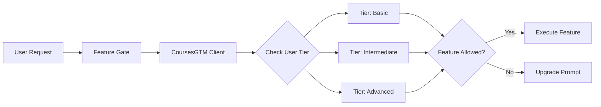
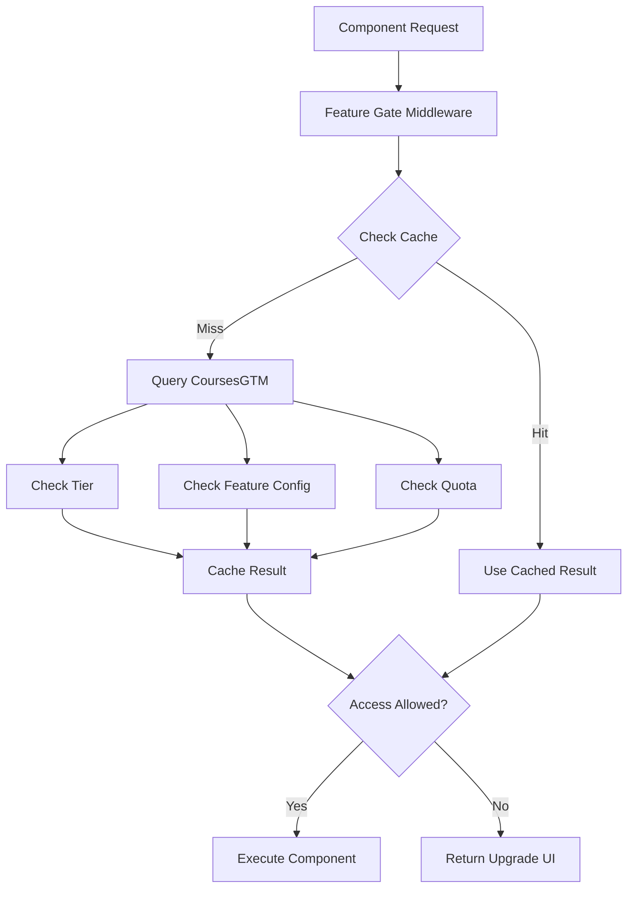

# CoursePlayerApp - Feature Gating System Documentation

## Overview

The feature gating system is a core architectural pattern in CoursePlayerApp that enables flexible, tier-based access control. It allows the same codebase to deliver different experiences based on user subscription levels while maintaining clean, testable code.

## Core Concepts

### What is Feature Gating?

Feature gating (also called feature flagging) is a technique that allows you to enable or disable features without deploying new code. In CoursePlayerApp, we use it to:

1. **Tier-Based Access**: Different features for Basic, Intermediate, and Advanced users
2. **Quota Management**: Track and limit usage of specific features
3. **Gradual Rollout**: Enable features for subsets of users
4. **A/B Testing**: Test different feature variants
5. **Emergency Disable**: Quickly disable problematic features

### Why Use Feature Gating?

**Benefits**:
- **Flexibility**: Change feature availability without code changes
- **Revenue Optimization**: Clear upgrade paths between tiers
- **Risk Mitigation**: Roll out features gradually, disable if issues arise
- **Experimentation**: Test features with real users
- **Maintenance**: Separate feature logic from business logic
- **Testing**: Easy to test different tier combinations

**Trade-offs**:
- **Complexity**: Additional abstraction layer
- **Technical Debt**: Old flags need cleanup
- **Performance**: Extra checks on each feature access
- **State Management**: Keep flags in sync across systems

### Integration with CoursesGTM Tiers

CoursePlayerApp integrates deeply with CoursesGTM's tier system:



**Tier Hierarchy**:
```
Basic (Foundation Builder)
  ↓ upgrades to
Intermediate (AI Practitioner) - BEST VALUE
  ↓ upgrades to
Advanced (AI/ML Expert) - COMMERCIAL LICENSE
  ↓ upgrades to
Enterprise (Team/Organization)
```

## Decorator Patterns

### @requires_feature

Gates a function based on feature availability for user's tier.

```python
from courseplayerapp.feature_gates import requires_feature

@requires_feature('video_download')
def download_video(video_id: str) -> bytes:
    """Download video for offline viewing"""
    # This code only runs if user has video_download feature
    return video_service.download(video_id)

# Usage
try:
    video_data = download_video("intro-to-ml")
except FeatureNotAvailableError as e:
    st.warning(e.upgrade_message)
    st.button("Upgrade to Intermediate", on_click=show_upgrade_page)
```

**Implementation**:

```python
from functools import wraps
from typing import Callable, Any

def requires_feature(feature_name: str) -> Callable:
    """Decorator to gate function execution on feature availability"""
    def decorator(func: Callable) -> Callable:
        @wraps(func)
        def wrapper(*args, **kwargs) -> Any:
            # Get CoursesGTM client
            gtm = CoursesGTMClient.get_instance()
            
            # Check if feature is available
            if not gtm.can_use_feature(feature_name):
                # Get feature config for upgrade message
                config = FeatureConfig.get_feature(feature_name)
                raise FeatureNotAvailableError(
                    feature=feature_name,
                    message=config.upgrade_message,
                    current_tier=gtm.get_user_tier(),
                    required_tier=config.upgrade_to
                )
            
            # Feature is available, execute function
            return func(*args, **kwargs)
        return wrapper
    return decorator
```

### @requires_tier

Gates a function based on minimum required tier.

```python
from courseplayerapp.feature_gates import requires_tier

@requires_tier('intermediate')
def access_advanced_course(course_id: str):
    """Access courses available to Intermediate+ tiers"""
    return course_service.get_course(course_id)

# Advanced tier users can also access
@requires_tier('advanced')
def access_enterprise_features():
    """Features exclusive to Advanced tier and above"""
    pass
```

**Implementation**:

```python
def requires_tier(required_tier: str) -> Callable:
    """Decorator to gate function execution on user tier"""
    TIER_HIERARCHY = {
        'basic': 0,
        'intermediate': 1,
        'advanced': 2,
        'enterprise': 3
    }
    
    def decorator(func: Callable) -> Callable:
        @wraps(func)
        def wrapper(*args, **kwargs) -> Any:
            gtm = CoursesGTMClient.get_instance()
            user_tier = gtm.get_user_tier()
            
            # Check tier hierarchy
            user_level = TIER_HIERARCHY.get(user_tier, 0)
            required_level = TIER_HIERARCHY.get(required_tier, 99)
            
            if user_level < required_level:
                raise InsufficientTierError(
                    current_tier=user_tier,
                    required_tier=required_tier,
                    message=f"This feature requires {required_tier.title()} tier or higher"
                )
            
            return func(*args, **kwargs)
        return wrapper
    return decorator
```

### @quota_limited

Enforces usage quotas on features.

```python
from courseplayerapp.feature_gates import quota_limited

@quota_limited('ai_tutor_quota')
def ask_ai_tutor(question: str, course_id: str) -> str:
    """Ask AI tutor a question (quota-limited)"""
    # Get AI response
    response = ollama_client.query(question, course_context=course_id)
    return response

# Usage
try:
    answer = ask_ai_tutor("What is gradient descent?", "ml-101")
    st.success(answer)
except QuotaExceededError as e:
    st.error(f"Monthly quota exceeded: {e.usage}/{e.limit}")
    st.info("Upgrade to Advanced for unlimited AI Tutor access")
```

**Implementation**:

```python
def quota_limited(quota_name: str) -> Callable:
    """Decorator to enforce usage quotas"""
    def decorator(func: Callable) -> Callable:
        @wraps(func)
        def wrapper(*args, **kwargs) -> Any:
            gtm = CoursesGTMClient.get_instance()
            tier = gtm.get_user_tier()
            
            # Get quota config
            config = FeatureConfig.get_feature(quota_name)
            limit = config.quota_by_tier.get(tier)
            
            # Check for unlimited
            if limit == "unlimited":
                return func(*args, **kwargs)
            
            # Check current usage
            usage = gtm.get_feature_usage(quota_name)
            
            if usage >= limit:
                raise QuotaExceededError(
                    quota_name=quota_name,
                    limit=limit,
                    usage=usage,
                    reset_date=_get_quota_reset_date(config)
                )
            
            # Execute function
            result = func(*args, **kwargs)
            
            # Increment usage
            gtm.increment_feature_usage(quota_name)
            
            return result
        return wrapper
    return decorator
```

### Combining Decorators

Decorators can be stacked for complex requirements:

```python
@requires_tier('intermediate')
@quota_limited('code_review_quota')
@requires_feature('code_review')
def submit_code_review(project_files: list) -> dict:
    """Submit code for review (requires Intermediate+, quota-limited)"""
    return review_service.submit(project_files)
```

**Execution Order**: Decorators execute bottom-up
1. Check `code_review` feature available
2. Check quota limit
3. Check tier requirement
4. Execute function

## Feature Flag Configuration

### JSON Structure

Feature flags are stored in `config/feature_flags.json`:

```json
{
  "version": "1.0.0",
  "last_updated": "2026-01-12T00:00:00Z",
  "features": {
    "feature_name": {
      "enabled_tiers": ["intermediate", "advanced"],
      "description": "Human-readable description",
      "upgrade_message": "Upgrade to {tier} to access this feature",
      "upgrade_from": "basic",
      "upgrade_to": "intermediate",
      "upgrade_price": 150
    }
  }
}
```

### Tier Hierarchy

Tiers inherit features from lower tiers:

```json
{
  "tier_inheritance": {
    "basic": [],
    "intermediate": ["basic"],
    "advanced": ["basic", "intermediate"],
    "enterprise": ["basic", "intermediate", "advanced"]
  }
}
```

### Quota Management

Quota-based features specify limits per tier:

```json
{
  "ai_tutor_quota": {
    "enabled_tiers": ["intermediate", "advanced"],
    "quota_by_tier": {
      "basic": 0,
      "intermediate": 50,
      "advanced": "unlimited"
    },
    "quota_period": "monthly",
    "quota_reset_day": 1,
    "rollover": {
      "enabled_tiers": ["advanced"],
      "max_rollover": 100
    }
  }
}
```

### Override Mechanisms

For testing and development:

```json
{
  "overrides": {
    "enabled": true,
    "users": {
      "test_user_123": {
        "tier": "advanced",
        "features": ["all"],
        "quotas": {
          "ai_tutor_quota": "unlimited"
        }
      }
    },
    "environments": {
      "development": {
        "all_features_enabled": true
      },
      "staging": {
        "features": ["video_download", "ai_tutor"]
      }
    }
  }
}
```

## Implementation Details

### Middleware Architecture

Feature gates are implemented as a middleware layer:



### FeatureGate Class

Core implementation:

```python
from typing import Optional, Dict, Any
import json
from datetime import datetime, timedelta

class FeatureGate:
    """Centralized feature gate manager"""
    
    def __init__(self, config_path: str = "config/feature_flags.json"):
        self.config = self._load_config(config_path)
        self.cache = FeatureCache()
        self.gtm_client = CoursesGTMClient.get_instance()
    
    def can_use_feature(self, feature_name: str, user_id: Optional[str] = None) -> bool:
        """Check if user can use a feature"""
        # Check cache first
        cache_key = f"feature:{user_id}:{feature_name}"
        cached = self.cache.get(cache_key)
        if cached is not None:
            return cached
        
        # Get user tier
        tier = self.gtm_client.get_user_tier(user_id)
        
        # Get feature config
        feature = self.config['features'].get(feature_name)
        if not feature:
            return False
        
        # Check if tier has access
        allowed = tier in feature.get('enabled_tiers', [])
        
        # Check overrides
        if self._check_override(user_id, feature_name):
            allowed = True
        
        # Cache result
        self.cache.set(cache_key, allowed, ttl=300)  # 5 minutes
        
        return allowed
    
    def check_quota(self, quota_name: str, user_id: Optional[str] = None) -> Dict[str, Any]:
        """Check quota status for a feature"""
        tier = self.gtm_client.get_user_tier(user_id)
        feature = self.config['features'].get(quota_name)
        
        if not feature:
            return {'allowed': False, 'reason': 'Feature not found'}
        
        # Get quota limit
        limit = feature.get('quota_by_tier', {}).get(tier)
        if limit == "unlimited":
            return {'allowed': True, 'unlimited': True}
        
        if limit is None or limit == 0:
            return {'allowed': False, 'reason': 'Not available for tier'}
        
        # Get current usage
        usage = self.gtm_client.get_feature_usage(quota_name, user_id)
        
        return {
            'allowed': usage < limit,
            'usage': usage,
            'limit': limit,
            'remaining': max(0, limit - usage),
            'reset_date': self._get_reset_date(feature)
        }
    
    def _check_override(self, user_id: str, feature_name: str) -> bool:
        """Check if feature is overridden for user"""
        overrides = self.config.get('overrides', {})
        if not overrides.get('enabled'):
            return False
        
        # User-specific override
        user_overrides = overrides.get('users', {}).get(user_id, {})
        if 'all' in user_overrides.get('features', []):
            return True
        if feature_name in user_overrides.get('features', []):
            return True
        
        # Environment override
        env = os.getenv('ENVIRONMENT', 'production')
        env_overrides = overrides.get('environments', {}).get(env, {})
        if env_overrides.get('all_features_enabled'):
            return True
        
        return False
    
    def _get_reset_date(self, feature: dict) -> datetime:
        """Calculate next quota reset date"""
        period = feature.get('quota_period', 'monthly')
        reset_day = feature.get('quota_reset_day', 1)
        
        now = datetime.utcnow()
        
        if period == 'monthly':
            # Next reset is on reset_day of next month
            if now.day < reset_day:
                # Reset is this month
                return datetime(now.year, now.month, reset_day)
            else:
                # Reset is next month
                if now.month == 12:
                    return datetime(now.year + 1, 1, reset_day)
                else:
                    return datetime(now.year, now.month + 1, reset_day)
        
        return now + timedelta(days=30)  # Default fallback
```

### Cache Strategy for Performance

Feature gates use a multi-layer cache:

```python
class FeatureCache:
    """Multi-layer cache for feature gate results"""
    
    def __init__(self):
        self.memory_cache = {}  # In-process cache
        self.redis_client = redis.Redis()  # Shared cache
    
    def get(self, key: str) -> Optional[bool]:
        """Get cached result"""
        # Try memory cache first (fastest)
        if key in self.memory_cache:
            value, expiry = self.memory_cache[key]
            if datetime.utcnow() < expiry:
                return value
            del self.memory_cache[key]
        
        # Try Redis cache (shared across instances)
        try:
            value = self.redis_client.get(f"fg:{key}")
            if value is not None:
                return json.loads(value)
        except Exception:
            pass  # Cache miss or error
        
        return None
    
    def set(self, key: str, value: bool, ttl: int = 300):
        """Cache a result"""
        expiry = datetime.utcnow() + timedelta(seconds=ttl)
        
        # Set in memory cache
        self.memory_cache[key] = (value, expiry)
        
        # Set in Redis cache
        try:
            self.redis_client.setex(
                f"fg:{key}",
                ttl,
                json.dumps(value)
            )
        except Exception:
            pass  # Fail silently, memory cache still works
```

### Fallback UI for Gated Features

When a feature is not available, show a consistent upgrade UI:

```python
class UpgradePrompt:
    """Standardized upgrade prompt component"""
    
    @staticmethod
    def render(feature_name: str):
        """Render upgrade prompt for gated feature"""
        config = FeatureConfig.get_feature(feature_name)
        current_tier = CoursesGTMClient.get_instance().get_user_tier()
        
        st.info(
            f"🔒 {config.upgrade_message}\n\n"
            f"**Current tier**: {current_tier.title()}\n"
            f"**Required tier**: {config.upgrade_to.title()}\n"
            f"**Upgrade price**: ${config.upgrade_price}"
        )
        
        col1, col2 = st.columns(2)
        with col1:
            if st.button("Learn More"):
                st.session_state.page = "pricing"
                st.rerun()
        
        with col2:
            if st.button("Upgrade Now"):
                st.session_state.page = "upgrade"
                st.session_state.target_tier = config.upgrade_to
                st.rerun()
```

### Usage in Components

Example component using feature gates:

```python
class VideoPlayer:
    def render(self):
        """Render video player with tier-appropriate features"""
        # Video is always available
        st.video(self.video_url)
        
        # Gated features
        if FeatureGate().can_use_feature('video_download'):
            st.download_button("Download", self._get_download_url())
        else:
            UpgradePrompt.render('video_download')
        
        if FeatureGate().can_use_feature('video_transcript'):
            with st.expander("Transcript"):
                st.markdown(self._get_transcript())
```

## Testing Feature Gates

### Mock Tier Assignments

For testing, mock the user tier:

```python
import pytest
from unittest.mock import patch

@pytest.fixture
def mock_basic_tier():
    """Mock basic tier user"""
    with patch('CoursesGTMClient.get_user_tier', return_value='basic'):
        yield

@pytest.fixture
def mock_advanced_tier():
    """Mock advanced tier user"""
    with patch('CoursesGTMClient.get_user_tier', return_value='advanced'):
        yield

def test_video_download_basic_tier(mock_basic_tier):
    """Test video download is not available for basic tier"""
    gate = FeatureGate()
    assert not gate.can_use_feature('video_download')

def test_video_download_advanced_tier(mock_advanced_tier):
    """Test video download is available for advanced tier"""
    gate = FeatureGate()
    assert gate.can_use_feature('video_download')
```

### Test Coverage for All Gates

Ensure every feature gate is tested:

```python
def test_all_features_have_tests():
    """Verify all feature flags have corresponding tests"""
    config = FeatureConfig.load()
    features = config['features'].keys()
    
    # Check each feature has tests
    for feature in features:
        test_file = f"tests/test_feature_{feature}.py"
        assert os.path.exists(test_file), f"Missing tests for {feature}"
```

### E2E Testing Across Tiers

Test complete user flows for each tier:

```python
from playwright.sync_api import Page, expect

def test_intermediate_user_flow(page: Page):
    """Test Intermediate tier user experience"""
    # Login as intermediate user
    login_as_tier(page, "intermediate")
    
    # Navigate to video
    page.goto("/course/ml-101/videos/intro")
    
    # Should see download button
    expect(page.locator("text=Download")).to_be_visible()
    
    # Should see transcript
    expect(page.locator("text=Transcript")).to_be_visible()
    
    # Should NOT see annotations (Advanced only)
    expect(page.locator("text=Annotations")).not_to_be_visible()
```

## Feature Flag Schema

Complete schema definition:

```json
{
  "$schema": "http://json-schema.org/draft-07/schema#",
  "type": "object",
  "required": ["version", "features"],
  "properties": {
    "version": {
      "type": "string",
      "description": "Feature flag schema version"
    },
    "features": {
      "type": "object",
      "patternProperties": {
        "^[a-z_]+$": {
          "type": "object",
          "required": ["enabled_tiers", "description"],
          "properties": {
            "enabled_tiers": {
              "type": "array",
              "items": {
                "type": "string",
                "enum": ["basic", "intermediate", "advanced", "enterprise"]
              }
            },
            "description": {
              "type": "string"
            },
            "upgrade_message": {
              "type": "string"
            },
            "upgrade_from": {
              "type": "string",
              "enum": ["basic", "intermediate", "advanced"]
            },
            "upgrade_to": {
              "type": "string",
              "enum": ["intermediate", "advanced", "enterprise"]
            },
            "upgrade_price": {
              "type": "number"
            },
            "quota_by_tier": {
              "type": "object",
              "properties": {
                "basic": {"type": ["number", "string"]},
                "intermediate": {"type": ["number", "string"]},
                "advanced": {"type": ["number", "string"]},
                "enterprise": {"type": ["number", "string"]}
              }
            },
            "quota_period": {
              "type": "string",
              "enum": ["daily", "weekly", "monthly", "yearly"]
            },
            "quota_reset_day": {
              "type": "number",
              "minimum": 1,
              "maximum": 31
            }
          }
        }
      }
    }
  }
}
```

## Best Practices

### 1. Keep Flags Simple
- One flag per feature
- Clear, descriptive names
- Avoid nested conditions

### 2. Clean Up Old Flags
- Remove flags after 100% rollout
- Archive flags for historical reference
- Document flag lifecycle

### 3. Monitor Flag Usage
- Track which flags are checked
- Identify unused flags
- Monitor performance impact

### 4. Document Upgrade Paths
- Clear messages about what users get
- Transparent pricing
- Easy upgrade process

### 5. Test Thoroughly
- Test all tier combinations
- Test quota limits
- Test upgrade/downgrade flows

## Related Documentation

- [Architecture](./ARCHITECTURE.md)
- [Components](./COMPONENTS.md)
- [Integration Guide](./INTEGRATION.md)
- [Testing Strategy](./TESTING.md)
