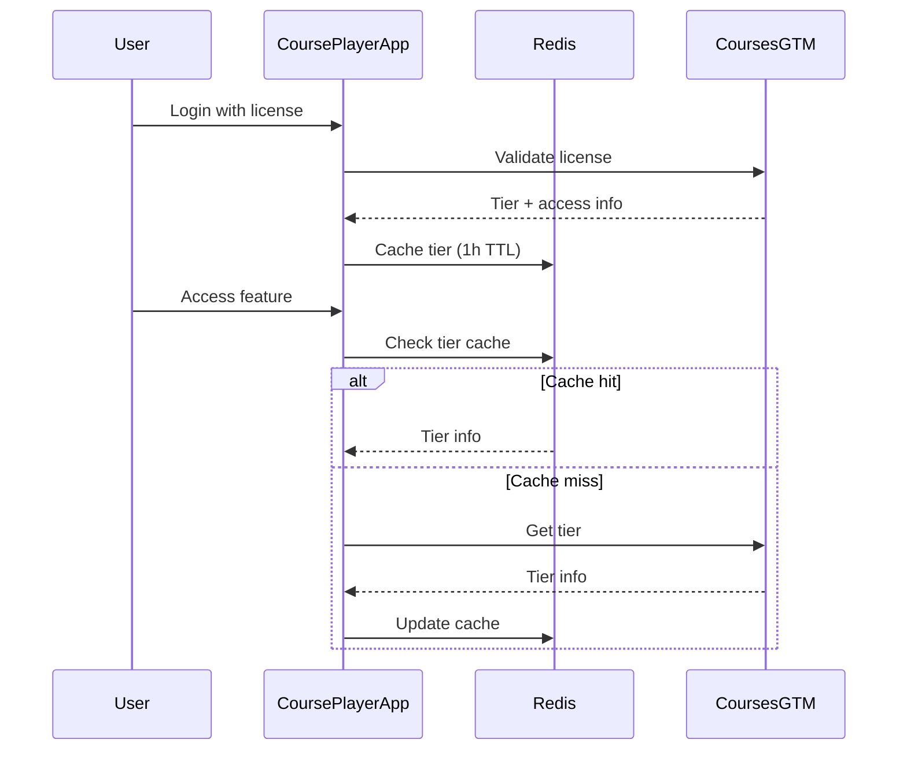
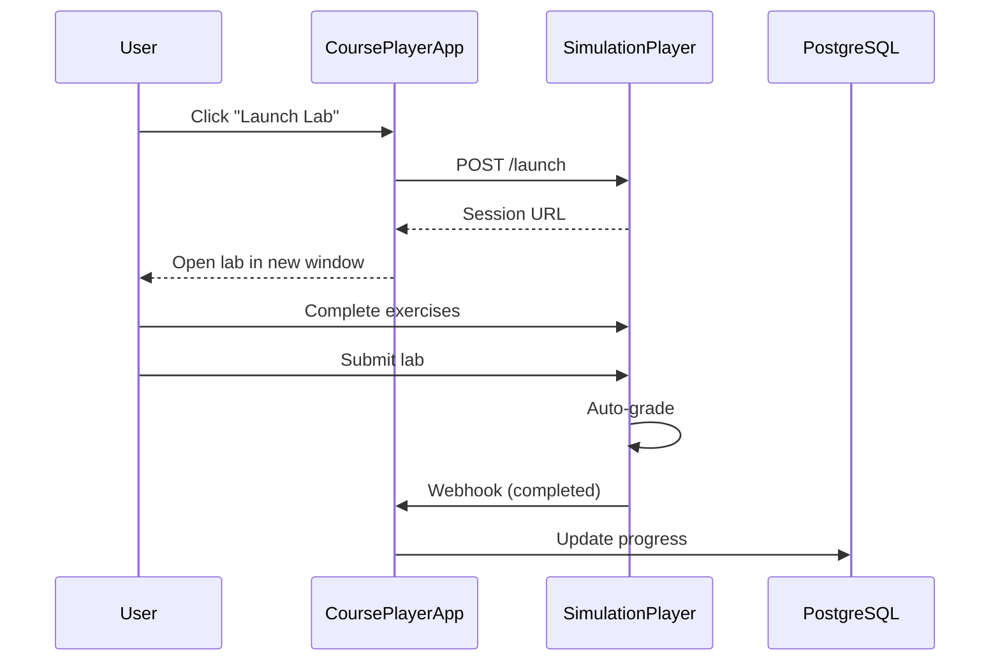

# Integration Documentation

## Overview

CoursePlayerApp integrates with multiple modules and external services to deliver a complete learning platform. This document provides a comprehensive overview of all integrations, their purposes, and implementation details.

---

## Module Integrations

### 1. CoursesGTM Integration

**Purpose**: License management, tier validation, access control

**Integration Type**: REST API

**Key Endpoints**:
- `POST /api/v1/validate-license` - Validate license keys
- `GET /api/v1/user/{user_id}/tier` - Get user tier
- `GET /api/v1/courses/available?tier={tier}` - Get available courses
- `POST /api/v1/progress/update` - Sync progress
- `POST /api/v1/achievements/unlock` - Award achievements
- `POST /api/v1/certificates/request` - Request certificates

**Data Flow**:


**Detailed Documentation**: See [COURSESGTM_INTEGRATION.md](./COURSESGTM_INTEGRATION.md)

---

### 2. SimulationPlayer Integration

**Purpose**: Interactive lab experiences

**Integration Type**: REST API + Webhooks

**Key Endpoints**:
- `POST /api/v1/launch` - Launch lab session
- `GET /api/v1/session/{session_id}/status` - Check lab status
- `POST /api/v1/session/{session_id}/submit` - Submit lab work
- `POST /api/v1/session/{session_id}/checkpoint` - Save progress

**Webhook Events**:
- `lab.completed` - Lab submission graded
- `lab.abandoned` - Lab session timeout
- `lab.checkpoint_saved` - Progress saved

**Data Flow**:


**Detailed Documentation**: See [SIMULATION_INTEGRATION.md](./SIMULATION_INTEGRATION.md)

---

### 3. CertificationExam Integration

**Purpose**: Final assessments and certification exams

**Integration Type**: REST API

**Key Endpoints**:
- `POST /api/v1/exam/launch` - Start certification exam
- `GET /api/v1/exam/{exam_id}/status` - Check exam status
- `POST /api/v1/exam/{exam_id}/submit` - Submit exam answers
- `GET /api/v1/exam/{exam_id}/result` - Retrieve exam results

**Prerequisites Checking**:
```python
async def can_take_exam(user_id: str, exam_id: str) -> bool:
    """Check if user meets prerequisites for certification exam."""
    
    exam = db.query(Exam).filter(Exam.id == exam_id).first()
    
    # Check course completion requirements
    for course_id in exam.required_courses:
        course_progress = db.query(CourseProgress).filter(
            CourseProgress.user_id == user_id,
            CourseProgress.course_id == course_id
        ).first()
        
        if not course_progress or not course_progress.completed:
            return False
        
        # Check minimum grade requirement
        if course_progress.average_score < exam.minimum_grade:
            return False
    
    # Check tier requirement
    user = db.query(User).filter(User.id == user_id).first()
    if not check_tier_access(user.tier, exam.required_tier):
        return False
    
    return True
```

**Certificate Retrieval**:
```python
@router.get("/api/certificates/{certificate_id}")
async def get_certificate(
    certificate_id: str,
    current_user: User = Depends(get_current_user)
):
    """Retrieve certificate from CertificationExam module."""
    
    # Get certificate from our database
    cert = db.query(Certificate).filter(
        Certificate.id == certificate_id,
        Certificate.user_id == current_user.id
    ).first()
    
    if not cert:
        raise HTTPException(status_code=404, detail="Certificate not found")
    
    return {
        "certificate_id": cert.id,
        "course_id": cert.course_id,
        "user_name": current_user.full_name,
        "issued_at": cert.issued_at.isoformat(),
        "pdf_url": cert.pdf_url,
        "verification_url": cert.verification_url,
        "blockchain_tx_hash": cert.blockchain_tx_hash,
        "certificate_type": cert.certificate_type
    }
```

---

### 4. CourseIngester Integration

**Purpose**: Content import and management

**Integration Type**: Background Jobs

**How It Works**:
1. CourseIngester processes course materials (videos, slides, etc.)
2. Uploads to Cloudflare R2
3. Generates metadata and stores in PostgreSQL
4. CoursePlayerApp reads from PostgreSQL + R2

**Content Access**:
```python
class ContentService:
    """Service for accessing course content."""
    
    async def get_video_url(
        self,
        course_id: str,
        lesson_id: str,
        user_tier: str
    ) -> str:
        """
        Get signed video URL based on user tier.
        
        Returns:
            HLS manifest URL (720p, 1080p, or 4K based on tier)
        """
        # Get video metadata
        video = db.query(Video).filter(
            Video.course_id == course_id,
            Video.lesson_id == lesson_id
        ).first()
        
        if not video:
            raise ValueError("Video not found")
        
        # Select quality based on tier
        quality_map = {
            "basic": "720p",
            "intermediate": "1080p",
            "advanced": "4k"
        }
        
        quality = quality_map.get(user_tier, "720p")
        video_path = f"{video.base_path}/{quality}/master.m3u8"
        
        # Generate signed URL (expires in 1 hour)
        signed_url = r2_client.generate_presigned_url(
            bucket="course-videos",
            key=video_path,
            expires_in=3600
        )
        
        return signed_url
    
    async def get_slides_url(
        self,
        course_id: str,
        lesson_id: str,
        format: str = "pdf"
    ) -> str:
        """Get signed URL for slides (PDF or PPTX)."""
        
        slides = db.query(Slides).filter(
            Slides.course_id == course_id,
            Slides.lesson_id == lesson_id
        ).first()
        
        if not slides:
            raise ValueError("Slides not found")
        
        # Get appropriate file
        if format == "pptx":
            file_path = slides.pptx_path
        else:
            file_path = slides.pdf_path
        
        # Generate signed URL
        signed_url = r2_client.generate_presigned_url(
            bucket="course-materials",
            key=file_path,
            expires_in=3600
        )
        
        return signed_url
```

---

### 5. CourseTransformer Integration

**Purpose**: Content transformation and optimization

**Integration Type**: Background Jobs

**Transforms Applied**:
- Video transcoding (720p, 1080p, 4K)
- HLS packaging for adaptive streaming
- Thumbnail generation
- Caption/subtitle generation (auto)
- Slide conversion (PPTX → PDF)

**No Direct Integration Required**:
- CourseTransformer processes content offline
- Results stored in R2 and PostgreSQL
- CoursePlayerApp accesses transformed content directly

---

## External Service Integrations

### 1. Cloudflare R2 (Object Storage)

**Purpose**: Store and deliver videos, slides, and course materials

**SDK**: AWS S3 SDK (R2 is S3-compatible)

**Configuration**:
```python
import boto3
from botocore.config import Config

# Initialize R2 client
r2_client = boto3.client(
    's3',
    endpoint_url='https://[account-id].r2.cloudflarestorage.com',
    aws_access_key_id=R2_ACCESS_KEY_ID,
    aws_secret_access_key=R2_SECRET_ACCESS_KEY,
    config=Config(signature_version='s3v4'),
    region_name='auto'
)

# Generate signed URL
def generate_presigned_url(bucket: str, key: str, expires_in: int = 3600):
    """Generate time-limited signed URL for private content."""
    return r2_client.generate_presigned_url(
        'get_object',
        Params={'Bucket': bucket, 'Key': key},
        ExpiresIn=expires_in
    )

# Upload file
def upload_file(file_path: str, bucket: str, key: str):
    """Upload file to R2 storage."""
    r2_client.upload_file(file_path, bucket, key)
```

**Buckets**:
- `course-videos` - Video content (HLS segments)
- `course-materials` - Slides, PDFs, datasets
- `user-uploads` - Lab submissions, custom scenarios
- `certificates` - Certificate PDFs

**CDN**: Cloudflare automatically CDNs R2 content

---

### 2. OLLAMA (AI Service)

**Purpose**: Power AI Tutor with local LLM

**Integration Type**: HTTP API

**Configuration**:
```python
import httpx

class OllamaClient:
    def __init__(self, base_url: str = "http://localhost:11434"):
        self.base_url = base_url
        self.client = httpx.AsyncClient(timeout=60.0)
    
    async def generate(
        self,
        model: str,
        prompt: str,
        system: str = "",
        stream: bool = False
    ):
        """Generate completion from OLLAMA."""
        
        response = await self.client.post(
            f"{self.base_url}/api/generate",
            json={
                "model": model,
                "prompt": prompt,
                "system": system,
                "stream": stream,
                "options": {
                    "temperature": 0.7,
                    "num_predict": 500,
                    "top_p": 0.9
                }
            }
        )
        
        return response.json()

# Initialize client
ollama = OllamaClient(base_url=OLLAMA_URL)

# Generate response
result = await ollama.generate(
    model="llama2:7b",
    prompt="What is a p-value?",
    system="You are a helpful statistics tutor."
)
```

**Models Used**:
- `llama2:7b` - General questions
- `codellama:7b` - Code assistance (Advanced tier)

**Detailed Documentation**: See [AI_TUTOR.md](./AI_TUTOR.md)

---

### 3. SendGrid (Email Service)

**Purpose**: Transactional emails and notifications

**Email Types**:
- Welcome email (on signup)
- License validation
- Progress milestones
- Achievement unlocks
- Certificate delivery
- Subscription reminders

**Integration**:
```python
from sendgrid import SendGridAPIClient
from sendgrid.helpers.mail import Mail

sg = SendGridAPIClient(SENDGRID_API_KEY)

async def send_certificate_email(user: User, certificate: Certificate):
    """Send certificate to user via email."""
    
    message = Mail(
        from_email='noreply@courseplayerapp.com',
        to_emails=user.email,
        subject='🎓 Your Course Certificate is Ready!',
        html_content=f"""
        <h1>Congratulations!</h1>
        <p>You've earned your certificate for completing 
        {certificate.course_title}.</p>
        
        <p><a href="{certificate.pdf_url}">Download Certificate</a></p>
        
        <p>Verification URL: {certificate.verification_url}</p>
        """
    )
    
    response = sg.send(message)
    return response.status_code == 202
```

---

### 4. Analytics (Plausible/Umami)

**Purpose**: Privacy-friendly analytics (GDPR compliant)

**Why Not Google Analytics**: 
- Privacy concerns
- Cookie consent requirements
- GDPR compliance complexity

**Plausible Integration**:
```html
<!-- Add to <head> of all pages -->
<script defer 
        data-domain="courseplayerapp.com" 
        src="https://plausible.io/js/script.js">
</script>
```

**Custom Events**:
```javascript
// Track custom events
plausible('Video Watched', {
  props: {
    course: 'DataScience101',
    lesson: 'Introduction',
    duration: 720  // seconds
  }
});

plausible('Lab Completed', {
  props: {
    course: 'MachineLearning',
    lab: 'DecisionTrees',
    score: 87
  }
});

plausible('Tier Upgrade', {
  props: {
    from: 'basic',
    to: 'intermediate'
  }
});
```

**Metrics Tracked**:
- Page views
- Video completions
- Lab submissions
- AI tutor usage
- Tier upgrades
- Certificate downloads

---

## Integration Security

### API Authentication

**JWT Tokens**:
```python
from fastapi import Depends, HTTPException
from fastapi.security import HTTPBearer, HTTPAuthorizationCredentials
import jwt

security = HTTPBearer()

async def get_current_user(
    credentials: HTTPAuthorizationCredentials = Depends(security)
) -> User:
    """Extract and validate JWT token."""
    
    token = credentials.credentials
    
    try:
        payload = jwt.decode(
            token,
            JWT_SECRET_KEY,
            algorithms=["HS256"]
        )
        
        user_id = payload.get("sub")
        if not user_id:
            raise HTTPException(status_code=401, detail="Invalid token")
        
        user = db.query(User).filter(User.id == user_id).first()
        if not user:
            raise HTTPException(status_code=401, detail="User not found")
        
        return user
        
    except jwt.ExpiredSignatureError:
        raise HTTPException(status_code=401, detail="Token expired")
    except jwt.InvalidTokenError:
        raise HTTPException(status_code=401, detail="Invalid token")
```

**API Keys**:
```python
# For service-to-service communication
from fastapi import Header, HTTPException

async def verify_api_key(x_api_key: str = Header(...)):
    """Verify API key for service calls."""
    
    if x_api_key != COURSESGTM_API_KEY:
        raise HTTPException(
            status_code=403,
            detail="Invalid API key"
        )
```

### Webhook Signatures

**Verify Webhook Authenticity**:
```python
import hmac
import hashlib

def verify_webhook_signature(
    payload: bytes,
    signature: str,
    secret: str
) -> bool:
    """Verify webhook signature."""
    
    expected_signature = hmac.new(
        secret.encode(),
        payload,
        hashlib.sha256
    ).hexdigest()
    
    return hmac.compare_digest(signature, expected_signature)

@router.post("/webhooks/simulation-complete")
async def handle_simulation_webhook(request: Request):
    """Handle webhook from SimulationPlayer."""
    
    # Get signature from header
    signature = request.headers.get("X-Simulation-Signature")
    if not signature:
        raise HTTPException(status_code=401, detail="No signature")
    
    # Get payload
    payload = await request.body()
    
    # Verify signature
    if not verify_webhook_signature(
        payload,
        signature,
        SIMULATION_WEBHOOK_SECRET
    ):
        raise HTTPException(status_code=401, detail="Invalid signature")
    
    # Process webhook
    event = await request.json()
    # ... handle event
```

---

## Error Handling & Retry Logic

### Retry Strategy

**Exponential Backoff**:
```python
from tenacity import (
    retry,
    stop_after_attempt,
    wait_exponential,
    retry_if_exception_type
)
import httpx

@retry(
    stop=stop_after_attempt(3),
    wait=wait_exponential(multiplier=1, min=2, max=10),
    retry=retry_if_exception_type(httpx.HTTPError)
)
async def call_coursesgtm_with_retry(endpoint: str, data: dict):
    """Call CoursesGTM API with automatic retries."""
    
    async with httpx.AsyncClient() as client:
        response = await client.post(
            f"{COURSESGTM_BASE_URL}{endpoint}",
            json=data,
            headers={"Authorization": f"Bearer {token}"}
        )
        response.raise_for_status()
        return response.json()
```

### Circuit Breaker

**Prevent Cascading Failures**:
```python
from pybreaker import CircuitBreaker

# Create circuit breaker
coursesgtm_breaker = CircuitBreaker(
    fail_max=5,           # Open after 5 failures
    timeout_duration=60   # Stay open for 60 seconds
)

@coursesgtm_breaker
async def call_coursesgtm(endpoint: str):
    """Call CoursesGTM with circuit breaker protection."""
    
    async with httpx.AsyncClient() as client:
        response = await client.get(f"{COURSESGTM_BASE_URL}{endpoint}")
        response.raise_for_status()
        return response.json()

# Use with fallback
try:
    data = await call_coursesgtm("/user/tier")
except CircuitBreakerError:
    # Circuit is open, use cached data
    data = await get_cached_tier_data()
```

---

## Monitoring & Observability

### Health Checks

```python
@router.get("/health")
async def health_check():
    """Check health of all integrated services."""
    
    health = {
        "status": "healthy",
        "timestamp": datetime.utcnow().isoformat(),
        "services": {}
    }
    
    # Check database
    try:
        db.execute("SELECT 1")
        health["services"]["database"] = "healthy"
    except Exception as e:
        health["services"]["database"] = "unhealthy"
        health["status"] = "degraded"
    
    # Check Redis
    try:
        redis.ping()
        health["services"]["redis"] = "healthy"
    except Exception as e:
        health["services"]["redis"] = "unhealthy"
        health["status"] = "degraded"
    
    # Check CoursesGTM
    try:
        response = await httpx.get(f"{COURSESGTM_BASE_URL}/health")
        health["services"]["coursesgtm"] = "healthy" if response.status_code == 200 else "unhealthy"
    except:
        health["services"]["coursesgtm"] = "unhealthy"
        health["status"] = "degraded"
    
    # Check R2
    try:
        r2_client.list_buckets()
        health["services"]["r2"] = "healthy"
    except:
        health["services"]["r2"] = "unhealthy"
        health["status"] = "degraded"
    
    # Check OLLAMA
    try:
        response = await httpx.get(f"{OLLAMA_URL}/api/tags")
        health["services"]["ollama"] = "healthy" if response.status_code == 200 else "unhealthy"
    except:
        health["services"]["ollama"] = "unhealthy"
        # AI tutor degraded, but not critical
    
    return health
```

### Metrics

**Prometheus Metrics**:
```python
from prometheus_client import Counter, Histogram, Gauge

# API calls to external services
external_api_calls = Counter(
    'external_api_calls_total',
    'Total external API calls',
    ['service', 'endpoint', 'status']
)

# API latency
external_api_latency = Histogram(
    'external_api_latency_seconds',
    'External API latency',
    ['service', 'endpoint']
)

# Integration health
integration_health = Gauge(
    'integration_health',
    'Integration health status (1=healthy, 0=unhealthy)',
    ['service']
)

# Example usage
with external_api_latency.labels(
    service='coursesgtm',
    endpoint='/validate-license'
).time():
    response = await call_coursesgtm('/validate-license', data)
    
external_api_calls.labels(
    service='coursesgtm',
    endpoint='/validate-license',
    status=response.status_code
).inc()
```

---

## Data Synchronization

### Real-Time Sync

**Events synced immediately**:
- License validation
- Tier changes
- Feature access checks

**Implementation**:
```python
# On every request requiring tier info
async def check_tier_access(user_id: str, feature: str):
    # Try cache first
    cached_tier = await redis.get(f"tier:{user_id}")
    
    if not cached_tier:
        # Cache miss - fetch from CoursesGTM
        tier_info = await coursesgtm_client.get_user_tier(user_id)
        cached_tier = tier_info["tier"]
        
        # Cache for 1 hour
        await redis.setex(f"tier:{user_id}", 3600, cached_tier)
    
    # Check feature access
    return check_feature_access(cached_tier, feature)
```

### Batch Sync

**Events synced periodically** (every hour):
- Progress updates
- Achievement unlocks
- Usage analytics

**Implementation**:
```python
from celery import Celery

celery_app = Celery('courseplayerapp', broker='redis://localhost:6379/0')

@celery_app.task
def sync_progress_updates():
    """Sync pending progress updates to CoursesGTM."""
    
    # Get pending updates (created in last hour)
    pending = db.query(ProgressUpdate).filter(
        ProgressUpdate.synced == False,
        ProgressUpdate.created_at >= datetime.utcnow() - timedelta(hours=1)
    ).all()
    
    for update in pending:
        try:
            await coursesgtm_client.update_progress(
                user_id=update.user_id,
                course_id=update.course_id,
                lesson_id=update.lesson_id,
                progress_data=update.data
            )
            
            update.synced = True
            db.commit()
            
        except Exception as e:
            logger.error(f"Failed to sync progress: {e}")
            update.retry_count += 1
            
            if update.retry_count >= 3:
                # Give up after 3 retries
                update.synced = True  # Mark as synced to avoid infinite retries
                logger.error(f"Gave up syncing progress after 3 retries: {update.id}")
            
            db.commit()

# Schedule task to run every hour
celery_app.conf.beat_schedule = {
    'sync-progress': {
        'task': 'sync_progress_updates',
        'schedule': 3600.0  # 1 hour
    }
}
```

---

## Integration Testing

### Mock Services

**For Development & Testing**:
```python
# tests/mocks/coursesgtm_mock.py
from fastapi import FastAPI

app = FastAPI()

MOCK_LICENSES = {
    "BASIC-123": {"tier": "basic", "valid": True},
    "INTER-456": {"tier": "intermediate", "valid": True},
    "ADV-789": {"tier": "advanced", "valid": True}
}

@app.post("/api/v1/validate-license")
async def mock_validate(request: dict):
    license_key = request["license_key"]
    
    if license_key in MOCK_LICENSES:
        return {
            "valid": True,
            "user_id": f"user-{license_key}",
            "tier": MOCK_LICENSES[license_key]["tier"],
            "access_token": "mock-token-123"
        }
    else:
        return {"valid": False, "error": "invalid_license"}
```

### Integration Tests

```python
import pytest
from httpx import AsyncClient

@pytest.mark.asyncio
async def test_license_validation_integration():
    """Test full license validation flow."""
    
    async with AsyncClient(app=app, base_url="http://test") as client:
        # Create account with license
        response = await client.post("/api/auth/signup", json={
            "email": "test@example.com",
            "password": "password123",
            "license_key": "INTER-456"
        })
        
        assert response.status_code == 200
        data = response.json()
        assert data["tier"] == "intermediate"

@pytest.mark.asyncio
async def test_lab_launch_integration():
    """Test lab launch with SimulationPlayer."""
    
    # Mock SimulationPlayer
    with respx.mock:
        respx.post(f"{SIM_PLAYER_URL}/api/v1/launch").mock(
            return_value=httpx.Response(200, json={
                "session_id": "sim_123",
                "lab_url": "http://sim.local/lab/sim_123"
            })
        )
        
        async with AsyncClient(app=app, base_url="http://test") as client:
            response = await client.post(
                "/api/labs/launch",
                json={"course_id": "DS101", "lab_id": "lab_01"},
                headers={"Authorization": "Bearer test-token"}
            )
            
            assert response.status_code == 200
            data = response.json()
            assert "session_id" in data
            assert "lab_url" in data
```

---

## Conclusion

CoursePlayerApp integrates with:

**Internal Modules**:
1. **CoursesGTM** - License & access management
2. **SimulationPlayer** - Interactive labs
3. **CertificationExam** - Assessments & certificates
4. **CourseIngester** - Content import (passive)
5. **CourseTransformer** - Content optimization (passive)

**External Services**:
1. **Cloudflare R2** - Object storage & CDN
2. **OLLAMA** - AI tutor (local LLM)
3. **SendGrid** - Email delivery
4. **Plausible/Umami** - Privacy-friendly analytics

**Integration Best Practices**:
- JWT authentication for APIs
- Webhook signature verification
- Exponential backoff retries
- Circuit breaker pattern
- Health check endpoints
- Comprehensive monitoring
- Mock services for testing

This integration architecture ensures reliability, security, and scalability while maintaining loose coupling between modules.
