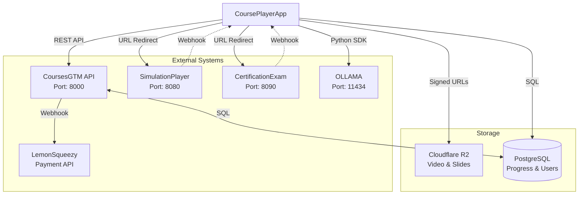
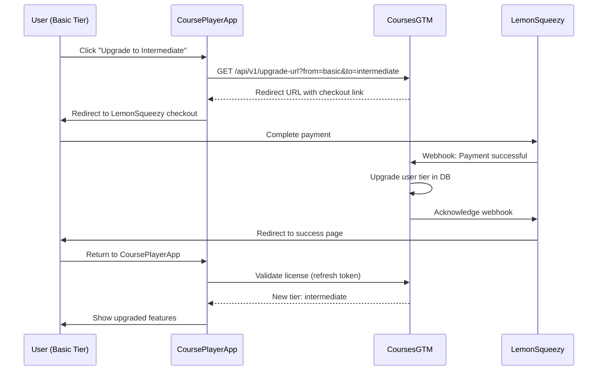

# CoursePlayerApp - Integration Specifications

## Overview

CoursePlayerApp integrates with multiple external systems to provide a complete learning experience. This document defines the integration points, API contracts, authentication, and data flow for each integrated system.

---

## Integration Architecture



---

## 1. CoursesGTM Integration

### Purpose
CoursesGTM (Go-To-Market) is the central API for:
- License validation and management
- Course catalog and curriculum access
- User account management
- Progress synchronization
- Certificate issuance

### Base URL
```
Production: https://api.coursesgtm.com
Development: http://localhost:8000
```

### Authentication
All requests include JWT token in Authorization header:
```http
Authorization: Bearer <JWT_TOKEN>
```

---

### API Endpoints

#### 1.1 License Validation

**POST** `/api/v1/licenses/validate`

Validate a license key and receive user session token.

**Request**:
```json
{
  "license_key": "XXXX-XXXX-XXXX-XXXX"
}
```

**Response** (200 OK):
```json
{
  "success": true,
  "user_id": "uuid-v4",
  "email": "student@example.com",
  "tier": "intermediate",
  "tier_id": 2,
  "token": "eyJhbGciOiJIUzI1NiIsInR5cCI6IkpXVCJ9...",
  "expires_at": "2026-01-13T02:22:41Z",
  "license_status": "active",
  "license_expires": "2027-01-12"
}
```

**Error Response** (401 Unauthorized):
```json
{
  "success": false,
  "error": "Invalid license key",
  "error_code": "INVALID_LICENSE"
}
```

**Implementation**:
```python
# utils/api_client.py
import requests
from typing import Optional

class CoursesGTMClient:
    def __init__(self, base_url: str = "https://api.coursesgtm.com"):
        self.base_url = base_url
        self.session = requests.Session()
    
    def validate_license(self, license_key: str) -> dict:
        """Validate license key and get session token"""
        response = self.session.post(
            f"{self.base_url}/api/v1/licenses/validate",
            json={"license_key": license_key},
            timeout=10
        )
        
        if response.status_code == 200:
            return response.json()
        elif response.status_code == 401:
            raise InvalidLicenseError(response.json().get("error"))
        else:
            raise APIError(f"Unexpected error: {response.status_code}")
```

---

#### 1.2 Get Course Catalog

**GET** `/api/v1/courses`

Fetch all available courses (filtered by user's tier on backend).

**Headers**:
```http
Authorization: Bearer <JWT_TOKEN>
```

**Query Parameters**:
- `tier` (optional): Filter by tier (basic, intermediate, advanced)
- `category` (optional): Filter by category (ai, data-science, machine-learning)

**Response** (200 OK):
```json
{
  "courses": [
    {
      "id": "ai-03-nlp-transformers",
      "title": "Natural Language Processing with Transformers",
      "description": "Learn modern NLP with transformer architectures...",
      "category": "ai",
      "difficulty": "intermediate",
      "required_tier": "intermediate",
      "duration_hours": 40,
      "modules_count": 5,
      "thumbnail_url": "https://cdn.coursesgtm.com/thumbnails/ai-03.jpg",
      "instructor": {
        "name": "Dr. Jane Smith",
        "bio": "NLP researcher at..."
      }
    }
  ],
  "total": 9,
  "accessible": 8
}
```

---

#### 1.3 Get Course Details

**GET** `/api/v1/courses/{course_id}`

Fetch detailed course structure including modules, videos, slides, labs.

**Response** (200 OK):
```json
{
  "id": "ai-03-nlp-transformers",
  "title": "Natural Language Processing with Transformers",
  "description": "...",
  "modules": [
    {
      "id": "module-01",
      "title": "Introduction to NLP",
      "order": 1,
      "videos": [
        {
          "id": "v1-intro",
          "title": "What is NLP?",
          "duration_seconds": 1200,
          "video_url": "https://videos.coursesgtm.com/ai-03/module-01/v1/master.m3u8",
          "subtitle_url": "https://videos.coursesgtm.com/ai-03/module-01/v1/subtitles-en.vtt"
        }
      ],
      "slides": [
        {
          "id": "s1-overview",
          "title": "NLP Overview Slides",
          "slide_count": 50,
          "pdf_url": "https://slides.coursesgtm.com/ai-03/module-01/s1.pdf",
          "pptx_url": "https://slides.coursesgtm.com/ai-03/module-01/s1.pptx"
        }
      ],
      "labs": [
        {
          "id": "lab1-tokenization",
          "title": "Tokenization Basics",
          "description": "Learn to tokenize text...",
          "estimated_time_minutes": 60,
          "difficulty": "beginner"
        }
      ],
      "quiz": {
        "id": "q1-fundamentals",
        "title": "NLP Fundamentals Quiz",
        "questions_count": 10,
        "passing_score": 70
      }
    }
  ]
}
```

---

#### 1.4 Check Course Access

**GET** `/api/v1/courses/{course_id}/access`

Check if user can access a specific course.

**Response** (200 OK):
```json
{
  "course_id": "ai-03-nlp-transformers",
  "accessible": true,
  "user_tier": "intermediate",
  "required_tier": "intermediate",
  "tier_sufficient": true
}
```

**Response** (403 Forbidden):
```json
{
  "course_id": "ai-04-advanced-dl",
  "accessible": false,
  "user_tier": "intermediate",
  "required_tier": "advanced",
  "tier_sufficient": false,
  "upgrade_url": "https://payment.coursesgtm.com/upgrade?from=intermediate&to=advanced"
}
```

---

#### 1.5 Save Progress

**POST** `/api/v1/progress`

Save user's learning progress.

**Request**:
```json
{
  "user_id": "uuid-v4",
  "course_id": "ai-03-nlp-transformers",
  "component_type": "video",
  "component_id": "v1-intro",
  "progress_data": {
    "completion_percentage": 87,
    "last_position_seconds": 1044,
    "duration_seconds": 1200
  },
  "timestamp": "2026-01-12T10:30:00Z"
}
```

**Response** (200 OK):
```json
{
  "success": true,
  "message": "Progress saved successfully"
}
```

---

#### 1.6 Get User Progress

**GET** `/api/v1/progress/{user_id}`

Retrieve user's complete progress across all courses.

**Response** (200 OK):
```json
{
  "user_id": "uuid-v4",
  "courses": [
    {
      "course_id": "ai-03-nlp-transformers",
      "overall_progress": 67,
      "time_spent_seconds": 25200,
      "last_accessed": "2026-01-12T10:30:00Z",
      "modules": [...]
    }
  ]
}
```

---

#### 1.7 Issue Certificate

**POST** `/api/v1/certificates/issue`

Request certificate issuance (called after passing certification exam).

**Request**:
```json
{
  "user_id": "uuid-v4",
  "course_id": "ai-03-nlp-transformers",
  "exam_id": "exam-ai-03",
  "exam_score": 92,
  "passing_score": 80
}
```

**Response** (200 OK):
```json
{
  "certificate_id": "cert-ai-03-2026-01-12-uuid",
  "certificate_url": "https://certificates.coursesgtm.com/cert-ai-03-2026-01-12-uuid.pdf",
  "verification_url": "https://verify.coursesgtm.com/cert-ai-03-2026-01-12-uuid",
  "blockchain_hash": "0x1a2b3c..." // Advanced tier only
}
```

---

### Error Handling

**Standard Error Response**:
```json
{
  "success": false,
  "error": "Human-readable error message",
  "error_code": "ERROR_CODE",
  "details": {}
}
```

**Error Codes**:
- `INVALID_LICENSE`: License key is invalid or expired
- `INSUFFICIENT_TIER`: User's tier is too low for requested resource
- `RESOURCE_NOT_FOUND`: Course/module/video not found
- `RATE_LIMIT_EXCEEDED`: Too many requests (100 req/min limit)
- `UNAUTHORIZED`: Missing or invalid JWT token
- `SERVER_ERROR`: Internal server error

---

## 2. SimulationPlayer Integration

### Purpose
SimulationPlayer is an interactive coding environment for hands-on labs.

### Launch Mechanism
CoursePlayerApp launches SimulationPlayer in a new browser tab/window via URL redirect with query parameters.

### Launch URL Format
```
https://simulationplayer.com/launch?
  course_id={course_id}&
  lab_id={lab_id}&
  user_id={user_id}&
  tier={tier}&
  callback={callback_url}&
  token={jwt_token}
```

**Parameters**:
- `course_id`: Course identifier (e.g., "ai-03")
- `lab_id`: Lab identifier (e.g., "lab1-tokenization")
- `user_id`: User UUID
- `tier`: User's tier (basic/intermediate/advanced)
- `callback`: URL for SimulationPlayer to POST completion data
- `token`: JWT for authentication

**Example**:
```
https://simulationplayer.com/launch?
  course_id=ai-03-nlp-transformers&
  lab_id=lab1-tokenization&
  user_id=uuid-v4&
  tier=intermediate&
  callback=https://courseplayerapp.com/api/webhook/lab-complete&
  token=eyJhbGciOiJIUzI1NiIsInR5cCI6IkpXVCJ9...
```

---

### Implementation

```python
# utils/lab_launcher.py
import streamlit as st
from urllib.parse import urlencode

def launch_lab(course_id: str, lab_id: str):
    """Launch SimulationPlayer for a lab"""
    user_id = st.session_state.get("user_id")
    tier = st.session_state.get("tier")
    token = st.session_state.get("token")
    
    # Check tier permissions
    flags = FeatureFlags.get_flags(tier)
    
    if not flags["labs_interactive"]:
        st.warning("🔒 Interactive labs are available in Intermediate tier ($247)")
        st.info("You can view the lab description and code below:")
        render_lab_preview(lab_id)
        return
    
    # Generate callback URL
    callback_url = "https://courseplayerapp.com/api/webhook/lab-complete"
    
    # Build launch URL
    params = {
        "course_id": course_id,
        "lab_id": lab_id,
        "user_id": user_id,
        "tier": tier,
        "callback": callback_url,
        "token": token
    }
    
    launch_url = f"https://simulationplayer.com/launch?{urlencode(params)}"
    
    # Open in new tab
    st.markdown(f"""
    <a href="{launch_url}" target="_blank">
        <button style="padding: 10px 20px; background: #4CAF50; color: white; border: none; border-radius: 5px; cursor: pointer;">
            🚀 Launch Lab
        </button>
    </a>
    """, unsafe_allow_html=True)
    
    st.info("Lab will open in a new tab. Complete the exercises and submit to track progress.")
```

---

### Completion Webhook

SimulationPlayer calls CoursePlayerApp webhook when user completes lab.

**POST** `/api/webhook/lab-complete`

**Request** (from SimulationPlayer):
```json
{
  "user_id": "uuid-v4",
  "lab_id": "lab1-tokenization",
  "course_id": "ai-03-nlp-transformers",
  "completed": true,
  "score": 95,
  "max_score": 100,
  "time_spent_seconds": 3600,
  "code_submissions": 8,
  "hints_used": 1,
  "completed_at": "2026-01-12T12:00:00Z",
  "signature": "hmac-sha256-signature"  // For verification
}
```

**Response** (200 OK):
```json
{
  "success": true,
  "message": "Lab completion recorded"
}
```

**Webhook Handler**:
```python
# api/webhooks.py
from flask import Flask, request, jsonify
import hmac
import hashlib

app = Flask(__name__)
WEBHOOK_SECRET = "your-webhook-secret"

@app.route('/api/webhook/lab-complete', methods=['POST'])
def lab_complete_webhook():
    """Handle lab completion from SimulationPlayer"""
    data = request.json
    
    # Verify signature
    signature = data.pop('signature')
    expected_signature = hmac.new(
        WEBHOOK_SECRET.encode(),
        json.dumps(data, sort_keys=True).encode(),
        hashlib.sha256
    ).hexdigest()
    
    if signature != expected_signature:
        return jsonify({"success": False, "error": "Invalid signature"}), 401
    
    # Update progress
    from utils.progress_tracker import ProgressTracker
    tracker = ProgressTracker(data['user_id'])
    tracker.update_lab_progress(
        lab_id=data['lab_id'],
        completed=data['completed'],
        score=data['score'],
        time_spent=data['time_spent_seconds']
    )
    
    return jsonify({"success": True, "message": "Lab completion recorded"})
```

---

## 3. CertificationExam Integration

### Purpose
CertificationExam is a proctored exam platform for issuing course certificates.

### Launch Mechanism
Similar to SimulationPlayer, CoursePlayerApp redirects to CertificationExam via URL.

### Launch URL Format
```
https://certificationexam.com/exam?
  course_id={course_id}&
  exam_id={exam_id}&
  user_id={user_id}&
  tier={tier}&
  callback={callback_url}&
  token={jwt_token}
```

**Example**:
```
https://certificationexam.com/exam?
  course_id=ai-03-nlp-transformers&
  exam_id=exam-ai-03&
  user_id=uuid-v4&
  tier=intermediate&
  callback=https://courseplayerapp.com/api/webhook/exam-complete&
  token=eyJhbGciOiJIUzI1NiIsInR5cCI6IkpXVCJ9...
```

---

### Prerequisites Check

Before launching exam, verify user meets requirements:

```python
# utils/exam_launcher.py
def can_take_exam(user_id: str, course_id: str) -> tuple[bool, str]:
    """Check if user can take certification exam"""
    from utils.progress_tracker import ProgressTracker
    
    tracker = ProgressTracker(user_id)
    progress = tracker.get_course_progress(course_id)
    
    if not progress:
        return (False, "You haven't started this course yet")
    
    # Requirement: 80% course completion
    if progress['overall_progress'] < 80:
        return (False, f"Complete at least 80% of the course. Current: {progress['overall_progress']}%")
    
    # Requirement: All quizzes passed (≥70%)
    for module in progress['modules']:
        if 'quiz' in module:
            if module['quiz'].get('percentage', 0) < 70:
                return (False, f"Pass all module quizzes with ≥70%. Failed: {module['title']}")
    
    return (True, "You're ready to take the exam!")


def launch_exam(course_id: str, exam_id: str):
    """Launch CertificationExam"""
    user_id = st.session_state.get("user_id")
    tier = st.session_state.get("tier")
    token = st.session_state.get("token")
    
    # Check prerequisites
    can_take, message = can_take_exam(user_id, course_id)
    
    if not can_take:
        st.error(f"🚫 {message}")
        return
    
    st.success(f"✅ {message}")
    
    # Build launch URL
    params = {
        "course_id": course_id,
        "exam_id": exam_id,
        "user_id": user_id,
        "tier": tier,
        "callback": "https://courseplayerapp.com/api/webhook/exam-complete",
        "token": token
    }
    
    launch_url = f"https://certificationexam.com/exam?{urlencode(params)}"
    
    st.markdown(f"""
    <a href="{launch_url}" target="_blank">
        <button style="padding: 15px 30px; background: #2196F3; color: white; border: none; border-radius: 5px; cursor: pointer; font-size: 16px;">
            📝 Start Certification Exam
        </button>
    </a>
    """, unsafe_allow_html=True)
    
    st.warning("⚠️ Once started, you must complete the exam in one session (2 hours).")
```

---

### Completion Webhook

**POST** `/api/webhook/exam-complete`

**Request** (from CertificationExam):
```json
{
  "user_id": "uuid-v4",
  "exam_id": "exam-ai-03",
  "course_id": "ai-03-nlp-transformers",
  "score": 92,
  "max_score": 100,
  "percentage": 92,
  "passing_score": 80,
  "passed": true,
  "time_taken_seconds": 5400,
  "completed_at": "2026-01-12T14:30:00Z",
  "certificate_id": "cert-ai-03-2026-01-12-uuid",
  "signature": "hmac-sha256-signature"
}
```

**Webhook Handler**:
```python
@app.route('/api/webhook/exam-complete', methods=['POST'])
def exam_complete_webhook():
    """Handle exam completion from CertificationExam"""
    data = request.json
    
    # Verify signature
    # ... (similar to lab webhook)
    
    if data['passed']:
        # Issue certificate via CoursesGTM
        gtm_client = CoursesGTMClient()
        certificate = gtm_client.issue_certificate(
            user_id=data['user_id'],
            course_id=data['course_id'],
            exam_id=data['exam_id'],
            exam_score=data['score'],
            passing_score=data['passing_score']
        )
        
        # Store certificate reference
        from database import db
        db.execute("""
            INSERT INTO user_certificates 
            (user_id, course_id, certificate_id, certificate_url, issued_at)
            VALUES (%s, %s, %s, %s, NOW())
        """, (data['user_id'], data['course_id'], certificate['certificate_id'], certificate['certificate_url']))
        
        return jsonify({
            "success": True,
            "message": "Congratulations! Certificate issued.",
            "certificate_url": certificate['certificate_url']
        })
    else:
        return jsonify({
            "success": True,
            "message": f"Exam not passed. Score: {data['percentage']}%. Passing: {data['passing_score']}%"
        })
```

---

## 4. LemonSqueezy Integration (via CoursesGTM)

### Purpose
LemonSqueezy handles payment processing for license purchases and upgrades.

**Note**: CoursePlayerApp does NOT directly integrate with LemonSqueezy. All payment flows go through CoursesGTM.

### Upgrade Flow



**Implementation**:
```python
# utils/upgrade.py
def get_upgrade_url(from_tier: str, to_tier: str) -> str:
    """Get LemonSqueezy checkout URL for upgrade"""
    user_id = st.session_state.get("user_id")
    token = st.session_state.get("token")
    
    gtm_client = CoursesGTMClient()
    response = gtm_client.session.get(
        f"{gtm_client.base_url}/api/v1/upgrade-url",
        params={"from_tier": from_tier, "to_tier": to_tier, "user_id": user_id},
        headers={"Authorization": f"Bearer {token}"}
    )
    
    if response.status_code == 200:
        return response.json()['checkout_url']
    else:
        raise APIError("Failed to generate upgrade URL")


def render_upgrade_button(to_tier: str):
    """Render upgrade button"""
    current_tier = st.session_state.get("tier")
    
    tier_prices = {
        "intermediate": "$247",
        "advanced": "$497"
    }
    
    upgrade_url = get_upgrade_url(current_tier, to_tier)
    
    st.markdown(f"""
    <a href="{upgrade_url}" target="_blank">
        <button style="padding: 12px 24px; background: #FF9800; color: white; border: none; border-radius: 5px; cursor: pointer; font-size: 16px;">
            ⬆️ Upgrade to {to_tier.title()} ({tier_prices[to_tier]})
        </button>
    </a>
    """, unsafe_allow_html=True)
```

---

## 5. OLLAMA Integration

### Purpose
OLLAMA provides local AI inference for the AI Tutor.

### Connection
CoursePlayerApp connects to OLLAMA via Python SDK.

**Installation**:
```bash
pip install ollama
```

**Configuration**:
```python
# config/settings.py
OLLAMA_HOST = os.getenv("OLLAMA_HOST", "http://localhost:11434")
OLLAMA_MODEL = "llama3.1:8b"
```

**Usage**:
```python
import ollama

# Check connection
try:
    models = ollama.list()
    print(f"Available models: {[m['name'] for m in models['models']]}")
except Exception as e:
    print(f"OLLAMA connection failed: {e}")

# Chat
response = ollama.chat(
    model="llama3.1:8b",
    messages=[
        {"role": "system", "content": "You are a helpful AI tutor."},
        {"role": "user", "content": "What is machine learning?"}
    ]
)

print(response['message']['content'])
```

**Error Handling**:
```python
def call_ollama_safe(prompt: str) -> dict:
    """Call OLLAMA with error handling"""
    try:
        response = ollama.chat(
            model=OLLAMA_MODEL,
            messages=[{"role": "user", "content": prompt}],
            options={"temperature": 0.7}
        )
        return {"success": True, "answer": response['message']['content']}
    except ollama.exceptions.OllamaConnectionError:
        return {"success": False, "answer": "AI Tutor is temporarily unavailable. Please try again later."}
    except Exception as e:
        return {"success": False, "answer": f"Error: {str(e)}"}
```

---

## 6. Cloudflare R2 Integration

### Purpose
Store and serve video files and slides.

### SDK
Use `boto3` (S3-compatible):

```python
import boto3
from botocore.client import Config

# Configure R2 client
s3_client = boto3.client(
    's3',
    endpoint_url='https://your-account-id.r2.cloudflarestorage.com',
    aws_access_key_id='YOUR_ACCESS_KEY_ID',
    aws_secret_access_key='YOUR_SECRET_ACCESS_KEY',
    config=Config(signature_version='s3v4'),
    region_name='auto'
)
```

### Generate Signed URLs

```python
def generate_signed_video_url(video_path: str, expiry_seconds: int = 10800) -> str:
    """Generate signed URL for video (expires in 3 hours by default)"""
    url = s3_client.generate_presigned_url(
        'get_object',
        Params={'Bucket': 'courseplayerapp-videos', 'Key': video_path},
        ExpiresIn=expiry_seconds
    )
    return url
```

---

## Integration Testing

### Mock Servers for Development

```python
# tests/mocks/mock_coursesgtm.py
from flask import Flask, jsonify, request

app = Flask(__name__)

@app.route('/api/v1/licenses/validate', methods=['POST'])
def validate_license():
    data = request.json
    if data['license_key'] == 'TEST-INTERMEDIATE-KEY':
        return jsonify({
            "success": True,
            "user_id": "test-user-123",
            "email": "test@example.com",
            "tier": "intermediate",
            "token": "mock-jwt-token"
        })
    return jsonify({"success": False, "error": "Invalid license"}), 401

# Run mock server
if __name__ == '__main__':
    app.run(port=8000)
```

### Integration Tests

```python
# tests/test_integrations.py
def test_coursesgtm_license_validation():
    client = CoursesGTMClient(base_url="http://localhost:8000")
    result = client.validate_license("TEST-INTERMEDIATE-KEY")
    assert result['tier'] == 'intermediate'

def test_lab_launch_url_generation():
    url = generate_lab_launch_url("ai-03", "lab1", "user123", "intermediate", "token123")
    assert "simulationplayer.com" in url
    assert "course_id=ai-03" in url
```

---

## Conclusion

This integration specification ensures:
- **Clear contracts**: Well-defined APIs and data formats
- **Robust error handling**: Graceful degradation
- **Security**: JWT authentication, webhook signatures
- **Testability**: Mock servers for development
- **Scalability**: Async webhooks, caching strategies

All integrations are designed to be loosely coupled, allowing independent deployment and updates of each system.
