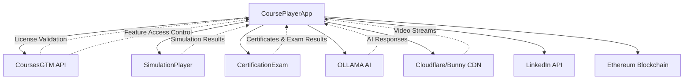

# CoursePlayerApp Integrations Specification

## Overview

CoursePlayerApp integrates with multiple external systems to provide a complete learning experience. This document specifies all integration points, API contracts, and data flows.

---

## Integration Architecture



---

## 1. Integration with CoursesGTM

### Purpose
- License validation and tier management
- Feature access control
- Usage tracking and quota management

### API Client Implementation

```python
# courseplayerapp/integrations/coursesgtm_client.py

import httpx
from typing import Optional, List, Dict
from datetime import datetime
from pydantic import BaseModel

class LicenseInfo(BaseModel):
    """License information returned by CoursesGTM."""
    user_id: str
    license_key: str
    tier: str  # 'basic', 'intermediate', 'advanced'
    valid: bool
    expires_at: Optional[datetime]
    features_enabled: List[str]

class Course(BaseModel):
    """Course information."""
    id: str
    title: str
    description: str
    instructor: str
    duration_hours: int
    tier_required: str

class CoursesGTMClient:
    """Client for integrating with CoursesGTM API."""
    
    def __init__(self, base_url: str = "https://gtm.gai-observe.online"):
        self.base_url = base_url
        self.api_key = get_api_key()
    
    async def validate_license(self, license_key: str) -> LicenseInfo:
        """
        Validate user's license and get tier information.
        
        Args:
            license_key: User's license key
        
        Returns:
            LicenseInfo object with tier and features
        
        Raises:
            HTTPException: If license is invalid
        """
        async with httpx.AsyncClient() as client:
            response = await client.post(
                f"{self.base_url}/api/licenses/validate",
                json={"license_key": license_key},
                headers={"Authorization": f"Bearer {self.api_key}"}
            )
            
            if response.status_code == 200:
                data = response.json()
                return LicenseInfo(**data)
            elif response.status_code == 401:
                raise HTTPException(status_code=401, detail="Invalid license key")
            else:
                raise HTTPException(status_code=500, detail="License validation failed")
    
    async def get_accessible_courses(self, user_id: str, tier: str) -> List[Course]:
        """
        Get list of courses user can access based on their tier.
        
        Args:
            user_id: User identifier
            tier: User's subscription tier
        
        Returns:
            List of Course objects
        """
        async with httpx.AsyncClient() as client:
            response = await client.get(
                f"{self.base_url}/api/courses",
                params={"user_id": user_id, "tier": tier},
                headers={"Authorization": f"Bearer {self.api_key}"}
            )
            
            if response.status_code == 200:
                data = response.json()
                return [Course(**course) for course in data["courses"]]
            else:
                return []
    
    async def check_feature_access(self, user_id: str, feature: str) -> bool:
        """
        Check if user's tier allows access to a specific feature.
        
        Args:
            user_id: User identifier
            feature: Feature to check (e.g., 'video_download', 'ai_tutor')
        
        Returns:
            True if user has access, False otherwise
        """
        async with httpx.AsyncClient() as client:
            response = await client.get(
                f"{self.base_url}/api/features/check",
                params={"user_id": user_id, "feature": feature},
                headers={"Authorization": f"Bearer {self.api_key}"}
            )
            
            if response.status_code == 200:
                data = response.json()
                return data.get("has_access", False)
            else:
                return False
    
    async def track_usage(
        self,
        user_id: str,
        resource_type: str,
        resource_id: str,
        usage_data: Dict
    ):
        """
        Track resource usage for billing and analytics.
        
        Args:
            user_id: User identifier
            resource_type: Type of resource ('video', 'ai_tutor', 'lab', etc.)
            resource_id: Specific resource identifier
            usage_data: Additional usage metadata
        """
        async with httpx.AsyncClient() as client:
            await client.post(
                f"{self.base_url}/api/usage/track",
                json={
                    "user_id": user_id,
                    "resource_type": resource_type,
                    "resource_id": resource_id,
                    "timestamp": datetime.now().isoformat(),
                    **usage_data
                },
                headers={"Authorization": f"Bearer {self.api_key}"}
            )
    
    async def get_user_quota(self, user_id: str, quota_type: str) -> Dict:
        """
        Get user's remaining quota for a specific resource.
        
        Args:
            user_id: User identifier
            quota_type: Type of quota ('ai_questions', 'simulations', etc.)
        
        Returns:
            {
                "limit": int,
                "used": int,
                "remaining": int,
                "reset_date": datetime
            }
        """
        async with httpx.AsyncClient() as client:
            response = await client.get(
                f"{self.base_url}/api/quotas/{user_id}/{quota_type}",
                headers={"Authorization": f"Bearer {self.api_key}"}
            )
            
            if response.status_code == 200:
                return response.json()
            else:
                return {"limit": 0, "used": 0, "remaining": 0}
```

### Integration Points

| Endpoint | Method | Purpose | When Called |
|----------|--------|---------|-------------|
| `/api/licenses/validate` | POST | Validate license key | User login |
| `/api/courses` | GET | Get accessible courses | Dashboard load |
| `/api/features/check` | GET | Check feature access | Before showing feature |
| `/api/usage/track` | POST | Track usage | Resource consumption |
| `/api/quotas/{user_id}/{type}` | GET | Get quota info | Before quota-limited action |

---

## 2. Integration with SimulationPlayer

### Purpose
- Launch interactive simulations from labs
- Track simulation progress and completion
- Return results to progress tracker

### API Client Implementation

```python
# courseplayerapp/integrations/simulationplayer_client.py

import httpx
from typing import Optional, Dict
from pydantic import BaseModel
from datetime import datetime

class SimulationProgress(BaseModel):
    """Simulation progress data."""
    simulation_id: str
    user_id: str
    status: str  # 'not_started', 'in_progress', 'completed'
    score: Optional[int] = None  # 0-100
    completion_percent: int = 0
    time_spent_seconds: int = 0
    completed_at: Optional[datetime] = None

class SimulationPlayerClient:
    """Client for integrating with SimulationPlayer service."""
    
    def __init__(self, base_url: str = "https://simulation.gai-observe.online"):
        self.base_url = base_url
        self.api_key = get_api_key()
    
    async def launch_simulation(
        self,
        simulation_id: str,
        user_id: str,
        context: Dict
    ) -> str:
        """
        Launch a simulation session.
        
        Args:
            simulation_id: Unique simulation identifier
            user_id: User launching the simulation
            context: {
                "course_id": str,
                "module_id": str,
                "lab_id": str
            }
        
        Returns:
            URL to access simulation (opens in new tab/iframe)
        """
        async with httpx.AsyncClient() as client:
            response = await client.post(
                f"{self.base_url}/api/simulations/launch",
                json={
                    "simulation_id": simulation_id,
                    "user_id": user_id,
                    "context": context,
                    "return_url": "https://gai-observe.online/course"  # Where to return after simulation
                },
                headers={"Authorization": f"Bearer {self.api_key}"}
            )
            
            if response.status_code == 200:
                data = response.json()
                
                # Track launch event
                await self._track_simulation_launch(user_id, simulation_id)
                
                return data["simulation_url"]
            else:
                raise Exception("Failed to launch simulation")
    
    async def get_simulation_progress(
        self,
        user_id: str,
        simulation_id: str
    ) -> SimulationProgress:
        """
        Get user's progress in a simulation.
        
        Args:
            user_id: User identifier
            simulation_id: Simulation identifier
        
        Returns:
            SimulationProgress object
        """
        async with httpx.AsyncClient() as client:
            response = await client.get(
                f"{self.base_url}/api/simulations/{simulation_id}/progress",
                params={"user_id": user_id},
                headers={"Authorization": f"Bearer {self.api_key}"}
            )
            
            if response.status_code == 200:
                data = response.json()
                return SimulationProgress(**data)
            else:
                # Return default not started
                return SimulationProgress(
                    simulation_id=simulation_id,
                    user_id=user_id,
                    status="not_started",
                    completion_percent=0
                )
    
    async def get_simulation_results(
        self,
        user_id: str,
        simulation_id: str
    ) -> Optional[Dict]:
        """
        Get detailed results from a completed simulation.
        
        Args:
            user_id: User identifier
            simulation_id: Simulation identifier
        
        Returns:
            {
                "score": int,
                "feedback": str,
                "completed_tasks": List[str],
                "errors": List[Dict],
                "time_spent": int
            }
        """
        async with httpx.AsyncClient() as client:
            response = await client.get(
                f"{self.base_url}/api/simulations/{simulation_id}/results",
                params={"user_id": user_id},
                headers={"Authorization": f"Bearer {self.api_key}"}
            )
            
            if response.status_code == 200:
                return response.json()
            else:
                return None
    
    async def _track_simulation_launch(self, user_id: str, simulation_id: str):
        """Track simulation launch for analytics."""
        # Send to CoursesGTM for usage tracking
        gtm_client = CoursesGTMClient()
        await gtm_client.track_usage(
            user_id=user_id,
            resource_type="simulation",
            resource_id=simulation_id,
            usage_data={"action": "launch"}
        )
```

### Webhook Handler

SimulationPlayer can send webhooks when simulations are completed:

```python
# courseplayerapp/api/webhooks.py

from fastapi import APIRouter, Request
from courseplayerapp.progress.tracker import ProgressTracker

router = APIRouter()

@router.post("/webhooks/simulation-completed")
async def handle_simulation_completed(request: Request):
    """
    Handle simulation completion webhook from SimulationPlayer.
    
    Payload:
        {
            "simulation_id": str,
            "user_id": str,
            "score": int,
            "completion_percent": 100,
            "time_spent_seconds": int,
            "completed_at": datetime
        }
    """
    data = await request.json()
    
    # Verify webhook signature (security)
    verify_webhook_signature(request.headers.get("X-Signature"), data)
    
    # Update user progress
    tracker = ProgressTracker(data["user_id"])
    tracker.update_progress(
        course_id=data.get("course_id"),
        module_id=data.get("module_id"),
        resource_type="simulation",
        resource_id=data["simulation_id"],
        completion_percent=data["completion_percent"],
        time_spent=data["time_spent_seconds"],
        score=data.get("score")
    )
    
    return {"status": "success"}
```

---

## 3. Integration with CertificationExam

### Purpose
- Launch certification exams
- Retrieve exam results
- Fetch and display certificates

### API Client Implementation

**See CERTIFICATE_DISPLAY.md for complete implementation**

Key endpoints:
- `POST /api/exams/launch` - Launch exam session
- `GET /api/exams/{exam_id}/results` - Get exam results
- `GET /api/certificates/user/{user_id}` - Get user's certificates
- `GET /api/certificates/verify/{cert_id}` - Verify certificate (public)

---

## 4. Integration with OLLAMA AI

### Purpose
- Context-aware Q&A for AI Tutor
- Code explanation and debugging
- Learning assistance

### API Client Implementation

**See AI_TUTOR.md for complete implementation**

Key integration:
```python
async def call_ollama(prompt: str, model: str = "llama3:70b") -> str:
    """Call OLLAMA API for AI generation."""
    async with httpx.AsyncClient(timeout=60.0) as client:
        response = await client.post(
            "http://localhost:11434/api/generate",
            json={
                "model": model,
                "prompt": prompt,
                "stream": False
            }
        )
        return response.json()["response"]
```

---

## 5. Integration with Video CDN

### Cloudflare Stream

```python
# courseplayerapp/integrations/cloudflare_stream.py

import httpx

class CloudflareStreamClient:
    """Client for Cloudflare Stream video delivery."""
    
    def __init__(self):
        self.account_id = CLOUDFLARE_ACCOUNT_ID
        self.api_token = CLOUDFLARE_API_TOKEN
        self.base_url = f"https://api.cloudflare.com/client/v4/accounts/{self.account_id}/stream"
    
    async def upload_video(self, video_file_path: str, metadata: Dict) -> str:
        """
        Upload video to Cloudflare Stream.
        
        Args:
            video_file_path: Path to video file
            metadata: Video metadata (title, course_id, etc.)
        
        Returns:
            Video ID
        """
        headers = {"Authorization": f"Bearer {self.api_token}"}
        
        with open(video_file_path, "rb") as video_file:
            files = {"file": video_file}
            data = {"meta": json.dumps(metadata)}
            
            async with httpx.AsyncClient() as client:
                response = await client.post(
                    self.base_url,
                    headers=headers,
                    files=files,
                    data=data
                )
                
                if response.status_code == 200:
                    return response.json()["result"]["uid"]
                else:
                    raise Exception("Video upload failed")
    
    def get_stream_url(self, video_id: str) -> str:
        """Get HLS manifest URL for video streaming."""
        return f"https://customer-{CUSTOMER_CODE}.cloudflarestream.com/{video_id}/manifest/video.m3u8"
    
    async def get_signed_download_url(
        self,
        video_id: str,
        quality: str = "720p",
        expires_in: int = 3600
    ) -> str:
        """
        Generate signed URL for video download (tier-gated feature).
        
        Args:
            video_id: Video identifier
            quality: Video quality (720p, 1080p)
            expires_in: URL expiration in seconds
        
        Returns:
            Signed download URL
        """
        # Generate signed token
        token = generate_signed_token(video_id, expires_in)
        
        return f"https://customer-{CUSTOMER_CODE}.cloudflarestream.com/{video_id}/downloads/{quality}.mp4?token={token}"
```

---

## 6. Integration with LinkedIn

### Purpose
- One-click certificate sharing to LinkedIn profile

### Implementation

**See CERTIFICATE_DISPLAY.md for complete implementation**

```python
def generate_linkedin_share_url(certificate_name: str, issue_date: datetime, certificate_url: str) -> str:
    """Generate pre-filled LinkedIn Add Certification URL."""
    params = {
        "startTask": "CERTIFICATION_NAME",
        "name": certificate_name,
        "organizationName": "EdGuide",
        "issueYear": issue_date.year,
        "issueMonth": issue_date.month,
        "certUrl": certificate_url
    }
    return f"https://www.linkedin.com/profile/add?{urlencode(params)}"
```

---

## 7. Integration with Blockchain

### Purpose
- Issue blockchain-verified certificates (Advanced tier)
- Immutable proof of completion

### Implementation

**See CERTIFICATE_DISPLAY.md for complete implementation**

Key operations:
- `issue_certificate_on_chain()` - Write certificate to blockchain
- `verify_certificate_on_chain()` - Verify certificate authenticity
- Smart contract: CertificateRegistry.sol

---

## Error Handling

### Retry Logic

```python
from tenacity import retry, stop_after_attempt, wait_exponential

@retry(
    stop=stop_after_attempt(3),
    wait=wait_exponential(multiplier=1, min=2, max=10)
)
async def call_external_api(url: str, **kwargs):
    """Call external API with automatic retry on failure."""
    async with httpx.AsyncClient() as client:
        response = await client.request(**kwargs)
        response.raise_for_status()
        return response.json()
```

### Circuit Breaker

```python
from circuitbreaker import circuit

@circuit(failure_threshold=5, recovery_timeout=60)
async def call_simulation_player(simulation_id: str):
    """Call SimulationPlayer with circuit breaker to prevent cascading failures."""
    # If 5 consecutive failures, circuit opens for 60 seconds
    return await simulation_client.launch_simulation(simulation_id, user_id, context)
```

---

## Authentication & Security

### API Key Management

```python
# Store API keys securely in environment variables
COURSESGTM_API_KEY = os.getenv("COURSESGTM_API_KEY")
SIMULATION_API_KEY = os.getenv("SIMULATION_API_KEY")
CERTEXAM_API_KEY = os.getenv("CERTEXAM_API_KEY")

# Rotate API keys regularly (every 90 days)
```

### Request Signing

```python
import hmac
import hashlib

def sign_request(payload: Dict, secret: str) -> str:
    """Sign request payload with HMAC-SHA256."""
    message = json.dumps(payload, sort_keys=True)
    signature = hmac.new(
        secret.encode(),
        message.encode(),
        hashlib.sha256
    ).hexdigest()
    return signature

def verify_webhook_signature(signature: str, payload: Dict) -> bool:
    """Verify webhook signature."""
    expected = sign_request(payload, WEBHOOK_SECRET)
    return hmac.compare_digest(signature, expected)
```

---

## Rate Limiting

### Client-Side Rate Limiting

```python
from ratelimit import limits, sleep_and_retry

# Max 100 requests per minute to CoursesGTM
@sleep_and_retry
@limits(calls=100, period=60)
async def call_coursesgtm_api(endpoint: str, **kwargs):
    """Rate-limited call to CoursesGTM API."""
    return await coursesgtm_client.request(endpoint, **kwargs)
```

---

## Monitoring & Logging

### Integration Health Checks

```python
# courseplayerapp/integrations/health.py

async def check_integration_health() -> Dict[str, bool]:
    """Check health of all external integrations."""
    results = {}
    
    try:
        await coursesgtm_client.get_accessible_courses("health_check", "basic")
        results["coursesgtm"] = True
    except:
        results["coursesgtm"] = False
    
    try:
        await simulation_client.get_simulation_progress("health_check", "sim_001")
        results["simulationplayer"] = True
    except:
        results["simulationplayer"] = False
    
    try:
        await cert_client.get_user_certificates("health_check")
        results["certificationexam"] = True
    except:
        results["certificationexam"] = False
    
    try:
        await ollama_client._call_ollama("test", "llama3:70b")
        results["ollama"] = True
    except:
        results["ollama"] = False
    
    return results
```

### Logging

```python
import logging

logger = logging.getLogger("integrations")

# Log all API calls
logger.info(f"Calling CoursesGTM: validate_license for user {user_id}")
logger.error(f"SimulationPlayer API error: {error_message}")
```

---

**Document Version**: 1.0  
**Last Updated**: 2026-01-14  
**Author**: EdGuide Integration Team  
**Platform**: EdGuide (gai-observe.online)
