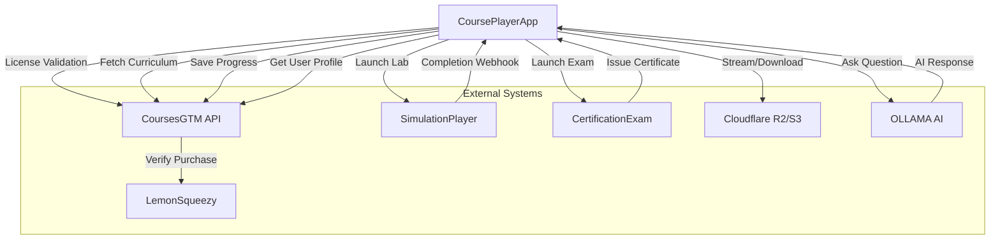
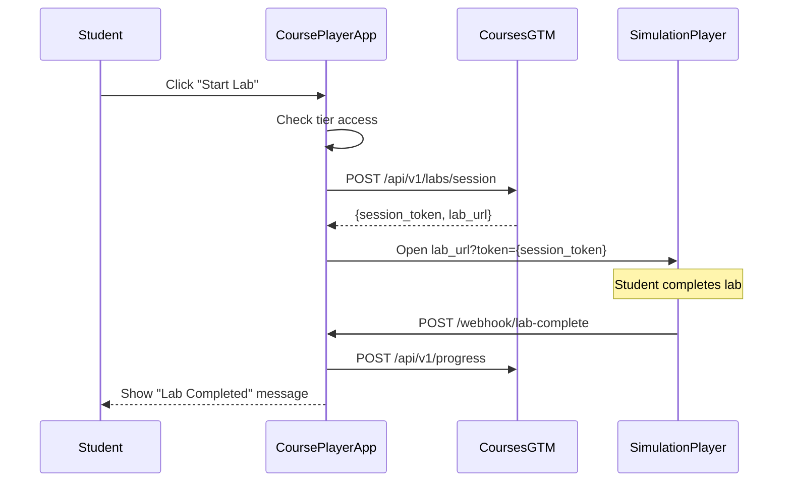
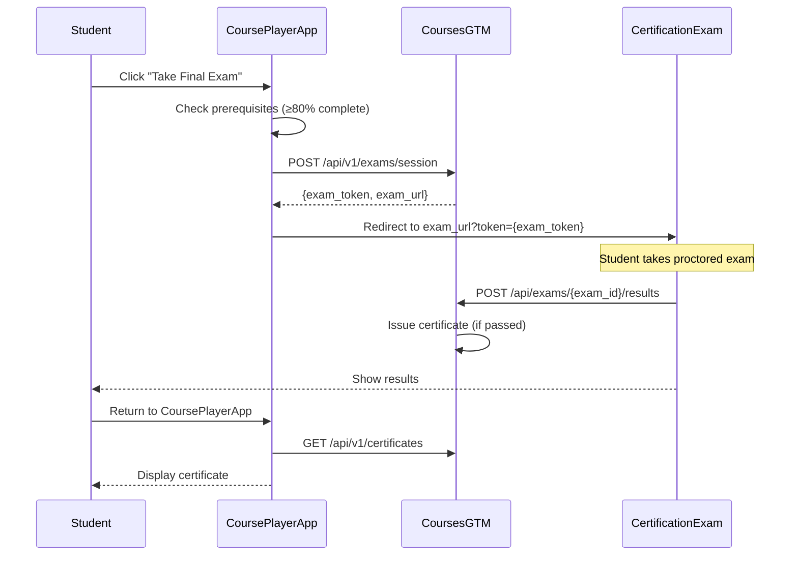

# Integration Specifications

## Overview

CoursePlayerApp integrates with multiple external systems to provide a complete learning experience. This document specifies the integration points, API contracts, data flows, and error handling for each external system.

---

## Integration Architecture



---

## 1. CoursesGTM API Integration

### Base URL
- **Production**: `https://api.coursesgtm.com`
- **Staging**: `https://staging-api.coursesgtm.com`
- **Local Dev**: `http://localhost:8000`

### Authentication
All API requests require JWT token in header:
```
Authorization: Bearer <jwt_token>
```

### API Endpoints

#### 1.1 License Validation

**POST `/api/v1/licenses/validate`**

Validate license key and get user profile.

**Request**:
```json
{
  "license_key": "LMSQ-XXXX-XXXX-XXXX-XXXX"
}
```

**Response** (200 OK):
```json
{
  "success": true,
  "user_id": "user_12345",
  "email": "student@example.com",
  "tier": "intermediate",
  "license_status": "active",
  "expires_at": "2027-01-14T00:00:00Z",
  "token": "eyJhbGciOiJIUzI1NiIsInR5cCI6IkpXVCJ9...",
  "token_expires_at": "2026-01-15T00:00:00Z"
}
```

**Error Responses**:
- `400 Bad Request`: Invalid license key format
- `401 Unauthorized`: License key expired or revoked
- `404 Not Found`: License key not found

**Implementation**:
```python
import requests

def validate_license(license_key: str) -> dict:
    """Validate license with CoursesGTM"""
    
    response = requests.post(
        f"{API_BASE_URL}/api/v1/licenses/validate",
        json={"license_key": license_key},
        timeout=10
    )
    
    if response.status_code == 200:
        return response.json()
    elif response.status_code == 401:
        raise Exception("Invalid or expired license key")
    else:
        raise Exception(f"Validation failed: {response.status_code}")
```

---

#### 1.2 Get Curriculum

**GET `/api/v1/courses`**

Fetch list of courses accessible to user.

**Query Parameters**:
- `tier`: User's tier (basic/intermediate/advanced)
- `include_metadata`: Include full course details (default: false)

**Response** (200 OK):
```json
{
  "courses": [
    {
      "course_id": "ai-01",
      "title": "Introduction to AI",
      "description": "Learn AI fundamentals",
      "difficulty": "beginner",
      "duration_hours": 12,
      "thumbnail_url": "https://cdn.../ai-01-thumb.jpg",
      "instructor": "Dr. Jane Smith",
      "modules_count": 6,
      "accessible": true
    },
    {
      "course_id": "ai-04",
      "title": "Deep Learning & Neural Networks",
      "description": "Advanced AI topics",
      "difficulty": "advanced",
      "duration_hours": 20,
      "thumbnail_url": "https://cdn.../ai-04-thumb.jpg",
      "instructor": "Dr. John Doe",
      "modules_count": 10,
      "accessible": false,
      "upgrade_required": "advanced"
    }
  ]
}
```

**Implementation**:
```python
def get_accessible_courses(tier: str, token: str) -> list:
    """Fetch courses accessible to user's tier"""
    
    response = requests.get(
        f"{API_BASE_URL}/api/v1/courses",
        params={"tier": tier, "include_metadata": True},
        headers={"Authorization": f"Bearer {token}"},
        timeout=10
    )
    
    if response.status_code == 200:
        return response.json()['courses']
    else:
        raise Exception(f"Failed to fetch courses: {response.status_code}")
```

---

#### 1.3 Get Course Details

**GET `/api/v1/courses/{course_id}`**

Get detailed information about a specific course.

**Response** (200 OK):
```json
{
  "course_id": "ai-03-nlp-transformers",
  "title": "Natural Language Processing with Transformers",
  "description": "Master NLP using modern transformer models",
  "difficulty": "intermediate",
  "duration_hours": 18,
  "instructor": {
    "name": "Dr. Emily Chen",
    "bio": "NLP researcher with 10+ years experience",
    "avatar_url": "https://cdn.../emily-chen.jpg"
  },
  "prerequisites": ["ai-01", "ml-01"],
  "modules": [
    {
      "module_id": "module-01",
      "title": "Introduction to NLP",
      "order": 1,
      "duration_minutes": 90,
      "videos": [
        {
          "video_id": "v01",
          "title": "What is NLP?",
          "duration_seconds": 1200,
          "order": 1
        }
      ],
      "slides": [
        {
          "slide_deck_id": "slides-01",
          "title": "NLP Fundamentals",
          "slides_count": 45
        }
      ],
      "labs": [
        {
          "lab_id": "lab-01",
          "title": "Tokenization Practice",
          "difficulty": "easy"
        }
      ],
      "quiz": {
        "quiz_id": "quiz-01",
        "title": "NLP Basics Quiz",
        "questions_count": 10,
        "passing_score": 70
      }
    }
  ],
  "final_exam": {
    "exam_id": "exam-ai-03",
    "title": "NLP Certification Exam",
    "duration_minutes": 120,
    "passing_score": 80,
    "prerequisites": ["completion >= 80%"]
  }
}
```

---

#### 1.4 Check Course Access

**GET `/api/v1/courses/{course_id}/access`**

Check if user has access to a specific course.

**Response** (200 OK):
```json
{
  "course_id": "ai-03-nlp-transformers",
  "has_access": true,
  "reason": "included_in_tier",
  "tier_required": "intermediate"
}
```

**Response** (403 Forbidden):
```json
{
  "course_id": "ai-04",
  "has_access": false,
  "reason": "tier_insufficient",
  "tier_required": "advanced",
  "current_tier": "intermediate",
  "upgrade_url": "https://gai-observe.com/upgrade"
}
```

---

#### 1.5 Save Progress

**POST `/api/v1/progress`**

Save user progress (video, quiz, lab, etc.).

**Request** (Video Progress):
```json
{
  "user_id": "user_12345",
  "course_id": "ai-03",
  "progress_type": "video",
  "item_id": "v01",
  "data": {
    "position_seconds": 540,
    "duration_seconds": 1200,
    "completion_percentage": 45,
    "watched": false
  },
  "timestamp": "2026-01-14T10:30:00Z"
}
```

**Request** (Quiz Completion):
```json
{
  "user_id": "user_12345",
  "course_id": "ai-03",
  "module_id": "module-01",
  "progress_type": "quiz",
  "item_id": "quiz-01",
  "data": {
    "score": 8,
    "max_score": 10,
    "percentage": 80,
    "passed": true,
    "attempt_number": 2
  },
  "timestamp": "2026-01-14T11:00:00Z"
}
```

**Response** (200 OK):
```json
{
  "success": true,
  "progress_updated": true,
  "overall_course_progress": 67
}
```

---

#### 1.6 Get User Progress

**GET `/api/v1/users/{user_id}/progress`**

Fetch complete user progress data.

**Query Parameters**:
- `course_id` (optional): Filter by specific course

**Response**: See Progress Tracking specification for full schema.

---

### Error Handling

```python
def handle_api_error(response):
    """Handle CoursesGTM API errors"""
    
    if response.status_code == 401:
        # Token expired - re-authenticate
        st.session_state.clear()
        st.error("Session expired. Please log in again.")
        st.rerun()
    
    elif response.status_code == 403:
        # Access denied
        st.error("Access denied. Please upgrade your tier.")
    
    elif response.status_code == 429:
        # Rate limited
        st.warning("Too many requests. Please wait a moment.")
    
    elif response.status_code >= 500:
        # Server error
        st.error("Service temporarily unavailable. Please try again later.")
    
    else:
        # Other errors
        st.error(f"An error occurred: {response.status_code}")
```

---

## 2. SimulationPlayer Integration

### Purpose
SimulationPlayer provides interactive coding environments for hands-on labs.

### Integration Flow



### Lab Launch

**Step 1: Request Lab Session**

```python
def launch_lab(course_id: str, lab_id: str, user_id: str, token: str):
    """Launch SimulationPlayer for lab"""
    
    # Request session from CoursesGTM
    response = requests.post(
        f"{API_BASE_URL}/api/v1/labs/session",
        json={
            "user_id": user_id,
            "course_id": course_id,
            "lab_id": lab_id
        },
        headers={"Authorization": f"Bearer {token}"}
    )
    
    if response.status_code == 200:
        data = response.json()
        session_token = data['session_token']
        lab_url = data['lab_url']
        
        # Open SimulationPlayer in new window
        open_in_new_window(lab_url, session_token)
    else:
        st.error("Failed to launch lab. Please try again.")
```

**Step 2: Open Lab in New Window**

```python
def open_in_new_window(lab_url: str, session_token: str):
    """Open lab in new browser window/tab"""
    
    full_url = f"{lab_url}?token={session_token}"
    
    # JavaScript to open new window
    js_code = f"""
    <script>
        window.open('{full_url}', '_blank', 'width=1200,height=800');
    </script>
    """
    
    st.components.v1.html(js_code, height=0)
    
    st.success("✅ Lab launched in new window!")
    st.info("💡 Complete the lab and it will automatically sync your progress.")
```

### Lab Completion Webhook

**Endpoint**: `POST /webhook/lab-complete`

SimulationPlayer calls this webhook when student completes a lab.

**Request Payload**:
```json
{
  "session_token": "session_xyz",
  "user_id": "user_12345",
  "course_id": "ai-03",
  "lab_id": "lab-01",
  "score": 95,
  "max_score": 100,
  "time_spent_seconds": 3600,
  "completed_at": "2026-01-14T12:00:00Z",
  "code_submitted": "# Student's code...",
  "test_results": {
    "passed": 19,
    "failed": 1,
    "total": 20
  }
}
```

**Webhook Handler**:
```python
from fastapi import FastAPI, HTTPException
from pydantic import BaseModel

app = FastAPI()

class LabCompletionWebhook(BaseModel):
    session_token: str
    user_id: str
    course_id: str
    lab_id: str
    score: int
    max_score: int
    time_spent_seconds: int
    completed_at: str

@app.post("/webhook/lab-complete")
async def handle_lab_completion(payload: LabCompletionWebhook):
    """Handle lab completion from SimulationPlayer"""
    
    # Validate session token
    if not validate_session_token(payload.session_token):
        raise HTTPException(status_code=401, detail="Invalid session token")
    
    # Save progress to CoursesGTM
    success = sync_lab_completion(
        user_id=payload.user_id,
        course_id=payload.course_id,
        lab_id=payload.lab_id,
        score=payload.score,
        time_spent=payload.time_spent_seconds
    )
    
    if success:
        # Trigger notification (optional)
        notify_user_lab_complete(payload.user_id, payload.lab_id, payload.score)
        
        return {"success": True, "message": "Progress updated"}
    else:
        raise HTTPException(status_code=500, detail="Failed to save progress")
```

---

## 3. CertificationExam Integration

### Purpose
CertificationExam handles proctored exams and certificate issuance.

### Integration Flow



### Exam Launch

```python
def launch_exam(course_id: str, exam_id: str, user_id: str, token: str):
    """Launch CertificationExam"""
    
    # Check prerequisites
    progress = get_user_course_progress(user_id, course_id)
    
    if progress['overall_progress'] < 80:
        st.error("❌ You must complete at least 80% of the course to take the exam.")
        st.info(f"Current progress: {progress['overall_progress']}%")
        return
    
    # Request exam session
    response = requests.post(
        f"{API_BASE_URL}/api/v1/exams/session",
        json={
            "user_id": user_id,
            "course_id": course_id,
            "exam_id": exam_id
        },
        headers={"Authorization": f"Bearer {token}"}
    )
    
    if response.status_code == 200:
        data = response.json()
        exam_url = data['exam_url']
        exam_token = data['exam_token']
        
        # Redirect to CertificationExam
        st.markdown(f"""
        <meta http-equiv="refresh" content="0; url={exam_url}?token={exam_token}">
        """, unsafe_allow_html=True)
        
        st.info("🔄 Redirecting to exam platform...")
    else:
        st.error("Failed to launch exam. Please try again.")
```

### Certificate Retrieval

**GET `/api/v1/certificates`**

Fetch user's earned certificates.

**Response**:
```json
{
  "certificates": [
    {
      "certificate_id": "cert-ai-03-2026-01-15",
      "course_id": "ai-03",
      "course_title": "Natural Language Processing with Transformers",
      "issued_date": "2026-01-15T12:00:00Z",
      "final_score": 92,
      "grade": "A",
      "tier": "intermediate",
      "blockchain_verified": false,
      "verification_url": "https://verify.gai-observe.com/cert-ai-03-2026-01-15",
      "pdf_url": "https://cdn.../certificates/cert-ai-03-2026-01-15.pdf",
      "linkedin_share_url": "https://linkedin.com/sharing/share-offsite/?url=..."
    }
  ]
}
```

---

## 4. Cloudflare R2 / AWS S3 Integration

### Video Storage

**Bucket Structure**:
```
gai-observe-videos/
├── courses/
│   └── {course_id}/
│       └── {module_id}/
│           └── {video_id}/
│               ├── master.m3u8
│               ├── 480p/
│               ├── 720p/
│               └── 1080p/
└── downloads/
    └── {course_id}_{module_id}_{video_id}_{quality}.mp4
```

**Signed URL Generation**:
```python
import boto3
from botocore.exceptions import ClientError

def generate_signed_url(video_id: str, quality: str, expiry_seconds: int = 3600):
    """Generate pre-signed URL for video download"""
    
    s3_client = boto3.client(
        's3',
        aws_access_key_id=AWS_ACCESS_KEY,
        aws_secret_access_key=AWS_SECRET_KEY,
        region_name=AWS_REGION
    )
    
    object_key = f"downloads/{video_id}_{quality}.mp4"
    
    try:
        url = s3_client.generate_presigned_url(
            'get_object',
            Params={
                'Bucket': BUCKET_NAME,
                'Key': object_key
            },
            ExpiresIn=expiry_seconds
        )
        return url
    except ClientError as e:
        st.error(f"Failed to generate download URL: {e}")
        return None
```

---

## 5. OLLAMA Integration

See AI_TUTOR.md for detailed OLLAMA integration.

**Summary**:
- Local LLM inference
- Model: `llama3.1:8b`
- HTTP API: `http://localhost:11434`
- Python client: `ollama` package

---

## Integration Testing

### Mock Servers for Development

```python
# tests/mocks/coursesgtm_mock.py
from flask import Flask, jsonify, request

app = Flask(__name__)

@app.route('/api/v1/licenses/validate', methods=['POST'])
def validate_license():
    data = request.json
    
    if data['license_key'] == 'TEST-KEY-123':
        return jsonify({
            "success": True,
            "user_id": "test_user",
            "email": "test@example.com",
            "tier": "intermediate",
            "token": "test_token_123"
        })
    else:
        return jsonify({"error": "Invalid license"}), 401

@app.route('/api/v1/courses', methods=['GET'])
def get_courses():
    return jsonify({
        "courses": [
            {
                "course_id": "ai-01",
                "title": "Introduction to AI",
                "accessible": True
            }
        ]
    })

if __name__ == '__main__':
    app.run(port=8000)
```

---

## Rate Limiting & Retry Logic

```python
from requests.adapters import HTTPAdapter
from requests.packages.urllib3.util.retry import Retry

def create_session_with_retries():
    """Create requests session with retry logic"""
    
    session = requests.Session()
    
    retry = Retry(
        total=3,
        backoff_factor=1,
        status_forcelist=[429, 500, 502, 503, 504],
        allowed_methods=["GET", "POST"]
    )
    
    adapter = HTTPAdapter(max_retries=retry)
    session.mount("http://", adapter)
    session.mount("https://", adapter)
    
    return session
```

---

## Conclusion

CoursePlayerApp integrates seamlessly with external systems through well-defined APIs, webhooks, and error handling. All integrations include retry logic, timeout handling, and graceful degradation to ensure a robust user experience.

