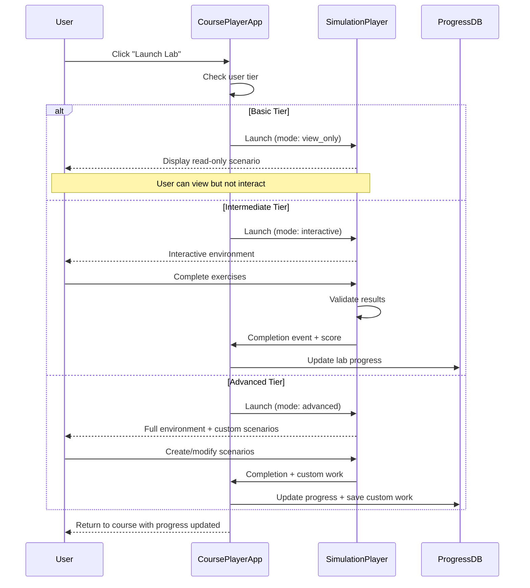

# SimulationPlayer Integration

## Overview

CoursePlayerApp integrates with **SimulationPlayer** to provide hands-on, interactive lab experiences. This document specifies how labs are launched, tracked, and completed within the learning platform, with different modes based on user tiers.

---

## Integration Architecture



---

## SimulationPlayer API

### Base URL
```
Production:  https://simulations.courses.com/api/v1
Staging:     https://staging-simulations.courses.com/api/v1
Development: http://localhost:8002/api/v1
```

### Authentication
Uses shared JWT tokens from CoursePlayerApp.

---

## API Endpoints

### 1. Launch Lab

**Endpoint**: `POST /api/v1/launch`

**Purpose**: Launch a lab scenario with tier-appropriate permissions.

**Request**:
```json
{
  "user_id": "550e8400-e29b-41d4-a716-446655440000",
  "course_id": "08_PracticalMachineLearning",
  "lab_id": "lab_03_decision_trees",
  "mode": "interactive",
  "config": {
    "language": "python",
    "environment": "jupyter",
    "time_limit_minutes": 60,
    "guidance_level": "standard",
    "allow_hints": true,
    "allow_solutions": false
  }
}
```

**Mode Options**:
- `view_only`: Read-only mode (Basic tier)
- `interactive`: Full interactive mode (Intermediate tier)
- `advanced`: Interactive + custom scenarios (Advanced tier)

**Guidance Levels**:
- `minimal`: Fewer hints, expert mode
- `standard`: Balanced guidance
- `full`: Step-by-step assistance

**Response** (200 OK):
```json
{
  "session_id": "sim_session_abc123xyz",
  "lab_url": "https://simulations.courses.com/session/sim_session_abc123xyz",
  "embed_url": "https://simulations.courses.com/embed/sim_session_abc123xyz",
  "access_token": "eyJhbGciOiJIUzI1NiIsInR5cCI6IkpXVCJ9...",
  "expires_at": "2024-01-20T16:00:00Z",
  "mode": "interactive",
  "metadata": {
    "lab_title": "Decision Trees Classification",
    "estimated_duration": 45,
    "difficulty": "intermediate",
    "prerequisites": ["Python basics", "Pandas"]
  }
}
```

**Implementation**:
```python
from typing import Dict, Optional
import httpx

class SimulationPlayerClient:
    def __init__(self, base_url: str):
        self.base_url = base_url
        self.client = httpx.AsyncClient()
    
    async def launch_lab(
        self,
        user_id: str,
        course_id: str,
        lab_id: str,
        user_tier: str,
        access_token: str
    ) -> Dict:
        """
        Launch a lab in SimulationPlayer.
        
        Args:
            user_id: User identifier
            course_id: Course identifier
            lab_id: Lab identifier
            user_tier: User's subscription tier
            access_token: JWT access token
            
        Returns:
            Dict containing session info and lab URL
        """
        # Determine mode based on tier
        mode_map = {
            "basic": "view_only",
            "intermediate": "interactive",
            "advanced": "advanced"
        }
        mode = mode_map.get(user_tier, "view_only")
        
        # Determine guidance level
        guidance_map = {
            "basic": "full",
            "intermediate": "standard",
            "advanced": "minimal"
        }
        guidance = guidance_map.get(user_tier, "full")
        
        response = await self.client.post(
            f"{self.base_url}/launch",
            json={
                "user_id": user_id,
                "course_id": course_id,
                "lab_id": lab_id,
                "mode": mode,
                "config": {
                    "language": "python",
                    "environment": "jupyter",
                    "time_limit_minutes": 60,
                    "guidance_level": guidance,
                    "allow_hints": True,
                    "allow_solutions": user_tier == "basic"
                }
            },
            headers={"Authorization": f"Bearer {access_token}"}
        )
        
        response.raise_for_status()
        return response.json()
```

---

### 2. Get Lab Status

**Endpoint**: `GET /api/v1/session/{session_id}/status`

**Purpose**: Check the status of an active lab session.

**Response** (200 OK):
```json
{
  "session_id": "sim_session_abc123xyz",
  "status": "in_progress",
  "started_at": "2024-01-20T14:00:00Z",
  "last_activity": "2024-01-20T14:30:00Z",
  "time_elapsed_seconds": 1800,
  "progress": {
    "steps_completed": 5,
    "total_steps": 8,
    "completion_percentage": 62.5
  },
  "checkpoints": [
    {
      "id": "checkpoint_1",
      "completed": true,
      "completed_at": "2024-01-20T14:15:00Z"
    },
    {
      "id": "checkpoint_2",
      "completed": true,
      "completed_at": "2024-01-20T14:28:00Z"
    }
  ]
}
```

**Status Values**:
- `not_started`: Lab session created but not accessed
- `in_progress`: User is actively working
- `paused`: User paused the session
- `completed`: User submitted final work
- `expired`: Session time limit exceeded
- `abandoned`: User left without completing

---

### 3. Submit Lab

**Endpoint**: `POST /api/v1/session/{session_id}/submit`

**Purpose**: Submit completed lab work for validation.

**Request**:
```json
{
  "session_id": "sim_session_abc123xyz",
  "submission_data": {
    "code_cells": [
      {
        "cell_id": "cell_1",
        "code": "import pandas as pd\ndf = pd.read_csv('data.csv')",
        "outputs": ["DataFrame loaded: 1000 rows, 5 columns"]
      }
    ],
    "answers": {
      "q1": "Decision trees split data based on feature values",
      "q2": "Gini impurity and entropy"
    },
    "files": [
      {
        "filename": "model.pkl",
        "url": "https://storage.sim.com/user123/model.pkl"
      }
    ]
  }
}
```

**Response** (200 OK):
```json
{
  "submission_id": "sub_xyz789",
  "validated": true,
  "score": 87.5,
  "max_score": 100,
  "feedback": {
    "overall": "Great work! Your decision tree model achieved 87% accuracy.",
    "strengths": [
      "Correctly implemented train-test split",
      "Good feature engineering",
      "Proper cross-validation"
    ],
    "improvements": [
      "Consider tuning max_depth parameter",
      "Could add more feature interactions"
    ]
  },
  "checkpoints_passed": [
    "data_loading",
    "preprocessing",
    "model_training",
    "evaluation"
  ],
  "time_spent_seconds": 2400,
  "submitted_at": "2024-01-20T14:40:00Z"
}
```

**Implementation**:
```python
async def submit_lab(
    self,
    session_id: str,
    submission_data: Dict,
    access_token: str
) -> Dict:
    """Submit lab work for grading."""
    response = await self.client.post(
        f"{self.base_url}/session/{session_id}/submit",
        json={"submission_data": submission_data},
        headers={"Authorization": f"Bearer {access_token}"}
    )
    response.raise_for_status()
    return response.json()
```

---

### 4. Save Checkpoint

**Endpoint**: `POST /api/v1/session/{session_id}/checkpoint`

**Purpose**: Save progress during a lab session.

**Request**:
```json
{
  "session_id": "sim_session_abc123xyz",
  "checkpoint_data": {
    "cells_state": [...],
    "variables": {...},
    "current_step": 5
  }
}
```

**Response** (200 OK):
```json
{
  "checkpoint_id": "ckpt_abc123",
  "saved_at": "2024-01-20T14:25:00Z",
  "can_resume": true
}
```

---

## Lab Launcher Component

### CoursePlayerApp Implementation

```python
from fastapi import APIRouter, Depends, HTTPException
from typing import Dict

router = APIRouter()

@router.post("/api/labs/launch")
async def launch_lab(
    lab_request: LaunchLabRequest,
    current_user: User = Depends(get_current_user),
    simulation_client: SimulationPlayerClient = Depends(get_simulation_client)
):
    """
    Launch a lab in SimulationPlayer.
    
    This endpoint:
    1. Validates user has access to the lab
    2. Determines appropriate mode based on tier
    3. Launches the simulation
    4. Tracks the session
    """
    # Check if user can access this lab
    course_access = await check_course_access(
        current_user.id,
        lab_request.course_id
    )
    
    if not course_access.allowed:
        raise HTTPException(
            status_code=403,
            detail="Upgrade your tier to access this lab"
        )
    
    # Check lab quota (for tiers with limits)
    if current_user.tier == "intermediate":
        quota = await get_lab_quota(current_user.id)
        if quota.hours_remaining <= 0:
            raise HTTPException(
                status_code=429,
                detail="Lab hours quota exceeded for this month"
            )
    
    # Launch in SimulationPlayer
    try:
        session = await simulation_client.launch_lab(
            user_id=current_user.id,
            course_id=lab_request.course_id,
            lab_id=lab_request.lab_id,
            user_tier=current_user.tier,
            access_token=current_user.access_token
        )
    except Exception as e:
        logger.error(f"Failed to launch lab: {e}")
        raise HTTPException(
            status_code=500,
            detail="Failed to launch lab. Please try again."
        )
    
    # Track session in database
    db_session = LabSession(
        id=session["session_id"],
        user_id=current_user.id,
        course_id=lab_request.course_id,
        lab_id=lab_request.lab_id,
        mode=session["mode"],
        started_at=datetime.utcnow(),
        expires_at=session["expires_at"]
    )
    db.add(db_session)
    db.commit()
    
    return {
        "session_id": session["session_id"],
        "lab_url": session["lab_url"],
        "embed_url": session["embed_url"],
        "mode": session["mode"],
        "expires_at": session["expires_at"]
    }
```

### Frontend Integration (React)

```tsx
import React, { useState } from 'react';

interface LabLauncherProps {
  courseId: string;
  labId: string;
  labTitle: string;
  userTier: 'basic' | 'intermediate' | 'advanced';
}

const LabLauncher: React.FC<LabLauncherProps> = ({
  courseId,
  labId,
  labTitle,
  userTier
}) => {
  const [isLoading, setIsLoading] = useState(false);
  const [labWindow, setLabWindow] = useState<Window | null>(null);
  
  const handleLaunchLab = async () => {
    setIsLoading(true);
    
    try {
      const response = await fetch('/api/labs/launch', {
        method: 'POST',
        headers: {
          'Content-Type': 'application/json',
          'Authorization': `Bearer ${getAccessToken()}`
        },
        body: JSON.stringify({ course_id: courseId, lab_id: labId })
      });
      
      if (!response.ok) {
        const error = await response.json();
        alert(error.detail);
        return;
      }
      
      const session = await response.json();
      
      // Open lab in new window
      const width = 1200;
      const height = 800;
      const left = (window.screen.width - width) / 2;
      const top = (window.screen.height - height) / 2;
      
      const newWindow = window.open(
        session.lab_url,
        'lab_window',
        `width=${width},height=${height},left=${left},top=${top}`
      );
      
      setLabWindow(newWindow);
      
      // Listen for completion message
      window.addEventListener('message', handleLabCompletion);
      
    } catch (error) {
      console.error('Failed to launch lab:', error);
      alert('Failed to launch lab. Please try again.');
    } finally {
      setIsLoading(false);
    }
  };
  
  const handleLabCompletion = (event: MessageEvent) => {
    if (event.origin !== 'https://simulations.courses.com') return;
    
    if (event.data.type === 'lab_completed') {
      // Refresh progress
      window.location.reload();
    }
  };
  
  const getModeDescription = () => {
    switch (userTier) {
      case 'basic':
        return 'View-only mode - Read through the lab instructions';
      case 'intermediate':
        return 'Interactive mode - Complete exercises and get feedback';
      case 'advanced':
        return 'Advanced mode - Full access with custom scenarios';
    }
  };
  
  return (
    <div className="lab-launcher">
      <h3>{labTitle}</h3>
      <p className="mode-description">{getModeDescription()}</p>
      
      <button
        onClick={handleLaunchLab}
        disabled={isLoading}
        className="launch-btn"
      >
        {isLoading ? 'Launching...' : '🚀 Launch Lab'}
      </button>
      
      {userTier === 'basic' && (
        <div className="upgrade-hint">
          <p>💡 Upgrade to Intermediate tier for interactive labs!</p>
          <button className="upgrade-btn">Upgrade Now →</button>
        </div>
      )}
    </div>
  );
};

export default LabLauncher;
```

---

## Completion Tracking

### Webhook from SimulationPlayer

SimulationPlayer sends a webhook when a lab is completed:

**Endpoint**: `POST /api/webhooks/simulation-complete`

**Payload**:
```json
{
  "event": "lab.completed",
  "timestamp": "2024-01-20T14:40:00Z",
  "data": {
    "session_id": "sim_session_abc123xyz",
    "user_id": "550e8400-e29b-41d4-a716-446655440000",
    "course_id": "08_PracticalMachineLearning",
    "lab_id": "lab_03_decision_trees",
    "score": 87.5,
    "max_score": 100,
    "time_spent_seconds": 2400,
    "checkpoints_passed": 4,
    "total_checkpoints": 4,
    "submission_id": "sub_xyz789"
  }
}
```

**Handler Implementation**:
```python
@router.post("/api/webhooks/simulation-complete")
async def handle_simulation_complete(request: Request):
    """Handle lab completion webhook from SimulationPlayer."""
    
    # Verify webhook signature
    signature = request.headers.get("X-Simulation-Signature")
    body = await request.body()
    
    if not verify_signature(body, signature):
        raise HTTPException(status_code=401, detail="Invalid signature")
    
    event = await request.json()
    data = event["data"]
    
    # Update lab progress in database
    lab_session = db.query(LabSession).filter(
        LabSession.id == data["session_id"]
    ).first()
    
    if lab_session:
        lab_session.status = "completed"
        lab_session.score = data["score"]
        lab_session.time_spent = data["time_spent_seconds"]
        lab_session.completed_at = datetime.utcnow()
        
        # Update course progress
        update_course_progress(
            user_id=data["user_id"],
            course_id=data["course_id"],
            lab_id=data["lab_id"],
            completed=True,
            score=data["score"]
        )
        
        # Check for achievements
        await check_lab_achievements(
            user_id=data["user_id"],
            score=data["score"],
            time_spent=data["time_spent_seconds"]
        )
        
        db.commit()
    
    return {"status": "processed"}
```

---

## Tier-Specific Features

### Basic Tier - View-Only Mode

**Capabilities**:
- ✅ Read lab instructions
- ✅ View pre-completed code examples
- ✅ See expected outputs
- ✅ Read explanations
- ❌ Cannot edit or execute code
- ❌ Cannot submit work
- ❌ No progress tracking

**UI Indicators**:
```html
<div class="view-only-banner">
  ℹ️ View-only mode
  <span>This is a preview. Upgrade to Intermediate for interactive labs.</span>
  <button>Upgrade →</button>
</div>
```

### Intermediate Tier - Interactive Mode

**Capabilities**:
- ✅ Edit and execute code
- ✅ Submit work for grading
- ✅ Save checkpoints
- ✅ Get hints and feedback
- ✅ Limited terminal access
- ✅ 100 lab hours/month
- ❌ Cannot create custom scenarios

**Quota Tracking**:
```python
async def track_lab_time(user_id: str, session_id: str):
    """Track lab time usage for quota enforcement."""
    
    # Get time spent in this session
    session = db.query(LabSession).filter(
        LabSession.id == session_id
    ).first()
    
    if not session:
        return
    
    time_spent_hours = session.time_spent / 3600
    
    # Update monthly quota
    month_key = datetime.now().strftime("%Y-%m")
    redis_key = f"lab_hours:{user_id}:{month_key}"
    
    current_hours = float(redis.get(redis_key) or 0)
    new_hours = current_hours + time_spent_hours
    
    redis.setex(redis_key, 60 * 24 * 60 * 60, str(new_hours))  # 60 days TTL
    
    return {
        "hours_used": new_hours,
        "hours_limit": 100,
        "hours_remaining": max(0, 100 - new_hours)
    }
```

### Advanced Tier - Full Access

**Capabilities**:
- ✅ Everything in Intermediate
- ✅ Unlimited lab hours
- ✅ Create custom scenarios
- ✅ Full terminal/shell access
- ✅ GPU access (for ML workloads)
- ✅ Persistent environments
- ✅ Export work (Jupyter notebooks)
- ✅ Collaboration features

**Custom Scenarios**:
```python
@router.post("/api/labs/custom-scenario")
async def create_custom_scenario(
    scenario: CustomScenarioRequest,
    current_user: User = Depends(get_current_user)
):
    """Create a custom lab scenario (Advanced tier only)."""
    
    if current_user.tier != "advanced":
        raise HTTPException(
            status_code=403,
            detail="Custom scenarios are available for Advanced tier only"
        )
    
    # Create scenario in SimulationPlayer
    response = await simulation_client.create_scenario(
        user_id=current_user.id,
        base_lab_id=scenario.base_lab_id,
        modifications=scenario.modifications
    )
    
    return response
```

---

## Error Handling

### Common Errors

**1. Lab Quota Exceeded**:
```json
{
  "error": "quota_exceeded",
  "message": "You've used all 100 lab hours this month. Upgrade to Advanced for unlimited access.",
  "quota_info": {
    "used": 100.5,
    "limit": 100,
    "reset_date": "2024-02-01T00:00:00Z"
  }
}
```

**2. Session Expired**:
```json
{
  "error": "session_expired",
  "message": "This lab session has expired. Please launch a new session.",
  "session_id": "sim_session_abc123xyz",
  "expired_at": "2024-01-20T16:00:00Z"
}
```

**3. SimulationPlayer Unavailable**:
```json
{
  "error": "service_unavailable",
  "message": "Lab service is temporarily unavailable. Please try again in a few minutes.",
  "retry_after": 300
}
```

---

## Testing

### Mock SimulationPlayer

```python
# For development and testing
from fastapi import FastAPI

app = FastAPI()

MOCK_SESSIONS = {}

@app.post("/api/v1/launch")
async def mock_launch_lab(request: dict):
    session_id = f"sim_session_{uuid.uuid4().hex[:12]}"
    
    MOCK_SESSIONS[session_id] = {
        "status": "in_progress",
        "started_at": datetime.utcnow().isoformat(),
        "mode": request["mode"]
    }
    
    return {
        "session_id": session_id,
        "lab_url": f"http://localhost:8002/lab/{session_id}",
        "embed_url": f"http://localhost:8002/embed/{session_id}",
        "mode": request["mode"]
    }

@app.post("/api/v1/session/{session_id}/submit")
async def mock_submit_lab(session_id: str, request: dict):
    return {
        "submission_id": f"sub_{uuid.uuid4().hex[:12]}",
        "validated": True,
        "score": 85.0,
        "max_score": 100.0,
        "feedback": {
            "overall": "Great work!",
            "strengths": ["Good code structure"],
            "improvements": ["Add more comments"]
        }
    }
```

---

## Monitoring

### Key Metrics

```python
from prometheus_client import Counter, Histogram, Gauge

# Lab launches
lab_launches = Counter(
    'lab_launches_total',
    'Total lab launches',
    ['tier', 'lab_id', 'mode']
)

# Lab completions
lab_completions = Counter(
    'lab_completions_total',
    'Total lab completions',
    ['tier', 'lab_id']
)

# Lab duration
lab_duration = Histogram(
    'lab_duration_seconds',
    'Lab completion time',
    ['lab_id']
)

# Active sessions
active_lab_sessions = Gauge(
    'active_lab_sessions',
    'Currently active lab sessions'
)

# Lab scores
lab_scores = Histogram(
    'lab_scores',
    'Lab submission scores',
    ['lab_id']
)
```

---

## Conclusion

The SimulationPlayer integration provides:

1. **Tier-Appropriate Access** - View-only, Interactive, or Advanced modes
2. **Seamless Launch Experience** - One-click lab launches
3. **Progress Tracking** - Automatic completion and scoring
4. **Quota Management** - Enforced limits for Intermediate tier
5. **Custom Scenarios** - Advanced tier feature
6. **Robust Error Handling** - Graceful degradation

This integration ensures students get hands-on practice appropriate to their subscription level while maintaining a smooth, engaging learning experience.
