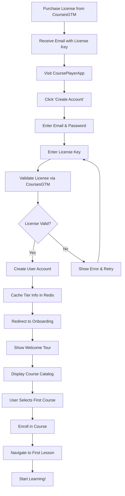
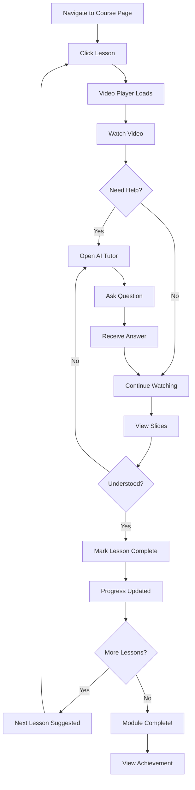
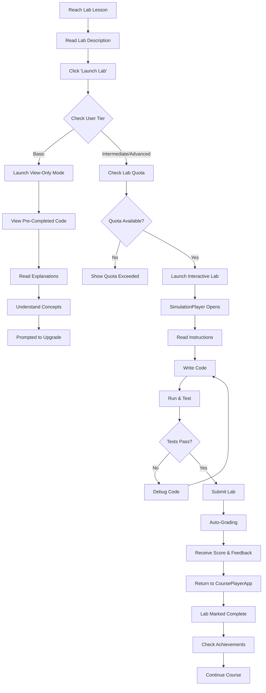
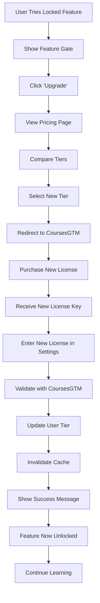
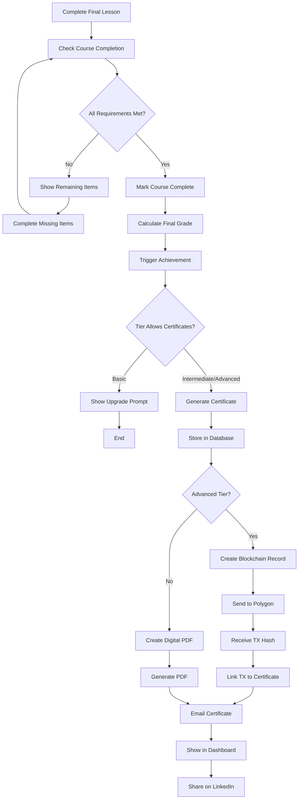

# User Experience Flows

## Overview

This document defines the complete user journeys through CoursePlayerApp, from initial enrollment to course completion. Each flow is designed to be intuitive, accessible, and optimized for learning outcomes.

---

## Flow 1: New User Enrollment

### Journey Overview
A new user purchases a license, creates an account, and starts their first lesson.

### Steps



### Detailed Steps

**Step 1-2: Purchase & Email**
- User purchases license from CoursesGTM website
- Receives email with:
  - License key (e.g., `INTER-ABC123-XYZ789`)
  - Link to CoursePlayerApp
  - Welcome message with tier benefits

**Step 3-4: Visit Site & Create Account**
```
┌─────────────────────────────────────────┐
│  CoursePlayerApp                        │
│                                         │
│  Welcome to Data Science Learning!     │
│                                         │
│  [Sign In]  [Create Account] ←         │
└─────────────────────────────────────────┘
```

**Step 5-6: Enter Credentials & License**
```
┌─────────────────────────────────────────┐
│  Create Your Account                    │
│                                         │
│  Email: [_______________]               │
│  Password: [_______________]            │
│  Confirm: [_______________]             │
│                                         │
│  License Key: [_______________]         │
│  (Check your email)                     │
│                                         │
│  [Create Account]                       │
└─────────────────────────────────────────┘
```

**Step 7-11: Validation & Account Creation**
- Backend calls CoursesGTM API to validate license
- If valid:
  - Extract tier (basic/intermediate/advanced)
  - Create user in PostgreSQL
  - Cache tier in Redis (TTL: 1 hour)
  - Generate JWT access token
- If invalid:
  - Show error: "Invalid license key. Please check your email or contact support."
  - Allow retry

**Step 12-13: Onboarding Tour**
```
┌─────────────────────────────────────────┐
│  Welcome Tour (1/4)                     │
│                                         │
│  📚 Course Catalog                      │
│  Browse and enroll in courses based on │
│  your tier. You have access to:        │
│  • 8 courses (Intermediate tier)       │
│                                         │
│  [Next →]                               │
└─────────────────────────────────────────┘

┌─────────────────────────────────────────┐
│  Welcome Tour (2/4)                     │
│                                         │
│  🎥 Watch & Learn                       │
│  Stream videos, view slides, and       │
│  complete hands-on labs.                │
│                                         │
│  [← Back]  [Next →]  [Skip]            │
└─────────────────────────────────────────┘

┌─────────────────────────────────────────┐
│  Welcome Tour (3/4)                     │
│                                         │
│  🤖 AI Tutor                            │
│  Get instant help with your questions. │
│  You have 50 questions/month.           │
│                                         │
│  [← Back]  [Next →]  [Skip]            │
└─────────────────────────────────────────┘

┌─────────────────────────────────────────┐
│  Welcome Tour (4/4)                     │
│                                         │
│  📊 Track Progress                      │
│  Monitor your learning journey and      │
│  earn achievements!                     │
│                                         │
│  [← Back]  [Get Started!]              │
└─────────────────────────────────────────┘
```

**Step 14-18: First Course Selection**
```
┌─────────────────────────────────────────────────────────┐
│  [Logo]  Courses  My Progress  [User: John ▼]         │
├─────────────────────────────────────────────────────────┤
│  Course Catalog                                         │
│  [Search: ___________] 🔍  Sort: [Recommended ▼]       │
│                                                         │
│  Recommended for You:                                   │
│  ┌──────────┐ ┌──────────┐ ┌──────────┐               │
│  │ [Image]  │ │ [Image]  │ │ [Image]  │               │
│  │ Data Sci │ │ R Program│ │ Getting  │               │
│  │ Toolbox  │ │ -ming    │ │ Data     │               │
│  │ 4h 30m   │ │ 6h 15m   │ │ 5h 00m   │               │
│  │ Beginner │ │ Beginner │ │ Intermed │               │
│  │ [Enroll] │ │ [Enroll] │ │ [Enroll] │ ←             │
│  └──────────┘ └──────────┘ └──────────┘               │
└─────────────────────────────────────────────────────────┘
```

- User clicks "Enroll" on first course
- Course enrollment record created in database
- Redirect to course page

**Step 19: Start First Lesson**
```
┌─────────────────────────────────────────────────────────┐
│  Data Scientist's Toolbox                               │
├──────────────┬──────────────────────────────────────────┤
│ Course       │  🎉 Welcome!                             │
│ Outline      │  You're about to start your first lesson.│
│              │                                          │
│ ▶ Module 1   │  This course will teach you:             │
│   • Intro ←  │  • Overview of data science tools        │
│   • Tools    │  • Setting up your environment           │
│   • GitHub   │  • Basic R programming                   │
│              │                                          │
│   Module 2   │  [Start Lesson →]                        │
│              │                                          │
│ 📊 0% Complete                                           │
└──────────────┴──────────────────────────────────────────┘
```

### Success Metrics
- Time to first lesson: < 5 minutes
- Onboarding completion rate: > 80%
- First lesson start rate: > 70%

---

## Flow 2: Watching a Lesson

### Journey Overview
A student navigates to a lesson, watches video content, reviews slides, and asks the AI tutor for help.

### Steps



### Detailed Steps

**Step 1-2: Navigate to Lesson**
```
┌─────────────────────────────────────────────────────────┐
│  Data Scientist's Toolbox                               │
├──────────────┬──────────────────────────────────────────┤
│ Course       │  Lesson 1: Introduction                  │
│ Outline      │  ────────────────────────────────────    │
│              │                                          │
│ ✓ Intro      │  Overview                                │
│ ▶ Module 1 ←─┤  • Course structure                      │
│   • Tools    │  • Prerequisites                         │
│   • GitHub   │  • What you'll learn                     │
│   • Markdown │                                          │
│              │  Duration: 12 minutes                    │
│   Module 2   │  [Start Lesson →]                        │
└──────────────┴──────────────────────────────────────────┘
```

**Step 3-4: Video Playback**
```
┌─────────────────────────────────────────────────────────┐
│  Lesson 1: Introduction                [⬇️ Download]   │
│  (Intermediate tier)                                    │
├─────────────────────────────────────────────────────────┤
│                                                         │
│                    [Video Frame]                        │
│                                                         │
│                  [Instructor speaking]                  │
│                                                         │
│                                                         │
├─────────────────────────────────────────────────────────┤
│ [⏮] [⏯] [⏭]  ▓▓▓▓▓▓░░░░░░░░░  5:30 / 12:00           │
│                                                         │
│ [🔊] [━━━━━━━━] [CC] Speed: 1x ▼  Quality: 1080p ▼    │
│                                                         │
│ 💬 Transcript:                                          │
│ "Welcome to Data Science! In this course, we'll..."    │
└─────────────────────────────────────────────────────────┘
```

- Video streams from Cloudflare R2
- Progress tracked every 5 seconds
- Download button visible for Intermediate+ tiers

**Step 5-9: AI Tutor Interaction**
```
┌─────────────────────────────────────────┐
│  🤖 AI Tutor       [45/50 questions]   │
├─────────────────────────────────────────┤
│                                         │
│  👤 What is R used for?                 │
│                                         │
│  🤖 R is a programming language         │
│  specifically designed for statistical  │
│  computing and data analysis. It's      │
│  widely used in data science because... │
│  📚 References: Current lesson          │
│                                         │
│  [Ask a question...________] [Send ↗]  │
└─────────────────────────────────────────┘
```

- AI tutor panel slides in from right
- Context-aware (knows current lesson)
- Quota decremented after answer
- Answer saved to conversation history

**Step 10: View Slides**
```
┌─────────────────────────────────────────────────────────┐
│  Slides: Introduction                                   │
│  [← Prev]  Slide 3/15  [Next →]  [-] 100% [+]         │
│  [⬇️ PDF] [⬇️ PPTX] [⛶]                               │
├─────────────────────────────────────────────────────────┤
│                                                         │
│   ┌───────────────────────────────────────────┐        │
│   │                                           │        │
│   │         What is Data Science?             │        │
│   │                                           │        │
│   │   • Extracting insights from data         │        │
│   │   • Statistical analysis                  │        │
│   │   • Machine learning                      │        │
│   │   • Data visualization                    │        │
│   │                                           │        │
│   └───────────────────────────────────────────┘        │
│                                                         │
└─────────────────────────────────────────────────────────┘
```

- Slides load from R2 storage (PDF)
- Synchronized with video (optional)
- Download buttons tier-gated

**Step 12-13: Mark Complete & Progress Update**
```
┌─────────────────────────────────────────┐
│  ✅ Lesson Complete!                    │
│                                         │
│  You've completed:                      │
│  "Introduction to Data Science"         │
│                                         │
│  Time spent: 15 minutes                 │
│  Total progress: 8% → 12%               │
│                                         │
│  [Next Lesson: The Data Scientist's    │
│   Toolbox →]                            │
│                                         │
│  [Back to Course]                       │
└─────────────────────────────────────────┘
```

- Lesson marked complete in database
- Course progress recalculated
- Streak updated
- Achievement check triggered
- Synced to CoursesGTM

**Step 14-16: Next Lesson Suggestion**
- Automatically suggest next lesson in sequence
- Show progress bar for module
- Optional: Skip to specific lesson

### Success Metrics
- Video completion rate: > 70%
- Average lesson time: Within 20% of estimated
- AI tutor usage: > 30% of Intermediate users
- Slide view rate: > 60%

---

## Flow 3: Completing a Lab

### Journey Overview
A student reaches a lab lesson, launches it in SimulationPlayer, completes exercises, and submits for grading.

### Steps



### Detailed Steps

**Step 1-2: Lab Description**
```
┌─────────────────────────────────────────────────────────┐
│  Lab 3: Data Manipulation with Pandas                   │
├─────────────────────────────────────────────────────────┤
│                                                         │
│  🧪 Hands-On Exercise                                   │
│                                                         │
│  In this lab, you'll learn to:                          │
│  • Load data from CSV files                             │
│  • Filter and select data                               │
│  • Group and aggregate                                  │
│  • Handle missing values                                │
│                                                         │
│  Estimated time: 45 minutes                             │
│  Difficulty: Intermediate                               │
│                                                         │
│  Prerequisites:                                         │
│  ✓ Python basics                                        │
│  ✓ Introduction to Pandas (Lesson 5)                   │
│                                                         │
│  [🚀 Launch Lab]                                        │
└─────────────────────────────────────────────────────────┘
```

**Step 3-9: Launch Process**

**For Basic Tier (View-Only)**:
```
┌─────────────────────────────────────────┐
│  Lab Preview (View-Only Mode)          │
│  ────────────────────────────────────   │
│                                         │
│  ℹ️ This is a read-only preview.       │
│  Upgrade to Intermediate for            │
│  interactive labs!                      │
│                                         │
│  Step 1: Load Data                      │
│  ───────────────────────────────────    │
│  import pandas as pd                    │
│  df = pd.read_csv('data.csv')          │
│  df.head()                              │
│                                         │
│  Output:                                │
│    name  age  city                      │
│  0 Alice  25  NYC                       │
│  1 Bob    30  LA                        │
│  ...                                    │
│                                         │
│  [Upgrade to Interactive Mode →]       │
└─────────────────────────────────────────┘
```

**For Intermediate/Advanced Tier (Interactive)**:
```
┌─────────────────────────────────────────┐
│  Launching Lab...                       │
│                                         │
│  ✓ Checking access (Intermediate tier) │
│  ✓ Checking quota (75/100 hours used)  │
│  ✓ Starting environment                 │
│  ✓ Loading dataset                      │
│                                         │
│  Opening SimulationPlayer...            │
└─────────────────────────────────────────┘
```

**Step 10-13: SimulationPlayer (Interactive)**
```
┌─────────────────────────────────────────────────────────┐
│  Lab 3: Data Manipulation | Session: sim_abc123        │
│  [💾 Save] [🔄 Reset] [❌ Exit]                        │
├─────────────────────────────────────────────────────────┤
│  Instructions                       Code Editor         │
│  ────────────────────────            ─────────────────  │
│  Step 1: Load the dataset           1 import pandas    │
│  Use pd.read_csv() to load          2 df = pd.read_    │
│  'sales_data.csv'                   3                  │
│                                     4 # Your code here │
│  💡 Hint: The file is in the        5                  │
│  'data/' directory                  6                  │
│                                                         │
│  [💡 Show Hint] [✅ Check Answer]  [▶ Run Code]        │
│                                                         │
│  Console Output:                                        │
│  ──────────────────────────────────────────────────     │
│  >>> df = pd.read_csv('data/sales_data.csv')          │
│  >>> df.head()                                         │
│                                                         │
│  Progress: 1/8 steps complete  [▓░░░░░░░] 12.5%       │
└─────────────────────────────────────────────────────────┘
```

**Step 14-17: Coding & Testing**
- Student writes code in Monaco editor
- Runs code to see output
- Tests fail → receives feedback
- Iterates until tests pass

**Step 18-20: Submit & Grading**
```
┌─────────────────────────────────────────┐
│  Submit Lab?                            │
│                                         │
│  You've completed 8/8 steps.            │
│  All tests are passing!                 │
│                                         │
│  Your work will be graded automatically.│
│  This action cannot be undone.          │
│                                         │
│  [Cancel]  [Submit Lab →]              │
└─────────────────────────────────────────┘
```

```
┌─────────────────────────────────────────┐
│  Grading Lab...                         │
│                                         │
│  ✓ Running test cases                   │
│  ✓ Checking code quality                │
│  ✓ Evaluating output                    │
│  ✓ Calculating score                    │
└─────────────────────────────────────────┘
```

**Step 21-22: Results & Feedback**
```
┌─────────────────────────────────────────────────────────┐
│  🎉 Lab Complete!                                       │
├─────────────────────────────────────────────────────────┤
│                                                         │
│  Your Score: 87/100 ⭐⭐⭐                              │
│                                                         │
│  Feedback:                                              │
│  ──────────────────────────────────────────────────     │
│  ✅ Strengths:                                          │
│  • Correctly loaded and filtered data                   │
│  • Good use of groupby() for aggregation                │
│  • Proper handling of missing values                    │
│                                                         │
│  💡 Improvements:                                       │
│  • Consider using .loc[] instead of .ix[]               │
│  • Add comments to explain complex operations           │
│                                                         │
│  Time spent: 38 minutes                                 │
│                                                         │
│  [View Solution]  [Retry Lab]  [Continue Course →]    │
└─────────────────────────────────────────────────────────┘
```

**Step 23-25: Return & Achievement**
```
┌─────────────────────────────────────────┐
│  🏆 Achievement Unlocked!               │
│                                         │
│  [Badge Icon]                           │
│                                         │
│  Lab Master                             │
│  Completed 10 labs with score > 90%     │
│                                         │
│  +400 points                            │
│                                         │
│  [View Achievements]  [Continue]        │
└─────────────────────────────────────────┘
```

### Success Metrics
- Lab completion rate: > 50% (Intermediate+)
- Average lab score: > 75%
- Time spent in labs: 30-60 min per lab
- Retry rate: < 20%

---

## Flow 4: Upgrading Tier

### Journey Overview
A Basic or Intermediate user encounters a locked feature and upgrades their tier.

### Steps



### Detailed Steps

**Step 1-2: Feature Gate Encountered**
```
┌─────────────────────────────────────────┐
│  🔒 Feature Locked                      │
│                                         │
│  Video download is available with       │
│  Intermediate tier.                     │
│                                         │
│  Upgrade to unlock:                     │
│  ✓ Video downloads (1080p)              │
│  ✓ Slide downloads (PDF)                │
│  ✓ Interactive labs                     │
│  ✓ AI Tutor (50 Q/month)                │
│  ✓ Digital certificates                 │
│                                         │
│  Current: Basic ($97/year)              │
│  Upgrade to: Intermediate ($247/year)   │
│                                         │
│  [Learn More]  [Upgrade Now →]         │
└─────────────────────────────────────────┘
```

**Step 3-6: Pricing Comparison**
```
┌───────────────────────────────────────────────────────────┐
│  Choose Your Plan                                         │
├───────────────┬─────────────────┬─────────────────────────┤
│  Basic        │ Intermediate    │ Advanced                │
│  $97/year     │ $247/year       │ $497/year               │
│  [Current]    │ [Upgrade]       │ [Upgrade]               │
├───────────────┼─────────────────┼─────────────────────────┤
│  • 5 courses  │ • 8 courses     │ • All 9 courses         │
│  • 720p video │ • 1080p + DL    │ • 4K + unlimited DL     │
│  • View-only  │ • Interactive   │ • Interactive + custom  │
│    labs       │   labs          │   labs                  │
│  • No AI      │ • AI Tutor      │ • Unlimited AI          │
│               │   (50 Q/month)  │   Tutor                 │
│  • No certs   │ • Digital certs │ • Blockchain certs      │
└───────────────┴─────────────────┴─────────────────────────┘
```

**Step 7-9: Purchase & License Received**
- Redirect to CoursesGTM purchase page
- Complete payment
- Receive new license key via email

**Step 10-12: Update License**
```
┌─────────────────────────────────────────┐
│  Update License                         │
│                                         │
│  Current Tier: Basic                    │
│                                         │
│  Enter your new license key:            │
│  [INTER-ABC123-XYZ789___________]       │
│                                         │
│  [Cancel]  [Update License]            │
└─────────────────────────────────────────┘
```

**Step 13-15: Validation & Update**
- Validate new license with CoursesGTM
- Update user tier in database
- Clear tier cache in Redis
- Refresh available courses

**Step 16: Success & Feature Access**
```
┌─────────────────────────────────────────┐
│  🎉 Upgrade Successful!                 │
│                                         │
│  Welcome to Intermediate tier!          │
│                                         │
│  You now have access to:                │
│  ✓ 3 additional courses                 │
│  ✓ Video & slide downloads              │
│  ✓ Interactive labs (100 hours/month)   │
│  ✓ AI Tutor (50 questions/month)        │
│  ✓ Digital certificates                 │
│                                         │
│  [Explore New Courses]  [Continue]     │
└─────────────────────────────────────────┘
```

### Success Metrics
- Upgrade conversion rate: > 15% (Basic → Intermediate)
- Upgrade conversion rate: > 10% (Intermediate → Advanced)
- Time to upgrade decision: < 7 days
- Feature gate encounters before upgrade: 3-5

---

## Flow 5: Completing a Course & Earning Certificate

### Journey Overview
A student completes all lessons, labs, and quizzes, then receives their certificate.

### Steps



### Detailed Steps

**Step 1-4: Final Progress Check**
```
┌─────────────────────────────────────────────────────────┐
│  Course Progress: Data Scientist's Toolbox              │
├─────────────────────────────────────────────────────────┤
│                                                         │
│  ▓▓▓▓▓▓▓▓▓▓▓▓▓▓▓▓▓▓▓░ 95%                             │
│                                                         │
│  Almost there! Complete these to finish:                │
│                                                         │
│  ✓ 19/20 Lessons completed                              │
│  ✓ 4/4 Labs completed (Avg: 92%)                        │
│  ⚠️ 3/4 Quizzes passed                                  │
│                                                         │
│  [Complete Quiz 4 →]                                    │
└─────────────────────────────────────────────────────────┘
```

**Step 5-8: Course Completion**
```
┌─────────────────────────────────────────────────────────┐
│  🎓 Course Complete!                                    │
├─────────────────────────────────────────────────────────┤
│                                                         │
│  Congratulations! You've completed:                     │
│  Data Scientist's Toolbox                               │
│                                                         │
│  Your Stats:                                            │
│  • Completion: 100%                                     │
│  • Time spent: 6 hours 42 minutes                       │
│  • Average quiz score: 94%                              │
│  • Average lab score: 92%                               │
│  • Overall grade: A (93%)                               │
│                                                         │
│  🏆 Achievements Unlocked:                              │
│  • Course Completion (500 pts)                          │
│  • High Achiever (300 pts)                              │
│                                                         │
│  [Get Certificate →]                                    │
└─────────────────────────────────────────────────────────┘
```

**Step 9-14: Certificate Generation (Intermediate)**
```
┌─────────────────────────────────────────┐
│  Generating Your Certificate...         │
│                                         │
│  ✓ Verifying completion                 │
│  ✓ Calculating final grade              │
│  ✓ Creating certificate PDF             │
│  ✓ Uploading to storage                 │
│  ✓ Generating verification link         │
│                                         │
│  Certificate ready!                     │
└─────────────────────────────────────────┘
```

**Step 9-18: Blockchain Certificate (Advanced)**
```
┌─────────────────────────────────────────┐
│  Creating Blockchain Certificate...     │
│                                         │
│  ✓ Verifying completion                 │
│  ✓ Calculating final grade              │
│  ✓ Creating certificate metadata        │
│  ✓ Generating PDF                       │
│  ⏳ Writing to Polygon blockchain...    │
│     (This may take 1-2 minutes)         │
│                                         │
│  Transaction: 0xabc123...               │
└─────────────────────────────────────────┘
```

**Step 19-21: Certificate Display**
```
┌─────────────────────────────────────────────────────────┐
│  Your Certificate                                       │
├─────────────────────────────────────────────────────────┤
│                                                         │
│  ╔═══════════════════════════════════════════╗         │
│  ║  🎓 Certificate of Completion              ║         │
│  ║                                            ║         │
│  ║           John Doe                         ║         │
│  ║                                            ║         │
│  ║  has successfully completed                ║         │
│  ║  Data Scientist's Toolbox                  ║         │
│  ║                                            ║         │
│  ║  Grade: A (93%)                            ║         │
│  ║  Issued: January 20, 2024                  ║         │
│  ║                                            ║         │
│  ║  [Signature]                               ║         │
│  ║  Cert ID: CERT-ABC123                      ║         │
│  ╚═══════════════════════════════════════════╝         │
│                                                         │
│  Blockchain Verified ✓                                  │
│  TX: 0xabc123... (View on Polygonscan)                 │
│                                                         │
│  [⬇️ Download PDF]  [🔗 Share on LinkedIn]            │
│  [📧 Email Copy]    [🔗 Verification Link]            │
└─────────────────────────────────────────────────────────┘
```

### Success Metrics
- Course completion rate: > 60%
- Certificate claim rate: > 90% (Intermediate+)
- LinkedIn share rate: > 40%
- Average course grade: > 80%

---

## Conclusion

These UX flows ensure:

1. **Smooth Onboarding** - New users get started quickly
2. **Engaging Learning** - Video, slides, AI tutor work together
3. **Hands-On Practice** - Interactive labs with instant feedback
4. **Clear Upgrade Path** - Feature gates encourage tier upgrades
5. **Achievement Recognition** - Certificates and badges motivate completion

Each flow is optimized for conversion, engagement, and learning outcomes while maintaining excellent user experience.
