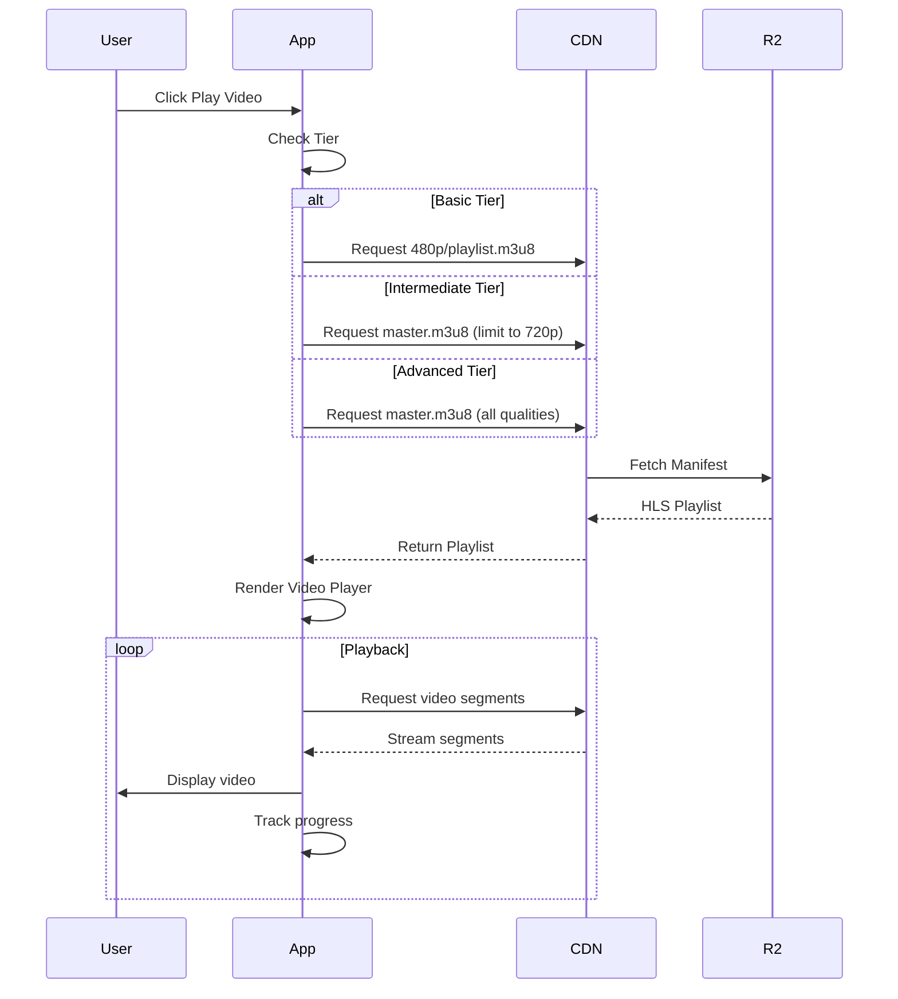
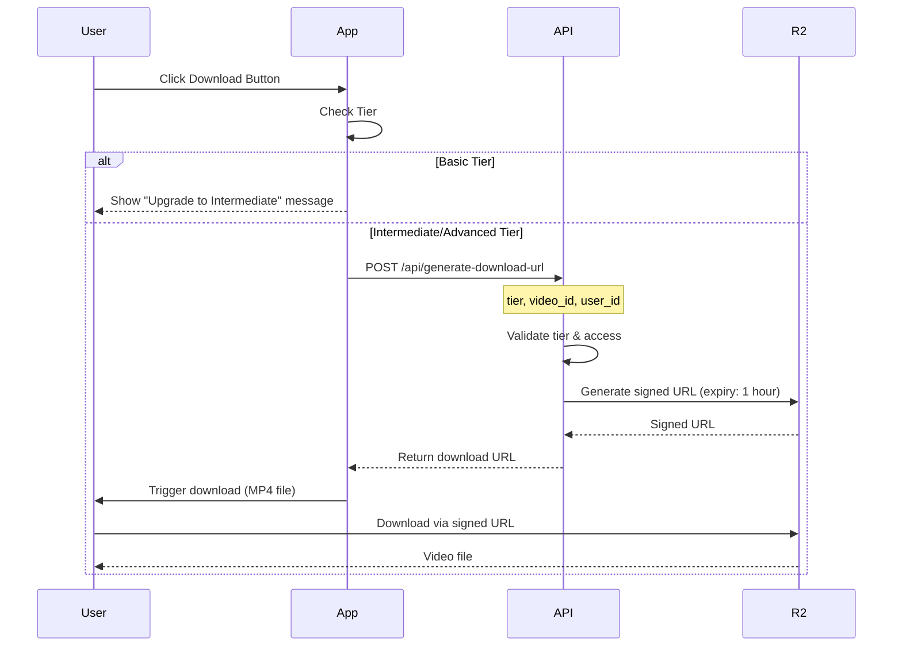

# Video Player Specification

## Overview

The CoursePlayerApp video player is an adaptive, tier-aware component that delivers educational videos with quality and feature sets matching user subscription levels. This specification defines the player architecture, streaming capabilities, download functionality, and tier-based behavior.

---

## Video Player Goals

1. **Adaptive Quality**: Automatically serve appropriate video quality based on tier
2. **Seamless Streaming**: HLS adaptive bitrate for smooth playback
3. **Tier-Gated Downloads**: Enable downloads only for Intermediate and Advanced tiers
4. **Progress Tracking**: Resume playback from last watched position
5. **Accessibility**: Full caption/subtitle support
6. **Performance**: Fast load times with CDN delivery

---

## Video Storage Architecture

### Storage Backend

**Primary Option: Cloudflare R2**
- Cost-effective object storage
- Zero egress fees
- S3-compatible API
- Global edge network

**Alternative: AWS S3 + CloudFront**
- Proven reliability
- Advanced analytics
- Established ecosystem
- Higher egress costs

### Video File Structure

```
r2://gai-observe-videos/
├── courses/
│   ├── ai-01/
│   │   ├── module-01/
│   │   │   ├── video-01/
│   │   │   │   ├── 480p/
│   │   │   │   │   ├── playlist.m3u8
│   │   │   │   │   ├── segment-0.ts
│   │   │   │   │   ├── segment-1.ts
│   │   │   │   │   └── ...
│   │   │   │   ├── 720p/
│   │   │   │   │   ├── playlist.m3u8
│   │   │   │   │   └── segments...
│   │   │   │   ├── 1080p/
│   │   │   │   │   ├── playlist.m3u8
│   │   │   │   │   └── segments...
│   │   │   │   ├── master.m3u8       # Adaptive playlist
│   │   │   │   ├── thumbnail.jpg
│   │   │   │   └── metadata.json
│   │   │   └── ...
│   │   └── ...
│   └── ...
└── downloads/                          # Pre-encoded for download
    ├── ai-01_module-01_video-01_480p.mp4
    ├── ai-01_module-01_video-01_720p.mp4
    └── ai-01_module-01_video-01_1080p.mp4
```

### Video Encoding Specifications

| Quality | Resolution | Bitrate | Codec | FPS | Audio |
|---------|-----------|---------|-------|-----|-------|
| 480p | 854x480 | 1.5 Mbps | H.264 | 30 | AAC 128kbps |
| 720p | 1280x720 | 3.0 Mbps | H.264 | 30 | AAC 192kbps |
| 1080p | 1920x1080 | 5.0 Mbps | H.264 | 30 | AAC 256kbps |

### HLS Master Playlist (`master.m3u8`)

```m3u8
#EXTM3U
#EXT-X-VERSION:3

# 480p Stream
#EXT-X-STREAM-INF:BANDWIDTH=1500000,RESOLUTION=854x480,CODECS="avc1.64001f,mp4a.40.2"
480p/playlist.m3u8

# 720p Stream
#EXT-X-STREAM-INF:BANDWIDTH=3000000,RESOLUTION=1280x720,CODECS="avc1.64001f,mp4a.40.2"
720p/playlist.m3u8

# 1080p Stream
#EXT-X-STREAM-INF:BANDWIDTH=5000000,RESOLUTION=1920x1080,CODECS="avc1.64001f,mp4a.40.2"
1080p/playlist.m3u8
```

---

## Streaming vs Download Behavior

### Tier-Based Access

| Feature | Basic | Intermediate | Advanced |
|---------|-------|--------------|----------|
| **Streaming** | ✅ 480p only | ✅ 720p (adaptive) | ✅ 1080p (adaptive) |
| **Download** | ❌ Disabled | ✅ 720p MP4 | ✅ 1080p MP4 |
| **Quality Selection** | Auto (480p) | Auto or Manual (480p, 720p) | Auto or Manual (all) |
| **Download Format** | N/A | MP4 | MP4, WebM |
| **Download Expiry** | N/A | 30 days | Unlimited |

### Streaming Flow



### Download Flow



---

## Video Player Features

### Core Player Controls

**Playback Controls**:
- ▶️ Play / ⏸️ Pause
- ⏮️ Rewind 10s / ⏭️ Forward 10s
- 🔊 Volume control (mute/unmute)
- 📊 Progress bar with seek capability
- ⏱️ Current time / Total duration display

**Speed Control**:
- 0.5x (slow)
- 0.75x
- 1.0x (normal - default)
- 1.25x
- 1.5x
- 2.0x (fast)

**View Modes**:
- 🖥️ Normal view
- ⛶ Fullscreen mode
- 📺 Picture-in-picture (PiP) - browser support required

**Accessibility**:
- 💬 Closed captions / Subtitles (VTT format)
- ⌨️ Keyboard shortcuts
- 🔊 Audio descriptions (optional track)
- Screen reader compatible

### Resume Playback

**Progress Tracking**:
- Save playback position every 5 seconds
- Store in database: `{user_id, video_id, position_seconds, last_updated}`
- Auto-resume when user returns to video
- Mark as "completed" when watched ≥95%

**Implementation**:
```python
# Track progress every 5 seconds
def track_video_progress(user_id: str, video_id: str, position: float):
    db.upsert_video_progress(
        user_id=user_id,
        video_id=video_id,
        position_seconds=position,
        last_updated=datetime.now()
    )
    
    # Mark as completed if ≥95% watched
    video_duration = get_video_duration(video_id)
    if position >= (video_duration * 0.95):
        mark_video_completed(user_id, video_id)
```

---

## Implementation

### Streamlit Video Player Component

```python
# components/video_player.py
import streamlit as st
from utils.feature_flags import get_tier_config
from utils.database import get_video_progress, track_video_progress
from utils.api import generate_signed_url

def render_video_player(video_id: str, course_id: str, module_id: str):
    """Render adaptive video player based on user tier"""
    
    # Get user tier
    tier = st.session_state.get('tier', 'basic').lower()
    config = get_tier_config(tier)
    
    # Get video metadata
    video_metadata = get_video_metadata(video_id)
    
    # Display video title and description
    st.subheader(video_metadata['title'])
    st.write(video_metadata['description'])
    
    # Get last watched position
    user_id = st.session_state['user_id']
    progress = get_video_progress(user_id, video_id)
    start_time = progress.get('position_seconds', 0) if progress else 0
    
    # Build video URL based on tier
    video_url = build_video_url(video_id, tier, config)
    
    # Render video player
    st.video(
        video_url,
        start_time=int(start_time),
        subtitles=video_metadata.get('captions_url')
    )
    
    # Video controls
    render_video_controls(video_id, video_metadata, config)
    
    # Download button (tier-gated)
    render_download_button(video_id, video_metadata, config)
    
    # Track progress (JavaScript callback)
    track_progress_callback(user_id, video_id)


def build_video_url(video_id: str, tier: str, config: dict) -> str:
    """Build video URL based on tier and quality settings"""
    
    base_url = f"{CDN_URL}/courses/{video_id}"
    quality = config['video_quality']
    
    if tier == 'basic':
        # Basic: Force 480p only
        return f"{base_url}/480p/playlist.m3u8"
    
    elif tier == 'intermediate':
        # Intermediate: Adaptive up to 720p
        # Use custom master playlist that excludes 1080p
        return f"{base_url}/master_720p.m3u8"
    
    else:  # advanced
        # Advanced: Full adaptive (all qualities)
        return f"{base_url}/master.m3u8"


def render_video_controls(video_id: str, metadata: dict, config: dict):
    """Render additional video controls"""
    
    col1, col2, col3 = st.columns(3)
    
    with col1:
        # Speed control
        speed = st.selectbox(
            "Playback Speed",
            options=[0.5, 0.75, 1.0, 1.25, 1.5, 2.0],
            index=2,  # Default to 1.0x
            format_func=lambda x: f"{x}x"
        )
    
    with col2:
        # Quality selector (if tier allows)
        quality_options = config.get('video_quality_options', [config['video_quality']])
        if len(quality_options) > 1:
            quality = st.selectbox(
                "Video Quality",
                options=quality_options,
                index=len(quality_options) - 1  # Default to highest
            )
    
    with col3:
        # Captions toggle
        if metadata.get('has_captions'):
            show_captions = st.checkbox("Show Captions", value=True)


def render_download_button(video_id: str, metadata: dict, config: dict):
    """Render video download button (tier-gated)"""
    
    if not config['video_download']:
        st.info("🔒 Video download available in Intermediate tier ($247)")
        return
    
    quality = config['video_quality']
    formats = config.get('video_formats', ['mp4'])
    
    st.markdown("---")
    st.subheader("Download Video")
    
    col1, col2 = st.columns([3, 1])
    
    with col1:
        st.write(f"Download this video in **{quality}** quality for offline viewing.")
        
        # Expiry info
        expiry_days = config.get('video_download_expiry_days', -1)
        if expiry_days > 0:
            st.caption(f"⏱️ Downloaded videos expire after {expiry_days} days")
        else:
            st.caption("✅ Downloaded videos never expire")
    
    with col2:
        for format in formats:
            if st.button(f"📥 Download ({format.upper()})", key=f"download_{format}"):
                download_video(video_id, quality, format)


def download_video(video_id: str, quality: str, format: str):
    """Initiate video download"""
    
    with st.spinner("Generating download link..."):
        # Generate signed download URL
        user_id = st.session_state['user_id']
        download_url = generate_signed_url(
            video_id=video_id,
            quality=quality,
            format=format,
            user_id=user_id,
            expiry_seconds=3600  # 1 hour
        )
        
        # Trigger download
        st.success("✅ Download ready!")
        
        # Use st.download_button with pre-signed URL
        # Note: For large files, redirect to URL instead
        video_filename = f"{video_id}_{quality}.{format}"
        
        st.markdown(
            f'<a href="{download_url}" download="{video_filename}" '
            f'class="stButton">Click here to download</a>',
            unsafe_allow_html=True
        )


def track_progress_callback(user_id: str, video_id: str):
    """JavaScript callback to track video progress"""
    
    # This would typically use Streamlit components or custom HTML/JS
    # to periodically send progress updates to the server
    
    js_code = f"""
    <script>
        const video = document.querySelector('video');
        
        if (video) {{
            // Track progress every 5 seconds
            setInterval(() => {{
                const position = video.currentTime;
                const duration = video.duration;
                
                // Send to backend via API
                fetch('/api/track-progress', {{
                    method: 'POST',
                    headers: {{'Content-Type': 'application/json'}},
                    body: JSON.stringify({{
                        user_id: '{user_id}',
                        video_id: '{video_id}',
                        position: position,
                        duration: duration
                    }})
                }});
            }}, 5000);
        }}
    </script>
    """
    
    st.components.v1.html(js_code, height=0)
```

---

## Video Metadata Schema

```json
{
  "video_id": "ai-01_module-01_video-01",
  "course_id": "ai-01",
  "module_id": "module-01",
  "title": "Introduction to Artificial Intelligence",
  "description": "Learn the fundamentals of AI and its applications in modern technology.",
  "duration_seconds": 1820,
  "duration_formatted": "30:20",
  "instructor": "Dr. Jane Smith",
  "upload_date": "2025-12-01",
  "thumbnail_url": "https://cdn.gai-observe.com/videos/ai-01_module-01_video-01/thumbnail.jpg",
  "has_captions": true,
  "captions_url": "https://cdn.gai-observe.com/videos/ai-01_module-01_video-01/captions.vtt",
  "qualities_available": ["480p", "720p", "1080p"],
  "hls_master_url": "https://cdn.gai-observe.com/videos/ai-01_module-01_video-01/master.m3u8",
  "download_urls": {
    "480p_mp4": "https://cdn.gai-observe.com/downloads/ai-01_module-01_video-01_480p.mp4",
    "720p_mp4": "https://cdn.gai-observe.com/downloads/ai-01_module-01_video-01_720p.mp4",
    "1080p_mp4": "https://cdn.gai-observe.com/downloads/ai-01_module-01_video-01_1080p.mp4",
    "1080p_webm": "https://cdn.gai-observe.com/downloads/ai-01_module-01_video-01_1080p.webm"
  },
  "tags": ["introduction", "fundamentals", "ai-basics"],
  "prerequisites": [],
  "next_video_id": "ai-01_module-01_video-02"
}
```

---

## Caption/Subtitle Support

### VTT Format (WebVTT)

**File Structure**: `captions.vtt`
```vtt
WEBVTT

00:00:00.000 --> 00:00:05.000
Welcome to Introduction to Artificial Intelligence.

00:00:05.000 --> 00:00:10.000
In this course, we'll explore the fundamentals of AI.

00:00:10.000 --> 00:00:15.000
We'll cover machine learning, neural networks, and more.
```

### Multi-Language Support

```json
{
  "captions": [
    {
      "language": "en",
      "label": "English",
      "url": "https://cdn.gai-observe.com/videos/{video_id}/captions_en.vtt"
    },
    {
      "language": "es",
      "label": "Español",
      "url": "https://cdn.gai-observe.com/videos/{video_id}/captions_es.vtt"
    },
    {
      "language": "fr",
      "label": "Français",
      "url": "https://cdn.gai-observe.com/videos/{video_id}/captions_fr.vtt"
    }
  ]
}
```

---

## Performance Optimization

### CDN Configuration
- **Cache-Control**: `public, max-age=31536000` (1 year for video segments)
- **Gzip Compression**: Enabled for manifests and VTT files
- **Edge Caching**: Cache HLS playlists at edge locations
- **Prefetch**: Preload next video segments

### Lazy Loading
- Load video player on scroll into view
- Defer loading of thumbnails
- Progressive enhancement

### Bandwidth Optimization
- Adaptive bitrate streaming (HLS)
- Start at lower quality, upgrade based on bandwidth
- Buffer management to prevent stalls

---

## Analytics & Tracking

### Video Metrics to Track

```python
{
  "video_id": "ai-01_module-01_video-01",
  "user_id": "user123",
  "session_id": "session_xyz",
  "events": [
    {
      "event_type": "video_started",
      "timestamp": "2026-01-14T10:00:00Z",
      "quality": "720p"
    },
    {
      "event_type": "video_paused",
      "timestamp": "2026-01-14T10:05:32Z",
      "position_seconds": 332
    },
    {
      "event_type": "quality_changed",
      "timestamp": "2026-01-14T10:06:00Z",
      "old_quality": "720p",
      "new_quality": "480p",
      "reason": "manual"
    },
    {
      "event_type": "video_completed",
      "timestamp": "2026-01-14T10:30:20Z",
      "watch_time_seconds": 1780,
      "completion_percentage": 98
    },
    {
      "event_type": "video_downloaded",
      "timestamp": "2026-01-14T10:31:00Z",
      "quality": "720p",
      "format": "mp4"
    }
  ]
}
```

### Key Performance Indicators (KPIs)
- **Start Time**: Time to first frame
- **Buffer Ratio**: % of playback spent buffering
- **Completion Rate**: % of users who finish videos
- **Download Rate**: % of eligible users who download
- **Quality Distribution**: Usage by quality level
- **Error Rate**: Playback failures

---

## Error Handling

### Common Errors

1. **Network Error** (streaming failed)
   - Retry with exponential backoff
   - Fall back to lower quality
   - Show user-friendly error message

2. **Video Not Found** (404)
   - Log error for investigation
   - Suggest alternative videos
   - Contact support option

3. **Access Denied** (403)
   - Verify tier permissions
   - Show upgrade prompt if applicable
   - Re-authenticate if token expired

4. **Format Not Supported** (browser compatibility)
   - Detect browser capabilities
   - Offer alternative format/quality
   - Provide download option

### Error UI

```python
def handle_video_error(error_type: str):
    """Display appropriate error message"""
    
    error_messages = {
        'network': {
            'title': '🌐 Connection Issue',
            'message': 'Unable to stream video. Check your internet connection.',
            'action': 'Retry'
        },
        'not_found': {
            'title': '❌ Video Not Found',
            'message': 'This video is temporarily unavailable.',
            'action': 'Browse Other Videos'
        },
        'access_denied': {
            'title': '🔒 Access Denied',
            'message': 'Upgrade your tier to access this video quality.',
            'action': 'View Upgrade Options'
        },
        'format_unsupported': {
            'title': '⚠️ Format Not Supported',
            'message': 'Your browser doesn\'t support this video format.',
            'action': 'Try Different Browser'
        }
    }
    
    error = error_messages.get(error_type, error_messages['network'])
    
    st.error(f"**{error['title']}**")
    st.write(error['message'])
    
    if st.button(error['action']):
        handle_error_action(error_type)
```

---

## Testing

### Unit Tests
- Test video URL construction for each tier
- Verify download button visibility by tier
- Validate progress tracking logic

### Integration Tests
- Test HLS streaming playback
- Verify signed URL generation
- Test caption loading

### Performance Tests
- Measure start time across qualities
- Test bandwidth adaptation
- Measure CDN cache hit rate

### Accessibility Tests
- Keyboard navigation
- Screen reader compatibility
- Caption rendering

---

## Future Enhancements

### Phase 2
- **Interactive Transcripts**: Click on text to jump to that moment
- **Video Annotations**: Add notes at specific timestamps
- **Playlist Mode**: Auto-play next video in module
- **Chromecast Support**: Cast to TV

### Phase 3
- **Live Streaming**: For webinars and live Q&A sessions
- **360° Video**: Immersive learning experiences
- **Video Quizzes**: Interactive questions during playback
- **Watch Parties**: Synchronized viewing with peers

---

## Conclusion

The CoursePlayerApp video player provides a premium, adaptive streaming experience with clear tier differentiation. The implementation prioritizes performance, accessibility, and user experience while maintaining strict feature gating controls.

