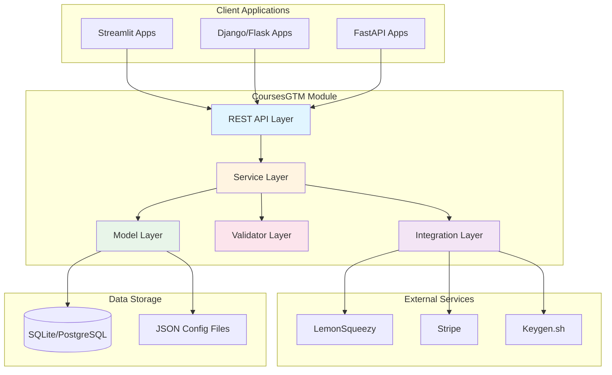

# CoursesGTM Architecture

## Module Purpose and Goals

**CoursesGTM** (Courses Go-To-Market) is a reusable curriculum, pricing, and licensing management system designed to:

- **Manage curriculum configuration** across multiple course products with version control
- **Handle tier-based access control** (Basic/Intermediate/Advanced) for courses and features
- **Manage licensing lifecycle** including issuance, validation, expiry, and renewals
- **Support gamification** through unlock rewards and achievement tracking
- **Enable rapid product launches** by reducing new course product configuration from weeks to days
- **Be product-agnostic** and reusable for any monetized course platform

### Key Design Principles

1. **Configuration as Code**: All curriculum, tiers, and pricing defined in version-controlled JSON
2. **Separation of Concerns**: Clear boundaries between curriculum, licensing, and access control
3. **Extensibility**: Plugin architecture for payment providers and license key services
4. **Performance**: Efficient caching and database indexing for high-throughput operations
5. **Security**: Cryptographically secure license keys and comprehensive audit logging

## High-Level Architecture



## Component Breakdown

### 1. Core Models

The model layer defines the core data structures and persistence logic.

**Product Model**
- Represents a complete course product (e.g., "courses-v2")
- Fields: `id`, `name`, `description`, `version`, `status`, `created_at`
- Loads curriculum configuration from JSON seeds

**Course Model**
- Represents an individual course
- Fields: `id`, `code`, `title`, `description`, `duration_hours`, `tier_access`, `prerequisites`
- Relationships: belongs to Track, has many Enrollments

**Track Model**
- Represents a learning path grouping
- Fields: `id`, `name`, `description`, `sequence_order`
- Relationships: belongs to Product, has many Courses

**Tier Model**
- Represents a pricing tier (Basic/Intermediate/Advanced)
- Fields: `id`, `name`, `product_id`, `pricing_config`, `access_config`, `unlock_rewards`
- Defines what courses and features are accessible
- Contains upgrade path definitions

**License Model**
- Represents a user's purchased license
- Fields: `id`, `key`, `user_id`, `tier_id`, `status`, `issued_at`, `expires_at`
- Methods: `validate()`, `renew()`, `upgrade()`, `is_active()`

**User Model**
- Represents a learner/customer
- Fields: `id`, `email`, `name`, `created_at`
- Relationships: has many Licenses, Enrollments, Progress records

**Enrollment Model**
- Represents user access to a course
- Fields: `id`, `user_id`, `course_id`, `enrolled_at`, `status`
- Tracks active course enrollments

**Progress Model**
- Tracks course completion
- Fields: `id`, `user_id`, `course_id`, `completion_percentage`, `last_accessed_at`, `completed_at`
- Granular tracking: lessons, sections, exercises

**Achievement Model**
- Tracks unlocked rewards/badges
- Fields: `id`, `user_id`, `achievement_type`, `metadata`, `unlocked_at`
- Types: course_completion, streak, milestone, special_unlock

**Payment Model**
- Records payment transactions
- Fields: `id`, `user_id`, `license_id`, `amount`, `currency`, `provider`, `transaction_id`, `status`
- Audit trail for financial operations

### 2. Services

The service layer implements business logic and orchestrates operations.

**LicenseService**
- `issue_license(user_id, tier_id, payment_id)` - Create new license
- `validate_license(license_key)` - Check if license is valid and active
- `renew_license(license_key, payment_id)` - Extend expiration date
- `upgrade_license(license_key, new_tier_id, payment_id)` - Upgrade to higher tier
- `revoke_license(license_key, reason)` - Deactivate license

**EnrollmentService**
- `enroll_user(user_id, course_id)` - Create enrollment based on license
- `unenroll_user(user_id, course_id)` - Remove enrollment
- `get_user_enrollments(user_id)` - List all user's active courses
- `sync_enrollments_with_license(user_id)` - Update enrollments when license changes

**PaymentService**
- `process_payment(user_id, tier_id, payment_data)` - Handle new purchase
- `process_webhook(provider, payload)` - Handle payment provider webhooks
- `record_transaction(payment_data)` - Store payment record
- `calculate_upgrade_price(current_tier, new_tier)` - Pro-rated pricing

**AnalyticsService**
- `get_user_progress_summary(user_id)` - Aggregate progress data
- `get_tier_conversion_metrics()` - Track upgrade rates
- `get_popular_courses()` - Course engagement metrics
- `get_revenue_metrics()` - Financial reporting

**ProgressService**
- `mark_lesson_complete(user_id, lesson_id)` - Record completion
- `calculate_course_progress(user_id, course_id)` - Compute percentage
- `check_unlock_rewards(user_id)` - Trigger reward logic
- `award_achievement(user_id, achievement_type)` - Grant badge

### 3. Validators

The validator layer ensures data integrity and business rules.

**ConfigValidator**
- `validate_curriculum_json(json_data)` - Check curriculum schema
- `validate_tiers_json(json_data)` - Check tiers schema
- `validate_pricing_json(json_data)` - Check pricing schema
- `check_course_prerequisites(course_id)` - Validate prerequisite chain
- `check_tier_consistency(tier_config)` - Ensure tiers are properly ordered

**LicenseValidator**
- `check_license_format(license_key)` - Validate key structure
- `check_expiry(license)` - Verify not expired
- `check_status(license)` - Verify active status
- `check_user_eligibility(user_id, tier_id)` - Prevent duplicate active licenses

**AccessValidator**
- `check_course_access(user_id, course_id)` - Verify user can access course
- `check_feature_access(user_id, feature_name)` - Verify feature permission
- `check_prerequisites(user_id, course_id)` - Verify prerequisites completed
- `check_tier_upgrade_path(current_tier, target_tier)` - Validate upgrade request

### 4. Integrations

The integration layer connects to external services.

**LemonSqueezyIntegration**
- Webhook handling for purchase events
- Product/variant synchronization
- Refund processing
- License key delivery

**StripeIntegration**
- Subscription management
- Payment intent creation
- Webhook event processing
- Customer portal integration

**KeygenIntegration**
- License key generation
- Key validation API
- Machine activation/deactivation
- License policy enforcement

## Technology Stack

### Backend
- **Language**: Python 3.10+
- **Web Framework**: FastAPI (for REST API)
- **ORM**: SQLAlchemy 2.0
- **Database**: SQLite (development), PostgreSQL (production)
- **Validation**: Pydantic v2
- **Task Queue**: Celery (for async operations)
- **Cache**: Redis (for license validation caching)

### Data & Config
- **Config Format**: JSON (with JSON Schema validation)
- **Migrations**: Alembic
- **Seeding**: Custom JSON loader scripts

### Security
- **Authentication**: JWT tokens (delegated to parent app)
- **License Keys**: `secrets` module (cryptographically secure)
- **API Rate Limiting**: SlowAPI
- **Data Validation**: Pydantic strict mode

### Testing
- **Unit Tests**: pytest
- **Integration Tests**: pytest + TestClient
- **Coverage**: pytest-cov (>80% target)
- **Fixtures**: Factory Boy

### DevOps
- **Containerization**: Docker
- **Orchestration**: Docker Compose
- **CI/CD**: GitHub Actions
- **Documentation**: MkDocs (Material theme)

## Deployment Options

### Option 1: Standalone Microservice

Deploy as independent FastAPI service:

**Pros**:
- Language-agnostic client integration (REST API)
- Horizontal scaling
- Independent deployment cycle
- Technology stack isolation

**Cons**:
- Network latency for every access check
- Additional infrastructure complexity
- Requires separate hosting

**Use Case**: Multiple disparate applications need licensing (Django + Streamlit + Mobile)

### Option 2: Embedded Library

Import as Python package:

**Pros**:
- No network latency
- Simpler deployment
- Direct database access
- Lower infrastructure cost

**Cons**:
- Requires Python in parent app
- Tight coupling
- Harder to share across different tech stacks

**Use Case**: Single Python application (Streamlit app)

### Option 3: Hybrid Approach

Library for access checks, microservice for mutations:

**Pros**:
- Fast read operations (embedded)
- Centralized write operations (API)
- Best of both worlds

**Cons**:
- Most complex architecture
- Requires careful synchronization

**Use Case**: High-traffic course platform with multiple frontends

**Recommended**: Start with Option 2 (embedded library), migrate to Option 1 as needed.

## Security Considerations

### License Key Security

- **Generation**: Use `secrets.token_urlsafe()` for cryptographically secure keys
- **Format**: `CTMV2-XXXX-XXXX-XXXX-XXXX` (prefix + 4 blocks of 4 chars)
- **Storage**: Hashed in database, plain text only in user communication
- **Validation**: Rate-limited API endpoint (max 100 req/min per IP)

### API Security

- **Authentication**: JWT tokens with short expiry (15 min)
- **Authorization**: Role-based access control (RBAC)
- **Rate Limiting**: 1000 req/hour per user, 100 req/min per endpoint
- **CORS**: Whitelist only trusted domains
- **Input Validation**: Strict Pydantic models for all inputs

### Data Privacy

- **PII**: Email, name stored encrypted at rest
- **GDPR Compliance**: User data export and deletion endpoints
- **Audit Logging**: All license operations logged with timestamp and actor
- **Data Retention**: Payment records kept 7 years (compliance), other data configurable

### Payment Security

- **PCI DSS**: All payment data handled by LemonSqueezy/Stripe (Level 1 certified)
- **Webhooks**: Validate signature on all incoming webhooks
- **Idempotency**: Use idempotency keys for payment operations
- **Refunds**: Automated license deactivation on refund webhook

### Infrastructure Security

- **Database**: Encrypted at rest (PostgreSQL with TDE)
- **Connections**: TLS 1.3 for all external communication
- **Secrets**: Environment variables, never committed to code
- **Backups**: Automated daily backups with encryption

## Performance Optimizations

### Caching Strategy

- **License Validation**: Cache valid licenses in Redis (TTL: 5 minutes)
- **Course Access**: Cache user-course permissions (TTL: 10 minutes)
- **Curriculum Data**: Cache JSON config in memory (reload on change)

### Database Indexing

- Indexes on: `licenses.key`, `licenses.user_id`, `enrollments.user_id`, `progress.user_id`
- Composite indexes: `(user_id, course_id)` on progress and enrollments

### Query Optimization

- Use `select_related()` and `prefetch_related()` to minimize N+1 queries
- Batch operations for enrollment synchronization
- Connection pooling for high concurrency

## Extensibility Points

### Custom Payment Providers

Implement `PaymentProviderInterface`:
```python
class PaymentProviderInterface(ABC):
    @abstractmethod
    def process_payment(self, amount, currency, metadata): pass
    
    @abstractmethod
    def handle_webhook(self, payload, signature): pass
```

### Custom Achievement Triggers

Register custom triggers:
```python
@achievement_trigger("custom_event")
def check_custom_achievement(user_id, event_data):
    # Custom logic
    return True/False
```

### Custom Access Rules

Override `AccessValidator` methods:
```python
class CustomAccessValidator(AccessValidator):
    def check_course_access(self, user_id, course_id):
        # Custom business logic
        return super().check_course_access(user_id, course_id)
```

## Future Enhancements

1. **Multi-tenancy**: Support multiple course providers in single instance
2. **GraphQL API**: Alternative to REST for flexible queries
3. **Real-time Updates**: WebSocket support for live progress updates
4. **Mobile SDK**: Native iOS/Android libraries
5. **Offline Mode**: License validation without network connection
6. **A/B Testing**: Built-in experimentation framework for pricing
7. **Referral System**: Track and reward referrals
8. **Team Licenses**: Bulk licensing for organizations

## Related Documentation

- [Product Requirements (PRD)](./PRD.md)
- [Data Model Specification](./DATA_MODEL.md)
- [API Specification](./API_SPEC.md)
- [Integration Guide](./INTEGRATION.md)
- [Implementation Roadmap](./ROADMAP.md)
