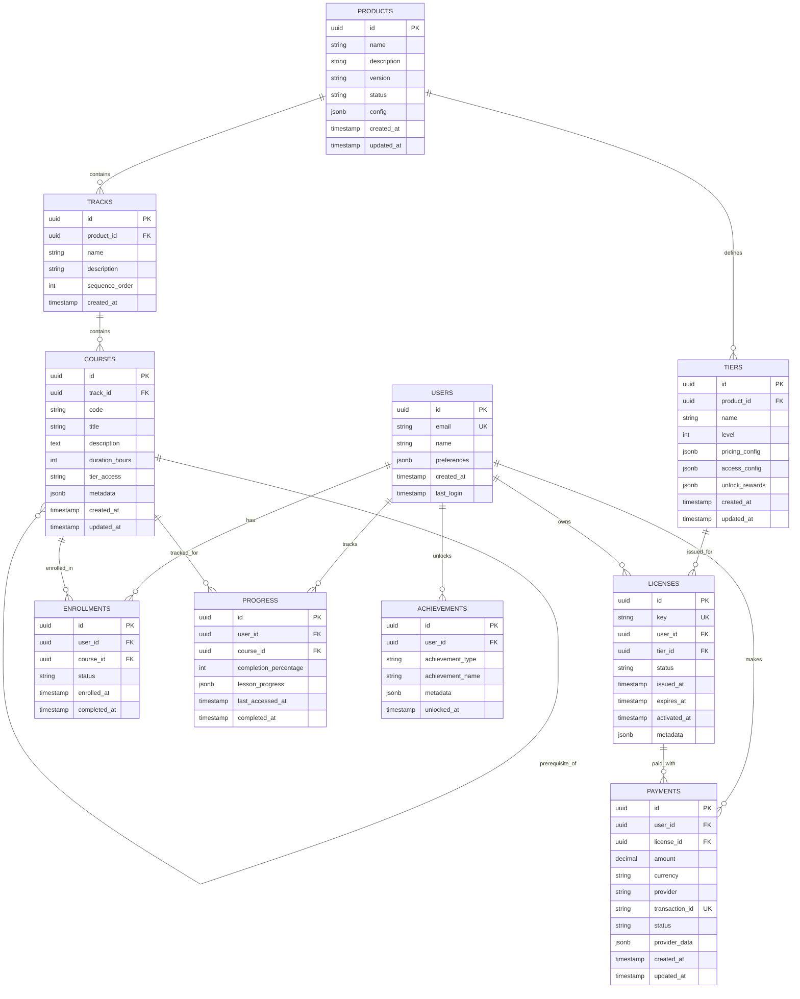

# CoursesGTM Data Model Specification

## Overview

This document defines the database schema, relationships, and constraints for the CoursesGTM module. The data model supports curriculum management, tier-based licensing, progress tracking, and payment processing.

## Database Technology

- **Development**: SQLite 3.35+ (file-based, zero-config)
- **Production**: PostgreSQL 14+ (scalable, robust)
- **ORM**: SQLAlchemy 2.0
- **Migrations**: Alembic

## Entity-Relationship Diagram



## Table Definitions

### 1. Products Table

Stores metadata about course products (e.g., "courses-v2").

```sql
CREATE TABLE products (
    id UUID PRIMARY KEY DEFAULT gen_random_uuid(),
    name VARCHAR(255) NOT NULL UNIQUE,
    description TEXT,
    version VARCHAR(50) NOT NULL,  -- Semver format
    status VARCHAR(50) NOT NULL DEFAULT 'active',  -- active, archived
    config JSONB,  -- Full curriculum configuration
    created_at TIMESTAMP NOT NULL DEFAULT NOW(),
    updated_at TIMESTAMP NOT NULL DEFAULT NOW()
);

-- Indexes
CREATE INDEX idx_products_status ON products(status);
CREATE INDEX idx_products_version ON products(version);
```

**Constraints**:
- `name` must be unique
- `version` must follow semver format (validated at application level)
- `status` must be one of: `active`, `archived`

**Sample Data**:
```sql
INSERT INTO products (name, description, version, status) VALUES
('courses-v2-2026', 'Modern Data Science & AI Curriculum 2026', '1.0.0', 'active');
```

### 2. Tracks Table

Represents learning path groupings within a product.

```sql
CREATE TABLE tracks (
    id UUID PRIMARY KEY DEFAULT gen_random_uuid(),
    product_id UUID NOT NULL REFERENCES products(id) ON DELETE CASCADE,
    name VARCHAR(255) NOT NULL,
    description TEXT,
    sequence_order INT NOT NULL,  -- Display order
    created_at TIMESTAMP NOT NULL DEFAULT NOW()
);

-- Indexes
CREATE INDEX idx_tracks_product ON tracks(product_id);
CREATE INDEX idx_tracks_sequence ON tracks(product_id, sequence_order);
```

**Constraints**:
- `sequence_order` must be unique within a product
- `product_id` foreign key with CASCADE delete

**Sample Data**:
```sql
INSERT INTO tracks (product_id, name, description, sequence_order) VALUES
('...', 'Modern Foundations', 'Philosophy and tooling for modern data science', 1),
('...', 'Core AI/ML', 'Statistical learning, deep learning, and NLP', 2),
('...', 'Production', 'MLOps and AI ethics for production systems', 3);
```

### 3. Courses Table

Individual course records.

```sql
CREATE TABLE courses (
    id UUID PRIMARY KEY DEFAULT gen_random_uuid(),
    track_id UUID NOT NULL REFERENCES tracks(id) ON DELETE CASCADE,
    code VARCHAR(50) NOT NULL UNIQUE,  -- e.g., "DS101"
    title VARCHAR(255) NOT NULL,
    description TEXT,
    duration_hours INT NOT NULL,
    tier_access VARCHAR(50) NOT NULL,  -- basic, intermediate, advanced
    metadata JSONB,  -- Syllabus, learning objectives, etc.
    created_at TIMESTAMP NOT NULL DEFAULT NOW(),
    updated_at TIMESTAMP NOT NULL DEFAULT NOW()
);

-- Indexes
CREATE INDEX idx_courses_track ON courses(track_id);
CREATE INDEX idx_courses_tier ON courses(tier_access);
CREATE UNIQUE INDEX idx_courses_code ON courses(code);
```

**Constraints**:
- `code` must be unique across all courses
- `tier_access` must be one of: `basic`, `intermediate`, `advanced`
- `duration_hours` must be > 0

**Sample Data**:
```sql
INSERT INTO courses (track_id, code, title, duration_hours, tier_access) VALUES
('...', 'PHIL2026', 'Philosophy of Modern Data Science', 8, 'basic'),
('...', 'TOOL2026', 'Modern Tooling & Development Environment', 10, 'basic'),
('...', 'SLML2026', 'Statistical Learning & ML Fundamentals', 15, 'basic');
```

### 4. Course Prerequisites Table

Many-to-many relationship for course prerequisites.

```sql
CREATE TABLE course_prerequisites (
    course_id UUID NOT NULL REFERENCES courses(id) ON DELETE CASCADE,
    prerequisite_course_id UUID NOT NULL REFERENCES courses(id) ON DELETE CASCADE,
    created_at TIMESTAMP NOT NULL DEFAULT NOW(),
    PRIMARY KEY (course_id, prerequisite_course_id)
);

-- Indexes
CREATE INDEX idx_prereq_course ON course_prerequisites(course_id);
CREATE INDEX idx_prereq_prerequisite ON course_prerequisites(prerequisite_course_id);
```

**Constraints**:
- Cannot have circular prerequisites (validated at application level)
- A course cannot be its own prerequisite

### 5. Tiers Table

Pricing tier definitions.

```sql
CREATE TABLE tiers (
    id UUID PRIMARY KEY DEFAULT gen_random_uuid(),
    product_id UUID NOT NULL REFERENCES products(id) ON DELETE CASCADE,
    name VARCHAR(100) NOT NULL,
    level INT NOT NULL,  -- 1=Basic, 2=Intermediate, 3=Advanced
    pricing_config JSONB NOT NULL,  -- {one_time: 99, expiry_months: 12}
    access_config JSONB NOT NULL,  -- {courses: [...], features: {...}}
    unlock_rewards JSONB,  -- Achievement definitions
    created_at TIMESTAMP NOT NULL DEFAULT NOW(),
    updated_at TIMESTAMP NOT NULL DEFAULT NOW(),
    UNIQUE(product_id, name),
    UNIQUE(product_id, level)
);

-- Indexes
CREATE INDEX idx_tiers_product ON tiers(product_id);
CREATE INDEX idx_tiers_level ON tiers(product_id, level);
```

**Constraints**:
- `level` must be unique per product
- `pricing_config` must include `one_time` and `expiry_months` fields
- Higher levels must include all lower level courses (validated at application level)

**Sample Data**:
```sql
INSERT INTO tiers (product_id, name, level, pricing_config, access_config) VALUES
('...', 'Basic', 1, 
 '{"one_time": 99, "expiry_months": 12}',
 '{"courses": ["PHIL2026", "TOOL2026", "DENG2026", "SLML2026", "DEEP2026"], "features": {"community_access": true}}'),
('...', 'Intermediate', 2, 
 '{"one_time": 199, "expiry_months": 12}',
 '{"courses": ["PHIL2026", "TOOL2026", "DENG2026", "SLML2026", "DEEP2026", "NLPT2026", "GENA2026", "MLOP2026"], "features": {"community_access": true, "priority_support": true}}');
```

### 6. Users Table

Learner/customer records.

```sql
CREATE TABLE users (
    id UUID PRIMARY KEY DEFAULT gen_random_uuid(),
    email VARCHAR(255) NOT NULL UNIQUE,
    name VARCHAR(255),
    preferences JSONB DEFAULT '{}',  -- UI preferences, notifications, etc.
    created_at TIMESTAMP NOT NULL DEFAULT NOW(),
    last_login TIMESTAMP
);

-- Indexes
CREATE UNIQUE INDEX idx_users_email ON users(email);
CREATE INDEX idx_users_created ON users(created_at);
```

**Constraints**:
- `email` must be unique and valid format (validated at application level)
- PII (email, name) should be encrypted at rest in production

**Sample Data**:
```sql
INSERT INTO users (email, name) VALUES
('learner@example.com', 'Alex Learner'),
('pro@example.com', 'Taylor Professional');
```

### 7. Licenses Table

User license records (purchased tiers).

```sql
CREATE TABLE licenses (
    id UUID PRIMARY KEY DEFAULT gen_random_uuid(),
    key VARCHAR(255) NOT NULL UNIQUE,  -- CTMV2-XXXX-XXXX-XXXX-XXXX
    user_id UUID NOT NULL REFERENCES users(id) ON DELETE CASCADE,
    tier_id UUID NOT NULL REFERENCES tiers(id),
    status VARCHAR(50) NOT NULL DEFAULT 'active',  -- active, expired, revoked
    issued_at TIMESTAMP NOT NULL DEFAULT NOW(),
    expires_at TIMESTAMP NOT NULL,
    activated_at TIMESTAMP,
    metadata JSONB DEFAULT '{}',  -- Source, notes, etc.
    INDEX idx_licenses_key ON licenses(key),
    INDEX idx_licenses_user ON licenses(user_id),
    INDEX idx_licenses_status ON licenses(status),
    INDEX idx_licenses_expires ON licenses(expires_at)
);

-- Indexes
CREATE UNIQUE INDEX idx_licenses_key ON licenses(key);
CREATE INDEX idx_licenses_user ON licenses(user_id);
CREATE INDEX idx_licenses_status ON licenses(status);
CREATE INDEX idx_licenses_expires ON licenses(expires_at);
CREATE INDEX idx_licenses_user_status ON licenses(user_id, status);
```

**Constraints**:
- `key` must be unique and follow format `CTMV2-XXXX-XXXX-XXXX-XXXX`
- `status` must be one of: `active`, `expired`, `revoked`, `pending`
- `expires_at` must be after `issued_at`
- User can have only one active license per product (validated at application level)

**Sample Data**:
```sql
INSERT INTO licenses (key, user_id, tier_id, status, issued_at, expires_at) VALUES
('CTMV2-A1B2-C3D4-E5F6-G7H8', '...', '...', 'active', NOW(), NOW() + INTERVAL '12 months');
```

### 8. Enrollments Table

Tracks which courses users are enrolled in.

```sql
CREATE TABLE enrollments (
    id UUID PRIMARY KEY DEFAULT gen_random_uuid(),
    user_id UUID NOT NULL REFERENCES users(id) ON DELETE CASCADE,
    course_id UUID NOT NULL REFERENCES courses(id) ON DELETE CASCADE,
    status VARCHAR(50) NOT NULL DEFAULT 'active',  -- active, completed, dropped
    enrolled_at TIMESTAMP NOT NULL DEFAULT NOW(),
    completed_at TIMESTAMP,
    UNIQUE(user_id, course_id)
);

-- Indexes
CREATE INDEX idx_enrollments_user ON enrollments(user_id);
CREATE INDEX idx_enrollments_course ON enrollments(course_id);
CREATE INDEX idx_enrollments_status ON enrollments(user_id, status);
CREATE UNIQUE INDEX idx_enrollments_user_course ON enrollments(user_id, course_id);
```

**Constraints**:
- User can only be enrolled once per course
- `status` must be one of: `active`, `completed`, `dropped`
- `completed_at` must be after `enrolled_at`

**Sample Data**:
```sql
INSERT INTO enrollments (user_id, course_id, status, enrolled_at) VALUES
('...', '...', 'active', NOW());
```

### 9. Progress Table

Detailed completion tracking.

```sql
CREATE TABLE progress (
    id UUID PRIMARY KEY DEFAULT gen_random_uuid(),
    user_id UUID NOT NULL REFERENCES users(id) ON DELETE CASCADE,
    course_id UUID NOT NULL REFERENCES courses(id) ON DELETE CASCADE,
    completion_percentage INT NOT NULL DEFAULT 0 CHECK (completion_percentage BETWEEN 0 AND 100),
    lesson_progress JSONB DEFAULT '{}',  -- {lesson_id: {status, completed_at}}
    last_accessed_at TIMESTAMP NOT NULL DEFAULT NOW(),
    completed_at TIMESTAMP,
    UNIQUE(user_id, course_id)
);

-- Indexes
CREATE INDEX idx_progress_user ON progress(user_id);
CREATE INDEX idx_progress_course ON progress(course_id);
CREATE INDEX idx_progress_user_course ON progress(user_id, course_id);
CREATE INDEX idx_progress_last_accessed ON progress(last_accessed_at);
```

**Constraints**:
- One progress record per user-course pair
- `completion_percentage` must be 0-100
- `completed_at` set when `completion_percentage` reaches 100

**Sample Data**:
```sql
INSERT INTO progress (user_id, course_id, completion_percentage, lesson_progress) VALUES
('...', '...', 45, '{"lesson-1": {"status": "completed", "completed_at": "2026-01-01"}, "lesson-2": {"status": "in_progress"}}');
```

### 10. Achievements Table

Unlocked rewards and badges.

```sql
CREATE TABLE achievements (
    id UUID PRIMARY KEY DEFAULT gen_random_uuid(),
    user_id UUID NOT NULL REFERENCES users(id) ON DELETE CASCADE,
    achievement_type VARCHAR(100) NOT NULL,  -- course_completion, streak, milestone
    achievement_name VARCHAR(255) NOT NULL,
    metadata JSONB DEFAULT '{}',  -- Icon, description, etc.
    unlocked_at TIMESTAMP NOT NULL DEFAULT NOW()
);

-- Indexes
CREATE INDEX idx_achievements_user ON achievements(user_id);
CREATE INDEX idx_achievements_type ON achievements(achievement_type);
CREATE INDEX idx_achievements_unlocked ON achievements(unlocked_at);
```

**Achievement Types**:
- `course_completion` - Completed a course
- `streak` - Learning streak (7 days, 30 days, etc.)
- `milestone` - Major milestones (first course, 3 courses, all courses)
- `special` - Custom/promotional achievements

**Sample Data**:
```sql
INSERT INTO achievements (user_id, achievement_type, achievement_name, metadata) VALUES
('...', 'course_completion', 'First Course Completed', '{"course_id": "...", "icon": "🎓"}'),
('...', 'streak', '7-Day Streak', '{"streak_days": 7, "icon": "🔥"}');
```

### 11. Payments Table

Payment transaction records.

```sql
CREATE TABLE payments (
    id UUID PRIMARY KEY DEFAULT gen_random_uuid(),
    user_id UUID NOT NULL REFERENCES users(id) ON DELETE CASCADE,
    license_id UUID REFERENCES licenses(id),  -- NULL for failed payments
    amount DECIMAL(10, 2) NOT NULL,
    currency VARCHAR(3) NOT NULL DEFAULT 'USD',
    provider VARCHAR(50) NOT NULL,  -- lemonsqueezy, stripe
    transaction_id VARCHAR(255) NOT NULL UNIQUE,
    status VARCHAR(50) NOT NULL,  -- pending, completed, failed, refunded
    provider_data JSONB,  -- Webhook payload
    created_at TIMESTAMP NOT NULL DEFAULT NOW(),
    updated_at TIMESTAMP NOT NULL DEFAULT NOW()
);

-- Indexes
CREATE INDEX idx_payments_user ON payments(user_id);
CREATE INDEX idx_payments_license ON payments(license_id);
CREATE INDEX idx_payments_transaction ON payments(transaction_id);
CREATE INDEX idx_payments_status ON payments(status);
CREATE INDEX idx_payments_created ON payments(created_at);
```

**Constraints**:
- `transaction_id` must be unique (idempotency)
- `amount` must be > 0
- `currency` must be valid ISO 4217 code
- `status` must be one of: `pending`, `completed`, `failed`, `refunded`

**Sample Data**:
```sql
INSERT INTO payments (user_id, license_id, amount, currency, provider, transaction_id, status) VALUES
('...', '...', 99.00, 'USD', 'lemonsqueezy', 'lms_123456', 'completed');
```

## Relationships Summary

### One-to-Many

- Product → Tracks (1 product has many tracks)
- Product → Tiers (1 product has many tiers)
- Track → Courses (1 track has many courses)
- Tier → Licenses (1 tier has many licenses)
- User → Licenses (1 user has many licenses)
- User → Enrollments (1 user has many enrollments)
- User → Progress (1 user has many progress records)
- User → Achievements (1 user has many achievements)
- User → Payments (1 user has many payments)
- Course → Enrollments (1 course has many enrollments)
- Course → Progress (1 course has many progress records)
- License → Payments (1 license may have many payments)

### Many-to-Many

- Course ↔ Course (prerequisites, via `course_prerequisites` table)

## Indexes Strategy

### Primary Indexes (Automatic)

All `id` primary keys are automatically indexed.

### Foreign Key Indexes

All foreign key columns are indexed for join performance.

### Query Optimization Indexes

**High-Traffic Queries**:
- `licenses.key` - License validation (most frequent query)
- `users.email` - User lookup
- `(user_id, course_id)` - Access checks
- `(user_id, status)` - Active licenses/enrollments

**Reporting Queries**:
- `payments.created_at` - Revenue reports
- `achievements.unlocked_at` - Engagement metrics
- `progress.last_accessed_at` - Activity tracking

## Data Integrity Rules

### Application-Level Validation

These rules are enforced in code, not database constraints:

1. **Tier Consistency**: Higher tiers must include all lower tier courses
2. **Prerequisite Acyclicity**: No circular prerequisite chains
3. **Single Active License**: User can have only one active license per product
4. **Email Format**: Valid email addresses only
5. **Semver Format**: Product versions follow semantic versioning
6. **License Key Format**: Must match `CTMV2-XXXX-XXXX-XXXX-XXXX`

### Database-Level Constraints

1. **Foreign Keys**: All relationships enforced with CASCADE delete where appropriate
2. **Uniqueness**: `users.email`, `licenses.key`, `courses.code`, `payments.transaction_id`
3. **NOT NULL**: Critical fields cannot be null
4. **CHECK**: `progress.completion_percentage` between 0-100

## Migration Strategy

### Initial Setup

```bash
# Create database
alembic init alembic

# Generate initial migration
alembic revision --autogenerate -m "Initial schema"

# Apply migration
alembic upgrade head
```

### Schema Changes

```bash
# Make model changes in SQLAlchemy models
# Generate migration
alembic revision --autogenerate -m "Description of change"

# Review generated migration file
# Apply migration
alembic upgrade head
```

### Data Seeding

```bash
# Load curriculum from JSON
python scripts/seed_curriculum.py --file seeds/courses_v2_2026.json

# Load tiers
python scripts/seed_tiers.py --file seeds/courses_v2_2026_tiers.json

# Load pricing
python scripts/seed_pricing.py --file seeds/courses_v2_2026_pricing.json
```

## Performance Considerations

### Expected Data Volumes

- **Products**: < 10
- **Tracks**: < 100 (10 per product)
- **Courses**: < 1,000 (100 per product)
- **Tiers**: < 50 (5 per product)
- **Users**: 10,000 - 100,000
- **Licenses**: 10,000 - 100,000
- **Enrollments**: 100,000 - 1,000,000
- **Progress**: 100,000 - 1,000,000
- **Achievements**: 500,000 - 5,000,000
- **Payments**: 10,000 - 100,000

### Query Performance Targets

- License validation: < 10ms (with index)
- User enrollments: < 50ms
- Progress tracking: < 20ms
- Course listing: < 100ms

### Optimization Strategies

1. **Connection Pooling**: Reuse database connections
2. **Query Caching**: Cache frequent queries in Redis (5-minute TTL)
3. **Batch Operations**: Bulk insert enrollments on license creation
4. **Lazy Loading**: Don't load JSON fields unless needed
5. **Pagination**: Limit result sets (max 100 records per page)

## Backup and Recovery

### Backup Strategy

- **Full Backup**: Daily at 2 AM UTC
- **Incremental Backup**: Every 6 hours
- **WAL Archiving**: Continuous (PostgreSQL only)
- **Retention**: 30 days

### Critical Data

Priority order for recovery:
1. `licenses` (most critical)
2. `payments` (financial audit)
3. `users` (customer data)
4. `progress` (user state)
5. `products`, `tracks`, `courses` (recoverable from JSON)

## Related Documentation

- [Architecture Overview](./ARCHITECTURE.md)
- [API Specification](./API_SPEC.md)
- [Configuration Schema](./CONFIG_SCHEMA.md)
