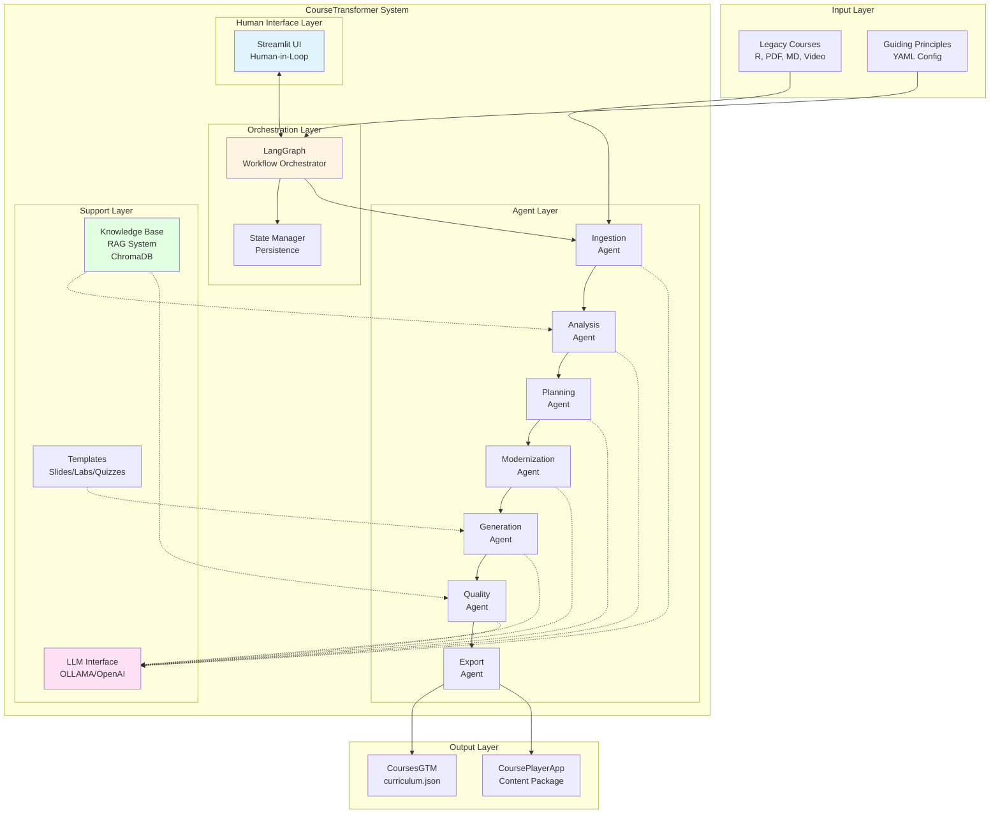
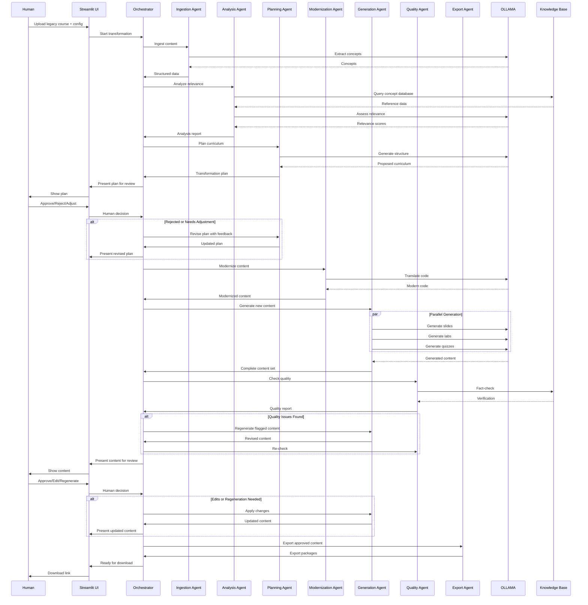
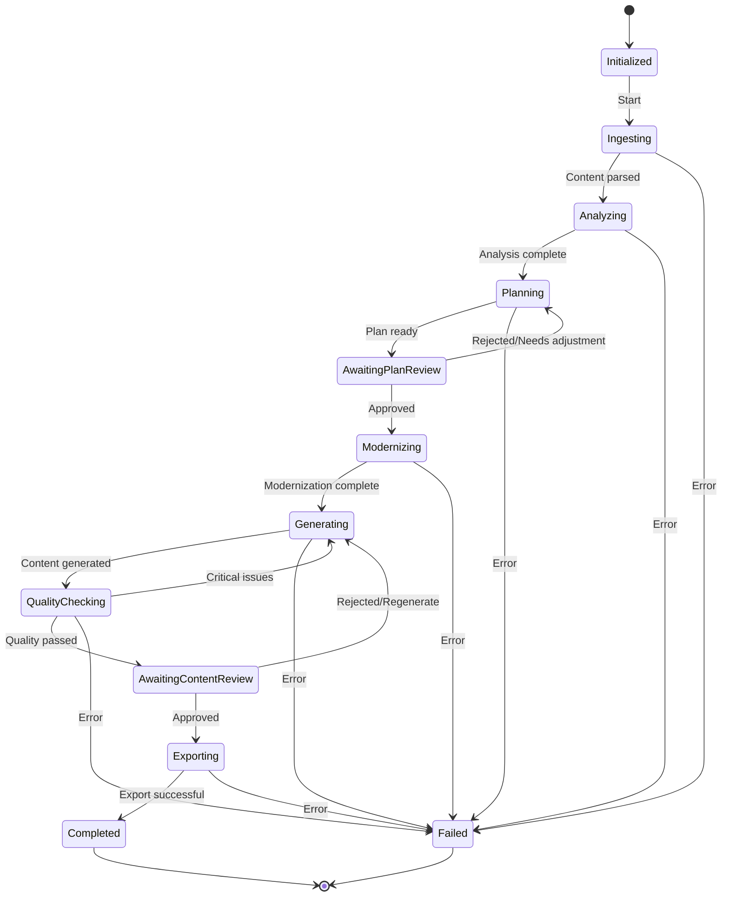

# CourseTransformer - System Architecture

## System Overview

### Purpose
CourseTransformer is an AI-powered, human-guided workflow system designed to transform legacy educational content into modern, interactive courses compatible with CoursesGTM and CoursePlayerApp platforms.

### Goals
- **Automate repetitive tasks**: Use AI to handle mechanical content transformation, parsing, and generation
- **Augment human expertise**: Keep humans in control of creative and pedagogical decisions
- **Ensure quality**: Multi-stage validation with both AI and human review
- **Modernize curriculum**: Update legacy R-based content to modern Python/AI/ML ecosystem
- **Maintain consistency**: Apply uniform standards and principles across all transformations
- **Enable scalability**: Process multiple courses in parallel with state persistence

### Use Cases

1. **Legacy Course Modernization**
   - Transform Johns Hopkins R-based Data Science Specialization to Python 2026
   - Update deprecated libraries and practices
   - Add modern AI/ML topics (Transformers, LLMs, RAG, MLOps)

2. **New Course Creation**
   - Generate courses from scratch based on topic specifications
   - Ensure consistency with existing curriculum structure
   - Apply pedagogical best practices

3. **Incremental Updates**
   - Refresh specific modules without full transformation
   - Add new topics to existing courses
   - Update examples and datasets

4. **Multi-language Migration**
   - R → Python (primary use case)
   - Support for Julia, Julia → Python

## High-Level Architecture



## Component Breakdown

### 1. Multi-Agent Pipeline

#### Agent Types (7 Core Agents)

**1️⃣ Ingestion Agent**
- **Responsibility**: Parse and extract content from legacy courses
- **Technologies**: PyPDF2, pdfplumber, tree-sitter, video APIs
- **Outputs**: Structured JSON, extracted concepts

**2️⃣ Analysis Agent**
- **Responsibility**: Assess relevance and identify modernization gaps
- **Technologies**: LLM semantic analysis, knowledge base queries
- **Outputs**: Relevance report, gap analysis, suggestions

**3️⃣ Planning Agent**
- **Responsibility**: Design new curriculum structure
- **Technologies**: LLM-powered curriculum design, dependency mapping
- **Outputs**: Curriculum structure JSON, transformation plan

**4️⃣ Modernization Agent**
- **Responsibility**: Transform legacy code/concepts to modern equivalents
- **Technologies**: Tree-sitter AST parsing, LLM semantic translation
- **Outputs**: Modernized code, updated concepts

**5️⃣ Generation Agent**
- **Responsibility**: Create new course content from templates
- **Technologies**: Template engines, LLM content generation
- **Outputs**: Slides (Marp), labs (Jupyter), quizzes (JSON), diagrams (Mermaid)

**6️⃣ Quality Assurance Agent**
- **Responsibility**: Verify accuracy, consistency, completeness
- **Technologies**: nbconvert, pylint, RAG fact-checking
- **Outputs**: Quality report with issues categorized by severity

**7️⃣ Export Agent**
- **Responsibility**: Package content for deployment
- **Technologies**: Schema validators, file organizers
- **Outputs**: CoursesGTM seed files, CoursePlayerApp packages

### 2. Workflow Orchestrator (LangGraph)

**Responsibilities**:
- Manage agent execution sequence
- Handle conditional branching based on outcomes
- Coordinate human review checkpoints
- Enable parallel processing where applicable
- Persist state between stages
- Implement retry logic and error recovery

**Features**:
- State machine implementation
- Conditional edges (approval/rejection flows)
- Parallel execution for independent tasks
- Checkpoint system for pause/resume
- Event emission for UI updates

### 3. Human Loop Interface (Streamlit)

**Responsibilities**:
- Present work to humans for review
- Collect human feedback and decisions
- Display real-time agent progress
- Enable content editing and regeneration
- Manage guiding principles configuration

**Features**:
- Multi-page dashboard
- Real-time WebSocket updates
- Inline content editing
- Side-by-side comparisons
- Approval workflows

### 4. Knowledge Base (RAG System)

**Components**:
- **Vector Store**: ChromaDB for semantic search
- **Embeddings**: Course content embedded at concept/lesson granularity
- **Knowledge Graph**: Concept relationships and dependencies

**Uses**:
- Fact-checking during quality assurance
- Context retrieval for content generation
- Relevance assessment during analysis
- Concept relationship mapping

### 5. LLM Integration (OLLAMA)

**Architecture**:
- **Primary**: OLLAMA for local, privacy-first AI
- **Fallback**: OpenAI/Anthropic APIs (configurable)
- **Model Selection**: Per-agent model assignment
  - Lightweight models (llama2:7b) for analysis
  - Heavyweight models (llama2:70b, mixtral) for generation

**Features**:
- Context window management (4k-128k tokens)
- Prompt templating per agent
- Response caching for efficiency
- Streaming for long-running tasks

## Technology Stack

### Core Technologies
- **Language**: Python 3.10+
- **Workflow Orchestration**: LangGraph
- **Agent Framework**: LangChain
- **LLM**: OLLAMA (primary), OpenAI/Anthropic (optional)
- **Human Interface**: Streamlit
- **Vector Database**: ChromaDB
- **State Persistence**: SQLite + JSON

### Content Processing
- **Code Parsing**: tree-sitter, ast module
- **PDF Processing**: PyPDF2, pdfplumber
- **Document Generation**: Marp (slides), nbformat (notebooks)
- **Diagram Generation**: Mermaid CLI
- **Video Processing**: whisper (transcription)

### Quality & Testing
- **Code Execution**: nbconvert, jupyter
- **Linting**: pylint, black, isort
- **Testing**: pytest
- **Validation**: jsonschema, pydantic

### Deployment
- **Containerization**: Docker
- **API**: FastAPI (for programmatic access)
- **CI/CD**: GitHub Actions

## Data Flow



## State Management

### State Schema
The system maintains a comprehensive state object throughout the transformation workflow:

```python
{
    "transformation_id": "uuid",
    "status": "in_progress | paused | completed | failed",
    "current_stage": "ingestion | analysis | planning | modernization | generation | qa | export",
    
    # Input
    "legacy_course_path": "/path/to/course",
    "guiding_principles": {
        "philosophy": "augmented_human",
        "target_year": 2026,
        "primary_language": "Python",
        # ... full config
    },
    
    # Stage outputs
    "ingestion_output": {
        "parsed_content": {},
        "extracted_concepts": [],
        "metadata": {}
    },
    "analysis_output": {
        "relevance_report": {},
        "gaps": [],
        "suggestions": []
    },
    "planning_output": {
        "curriculum_structure": {},
        "transformation_plan": []
    },
    "modernization_output": {
        "modernized_code": {},
        "updated_concepts": []
    },
    "generation_output": {
        "slides": [],
        "labs": [],
        "quizzes": [],
        "diagrams": []
    },
    "qa_output": {
        "quality_report": {},
        "issues": []
    },
    
    # Human interactions
    "human_reviews": [
        {
            "stage": "planning",
            "timestamp": "2026-01-12T10:00:00Z",
            "decision": "approved | rejected | needs_adjustment",
            "feedback": "Add more emphasis on LLMs"
        }
    ],
    
    # Export
    "export_output": {
        "coursesgtm_path": "/output/curriculum.json",
        "courseplayerapp_path": "/output/content/"
    },
    
    # Metadata
    "created_at": "2026-01-12T09:00:00Z",
    "updated_at": "2026-01-12T10:30:00Z",
    "estimated_completion": "2026-01-12T12:00:00Z"
}
```

### State Persistence

**Storage**:
- **Database**: SQLite for structured state
- **Files**: JSON for serialized state snapshots
- **Checkpoints**: Automatic saves after each agent completes

**Features**:
- **Pause/Resume**: Save state, shut down, resume later
- **Rollback**: Revert to previous checkpoint if needed
- **History**: Track all state changes for audit trail
- **Multi-instance**: Support multiple transformations simultaneously

### State Transitions



## Scalability Considerations

### Parallel Processing

**Course-Level Parallelization**:
- Process multiple independent courses simultaneously
- Each course gets its own workflow instance
- Shared LLM and knowledge base resources

**Content-Level Parallelization**:
- Generate slides, labs, quizzes in parallel (independent tasks)
- Batch process multiple modules within a course
- Parallel code modernization for independent files

**Implementation**:
```python
# Parallel content generation
async def generate_content_parallel(concepts, templates):
    tasks = [
        generate_slides(concepts, templates['slides']),
        generate_labs(concepts, templates['labs']),
        generate_quizzes(concepts, templates['quizzes'])
    ]
    results = await asyncio.gather(*tasks)
    return results
```

### Caching Strategy

**LLM Response Cache**:
- Cache common transformations (R → Python patterns)
- Cache concept definitions from knowledge base
- Cache quality checks for identical code snippets
- TTL: 30 days

**Knowledge Base Cache**:
- In-memory cache for frequently accessed concepts
- Embeddings cache to avoid recomputation
- LRU eviction policy

**Template Cache**:
- Pre-compiled templates loaded at startup
- Hot-reload in development mode

### Incremental Updates

**Granular Processing**:
- Process at module level, not just full course
- Track which modules have been transformed
- Allow updating single modules without full retransformation

**Change Detection**:
- Hash-based change detection for legacy content
- Only reprocess modified sections
- Preserve approved human edits during updates

**Delta Exports**:
- Export only changed content
- Incremental updates to CoursesGTM
- Minimize downstream impact

### Resource Management

**LLM Rate Limiting**:
- Token budget per transformation
- Queue system for LLM requests
- Graceful degradation (fallback to lighter models)

**Memory Management**:
- Stream large files instead of loading fully
- Paginate content generation
- Cleanup intermediate artifacts

**Storage Optimization**:
- Compress archived transformations
- Purge old checkpoints (keep last 5)
- Deduplicate common assets (images, datasets)

## Error Handling & Recovery

### Retry Logic

**Agent Failures**:
- Automatic retry: 3 attempts with exponential backoff
- Fallback to alternative LLM model if available
- Log detailed error context for debugging

**LLM Timeouts**:
- Timeout: 60s for analysis, 180s for generation
- Retry with simplified prompt
- Fallback to human intervention

### Failure Recovery

**Checkpoint Recovery**:
- Resume from last successful agent
- Preserve all prior work
- Option to skip problematic stage (with warning)

**Graceful Degradation**:
- If LLM unavailable: prompt human for manual input
- If knowledge base unavailable: skip fact-checking (log warning)
- If template missing: use default template

### Human Escalation

**Trigger Conditions**:
- Agent fails 3 times consecutively
- Quality score below critical threshold (50%)
- Unexpected data format

**Escalation Process**:
1. Pause workflow
2. Notify human via UI + optional email
3. Present error context and options
4. Human decision: retry, skip, abort, manual intervention

## Security & Privacy

### Data Handling

**Privacy-First**:
- Default to local OLLAMA (no external API calls)
- Option to use OpenAI with explicit consent
- No data transmitted externally unless configured

**Content Security**:
- Validate all user uploads (file type, size limits)
- Sanitize LLM outputs (no code injection)
- Sandbox code execution (Docker containers)

### Access Control

**Authentication** (Future):
- User authentication for multi-user deployments
- Role-based access (admin, creator, reviewer)
- Audit logs for all transformations

**Data Isolation**:
- Each transformation in separate directory
- No cross-transformation data access
- Secure cleanup of temporary files

## Monitoring & Observability

### Metrics

**Performance**:
- Transformation duration per stage
- LLM token usage and costs
- Success/failure rates per agent

**Quality**:
- Average quality scores
- Human approval/rejection rates
- Most common quality issues

### Logging

**Structured Logs**:
- JSON format for machine parsing
- Log levels: DEBUG, INFO, WARNING, ERROR, CRITICAL
- Contextual information (transformation_id, stage, agent)

**Audit Trail**:
- All human decisions logged
- All LLM prompts and responses (optional, privacy-aware)
- State transitions with timestamps

### Dashboards

**Real-Time** (Streamlit):
- Active transformations
- Current stage and progress
- Recent errors

**Analytics** (Future):
- Historical transformation statistics
- Cost analysis (LLM usage)
- Quality trends over time

## Extensibility

### Plugin Architecture

**Custom Agents**:
- Define new agent types for specialized tasks
- Register agents with orchestrator
- Example: VideoGenerationAgent, TranslationAgent

**Custom Templates**:
- Add templates for new content types
- Override default templates
- Template inheritance

### Integration Points

**Input Sources**:
- File system (current)
- GitHub repositories (future)
- LMS exports (Moodle, Canvas)

**Output Targets**:
- CoursesGTM (current)
- CoursePlayerApp (current)
- Moodle XML (future)
- SCORM packages (future)

### API Access

**REST API** (Future):
- Programmatic transformation triggering
- Status polling
- Content retrieval

**Webhooks**:
- Notify external systems on completion
- Integration with CI/CD pipelines

## Deployment Architecture

### Local Development
```
Developer Machine
├── Streamlit UI (localhost:8501)
├── LangGraph Orchestrator
├── OLLAMA (localhost:11434)
└── ChromaDB (local file)
```

### Production (Docker Compose)
```
Docker Host
├── coursetransformer-ui (Streamlit)
├── coursetransformer-api (FastAPI)
├── coursetransformer-workers (Agent executors)
├── ollama (LLM service)
├── chromadb (Vector store)
└── postgres (State persistence)
```

### Cloud Deployment (Future)
```
Kubernetes Cluster
├── UI Pods (Streamlit)
├── API Pods (FastAPI + LangGraph)
├── Worker Pods (Agents, auto-scaling)
├── OLLAMA Service (GPU nodes)
└── Managed Services
    ├── Cloud SQL (State)
    └── Cloud Storage (Content)
```

## Future Enhancements

### Roadmap

**Phase 1** (MVP):
- All 7 core agents
- Basic LangGraph workflow
- Streamlit UI with 2 human review points
- OLLAMA integration
- Export to CoursesGTM

**Phase 2** (Enhanced):
- Advanced quality checks (plagiarism detection)
- Multi-language support (Julia, JavaScript)
- Video generation from slides
- Interactive diagram creation
- Collaborative review (multi-user)

**Phase 3** (Enterprise):
- REST API for programmatic access
- Batch processing of course libraries
- Advanced analytics dashboard
- Custom LLM fine-tuning for course generation
- Integration with external LMS platforms

### Research Areas

- **Automated Pedagogy**: LLM-powered instructional design
- **Adaptive Difficulty**: AI-adjusted content based on learner data
- **Cross-Language Transfer**: Maintain semantic equivalence in code translation
- **Knowledge Graph Construction**: Automated concept relationship mapping
- **Evaluation Metrics**: Quantitative measures of transformation quality
