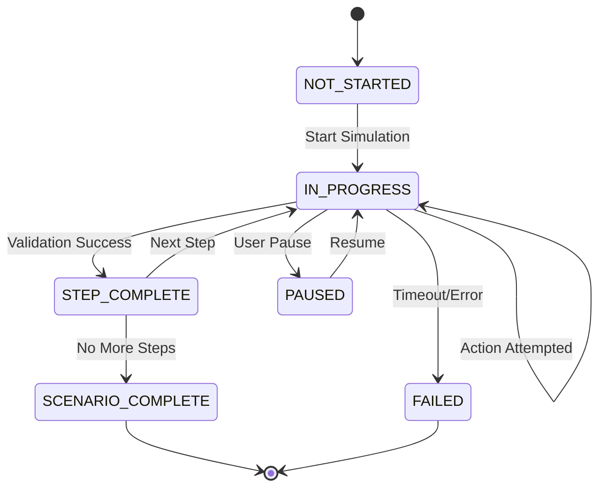
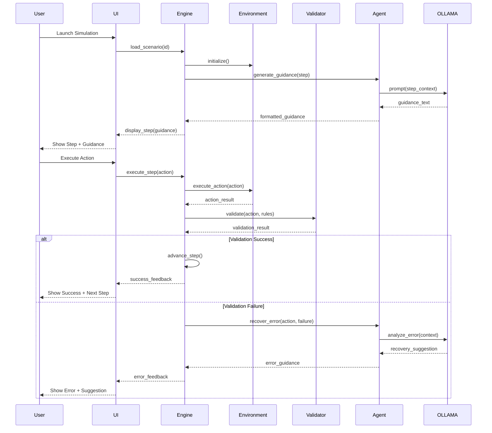
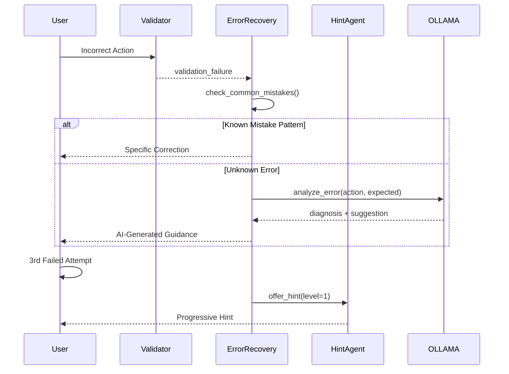

# SimulationPlayer System Architecture

## System Overview

### Purpose
SimulationPlayer is an AI-powered, step-by-step interactive simulation extension for CoursePlayerApp that bridges the gap between passive learning and real-world technical practice. It provides learners with hands-on experience in a safe, guided environment with intelligent assistance, validation, and error recovery.

### Goals
- **Interactive Learning**: Transform passive course consumption into active skill development
- **AI-Powered Guidance**: Provide personalized, progressive assistance without spoiling solutions
- **Real-World Practice**: Enable learners to practice actual tools, commands, and workflows
- **Safe Sandbox**: Allow experimentation without fear of breaking systems
- **Adaptive Support**: Adjust difficulty and hints based on learner performance
- **Comprehensive Coverage**: Support diverse technical domains (DevOps, data science, cloud, ML)

### How It Extends CoursePlayerApp
SimulationPlayer integrates with CoursePlayerApp as a plugin/extension module:
- **Launch Point**: Simulations are launched from lab pages within course content
- **Progress Tracking**: Simulation completion is tracked and synced with course progress
- **Tier Integration**: Respects CoursesGTM tier-based access control
- **Seamless UX**: Embedded within CoursePlayerApp's Streamlit interface
- **Analytics Integration**: Feeds performance data back to course analytics

---

## High-Level Architecture

```mermaid
graph TB
    subgraph "CoursePlayerApp Integration"
        CPA[CoursePlayerApp]
        LM[Lab Module]
    end
    
    subgraph "SimulationPlayer Core"
        SO[Simulation Orchestrator]
        SM[State Machine]
        VM[Validation Manager]
        CM[Checkpoint Manager]
    end
    
    subgraph "Environment Types"
        TE[Terminal Simulator]
        CE[Code Editor]
        IB[Infrastructure Builder]
        DB[Database Query]
        API[API Interaction]
        ML[ML Pipeline Builder]
        DC[Docker Compose Designer]
    end
    
    subgraph "AI Guidance Agents"
        SG[Step Guide Agent]
        VA[Validation Agent]
        ER[Error Recovery Agent]
        HA[Hint Agent]
        CA[Context Agent]
    end
    
    subgraph "External Integrations"
        OLLAMA[OLLAMA LLM]
        DOCKER[Docker Engine]
        JUPYTER[JupyterLab]
        DBS[Databases]
        CLOUD[Cloud Sandbox]
    end
    
    subgraph "UI Layer"
        UI[Streamlit Components]
        PROGRESS[Progress Panel]
        FEEDBACK[Feedback Display]
        ENV_UI[Environment UIs]
    end
    
    subgraph "Data Layer"
        SCENARIOS[Scenario YAML Files]
        STATE[State Storage]
        ANALYTICS[Analytics DB]
    end
    
    CPA --> LM
    LM --> SO
    SO --> SM
    SO --> VM
    SO --> CM
    
    SM --> TE
    SM --> CE
    SM --> IB
    SM --> DB
    SM --> API
    SM --> ML
    SM --> DC
    
    SO --> SG
    VM --> VA
    VM --> ER
    SO --> HA
    SO --> CA
    
    SG --> OLLAMA
    ER --> OLLAMA
    CA --> OLLAMA
    
    TE --> DOCKER
    CE --> JUPYTER
    DB --> DBS
    
    SO --> UI
    UI --> PROGRESS
    UI --> FEEDBACK
    UI --> ENV_UI
    
    SO --> SCENARIOS
    SM --> STATE
    SO --> ANALYTICS
    
    style SO fill:#4CAF50
    style UI fill:#2196F3
    style OLLAMA fill:#FF9800
```



---

## Component Breakdown

### Core Components

#### 1. Simulation Engine
**Responsibility**: Orchestrate the entire simulation lifecycle

**Key Functions**:
- Load scenario definitions from YAML
- Initialize appropriate environment type
- Coordinate agent interactions
- Manage step progression
- Handle user actions
- Trigger validations
- Update UI state

**Interfaces**:
```python
class SimulationEngine:
    def load_scenario(scenario_id: str) -> Scenario
    def initialize_environment(env_type: str) -> Environment
    def execute_step(step_id: str, user_action: Action) -> StepResult
    def validate_action(action: Action, validation_rules: list) -> ValidationResult
    def get_ai_guidance(step: Step, context: dict) -> str
    def save_checkpoint() -> CheckpointData
    def restore_checkpoint(checkpoint: CheckpointData) -> None
```

#### 2. State Machine
**Responsibility**: Manage simulation state transitions

**States**:
- `NOT_STARTED`: Initial state
- `IN_PROGRESS`: User actively working on step
- `STEP_COMPLETE`: Current step validated successfully
- `SCENARIO_COMPLETE`: All steps finished
- `PAUSED`: User paused simulation
- `FAILED`: Unrecoverable error (rare)

**State Transitions**:


**Data Model**:
```python
@dataclass
class SimulationState:
    scenario_id: str
    current_step: int
    step_states: dict[str, StepState]
    environment_state: dict
    user_context: UserContext
    start_time: datetime
    checkpoints: list[Checkpoint]
```

#### 3. Validator
**Responsibility**: Verify user actions meet step requirements

**Validation Types**:
- **Rule-Based**: Predefined patterns (regex, exact match, contains)
- **Functional**: Execute code/command and check output
- **State-Based**: Verify environment state changes
- **Multi-Criteria**: Combine multiple validation rules

**Validation Pipeline**:
```python
class Validator:
    def validate(self, action: Action, rules: list[ValidationRule]) -> ValidationResult:
        results = []
        for rule in rules:
            if rule.type == 'command_exact':
                results.append(self._validate_exact_match(action, rule))
            elif rule.type == 'command_regex':
                results.append(self._validate_regex(action, rule))
            elif rule.type == 'output_contains':
                results.append(self._validate_output(action, rule))
            elif rule.type == 'file_exists':
                results.append(self._validate_file_state(action, rule))
            # ... more validation types
        
        return self._aggregate_results(results, rules)
```

#### 4. Checkpoint Manager
**Responsibility**: Enable save/resume functionality

**Features**:
- Auto-save after each step completion
- Manual checkpoint creation
- Checkpoint restoration
- Checkpoint metadata (timestamp, step, attempts)

**Storage**:
```python
class CheckpointManager:
    def create_checkpoint(self, state: SimulationState) -> Checkpoint
    def save_checkpoint(self, checkpoint: Checkpoint) -> str  # Returns checkpoint_id
    def load_checkpoint(self, checkpoint_id: str) -> SimulationState
    def list_checkpoints(self, scenario_id: str) -> list[Checkpoint]
```

---

### Environment Components

Each environment type extends a base `Environment` class:

```python
class Environment(ABC):
    @abstractmethod
    def initialize(self, initial_state: dict) -> None
    
    @abstractmethod
    def execute_action(self, action: Action) -> ActionResult
    
    @abstractmethod
    def get_state(self) -> dict
    
    @abstractmethod
    def reset(self) -> None
    
    @abstractmethod
    def cleanup(self) -> None
```

#### Environment Types
1. **TerminalSimulator**: Sandboxed shell environment with virtual filesystem
2. **CodeEditor**: Monaco-based code editing with execution
3. **InfrastructureBuilder**: Drag-drop cloud/container architecture designer
4. **DatabaseQuery**: SQL editor with sample databases
5. **APIInteraction**: REST/GraphQL request builder and tester
6. **MLPipelineBuilder**: Visual ML workflow designer
7. **DockerCompose**: Interactive docker-compose.yml builder

*(See ENVIRONMENT_TYPES.md for detailed specifications)*

---

### AI Agent Components

All agents use OLLAMA for local LLM inference:

```python
class BaseAgent(ABC):
    def __init__(self, model: str, ollama_endpoint: str):
        self.model = model
        self.ollama = OllamaClient(ollama_endpoint)
    
    @abstractmethod
    def generate_response(self, context: dict) -> str
```

#### Agent Types
1. **StepGuideAgent**: Contextual step explanations
2. **ValidationAgent**: Rule-based action validation
3. **ErrorRecoveryAgent**: Mistake diagnosis and correction
4. **HintAgent**: Progressive hint generation
5. **ContextAgent**: Question answering with RAG

*(See AGENT_SYSTEM.md for detailed specifications)*

---

### UI Components (Streamlit)

#### Component Hierarchy
```
SimulationPlayerApp
├── ProgressIndicator
├── StepPanel
│   ├── StepDescription
│   ├── AIGuidance
│   └── EnvironmentUI (varies by type)
├── SidebarPanels
│   ├── HintPanel (collapsible)
│   ├── AIAssistant (collapsible)
│   └── StatsPanel
└── FeedbackDisplay
```

#### Key UI Elements
- **Progress Bar**: Visual step completion tracker
- **Step Description**: Current objective and context
- **AI Guidance**: Dynamic guidance from Step Guide Agent
- **Environment UI**: Type-specific interaction area (terminal, editor, etc.)
- **Hint Panel**: Progressive hint system
- **AI Assistant**: Chat interface for questions
- **Stats Panel**: Real-time performance metrics
- **Feedback Display**: Success/error messages with recovery suggestions

*(See UI_DESIGN.md for detailed specifications)*

---

### Scenario System

#### Scenario Definition
Scenarios are defined in YAML format:
- Human-readable
- Version-controlled
- Validatable against JSON Schema
- Easily authorable by non-developers

#### Scenario Loader
```python
class ScenarioLoader:
    def load_scenario(self, scenario_id: str) -> Scenario:
        yaml_path = self._find_scenario_file(scenario_id)
        scenario_data = yaml.safe_load(yaml_path)
        validated_data = self._validate_schema(scenario_data)
        return Scenario.from_dict(validated_data)
    
    def validate_scenario(self, scenario_data: dict) -> ValidationReport
```

*(See SCENARIO_AUTHORING.md for schema and authoring guide)*

---

### Integration Layer

#### Integration Points
1. **CoursePlayerApp**: Plugin registration, launch, progress sync
2. **CoursesGTM**: Tier-based access control, progress tracking
3. **Docker**: Container orchestration, sandboxing
4. **JupyterLab**: Code execution, notebook integration
5. **Databases**: SQLite/DuckDB for SQL simulations
6. **OLLAMA**: Local LLM inference for all AI agents
7. **Cloud Sandbox** (Optional): AWS/GCP/Azure playground accounts

*(See INTEGRATIONS.md for detailed specifications)*

---

### Analytics System

#### Tracked Metrics
- **Completion Metrics**: Rates, times, abandonment points
- **Performance Metrics**: Attempts per step, hints used, errors
- **Engagement Metrics**: AI assistant usage, hint progression
- **Learning Metrics**: Improvement trends, common mistakes

#### Analytics Engine
```python
class AnalyticsEngine:
    def track_event(self, event: SimulationEvent) -> None
    def get_scenario_stats(self, scenario_id: str) -> ScenarioStats
    def get_user_progress(self, user_id: str) -> UserProgress
    def generate_insights(self, scenario_id: str) -> list[Insight]
```

*(See ANALYTICS.md for detailed specifications)*

---

## Technology Stack

### Backend
- **Python 3.10+**: Core language
- **PyYAML**: Scenario definition parsing
- **Pydantic**: Data validation and modeling
- **Docker SDK for Python**: Container orchestration
- **SQLite/DuckDB**: Embedded databases for SQL simulations
- **Jupyter Client**: Code execution integration

### AI/LLM
- **OLLAMA**: Local LLM inference server
- **llama3.2:3b**: Lightweight model for Step Guide, Error Recovery
- **llama3.1:8b**: More capable model for Context Agent
- **LangChain** (Optional): RAG implementation for Context Agent

### Frontend
- **Streamlit**: UI framework
- **streamlit-monaco**: Monaco editor integration
- **streamlit-agraph**: Graph/diagram visualization
- **Plotly**: Analytics charts
- **Mermaid.js**: Architecture diagrams

### Containerization
- **Docker**: Sandboxed execution environments
- **Docker Compose**: Multi-container scenarios

### Data Storage
- **JSON**: Checkpoint serialization
- **YAML**: Scenario definitions
- **SQLite**: Analytics database

### Development Tools
- **pytest**: Testing framework
- **black**: Code formatting
- **mypy**: Type checking
- **jsonschema**: Scenario validation

---

## Data Flow

### Primary User Flow


### Error Recovery Flow


---

## State Management

### Simulation State
The simulation state is a comprehensive snapshot of all simulation data:

```python
@dataclass
class SimulationState:
    # Identification
    scenario_id: str
    user_id: str
    session_id: str
    
    # Progress
    current_step: int
    total_steps: int
    step_states: dict[str, StepState]
    
    # Environment
    environment_type: str
    environment_state: dict  # Environment-specific state
    
    # Performance
    start_time: datetime
    step_start_time: datetime
    total_attempts: int
    hints_used: int
    errors_encountered: list[Error]
    
    # Checkpoints
    checkpoints: list[Checkpoint]
    last_checkpoint_time: datetime
```

### Step State
```python
@dataclass
class StepState:
    step_id: str
    status: StepStatus  # NOT_STARTED, IN_PROGRESS, COMPLETED, SKIPPED
    attempts: int
    hints_used: int
    time_spent: timedelta
    validation_results: list[ValidationResult]
    user_actions: list[Action]
    completed_at: Optional[datetime]
```

### State Persistence
- **Auto-save**: After each step completion
- **Manual save**: User-triggered checkpoints
- **Resume**: Load last checkpoint on session resume
- **Serialization**: JSON format for all state data

---

## Tier Integration (CoursesGTM)

SimulationPlayer features are gated by user tier:

### Basic Tier
- **Access**: View-only demo walkthroughs
- **Features**:
  - Watch pre-recorded simulation completions
  - Read step descriptions and expected outcomes
  - No interactive execution
  - No AI assistance
- **Purpose**: Provide exposure to simulations, encourage upgrade

### Intermediate Tier
- **Access**: Full guided simulations
- **Features**:
  - Interactive step-by-step execution
  - AI-powered guidance and hints
  - Error recovery assistance
  - Checkpoint save/resume
  - All 7 environment types
  - All 5 AI agents
- **Purpose**: Primary simulation experience

### Advanced Tier
- **Access**: Freeform practice mode + guided simulations
- **Features**:
  - All Intermediate features
  - Freeform practice mode (no hints, timed challenges)
  - Cloud sandbox integration (AWS/GCP/Azure)
  - Advanced scenarios with real infrastructure
  - Performance leaderboards
  - Custom scenario creation tools
- **Purpose**: Advanced learners, professional practice

### Tier Enforcement
```python
class TierGate:
    def check_access(self, user_tier: str, feature: str) -> bool:
        tier_features = {
            'basic': ['view_demo'],
            'intermediate': ['view_demo', 'interactive_simulation', 'ai_guidance'],
            'advanced': ['view_demo', 'interactive_simulation', 'ai_guidance', 
                        'freeform_mode', 'cloud_sandbox', 'custom_scenarios']
        }
        return feature in tier_features.get(user_tier, [])
```

---

## Security Considerations

### Sandboxing
- All code execution in isolated Docker containers
- No network access from simulation containers
- Read-only filesystem mounts where appropriate
- Resource limits (CPU, memory, disk, time)

### Container Security
```dockerfile
# Example container constraints
FROM python:3.10-slim
RUN useradd -m -u 1000 simuser
USER simuser
WORKDIR /simulation
# No sudo, no privileged operations
```

### Timeout Protection
- 5-minute timeout per step execution
- Automatic container cleanup on timeout
- Graceful error handling

### Data Privacy
- No sensitive data in scenarios
- User actions logged but anonymized in analytics
- Checkpoint data encrypted at rest

---

## Scalability Considerations

### Horizontal Scaling
- Stateless simulation engine (state in external storage)
- Container orchestration via Kubernetes (future)
- OLLAMA API can be deployed as separate service

### Performance Optimization
- OLLAMA response caching for repeated queries
- Lazy loading of environment UIs
- Progressive loading of scenario steps
- Docker image pre-warming

### Resource Management
- Container pooling for faster startup
- Automatic cleanup of inactive containers
- Disk space monitoring and cleanup

---

## Future Enhancements

### Planned Features
1. **Collaborative Simulations**: Multi-user scenarios (e.g., DevOps team exercises)
2. **Live Leaderboards**: Real-time competition mode
3. **Scenario Marketplace**: Community-contributed scenarios
4. **AR/VR Integration**: Immersive infrastructure visualization
5. **Real Cloud Integration**: Temporary AWS/GCP/Azure accounts
6. **Video Recording**: Capture and share simulation completions
7. **Adaptive AI**: ML-powered hint timing and difficulty adjustment

### Research Areas
- **Automated Scenario Generation**: Use LLMs to create scenarios from documentation
- **Peer Learning**: Show anonymized approaches from other learners
- **Gamification**: Badges, achievements, progression trees
- **Skill Certification**: Verified completion certificates

---

## Conclusion

SimulationPlayer is designed as a comprehensive, AI-powered learning environment that provides:
- **Safe Practice**: Learn by doing without risk
- **Intelligent Guidance**: AI assistance that teaches, not spoils
- **Real-World Skills**: Practice actual tools and workflows
- **Adaptive Learning**: Personalized to learner's pace and skill
- **Scalable Platform**: Extensible to new domains and use cases

The architecture balances simplicity (YAML scenarios, local LLMs) with power (7 environment types, 5 AI agents) to create an engaging, effective learning experience that bridges the gap between theory and practice.
