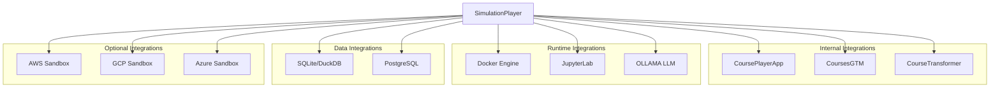

# SimulationPlayer Integrations

This document specifies how SimulationPlayer integrates with external systems and platforms.

---

## Integration Architecture



---

## 1. CoursePlayerApp Integration

### Overview
SimulationPlayer extends CoursePlayerApp as a plugin module, providing interactive lab simulations within the course viewing experience.

### Integration Points

#### 1.1 Plugin Registration

```python
# In CoursePlayerApp
from simulationplayer import SimulationPlayerPlugin

# Register plugin
course_player.register_plugin(
    'simulations',
    SimulationPlayerPlugin(),
    routes=['/simulation/<scenario_id>']
)
```

#### 1.2 Launch from Lab Pages

```markdown
<!-- In course markdown content -->
# Docker Tutorial

Learn Docker basics through hands-on practice.

[🎮 Start Interactive Lab](simulation://docker-first-container)
```

```python
# CoursePlayerApp renders special links
def render_content(markdown_content):
    # Detect simulation:// links
    if 'simulation://' in markdown_content:
        scenario_id = extract_scenario_id(markdown_content)
        return render_simulation_launcher(scenario_id)
```

#### 1.3 Embedded Simulation View

```python
# Launch simulation in iframe or modal
def launch_simulation(scenario_id: str):
    return st.components.v1.iframe(
        src=f"/simulation/{scenario_id}",
        height=800,
        scrolling=True
    )
```

#### 1.4 Progress Sync

```python
# SimulationPlayer reports completion to CoursePlayerApp
class SimulationProgressSync:
    def on_scenario_complete(self, scenario_id: str, user_id: str, stats: dict):
        # Update course progress
        course_player.update_progress(
            user_id=user_id,
            item_type='simulation',
            item_id=scenario_id,
            status='completed',
            stats=stats
        )
        
        # Unlock next item
        course_player.unlock_next_item(user_id, scenario_id)
```

#### 1.5 Navigation Integration

```python
# Breadcrumb: Course > Module > Lesson > Simulation
def render_breadcrumb():
    st.write(f"{course.title} > {module.title} > {lesson.title} > {scenario.title}")
```

---

## 2. CoursesGTM Integration

### Overview
SimulationPlayer respects tier-based access control from CoursesGTM and syncs completion data for progress tracking.

### Tier-Based Feature Gating

#### 2.1 Access Control

```python
class TierGate:
    TIER_FEATURES = {
        'basic': ['view_demo'],
        'intermediate': [
            'view_demo',
            'interactive_simulation',
            'ai_guidance',
            'hints',
            'checkpoints'
        ],
        'advanced': [
            'view_demo',
            'interactive_simulation',
            'ai_guidance',
            'hints',
            'checkpoints',
            'freeform_mode',
            'cloud_sandbox',
            'custom_scenarios',
            'performance_analytics'
        ]
    }
    
    def check_access(self, user_tier: str, feature: str) -> bool:
        return feature in self.TIER_FEATURES.get(user_tier, [])
    
    def get_scenario_access(self, user_tier: str, scenario: Scenario) -> str:
        if scenario.tier_access == 'basic':
            return 'full'  # All tiers can access basic scenarios
        elif scenario.tier_access == 'intermediate':
            return 'full' if user_tier in ['intermediate', 'advanced'] else 'demo'
        elif scenario.tier_access == 'advanced':
            return 'full' if user_tier == 'advanced' else 'demo'
```

#### 2.2 Feature Availability by Tier

| Feature | Basic | Intermediate | Advanced |
|---------|-------|--------------|----------|
| View demo walkthrough | ✅ | ✅ | ✅ |
| Interactive execution | ❌ | ✅ | ✅ |
| AI guidance | ❌ | ✅ | ✅ |
| Progressive hints | ❌ | ✅ | ✅ |
| Save/Resume | ❌ | ✅ | ✅ |
| Freeform practice mode | ❌ | ❌ | ✅ |
| Cloud sandbox | ❌ | ❌ | ✅ |
| Custom scenarios | ❌ | ❌ | ✅ |
| Performance analytics | ❌ | ❌ | ✅ |

#### 2.3 Upgrade Prompts

```python
def render_upgrade_prompt(user_tier: str, scenario: Scenario):
    if user_tier == 'basic' and scenario.tier_access != 'basic':
        st.warning(f"""
        🔒 This interactive simulation requires **{scenario.tier_access.title()}** tier.
        
        You're currently on the **Basic** tier. Upgrade to:
        - Execute commands interactively
        - Get AI-powered guidance
        - Save your progress
        
        [⬆️ Upgrade Now](https://courses.example.com/upgrade)
        """)
```

#### 2.4 Progress Tracking API

```python
class CoursesGTMProgressAPI:
    def __init__(self, api_key: str):
        self.api_key = api_key
        self.base_url = "https://api.coursesgtm.com/v1"
    
    def track_simulation_start(self, user_id: str, scenario_id: str):
        requests.post(
            f"{self.base_url}/progress/simulation/start",
            headers={'Authorization': f'Bearer {self.api_key}'},
            json={
                'user_id': user_id,
                'scenario_id': scenario_id,
                'timestamp': datetime.now().isoformat()
            }
        )
    
    def track_simulation_complete(self, user_id: str, scenario_id: str, stats: dict):
        requests.post(
            f"{self.base_url}/progress/simulation/complete",
            headers={'Authorization': f'Bearer {self.api_key}'},
            json={
                'user_id': user_id,
                'scenario_id': scenario_id,
                'stats': stats,
                'timestamp': datetime.now().isoformat()
            }
        )
    
    def track_step_complete(self, user_id: str, scenario_id: str, step_id: str, attempts: int):
        requests.post(
            f"{self.base_url}/progress/simulation/step",
            headers={'Authorization': f'Bearer {self.api_key}'},
            json={
                'user_id': user_id,
                'scenario_id': scenario_id,
                'step_id': step_id,
                'attempts': attempts,
                'timestamp': datetime.now().isoformat()
            }
        )
```

---

## 3. Docker Integration

### Overview
Docker provides sandboxed execution environments for terminal, code editor, and docker-compose simulations.

### Container Lifecycle

#### 3.1 Container Creation

```python
import docker

class DockerIntegration:
    def __init__(self):
        self.client = docker.from_env()
    
    def create_simulation_container(self, scenario_id: str, user_id: str) -> docker.models.containers.Container:
        container = self.client.containers.run(
            image='simulationplayer/runtime:latest',
            name=f'sim-{scenario_id}-{user_id}',
            detach=True,
            stdin_open=True,
            tty=True,
            
            # Security
            network_disabled=True,  # No internet access
            read_only=False,  # Need write for commands
            
            # Resource limits
            mem_limit='512m',
            memswap_limit='512m',
            cpu_period=100000,
            cpu_quota=50000,  # 50% of one CPU
            
            # Timeout
            stop_timeout=300,  # 5 minutes
            
            # Volumes (read-only mounts for course materials)
            volumes={
                '/course-materials': {'bind': '/readonly', 'mode': 'ro'}
            },
            
            # Environment
            environment={
                'SCENARIO_ID': scenario_id,
                'USER_ID': user_id
            }
        )
        
        return container
```

#### 3.2 Command Execution

```python
def execute_command(self, container: Container, command: str) -> dict:
    try:
        exec_result = container.exec_run(
            cmd=f'/bin/bash -c "{command}"',
            stdout=True,
            stderr=True,
            stdin=False,
            tty=False,
            demux=True,
            environment={'TERM': 'xterm'}
        )
        
        return {
            'exit_code': exec_result.exit_code,
            'stdout': exec_result.output[0].decode('utf-8') if exec_result.output[0] else '',
            'stderr': exec_result.output[1].decode('utf-8') if exec_result.output[1] else ''
        }
    except docker.errors.APIError as e:
        return {
            'exit_code': -1,
            'stdout': '',
            'stderr': f'Docker error: {str(e)}'
        }
```

#### 3.3 Container Cleanup

```python
def cleanup_container(self, container: Container):
    try:
        container.stop(timeout=5)
        container.remove(force=True)
    except docker.errors.APIError:
        # Container already removed
        pass
```

#### 3.4 Pre-Warming Containers

```python
# Pool of pre-warmed containers for faster startup
class ContainerPool:
    def __init__(self, pool_size: int = 5):
        self.pool = []
        self.pool_size = pool_size
        self._initialize_pool()
    
    def _initialize_pool(self):
        for _ in range(self.pool_size):
            container = self.create_simulation_container('warmup', 'pool')
            self.pool.append(container)
    
    def get_container(self, scenario_id: str, user_id: str) -> Container:
        if self.pool:
            container = self.pool.pop()
            # Reconfigure for actual use
            return container
        else:
            # Pool empty, create new
            return self.create_simulation_container(scenario_id, user_id)
```

---

## 4. JupyterLab Integration

### Overview
JupyterLab provides code execution capabilities for code_editor environment type.

### Integration Approach

#### 4.1 Jupyter Kernel Management

```python
from jupyter_client import KernelManager

class JupyterIntegration:
    def __init__(self):
        self.kernels = {}
    
    def start_kernel(self, user_id: str, language: str = 'python') -> str:
        km = KernelManager(kernel_name=language)
        km.start_kernel()
        
        kernel_id = f"{user_id}_{uuid.uuid4().hex[:8]}"
        self.kernels[kernel_id] = km
        
        return kernel_id
    
    def execute_code(self, kernel_id: str, code: str, timeout: int = 5) -> dict:
        km = self.kernels[kernel_id]
        kc = km.client()
        
        # Execute code
        msg_id = kc.execute(code)
        
        # Collect output
        output = []
        while True:
            try:
                msg = kc.get_iopub_msg(timeout=timeout)
                
                if msg['msg_type'] == 'stream':
                    output.append(msg['content']['text'])
                elif msg['msg_type'] == 'execute_result':
                    output.append(str(msg['content']['data']))
                elif msg['msg_type'] == 'error':
                    output.append('\n'.join(msg['content']['traceback']))
                elif msg['msg_type'] == 'status':
                    if msg['content']['execution_state'] == 'idle':
                        break
            except:
                break
        
        return {
            'output': '\n'.join(output),
            'success': True
        }
    
    def stop_kernel(self, kernel_id: str):
        if kernel_id in self.kernels:
            km = self.kernels[kernel_id]
            km.shutdown_kernel()
            del self.kernels[kernel_id]
```

---

## 5. Database Integrations

### 5.1 SQLite/DuckDB (In-Memory)

```python
import duckdb

class DatabaseIntegration:
    def __init__(self):
        self.connections = {}
    
    def create_database(self, scenario_id: str, schema_file: str, data_file: str) -> str:
        # Create in-memory database
        conn = duckdb.connect(':memory:')
        
        # Load schema
        with open(schema_file) as f:
            conn.execute(f.read())
        
        # Load data
        with open(data_file) as f:
            conn.execute(f.read())
        
        db_id = f"db_{scenario_id}_{uuid.uuid4().hex[:8]}"
        self.connections[db_id] = conn
        
        return db_id
    
    def execute_query(self, db_id: str, query: str) -> dict:
        conn = self.connections[db_id]
        
        try:
            # Set timeout
            conn.execute("SET statement_timeout = 5000")  # 5 seconds
            
            # Execute query
            result = conn.execute(query)
            
            # Fetch results
            rows = result.fetchall()
            columns = [desc[0] for desc in result.description]
            
            return {
                'success': True,
                'rows': rows,
                'columns': columns,
                'row_count': len(rows)
            }
        except Exception as e:
            return {
                'success': False,
                'error': str(e)
            }
```

### 5.2 PostgreSQL (Optional, for Advanced Scenarios)

```python
import psycopg2

class PostgreSQLIntegration:
    def __init__(self, connection_string: str):
        self.connection_string = connection_string
    
    def create_sandbox_database(self, user_id: str) -> str:
        # Create isolated database for user
        db_name = f"sandbox_{user_id}"
        
        conn = psycopg2.connect(self.connection_string)
        conn.autocommit = True
        cursor = conn.cursor()
        
        # Create database
        cursor.execute(f"CREATE DATABASE {db_name}")
        
        # Set up permissions (read-only for sample data)
        cursor.execute(f"GRANT CONNECT ON DATABASE {db_name} TO {user_id}")
        
        cursor.close()
        conn.close()
        
        return db_name
    
    def cleanup_database(self, db_name: str):
        conn = psycopg2.connect(self.connection_string)
        conn.autocommit = True
        cursor = conn.cursor()
        
        cursor.execute(f"DROP DATABASE IF EXISTS {db_name}")
        
        cursor.close()
        conn.close()
```

---

## 6. OLLAMA Integration

### Overview
OLLAMA provides local LLM inference for all AI agents without cloud dependencies.

### Setup and Configuration

#### 6.1 OLLAMA Client

```python
import requests

class OllamaClient:
    def __init__(self, endpoint: str = "http://localhost:11434"):
        self.endpoint = endpoint
    
    def generate(self, model: str, prompt: str, system: str = None, 
                 options: dict = None) -> dict:
        payload = {
            'model': model,
            'prompt': prompt,
            'stream': False
        }
        
        if system:
            payload['system'] = system
        
        if options:
            payload['options'] = options
        
        response = requests.post(
            f"{self.endpoint}/api/generate",
            json=payload
        )
        
        return response.json()
    
    def list_models(self) -> list:
        response = requests.get(f"{self.endpoint}/api/tags")
        return response.json()['models']
    
    def pull_model(self, model: str):
        requests.post(
            f"{self.endpoint}/api/pull",
            json={'name': model}
        )
```

#### 6.2 Model Configuration

```python
OLLAMA_MODELS = {
    'step_guide': 'llama3.2:3b',        # Fast, concise
    'error_recovery': 'llama3.2:3b',    # Fast, pattern matching
    'hint_agent': 'llama3.2:3b',        # Fast, progressive
    'context_agent': 'llama3.1:8b',     # More capable, knowledge-intensive
}

# Ensure models are pulled
def setup_ollama():
    client = OllamaClient()
    
    for model in set(OLLAMA_MODELS.values()):
        if model not in [m['name'] for m in client.list_models()]:
            print(f"Pulling {model}...")
            client.pull_model(model)
```

#### 6.3 Caching Strategy

```python
class OllamaCache:
    def __init__(self, ttl: int = 3600):
        self.cache = {}
        self.ttl = ttl
    
    def get(self, key: str) -> Optional[str]:
        if key in self.cache:
            entry = self.cache[key]
            if time.time() - entry['timestamp'] < self.ttl:
                return entry['response']
        return None
    
    def set(self, key: str, response: str):
        self.cache[key] = {
            'response': response,
            'timestamp': time.time()
        }
    
    def generate_key(self, model: str, prompt: str, system: str) -> str:
        content = f"{model}:{system}:{prompt}"
        return hashlib.md5(content.encode()).hexdigest()
```

---

## 7. Cloud Sandbox Integration (Optional - Advanced Tier)

### 7.1 AWS Sandbox

```python
import boto3

class AWSSandboxIntegration:
    def __init__(self, access_key: str, secret_key: str, region: str = 'us-east-1'):
        self.session = boto3.Session(
            aws_access_key_id=access_key,
            aws_secret_access_key=secret_key,
            region_name=region
        )
    
    def create_sandbox_account(self, user_id: str) -> dict:
        # Create temporary IAM user with limited permissions
        iam = self.session.client('iam')
        
        username = f"sandbox-{user_id}"
        
        # Create user
        user = iam.create_user(UserName=username)
        
        # Attach limited policy (e.g., only EC2 in specific region)
        policy_arn = 'arn:aws:iam::aws:policy/ReadOnlyAccess'
        iam.attach_user_policy(UserName=username, PolicyArn=policy_arn)
        
        # Create access keys
        access_keys = iam.create_access_key(UserName=username)
        
        return {
            'username': username,
            'access_key': access_keys['AccessKey']['AccessKeyId'],
            'secret_key': access_keys['AccessKey']['SecretAccessKey']
        }
    
    def cleanup_sandbox_account(self, username: str):
        iam = self.session.client('iam')
        
        # Delete access keys
        access_keys = iam.list_access_keys(UserName=username)
        for key in access_keys['AccessKeyMetadata']:
            iam.delete_access_key(
                UserName=username,
                AccessKeyId=key['AccessKeyId']
            )
        
        # Detach policies
        attached_policies = iam.list_attached_user_policies(UserName=username)
        for policy in attached_policies['AttachedPolicies']:
            iam.detach_user_policy(
                UserName=username,
                PolicyArn=policy['PolicyArn']
            )
        
        # Delete user
        iam.delete_user(UserName=username)
```

### 7.2 Cost Tracking

```python
class CloudCostTracker:
    def __init__(self):
        self.usage = {}
    
    def track_resource_creation(self, user_id: str, resource_type: str, cost: float):
        if user_id not in self.usage:
            self.usage[user_id] = {'total_cost': 0, 'resources': []}
        
        self.usage[user_id]['total_cost'] += cost
        self.usage[user_id]['resources'].append({
            'type': resource_type,
            'cost': cost,
            'timestamp': datetime.now()
        })
    
    def check_budget_limit(self, user_id: str, limit: float = 5.0) -> bool:
        if user_id not in self.usage:
            return True
        return self.usage[user_id]['total_cost'] < limit
```

---

## 8. CourseTransformer Integration

### Overview
CourseTransformer can generate simulation scenarios as part of course creation.

```python
class CourseTransformerIntegration:
    def generate_simulation_from_content(self, course_section: str) -> dict:
        # CourseTransformer analyzes course content and generates scenarios
        # This is a placeholder for the integration
        
        return {
            'scenario_id': 'auto-generated-scenario',
            'yaml_content': '...',
            'suggested_placement': 'After section 3.2'
        }
```

---

## Integration Security

### API Key Management

```python
import os

class SecureConfig:
    @staticmethod
    def get_api_key(service: str) -> str:
        key = os.environ.get(f'{service.upper()}_API_KEY')
        if not key:
            raise ValueError(f"Missing API key for {service}")
        return key

# Usage
ollama_endpoint = os.environ.get('OLLAMA_ENDPOINT', 'http://localhost:11434')
gtm_api_key = SecureConfig.get_api_key('coursesgtm')
```

### Rate Limiting

```python
from functools import wraps
import time

class RateLimiter:
    def __init__(self, max_calls: int, period: int):
        self.max_calls = max_calls
        self.period = period
        self.calls = []
    
    def __call__(self, func):
        @wraps(func)
        def wrapper(*args, **kwargs):
            now = time.time()
            self.calls = [c for c in self.calls if c > now - self.period]
            
            if len(self.calls) >= self.max_calls:
                raise Exception("Rate limit exceeded")
            
            self.calls.append(now)
            return func(*args, **kwargs)
        
        return wrapper

# Usage
@RateLimiter(max_calls=100, period=60)  # 100 calls per minute
def call_ollama_api(prompt: str):
    pass
```

---

## Deployment Considerations

### Docker Compose for Development

```yaml
version: '3.8'

services:
  simulationplayer:
    build: .
    ports:
      - "8501:8501"
    environment:
      - OLLAMA_ENDPOINT=http://ollama:11434
      - COURSESGTM_API_KEY=${COURSESGTM_API_KEY}
    depends_on:
      - ollama
      - postgres
    volumes:
      - ./scenarios:/app/scenarios
  
  ollama:
    image: ollama/ollama:latest
    ports:
      - "11434:11434"
    volumes:
      - ollama-models:/root/.ollama
  
  postgres:
    image: postgres:15
    environment:
      - POSTGRES_DB=simulationplayer
      - POSTGRES_USER=simuser
      - POSTGRES_PASSWORD=${POSTGRES_PASSWORD}
    volumes:
      - postgres-data:/var/lib/postgresql/data

volumes:
  ollama-models:
  postgres-data:
```

---

This comprehensive integration specification enables SimulationPlayer to work seamlessly with existing systems while maintaining security, performance, and scalability.
